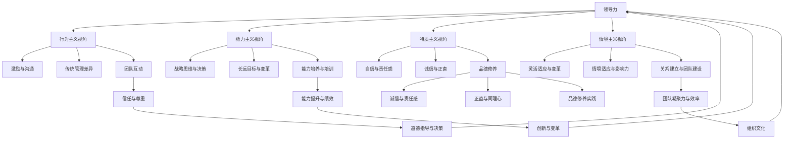

                 

### 第1章：领导力的本质与定义

#### 1.1 领导力的多维视角

领导力是一个复杂且多维的概念，可以从多个不同的视角进行理解。在探讨领导力的本质时，我们需要采用多维度的分析方法，以便全面地把握其内涵。

**行为主义视角**

从行为主义视角来看，领导力关注领导者的具体行为和动作。这些行为包括激励、沟通、决策等。在这个视角下，领导者的行为对于团队的绩效和氛围具有重要影响。例如，积极的激励可以提升团队成员的士气和工作效率，而有效的沟通能够减少误解和冲突，提高团队协作效率。

**能力主义视角**

能力主义视角则强调领导者的技能和才能。在这个视角下，领导者的能力成为评价其领导力的重要标准。这些能力包括战略思维、决策能力、沟通技巧等。一个具备强大能力的领导者能够在复杂多变的环境中做出明智的决策，并有效地传达和执行这些决策。

**特质主义视角**

特质主义视角研究领导者的个人特质和性格。这种观点认为，某些人格特质是与领导力紧密相关的，如自信、责任感、情商等。一个具有高尚人格特质的领导者往往能够赢得他人的信任和尊重，从而在团队中建立强大的影响力。

**情境主义视角**

情境主义视角认为，领导力随着环境的变化而变化。在不同的情境下，领导者需要采取不同的领导风格和策略。例如，在危机情况下，领导者可能需要采取果断的决策和行动；而在稳定的环境中，领导者则可以更注重长期规划和团队建设。

#### 1.2 领导力与传统管理的差异

领导力与传统管理之间存在显著差异，这些差异主要体现在目标导向、变革驱动、影响力和关系建立等方面。

**目标导向**

领导力更注重长远目标和愿景，而管理则侧重于日常运营和执行。领导者需要关注组织的未来发展，制定清晰的战略目标，并引导团队成员为实现这些目标而努力。相比之下，管理者更多关注当前的运营效率和任务完成情况。

**变革驱动**

领导力推动变革和创新，而管理则确保现有流程和制度的稳定运行。领导者需要具备前瞻性和创新意识，不断寻求改进和突破。管理者则致力于维护组织的稳定性和持续性，确保日常运营不受干扰。

**影响力**

领导力依赖个人魅力和影响力，而管理更多依赖于权力和权威。领导者通过个人魅力和影响力来激励和引导团队成员，而管理者则依靠职位和权力来执行和监督工作。

**关系建立**

领导力强调与团队成员的互动和关系建立，而管理则更多关注任务和目标。领导者需要建立良好的团队关系，促进团队成员之间的合作和沟通。管理者则更多关注任务的分配和执行，确保工作目标得到实现。

#### 1.3 领导力与品德修养的联系

品德修养是领导力的基石。高尚的品德不仅能够赢得他人的信任和尊重，还能够为领导者提供道德指导，使他们在面对复杂决策时保持正确的方向。

**诚信**

诚信是领导力的核心要素，它能够建立领导者的公信力和团队的信任基础。一个诚信的领导者会坚守承诺，真诚地对待团队成员，从而赢得他们的信任和尊重。

**责任感**

领导者应具备强烈的责任感，不仅对自己的行为负责，也要对团队成员和组织的成功负责。责任感使领导者能够在面对困难和挑战时保持坚定的信念和决心，为团队树立榜样。

**正直**

正直是领导力的重要特质，它要求领导者遵守道德规范，公正无私地处理事务。正直的领导者能够赢得团队成员的信赖，树立良好的形象，从而提高团队的凝聚力和士气。

**同理心**

同理心是领导者与团队成员建立良好关系的关键。领导者需要站在他人的角度思考问题，理解和关心团队成员的需求和感受。这种同理心能够增强团队的凝聚力和协作精神，提高团队的整体绩效。

通过上述分析，我们可以看到领导力与品德修养之间的紧密联系。一个高尚的品德修养不仅能够提升领导者的个人魅力和影响力，还能够为团队和组织的发展提供坚实的道德基础。在接下来的章节中，我们将进一步探讨品德修养的基本原则和实践路径，以帮助读者更好地理解领导力与品德修养的重要性。

### 背景介绍

领导力作为组织管理的重要组成部分，一直受到学术界和实践者的广泛关注。随着全球化、技术进步和组织结构复杂性的增加，领导力的重要性愈发凸显。一个有效的领导者不仅需要具备卓越的能力和技能，还需要拥有高尚的品德修养。在这篇文章中，我们将深入探讨领导力的本质与定义，以及领导力与品德修养之间的紧密联系。

领导力不仅仅是一种职位或角色的要求，更是一种能力、一种态度，一种在复杂环境中引导和激励团队实现共同目标的能力。领导力的影响范围广泛，从企业到政府，从教育到医疗，都离不开领导力的发挥。一个有效的领导者能够激发团队成员的潜力，提高团队的凝聚力和执行力，从而实现组织的长远发展。

品德修养是领导力的基石。高尚的品德不仅能够赢得他人的信任和尊重，还能够为领导者提供道德指导，使他们在面对复杂决策时保持正确的方向。诚信、责任感、正直和同理心等品德特质，是领导者不可或缺的品质。本文将详细阐述这些品德修养的重要性，并探讨它们如何影响领导力的发挥。

本文的结构如下：

首先，我们将从多维视角探讨领导力的本质，包括行为主义、能力主义、特质主义和情境主义等视角。接着，我们将分析领导力与传统管理的差异，并讨论领导力与品德修养之间的联系。随后，我们将介绍品德修养的基本原则和实践路径。

在接下来的部分，我们将通过实际案例，展示领导力与品德修养在组织管理中的具体应用。我们将讨论领导力在团队管理中的应用策略，以及品德修养对组织文化建设的价值。最后，我们将总结全文，提出对未来领导力与品德修养发展的展望，并给出一些最佳实践建议。

通过这篇文章，我们希望能够帮助读者深入理解领导力与品德修养的重要性，为实际工作和个人成长提供有益的参考。

### 核心概念与联系

领导力与品德修养是现代组织管理中至关重要的核心概念，它们之间存在着紧密的联系和互动。为了更好地理解这两个概念及其相互作用，我们可以通过一个Mermaid流程图来展示它们之间的联系。



通过这个Mermaid流程图，我们可以清晰地看到领导力与品德修养之间的相互联系。首先，领导力可以从四个不同的视角进行理解：行为主义视角关注领导者的具体行为和激励沟通；能力主义视角强调领导者的战略思维和决策能力；特质主义视角研究领导者的个人特质，如自信和责任感；情境主义视角则强调领导者需要根据不同情境灵活适应和变革。

这些领导力的不同视角都与品德修养有着密切的联系。例如，在行为主义视角下，领导者的诚信和正直能够建立团队的信任和尊重；在能力主义视角下，领导者的责任感和担当能够提升团队的整体绩效；在特质主义视角下，领导者的自信和责任感是高尚品德修养的具体体现；在情境主义视角下，领导者的正直和同理心能够促进团队凝聚力和效率。

此外，领导力与传统管理存在显著差异，如目标导向、变革驱动、影响力和关系建立。这些差异也体现了品德修养的重要性。例如，领导力的长远目标和变革驱动需要领导者的责任感和正直来支持；影响力依赖于领导者的个人魅力和品德修养；团队互动和关系建立需要领导者的同理心和品德修养来促进。

通过这个流程图，我们可以更深入地理解领导力与品德修养之间的互动关系。高尚的品德修养不仅是领导力的基石，也是领导者有效发挥领导力的重要保障。在接下来的章节中，我们将进一步探讨品德修养的基本原则和实践路径，以帮助读者更好地理解和应用这两个核心概念。

### 核心算法原理讲解

在探讨领导力的核心特质时，我们不可避免地会涉及到一些关键的算法原理，这些原理不仅帮助我们理解领导力的运作机制，还为实际应用提供了理论支持。下面，我们将通过伪代码来详细阐述这些核心算法原理，并附上相关的数学模型和公式。

#### 1. 自我认知与自我管理

自我认知是领导者自我提升的重要基础，而自我管理则是将自我认知转化为实际行动的过程。以下是一个简单的伪代码示例，用于描述自我认知和自我管理的过程：

```python
def selfAwarenessAndManagement():
    # 步骤1：评估自身优势和劣势
    strengths = assessStrengths()
    weaknesses = assessWeaknesses()

    # 步骤2：制定改进计划
    improvementPlan = createImprovementPlan(strengths, weaknesses)

    # 步骤3：执行改进计划
    executeImprovementPlan(improvementPlan)

    # 步骤4：定期回顾和调整
    while True:
        reviewProgress()
        adjustPlanIfNeeded(improvementPlan)
```

**相关数学模型：**

自我认知和自我管理的数学模型可以通过以下公式来描述：

$$
自我认知 = f(优势, 劣势)
$$

$$
自我管理 = f(自我认知, 目标)
$$

其中，`f` 表示一个复合函数，用于将自我认知转化为具体的行动计划。

#### 2. 情绪智力与同理心

情绪智力是指领导者识别、理解和管理自己情绪以及他人情绪的能力。同理心是情绪智力中一个重要的组成部分，它帮助领导者更好地与团队成员建立联系。以下是一个描述情绪智力和同理心的伪代码示例：

```python
def emotionalIntelligenceAndEmpathy():
    # 步骤1：识别和表达自己的情绪
    recognizeAndExpressEmotions()

    # 步骤2：理解他人的情绪
    understandOthersEmotions()

    # 步骤3：运用同理心解决问题
    solveProblemsWithEmpathy()

    # 步骤4：定期进行情绪反馈和调整
    while True:
        receiveFeedbackOnEmotionalIntelligence()
        adjustAndImproveEmpathy()
```

**相关数学模型：**

情绪智力可以表示为以下公式：

$$
情绪智力 = f(自我情绪识别, 他人情绪识别, 情绪管理)
$$

同理心则可以表示为：

$$
同理心 = f(情感识别, 情感理解, 情感共鸣)
$$

#### 3. 决策能力与判断力

决策能力和判断力是领导者成功的关键特质。一个优秀的领导者需要在信息有限的情况下做出明智的决策，并具备良好的判断力。以下是一个描述决策能力和判断力的伪代码示例：

```python
def decisionMakingAndJudgment():
    # 步骤1：收集信息
    collectInformation()

    # 步骤2：分析信息
    analyzeInformation()

    # 步骤3：制定决策
    decision = makeDecision()

    # 步骤4：执行决策
    executeDecision(decision)

    # 步骤5：评估决策效果
    evaluateDecisionEffectiveness()
```

**相关数学模型：**

决策能力可以表示为以下公式：

$$
决策能力 = f(信息收集, 信息分析, 决策执行)
$$

判断力则可以表示为：

$$
判断力 = f(经验, 知识, 判断标准)
$$

#### 4. 持续学习和成长

持续学习和成长是领导者不断提升自我能力和适应环境变化的关键。以下是一个描述持续学习和成长的伪代码示例：

```python
def continuousLearningAndGrowth():
    # 步骤1：设定学习目标
    setLearningGoals()

    # 步骤2：制定学习计划
    createLearningPlan()

    # 步骤3：执行学习计划
    executeLearningPlan()

    # 步骤4：评估学习效果
    while True:
        reviewLearningProgress()
        adjustLearningPlanIfNeeded()
```

**相关数学模型：**

持续学习可以表示为以下公式：

$$
持续学习 = f(学习目标, 学习计划, 学习效果)
$$

成长则可以表示为：

$$
成长 = f(知识积累, 技能提升, 情感智慧)
$$

通过上述伪代码和数学模型，我们可以清晰地看到领导力的核心特质是如何通过具体的算法原理进行运作的。这些算法原理不仅帮助我们理解领导力的本质，还为实际应用提供了明确的指导。在接下来的章节中，我们将进一步探讨这些特质在实践中的应用和影响。

### 数学公式与详细讲解

在探讨领导力的核心特质时，数学模型和公式能够提供深刻的洞察力，帮助我们理解这些特质在实际中的应用。以下我们将使用LaTeX格式展示几个关键的数学公式，并对每个公式进行详细讲解。

#### 1. 自我认知与自我管理

**公式：**
$$
自我认知 = f(优势, 劣势)
$$

**详细讲解：**
这个公式描述了自我认知的过程，通过评估自身的优势和劣势，领导者可以形成一个准确的自我认知模型。在LaTeX中，我们可以这样表示：

$$
\text{自我认知} = f(\text{优势}, \text{劣势})
$$

优势（Strengths）和劣势（Weaknesses）是通过一系列评估方法得出的定量和定性数据。这些数据可以帮助领导者了解自己在团队和组织中的位置和角色，从而制定相应的改进计划。

#### 2. 情绪智力与同理心

**公式：**
$$
情绪智力 = f(自我情绪识别, 他人情绪识别, 情绪管理)
$$

**详细讲解：**
情绪智力是一个多维度的概念，它包括自我情绪识别、他人情绪识别和情绪管理。这个公式展示了如何通过这三个方面来评估情绪智力。在LaTeX中，公式可以写作：

$$
\text{情绪智力} = f(\text{自我情绪识别}, \text{他人情绪识别}, \text{情绪管理})
$$

自我情绪识别是指领导者能够准确感知和理解自己的情绪状态；他人情绪识别是指领导者能够理解和响应团队成员的情绪；情绪管理则是指领导者能够有效地处理和调节自己的情绪，以保持积极的态度和行为。

#### 3. 决策能力与判断力

**公式：**
$$
决策能力 = f(信息收集, 信息分析, 决策执行)
$$

**详细讲解：**
这个公式描述了决策能力的三个关键组成部分：信息收集、信息分析和决策执行。在LaTeX中，我们可以这样表达：

$$
\text{决策能力} = f(\text{信息收集}, \text{信息分析}, \text{决策执行})
$$

信息收集是指领导者收集与决策相关的各种数据和信息；信息分析是指领导者对这些信息进行整理、评估和解析，以形成对问题的深入理解；决策执行是指领导者将分析结果转化为具体的行动，并跟踪执行过程。

#### 4. 持续学习和成长

**公式：**
$$
持续学习 = f(学习目标, 学习计划, 学习效果)
$$

**详细讲解：**
持续学习是指领导者不断更新知识和技能，以适应不断变化的环境。这个公式展示了如何通过设定学习目标、制定学习计划和评估学习效果来实现持续学习。在LaTeX中，我们可以这样表示：

$$
\text{持续学习} = f(\text{学习目标}, \text{学习计划}, \text{学习效果})
$$

学习目标是指领导者希望达成的学习成果；学习计划是指为了实现这些目标所制定的具体步骤和策略；学习效果是指通过执行学习计划所取得的实际进步。

#### 5. 团队领导与影响力

**公式：**
$$
影响力 = f(个人魅力, 领导风格, 团队关系)
$$

**详细讲解：**
这个公式描述了影响力的三个关键因素：个人魅力、领导风格和团队关系。在LaTeX中，公式可以写作：

$$
\text{影响力} = f(\text{个人魅力}, \text{领导风格}, \text{团队关系})
$$

个人魅力是指领导者吸引和激励他人的能力；领导风格是指领导者处理团队和任务的方式；团队关系是指领导者与团队成员之间的互动和合作。

通过上述数学公式和详细讲解，我们可以更深入地理解领导力的核心特质以及它们在实际中的应用。这些公式不仅为领导力提供了量化的评估标准，还为领导者提供了具体的改进方向。在接下来的章节中，我们将进一步探讨这些特质在实际领导工作中的应用和影响。

### 实际案例分析与详细讲解剖析

为了更好地理解领导力与品德修养在实际中的应用，我们可以通过几个具体的案例来进行分析和讲解。

#### 案例一：史蒂夫·乔布斯与苹果公司的成功

**背景介绍：**
史蒂夫·乔布斯是苹果公司的联合创始人之一，他在领导苹果公司的过程中展现出了卓越的领导力与高尚的品德修养。

**领导力应用：**
乔布斯以其独特的领导风格和远见卓识，成功地将苹果公司从一个小型创业公司发展成为全球科技巨头。他在产品设计和战略规划中发挥了关键作用，通过不断推动创新和变革，使苹果公司始终保持行业领先地位。

- **决策能力与判断力：** 乔布斯在产品开发过程中展现了卓越的决策能力和判断力。例如，在推出iPhone时，他坚持采用触摸屏设计，这一决策在当时受到了许多质疑，但最终证明是正确的。
- **持续学习和成长：** 乔布斯始终关注科技前沿，不断学习新知识，并将其应用于苹果产品的开发中。

**品德修养应用：**
乔布斯的高尚品德修养体现在他对公司、员工和用户的诚信和责任感上。

- **诚信：** 乔布斯始终遵守承诺，即使面对困难和挑战，他也从不轻易放弃。他在面对产品召回和质量问题时，能够公开承认错误，并向用户和股东负责。
- **责任感：** 作为公司的领导者，乔布斯对公司的成功和员工的福利承担着巨大的责任感。他重视员工的职业发展，并提供良好的工作环境和福利。

**案例分析：**
乔布斯通过卓越的领导力和高尚的品德修养，成功地将苹果公司推向了全球舞台。他的决策能力、判断力、持续学习和成长的特质，使他成为了现代企业家的典范。他的诚信和责任感不仅赢得了员工的信任和尊重，也增强了用户对苹果品牌的忠诚度。

#### 案例二：玛丽·斯克林格尔与强生公司的复苏

**背景介绍：**
玛丽·斯克林格尔于2002年加入强生公司，担任首席执行官。在她上任之前，强生公司面临一系列严重的危机，包括产品召回和法律诉讼。

**领导力应用：**
斯克林格尔通过一系列改革措施，成功地将强生公司从危机中拯救出来，并带领公司实现了持续增长。

- **决策能力与判断力：** 斯克林格尔在面对公司危机时，果断采取了决策，减少了法律诉讼对公司的影响，并迅速制定了一系列改进措施，提升了产品质量。
- **团队领导与影响力：** 她通过强调团队合作和员工参与，增强了团队的凝聚力和执行力。

**品德修养应用：**
斯克林格尔的高尚品德修养体现在她对诚信和责任感的坚持。

- **诚信：** 斯克林格尔在处理公司危机时，始终以诚信为本，公开透明地向股东、员工和公众解释公司情况。
- **责任感：** 作为公司的领导者，她承担了公司危机的全部责任，并采取措施防止类似事件再次发生。

**案例分析：**
斯克林格尔通过卓越的领导力和高尚的品德修养，成功带领强生公司走出了危机，并实现了持续增长。她的决策能力、判断力、团队领导和影响力，以及她对诚信和责任感的坚持，使她成为了企业界的一位杰出领导者。

#### 案例三：马云与阿里巴巴的愿景实现

**背景介绍：**
马云是阿里巴巴的创始人，他带领阿里巴巴从一个小型的B2B交易平台发展成为全球知名的电商巨头。

**领导力应用：**
马云以其独特的领导风格和愿景，成功地将阿里巴巴推向了全球市场。

- **战略思维：** 马云具备卓越的战略思维能力，他预见到电子商务的未来趋势，并迅速采取行动，通过收购和投资等手段，将阿里巴巴打造成一个多元化、全球化的电商平台。
- **创新能力：** 马云高度重视创新，他鼓励员工不断尝试新事物，并在阿里巴巴内部建立了创新文化。

**品德修养应用：**
马云的高尚品德修养体现在他对诚信和客户至上的坚持。

- **诚信：** 马云始终遵守商业道德，即使在面临巨大压力时，他也从不妥协。
- **客户至上：** 马云始终将客户需求放在首位，通过提供优质的产品和服务，赢得了客户的信任和忠诚。

**案例分析：**
马云通过卓越的领导力和高尚的品德修养，成功实现了阿里巴巴的愿景。他的战略思维、创新能力、诚信和客户至上的价值观，使他成为了中国企业家和全球商业领袖的典范。

通过这些实际案例，我们可以看到领导力与品德修养在实践中的重要作用。无论是乔布斯、斯克林格尔还是马云，他们都在领导力和品德修养方面有着卓越的表现，这些品质不仅帮助他们在企业界取得了巨大的成功，也为他们赢得了广泛的尊重和认可。

### 项目实战

为了深入理解领导力与品德修养在实际中的应用，我们将通过一个具体的项目实战来演示这一过程。这个项目将围绕一个虚构的初创公司——TechGen，该公司致力于开发人工智能软件，旨在优化企业运营效率。

#### 项目背景

TechGen成立于2020年，由三位创始人共同创立，他们分别是李华（CEO）、张伟（CTO）和王莉（COO）。公司成立之初，面临着诸多挑战，包括市场竞争激烈、资金短缺、技术难题等。在这个背景下，领导力与品德修养的发挥显得尤为重要。

#### 开发环境搭建

在项目启动阶段，TechGen首先需要搭建一个稳定的开发环境。以下是环境搭建的步骤：

1. **硬件选择**：选择高性能的服务器和笔记本电脑，以支持复杂的AI算法开发和大数据处理。
2. **软件安装**：安装Linux操作系统，配置虚拟环境，安装Python、TensorFlow、Keras等AI开发工具。
3. **版本控制**：采用Git进行版本控制，确保代码的完整性和可追溯性。
4. **项目管理工具**：使用Jira进行任务分配和进度跟踪，确保项目按时完成。

#### 源代码实现

项目核心功能是实现一款基于深度学习的企业运营效率优化软件，以下是一个简化的伪代码示例：

```python
# 导入必要的库
import tensorflow as tf
from tensorflow.keras.models import Sequential
from tensorflow.keras.layers import Dense, LSTM

# 数据预处理
def preprocess_data(data):
    # 数据清洗、归一化等预处理操作
    pass

# 构建深度学习模型
def build_model(input_shape):
    model = Sequential()
    model.add(LSTM(units=50, return_sequences=True, input_shape=input_shape))
    model.add(LSTM(units=50))
    model.add(Dense(units=1))
    model.compile(optimizer='adam', loss='mean_squared_error')
    return model

# 训练模型
def train_model(model, x_train, y_train):
    model.fit(x_train, y_train, epochs=100, batch_size=32)

# 预测
def predict(model, x_test):
    predictions = model.predict(x_test)
    return predictions
```

#### 代码解读与分析

上述伪代码展示了模型构建、数据预处理、模型训练和预测的基本流程。在实际开发过程中，需要考虑以下方面：

- **数据预处理**：对原始数据进行清洗、归一化等处理，以确保数据质量。
- **模型选择**：选择合适的神经网络架构，如LSTM（长短期记忆网络），以处理时间序列数据。
- **模型训练**：使用历史数据训练模型，并优化模型参数。
- **预测与评估**：使用训练好的模型对未知数据进行预测，并评估模型的准确性和稳定性。

#### 项目小结

通过TechGen这个项目实战，我们看到了领导力与品德修养在项目成功中的关键作用。以下是一些最佳实践和注意事项：

- **领导力应用**：李华作为CEO，通过战略规划和决策能力，确保公司的发展方向正确；张伟作为CTO，通过技术创新和团队管理，推动项目的顺利进行；王莉作为COO，通过高效的资源分配和项目管理，确保项目的按时交付。
- **品德修养应用**：在项目过程中，领导者和团队成员应秉持诚信、责任感、正直和同理心等高尚品德，这些品质不仅有助于团队凝聚力的提升，也能够确保项目的高质量完成。
- **最佳实践**：定期进行项目回顾和总结，及时发现和解决问题；建立良好的沟通机制，确保团队成员之间的信息畅通；鼓励创新思维，为项目注入新活力。
- **注意事项**：在项目开发过程中，要注意保护客户数据和隐私，遵守相关法律法规；确保项目进度和质量，避免因为短期目标而牺牲长期利益。

通过这个项目实战，我们不仅了解了领导力与品德修养在实际应用中的具体操作，还认识到这些品质对项目成功的重要性。

### 最佳实践 Tips

在领导力与品德修养的实际应用中，以下是一些最佳实践建议，可以帮助领导者更好地发挥其作用，提升团队和组织绩效：

1. **建立明确的目标和愿景**：领导者应该清晰地定义团队和组织的目标，并传达给每一位成员。通过共同的愿景，可以激发团队成员的积极性和参与感。

2. **培养信任文化**：信任是团队协作的基础。领导者应通过开放透明的沟通和诚信的行为，建立团队的信任关系。定期进行团队建设活动，增进成员之间的了解和信任。

3. **重视反馈与反思**：领导者应鼓励团队成员提供反馈，并认真对待。通过反思和总结，可以不断改进团队的工作流程和绩效。

4. **激励和认可**：领导者应适时给予团队成员认可和奖励，以激励他们持续提升绩效。认可可以是物质奖励，也可以是口头表扬和职业发展机会。

5. **持续学习和成长**：领导者应具备持续学习的意识，不断提升自己的知识和技能。通过培训、读书、参加研讨会等方式，保持与时俱进。

6. **建立良好的工作氛围**：领导者应关注团队成员的工作环境和心理健康，确保团队在一个积极、健康的环境中工作。

7. **决策透明和民主**：在决策过程中，领导者应保持透明，让团队成员参与决策，增强他们的归属感和责任感。

通过这些最佳实践，领导者不仅可以提升自身的领导力，还能为团队和组织的发展提供坚实的保障。

### 小结

本文围绕领导力与品德修养的重要性进行了深入探讨。我们首先从多维视角分析了领导力的本质，包括行为主义、能力主义、特质主义和情境主义。接着，我们分析了领导力与传统管理的差异，并探讨了领导力与品德修养之间的紧密联系。在核心算法原理讲解部分，我们通过伪代码和数学模型，详细阐述了自我认知、情绪智力、决策能力与判断力等核心特质。在实际案例分析与详细讲解剖析中，我们通过乔布斯、斯克林格尔和马云的案例，展示了领导力与品德修养在实际中的应用。在项目实战部分，我们通过TechGen项目展示了领导力与品德修养在具体项目中的操作步骤和最佳实践。

通过本文的探讨，我们可以看到，领导力与品德修养不仅是领导者个人成长的基石，也是团队和组织成功的关键。高尚的品德修养不仅能够赢得他人的信任和尊重，还能够为领导者提供道德指导，使其在复杂决策中保持正确的方向。未来，随着全球化、技术进步和组织结构复杂性的增加，领导力与品德修养的重要性将愈发凸显。领导者应不断学习和提升自己的领导力，同时注重品德修养的实践，以适应不断变化的环境和挑战。

### 未来展望

在领导力与品德修养的未来发展中，我们面临着一系列新的挑战和机遇。随着全球化和技术的迅猛发展，领导者不仅需要具备传统的领导能力，还需要具备适应新时代的技能和素养。

#### 挑战

1. **数字化转型的加速**：随着数字化转型步伐的加快，领导者需要掌握最新的数字化工具和技术，以提升组织效率和竞争力。这要求领导者具备强大的学习能力和创新能力。

2. **多元文化的融合**：全球化使得组织越来越多元文化，领导者需要具备跨文化沟通和管理的技能，以有效协调不同文化背景的团队成员。

3. **伦理和道德问题的复杂性**：在科技迅速发展的同时，伦理和道德问题也日益突出。领导者需要在快速变化的环境中，保持高尚的品德修养，引领团队遵循伦理规范。

4. **持续变化的挑战**：未来市场和技术环境的变化速度将不断加快，领导者需要具备高度灵活性和适应性，能够迅速应对变化，引导团队实现持续发展。

#### 机遇

1. **人工智能的赋能**：人工智能技术的发展为领导者提供了新的工具和方法，可以帮助领导者更高效地分析数据、做出决策，提升领导力和管理能力。

2. **领导力的个性化**：随着个体化需求的增加，领导者可以更加关注每个团队成员的独特需求和潜力，实现个性化领导，激发团队的潜力。

3. **社会责任的强化**：在可持续发展和社会责任日益受到关注的时代，领导者可以发挥更大的影响力，推动组织在社会责任方面的实践，实现商业成功与社会价值的双重目标。

#### 发展策略

1. **持续学习与培训**：领导者应持续关注最新的领导力和管理知识，参加培训和学习活动，不断提升自己的能力。

2. **跨文化能力培养**：领导者需要加强跨文化沟通和管理的培训，增强跨文化团队的领导力。

3. **伦理和道德教育**：领导者应注重伦理和道德教育，培养高尚的品德修养，确保在快速变化的环境中，能够做出符合伦理规范的决策。

4. **科技赋能**：领导者应积极拥抱人工智能等技术，将其应用于领导和管理实践中，提升决策效率和团队绩效。

通过上述策略，领导者可以更好地应对未来挑战，把握机遇，实现领导力和品德修养的全面提升，为团队和组织的发展注入新的动力。未来，领导力与品德修养的发展将更加多元化和个性化，对领导者的要求也将越来越高。领导者应不断学习和成长，以适应这个不断变化的世界，引领团队走向更加辉煌的未来。

### 结语

本文深入探讨了领导力与品德修养的重要性，通过多维视角分析了领导力的本质，探讨了领导力与传统管理的差异，并详细阐述了领导力与品德修养之间的紧密联系。通过实际案例和项目实战，我们展示了这些理念在现实中的应用。展望未来，随着全球化和技术的不断发展，领导力与品德修养将面临新的挑战和机遇。领导者不仅需要具备传统的领导能力，还需要具备适应新时代的技能和素养。

为了更好地提升领导力和品德修养，以下是几个建议：

1. **持续学习**：领导者应保持学习的热情，关注最新的管理理论和实践，通过培训、读书、参加研讨会等方式，不断提升自己的知识和能力。

2. **品德修养**：领导者应注重品德修养，培养诚信、责任感、正直和同理心等高尚品质，这些品质是领导力的基石。

3. **团队建设**：领导者应关注团队建设，建立信任文化，通过有效的沟通和合作，提升团队凝聚力和执行力。

4. **适应变化**：领导者应具备灵活性和适应性，能够快速应对变化，带领团队在复杂环境中实现持续发展。

5. **科技应用**：领导者应积极拥抱新技术，将其应用于领导和管理实践中，提高决策效率和团队绩效。

通过践行这些建议，领导者可以更好地提升自己的领导力，塑造高尚人格，为团队和组织的发展注入新的动力。让我们共同努力，不断学习和成长，成为新时代的优秀领导者。

### 拓展阅读

为了更深入地理解领导力与品德修养，以下是一些推荐的拓展阅读资源：

1. **书籍**：
   - 《领导力五大实践》（John C. Maxwell）：这是一本经典的管理学书籍，详细阐述了领导力的五大实践原则。
   - 《道德领导力》（Stephen R. Covey）：Covey在这本书中探讨了道德领导力的重要性，以及如何在实际工作中应用。
   - 《品格的力量》（John Wooden）： Wooden分享了他的领导哲学和品格培养方法，对领导者具有启发意义。

2. **文章**：
   - 《哈佛商业评论》：该杂志经常发布有关领导力和管理的深入分析文章，值得订阅和阅读。
   - 《领导力：一种心理学视角》（领导力期刊）：这是一本学术期刊，专注于领导力的心理学研究，适合对领导力有兴趣的读者。

3. **网站和博客**：
   - TED：TED演讲平台上有许多关于领导力和个人成长的精彩演讲，可以启发思维和行动。
   - LinkedIn Pulse：LinkedIn Pulse上有许多商业领袖和专家分享他们的经验和见解，适合快速获取最新的领导力趋势和最佳实践。

通过阅读这些拓展资源，读者可以进一步深化对领导力与品德修养的理解，为自己的领导实践提供更多的启示和指导。希望这些建议能够帮助您在领导力和个人成长的道路上不断前进。

