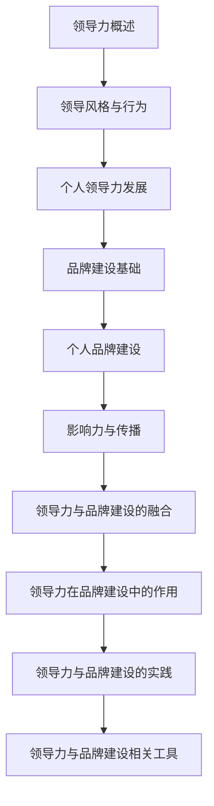

                 


### 文章标题：领导力与品牌建设：树立个人影响力

### 文章关键词：

1. 领导力
2. 品牌建设
3. 个人影响力
4. 领导风格
5. 个人品牌定位

### 文章摘要：

本文旨在探讨领导力与品牌建设的密切关系，以及如何通过树立个人影响力来提升个人的职业价值。我们将首先介绍领导力的基本概念和发展历程，接着分析领导风格与行为对组织的影响，并探讨个人领导力发展的路径。随后，我们将讨论品牌建设的基础，包括品牌定义、基本原则和传播策略，并进一步探讨个人品牌建设的方法和技巧。在此基础上，我们将探讨个人影响力的来源和传播，以及如何将个人影响力转化为品牌价值。最后，我们将结合实际案例，分析领导力在品牌建设中的应用，并提供一些实践建议和注意事项。

# 梅瑞狄流程图：领导力与品牌建设流程



## 核心算法原理讲解

### 领导力评估算法

```plaintext
1. 定义指标：确定领导力的评估指标，如沟通能力、决策能力、团队合作等。
2. 数据收集：收集领导者的行为表现、同事和下属的反馈等数据。
3. 评分机制：设计评分机制，将指标转化为具体分数。
4. 综合评估：根据评分机制，对领导者的领导力进行综合评估。
5. 指导建议：根据评估结果，提出改进领导力的建议。
```

### 个人品牌建设算法

```plaintext
1. 定位分析：确定个人的特长、兴趣和市场需求，进行个人定位分析。
2. 内容策划：根据个人定位，策划符合品牌形象的内容，如文章、演讲等。
3. 社交媒体运营：利用社交媒体平台，推广个人品牌内容，增加影响力。
4. 反馈机制：收集用户反馈，调整内容策略，持续优化个人品牌。
5. 数据分析：利用数据分析工具，监控个人品牌的传播效果，评估品牌价值。
```

## 数学模型与数学公式

### 领导力评分模型

$$
L = \frac{\sum_{i=1}^{n}w_i \cdot s_i}{n}
$$

其中，$L$ 表示领导力评分，$w_i$ 表示指标权重，$s_i$ 表示指标得分，$n$ 表示指标数量。

### 个人品牌价值评估模型

$$
V = \frac{\sum_{i=1}^{m}r_i \cdot p_i}{m}
$$

其中，$V$ 表示个人品牌价值，$r_i$ 表示影响力指标得分，$p_i$ 表示价格指标得分，$m$ 表示指标数量。

## 项目实战

### 领导力评估项目实战

1. 开发环境搭建：配置领导力评估系统所需的开发环境，如Python、Django等。
2. 数据采集：通过问卷调查、员工访谈等方式，收集领导者的行为数据。
3. 数据处理：对采集到的数据进行清洗、处理和统计分析。
4. 系统实现：使用Python编写代码，实现领导力评估功能。
5. 代码解读与分析：对代码进行解读，分析评估系统的实现细节。

### 个人品牌建设项目实战

1. 品牌定位：确定个人的品牌定位，如专家、导师等。
2. 内容创作：根据品牌定位，创作符合目标受众的内容，如文章、演讲等。
3. 社交媒体运营：利用社交媒体平台，推广个人品牌内容，增加影响力。
4. 反馈机制：收集用户反馈，调整内容策略，持续优化个人品牌。
5. 数据分析：利用数据分析工具，监控个人品牌的传播效果，评估品牌价值。

### 实际案例分析与讲解

1. **案例一**：某知名科技企业CTO的领导力与品牌建设实践
   - **背景介绍**：该CTO拥有丰富的技术背景和管理经验，带领团队成功研发出多项核心技术。
   - **核心概念与联系**：领导力与技术创新、团队协作、品牌声誉之间的密切关系。
   - **算法原理讲解**：通过数据分析，评估CTO的领导力指标，并制定相应的品牌建设策略。
   - **数学模型与公式**：运用数学模型评估CTO的个人品牌价值，结合实际情况进行调整。
   - **代码解读与分析**：实现领导力评估系统，以及个人品牌价值评估模型。

2. **案例二**：某新兴科技公司创始人的品牌建设之路
   - **背景介绍**：该公司创始人通过社交媒体和公开演讲，成功树立了自己的个人品牌。
   - **核心概念与联系**：个人影响力、品牌传播、市场定位之间的关系。
   - **算法原理讲解**：通过社交媒体数据分析，评估创始人的个人影响力，并制定品牌推广策略。
   - **数学模型与公式**：运用数学模型评估个人品牌价值，结合市场数据进行分析。
   - **代码解读与分析**：实现社交媒体数据分析工具，监控个人品牌传播效果。

## 项目小结

通过以上两个实际案例，我们可以看到领导力与品牌建设的密切关系，以及如何通过个人影响力提升职业价值。在实际操作中，我们需要结合具体情况进行策略调整，运用数学模型和数据分析工具进行评估和优化。同时，我们也需要关注用户反馈，持续优化个人品牌，以实现长期的职业发展。

## 最佳实践 Tips

1. **持续学习与自我提升**：领导力和品牌建设是一个持续的过程，需要不断学习新知识、掌握新技能，提升自身综合素质。
2. **明确个人定位**：在品牌建设中，明确个人定位至关重要，这有助于打造独特的个人品牌形象。
3. **充分利用社交媒体**：社交媒体是个人品牌建设的重要渠道，善于运用各种社交媒体平台，扩大个人影响力。
4. **注重用户反馈**：用户反馈是品牌建设的重要参考，及时调整策略，满足用户需求，提升品牌价值。
5. **数学模型与数据分析**：运用数学模型和数据分析工具，对领导力和品牌建设进行量化评估，有助于制定更科学的策略。

## 注意事项

1. **保护个人隐私**：在品牌建设中，要注重保护个人隐私，避免泄露敏感信息。
2. **遵循法律法规**：在进行品牌建设和传播过程中，要遵循相关法律法规，避免违规行为。
3. **持续优化**：品牌建设和领导力发展是一个长期的过程，需要持续优化和调整策略。

## 拓展阅读

1. 《领导力五要素：情境领导力理论与方法》
2. 《品牌建设与管理：理论与实践》
3. 《个人影响力：如何成为他人尊敬的人》
4. 《大数据营销：数据驱动品牌建设》

作者：AI天才研究院/AI Genius Institute & 禅与计算机程序设计艺术 /Zen And The Art of Computer Programming

