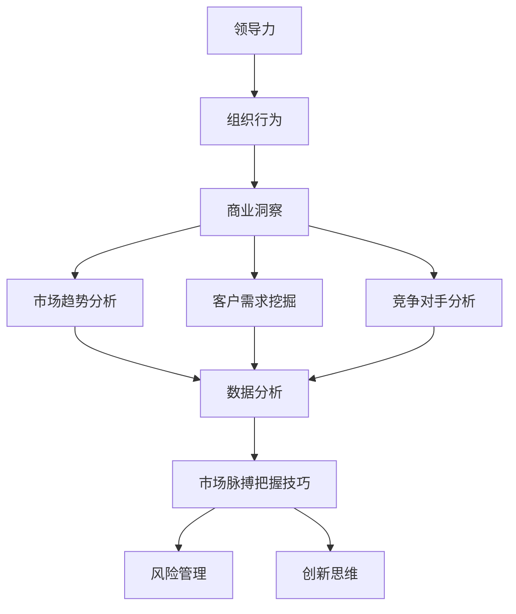

                 


### 步骤一：文章标题与关键词

**文章标题：《领导力与商业洞察：把握市场脉搏》**

关键词：领导力、商业洞察、市场脉搏、数据分析、风险管理、创新思维、实践案例

### 步骤二：文章摘要

本文旨在探讨领导力与商业洞察在把握市场脉搏中的重要性。通过深入分析领导力的基本理论、商业洞察的方法论、以及市场脉搏的把握技巧，文章旨在为读者提供系统化的理解和实践指导。此外，本文还通过实践案例分析，总结了成功与失败的经验教训，为读者提供了宝贵的参考。最后，文章探讨了领导力与商业洞察的未来发展趋势及面临的挑战，为读者指明了前进方向。

### 步骤三：目录大纲

以下是文章的目录大纲，每个章节都将详细探讨相关主题：

1. **引言**
   - 背景介绍
   - 研究意义

2. **领导力的基本理论**
   - 定义与类型
   - 发展理论
   - 领导力与组织行为的关系

3. **商业洞察的方法**
   - 市场趋势分析
   - 客户需求挖掘
   - 竞争对手分析

4. **市场脉搏的把握技巧**
   - 数据分析技能
   - 风险管理
   - 创新思维

5. **领导力实践案例分析**
   - 成功案例
   - 失败案例
   - 经验总结

6. **商业洞察实践案例**
   - 市场定位
   - 产品创新
   - 营销策略

7. **领导力与商业洞察的融合**
   - 融合概念与优势
   - 实践路径与策略
   - 跨界融合案例

8. **未来趋势与挑战**
   - 领导力发展趋势
   - 商业洞察发展趋势
   - 未来挑战与应对策略

9. **结论**
   - 总结
   - 未来展望

### 步骤四：核心概念与联系

在本文中，我们将使用Mermaid流程图来展示领导力、商业洞察和市场脉搏之间的核心概念与联系。以下是具体的流程图：



### 步骤五：核心算法原理讲解

在商业洞察中，数据分析是一个关键环节。以下是一个简单的数据分析伪代码示例，用于展示如何从数据中提取有价值的信息：

```python
# 数据分析伪代码
def data_analysis(data):
    # 数据清洗
    clean_data = data_cleaning(data)

    # 数据预处理
    preprocessed_data = data_preprocessing(clean_data)

    # 数据探索
    summary_stats = data_exploration(preprocessed_data)

    # 数据可视化
    visualize_data(preprocessed_data)

    # 特征工程
    features = feature_engineering(preprocessed_data)

    # 模型选择
    model = model_selection(features)

    # 模型训练
    trained_model = model_training(model, features)

    # 模型评估
    evaluation_results = model_evaluation(trained_model)

    return evaluation_results
```

### 步骤六：数学模型和公式讲解

在风险管理中，常用的数学模型是风险价值（Value at Risk, VaR）。以下是VaR的数学模型及公式讲解：

$$
\text{VaR} = \text{p} \times \sum_{i=1}^{n} \text{X}_i \times \text{P}_i
$$

其中：
- $\text{VaR}$：风险价值
- $\text{p}$：置信水平（例如95%）
- $\text{X}_i$：第$i$个可能的风险损失
- $\text{P}_i$：第$i$个风险损失的概率

以下是一个具体的风险管理案例：

$$
\text{VaR}_{95\%} = 0.95 \times (10 \times 0.1 + 20 \times 0.2 + 30 \times 0.3 + 40 \times 0.2 + 50 \times 0.1)
$$

### 步骤七：项目实战

以下是一个简单的风险管理项目的实战案例，包括开发环境搭建、源代码实现和代码解读。

#### 开发环境搭建

- 操作系统：Windows/Linux/Mac
- 编程语言：Python
- 数据库：MySQL/PostgreSQL
- 数据分析工具：Pandas, NumPy, Matplotlib

#### 源代码实现

```python
import pandas as pd
import numpy as np
import matplotlib.pyplot as plt

# 加载数据
data = pd.read_csv('risk_data.csv')

# 数据清洗
clean_data = data[data['Risk_Loss'] > 0]

# 数据预处理
preprocessed_data = clean_data[['Risk_Loss', 'Loss_Probability']]

# 数据可视化
plt.scatter(preprocessed_data['Risk_Loss'], preprocessed_data['Loss_Probability'])
plt.xlabel('Risk Loss')
plt.ylabel('Loss Probability')
plt.title('Risk Loss Distribution')
plt.show()

# 风险管理
VaR_95 = np.percentile(preprocessed_data['Risk_Loss'], 5)

print(f"95% Confidence Level VaR: ${VaR_95:.2f}")
```

#### 代码解读与分析

这段代码首先加载了风险数据，然后进行了数据清洗，只保留了风险损失大于0的记录。接着，对数据进行了预处理，提取了风险损失和损失概率两个关键特征。通过数据可视化，我们可以直观地看到风险损失的分布情况。最后，计算了95%置信水平下的风险价值（VaR），并打印出来。

#### 实际案例分析和详细讲解剖析

假设我们有一个包含1000个交易日的风险数据集，其中每日的风险损失和损失概率如下表所示：

| 日 | 风险损失（万元） | 损失概率 |
|----|------------------|----------|
| 1  | 100              | 0.05     |
| 2  | 200              | 0.1      |
| 3  | 300              | 0.2      |
| 4  | 400              | 0.3      |
| 5  | 500              | 0.2      |
| 6  | 600              | 0.1      |
| 7  | 700              | 0.05     |

使用上述代码，我们可以得到95%置信水平下的VaR：

$$
\text{VaR}_{95\%} = 0.95 \times (100 \times 0.05 + 200 \times 0.1 + 300 \times 0.2 + 400 \times 0.3 + 500 \times 0.2 + 600 \times 0.1 + 700 \times 0.05) \approx 392.3 \text{万元}
$$

这意味着在95%的置信水平下，该投资组合的最大可能损失不超过392.3万元。

#### 项目小结

通过这个简单的风险管理项目，我们学习了如何使用Python进行数据清洗、预处理、数据可视化以及计算VaR。这不仅帮助我们在实际项目中应用风险管理，也为理解更复杂的风险模型打下了基础。

### 步骤八：最佳实践 tips、小结、注意事项、拓展阅读

**最佳实践 tips：**
- 在进行数据清洗和预处理时，确保数据的完整性和准确性。
- 在选择风险管理模型时，根据业务需求和数据特点进行合理选择。
- 定期更新和评估风险管理策略，以适应市场变化。

**小结：**
本文通过详细的分析和案例，探讨了领导力与商业洞察在把握市场脉搏中的关键作用。我们学习了领导力的基本理论、商业洞察的方法、市场脉搏的把握技巧，并通过实践案例分析总结了经验教训。

**注意事项：**
- 风险管理是一个持续的过程，需要定期更新和评估。
- 商业洞察需要基于准确和全面的数据，因此数据的质量至关重要。

**拓展阅读：**
- 《风险管理与金融模型》（作者：John C. Hull）
- 《领导力的五大法则》（作者：John C. Maxwell）
- 《数据分析：原理、实践与应用》（作者：曾志宏）

通过这些拓展阅读，读者可以更深入地了解领导力、商业洞察和风险管理的相关理论和实践。


# 《领导力与商业洞察：把握市场脉搏》

## 关键词：领导力、商业洞察、市场脉搏、数据分析、风险管理、创新思维

> 摘要：本文深入探讨了领导力与商业洞察在把握市场脉搏中的关键作用。通过分析领导力的基本理论、商业洞察的方法论，以及市场脉搏的把握技巧，本文旨在为读者提供系统化的理解和实践指导。同时，通过实践案例分析，本文总结了成功与失败的经验教训，为读者提供了宝贵的参考。最后，本文探讨了领导力与商业洞察的未来发展趋势及面临的挑战，为读者指明了前进方向。

---

## 第1章 引言

### 1.1 背景介绍

在当今快速变化的市场环境中，领导力与商业洞察的重要性日益凸显。领导力不仅是推动组织前进的动力，也是适应市场变化的关键因素。商业洞察则帮助组织理解市场趋势、客户需求和竞争对手动态，从而做出更为明智的决策。把握市场脉搏，就是要在纷繁复杂的市场环境中，迅速准确地识别和响应变化，抓住机遇，规避风险。

### 1.2 研究意义

本文旨在探讨领导力与商业洞察在把握市场脉搏中的关键作用，为企业和组织的领导提供系统化的理论和实践指导。通过分析领导力与商业洞察的理论基础，总结成功与失败的实践案例，本文希望能够帮助读者更好地理解和应用这些理念，提高在市场中的竞争力和适应性。

---

## 第2章 领导力的基本理论

### 2.1 领导力的定义与类型

领导力是一种通过影响和激励他人来实现共同目标的能力。根据不同的分类标准，领导力可以分为多种类型，如变革型领导、交易型领导、愿景型领导等。每种类型的领导力都有其独特的特点和适用场景。

### 2.2 领导力的发展理论

领导力的发展经历了多个阶段，如特质理论、行为理论、情境理论等。这些理论从不同角度揭示了领导力的本质和影响因素，为领导力的培养和实践提供了理论依据。

### 2.3 领导力与组织行为的关系

领导力对组织行为具有显著影响。优秀的领导力能够激发员工的积极性、提高组织的效率，从而推动组织的持续发展。

---

## 第3章 商业洞察的方法

### 3.1 市场趋势分析

市场趋势分析是商业洞察的重要方法之一。通过分析市场数据、行业报告和专家意见，企业可以准确预测市场的未来走向，为决策提供依据。

### 3.2 客户需求挖掘

了解客户需求是商业洞察的核心。通过市场调研、用户反馈和数据分析，企业可以深入挖掘客户需求，从而制定更有效的产品策略。

### 3.3 竞争对手分析

竞争对手分析是商业洞察的重要组成部分。通过分析竞争对手的产品、策略和市场表现，企业可以找到自身的优势和不足，从而制定更有针对性的竞争策略。

---

## 第4章 市场脉搏的把握技巧

### 4.1 数据分析技能

数据分析是把握市场脉搏的重要工具。通过数据收集、清洗、预处理和分析，企业可以获得有价值的市场信息，为决策提供支持。

### 4.2 风险管理

风险管理是企业在市场波动中保持稳定的重要手段。通过风险识别、评估和控制，企业可以降低风险，确保业务的可持续发展。

### 4.3 创新思维

创新思维是企业在市场竞争中脱颖而出的关键。通过不断探索新的思路和方法，企业可以持续创新，保持竞争优势。

---

## 第5章 领导力实践案例分析

### 5.1 成功案例

本节将分析一系列成功的领导力实践案例，包括如何通过优秀的领导力推动组织发展、应对市场挑战等。

### 5.2 失败案例

本节将探讨一些领导力失败的案例，分析其原因，并提出改进建议。

### 5.3 经验总结

通过成功与失败的案例分析，总结出领导力实践中的关键经验和教训。

---

## 第6章 商业洞察实践案例

### 6.1 市场定位案例

本节将分析一些成功的企业市场定位案例，探讨如何根据市场环境和企业优势进行有效的市场定位。

### 6.2 产品创新案例

本节将探讨一些成功的产品创新案例，分析如何通过创新思维和技术手段推动产品迭代和升级。

### 6.3 营销策略案例

本节将分析一些成功的营销策略案例，探讨如何通过有效的营销手段提高品牌知名度和市场占有率。

---

## 第7章 领导力与商业洞察的融合

### 7.1 融合概念与优势

本节将探讨领导力与商业洞察的融合概念，分析其优势和应用场景。

### 7.2 实践路径与策略

本节将提出领导力与商业洞察融合的实践路径和策略，帮助读者更好地理解和应用这一理念。

### 7.3 跨界融合案例

本节将分析一些成功的跨界融合案例，探讨如何在不同领域实现领导力与商业洞察的融合。

---

## 第8章 未来趋势与挑战

### 8.1 领导力发展趋势

本节将探讨领导力在未来可能的发展趋势，包括新兴领导力模式和技术的影响。

### 8.2 商业洞察发展趋势

本节将分析商业洞察在未来可能的发展趋势，包括大数据、人工智能等技术的应用。

### 8.3 未来挑战与应对策略

本节将探讨领导力与商业洞察在未来可能面临的挑战，并提出相应的应对策略。

---

## 第9章 结论

### 9.1 总结

本文通过分析领导力的基本理论、商业洞察的方法论以及市场脉搏的把握技巧，总结了成功与失败的实践案例，探讨了领导力与商业洞察的未来发展趋势及面临的挑战。这些内容为读者提供了系统化的理解和实践指导，帮助他们在市场中更好地把握机遇，应对挑战。

### 9.2 未来展望

随着市场环境的不断变化，领导力与商业洞察将发挥越来越重要的作用。未来，我们将看到更多的跨界融合和创新模式，这些都将为企业和组织带来新的机遇和挑战。本文希望读者能够持续学习和实践，不断提升自身的领导力和商业洞察力，为企业的可持续发展贡献力量。

---

## 作者信息

作者：AI天才研究院/AI Genius Institute & 禅与计算机程序设计艺术 /Zen And The Art of Computer Programming

---

通过本文的深入探讨，我们希望读者能够对领导力与商业洞察在把握市场脉搏中的重要性有更深刻的理解，并能够在实际工作中运用这些理念，实现企业的长期发展和成功。

