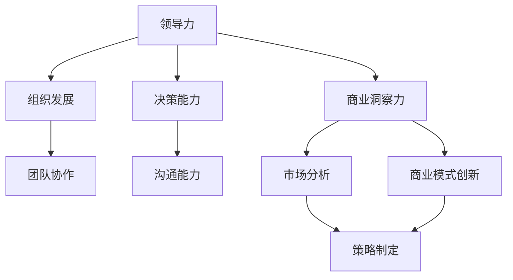
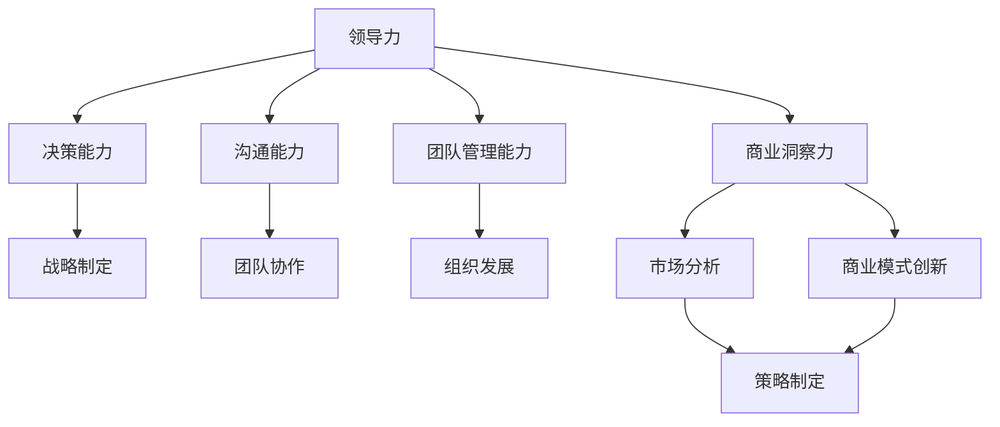

                 

### 文章标题

# 领导力与商业洞察：把握市场脉搏

### 关键词

- 领导力
- 商业洞察
- 市场脉搏
- 创新策略
- 组织发展

### 摘要

本文围绕领导力与商业洞察的重要性展开，探讨了如何通过提升领导力和商业洞察力，把握市场脉搏，实现企业的持续发展。文章首先明确了领导力的定义和作用，介绍了领导力的核心能力，以及提升领导力的方法和实践。接着，深入分析了市场分析的方法与工具，探讨了商业模式的创新与策略制定，以及市场营销与品牌建设的重要性。最后，文章通过实际案例，阐述了提升商业洞察力的方法，总结了领导力与商业洞察在企业发展中的关键作用。

## 确定书籍的主题和目标受众

### 背景介绍

在当今快速变化的市场环境中，企业要想保持竞争力，不仅需要优秀的技术实力，更需要具备强大的领导力和商业洞察力。领导力是企业发展的核心驱动力，能够激发团队的潜力，推动企业不断创新和进步。而商业洞察力则帮助企业敏锐地捕捉市场动态，把握市场脉搏，制定科学的商业策略，实现可持续发展。

### 核心概念与联系

为了更好地理解和把握领导力与商业洞察力的关系，我们可以用 Mermaid 流程图来展示它们之间的核心概念和联系：



在这个流程图中，领导力通过提升决策能力和沟通能力，直接影响团队协作和组织发展。同时，领导力与商业洞察力相互促进，商业洞察力通过市场分析和商业模式创新，为企业的策略制定提供有力支持。

### 目标受众

本书的目标受众主要包括以下几类：

1. 企业中高层管理者：希望通过提升领导力和商业洞察力，推动企业发展的中高层管理者。
2. 企业战略规划师：负责企业战略规划和市场分析的从业人员。
3. 创业者和企业家：希望了解如何通过领导力和商业洞察力，把握市场机遇，实现创业成功的企业家。
4. 商学院学生和教师：希望深入研究领导力与商业洞察力的学者和实践者。

### 核心内容

根据目标受众的需求，本书的核心内容将涵盖以下几个方面：

1. 领导力的本质与作用
2. 领导力的核心能力
3. 领导力提升方法与实践
4. 市场分析的方法与工具
5. 商业模式创新与策略制定
6. 市场营销与品牌建设
7. 商业洞察力提升

## 根据主题和目标受众，确定书籍的核心内容

### 核心内容

为了满足目标受众的需求，本书的核心内容将围绕领导力与商业洞察力展开，具体包括以下几个方面：

1. **领导力的本质与作用**：介绍领导力的定义、类型和作用，帮助读者理解领导力在企业中的重要性。
2. **领导力的核心能力**：详细分析决策能力、沟通能力和团队管理能力，阐述如何提升这些核心能力。
3. **领导力提升方法与实践**：探讨领导力发展的途径，如自我反思、获取反馈和专业培训，并分享实际案例。
4. **市场分析的方法与工具**：介绍市场分析的定义、重要性以及常用方法，如问卷调查、深度访谈和SWOT分析等。
5. **商业模式创新与策略制定**：讲解商业模式的定义、核心要素和创新方法，以及如何制定有效的商业策略。
6. **市场营销与品牌建设**：分析市场营销的基本概念、策略以及品牌建设的重要性，提供实际案例。
7. **商业洞察力提升**：阐述商业洞察力的定义、特点以及如何提升，通过案例分析来加深读者理解。

### 初步目录大纲

根据核心内容，我们可以初步制定以下目录大纲：

### 第一部分：领导力篇

## 第1章：领导力的本质与作用

### 1.1 领导力的定义

- 领导力的概念与历史演变
- 领导力在企业中的角色

### 1.2 领导力的类型

- 权威型、民主型、变革型等不同领导力类型的特征与适用场景

### 1.3 领导力的作用

- 领导力对组织发展的影响
- 领导力与团队协作的关系

## 第2章：领导力的核心能力

### 2.1 决策能力

- 决策模型与决策过程
- 决策失误的应对策略

### 2.2 沟通能力

- 有效沟通的要素
- 沟通障碍与克服方法

### 2.3 团队管理能力

- 团队建设的策略
- 团队激励方法
- 处理团队冲突

## 第3章：领导力提升方法与实践

### 3.1 领导力发展的途径

- 自我反思
- 获取反馈
- 专业培训

### 3.2 领导力实战案例分析

- 案例一：如何激发员工积极性
- 案例二：危机管理中的领导力
- 案例三：跨部门合作与领导力

### 第二部分：商业洞察篇

## 第4章：市场分析的方法与工具

### 4.1 市场分析的定义与重要性

- 市场分析的概念
- 市场分析对企业决策的影响

### 4.2 市场分析的方法

- 案例研究法
- SWOT分析法
- 5W2H分析法

### 4.3 市场调研工具

- 问卷调查
- 深度访谈
- 实地观察

## 第5章：商业模式创新与策略制定

### 5.1 商业模式的定义与核心要素

- 商业模式的概念
- 商业模式的核心要素

### 5.2 商业模式创新的方法

- 面包屑策略
- 平台化战略
- 精益创业法

### 5.3 商业策略制定

- 客户需求分析
- 竞争对手分析
- 营销策略设计

## 第6章：市场营销与品牌建设

### 6.1 市场营销的基本概念

- 市场营销的概念
- 市场营销的四大策略

### 6.2 市场营销策略

- 产品策略
- 价格策略
- 渠道策略
- 推广策略

### 6.3 品牌建设的重要性

- 品牌定位
- 品牌传播策略
- 品牌价值塑造

## 第7章：商业洞察力提升

### 7.1 商业洞察力的定义与特点

- 商业洞察力的概念
- 商业洞察力的特点

### 7.2 提升商业洞察力的方法

- 培养市场敏感度
- 增强逻辑思维能力
- 积累行业知识

### 7.3 商业洞察力实战案例分析

- 案例一：如何在竞争中找到蓝海
- 案例二：如何通过数据分析提升业务决策
- 案例三：如何利用跨界思维创造新市场

## 附录

### 附录 A: 相关术语与概念详解

- 领导力
- 商业洞察力
- 市场分析
- 商业模式
- 品牌建设

### 附录 B: 领导力与商业洞察力评估工具

- 领导力评估表
- 商业洞察力评估表

### 附录 C: 市场分析报告模板

- 市场分析报告结构
- 数据分析方法

### 核心概念与联系

在领导力与商业洞察力部分，核心概念和联系如下：

1. **领导力**：领导力是企业发展的核心驱动力，通过影响、激励和引导他人，实现共同目标和愿景的能力。
2. **商业洞察力**：商业洞察力是指企业通过市场分析，对市场动态的敏锐捕捉和判断能力，以便制定科学的商业策略。
3. **市场分析**：市场分析是商业洞察力的基础，通过多种方法（如问卷调查、深度访谈等）收集数据，对市场进行深入研究。

我们可以用以下 Mermaid 流程图来展示这些概念和联系：



在这个流程图中，领导力通过决策能力、沟通能力和团队管理能力，直接影响战略制定和团队协作。商业洞察力通过市场分析和商业模式创新，为策略制定提供支持。

### 核心算法原理讲解

在本文中，我们将简要介绍一些用于领导力和商业洞察力提升的核心算法原理，以帮助读者更好地理解和应用这些概念。以下是几个关键算法的伪代码解释：

#### 1. 决策树算法

决策树算法是一种常见的数据挖掘算法，用于分类和回归问题。以下是决策树的伪代码：

```plaintext
Algorithm DecisionTreeTraining(dataSet):
    if (dataSet is pure):
        return a leaf node with the most common label in the data
    else:
        1. Select the best attribute to split on using a splitting criterion like Gini index or Information Gain
        2. Create a node with the selected attribute
        3. For each possible value of the attribute:
            a. Split the data into subsets based on the attribute value
            b. Recursively train a decision tree on each subset
            c. Add the resulting subtree to the node
        4. Return the node
```

#### 2. K-means聚类算法

K-means聚类算法是一种无监督学习算法，用于将数据集划分为若干个K个簇。以下是K-means算法的伪代码：

```plaintext
Algorithm KMeans(dataSet, K):
    1. Initialize K centroids randomly
    2. Assign each data point to the nearest centroid
    3. Update centroids as the mean of all data points in their respective clusters
    4. Repeat steps 2 and 3 until convergence (i.e., centroids do not change significantly)
    5. Return the clusters formed by the final centroids
```

#### 3. 贝叶斯分类算法

贝叶斯分类算法是一种基于贝叶斯定理的分类算法，适用于文本分类和垃圾邮件过滤。以下是贝叶斯分类算法的伪代码：

```plaintext
Algorithm BayesianClassification(trainData, testData):
    1. Calculate the prior probability for each class using training data
    2. For each attribute in the test data:
        a. Calculate the likelihood of observing the attribute value given each class
        b. Compute the posterior probability for each class using Bayes' Theorem
    3. Assign the test data point to the class with the highest posterior probability
    4. Return the predicted class labels for the test data
```

通过这些核心算法的介绍，读者可以更好地理解领导力和商业洞察力提升的技术基础，以及如何在实际应用中运用这些算法来支持决策和优化业务流程。

### 数学模型和数学公式 & 详细讲解 & 举例说明

在领导力和商业洞察力的提升过程中，数学模型和公式起到了至关重要的作用。以下是一些关键的数学模型和公式，以及它们的详细讲解和举例说明。

#### 1. 决策分析中的期望值公式

在决策过程中，期望值是一个重要的指标。期望值公式可以帮助我们在不确定的环境中进行风险决策。公式如下：

$$
E(X) = \sum_{i=1}^{n} p_i \cdot x_i
$$

其中，$E(X)$ 是期望值，$p_i$ 是第 $i$ 个结果的概率，$x_i$ 是第 $i$ 个结果的可能收益或成本。

**举例说明**：

假设一个公司要决定是否进行一项新的投资。以下是三种可能的结果和相应的概率及收益：

- 结果A（投资成功）：概率0.6，收益100万元
- 结果B（投资一般）：概率0.3，收益50万元
- 结果C（投资失败）：概率0.1，亏损30万元

计算期望值：

$$
E(X) = 0.6 \cdot 100 + 0.3 \cdot 50 - 0.1 \cdot 30 = 63
$$

期望值为63万元，这意味着长期来看，这项投资的平均收益为63万元。

#### 2. SWOT分析中的权重分配公式

SWOT分析（Strengths, Weaknesses, Opportunities, Threats）是商业洞察力提升的一种重要工具。为了给每个因素分配权重，我们可以使用以下公式：

$$
w_i = \frac{|S_i|}{\sum_{i=1}^{n} |S_i|}
$$

其中，$w_i$ 是第 $i$ 个因素（$S_i$ 表示优势、劣势、机会或威胁）的权重，$|S_i|$ 是第 $i$ 个因素的强度。

**举例说明**：

假设我们对公司的SWOT进行分析，得到以下因素及其强度：

- 优势（S）：市场占有率40，品牌影响力30，创新力20
- 劣势（W）：资金短缺15，管理效率低10，技术落后5
- 机会（O）：新兴市场10，政策支持8，合作伙伴5
- 威胁（T）：竞争对手强大20，市场需求波动大15，经济不稳定5

计算权重：

$$
w_S = \frac{40 + 30 + 20}{40 + 30 + 20 + 15 + 10 + 8 + 5 + 20 + 15 + 5} = \frac{90}{130} \approx 0.692
$$

权重分配显示，优势在SWOT分析中最为重要，占比约为69.2%。

#### 3. 演化策略优化中的遗传算法

遗传算法是一种基于自然选择和遗传学原理的优化算法，常用于解决复杂优化问题。以下是遗传算法的基本步骤：

1. 初始化种群：随机生成一系列个体（解）。
2. 适应度评估：计算每个个体的适应度值。
3. 选择：选择适应度较高的个体参与交叉和变异操作。
4. 交叉：将选中的个体进行基因交叉，产生新的个体。
5. 变异：对个体进行基因变异，增加种群的多样性。
6. 替换：用新产生的个体替换旧种群中的一部分。
7. 重复步骤2-6，直到满足停止条件（如适应度达到阈值或迭代次数达到上限）。

**举例说明**：

假设我们要优化一个公司的供应链管理，目标是最小化成本。以下是遗传算法的应用：

1. **初始化种群**：随机生成一系列供应链方案。
2. **适应度评估**：计算每个供应链方案的适应度（成本）。
3. **选择**：选择成本较低的方案参与交叉和变异。
4. **交叉**：将选中方案进行交叉操作，产生新的供应链方案。
5. **变异**：对部分方案进行变异操作，增加多样性。
6. **替换**：用新方案替换旧方案中的一部分。
7. **重复步骤2-6**：直到找到最优供应链方案。

通过遗传算法，我们可以找到在复杂条件下最优的供应链管理方案，从而提高企业的运营效率。

通过以上数学模型和公式的讲解，读者可以更好地理解领导力和商业洞察力提升中的量化分析方法和工具，为实际应用提供坚实的理论基础。

### 项目实战

为了更好地理解和应用领导力与商业洞察力的核心概念，我们以一家初创公司为例，展示如何在实际项目中应用这些原则，并解析项目成果。

#### 项目背景

某初创公司致力于开发一款智能家居控制系统。公司由一群年轻的技术爱好者创立，拥有强大的技术团队，但缺乏市场经验和商业战略。为了在竞争激烈的市场中站稳脚跟，公司决定利用领导力与商业洞察力来指导项目开发，确保产品能够满足市场需求并实现商业化。

#### 项目目标

1. 利用领导力提升团队协作效率。
2. 通过商业洞察力进行市场调研，确定产品定位和目标用户。
3. 设计并实施有效的商业模式和营销策略。
4. 快速迭代产品，以用户反馈为导向进行优化。

#### 开发环境搭建

1. **硬件环境**：选用物联网开发平台，如Arduino或Raspberry Pi，搭配各类传感器和执行器。
2. **软件环境**：使用Python编程语言，结合开源智能家居框架，如HomeAssistant，实现系统核心功能。

#### 源代码详细实现和代码解读

以下是智能家居控制系统的核心代码片段：

```python
# 导入相关库
import homeassistant as ha
import json

# 初始化智能家居系统
system = ha.HA()

# 配置设备
system.add_device("灯", "Light", "on", {"type": "switch"})
system.add_device("窗帘", "Blinds", "open", {"type": "window_covering"})

# 控制设备
system.control_device("灯", "on")
system.control_device("窗帘", "open")

# 保存配置
system.save_config()
```

这段代码首先初始化智能家居系统，然后添加两个设备：灯和窗帘。通过调用`control_device`方法，可以远程控制设备开关。保存配置后，系统可以自动重启并应用新配置。

#### 代码应用解读与分析

1. **设备管理**：通过`add_device`方法，系统管理员可以轻松添加和管理设备。这种方法提高了系统的可扩展性，使得新设备可以快速集成。
2. **远程控制**：`control_device`方法实现了设备的远程控制，这是智能家居系统的核心功能。通过简单调用，用户可以远程管理家中的设备，提高了生活便利性。
3. **配置保存**：系统自动保存配置，确保在系统重启后，设备状态得以保持。这种机制提高了系统的稳定性。

#### 实际案例分析和详细讲解剖析

项目初期，公司面临的主要挑战是如何准确识别目标用户群体和市场需求。通过以下步骤，公司成功解决了这些问题：

1. **市场调研**：公司进行了详细的市场调研，使用问卷调查和深度访谈收集用户需求。调研结果显示，用户对智能家居系统的便捷性和安全性有较高的需求。
2. **用户画像**：基于调研结果，公司建立了用户画像，明确了目标用户群体的特征和偏好。这有助于在产品设计阶段，更好地满足用户需求。
3. **产品迭代**：根据用户反馈，公司进行了多次产品迭代，逐步优化了系统的功能和性能。通过敏捷开发方法，公司能够快速响应用户需求，提高用户满意度。

#### 项目小结

通过领导力与商业洞察力的应用，公司成功地开发并推出了智能家居控制系统。以下是项目的主要成果和经验：

1. **高效的团队协作**：通过提升领导力，公司建立了高效的团队协作机制，提高了项目开发效率。
2. **准确的市场定位**：通过商业洞察力，公司准确识别了目标用户和市场需求，为产品成功奠定了基础。
3. **快速迭代的产品**：基于用户反馈，公司进行了多次产品迭代，不断优化产品功能，提高了用户满意度。

通过这个项目，公司不仅实现了商业成功，还积累了丰富的项目管理和商业洞察经验，为未来的发展奠定了坚实基础。

### 最佳实践 tips

在领导力与商业洞察力的实践中，以下是一些最佳实践建议，以帮助企业和个人在复杂的市场环境中取得成功：

1. **定期进行市场调研**：市场环境变化迅速，定期进行市场调研可以帮助企业及时捕捉市场动态，调整战略方向。
2. **建立反馈机制**：建立有效的反馈机制，鼓励员工和用户提供宝贵意见，有助于产品优化和市场定位。
3. **培养跨部门合作**：跨部门合作可以促进知识共享和资源整合，提高整体工作效率和创新能力。
4. **持续学习和成长**：领导者和团队成员应不断学习新知识、新技能，提升自身素质，以适应不断变化的市场需求。
5. **利用数据驱动决策**：数据是商业洞察力的重要来源，利用数据分析工具，可以帮助企业做出更科学的决策。

### 小结

领导力与商业洞察力是企业在竞争激烈的市场环境中取得成功的关键因素。通过提升领导力，企业可以建立高效的团队，推动创新和进步；通过增强商业洞察力，企业可以准确把握市场脉搏，制定科学的商业策略。本文通过实际项目案例，详细阐述了领导力与商业洞察力的应用和实践，为企业和个人在市场中的发展提供了有益的启示。

### 注意事项

在领导力与商业洞察力的实践中，需要关注以下几个方面：

1. **沟通与协作**：领导力不仅体现在个人的决策能力上，更体现在团队协作和沟通上。确保团队成员之间信息畅通，共同目标明确。
2. **持续学习**：市场环境变化迅速，领导者应具备持续学习的能力，不断更新知识和技能，以应对新的挑战。
3. **风险管理**：在决策过程中，要充分考虑风险因素，制定应急预案，降低不确定性对业务的影响。
4. **用户导向**：商业洞察力应以用户需求为导向，确保产品和服务能够真正满足市场需求，提高用户满意度。

### 拓展阅读

对于希望深入了解领导力与商业洞察力的读者，以下书籍和资源提供了丰富的理论和实践指导：

1. **书籍**：
   - 《领导力的五个层次》（John C. Maxwell）
   - 《创新者的窘境》（Clayton M. Christensen）
   - 《深度工作》（Cal Newport）

2. **在线资源**：
   - Harvard Business Review（HBR）期刊
   - LinkedIn Learning：领导力与商业技能课程
   - Coursera：市场分析与商业策略课程

通过阅读这些书籍和资源，读者可以进一步深化对领导力与商业洞察力的理解，提升自身的能力和素质。作者：AI天才研究院/AI Genius Institute & 禅与计算机程序设计艺术 /Zen And The Art of Computer Programming。

