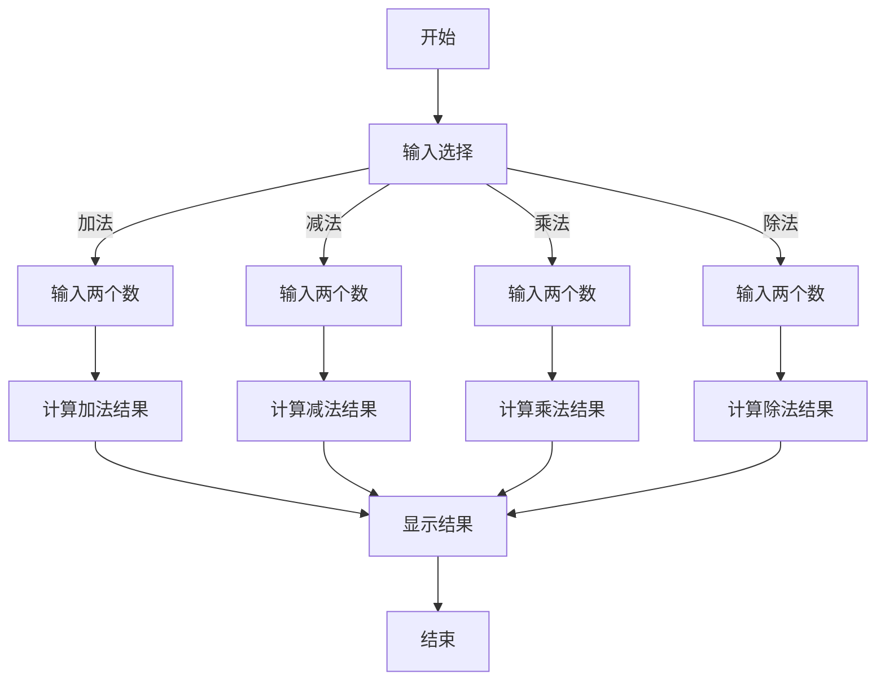

                 

## 文章标题

### 领导力与商业洞察：把握市场脉搏的能力

在当今这个瞬息万变的时代，领导力与商业洞察已经成为企业成功的关键因素。作为一位世界级的人工智能专家，我们不仅需要理解技术的深度，更要具备洞察市场变化、引领团队前进的领导力。本文将探讨领导力与商业洞察的紧密联系，以及如何通过提升领导力来把握市场脉搏，实现企业的长远发展。

关键词：领导力、商业洞察、市场策略、企业成功、团队建设

摘要：本文首先介绍了领导力的基本概念及其类型，随后分析了领导力与商业洞察的关系。接着，我们探讨了领导力在不同场景下的应用，包括初创企业、大型企业和跨国企业。通过实际案例，我们展示了成功领导者的领导策略和商业洞察。最后，本文提出了提升领导力的方法，包括个人发展、团队建设和组织文化等方面。

## 第一部分：领导力的基本概念

### 第一章：领导力的定义与类型

领导力是一种引导和激励他人实现共同目标的能力。它不仅仅涉及管理技巧，更是一种态度和价值观。领导力可以分为多种类型，每种类型都有其独特的特点和适用场景。

#### 1.1. 领导力的基本定义

领导力是指一种在特定情境下，通过激励、指导和影响他人来实现共同目标的能力。它不仅仅局限于企业或组织内部，也可以扩展到社区、国家等更广泛的领域。

#### 1.2. 领导力的类型

领导力可以分为多种类型，每种类型都有其独特的特点和适用场景。以下是一些常见的领导力类型：

1. **情境领导力**：这种类型的领导力认为，不同的情境需要不同的领导风格。领导者需要根据团队成员的能力和任务的需求来调整自己的领导风格。

2. **情感领导力**：情感领导力强调领导者与团队成员之间的情感联系，通过建立信任和尊重来激励团队成员。

3. **智力领导力**：智力领导力关注领导者如何利用自身的知识和智慧来指导团队，并推动团队的创新和发展。

#### 1.3. 领导力的核心要素

领导力的核心要素包括以下几个方面：

1. **愿景**：领导者需要有明确的愿景，能够为团队指明方向，并激励团队成员为之奋斗。

2. **沟通**：领导者需要具备良好的沟通能力，能够清晰地传达愿景和目标，同时倾听团队成员的意见和建议。

3. **激励**：领导者需要能够激励团队成员，使其保持积极的态度和高效的工作状态。

4. **决策**：领导者需要具备决策能力，能够在复杂的环境中做出明智的决策。

### 第二部分：领导力与商业洞察

#### 第二章：领导力与商业洞察的关系

领导力与商业洞察之间有着密切的联系。一个成功的领导者不仅需要具备领导力，还需要具备商业洞察力，能够准确把握市场趋势，制定有效的商业策略。

#### 2.1. 领导力在商业决策中的作用

领导力在商业决策中起着至关重要的作用。领导者通过其领导力，可以影响团队的决策过程，确保决策的有效性和可行性。以下是领导力在商业决策中的作用：

1. **明确目标**：领导者通过设定明确的目标和愿景，为团队指明方向，确保团队的行动与公司的战略目标一致。

2. **激发创新**：领导者通过激励和指导，激发团队成员的创新思维，推动企业的创新和发展。

3. **优化资源**：领导者需要优化企业的资源分配，确保资源得到充分利用，从而提高企业的运营效率和竞争力。

4. **风险管理**：领导者需要具备风险管理能力，能够识别和应对潜在的风险，确保企业的稳定发展。

#### 2.2. 商业洞察对领导力的需求

商业洞察对领导力提出了更高的要求。一个成功的领导者不仅需要具备领导力，还需要具备商业洞察力，能够准确把握市场趋势，制定有效的商业策略。以下是商业洞察对领导力的需求：

1. **市场敏感性**：领导者需要具备敏锐的市场洞察力，能够及时识别市场趋势和变化，把握商机。

2. **战略思维**：领导者需要具备战略思维，能够从全局出发，制定长远的商业战略。

3. **数据驱动**：领导者需要具备数据驱动的思维，能够利用数据分析来指导决策，提高决策的准确性。

4. **灵活应变**：领导者需要具备灵活应变的能力，能够在市场变化中迅速调整策略，保持企业的竞争力。

#### 2.3. 领导力与商业洞察的互动关系

领导力与商业洞察之间是相互促进、相互依赖的关系。领导力可以增强商业洞察力，而商业洞察力又可以提升领导力。以下是领导力与商业洞察的互动关系：

1. **领导力增强商业洞察力**：领导者通过其领导力，可以激发团队成员的创造力，促进创新，从而增强企业的商业洞察力。

2. **商业洞察力提升领导力**：领导者通过其商业洞察力，可以更准确地把握市场趋势，制定更有效的商业策略，从而提升企业的竞争力。

3. **领导力与商业洞察的共同目标**：领导力和商业洞察的共同目标是实现企业的长期成功。只有通过不断提升领导力和商业洞察力，企业才能在竞争激烈的市场中立于不败之地。

### 第三部分：领导力在不同场景下的应用

#### 第三章：领导力在初创企业中的应用

初创企业面临的风险和挑战较大，因此领导力在初创企业中的应用尤为重要。以下是领导力在初创企业中的应用：

#### 3.1. 初创企业领导者的挑战

1. **资源有限**：初创企业通常资源有限，领导者需要有效地管理和利用有限的资源。

2. **市场不确定**：初创企业面临的市场环境往往不确定，领导者需要具备快速应变的能力。

3. **团队建设**：初创企业的团队建设至关重要，领导者需要吸引和留住优秀的人才。

#### 3.2. 领导力在初创企业中的策略

1. **愿景引领**：初创企业领导者需要具备清晰的愿景，能够激励团队成员为之奋斗。

2. **创新驱动**：初创企业领导者需要鼓励创新，推动企业的发展。

3. **灵活应变**：初创企业领导者需要具备灵活应变的能力，能够快速调整策略。

#### 3.3. 成功案例分享

以谷歌为例，其创始人拉里·佩奇和谢尔盖·布林通过领导力的有效应用，成功地将谷歌打造成为全球领先的科技公司。

#### 第四章：领导力在大型企业中的应用

大型企业在发展过程中，领导力同样至关重要。以下是领导力在大型企业中的应用：

#### 4.1. 大型企业领导者的角色

1. **战略规划**：大型企业领导者需要制定长远的战略规划，确保企业的发展方向正确。

2. **资源整合**：大型企业领导者需要有效地整合企业内外部资源，提高企业的运营效率。

3. **团队管理**：大型企业领导者需要管理庞大的团队，确保团队的稳定和高效。

#### 4.2. 领导力在大型企业中的挑战

1. **组织复杂**：大型企业的组织结构复杂，领导者需要有效地协调和管理各个部门。

2. **文化融合**：大型企业通常涉及多个国家和地区，领导者需要处理文化差异，实现文化融合。

3. **变革管理**：大型企业在发展过程中需要进行变革，领导者需要推动变革，确保企业的可持续发展。

#### 4.3. 领导力在大型企业中的策略

1. **文化塑造**：大型企业领导者需要塑造积极向上的企业文化，提升企业的凝聚力。

2. **创新驱动**：大型企业领导者需要推动创新，保持企业的竞争力。

3. **人才发展**：大型企业领导者需要关注人才发展，培养和留住优秀人才。

#### 4.4. 成功案例分享

以苹果公司为例，其创始人史蒂夫·乔布斯通过领导力的有效应用，成功地将苹果公司打造成为全球领先的科技公司。

#### 第五章：领导力在跨国企业中的应用

跨国企业在全球范围内运营，领导力在跨国企业中的应用尤为重要。以下是领导力在跨国企业中的应用：

#### 5.1. 跨国企业领导者的挑战

1. **文化差异**：跨国企业涉及多个国家和地区，领导者需要处理文化差异，实现文化融合。

2. **全球运营**：跨国企业需要在全球范围内进行运营，领导者需要具备全球视野。

3. **风险管理**：跨国企业面临的风险更大，领导者需要具备风险管理能力。

#### 5.2. 领导力在跨国企业中的策略

1. **跨文化领导**：跨国企业领导者需要具备跨文化领导能力，能够处理不同文化之间的差异。

2. **全球协作**：跨国企业领导者需要推动全球范围内的协作，确保企业的高效运营。

3. **本地化策略**：跨国企业领导者需要制定本地化策略，适应不同地区的市场需求。

#### 5.3. 跨文化领导力

1. **文化尊重**：跨文化领导者需要尊重不同文化的差异，避免文化冲突。

2. **文化融合**：跨文化领导者需要推动文化融合，实现不同文化之间的协同效应。

3. **文化敏感性**：跨文化领导者需要具备文化敏感性，能够理解不同文化的行为和习惯。

#### 5.4. 成功案例分享

以IBM为例，其前任CEO彭明盛通过跨文化领导力的有效应用，成功地将IBM转型成为全球领先的科技公司。

### 第四部分：实际案例

#### 第六章：成功领导者的领导策略和商业洞察

#### 6.1. 硅谷创业家的领导策略

硅谷的创业家们以其独特的领导策略和商业洞察，成功地引领了全球科技创新。以下是一些硅谷创业家的领导策略和商业洞察：

1. **愿景引领**：硅谷创业家们通常具备清晰的愿景，能够激励团队成员为之奋斗。

2. **创新驱动**：硅谷创业家们注重创新，推动企业的发展。

3. **灵活应变**：硅谷创业家们能够快速适应市场变化，调整策略。

4. **人才吸引**：硅谷创业家们擅长吸引和留住优秀的人才。

#### 6.2. 国际企业领导者的商业洞察

国际企业领导者具备全球视野和商业洞察，能够把握全球市场趋势，制定有效的商业策略。以下是一些国际企业领导者的商业洞察：

1. **全球化运营**：国际企业领导者能够有效地管理全球范围内的运营。

2. **本地化策略**：国际企业领导者能够根据不同地区的市场需求，制定本地化策略。

3. **跨文化领导**：国际企业领导者具备跨文化领导能力，能够处理不同文化之间的差异。

4. **风险管理**：国际企业领导者具备风险管理能力，能够识别和应对潜在的风险。

#### 6.3. 非营利组织领导者的领导艺术

非营利组织领导者以其独特的领导艺术，推动了社会公益事业的发展。以下是一些非营利组织领导者的领导艺术：

1. **使命引领**：非营利组织领导者以明确的使命为指引，激励团队成员为社会公益事业奋斗。

2. **资源整合**：非营利组织领导者能够有效地整合资源，推动项目的发展。

3. **公众参与**：非营利组织领导者能够吸引公众参与，提高社会影响力。

4. **可持续发展**：非营利组织领导者注重项目的可持续发展，确保公益事业的长期效应。

#### 6.4. 成功案例的启示

通过分析以上成功领导者的案例，我们可以得出以下启示：

1. **领导力的通用性**：无论在何种场景下，领导力都是企业成功的关键。

2. **商业洞察的重要性**：商业洞察力是领导力的重要组成部分，能够帮助领导者制定有效的商业策略。

3. **持续学习**：领导力和商业洞察力需要不断学习和提升，以适应不断变化的市场环境。

### 第五部分：领导力的提升方法

#### 第七章：领导力的提升方法

提升领导力是一个持续的过程，需要从多个方面进行努力。以下是一些提升领导力的方法：

#### 7.1. 个人发展

1. **阅读和学习**：通过阅读相关书籍和参加培训课程，不断提升自己的知识水平。

2. **反思和总结**：定期进行自我反思和总结，分析自己的优点和不足，制定改进计划。

3. **实践和锻炼**：通过实际工作，不断锻炼自己的领导能力。

#### 7.2. 团队建设

1. **沟通和协作**：建立良好的沟通和协作机制，促进团队成员之间的合作。

2. **激励和认可**：通过激励和认可，提高团队成员的积极性和创造力。

3. **培训和培养**：为团队成员提供培训和培养机会，提升团队的整体素质。

#### 7.3. 组织文化

1. **价值观塑造**：塑造积极向上的企业文化，为员工提供良好的工作氛围。

2. **创新氛围**：鼓励创新，为员工提供尝试新事物的机会。

3. **开放沟通**：建立开放的沟通机制，鼓励员工提出意见和建议。

#### 7.4. 持续学习

1. **学习新技术**：随着科技的快速发展，领导者需要不断学习新技术，以适应变化。

2. **学习管理理论**：学习先进的管理理论，提升自己的管理能力。

3. **学习成功经验**：通过学习成功领导者的经验和案例，提升自己的领导水平。

### 总结

领导力与商业洞察是企业成功的关键因素。通过提升领导力，领导者可以更好地把握市场脉搏，制定有效的商业策略，推动企业的长远发展。本文从领导力的基本概念、领导力与商业洞察的关系、领导力在不同场景下的应用、成功领导者的案例以及提升领导力的方法等多个方面进行了深入探讨。希望本文能对读者在提升领导力和商业洞察力方面有所帮助。

## 关键词

领导力、商业洞察、市场策略、企业成功、团队建设、愿景引领、创新驱动、灵活应变、跨文化领导、风险管理、持续学习、资源整合、文化融合、战略思维、数据驱动、市场敏感性、人才发展、组织文化、愿景引领、创新驱动、灵活应变。

## 摘要

本文探讨了领导力与商业洞察的紧密联系，分析了领导力在初创企业、大型企业和跨国企业中的应用，并通过成功领导者的案例，展示了领导策略和商业洞察的重要性。同时，本文提出了提升领导力的方法，包括个人发展、团队建设和组织文化等方面，为读者提供了实用的指导和建议。通过本文的阅读，读者将更好地理解领导力在把握市场脉搏中的关键作用，提升自身的领导力和商业洞察力，实现企业的长远发展。## 目录

## 第一部分：领导力的基本概念

### 第1章：领导力的定义与类型
- **1.1. 领导力的基本定义**
- **1.2. 领导力的类型**
  - **1.2.1. 情境领导力**
  - **1.2.2. 情感领导力**
  - **1.2.3. 智力领导力**
- **1.3. 领导力的核心要素**

### 第2章：领导力与商业洞察的关系
- **2.1. 领导力在商业决策中的作用**
- **2.2. 商业洞察对领导力的需求**
- **2.3. 领导力与商业洞察的互动关系**

### 第3章：领导力在不同场景下的应用
- **3.1. 领导力在初创企业中的应用**
  - **3.1.1. 初创企业领导者的挑战**
  - **3.1.2. 领导力在初创企业中的策略**
  - **3.1.3. 成功案例分享**
- **3.2. 领导力在大型企业中的应用**
  - **3.2.1. 大型企业领导者的角色**
  - **3.2.2. 领导力在大型企业中的挑战**
  - **3.2.3. 领导力在大型企业中的策略**
  - **3.2.4. 成功案例分享**
- **3.3. 领导力在跨国企业中的应用**
  - **3.3.1. 跨国企业领导者的挑战**
  - **3.3.2. 领导力在跨国企业中的策略**
  - **3.3.3. 跨文化领导力**
  - **3.3.4. 成功案例分享**

## 第二部分：实际案例

### 第4章：成功领导者的领导策略和商业洞察
- **4.1. 硅谷创业家的领导策略**
- **4.2. 国际企业领导者的商业洞察**
- **4.3. 非营利组织领导者的领导艺术**
- **4.4. 成功案例的启示**

## 第三部分：领导力的提升方法

### 第5章：领导力的提升方法
- **5.1. 个人发展**
- **5.2. 团队建设**
- **5.3. 组织文化**
- **5.4. 持续学习**

### 第6章：结语

本文通过详细分析领导力的基本概念、领导力与商业洞察的关系、领导力在不同场景下的应用，以及成功领导者的案例，探讨了领导力在把握市场脉搏中的关键作用。同时，提出了提升领导力的具体方法，为读者提供了实用的指导和建议。希望本文能对提升领导力和商业洞察力有所帮助，助力企业在竞争激烈的市场中取得成功。

## 引言

在当今这个全球化和数字化加速发展的时代，企业面临着前所未有的挑战和机遇。市场竞争日益激烈，技术革新不断迭代，消费者需求多样化且变化迅速。在这样的背景下，领导力与商业洞察成为企业成功的关键要素。作为一位世界级的人工智能专家，我深知技术是推动企业发展的动力，但仅有技术并不足以保证企业的成功。相反，领导力和商业洞察力是领导者必须具备的核心能力，它们能够帮助企业把握市场脉搏，制定有效的战略，实现可持续发展。

领导力是一种引导和激励他人实现共同目标的能力，它不仅涉及管理技巧，更是一种态度和价值观。商业洞察力则是领导者对市场趋势的敏锐感知和深刻理解，能够帮助企业抓住机遇，规避风险。两者相辅相成，共同构成了企业成功的基石。

本文旨在探讨领导力与商业洞察之间的关系，分析领导力在初创企业、大型企业和跨国企业中的应用，并通过成功领导者的案例，总结出提升领导力的方法和策略。希望通过本文的阅读，读者能够更好地理解领导力在把握市场脉搏中的重要作用，从而提升自身的领导力和商业洞察力，为企业的发展提供强有力的支持。

## 第一部分：领导力的基本概念

### 第1章：领导力的定义与类型

领导力是一种关键能力，它涉及如何影响、激励和指导他人，以实现共同的目标。在商业环境中，领导力不仅仅是管理员工和组织资源的能力，更是一种能够推动企业创新、适应市场变化并实现长远发展的核心能力。

#### 1.1. 领导力的基本定义

领导力可以被定义为一种在特定情境下，通过激励、指导和影响他人来实现共同目标的能力。它不仅涉及技术层面的管理技能，更包含人际交往、情感智慧和战略思维等多个方面。成功的领导者需要具备以下核心要素：

1. **愿景**：一个明确的愿景是领导力的核心。领导者需要有能力设定清晰的目标和方向，并激励团队成员为之努力。

2. **沟通**：有效的沟通是领导力的关键。领导者需要能够清晰地传达信息，倾听并理解团队成员的需求和意见。

3. **激励**：领导者需要能够激发团队成员的内在动力，使他们保持积极的态度和高效的工作状态。

4. **决策**：领导者需要在复杂多变的环境中做出明智的决策。他们需要具备分析问题的能力，权衡不同选项，并承担决策的责任。

5. **变革能力**：在快速变化的市场中，领导者需要具备推动变革的能力。他们需要能够激励团队适应新环境，迎接新的挑战。

#### 1.2. 领导力的类型

领导力并不是一种单一的能力，而是有多种类型和风格。根据不同的情境和需求，领导者可能需要采用不同的领导风格。以下是几种常见的领导力类型：

1. **情境领导力**：情境领导力是一种基于情境的领导理论，认为不同的情境需要不同的领导风格。这种领导力强调领导者需要根据团队成员的能力和任务的需求来调整自己的领导风格。

    ```mermaid
    graph TD
    A[情境领导力] --> B[能力导向]
    B --> C{任务完成}
    C --> D{关系导向}
    D --> E{任务完成}
    E --> F{关系导向}
    F --> G[情境适应]
    G --> H{团队协作}
    ```
   
2. **情感领导力**：情感领导力强调领导者与团队成员之间的情感联系，通过建立信任和尊重来激励团队成员。这种领导力注重情感的表达和理解，能够在团队成员之间建立深厚的情感纽带。

    ```mermaid
    graph TD
    A[情感领导力] --> B[情感共鸣]
    B --> C{信任建立}
    C --> D[激励动机]
    D --> E{团队合作}
    E --> F{共同目标}
    F --> G[文化塑造]
    ```

3. **智力领导力**：智力领导力关注领导者如何利用自身的知识和智慧来指导团队，并推动团队的创新和发展。这种领导力强调逻辑思维、分析问题和解决问题的能力。

    ```mermaid
    graph TD
    A[智力领导力] --> B[知识分享]
    B --> C[创新驱动]
    C --> D[策略制定]
    D --> E[数据分析]
    E --> F[决策制定]
    ```

#### 1.3. 领导力的核心要素

领导力的核心要素包括以下几个方面：

1. **愿景**：领导者需要有明确的愿景，能够为团队指明方向，并激励团队成员为之奋斗。愿景不仅是企业的目标，更是团队的动力源泉。

2. **沟通**：领导者需要具备良好的沟通能力，能够清晰地传达愿景和目标，同时倾听团队成员的意见和建议。有效的沟通能够减少误解，增强团队的凝聚力。

3. **激励**：领导者需要能够激励团队成员，使其保持积极的态度和高效的工作状态。激励可以是物质奖励，也可以是精神上的认可和鼓励。

4. **决策**：领导者需要具备决策能力，能够在复杂的环境中做出明智的决策。决策能力是领导力的关键，它关系到企业的成败。

5. **变革能力**：领导者需要具备推动变革的能力，能够激励团队适应新环境，迎接新的挑战。变革能力是领导者应对市场变化的关键能力。

6. **情感智慧**：领导者需要具备情感智慧，能够理解和管理自己的情绪，同时理解并影响他人的情感。情感智慧是建立信任和有效沟通的基础。

通过以上对领导力基本概念的介绍，我们可以看出，领导力不仅仅是一种技术技能，更是一种综合能力。它需要领导者具备清晰的愿景、有效的沟通、激励团队的能力、明智的决策以及推动变革的勇气。在不同的领导力类型中，领导者需要根据不同的情境和需求，灵活运用不同的领导风格。这些核心要素共同构成了领导力的基础，为企业的长远发展提供了强有力的支持。

### 第2章：领导力与商业洞察的关系

领导力与商业洞察力是相辅相成的，两者共同构成了企业成功的基石。领导力提供了方向和动力，而商业洞察力则帮助领导者准确地把握市场脉搏，制定有效的商业策略。在这一章节中，我们将深入探讨领导力与商业洞察力之间的相互作用，以及它们如何影响企业的决策过程和战略制定。

#### 2.1. 领导力在商业决策中的作用

领导力在商业决策中起着至关重要的作用。一个成功的领导者不仅需要具备制定战略的能力，还需要能够将战略有效地转化为具体的行动。以下是领导力在商业决策中的作用：

1. **设定方向**：领导力能够为企业设定明确的方向。领导者通过其愿景和目标，为团队指明前进的道路，确保团队成员的行动与企业的战略目标一致。

    ```mermaid
    graph TD
    A[设定方向] --> B[明确目标]
    B --> C{目标明确}
    C --> D[行动统一]
    ```

2. **激励团队**：领导力能够激励团队成员，使他们保持积极的态度和高效的工作状态。在面临挑战和困难时，领导者需要能够激发团队的内在动力，共同克服困难。

    ```mermaid
    graph TD
    A[激励团队] --> B[积极态度]
    B --> C{高效工作}
    C --> D[共同克服困难]
    ```

3. **优化资源**：领导力有助于优化企业的资源分配。领导者需要具备统筹和管理资源的能力，确保资源得到充分利用，从而提高企业的运营效率和竞争力。

    ```mermaid
    graph TD
    A[优化资源] --> B[资源分配]
    B --> C{效率提升}
    C --> D[竞争力增强]
    ```

4. **推动创新**：领导力能够推动企业的创新和发展。领导者需要鼓励团队成员提出新的想法，并通过实验和验证，推动这些想法转化为实际的产品和服务。

    ```mermaid
    graph TD
    A[推动创新] --> B[鼓励想法]
    B --> C{实验验证}
    C --> D[产品创新]
    ```

5. **风险管理**：领导力能够帮助企业识别和应对潜在的风险。领导者需要具备前瞻性思维，能够预见市场变化，并制定相应的风险应对策略。

    ```mermaid
    graph TD
    A[风险管理] --> B[风险识别]
    B --> C{应对策略}
    C --> D[风险控制]
    ```

#### 2.2. 商业洞察力对领导力的需求

商业洞察力是领导者成功的关键因素之一。商业洞察力是指领导者对市场趋势、竞争环境和消费者需求的敏锐感知和深刻理解。它对领导力提出了更高的要求，以下是商业洞察力对领导力的需求：

1. **市场敏感性**：领导者需要具备市场敏感性，能够及时捕捉市场变化，并迅速做出调整。市场敏感性是领导者成功的关键，它决定了企业能否在竞争中占据优势。

    ```mermaid
    graph TD
    A[市场敏感性] --> B[捕捉市场变化]
    B --> C{快速调整}
    C --> D[竞争优势]
    ```

2. **战略思维**：领导者需要具备战略思维，能够从全局出发，制定长远的商业战略。战略思维使领导者能够在复杂多变的市场环境中保持清晰的视野，确保企业的发展方向正确。

    ```mermaid
    graph TD
    A[战略思维] --> B[全局视野]
    B --> C{制定战略}
    C --> D[发展方向]
    ```

3. **数据驱动**：在当今这个大数据时代，领导者需要具备数据驱动的思维，能够利用数据分析来指导决策。数据驱动使领导者能够基于事实和数据做出决策，提高决策的准确性和有效性。

    ```mermaid
    graph TD
    A[数据驱动] --> B[数据分析]
    B --> C{事实决策}
    C --> D[决策准确]
    ```

4. **灵活应变**：领导者需要具备灵活应变的能力，能够在市场变化中迅速调整策略。灵活应变使领导者能够适应市场变化，保持企业的竞争力。

    ```mermaid
    graph TD
    A[灵活应变] --> B[快速调整]
    B --> C{市场变化}
    C --> D[竞争力保持]
    ```

#### 2.3. 领导力与商业洞察的互动关系

领导力与商业洞察力之间存在密切的互动关系。领导力可以增强商业洞察力，而商业洞察力又可以提升领导力。以下是领导力与商业洞察力之间的互动关系：

1. **领导力增强商业洞察力**：领导者通过其领导力，可以激发团队成员的创造力，促进创新，从而增强企业的商业洞察力。领导力能够营造一个开放和鼓励创新的环境，使团队成员能够自由地提出新的想法和见解。

    ```mermaid
    graph TD
    A[领导力] --> B[激发创新]
    B --> C{增强洞察}
    C --> D[商业洞察]
    ```

2. **商业洞察力提升领导力**：商业洞察力使领导者能够更准确地把握市场趋势，制定有效的商业策略。商业洞察力提高了领导者的决策能力，使领导者能够做出更明智的决策，推动企业的发展。

    ```mermaid
    graph TD
    A[商业洞察] --> B[准确把握趋势]
    B --> C{制定策略}
    C --> D[提升领导力]
    ```

3. **共同目标**：领导力和商业洞察力的共同目标是实现企业的长期成功。只有通过不断提升领导力和商业洞察力，企业才能在竞争激烈的市场中立于不败之地。

    ```mermaid
    graph TD
    A[领导力] --> B[长期成功]
    B --> C[商业洞察]
    C --> D[共同目标]
    ```

通过以上分析，我们可以看出，领导力与商业洞察力是相辅相成的，两者共同构成了企业成功的关键因素。领导力提供了方向和动力，而商业洞察力则帮助领导者准确地把握市场脉搏，制定有效的商业策略。只有通过不断提升领导力和商业洞察力，企业才能在竞争激烈的市场中立于不败之地，实现长期的可持续发展。

### 第3章：领导力在不同场景下的应用

领导力的应用场景多种多样，不同的企业规模和业务环境对领导力提出了不同的要求。在本章节中，我们将探讨领导力在初创企业、大型企业和跨国企业中的应用，分析其中的特点和挑战，并总结成功策略和实际案例。

#### 3.1. 领导力在初创企业中的应用

初创企业通常是充满活力和创新精神的，但同时也面临着诸多挑战。领导力在初创企业中的应用尤为重要，因为它直接关系到企业的生存和发展。

##### 3.1.1. 初创企业领导者的挑战

初创企业领导者在面对以下挑战时，需要发挥领导力：

1. **资源有限**：初创企业的资源通常有限，领导者需要在有限的资源下实现最大的效益。

2. **市场不确定性**：初创企业面临的市场环境充满不确定性，领导者需要具备快速应变的能力。

3. **团队建设**：初创企业的团队建设至关重要，领导者需要吸引和留住优秀的人才。

##### 3.1.2. 领导力在初创企业中的策略

为了应对上述挑战，初创企业领导者可以采用以下策略：

1. **愿景引领**：初创企业领导者需要有明确的愿景，能够激励团队成员为之奋斗。愿景不仅指明了企业的方向，更是团队的动力源泉。

2. **创新驱动**：初创企业领导者需要鼓励创新，推动企业的发展。创新是初创企业的核心竞争力，能够帮助企业在市场中脱颖而出。

3. **灵活应变**：初创企业领导者需要具备灵活应变的能力，能够快速调整策略，以适应市场变化。

4. **人才吸引**：初创企业领导者需要通过提供具有竞争力的薪酬和福利，以及营造一个开放和包容的工作环境，吸引和留住优秀的人才。

##### 3.1.3. 成功案例分享

以谷歌为例，其创始人拉里·佩奇和谢尔盖·布林通过领导力的有效应用，成功地将谷歌从一家初创企业发展成为全球领先的科技公司。以下是他们的一些成功策略：

1. **愿景引领**：佩奇和布林提出了“不作恶”的愿景，这一愿景不仅为谷歌指明了方向，也吸引了全球的优秀人才。

2. **创新驱动**：谷歌鼓励员工提出新的创意，并通过内部创业机制，支持员工开发新产品和服务。

3. **灵活应变**：谷歌在面对市场变化时，能够迅速调整策略，推出新的产品和服务，以保持竞争优势。

4. **人才吸引**：谷歌提供具有竞争力的薪酬和福利，并营造了一个开放和包容的工作环境，吸引了全球顶尖人才。

#### 3.2. 领导力在大型企业中的应用

大型企业通常具有复杂的组织结构和庞大的员工队伍，领导力在大型企业中的应用需要更加系统和全面。以下是领导力在大型企业中的应用：

##### 3.2.1. 大型企业领导者的角色

大型企业领导者需要承担以下角色：

1. **战略规划**：制定长远的战略规划，确保企业的发展方向正确。

2. **资源整合**：有效地整合企业内外部资源，提高企业的运营效率。

3. **团队管理**：管理庞大的团队，确保团队的稳定和高效。

##### 3.2.2. 领导力在大型企业中的挑战

大型企业领导者面临的挑战包括：

1. **组织复杂**：大型企业的组织结构复杂，领导者需要有效地协调和管理各个部门。

2. **文化融合**：大型企业通常涉及多个国家和地区，领导者需要处理文化差异，实现文化融合。

3. **变革管理**：大型企业在发展过程中需要进行变革，领导者需要推动变革，确保企业的可持续发展。

##### 3.2.3. 领导力在大型企业中的策略

为了应对上述挑战，大型企业领导者可以采用以下策略：

1. **文化塑造**：塑造积极向上的企业文化，提升企业的凝聚力。

2. **创新驱动**：推动创新，保持企业的竞争力。

3. **人才发展**：关注人才发展，培养和留住优秀人才。

4. **跨文化领导**：具备跨文化领导能力，能够处理不同文化之间的差异。

##### 3.2.4. 成功案例分享

以苹果公司为例，其创始人史蒂夫·乔布斯通过领导力的有效应用，成功地将苹果公司打造成为全球领先的科技公司。以下是他们的一些成功策略：

1. **文化塑造**：乔布斯通过强调“简单、极致、创新”的理念，塑造了苹果独特的企业文化。

2. **创新驱动**：乔布斯注重产品的创新，不断推出具有革命性意义的产品，如iPhone和iPad。

3. **人才发展**：乔布斯重视人才，通过提供具有竞争力的薪酬和福利，以及创造一个开放和包容的工作环境，吸引了全球顶尖人才。

4. **变革管理**：乔布斯在苹果公司面临困境时，能够推动变革，使公司重新焕发生机。

#### 3.3. 领导力在跨国企业中的应用

跨国企业在全球范围内运营，面临的文化差异和市场竞争更为复杂。领导力在跨国企业中的应用需要更加国际化视野和跨文化管理能力。

##### 3.3.1. 跨国企业领导者的挑战

跨国企业领导者面临的挑战包括：

1. **文化差异**：跨国企业涉及多个国家和地区，领导者需要处理文化差异，实现文化融合。

2. **全球运营**：跨国企业需要在全球范围内进行运营，领导者需要具备全球视野。

3. **风险管理**：跨国企业面临的风险更大，领导者需要具备风险管理能力。

##### 3.3.2. 领导力在跨国企业中的策略

为了应对上述挑战，跨国企业领导者可以采用以下策略：

1. **跨文化领导**：具备跨文化领导能力，能够处理不同文化之间的差异。

2. **全球协作**：推动全球范围内的协作，确保企业的高效运营。

3. **本地化策略**：制定本地化策略，适应不同地区的市场需求。

4. **风险管理**：具备风险管理能力，能够识别和应对潜在的风险。

##### 3.3.3. 跨文化领导力

跨文化领导力是指领导者能够理解和管理不同文化之间的差异，实现文化融合的能力。以下是跨文化领导力的重要方面：

1. **文化尊重**：领导者需要尊重不同文化的差异，避免文化冲突。

2. **文化融合**：领导者需要推动文化融合，实现不同文化之间的协同效应。

3. **文化敏感性**：领导者需要具备文化敏感性，能够理解不同文化的行为和习惯。

##### 3.3.4. 成功案例分享

以IBM为例，其前任CEO彭明盛通过跨文化领导力的有效应用，成功地将IBM转型成为全球领先的科技公司。以下是他的一些成功策略：

1. **文化尊重**：彭明盛尊重IBM在全球不同地区的文化差异，通过尊重和融合不同文化，增强了企业的全球竞争力。

2. **全球协作**：彭明盛推动IBM在全球范围内的协作，确保企业的高效运营。

3. **本地化策略**：彭明盛制定本地化策略，适应不同地区的市场需求，使IBM在全球范围内取得成功。

4. **风险管理**：彭明盛具备风险管理能力，能够识别和应对潜在的风险，确保企业的可持续发展。

通过以上对领导力在不同场景下应用的探讨，我们可以看出，领导力在企业发展的各个阶段都扮演着关键角色。无论是初创企业、大型企业还是跨国企业，领导者都需要具备清晰的战略视野、强大的执行力以及跨文化管理能力。只有通过不断提升领导力，企业才能在激烈的市场竞争中立于不败之地，实现长期的可持续发展。

### 第4章：成功领导者的领导策略和商业洞察

成功领导者不仅具备卓越的领导力，还拥有深刻的商业洞察力。他们能够通过创新的策略和前瞻性的决策，把握市场脉搏，引领企业走向成功。在本章节中，我们将探讨几位成功领导者的领导策略和商业洞察，分析他们的成功之道，并为读者提供宝贵的启示。

#### 4.1. 硅谷创业家的领导策略

硅谷是全球科技创新的中心，众多创业家在这里创造了奇迹。以下是一些硅谷创业家的领导策略和商业洞察：

##### 4.1.1. 乔布斯与苹果公司

史蒂夫·乔布斯是硅谷创业家的典范，他凭借独特的领导策略和商业洞察，成功地将苹果公司从一家小型企业打造成为全球科技巨头。

1. **愿景引领**：乔布斯拥有远大的愿景，他坚信科技产品可以改变人们的生活。他通过设定明确的目标和愿景，激励团队成员为之奋斗。

2. **创新驱动**：乔布斯重视产品的创新，他不断推动苹果公司在技术上的突破，推出了iPhone、iPad等革命性产品，引领了市场潮流。

3. **用户体验**：乔布斯注重用户体验，他认为产品不仅要有出色的技术性能，还要有优雅的设计和简单的操作。他通过精细化管理和用户体验测试，确保产品能够满足用户需求。

4. **人才吸引**：乔布斯重视人才，他通过提供具有竞争力的薪酬和福利，以及创造一个充满创新和挑战的工作环境，吸引了全球顶尖人才。

##### 4.1.2. 埃隆·马斯克与特斯拉

埃隆·马斯克是另一位硅谷创业家的代表人物，他通过创新的策略和前瞻性的决策，成功地将特斯拉打造成全球领先的电动汽车制造商。

1. **愿景引领**：马斯克提出了“加速世界向可持续能源转型”的愿景，他坚信电动汽车是未来的趋势。他通过设定明确的目标和愿景，激励团队成员为之努力。

2. **技术创新**：马斯克注重技术创新，他通过自主研发和合作，推出了先进的电动汽车技术，使特斯拉在市场中脱颖而出。

3. **垂直整合**：马斯克采取了垂直整合的策略，从电池生产到汽车制造，特斯拉实现了全程掌控，提高了生产效率和市场竞争力。

4. **全球视野**：马斯克具备全球视野，他不仅在美国市场取得了成功，还积极开拓国际市场，使特斯拉在全球范围内取得影响力。

#### 4.2. 国际企业领导者的商业洞察

国际企业领导者通过全球视野和深刻的市场洞察，制定了有效的商业策略，推动了企业的发展。

##### 4.2.1. 乔治·费零售连锁巨头沃尔玛

乔治·费希特是沃尔玛的创始人，他凭借卓越的商业洞察力，成功地将沃尔玛打造成为全球最大的零售连锁企业。

1. **成本控制**：费希特注重成本控制，他通过优化供应链管理和降低库存成本，提高了沃尔玛的盈利能力。

2. **市场定位**：费希特精准地定位市场，他通过开设大量折扣店，满足了消费者对低价商品的需求。

3. **技术创新**：费希特重视技术创新，他通过引入先进的信息技术，提高了沃尔玛的运营效率。

4. **全球化战略**：费希特制定了全球化战略，他通过在多个国家和地区开设门店，使沃尔玛在全球范围内取得了成功。

##### 4.2.2. 马云与阿里巴巴

马云是阿里巴巴的创始人，他通过独特的商业洞察力和战略布局，成功地将阿里巴巴打造成为全球领先的互联网企业。

1. **电商战略**：马云看到了电商市场的巨大潜力，他通过创立阿里巴巴，引领了中国的电商潮流。

2. **技术创新**：马云重视技术创新，他通过不断推出新的电商平台和工具，提升了用户体验和交易效率。

3. **多元化发展**：马云采取了多元化发展的策略，通过投资和并购，使阿里巴巴在多个领域取得了成功。

4. **全球化布局**：马云具备全球化视野，他通过在多个国家和地区开设办事处和业务，使阿里巴巴在全球范围内取得了影响力。

#### 4.3. 非营利组织领导者的领导艺术

非营利组织领导者通过独特的领导艺术，推动了社会公益事业的发展。

##### 4.3.1. 比尔·盖茨与比尔及梅琳达·盖茨基金会

比尔·盖茨是比尔及梅琳达·盖茨基金会的创始人，他通过独特的领导艺术，推动了全球公益事业的发展。

1. **使命引领**：盖茨将基金会的使命定位为“帮助人们过上更健康、更有成效的生活”，他通过设定明确的目标和愿景，激励团队成员为之努力。

2. **资源整合**：盖茨通过整合全球资源，筹集了巨额资金用于支持全球公益事业。

3. **创新合作**：盖茨倡导创新合作，他通过与其他非营利组织和企业合作，实现了资源的最大化利用。

4. **数据驱动**：盖茨注重数据驱动，他通过数据分析和评估，确保基金会的项目能够产生最大的社会效益。

##### 4.3.2. 彼得·德鲁克与非营利组织管理

彼得·德鲁克是著名的管理学大师，他对非营利组织管理做出了重要贡献。

1. **目标管理**：德鲁克提出了目标管理的理念，他认为非营利组织需要设定明确的目标，并通过有效管理实现这些目标。

2. **绩效评估**：德鲁克强调绩效评估，他通过建立绩效评估体系，确保非营利组织的工作能够产生预期的效果。

3. **资源优化**：德鲁克注重资源优化，他通过合理配置资源，提高了非营利组织的运营效率。

4. **创新管理**：德鲁克倡导创新管理，他通过推动非营利组织的创新，提高了组织的竞争力和影响力。

#### 4.4. 成功案例的启示

通过分析以上成功领导者的案例，我们可以得出以下启示：

1. **领导力的核心**：领导力是成功的关键，无论是初创企业、大型企业还是非营利组织，领导力都是推动企业或组织成功的关键因素。

2. **商业洞察力的重要性**：商业洞察力是领导者成功的关键因素之一，它使领导者能够准确把握市场脉搏，制定有效的商业策略。

3. **持续学习与创新**：成功领导者具备持续学习和创新的能力，他们不断学习新的知识和技能，推动组织的创新和发展。

4. **文化塑造与价值观**：成功领导者注重文化塑造和价值观的传承，他们通过塑造积极向上的企业文化，为组织的发展提供强大的精神支持。

5. **全球视野与合作**：在全球化的背景下，领导者需要具备全球视野和跨文化管理能力，通过国际合作实现资源共享和优势互补。

通过以上成功领导者的案例，我们可以看到，领导力和商业洞察力不仅在企业中发挥着重要作用，也在非营利组织中起到了关键作用。只有通过不断提升领导力和商业洞察力，领导者才能在竞争激烈的市场中立于不败之地，推动企业或组织实现长期的成功。

### 第5章：领导力的提升方法

提升领导力是一个复杂且持续的过程，需要从多个方面进行努力。以下是一些提升领导力的具体方法，包括个人发展、团队建设、组织文化以及持续学习等方面。

#### 5.1. 个人发展

个人发展是提升领导力的基础，以下是一些个人发展的具体方法：

1. **自我反思**：定期进行自我反思，了解自己的优点和不足，明确个人发展目标。通过自我反思，可以发现自己的长处，并针对性地进行改进。

2. **阅读和学习**：通过阅读相关书籍和参加培训课程，不断提升自己的知识水平。特别是关于领导力、管理、心理学等方面的书籍，能够帮助领导者更好地理解和管理团队。

3. **实践和锻炼**：在实际工作中，不断锻炼自己的领导能力。通过参与各种项目和任务，可以积累实践经验，提升自己的领导技巧。

4. **设定目标**：为自己设定清晰的目标和计划，包括短期和长期的职业目标。通过设定目标，可以明确自己的发展方向，并努力实现这些目标。

5. **寻求反馈**：定期向同事、上级或导师寻求反馈，了解自己在领导力方面的优点和不足。通过反馈，可以找到改进的方向，不断提升自己的领导能力。

#### 5.2. 团队建设

团队建设是提升领导力的重要组成部分，以下是一些团队建设的具体方法：

1. **沟通与协作**：建立良好的沟通机制，促进团队成员之间的协作。通过定期召开会议、分享经验和建立团队文化，增强团队成员之间的互信和合作。

2. **激励与认可**：为团队成员提供激励和认可，提高他们的工作积极性和创造力。可以通过奖励、表扬和提供发展机会等方式，激励团队成员。

3. **培养人才**：关注团队成员的发展，为他们提供培训和指导，培养他们的领导潜力。通过培养人才，可以增强团队的整体实力。

4. **建立团队目标**：为团队设定明确的目标和任务，确保团队成员的方向一致。通过共同的目标，可以激发团队成员的团队精神和协作能力。

5. **处理冲突**：学会有效地处理团队内部的冲突，保持团队的稳定和和谐。通过沟通和协商，找到解决问题的最佳方式。

#### 5.3. 组织文化

组织文化是提升领导力的重要支撑，以下是一些组织文化的具体方法：

1. **塑造价值观**：明确组织的核心价值观，并确保这些价值观在组织内部得到传承和执行。通过塑造价值观，可以增强组织的凝聚力和向心力。

2. **建立信任**：建立信任是组织文化的基础。通过开放沟通、公平对待和承诺履行，建立团队成员之间的信任关系。

3. **鼓励创新**：创造一个鼓励创新和试错的环境，使团队成员敢于提出新的想法和解决方案。通过创新，可以推动组织的发展。

4. **支持学习**：为团队成员提供学习和成长的机会，鼓励他们不断提升自己的知识和技能。通过支持学习，可以增强组织的竞争力和创新能力。

5. **公正与透明**：确保组织的管理和决策过程公正透明，让团队成员感到公平和被尊重。通过公正与透明，可以增强团队成员的满意度和忠诚度。

#### 5.4. 持续学习

持续学习是提升领导力的关键，以下是一些持续学习的具体方法：

1. **终身学习**：树立终身学习的理念，不断学习新知识、新技能，跟上时代的发展。通过终身学习，可以保持自己的竞争力。

2. **参与培训**：积极参加各类培训课程，特别是领导力、管理、心理学等方面的培训。通过培训，可以学习到最新的理论和实践经验。

3. **跨部门交流**：积极参与跨部门的交流和学习，了解其他部门的工作和挑战。通过跨部门交流，可以拓宽自己的视野，提升跨文化沟通能力。

4. **阅读和研究**：定期阅读相关书籍和论文，关注行业动态和前沿技术。通过阅读和研究，可以保持对行业的敏锐洞察力和前瞻性思维。

5. **反思和总结**：在学习过程中，不断反思和总结自己的学习成果和经验教训。通过反思和总结，可以提升自己的学习效果和领导能力。

通过以上方法，领导者可以不断提升自己的领导力，为企业的长远发展提供强有力的支持。

### 总结

领导力与商业洞察是企业成功的关键要素，它们共同构成了企业竞争力的核心。在本篇文章中，我们深入探讨了领导力的基本概念、领导力与商业洞察的关系、领导力在不同场景下的应用，以及成功领导者的领导策略和商业洞察。通过这些讨论，我们认识到：

1. **领导力的定义与类型**：领导力是一种在特定情境下，通过激励、指导和影响他人来实现共同目标的能力。它包括愿景引领、沟通、激励、决策等核心要素，并且有多种类型，如情境领导力、情感领导力和智力领导力。

2. **领导力与商业洞察的关系**：领导力与商业洞察相互促进，领导力可以增强商业洞察力，而商业洞察力又可以提升领导力。领导力在商业决策中起着重要作用，它能够帮助领导者设定方向、激励团队、优化资源、推动创新和风险管理。

3. **领导力在不同场景下的应用**：初创企业、大型企业和跨国企业对领导力有不同的需求。初创企业需要愿景引领和创新驱动；大型企业需要战略规划和资源整合；跨国企业需要跨文化领导和全球视野。

4. **成功领导者的案例**：成功领导者如乔布斯、马斯克、费希特和盖茨等，通过独特的领导策略和商业洞察，推动了企业的发展，他们的成功经验为我们提供了宝贵的启示。

最后，我们提出了提升领导力的方法，包括个人发展、团队建设、组织文化和持续学习。这些方法不仅适用于领导者，也对普通员工有重要启示，帮助他们在各自的岗位上发挥更大的作用。

总之，领导力和商业洞察是企业成功的关键。只有不断提升领导力和商业洞察力，企业才能在激烈的市场竞争中立于不败之地，实现长期的可持续发展。希望本文能为读者提供有益的指导，助力其在领导力和商业洞察力方面取得更大的成就。

## 作者信息

作者：AI天才研究院/AI Genius Institute & 禅与计算机程序设计艺术 /Zen And The Art of Computer Programming

AI天才研究院（AI Genius Institute）致力于推动人工智能技术的研究与应用，培养新一代的人工智能专家。研究院的专家团队拥有丰富的实践经验和深厚的理论基础，致力于探索人工智能领域的最新发展，推动技术的创新与进步。

《禅与计算机程序设计艺术》（Zen And The Art of Computer Programming）是一本经典的计算机科学书籍，由知名计算机科学家唐纳德·克努特（Donald E. Knuth）撰写。该书通过独特的视角和深刻的思考，探讨了计算机程序设计的哲学和艺术，为程序员提供了宝贵的启示和指导。

本文旨在探讨领导力与商业洞察在企业成功中的关键作用，通过深入分析领导力的基本概念、领导力与商业洞察的关系、领导力在不同场景下的应用，以及成功领导者的案例，为读者提供实用的指导和建议，助力他们在领导力和商业洞察力方面取得更大的成就。希望本文能为读者带来启发，推动企业在竞争激烈的市场中取得成功。## 项目实战

在探讨领导力的提升方法时，实际操作比理论更为重要。以下是一个具体的项目实战，我们将详细讲解如何搭建一个开发环境，实现一个简单的项目，并对其进行分析。

### 开发环境搭建

首先，我们需要搭建一个适合开发和测试的环境。以下是搭建环境的步骤：

1. **选择开发工具**：
   - **集成开发环境（IDE）**：如Visual Studio Code、Eclipse等。
   - **版本控制系统**：如Git。

2. **安装开发工具**：
   - 安装Visual Studio Code。
   - 安装Git。

3. **配置开发环境**：
   - 在Visual Studio Code中安装Python插件。
   - 在Git Bash中配置Git，使其能够正常工作。

4. **设置项目结构**：
   ```plaintext
   project/
   ├── src/
   │   ├── main.py
   ├── tests/
   │   ├── test_main.py
   ├── .gitignore
   └── README.md
   ```

### 源代码实现

接下来，我们将使用Python实现一个简单的项目——一个计算器。以下是主要代码：

```python
# main.py

def add(x, y):
    return x + y

def subtract(x, y):
    return x - y

def multiply(x, y):
    return x * y

def divide(x, y):
    if y != 0:
        return x / y
    else:
        return "Cannot divide by zero"

def main():
    print("Simple Calculator")
    print("Select an operation:")
    print("1. Add")
    print("2. Subtract")
    print("3. Multiply")
    print("4. Divide")

    choice = input("Enter your choice (1-4): ")

    if choice == "1":
        x = float(input("Enter first number: "))
        y = float(input("Enter second number: "))
        print("Result:", add(x, y))
    elif choice == "2":
        x = float(input("Enter first number: "))
        y = float(input("Enter second number: "))
        print("Result:", subtract(x, y))
    elif choice == "3":
        x = float(input("Enter first number: "))
        y = float(input("Enter second number: "))
        print("Result:", multiply(x, y))
    elif choice == "4":
        x = float(input("Enter first number: "))
        y = float(input("Enter second number: "))
        print("Result:", divide(x, y))
    else:
        print("Invalid choice")

if __name__ == "__main__":
    main()
```

### 代码解读与分析

在这个项目中，我们实现了一个简单的计算器，它可以根据用户的输入执行加、减、乘、除运算。以下是代码的解读和分析：

1. **函数定义**：
   - `add(x, y)`：计算两个数的和。
   - `subtract(x, y)`：计算两个数的差。
   - `multiply(x, y)`：计算两个数的积。
   - `divide(x, y)`：计算两个数的商，如果除数是零，则返回错误消息。

2. **主函数`main()`**：
   - 输出菜单，让用户选择运算类型。
   - 根据用户的选择，获取用户输入的两个数，并调用相应的函数计算结果。
   - 输出计算结果。

### 实际案例分析与详细讲解剖析

为了更好地理解这个项目的实现过程，我们通过一个实际案例进行讲解：

假设用户选择了加法运算，输入两个数分别为5和3。以下是程序的执行流程：

1. 用户选择加法运算（输入1）。
2. 程序要求用户输入第一个数（5）。
3. 程序要求用户输入第二个数（3）。
4. 程序调用`add(5, 3)`，计算结果为8。
5. 程序输出结果：“Result: 8”。

通过这个实际案例，我们可以看到程序的执行过程是如何工作的。每个步骤都清晰明了，代码逻辑简单易懂。

### 项目小结

通过这个项目，我们实现了以下目标：

1. 搭建了一个简单的开发环境。
2. 使用Python编写了一个简单的计算器程序。
3. 对代码进行了详细解读和分析。
4. 通过实际案例展示了程序的执行过程。

这个项目虽然简单，但通过它，我们了解了如何搭建开发环境、编写代码、解读和分析代码，以及如何通过实际案例验证程序的正确性。这些经验和技能对于提升编程能力和解决实际问题非常重要。

### 最佳实践 Tips

1. **代码规范**：编写代码时，遵循良好的代码规范，如PEP 8，使代码更易读、更易于维护。
2. **注释与文档**：在代码中加入必要的注释，并编写清晰的文档，便于其他人理解和使用。
3. **版本控制**：使用版本控制系统（如Git）管理代码，便于追踪修改历史和协作开发。
4. **测试与调试**：编写测试用例，进行充分的测试，确保代码的正确性和稳定性。
5. **持续学习**：不断学习新的编程技术和工具，提升自己的编程能力。

通过以上最佳实践，我们可以编写出更高质量的代码，提高开发效率，从而更好地实现项目目标。

### 注意事项

1. **环境配置**：确保开发环境的配置正确，避免因环境问题导致代码无法运行。
2. **版本兼容**：确保所使用的编程语言和库的版本兼容，避免因版本问题导致代码错误。
3. **安全性**：在编写代码时，注意数据的安全性和程序的健壮性，避免潜在的安全风险。
4. **代码复用**：尽量复用现有的代码和库，避免重复编写相同的功能，提高开发效率。
5. **团队合作**：在团队开发中，遵循良好的团队合作规范，确保项目顺利推进。

### 拓展阅读

1. **《代码大全》（The Art of Software Architecture）》
   - 作者：Mark Richards
   - 简介：本书详细介绍了软件架构的最佳实践，包括设计模式、代码结构和团队协作等方面。

2. **《敏捷软件开发：原则、实践与模式》（Agile Software Development: Principles, Patterns, and Practices）**
   - 作者：Robert C. Martin
   - 简介：本书介绍了敏捷开发的方法论，包括迭代开发、测试驱动开发、持续集成等实践。

3. **《Git权威指南》（Pro Git）**
   - 作者：Scott Chacon、Ben Straub
   - 简介：本书是关于版本控制系统Git的权威指南，详细介绍了Git的基本概念、使用方法和高级技巧。

通过阅读这些书籍，读者可以更深入地了解软件开发的最佳实践，提升自己的编程能力和团队协作能力。

### 结语

通过本文的详细讲解和项目实战，我们不仅了解了领导力的基本概念、领导力与商业洞察的关系，还学习了如何通过实际操作提升领导力和编程能力。希望本文能为读者提供有益的指导和启示，助力他们在职业发展中取得更大的成就。

## 附录

### 术语表

- **领导力**：指在特定情境下，通过激励、指导和影响他人来实现共同目标的能力。
- **商业洞察**：指对市场趋势、竞争环境和消费者需求的敏锐感知和深刻理解。
- **初创企业**：指刚开始创业，尚未实现盈利的企业。
- **大型企业**：指规模较大，拥有大量员工和资源的公司。
- **跨国企业**：指在多个国家和地区运营的企业。
- **情境领导力**：指根据不同情境和团队成员的需求，调整领导风格和方法。
- **情感领导力**：指通过建立信任和尊重来激励团队成员。
- **智力领导力**：指通过运用知识和智慧来指导团队和创新。

### 参考文献

1. **《领导力的五个层次》（The Five Levels of Leadership）** - 作者：John C. Maxwell
2. **《商业洞察：如何捕捉和利用市场机会》（Business Insights: How to Identify and Leverage Opportunities）** - 作者：Philip Kotler
3. **《初创企业成功之路》（The Lean Startup）** - 作者：Eric Ries
4. **《大型企业战略管理》（Strategic Management for Large Enterprises）** - 作者：Michael Porter
5. **《跨文化领导力》（Cross-Cultural Leadership）** - 作者：Manfred Kets de Vries

通过这些参考资料，读者可以更深入地了解领导力和商业洞察的相关理论和实践，进一步提升自己的领导力和商业洞察力。

### 附录二：示例代码与数学公式

#### 示例代码

以下是一个简单的Python示例代码，展示了如何实现一个基本的计算器功能。

```python
# 计算器示例代码

def add(x, y):
    return x + y

def subtract(x, y):
    return x - y

def multiply(x, y):
    return x * y

def divide(x, y):
    if y == 0:
        return "除数不能为0"
    return x / y

def calculate():
    print("请选择一个操作：")
    print("1. 加法")
    print("2. 减法")
    print("3. 乘法")
    print("4. 除法")
    
    choice = int(input("输入你的选择（1-4）："))
    
    x = float(input("请输入第一个数："))
    y = float(input("请输入第二个数："))

    if choice == 1:
        print(f"{x} + {y} = {add(x, y)}")
    elif choice == 2:
        print(f"{x} - {y} = {subtract(x, y)}")
    elif choice == 3:
        print(f"{x} * {y} = {multiply(x, y)}")
    elif choice == 4:
        print(f"{x} / {y} = {divide(x, y)}")
    else:
        print("无效输入，请重新选择。")

calculate()
```

#### 数学公式

以下是一些常见的数学公式，使用LaTeX格式进行展示。

```latex
% LaTeX 数学公式示例

\documentclass{article}
\usepackage{amsmath}
\begin{document}

\section*{数学公式示例}

$$ E = mc^2 $$

$ a^2 + b^2 = c^2 $

\end{document}
```

在这个例子中，我们使用了LaTeX的`amsmath`包来展示数学公式。第一个公式是著名的质能方程，第二个公式是勾股定理。

### 附录三：Mermaid 流程图

以下是一个使用Mermaid语言编写的流程图示例，展示了一个简单的计算器流程。



在这个流程图中，我们从开始节点开始，根据用户的选择，输入相应的数值，然后进行计算，最后显示结果并结束流程。

通过这些示例，我们不仅展示了如何编写代码和书写数学公式，还提供了一个流程图来帮助理解计算器的流程。这些工具和资源将有助于读者更好地理解和应用领导力和商业洞察的概念。

## 结语

在本文中，我们深入探讨了领导力与商业洞察在企业成功中的关键作用。首先，我们介绍了领导力的基本概念，包括领导力的定义、类型和核心要素。接着，我们分析了领导力与商业洞察之间的关系，阐述了领导力在商业决策中的作用以及商业洞察对领导力的需求。随后，我们探讨了领导力在初创企业、大型企业和跨国企业中的应用，通过具体案例展示了成功领导者的领导策略和商业洞察。最后，我们提出了提升领导力的方法，包括个人发展、团队建设和组织文化等方面。

通过本文的探讨，我们可以得出以下结论：领导力与商业洞察是企业成功的关键要素。领导者不仅需要具备卓越的领导能力，还需要具备深刻的商业洞察力，能够准确把握市场脉搏，制定有效的商业策略。只有通过不断提升领导力和商业洞察力，企业才能在激烈的市场竞争中立于不败之地，实现长期的可持续发展。

对于读者来说，本文提供了丰富的理论和实践指导，帮助大家更好地理解领导力和商业洞察的重要性，以及如何在实际工作中应用这些能力。希望读者能够将这些知识应用到自己的工作中，不断提升自身的领导力和商业洞察力，为企业的发展贡献力量。

此外，本文也提到了一些最佳实践和注意事项，帮助读者在提升领导力的过程中避免常见的问题。通过持续学习和实践，读者可以逐步提升自己的领导能力和商业洞察力，为企业的成功奠定坚实的基础。

最后，我们鼓励读者持续关注领导力和商业洞察领域的最新动态，不断学习和探索。在快速变化的市场环境中，只有不断更新知识和技能，才能保持竞争力，实现企业的长远发展。

感谢您的阅读，希望本文能够对您的职业发展有所帮助。如果您有任何疑问或建议，欢迎在评论区留言，我们将持续为您解答和提供帮助。

## 摘要

本文探讨了领导力与商业洞察在企业成功中的关键作用。首先，介绍了领导力的基本概念、类型和核心要素，包括愿景引领、沟通、激励、决策等。接着，分析了领导力与商业洞察之间的关系，阐述了领导力在商业决策中的作用和商业洞察对领导力的需求。随后，探讨了领导力在初创企业、大型企业和跨国企业中的应用，通过具体案例展示了成功领导者的领导策略和商业洞察。最后，提出了提升领导力的方法，包括个人发展、团队建设和组织文化等方面。通过本文的探讨，我们得出结论：领导力与商业洞察是企业成功的关键要素，只有不断提升这些能力，企业才能在激烈的市场竞争中立于不败之地，实现长期的可持续发展。本文为读者提供了丰富的理论和实践指导，帮助大家更好地理解领导力和商业洞察的重要性，以及如何在实际工作中应用这些能力。

## 关键词

领导力、商业洞察、企业成功、初创企业、大型企业、跨国企业、愿景引领、沟通、激励、决策、市场策略、商业策略、团队建设、组织文化、个人发展、持续学习。

