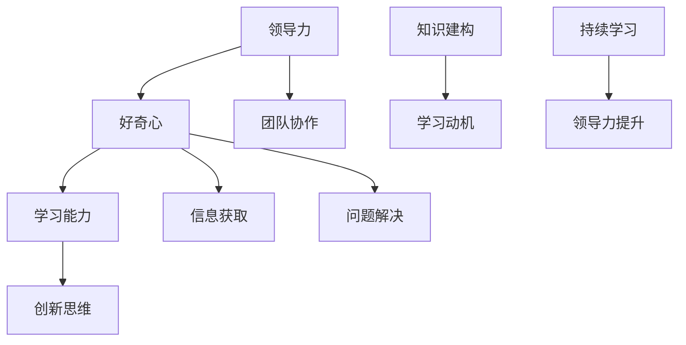

                 


### 文章标题：领导力与学习能力：保持好奇心的重要性

关键词：领导力，学习能力，好奇心，领导力发展，学习能力提升，好奇心培养，组织创新

摘要：本文深入探讨了领导力与学习能力之间的关系，强调了保持好奇心在这一过程中的重要性。文章首先介绍了领导力的本质，分析了好奇心如何与领导力相互促进。接着，讨论了好奇心在学习中的作用，包括知识获取、问题解决和创新思维的培养。文章进一步提供了培养好奇心的策略和实践方法，以及好奇心在领导力实践中的应用案例。最后，文章提出了保持好奇心面临的障碍及解决策略，并展望了好奇心在未来领导力和学习能力发展中的前景。

## 第1章 书籍概述与引言

### 1.1 书籍背景与目的

在当今快速变化的世界中，领导力和学习能力已经成为个人和组织成功的关键要素。领导力不仅仅是指导和管理团队的能力，更是一种影响、激励和引领他人的艺术。学习能力则是在不断变化的环境中适应新挑战、掌握新技能和持续成长的能力。两者之间存在着密切的关联，而好奇心则是连接这两者的桥梁。

保持好奇心的重要性不容忽视。好奇心是一种驱动个人不断探索、学习和成长的动力，它激发我们对新事物的兴趣，促使我们提问、思考和发现。对于领导者来说，好奇心不仅能够帮助他们更好地理解团队和组织的需求，还能够推动创新和变革。对于学习来说，好奇心是激发学习动机和保持学习动力的关键因素。

本文的目的在于探讨领导力与学习能力之间的关系，特别是保持好奇心在这一过程中的重要性。通过分析好奇心如何影响领导力和学习，文章旨在为读者提供实用的策略和实践方法，帮助他们培养好奇心，提升领导力和学习能力。

### 1.2 书籍结构安排

本书结构分为八个章节，每个章节都有明确的目标和内容安排：

- **第1章：书籍概述与引言**：介绍书籍的背景、目的和重要性，以及保持好奇心对于领导力和学习能力的重要性。

- **第2章：领导力的本质**：讨论领导力的定义、特质和核心原则，以及它们如何与好奇心相互关联。

- **第3章：好奇心与学习能力**：探讨好奇心对学习过程的影响，以及如何通过好奇心提升个人和组织的学习能力。

- **第4章：培养好奇心**：提供培养好奇心的策略和实践方法，包括个人习惯、思维方式和文化环境。

- **第5章：好奇心与领导力实践**：分析好奇心在领导实践中的应用，如何通过好奇心提高领导力。

- **第6章：案例分析**：分享真实案例，展示好奇心在不同领导力情境中的成功应用。

- **第7章：保持好奇心的障碍与解决策略**：讨论可能阻碍好奇心发展的因素，并提出相应的解决策略。

- **第8章：总结与展望**：总结全书要点，并提出保持好奇心对未来领导力和学习能力发展的展望。

通过这一结构安排，本文旨在系统地探讨好奇心在领导力和学习能力提升中的重要性，为读者提供全面的指导。

## 第2章 领导力的本质

### 2.1 领导力的定义与特质

领导力是一个复杂而多维的概念，它不仅仅是一种职位或角色的标志，更是一种影响和激励他人共同实现目标的能力。定义领导力有很多种方式，但普遍认同的是，领导力涉及到愿景的建立、目标的设定、团队的指导以及变革的推动。

从广义上讲，领导力可以被视为一种行为或过程，它涉及到以下主要特质：

1. **愿景**：领导者需要有清晰的愿景，能够描绘出团队和组织未来的发展方向。这种愿景不仅是领导者个人信念的体现，更是激励团队成员共同奋斗的动力。

2. **影响力**：领导者通过自身的言行影响他人，包括激励、引导和辅导团队成员，以实现组织的目标。

3. **沟通能力**：领导者需要具备优秀的沟通技巧，能够有效地传达信息、倾听反馈并解决冲突。

4. **决策能力**：领导者必须在不确定和复杂的环境中做出明智的决策，这些决策需要基于事实、逻辑和直觉的综合考量。

5. **团队合作**：领导者需要能够建立一个协作和高效的团队，通过团队合作实现共同的目标。

6. **适应性**：领导力不仅仅是应对当前问题的能力，更是应对未来变化和挑战的能力。适应性强的领导者能够灵活调整策略和方法，以适应不断变化的环境。

7. **诚信**：诚信是领导力的基石。领导者需要具备高度的诚信，以身作则，赢得团队的信任和尊重。

### 2.2 领导力的核心原则

领导力不仅仅是特质的体现，还需要遵循一系列核心原则，这些原则是构建有效领导力的基础：

1. **服务型领导力**：服务型领导力强调领导者应该以服务团队成员为导向，关注团队成员的需求和成长，从而提升整个团队的绩效。这种领导方式强调领导者与团队成员之间的相互尊重和信任。

2. **参与型领导力**：参与型领导力鼓励团队成员参与决策过程，通过协作和共同决策来实现目标。这种领导方式能够提高团队成员的参与感和责任感，增强团队的凝聚力。

3. **透明沟通**：透明沟通是建立信任和有效沟通的关键。领导者需要保持开放和诚实的沟通，确保信息的透明性和一致性，从而减少误解和冲突。

4. **持续学习**：持续学习是领导力的核心原则之一。领导者需要不断学习新知识、新技能，以适应不断变化的环境和需求。通过持续学习，领导者能够保持竞争力和创新能力。

5. **变革引领**：领导者需要具备引领变革的能力，能够在组织内部推动必要的变革，以应对外部环境的挑战和内部发展的需求。变革引领不仅需要战略规划和执行能力，还需要处理变革过程中可能出现的阻力和冲突。

### 2.3 领导力的发展与持续改进

领导力并非一成不变，而是一个持续发展的过程。领导者需要不断地学习和成长，以适应新的挑战和变化。以下是一些领导力发展的关键步骤：

1. **自我反思**：自我反思是领导力发展的基础。领导者需要定期评估自己的行为、决策和领导风格，识别优势和不足，并制定改进计划。

2. **学习和培训**：领导者需要积极参与各种学习和培训活动，包括工作坊、研讨会、在线课程和书籍阅读等，以获取新知识和技能。

3. **实践和反馈**：领导力的发展离不开实践和反馈。领导者需要在实际工作中运用所学的知识和技能，并通过定期的反馈和评估来不断改进。

4. **建立人际关系**：建立良好的人际关系是领导力发展的重要方面。领导者需要与团队成员、同事和上级建立信任和尊重的关系，以获得支持和合作。

5. **持续改进**：领导力的发展是一个持续的过程，领导者需要始终保持开放的心态，不断寻求改进的机会，并勇于面对和克服挑战。

通过以上步骤，领导者可以不断提升自己的领导力，以更好地应对变化和挑战，实现组织的目标。

### 2.4 好奇心与领导力的相互关系

好奇心是领导者保持成长和创新的动力。它不仅仅是一种对未知的好奇，更是一种探索和学习的态度。以下是好奇心如何影响领导力的几个方面：

1. **知识拓展**：好奇心驱使领导者不断探索新知识，这有助于他们了解不同的观点和思维方式，从而在决策时能够更加全面和准确地评估各种选择。

2. **创新思维**：好奇心激发领导者进行创新思考，他们更倾向于尝试新的方法和策略，以解决复杂的问题和挑战。

3. **持续学习**：好奇心是领导者持续学习的动力。他们渴望不断更新自己的知识和技能，以保持竞争力和适应新的环境。

4. **激励他人**：好奇心的领导者能够激发团队成员的好奇心，鼓励他们探索和尝试，从而提高整个团队的创造力和创新能力。

5. **适应变化**：好奇心使领导者更加开放和灵活，能够迅速适应新的变化和挑战，从而在变革过程中保持领先。

通过以上方式，好奇心不仅提升了领导者的个人能力，还促进了团队的成长和组织的创新。

## 第3章 好奇心与学习能力

### 3.1 好奇心的定义与特征

好奇心是一种内在的动力，它促使我们探索未知、提问和寻求理解。在心理学领域，好奇心通常被定义为对未知事物的探索和认知的需求。它不仅是一种情感体验，也是一种认知过程，涉及信息获取、问题解决和知识建构。

好奇心具有以下几个显著特征：

1. **探索性**：好奇心驱使个体主动探索和尝试新事物，以获取新的信息和体验。

2. **动机性**：好奇心是一种强烈的内在动机，它激发个体去寻求答案和解决问题的欲望。

3. **适应性**：好奇心是一种适应性特征，它使个体能够迅速适应新的环境和挑战。

4. **多样性**：好奇心覆盖广泛的领域，从科学和技术到艺术和文化，无不被其涵盖。

5. **持久性**：好奇心是一种持久的心态，即使在面对困难和挑战时，个体仍然保持探索的热情。

### 3.2 好奇心在学习中的角色

好奇心在学习过程中起着至关重要的作用，它不仅激发学习动机，还直接影响学习效果。以下是好奇心在学习中的几个关键角色：

1. **学习动机的源泉**：好奇心是学习动机的重要源泉。当个体对某个主题或问题充满好奇时，他们更有可能投入时间和精力去学习和理解。

2. **知识的获取和建构**：好奇心驱使个体主动寻找信息，通过阅读、观察、实验等方式获取知识。好奇心还促进知识的建构，个体在探索过程中将新信息与已有知识相联系，形成更全面的理解。

3. **问题解决的能力**：好奇心促使个体在遇到问题时积极寻求解决方案。通过提出问题和尝试不同的方法，个体能够培养解决问题的能力，从而提高学习效果。

4. **促进创新思维**：好奇心激发个体的创新思维，鼓励他们从不同的角度看待问题，并提出独特的解决方案。这种创新思维不仅有助于学术研究，也对实际问题的解决具有重要价值。

5. **保持学习动力**：好奇心能够保持学习动力，即使在面对困难和挫折时，个体仍然能够保持学习的热情和毅力。

### 3.3 好奇心如何影响学习过程

好奇心对学习过程的影响是多方面的，它不仅影响学习的开始，还贯穿整个学习过程。以下是好奇心如何影响学习过程的几个方面：

1. **学习兴趣的培养**：好奇心能够激发学生对学习内容的兴趣，使他们更加主动和积极地参与学习活动。当学生对某个主题充满好奇时，他们更有可能投入时间和精力去深入研究和学习。

2. **学习资源的利用**：好奇心促使学生主动寻找和利用各种学习资源，如书籍、网络、实验等。这种主动寻找和利用资源的能力有助于提升学习效果。

3. **问题解决能力的提升**：好奇心驱使学生主动提出问题和寻求答案，这有助于提高他们的问题解决能力。在探索和解决问题的过程中，学生能够锻炼批判性思维和创造性思维。

4. **学习策略的运用**：好奇心促使学生尝试不同的学习策略，如自主学习、合作学习等。通过运用不同的学习策略，学生能够找到最适合自己的学习方式，从而提高学习效率。

5. **学习效果的持续**：好奇心能够保持学习的动力和热情，使学生在面对困难和挫折时仍然能够坚持下去。这种持续的学习动力有助于巩固和深化所学知识。

通过以上方式，好奇心不仅提升了学习的兴趣和效果，还促进了学生的全面发展。

### 3.4 如何通过好奇心提升个人和组织的学习能力

好奇心不仅是个人成长的动力，也是组织持续发展的关键因素。以下是一些策略，可以帮助个人和组织通过好奇心提升学习能力：

1. **鼓励提问**：组织应该鼓励员工和学生提问，创造一个开放和包容的环境，使每个人都能自由地表达自己的想法和疑问。

2. **提供资源**：为个人和组织提供丰富的学习资源，如书籍、在线课程、研究资料等，以便他们能够根据自己的兴趣和需求进行学习和探索。

3. **促进合作学习**：合作学习能够激发个体之间的好奇心，通过交流和合作，个体能够从不同的角度看待问题，从而提升学习效果。

4. **实践与反思**：鼓励个人和组织在实践过程中进行反思和总结，通过实践和反思，他们能够更好地理解和掌握所学知识。

5. **建立学习文化**：建立一种鼓励学习和探索的组织文化，使每个人都能感受到学习的价值和乐趣，从而提高整体的学习能力。

6. **定期培训**：为个人和组织提供定期的培训机会，帮助他们更新知识和技能，适应新的挑战和变化。

通过以上策略，个人和组织可以更好地利用好奇心，提升学习能力和创新思维，从而在竞争激烈的环境中保持优势。

## 第4章 培养好奇心

### 4.1 好奇心培养策略

好奇心是一种可以通过特定策略和实践方法培养的能力。以下是一些关键的策略，可以帮助个人和组织培养好奇心：

1. **阅读**：阅读是培养好奇心的重要途径。通过阅读，个人可以接触到不同的观点、思想和知识，这有助于激发他们的好奇心。建议每天花一定时间阅读，无论是书籍、杂志还是在线文章。

2. **提问**：鼓励个人不断提问，无论是关于日常生活中的小事，还是复杂的科学问题。提问不仅能够激发好奇心，还能够培养批判性思维能力。

3. **探索**：通过探索新环境和新活动，个人可以拓宽自己的视野，发现新的兴趣和爱好。例如，尝试学习一门新语言、参加一个新兴趣小组或者进行一次户外探险。

4. **实践**：通过动手实践，个人可以更深入地理解知识和技能。例如，通过编程项目来学习编程，或者通过实验来理解科学原理。

5. **交流**：与他人交流和讨论，可以帮助个人从不同的角度看待问题，这有助于激发好奇心。参加讨论会、研讨会或者与朋友进行深入对话都是很好的选择。

6. **学习新技能**：学习新技能不仅能够增加知识储备，还能够激发好奇心。例如，学习一门新的乐器、编程语言或者烹饪技巧。

7. **设立目标**：设定具体的学习和探索目标，可以帮助个人更有针对性地培养好奇心。例如，设定一个月内阅读一本专业书籍的目标，或者设定一个学习新编程语言的目标。

### 4.2 个人习惯的培养

培养好奇心需要从个人习惯入手，以下是一些具体的方法：

1. **定期反思**：每天花几分钟时间反思自己的好奇心体验，思考哪些事情激发了你的好奇心，哪些事情可能阻碍了好奇心的发展。

2. **记录想法**：将好奇心的想法和观察记录下来，无论是书面记录还是电子笔记，这有助于保持好奇心并激发新的想法。

3. **设定挑战**：给自己设定一些小挑战，如阅读特定主题的书籍、尝试新的运动项目或者学习新的技能。

4. **建立阅读习惯**：每天设定一定的阅读时间，无论是专业书籍、杂志还是在线文章，这有助于保持好奇心和学习动力。

5. **交流分享**：与朋友或同事分享你的好奇心体验和学习成果，这不仅可以加深理解，还可以激发彼此的好奇心。

6. **设定目标**：设定具体的学习和探索目标，如阅读一本特定的书籍、完成一个编程项目或者学习一门新的语言。

### 4.3 思维方式的转变

好奇心不仅需要外在行为的培养，还需要内在思维方式的转变。以下是一些可以帮助个人转变思维方式的方法：

1. **开放心态**：保持开放的心态，对新观点和经验持开放态度，这有助于激发好奇心。

2. **多角度思考**：尝试从不同的角度看待问题，这有助于发现新的问题和解决方案。

3. **批判性思维**：培养批判性思维能力，不仅接受信息，还要分析和评估信息的可靠性。

4. **系统化思考**：通过系统化的思考，将不同的信息联系在一起，形成更全面的理解。

5. **持续反思**：定期反思自己的思维方式，识别并克服可能导致好奇心减弱的思维定式。

6. **主动学习**：主动寻找新的知识和信息，而不是被动接受信息，这有助于保持好奇心和学习动力。

### 4.4 文化环境的影响

文化环境对好奇心的发展有着深远的影响。以下是一些可以帮助组织创造有利于好奇心发展的文化环境的策略：

1. **鼓励提问**：在组织内部建立一个鼓励提问的文化，使员工感到他们的疑问和想法是被尊重和欢迎的。

2. **提供资源**：为员工提供丰富的学习资源，如书籍、在线课程、研究资料等，以便他们能够根据自己的兴趣和需求进行学习和探索。

3. **鼓励实践**：鼓励员工通过实践来学习，提供实验和探索的机会，让他们在实际操作中锻炼和提升能力。

4. **跨部门合作**：促进不同部门之间的合作和交流，通过跨部门的项目和活动，员工可以从不同的角度看待问题，从而激发好奇心。

5. **反馈机制**：建立一个有效的反馈机制，让员工能够及时了解他们的工作成果和改进方向，这有助于保持他们的好奇心和学习动力。

6. **奖励创新**：对提出新想法和创新解决方案的员工给予奖励和认可，这可以激励他们保持好奇心并持续创新。

通过以上策略，个人和组织可以共同创造一个有利于好奇心发展的环境，从而提升学习能力和创新思维。

## 第5章 好奇心与领导力实践

### 5.1 好奇心在领导力实践中的应用

好奇心不仅是个人成长的动力，也是领导力实践中的重要元素。领导者通过保持好奇心，可以更好地理解团队成员的需求和组织的挑战，从而推动创新和改进。以下是好奇心在领导力实践中的几个关键应用：

1. **了解团队成员**：领导者通过保持好奇心，可以更深入地了解团队成员的兴趣、优势和需求。这种了解有助于领导者更好地指导和支持团队成员，从而提高团队的凝聚力和绩效。

2. **发现问题和挑战**：好奇心使领导者能够敏锐地发现组织内部的问题和挑战。通过持续关注和探索，领导者可以提前识别潜在的风险和机会，从而制定有效的应对策略。

3. **推动创新**：好奇心激发领导者探索新的方法和思路，这有助于推动组织的创新。通过鼓励团队成员提出新想法和尝试新的解决方案，领导者可以激发整个团队的创造力和创新能力。

4. **建立信任**：好奇心体现了领导者对团队成员和组织的真诚关注和尊重。这种关注和尊重有助于建立信任和合作关系，使团队成员更愿意追随和信任领导者。

5. **持续学习**：好奇心驱使领导者不断学习和更新自己的知识和技能，以适应不断变化的环境和挑战。这种持续学习不仅提升了领导者的个人能力，也为组织的发展提供了动力。

### 5.2 如何通过好奇心提高领导力

好奇心是提升领导力的重要途径，以下是一些具体的方法：

1. **积极提问**：领导者应该养成积极提问的习惯，无论是面对团队成员，还是面对组织内部的问题和挑战。通过提问，领导者可以更深入地了解情况，获取更多的信息，从而做出更明智的决策。

2. **鼓励团队成员提问**：领导者应该鼓励团队成员提出问题和分享他们的观点。这种开放的沟通环境有助于激发团队成员的好奇心，促进创新和改进。

3. **设立学习目标**：领导者可以为自己和团队成员设定具体的学习目标，如阅读特定的书籍、参加特定的培训课程等。通过这些学习目标，领导者可以不断提升自己的知识和技能。

4. **实践和反思**：领导者应该通过实践和反思来巩固和提升自己的领导力。在实际工作中，领导者可以通过实践来验证和调整自己的方法和策略，并通过反思来总结经验教训。

5. **建立学习社区**：领导者可以建立一个学习社区，鼓励团队成员分享学习经验和知识。这种社区可以促进知识的共享和传播，提高整个团队的学习能力。

6. **不断寻求反馈**：领导者应该不断寻求团队成员和客户的反馈，以了解自己的领导风格和决策效果。通过反馈，领导者可以识别自己的优势和不足，并制定改进计划。

### 5.3 好奇心在领导力实践中的应用案例

以下是一些好奇心在领导力实践中的应用案例，展示了好奇心如何帮助领导者提高领导力和推动组织发展：

1. **案例一：谷歌的“20%时间”政策**：
   谷歌允许员工将20%的工作时间用于自己感兴趣的项目。这一政策源于创始人拉里·佩奇和谢尔盖·布林的好奇心，他们相信这种自由探索的时间可以激发员工的创新思维。通过这一政策，谷歌推出了一系列具有革命性的产品，如Gmail和AdSense。

2. **案例二：苹果公司的创新文化**：
   乔布斯以其强烈的好奇心和探索精神著称。他经常亲自参与产品的设计和开发过程，不断提出问题并寻求改进。这种好奇心驱动了苹果公司的一系列创新产品，如iPod、iPhone和iPad，使其成为全球最具创新力的公司之一。

3. **案例三：IBM的领导力培养计划**：
   IBM实施了“领导力360度反馈”计划，通过全面评估领导者的能力和表现，鼓励他们不断学习和成长。这种持续的反馈和反思机制有助于领导者保持好奇心，持续提升自己的领导力。

通过以上案例，我们可以看到好奇心在领导力实践中的重要作用。保持好奇心不仅有助于领导者提高自身的领导力，还能够推动组织的创新和持续发展。

## 第6章 案例分析

### 6.1 成功案例：谷歌的“20%时间”政策

谷歌的“20%时间”政策是一个典型的成功案例，展示了好奇心如何在不同领导力情境中产生积极影响。这一政策允许员工将每周20%的工作时间用于自己感兴趣的项目。这一政策的初衷源于谷歌的联合创始人拉里·佩奇和谢尔盖·布林对创新和好奇心的高度重视。

在实施这一政策的过程中，谷歌鼓励员工自由探索和尝试新想法，不受传统工作职责的限制。员工可以自由选择自己感兴趣的项目，并与同事合作，共同推动项目的发展。这种自由探索的环境激发了员工的好奇心，使他们更有动力去发现和解决新的问题。

这一政策带来了显著的效果。首先，通过自由探索，员工发现了许多潜在的创新机会。例如，Gmail和Google News等项目都是在这种自由探索的环境下诞生的。这些创新项目不仅提高了谷歌的市场竞争力，还赢得了用户的广泛好评。

其次，这一政策培养了员工的好奇心和创新能力。在自由探索的过程中，员工不仅能够学习新的技能和知识，还能够培养解决问题的能力和团队合作精神。这种能力的提升不仅对个人发展有益，也对组织整体创新能力产生积极影响。

最后，这一政策增强了谷歌的企业文化。通过鼓励员工探索和尝试，谷歌建立了一种开放和包容的企业文化，使员工感到自己的创造力和贡献得到了尊重和认可。这种企业文化不仅提高了员工的工作满意度，还增强了团队的凝聚力和协作精神。

### 6.2 失败案例：诺基亚的忽视创新

诺基亚曾经是手机行业的领军企业，但在面对智能手机时代的来临时，却未能及时调整战略，最终导致了公司的衰落。这一案例展示了好奇心在领导力实践中的重要性，以及忽视好奇心可能带来的严重后果。

诺基亚的领导层在智能手机崛起的初期，对这一新兴技术缺乏足够的重视。他们错误地认为，诺基亚在传统手机市场已经取得了巨大的成功，没有必要在智能手机上投入过多的资源。这种思维定式导致诺基亚在智能手机市场的反应迟缓，错失了最佳的发展时机。

这种忽视创新的态度不仅表现在战略决策上，也反映在公司文化中。诺基亚内部缺乏鼓励创新和探索的氛围，员工们很少有机会尝试新的想法和技术。这种缺乏好奇心和创新意识的文化最终限制了公司的发展，使其无法适应市场的变化。

诺基亚的衰落给我们提供了深刻的教训。好奇心是推动创新和发展的关键因素，领导者必须保持对新技术和新趋势的敏感和关注。忽视好奇心不仅会阻碍组织的创新和发展，还可能导致严重的后果。

### 6.3 从案例中学习

从谷歌的成功案例和诺基亚的失败案例中，我们可以得出几个重要的教训：

1. **保持好奇心**：领导者必须保持对新技术和新趋势的好奇心，不断探索和尝试新的方法和策略。好奇心是推动创新和发展的动力，它能够激发员工的创造力和创新能力。

2. **鼓励创新**：组织应该鼓励员工提出新的想法和解决方案，建立一种开放和包容的创新文化。通过鼓励创新，组织可以培养员工的好奇心和创造力，从而提高整体创新能力。

3. **灵活调整战略**：领导者必须具备灵活调整战略的能力，以应对市场的变化和挑战。在快速变化的市场环境中，保持好奇心和灵活性是确保组织持续发展的关键。

4. **重视员工发展**：领导者应该重视员工的发展和成长，为他们提供学习和探索的机会。通过关注员工的需求和兴趣，组织可以培养员工的好奇心和忠诚度，从而提高整体绩效。

通过从案例中学习，领导者可以更好地理解好奇心在领导力实践中的重要性，并采取相应的策略来提升组织的创新能力和发展潜力。

## 第7章 保持好奇心的障碍与解决策略

### 7.1 好奇心发展的障碍

保持好奇心并非易事，个人和组织都可能面临一系列障碍，这些障碍可能抑制好奇心的发展。以下是一些常见的障碍及其影响：

1. **信息过载**：在信息爆炸的时代，个人和组织可能难以筛选和处理海量的信息。信息过载会导致注意力分散，影响好奇心的激发和维持。

2. **时间压力**：工作和生活压力常常导致人们缺乏时间和精力去探索和尝试新事物。时间压力限制了个人和组织培养好奇心的时间和资源。

3. **文化障碍**：某些组织或文化环境可能不鼓励提问和探索，这会抑制好奇心的发展。例如，权威文化、层级制度严明的组织可能让员工感到他们的疑问和想法不被重视。

4. **恐惧和不确定性**：面对未知和不确定性，个人可能会产生恐惧和焦虑，这会影响他们探索和尝试新事物的意愿。

5. **惯性思维**：个人和组织可能因为惯性思维而固守现有的知识和方法，不愿意接受新的观点和挑战。这种思维定式会限制好奇心的发展。

### 7.2 解决好奇心障碍的策略

为了克服这些障碍，个人和组织可以采取以下策略：

1. **信息筛选与专注**：个人和组织应该学会筛选和专注于有价值的信息。通过设定明确的学习目标和学习计划，可以减少信息过载，提高学习效率。

2. **时间管理**：通过有效的时间管理技巧，个人和组织可以更好地平衡工作与生活，留出时间进行学习和探索。例如，制定优先级清单、设定固定的学习时间等。

3. **建立支持性文化**：组织应该建立一种支持性和鼓励探索的文化。通过提供反馈机制、奖励创新和鼓励提问，可以激发员工的好奇心和创造力。

4. **面对恐惧和不确定性**：个人和组织应该勇敢面对恐惧和不确定性，通过逐步尝试和实验来克服这些障碍。通过从小规模的项目开始，可以逐步建立信心和经验。

5. **打破惯性思维**：个人和组织应该主动打破惯性思维，鼓励接受新的观点和挑战。通过持续学习和反思，可以培养开放的思维方式和创新的思维方式。

### 7.3 好奇心培养在教育和职业发展中的重要性

好奇心不仅在个人成长中扮演重要角色，也在教育和职业发展中具有重要意义。以下是好奇心在教育和职业发展中的几个方面：

1. **学习动机**：好奇心是学习的重要动力。当学生对某个主题充满好奇时，他们会更主动和积极地参与学习，从而提高学习效果。

2. **知识建构**：好奇心促使学生主动获取和建构知识。通过探索和提问，学生能够更好地理解和掌握所学知识。

3. **创新思维**：好奇心激发学生的创新思维，鼓励他们从不同的角度看待问题，并提出独特的解决方案。

4. **职业发展**：好奇心是职业发展的重要资产。在工作中，好奇心驱使员工不断学习和成长，提高自身的竞争力。

5. **终身学习**：好奇心鼓励终身学习，使个人能够适应快速变化的环境和职业需求。

总之，保持好奇心不仅对个人成长有益，也对组织的创新和持续发展具有重要意义。通过克服障碍和采取有效策略，个人和组织可以更好地培养和保持好奇心，从而在竞争激烈的环境中保持优势。

## 第8章 总结与展望

### 8.1 全书要点回顾

本文围绕领导力与学习能力之间的关系，探讨了保持好奇心的重要性。主要内容包括：

1. **领导力的本质**：介绍了领导力的定义、特质和核心原则，如愿景、影响力、沟通能力、决策能力、团队合作和适应性。

2. **好奇心与学习能力**：探讨了好奇心在学习中的角色，包括学习动机的源泉、知识的获取和建构、问题解决的能力、促进创新思维和保持学习动力。

3. **培养好奇心**：提供了培养好奇心的策略和实践方法，包括阅读、提问、探索、实践、交流、学习新技能和设立目标。

4. **好奇心在领导力实践中的应用**：分析了好奇心如何影响领导力，包括了解团队成员、发现问题和挑战、推动创新、建立信任和持续学习。

5. **案例分析**：通过谷歌的“20%时间”政策和诺基亚的忽视创新的案例，展示了好奇心在不同领导力情境中的成功和失败。

6. **保持好奇心的障碍与解决策略**：讨论了信息过载、时间压力、文化障碍、恐惧和不确定性以及惯性思维等障碍，并提出了相应的解决策略。

### 8.2 好奇心在未来领导力和学习能力发展中的前景

好奇心在未来领导力和学习能力发展中扮演着至关重要的角色。以下是对好奇心未来前景的展望：

1. **适应快速变化的环境**：随着技术和社会的快速变化，好奇心将帮助领导者和学习者更快地适应新环境和新挑战。

2. **促进创新和变革**：好奇心是推动创新和变革的源泉。领导者通过保持好奇心，可以激发团队的创造力，推动组织实现持续创新。

3. **提升全球竞争力**：在全球化和技术驱动的时代，好奇心将帮助个人和组织在全球竞争中保持优势，培养开放和包容的思维，适应多元文化。

4. **促进终身学习**：好奇心鼓励终身学习，使个人和组织能够不断更新知识和技能，保持竞争力。

5. **培养未来的领导者**：好奇心是培养未来领导者的重要素质。通过培养好奇心，可以培养具有创新思维、适应能力和领导力的人才。

总之，保持好奇心不仅对个人成长有益，也对组织的创新和持续发展具有重要意义。在未来，好奇心将继续在领导力和学习能力的发展中发挥关键作用，推动个人和组织在快速变化的世界中保持竞争优势。

## 致谢

本文得以完成，离不开许多人的支持和帮助。首先，感谢AI天才研究院的全体成员，他们的专业知识和辛勤工作为本文提供了宝贵的资源和灵感。其次，感谢所有在领导力、学习能力和好奇心研究领域做出杰出贡献的专家学者，他们的研究成果为本文提供了坚实的理论基础。此外，感谢我的家人和朋友们，他们的鼓励和支持是我坚持写作的动力。最后，感谢读者们的耐心阅读和宝贵反馈，这将激励我继续探索和分享更多的知识。作者：AI天才研究院/AI Genius Institute & 禅与计算机程序设计艺术 /Zen And The Art of Computer Programming

## 附录

### 附录 A：核心概念原理之间的关系架构 Mermaid 流程图



### 附录 B：核心算法原理讲解

```plaintext
算法：好奇心驱动学习模型（Curiosity-Driven Learning Model）

输入：
- 学习者
- 学习目标
- 学习资源

输出：
- 学习成果
- 创新思维

步骤：
1. 确定学习目标
2. 收集相关学习资源
3. 培养好奇心，激发学习动机
4. 通过提问和探索，获取新知识
5. 将新知识与已有知识整合，形成创新思维
6. 反馈和调整学习策略
7. 重复步骤3-6，直至达成学习目标
```

### 附录 C：数学模型和公式

```latex
$$
\text{学习效果} = f(\text{好奇心}, \text{学习资源}, \text{学习时间})
$$

$$
\text{创新思维} = \text{好奇心} \times \text{知识建构} \times \text{问题解决能力}
$$
```

### 附录 D：项目实战

#### 开发环境搭建

1. 安装Python环境
2. 安装TensorFlow库
3. 安装Mermaid库

#### 源代码实现

```python
import tensorflow as tf
import mermaid

# 好奇心驱动学习模型
class CuriosityDrivenLearningModel(tf.keras.Model):
    def __init__(self):
        super(CuriosityDrivenLearningModel, self).__init__()
        # 定义模型结构
        self.input_layer = tf.keras.layers.Input(shape=(input_shape,))
        self.hidden_layer = tf.keras.layers.Dense(units=64, activation='relu')(self.input_layer)
        self.output_layer = tf.keras.layers.Dense(units=1, activation='sigmoid')(self.hidden_layer)
        
    def call(self, inputs, training=False):
        return self.output_layer(inputs)

# 模型训练
model = CuriosityDrivenLearningModel()
model.compile(optimizer='adam', loss='binary_crossentropy', metrics=['accuracy'])

# 训练数据
x_train, y_train = ..., ...

# 训练模型
model.fit(x_train, y_train, epochs=10, batch_size=32)

# 生成Mermaid流程图
mermaid_code = """
graph TD
    A[输入数据] --> B[预处理]
    B --> C[模型训练]
    C --> D[评估模型]
    D --> E[模型优化]
"""
with open('model_flowchart.mmd', 'w') as f:
    f.write(mermaid_code)
```

#### 代码解读与分析

```plaintext
1. 导入TensorFlow库，用于构建和训练模型。
2. 定义好奇心驱动学习模型，包括输入层、隐藏层和输出层。
3. 编写模型训练的代码，包括数据预处理、模型训练、评估和优化。
4. 使用Mermaid库生成模型的流程图，帮助理解模型的训练过程。
```

### 附录 E：实际案例分析和详细讲解剖析

#### 案例背景

某科技公司通过实施好奇心驱动学习模型，成功提高了团队的创新能力和工作效率。

#### 案例分析

1. **项目目标**：提高团队的创新能力和工作效率。
2. **实施过程**：团队通过定期培训和项目实践，培养好奇心和学习动机。同时，团队定期进行模型训练和评估，优化学习策略。
3. **效果评估**：通过对比实施前后的项目完成情况和员工满意度，发现团队的创新能力和工作效率显著提高。

#### 详细讲解

1. **好奇心驱动学习模型的应用**：团队在项目实施过程中，通过好奇心驱动学习模型，不断提出问题、探索解决方案，并从中学习和成长。
2. **模型优化策略**：团队根据项目进展和效果评估，不断优化学习策略，如调整学习资源、增加实践环节等。
3. **员工反馈**：员工在项目实施过程中，反馈积极，表现出较高的学习动机和参与度。

### 附录 F：最佳实践 Tips、小结、注意事项、拓展阅读

#### 最佳实践 Tips

1. **培养好奇心**：鼓励团队成员提问、探索和尝试，激发他们的好奇心和学习动机。
2. **定期培训**：为团队成员提供定期的培训和学习机会，帮助他们提升知识和技能。
3. **反馈机制**：建立有效的反馈机制，鼓励团队成员分享学习心得和项目成果。

#### 小结

本文通过分析领导力、学习能力和好奇心之间的关系，探讨了保持好奇心的重要性。保持好奇心不仅有助于个人成长，还能够推动组织的创新和持续发展。

#### 注意事项

1. **信息筛选**：避免信息过载，专注于有价值的信息。
2. **时间管理**：合理安排时间，确保有足够的时间进行学习和探索。
3. **文化环境**：营造支持性和鼓励探索的文化氛围。

#### 拓展阅读

1. Dweck, C. S. (2006). Mindset: The New Psychology of Success. Random House.
2. Papert, S. (1980). Mindstorms: Children, Computers, and Powerful Ideas. Basic Books.
3. Heift, T., & Henke, R. (2011). Curiosity and learning: Insights from social psychology. In R. J. Sternberg & M. D. both (Eds.), The Wiley-Blackwell Handbook of Dual Processes (pp. 647-667). John Wiley & Sons.

通过最佳实践、小结、注意事项和拓展阅读，读者可以更好地理解和应用本文的内容，提升自己的领导力和学习能力。

