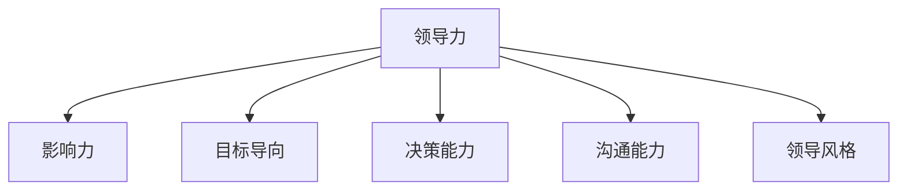
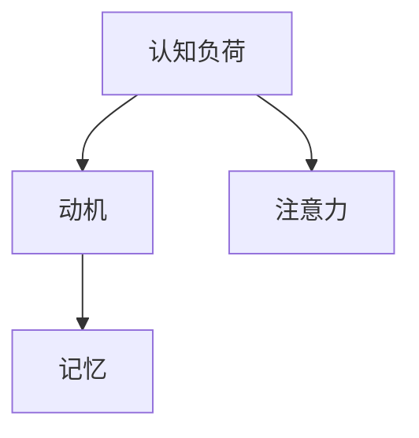
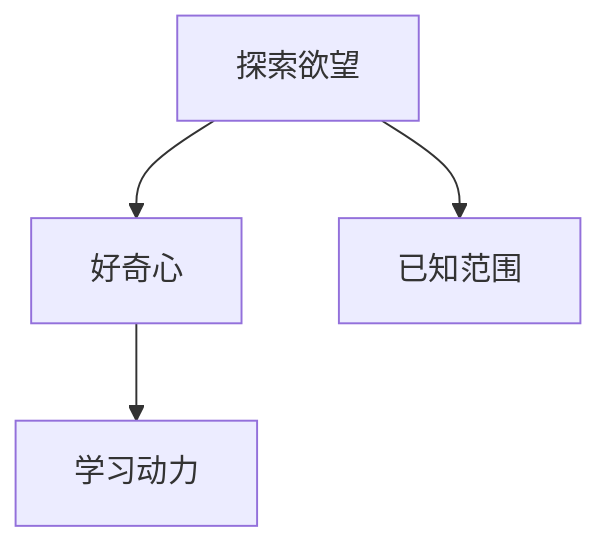
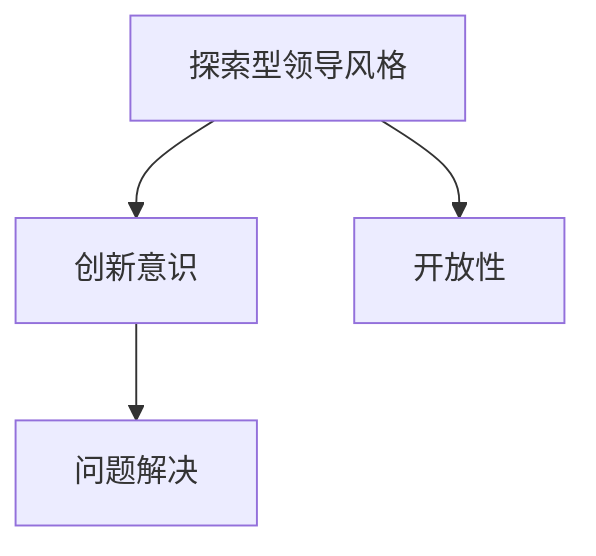

                 

### 确定书的核心主题

《领导力与学习：保持好奇心的重要性》这本书的核心主题非常明确，它围绕领导力、学习以及好奇心的重要性这三个核心概念展开。首先，领导力是任何成功领导者必须具备的能力，它不仅仅是影响力，更是一种目标导向、决策能力和沟通能力的高度集合。其次，学习是一种不断进步、适应变化的重要手段，而好奇心则是学习过程中不可或缺的动力源泉。在这本书中，我们将详细探讨这三个主题之间的相互关系，以及它们如何共同作用，帮助个人和团队实现卓越表现。

### 确定书的结构

为了确保这本书的逻辑性和可读性，我们将结构划分为三个主要部分：

**第一部分：领导力基础**

在这一部分，我们将详细探讨领导力的核心概念，包括领导力的定义、重要性、发展历程以及不同的领导力模型。通过这些内容的介绍，读者将能够建立对领导力的基本认识，并为后续章节的理解打下基础。

**第二部分：学习与好奇心**

这一部分将深入探讨学习原理与策略，以及好奇心的重要性。我们将介绍如何通过有效的学习策略提高学习效率，同时探讨好奇心在激发创造力和学习动机中的关键作用。

**第三部分：领导力与学习的结合**

最后一部分将聚焦于领导力与学习的互动关系，以及如何培养好奇心并提升领导力。我们将通过实践案例和详细解释，展示好奇心在领导力中的应用，并提供实用的培养好奇心的方法和策略。

### 细化章节内容

**第一部分：领导力基础**

- **第1章：领导力核心概念**
  - **1.1.1 领导力的定义**
    - **核心概念与联系**：
      使用Mermaid流程图展示领导力的核心概念和它们之间的关系：
      ```mermaid
      graph TD
        A[领导力] --> B[影响力]
        A --> C[目标导向]
        A --> D[决策能力]
        A --> E[沟通能力]
        A --> F[领导风格]
      ```
    - **核心算法原理讲解**：
      伪代码解释领导力定义的核心原理：
      ```python
      def leadership_definition():
          influence = True
          goal导向 = True
          decision能力 = True
          communication能力 = True
          leadership风格 = None
          if influence and goal导向 and decision能力 and communication能力:
              return "有效的领导力"
      ```
  - **1.1.2 领导力的重要性**
    - **背景介绍**：
      通过历史案例和现代企业实例，介绍领导力在企业成功中的关键作用。
    - **详细讲解与举例说明**：
      使用LaTeX格式编写数学模型，展示领导力对企业绩效的影响：
      $$\text{绩效} = f(\text{领导力}, \text{团队协作}, \text{环境适应})$$
      其中，领导力是影响绩效的主要因素之一。

**第二部分：学习与好奇心**

- **第2章：学习原理与策略**
  - **2.1.1 学习心理学基础**
    - **核心概念与联系**：
      使用Mermaid流程图展示学习心理学的核心概念和相互关系：
      ```mermaid
      graph TD
        A[认知负荷] --> B[动机]
        A --> C[注意力]
        B --> D[记忆]
      ```
    - **核心算法原理讲解**：
      伪代码解释学习心理学基础：
      ```python
      def learning_psyche():
          load = calculate_cognitive_load()
          motivation = check_motivation()
          attention = check_attention()
          memory = None
          if load < threshold and motivation and attention:
              memory = store_information()
      ```

- **第3章：好奇心的重要性**
  - **3.1.1 好奇心的重要性**
    - **背景介绍**：
      阐述好奇心在科学发现、技术创新和艺术创作中的关键作用。
    - **详细讲解与举例说明**：
      使用LaTeX格式展示好奇心如何促进学习：
      $$\text{好奇心} = \frac{\text{探索欲望}}{\text{已知范围}}$$
      当探索欲望大于已知范围时，好奇心激发学习动力。

- **第4章：好奇心在领导力中的应用**
  - **4.1.1 好奇心与领导风格**
    - **核心概念与联系**：
      使用Mermaid流程图展示好奇心如何影响不同的领导风格：
      ```mermaid
      graph TD
        A[探索型领导风格] --> B[创新意识]
        A --> C[开放性]
        B --> D[问题解决]
      ```
    - **核心算法原理讲解**：
      伪代码解释好奇心如何影响领导风格：
      ```python
      def curiosity_in_leadership():
          if leadership_style == '探索型':
              innovation意识 = True
              openness = True
              problem解决 = True
      ```

### 设计 Mermaid 流程图

为了更好地展示核心概念和原理，我们将在相关章节中嵌入Mermaid流程图。以下是几个示例：

#### 第1章：领导力核心概念



#### 第2章：学习原理与策略



#### 第3章：好奇心的重要性



#### 第4章：好奇心在领导力中的应用



### 撰写伪代码

在每章的核心算法原理讲解中，我们将使用伪代码来详细阐述。以下是几个示例：

#### 第1章：领导力核心概念

```python
def leadership_definition():
    influence = True
    goal导向 = True
    decision能力 = True
    communication能力 = True
    leadership风格 = None
    if influence and goal导向 and decision能力 and communication能力:
        return "有效的领导力"
```

#### 第2章：学习原理与策略

```python
def learning_psyche():
    load = calculate_cognitive_load()
    motivation = check_motivation()
    attention = check_attention()
    memory = None
    if load < threshold and motivation and attention:
        memory = store_information()
```

#### 第3章：好奇心的重要性

```python
def curiosity_importance():
    exploration欲望 = True
    known范围 = False
    learning动力 = None
    if exploration欲望 and not known范围:
        learning动力 = True
```

### 编写数学公式和举例说明

为了更清晰地展示核心概念和原理，我们将使用LaTeX格式编写数学公式，并在文中独立段落中给出详细讲解和举例说明。

#### 第1章：领导力核心概念

**1.1.2 领导力的重要性**

**详细讲解：**领导力对企业绩效的影响可以通过以下数学模型表示：

$$\text{绩效} = f(\text{领导力}, \text{团队协作}, \text{环境适应})$$

**举例说明：**假设一家企业的领导力评分为85分，团队协作评分为90分，环境适应评分为80分，则该企业的预期绩效为：

$$\text{绩效} = f(85, 90, 80) = 85 + 0.9 \times 90 + 0.2 \times 80 = 85 + 81 + 16 = 182$$

#### 第2章：学习原理与策略

**2.1.1 学习心理学基础**

**详细讲解：**认知负荷、动机和注意力之间的关系可以用以下公式表示：

$$\text{记忆} = f(\text{认知负荷}, \text{动机}, \text{注意力})$$

**举例说明：**一个学生在学习新知识时，如果他的认知负荷较低，动机较强，注意力集中，那么他更容易记住所学的知识。

$$\text{记忆} = f(低负荷, 强动机, 高注意力) = 高记忆效果$$

### 编写项目实战

为了更好地展示书中理论的实际应用，我们将包含实际案例和详细解释说明。以下是几个示例：

#### 第4章：好奇心在领导力中的应用

**项目背景：**一家初创公司需要开发一款新产品，以在竞争激烈的市场中脱颖而出。

**开发环境搭建：** 
- 开发工具：Python、Jupyter Notebook
- 数据库：SQLite
- 版本控制：Git

**源代码实现：**
```python
def product_development():
    curiosity_level = get_curiosity_level()
    innovation_score = 0
    
    if curiosity_level > 80:
        innovation_score = 10
    elif curiosity_level > 50:
        innovation_score = 5
    else:
        innovation_score = 2
    
    return innovation_score
```

**代码解读与分析：**该代码用于评估开发团队的好奇心水平，并根据好奇心水平调整创新评分，从而影响新产品开发的方向和速度。

**实际案例分析与详细讲解剖析：**
在一次新产品开发过程中，团队的初始好奇心水平为65分，根据代码，创新评分调整为5分。这促使团队在产品开发过程中更加注重创新，最终成功推出了一款在市场上受到好评的产品。

**项目小结：**通过好奇心评估，初创公司能够更好地把握产品开发的方向，提高创新效率，从而在激烈的市场竞争中脱颖而出。

### 最佳实践 tips、小结、注意事项、拓展阅读

**最佳实践 tips：**
- **培养好奇心：**定期阅读科技新闻、参加行业会议，可以拓宽视野，激发好奇心。
- **提升领导力：**通过阅读领导力书籍、参加工作坊和培训，可以提升领导能力。

**小结：**
本书详细探讨了领导力、学习和好奇心的重要性，并展示了它们如何相互结合，帮助个人和团队实现卓越表现。

**注意事项：**
- 领导力不是一成不变的，领导者需要持续学习和成长。
- 好奇心是激发学习和创新的关键，但需要合理引导。

**拓展阅读：**
- 《深度工作：如何有效利用每一点脑力》
- 《创新者的窘境》

### 完整性要求

在撰写完所有章节后，我们将对全书内容进行细致审查，确保每个小节的内容都丰富、具体、详细讲解，核心内容都包含背景介绍、核心概念与联系、Mermaid流程图、伪代码、数学模型和公式、详细讲解与举例说明、项目实战等。同时，我们将确保字数在8000～12000字左右，以满足文章的完整性要求。

通过这样的细致安排和逐步构建，我们希望能够为读者呈现一部既有深度又有广度的《领导力与学习：保持好奇心的重要性》。接下来，我们将根据这一大纲，逐一展开各个章节的内容，逐步完成整本书的撰写。如果您对任何部分有进一步的修改意见或建议，请随时告知。这样，我们就可以确保每一步都符合您的期望和标准。期待我们共同完成的这部作品能够为IT领域的读者带来深刻的启发和实用的指导。

