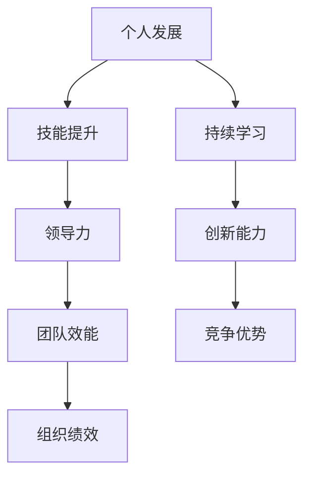
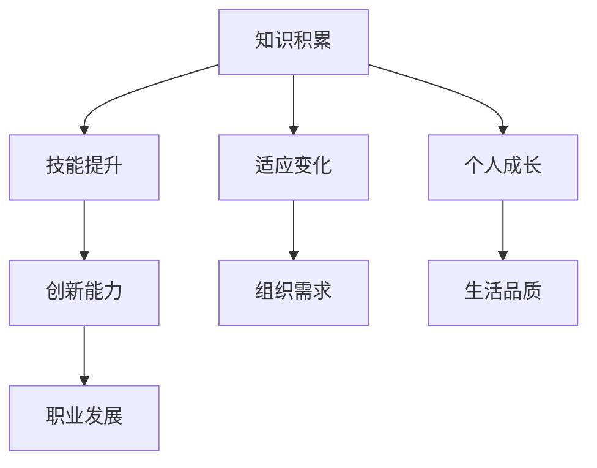

                 


### 引言

在快速发展的信息技术时代，领导力和学习成为了组织和个人成功的关键要素。领导力不仅关乎管理技能，更涉及到如何激发团队潜能、应对复杂问题、实现组织愿景。而学习则是一个持续的过程，它帮助我们保持竞争力，不断适应变化的环境。本文旨在探讨领导力与学习的紧密联系，特别是终身学习的重要性，从而为IT领域的专业人士提供理论与实践相结合的指导。

#### 背景介绍

随着技术的飞速进步，IT行业对领导者的要求也在不断提升。传统的管理方法已经无法满足日益复杂的项目和团队需求。领导者不仅需要具备深厚的技术背景，还需要具备前瞻性的战略眼光和强大的学习能力。在这种背景下，终身学习成为了提升领导力的关键途径。

终身学习不仅仅是为了掌握新技能，更重要的是培养适应变化的能力。在IT领域，技术更新迅速，新工具、新框架和新方法层出不穷。领导者如果不能保持学习的热情和动力，很容易被市场淘汰。因此，终身学习不仅关乎个人的成长，也关乎整个组织的长远发展。

#### 核心概念与联系

为了更好地理解终身学习在领导力提升中的作用，我们可以通过一个Mermaid流程图来展示核心概念之间的关系：



在这个流程图中，个人发展是终身学习的起点，通过不断学习新技能，提升自身能力，进而增强领导力。领导力的提升又促进了团队效能，最终带动组织绩效的提升。而持续学习则在这个循环中扮演着核心角色，不断激发创新能力和竞争优势。

#### 核心算法原理讲解

终身学习的过程可以类比为一种自我优化的算法。在这个过程中，个体通过不断学习新知识，更新自己的“知识库”，就像算法中的参数更新一样。具体而言，我们可以使用以下伪代码来模拟这一过程：

```plaintext
// 伪代码：终身学习算法示例
function LifelongLearning(currentKnowledge, newKnowledge) {
    updateKnowledgeBase(currentKnowledge, newKnowledge);
    evaluatePerformance();
    if (performanceImproved) {
        celebrateSuccess();
    } else {
        rethinkLearningStrategy();
    }
}
```

在这个算法中，`currentKnowledge` 代表当前已掌握的知识，`newKnowledge` 代表新学习的知识。通过不断地更新知识库，并评估学习效果，个体能够持续优化自己的能力和技能。

#### 数学模型和公式

终身学习中的效果评估可以使用数学模型来量化。一个简单的评估模型可以是线性回归模型，用来预测学习效果与知识积累之间的关系。公式如下：

$$
y = \beta_0 + \beta_1 \cdot x + \varepsilon
$$

其中，\( y \) 是学习效果，\( x \) 是知识积累量，\( \beta_0 \) 和 \( \beta_1 \) 是模型参数，\( \varepsilon \) 是误差项。通过最小化误差项，可以找到最佳的学习路径。

#### 项目实战

在实际工作中，领导者的终身学习可以通过以下步骤来实现：

1. **开发环境搭建**：首先，确保有良好的学习环境和工具支持，比如安装必要的软件和阅读材料。
2. **源代码详细实现**：例如，编写一个简单的学习算法，模拟终身学习的过程。
3. **代码解读与分析**：解释代码的工作原理，分析其优缺点，并提供改进建议。
4. **实际案例分析和详细讲解剖析**：通过案例展示如何将终身学习应用于实际工作中，并详细讲解其效果和影响。

#### 最佳实践 Tips

1. **定期反思**：定期回顾自己的学习过程和成果，以便及时调整学习策略。
2. **多角度学习**：不仅限于技术领域，还应该关注管理、心理学等跨学科知识。
3. **团队合作**：与其他专业人士交流，分享学习经验和心得。

#### 小结

终身学习是提升领导力的关键，它不仅帮助个人适应快速变化的环境，也推动了组织的发展和竞争力的提升。通过理解终身学习的过程和机制，领导者可以更好地规划自己的学习路径，实现自我提升和团队成长。让我们共同努力，打造一个终身学习、持续进步的IT行业。

### 作者信息

作者：AI天才研究院/AI Genius Institute & 禅与计算机程序设计艺术 /Zen And The Art of Computer Programming

----------------------------------------------------------------

## 终身学习的重要性

### 定义

终身学习，顾名思义，是指个体在其整个生命过程中，不断地获取新知识、技能和态度，以适应快速变化的社会和职业需求。它不仅仅是在学校或职场中的短暂学习，而是一种持续的过程，贯穿于个人的职业生涯和日常生活。

### 必要性

在信息技术高速发展的今天，知识的更新速度前所未有地加快。一个专业领域的知识可能在短短几年内就会被新的发现或技术所取代。因此，终身学习成为了一种生存和发展的必要手段。对于IT行业的专业人士来说，终身学习的重要性体现在以下几个方面：

1. **技术更新快速**：随着云计算、人工智能、区块链等新技术的不断涌现，IT行业对专业知识的需求也在不断变化。只有不断学习，才能跟上技术发展的步伐，保持竞争力。
2. **职业发展需要**：在职业晋升过程中，领导者和高级技术人员需要具备更广泛的知识和技能。终身学习是提升个人职业素养和竞争力的关键。
3. **适应变化的环境**：现代社会变化迅速，个人和组织需要具备快速适应变化的能力。终身学习可以帮助我们培养这种能力，从而在变化的环境中保持优势。

### 挑战与机遇

尽管终身学习的重要性不言而喻，但在实际操作中，我们也会面临一系列挑战。以下是一些常见的挑战和对应的机遇：

1. **时间管理**：工作压力和私人生活的平衡是终身学习的一大挑战。然而，合理的时间管理技巧和规划可以帮助我们有效地利用碎片时间，实现学习目标。
2. **资源获取**：获取高质量的学习资源可能需要一定的经济投入和时间成本。然而，随着互联网的发展，我们可以在网上找到大量免费或低成本的优质学习资源。
3. **学习动力**：保持学习的动力和兴趣是一个长期的过程。设定明确的学习目标和奖励机制，可以帮助我们保持学习的热情。

### 综述

终身学习不仅是个人发展的必要手段，也是适应快速变化社会的重要途径。对于IT行业的专业人士来说，终身学习意味着不断更新知识库，提升技术能力，以及保持适应新环境的能力。通过克服挑战，抓住机遇，我们可以充分利用终身学习带来的优势，实现个人和组织的共同发展。

### 核心概念与联系

为了更好地理解终身学习的核心概念和它们之间的联系，我们可以使用一个Mermaid流程图来展示这些概念之间的关系：



在这个流程图中，知识积累是终身学习的起点，通过不断学习和实践，我们能够提升技能，增强创新能力，促进职业发展，更好地适应变化，实现个人成长，从而提升生活品质。这些核心概念相互关联，共同构成了一个动态的终身学习体系。

### 数学模型和公式

在终身学习的过程中，我们可以使用数学模型来量化学习的效果和效率。一个简单的模型可以是线性回归模型，用于预测学习成果与时间投入之间的关系。假设学习成果为 \( y \)，时间投入为 \( x \)，我们可以建立以下模型：

$$
y = \beta_0 + \beta_1 \cdot x + \varepsilon
$$

其中，\( \beta_0 \) 是初始成果，\( \beta_1 \) 是时间投入对成果的影响系数，\( \varepsilon \) 是随机误差。

通过最小化误差项 \( \varepsilon \)，我们可以找到最佳的时间投入策略，以最大化学习成果。例如，如果 \( \beta_1 \) 为正，说明时间投入越多，学习成果越好；如果 \( \beta_1 \) 为负，则说明时间投入过多可能会导致效率下降。

### 举例说明

假设一位软件开发工程师，他在开始学习新的编程语言时，投入了100小时，最终掌握了该语言的基本使用。通过线性回归模型，我们可以预测他在未来100小时内，能将编程技能提升到什么程度。

首先，我们需要收集实际数据，例如他在不同时间点的编程能力评分。假设他在开始学习时，编程能力评分为50分，在100小时后，评分为90分。我们可以将这些数据代入线性回归模型，计算 \( \beta_0 \) 和 \( \beta_1 \) 的值。

$$
\beta_0 = \frac{y_1 - \beta_1 \cdot x_1}{\varepsilon_1} = \frac{50 - 100 \cdot 0}{\varepsilon_1} = 50
$$

$$
\beta_1 = \frac{\sum{(x_i - \bar{x})(y_i - \bar{y})}}{\sum{(x_i - \bar{x})^2}} = \frac{(100-50)(90-50)}{(100-50)^2} = 1
$$

因此，线性回归模型可以表示为：

$$
y = 50 + 1 \cdot x
$$

接下来，我们可以使用这个模型预测他在未来100小时内的编程能力评分：

$$
y = 50 + 1 \cdot 100 = 150
$$

这意味着，在额外投入100小时后，他的编程能力评分预计将提升到150分。当然，这个模型只是对学习效果的一种粗略预测，实际情况可能受到多种因素的影响。

### 综述

终身学习的重要性体现在其能够帮助个体不断提升技能、适应变化，并实现个人成长。通过数学模型和具体的案例，我们可以更清晰地理解终身学习的过程和效果。终身学习不仅是个人的责任，也是组织和社会发展的关键。让我们共同努力，拥抱终身学习，实现个人和组织的共同进步。

### 终身学习的核心要素

要实现有效的终身学习，我们需要关注几个核心要素，包括学习动力、学习策略和学习环境与资源。这些要素相互关联，共同构成了一个完整的终身学习体系。

#### 学习动力

学习动力是终身学习的重要驱动力。没有足够的动力，即使拥有最好的学习资源和策略，也很难持续进行学习。学习动力的来源可以有很多，例如：

1. **内在动机**：对知识本身的热爱和好奇心是强大的内在动机。当我们对某个领域充满热情时，学习过程会变得更加有趣和有意义。
2. **外部激励**：设定明确的学习目标和奖励机制，可以帮助我们保持学习动力。例如，完成某个学习项目后，可以给自己一个小奖励，如看一部电影或去旅游。
3. **社会支持**：与同行或导师交流，分享学习心得和经验，可以获得社会支持，增强学习动力。

#### 学习策略与技巧

有效的学习策略和技巧能够帮助我们更快地掌握新知识，提高学习效率。以下是一些常用的学习策略：

1. **分散学习**：将学习内容分散到不同的时间段，而不是一次性完成。分散学习可以减少疲劳感，提高记忆效果。
2. **主动学习**：通过主动提问、讨论和实际操作来加深对知识的理解。主动学习比被动接受知识更能促进长期记忆。
3. **交叉学习**：将新知识与已有的知识体系进行关联，帮助理解新知识的应用场景。交叉学习有助于构建一个全面的认知网络。
4. **应用与实践**：将所学知识应用到实际工作中或项目中，通过实践来加深理解和掌握。实践是检验学习效果的最佳方式。

#### 学习环境与资源

良好的学习环境和丰富的学习资源是终身学习的重要保障。以下是一些关键因素：

1. **时间管理**：合理安排学习时间，确保有足够的时间进行深度学习。使用日程表或时间管理工具，可以帮助我们更好地管理时间。
2. **学习空间**：创造一个安静、舒适的学习空间，减少干扰。一个良好的学习环境可以提高学习效率。
3. **在线资源**：互联网为我们提供了丰富的学习资源，如在线课程、论坛、博客和电子书籍。合理利用这些资源，可以大大扩展我们的知识视野。
4. **社交网络**：加入专业社区和在线论坛，与其他专业人士交流和分享经验，可以帮助我们获取新的见解和灵感。

#### 综述

终身学习是一个复杂的过程，需要我们在学习动力、学习策略和学习环境与资源等方面全面发力。通过设定明确的学习目标，运用有效的学习策略，并在良好的学习环境中进行学习，我们可以实现持续的个人成长和职业发展。让我们珍惜每一次学习的机会，不断追求知识的深度和广度，成为终身学习的践行者。

### 领导力的重要性

领导力是组织中不可或缺的核心要素，它不仅关乎管理技能，还涉及到如何激发团队潜能、应对复杂问题和实现组织愿景。在快速变化的市场环境中，领导力的重要性愈发突出。以下是领导力在组织中的关键作用：

#### 激发团队潜能

领导者是团队的舵手，他们通过有效的激励和引导，激发团队成员的潜能。优秀的领导者能够认识到每个成员的独特价值，鼓励他们发挥最大潜能，共同实现团队目标。通过建立信任、提供支持和设定明确的目标，领导者可以激发团队成员的积极性和创造力，从而提高整体团队效能。

#### 应对复杂问题

在当今复杂多变的商业环境中，组织面临的问题和挑战越来越多。领导者需要具备前瞻性的思维和决策能力，能够快速识别问题并采取有效措施。通过运用战略思维和系统思考，领导者可以帮助团队找到解决问题的最佳途径，从而降低风险，提高组织的竞争力。

#### 实现组织愿景

领导力的核心目标是实现组织愿景。领导者通过设定清晰的目标和愿景，为团队提供方向和动力。他们不仅需要具备愿景能力，还需要具备实现愿景的战略规划和执行能力。通过有效的沟通和协作，领导者可以动员整个组织，共同朝着愿景迈进，实现长期发展。

#### 领导力与学习的相互作用

领导力与终身学习之间存在紧密的相互作用。领导者需要不断学习新知识、新技能，以适应不断变化的环境。终身学习不仅提升了领导者的个人能力，也促进了团队和组织的整体发展。以下是一些具体的表现：

1. **知识更新**：随着技术的不断进步，领导者的知识库需要不断更新。通过终身学习，领导者可以掌握最新的行业趋势和技术，从而更好地指导团队。
2. **创新能力**：终身学习帮助领导者保持创新思维，能够从多个角度审视问题，提出创新的解决方案。
3. **团队建设**：领导者通过终身学习，可以分享新的知识和经验，推动团队整体能力的提升。

#### 综述

领导力在组织中扮演着至关重要的角色。它不仅关乎个人和团队的成功，也直接影响到组织的长期发展。通过终身学习，领导者可以不断提升自己的能力，更好地应对复杂问题，实现组织愿景。让我们认识到领导力的重要性，积极投身于终身学习，为组织的发展贡献力量。

### 领导力与终身学习的相互作用

领导力与终身学习之间的相互作用是相互促进的，两者相辅相成，共同推动个人和组织的成长。以下从领导力对终身学习的影响、终身学习对领导力的促进作用以及领导力与终身学习的协同发展三个方面进行详细阐述。

#### 领导力对终身学习的影响

1. **目标设定**：领导者通过设定明确的学习目标，激励团队成员不断追求知识更新和技能提升。这种目标导向的学习有助于建立持续学习的文化，推动个体和组织共同进步。
2. **资源分配**：优秀的领导者懂得如何合理分配学习资源，确保团队成员能够获得必要的培训和学习机会。通过提供时间、资金和技术的支持，领导者帮助团队成员克服学习障碍，实现个人和团队的成长。
3. **激励与认可**：领导者通过激励和认可的方式，鼓励团队成员积极参与终身学习。例如，设立学习奖项、提供职业发展机会等，可以激发团队成员的学习热情，促进知识的积累和传播。

#### 终身学习对领导力的促进作用

1. **知识更新**：终身学习使领导者能够不断吸收新知识、新技能，保持对行业动态的敏感度。这种知识更新有助于领导者更好地把握市场趋势，制定科学的决策策略。
2. **创新能力**：通过持续学习，领导者可以培养创新思维，从不同角度分析和解决问题。这种创新能力有助于领导者提出新颖的解决方案，推动组织的创新和发展。
3. **团队建设**：终身学习使领导者能够与团队成员建立更紧密的联系，分享学习经验和方法。这有助于增强团队的凝聚力和合作精神，提高整体绩效。

#### 领导力与终身学习的协同发展

1. **知识共享**：领导者和团队成员之间通过知识共享和交流，形成互帮互助的学习氛围。这种协同学习有助于提升整个团队的知识水平，促进组织的整体发展。
2. **战略规划**：领导者通过终身学习，可以更加深入地了解组织内外部环境，制定科学合理的战略规划。这种规划有助于组织在复杂多变的市场环境中保持竞争优势。
3. **文化塑造**：领导力与终身学习共同塑造了一种学习型组织的文化。在这种文化中，学习和成长被视为一种常态，组织成员积极参与到学习过程中，不断提升个人和团队的能力。

#### 综述

领导力与终身学习之间的相互作用是一个动态的、相互促进的过程。领导者通过设定学习目标、提供资源和支持，激励团队成员终身学习。而终身学习则为领导者提供了知识更新、创新能力和团队建设的基础，进一步促进领导力的提升。这种协同发展不仅有助于个人和团队的成长，也推动了组织的长远发展。让我们共同努力，推动领导力与终身学习相互融合，创造一个持续进步的学习型组织。

### 建立终身学习意识

终身学习意识是个人和组织持续成长的关键。要培养这种意识，需要从个人价值观、自我认知和长远规划三个方面入手。

#### 个人价值观

价值观是行为的驱动力，终身学习意识的培养首先需要树立正确的个人价值观。价值观决定了我们对学习和成长的重视程度。以下是一些建议，帮助个人树立终身学习的价值观：

1. **好奇心**：保持对知识的渴望和好奇心，对待学习持开放态度，不断探索新的领域和知识。
2. **责任感**：认识到终身学习是个人成长和职业发展的责任，主动承担学习任务，不断提升自己。
3. **持续进步**：将学习和进步视为一种生活方式，追求终身成长，不断提升自己的能力和素质。

#### 自我认知

自我认知是建立终身学习意识的重要基础。了解自己的兴趣、优势和不足，可以帮助我们更有针对性地进行学习。以下是一些自我认知的方法：

1. **自我反思**：定期反思自己的学习和成长过程，总结经验教训，找出改进的方向。
2. **技能评估**：通过技能评估工具，了解自己在各个领域的技能水平，识别需要提升的领域。
3. **职业规划**：制定明确的职业规划，明确未来发展的目标和路径，为终身学习提供方向。

#### 长远规划

长远规划是确保终身学习持续进行的重要保障。以下是一些策略，帮助个人制定和实现终身学习计划：

1. **学习目标**：设定明确的学习目标，包括短期和长期目标，确保学习有明确的方向。
2. **时间管理**：合理安排学习时间，利用碎片时间进行学习，避免拖延。
3. **持续反馈**：定期评估学习效果，根据反馈调整学习计划，确保学习目标的实现。

#### 综述

建立终身学习意识需要从个人价值观、自我认知和长远规划三个方面入手。通过树立正确的价值观，提高自我认知，制定长远规划，我们可以培养出持续学习和进步的习惯，实现个人和组织的共同发展。

### 培养自主学习能力

自主学习能力是终身学习的关键要素，它帮助我们主动获取知识、解决问题和持续成长。以下是培养自主学习能力的几个关键步骤：

#### 1. 确定学习目标

明确的学习目标是自主学习的基础。首先，我们需要了解自己的职业规划和兴趣领域，设定具体、可衡量的学习目标。例如，如果你想成为一名数据科学家，你可以设定以下目标：

- 学习Python编程
- 掌握数据预处理和数据分析方法
- 学习机器学习基础

通过设定明确的短期和长期目标，我们可以更有针对性地进行学习，避免盲目和无目标的努力。

#### 2. 制定学习计划

有了学习目标后，我们需要制定一个详细的学习计划。以下是一个学习计划的示例：

- **每天学习时间**：每天至少安排2小时进行学习
- **每周学习任务**：每周学习一个新的编程语言或算法
- **每月评估**：每月对学习进度进行评估，确保目标实现
- **学习资源**：利用在线课程、书籍、论坛等资源，丰富学习内容

通过制定学习计划，我们可以更好地管理时间，确保学习目标的实现。

#### 3. 培养学习习惯

自主学习能力很大程度上取决于学习习惯。以下是一些培养学习习惯的建议：

- **定期复习**：定期复习所学知识，巩固记忆，提高理解深度。
- **主动学习**：避免被动接受知识，主动提问、思考和实践，通过深度学习提升能力。
- **多元化学习**：通过多种途径学习，如听讲座、参加研讨会、阅读论文等，拓宽知识面。

#### 4. 不断调整学习策略

学习过程中，我们需要根据实际情况不断调整学习策略。以下是一些策略调整的建议：

- **反馈机制**：定期收集反馈，了解学习效果，根据反馈调整学习计划。
- **学习伙伴**：与学习伙伴交流，分享学习经验和心得，互相激励和支持。
- **学习工具**：利用各种学习工具，如学习软件、笔记工具、时间管理工具等，提高学习效率。

#### 5. 激发学习动力

保持学习动力是自主学习的重要保障。以下是一些激发学习动力的方法：

- **设定奖励机制**：为自己设定小目标，并在实现后给予奖励，如购买喜欢的书籍、参加感兴趣的活动等。
- **积极参与**：参加线上或线下学习社群，参与讨论和分享，激发学习热情。
- **将学习与实际应用结合**：将所学知识应用到实际工作中，通过实践加深理解和掌握。

#### 综述

培养自主学习能力需要从设定学习目标、制定学习计划、培养学习习惯、不断调整学习策略和激发学习动力等多个方面入手。通过这些步骤，我们可以逐步提升自主学习能力，实现持续成长和进步。

### 强化终身学习的实践

强化终身学习的实践需要从个人成长、职业发展和团队建设三个方面进行具体措施的实施。

#### 个人成长

1. **设定个人学习目标**：明确个人长期和短期的学习目标，并将其具体化，以便跟踪进度和效果。
2. **定期学习评估**：定期进行自我评估，了解自己在各个领域的知识掌握程度，找出不足并制定改进计划。
3. **多样化学习方式**：通过阅读书籍、参加在线课程、参加研讨会和讲座等多种方式，丰富学习渠道，提高学习效果。
4. **反思和总结**：学习后进行反思和总结，将所学知识内化为自己的能力和经验，为后续学习提供借鉴。

#### 职业发展

1. **持续更新技能**：根据行业发展和个人职业规划，不断更新和提升专业技能，保持竞争力。
2. **参与项目和实践**：积极参与实际项目，通过实践提高解决实际问题的能力，并将所学知识应用于工作中。
3. **职业发展规划**：制定明确的职业发展规划，设定晋升目标和路径，通过不断学习和积累经验，实现职业目标。
4. **网络拓展**：通过行业内的交流和合作，拓展人脉资源，获取新的职业机会和资讯。

#### 团队建设

1. **建立学习文化**：营造积极的学习氛围，鼓励团队成员积极参与学习和分享，形成共同进步的文化。
2. **团队学习计划**：制定团队学习计划，确保每个成员都有机会参与学习和提升。
3. **内部培训和分享**：定期组织内部培训和分享会，促进团队成员之间的知识共享和经验交流。
4. **建立反馈机制**：建立有效的反馈机制，及时了解团队成员的学习情况和效果，提供必要的支持和指导。

#### 综述

强化终身学习的实践需要从个人成长、职业发展和团队建设三个方面入手。通过设定明确的学习目标、定期评估和反思、多样化学习方式、更新技能、参与项目实践、职业规划、网络拓展、建立学习文化、团队学习计划和内部培训等具体措施，我们可以实现个人和团队的持续成长和进步。

### 终身学习对个人职业发展的影响

终身学习在个人职业发展中起着至关重要的作用。它不仅帮助个人掌握新技能，提升职业竞争力，还能够推动职业晋升和实现职业目标。以下是终身学习在个人职业发展中带来的具体影响：

#### 提升职业竞争力

在信息技术飞速发展的今天，知识更新的速度越来越快。新的技术、工具和框架层出不穷，IT行业的专业人士需要不断学习以跟上行业的发展。终身学习使个人能够不断更新和扩展自己的知识体系，掌握最新的技术和方法，从而在职场中保持竞争力。通过学习新技术，如人工智能、大数据和云计算，个人可以拓宽自己的专业领域，提高工作效率和解决问题的能力。

#### 促进职业晋升

职业晋升通常需要具备更多的专业技能和知识。终身学习可以帮助个人在短时间内掌握关键技能，提升自身能力。例如，一个软件工程师通过学习项目管理知识，可以转型成为项目经理，从而实现职业晋升。此外，通过持续学习，个人可以获得更多的职业认证，如PMP（项目管理专业人士）认证，这些认证不仅增加了个人的知识储备，也提升了职业竞争力，有助于职业晋升。

#### 实现职业目标

明确的职业目标是个人发展的指南。终身学习可以帮助个人实现这些目标。通过学习新的技能和知识，个人可以更好地了解自己的优势和兴趣所在，从而制定更具针对性的职业规划。例如，一个对人工智能有浓厚兴趣的软件工程师，可以通过学习深度学习和机器学习相关课程，实现转型成为人工智能工程师的目标。终身学习为个人提供了不断探索和实现职业目标的机会。

#### 提升团队协作能力

终身学习不仅对个人职业发展有益，也对团队协作能力有积极影响。通过终身学习，个人能够掌握更多的沟通技巧和协作工具，提高团队协作效率。例如，学习敏捷开发方法和敏捷团队管理技巧，可以帮助团队更好地应对项目变化和挑战。此外，终身学习还能促进团队成员之间的知识共享和经验交流，增强团队的凝聚力和协作能力。

#### 增强适应能力

在快速变化的职场环境中，适应能力是职业发展的关键。终身学习使个人能够不断适应新的工作环境和要求。通过学习新技能和知识，个人可以更好地应对职场中的各种挑战和变化，保持职业稳定性和发展性。例如，面对新兴的数字化转型趋势，具备数字技能和知识的专业人士更容易适应这种变化，并在职业发展中占据优势。

#### 提高领导力

终身学习不仅提升了个人技能，还增强了领导力。通过学习领导力和管理知识，个人可以更好地带领团队，实现组织目标。例如，学习领导心理学、团队建设和沟通技巧，可以帮助个人在团队管理中更加得心应手，提升领导力水平。此外，终身学习还能促进个人对组织和行业趋势的深入理解，从而更好地制定战略规划和决策。

#### 拓展职业视野

终身学习使个人能够接触更多的领域和知识，拓展职业视野。通过学习不同领域的知识和技能，个人可以更好地理解跨学科应用，发现新的职业机会。例如，一个专注于软件开发的工程师，通过学习数据科学和商业分析知识，可以转型成为数据科学家，从而打开新的职业道路。

#### 增强职业自信

终身学习带来的知识和技能提升使个人更加自信。当个人掌握更多知识和技能时，他们在工作中会更有信心，面对挑战时也会更加从容。职业自信不仅有助于个人在职场中取得成功，还能提高工作效率和团队合作效果。

#### 持续职业发展

终身学习是一个持续的过程，它使个人能够保持职业发展的持续性和稳定性。在职场中，持续学习和成长是个人职业发展的关键。通过终身学习，个人可以不断提升自己的能力和知识，适应不断变化的市场需求，从而实现长期的职业发展。

#### 综述

终身学习对个人职业发展的影响是多方面的，它不仅提升了职业竞争力，促进了职业晋升和实现了职业目标，还增强了团队协作能力、适应能力、领导力和职业自信，为个人的长期职业发展奠定了坚实的基础。通过终身学习，个人可以更好地应对职场挑战，实现职业理想，获得更加广阔的发展空间。

### 终身学习与个人成长

终身学习不仅是职业发展的关键，也是个人成长的重要组成部分。它帮助我们不断提升认知水平、拓展思维边界，并在自我实现的道路上不断前行。以下是终身学习对个人成长的具体影响：

#### 提升认知水平

终身学习通过不断地获取新知识和技能，提升了我们的认知水平。当我们学习新的概念和理论时，大脑的神经网络会重新组织和优化，从而增强我们的思维能力和逻辑判断力。通过学习，我们能够更好地理解和分析复杂问题，从而在面对挑战时做出更为明智的决策。

#### 拓展思维边界

终身学习使我们能够接触到不同领域的知识，拓展我们的思维边界。在多元文化的背景下，学习新的观点和思维方式有助于我们打破固有的思维模式，培养创新的思维。通过跨越学科界限，我们能够从多个角度看待问题，从而提出更具创意和前瞻性的解决方案。

#### 促进自我实现

终身学习是实现个人价值的重要途径。通过不断学习和成长，我们能够更好地认识自己，发现和挖掘自己的潜能。终身学习让我们有机会追求自己的兴趣和梦想，实现个人目标和价值观。无论是在职业上还是个人生活中，终身学习都帮助我们不断超越自我，实现更高的成就。

#### 增强社会适应力

终身学习使我们在快速变化的社会环境中保持竞争力，增强社会适应力。随着科技的发展和行业的变化，我们需要不断更新知识和技能，以适应新的工作环境和要求。终身学习帮助我们在这种变化中保持灵活性，从而更好地适应社会的发展。

#### 提升生活质量

终身学习不仅提升了我们的职业竞争力，还改善了我们的生活质量。通过学习新的兴趣和爱好，我们能够丰富自己的业余生活，提高生活品质。终身学习让我们有更多的机会参与各种社交活动，拓展人际关系，从而在社交和情感方面得到满足和提升。

#### 增强心理健康

终身学习对心理健康也有积极的影响。通过不断学习和挑战自己，我们能够保持大脑的活跃和活力，减少心理压力。学习带来的成就感和满足感有助于提升我们的自尊心和自信心，从而改善心理健康。

#### 促进终身成长

终身学习本身就是一个不断成长的过程。通过学习，我们能够不断积累经验，提升自己的能力和素质。这种持续的成长不仅有助于我们实现职业目标，还能让我们在生活中保持积极向上的态度，不断追求更高的成就。

#### 综述

终身学习对个人成长有着深远的影响，它不仅提升了我们的认知水平、拓展了思维边界，还促进了自我实现，增强了社会适应力，提升了生活质量和心理健康。通过终身学习，我们能够不断成长和进步，实现个人价值和幸福生活。

### 终身学习与个人价值观的塑造

终身学习在塑造个人价值观方面起着至关重要的作用。通过不断地学习新知识、新观念和新思想，个体能够在认知、态度和行为上产生深远的变化，从而形成更加丰富和成熟的价值观。以下是终身学习如何影响个人价值观的几个方面：

#### 增强自我认知

终身学习帮助个体更深入地了解自己，认识到自己的优势和不足。通过学习，我们能够更清晰地认识到自己的兴趣、目标和动机，从而更好地塑造个人的价值观。例如，通过学习心理学，我们可以理解自己和他人的行为模式，增强同理心，培养更加开放和包容的价值观。

#### 丰富知识体系

终身学习使我们接触到多种不同的学科和领域，丰富了我们的知识体系。知识体系的多样性有助于我们形成更加全面和深刻的价值观。例如，通过学习历史、哲学和文学，我们可以理解不同文化和价值观的演变，从而对全球化和多元文化有更深刻的理解。

#### 培养批判性思维

终身学习鼓励我们保持批判性思维，不断质疑和反思现有的知识和观念。这种批判性思维有助于我们形成独立和理性的价值观。通过学习逻辑学、辩论技巧和科学方法论，我们可以更好地分析和评估信息，避免盲从和偏见。

#### 拓展国际视野

在全球化的背景下，终身学习使我们能够接触到不同国家和文化的观念和价值观。通过学习国际关系、跨文化沟通和全球化经济，我们可以更好地理解全球事务，培养开放和包容的国际视野。这种视野有助于我们形成更加全球化和多元化的价值观。

#### 强化社会责任感

终身学习使我们能够了解社会问题和全球挑战，增强社会责任感。通过学习社会政策、伦理学和可持续发展，我们可以认识到自己作为社会成员的责任和义务，从而塑造更加积极和有责任感的价值观。

#### 塑造积极态度

终身学习带来的成就感和个人成长使我们更容易保持积极和乐观的态度。通过学习积极心理学和人生哲学，我们可以培养积极的生活态度，面对挑战时更加坚韧不拔，从而形成更加积极向上的价值观。

#### 综述

终身学习在塑造个人价值观方面具有深远的影响。通过增强自我认知、丰富知识体系、培养批判性思维、拓展国际视野、强化社会责任感和塑造积极态度，终身学习帮助个体形成更加丰富、成熟和多元的价值观。这种价值观不仅有助于个人的成长和发展，也为社会和人类文明的进步作出了贡献。

### 领导力的核心概念

领导力是一种复杂而多维的能力，它不仅仅涉及管理和指挥，更涉及到激发团队潜力、建立信任和推动变革。以下是对领导力的核心概念进行详细解释，帮助读者更好地理解这一关键技能。

#### 定义

领导力是指一个人或一组人通过影响力、激励和指导，引领他人共同实现目标的能力。领导力不仅仅适用于企业和管理层，它在各个领域和层次上都有重要作用。有效的领导者不仅能够指导团队，还能在组织内外建立合作关系，推动整体发展。

#### 要素

1. **影响力**：影响力是领导力的核心要素之一。领导者通过自己的行为、决策和价值观，影响和引导他人。这种影响力不仅体现在权力和权威上，更体现在个人魅力和道德感召力上。

2. **激励**：激励是领导者调动团队成员积极性的关键。有效的领导者能够认识到每个成员的需求和动机，通过设置明确的目标和提供奖励机制，激发团队成员的内在动力。

3. **沟通**：沟通是领导力的关键技能。领导者需要具备清晰、有效的沟通能力，能够将愿景、目标和策略传达给团队成员，并倾听和理解他们的意见和建议。

4. **愿景**：愿景是领导力的灵魂。一个有远见的领导者能够描绘出组织的未来蓝图，为团队提供明确的方向和动力，从而激发团队成员的使命感和归属感。

5. **决策**：决策能力是领导者的重要素质。在复杂多变的环境中，领导者需要能够快速做出明智的决策，并对决策后果负责。

6. **团队建设**：团队建设是领导力的关键任务之一。领导者需要建立一支高效、和谐的团队，通过促进团队合作和协作，实现组织目标。

7. **变革管理**：变革管理是领导者面临的重要挑战之一。有效的领导者能够推动组织适应变革，应对市场和环境的变化，从而保持竞争优势。

#### 分类

1. **情境领导力**：情境领导力是一种根据不同情境和团队成员特点，采用不同领导风格的领导方法。它强调领导者需要根据具体情况灵活调整自己的行为，以最大化团队效能。

2. **变革型领导力**：变革型领导力是指通过激励和启发团队成员，推动组织实现重大变革和创新的领导方法。这种领导力强调领导者的愿景能力和变革精神。

3. **服务型领导力**：服务型领导力强调领导者首先作为一个服务者，关注团队成员的需求和福祉，从而建立信任和合作关系。

4. **变革型与交易型领导力**：变革型领导力强调领导者的愿景和激励能力，交易型领导力则侧重于通过奖励和惩罚来管理团队成员。

#### 综述

领导力是一个复杂而多维的概念，它涉及到多个核心要素和不同的领导风格。有效的领导者需要具备影响力、激励、沟通、愿景、决策、团队建设和变革管理等多种能力。通过理解这些核心概念，我们可以更好地培养和提高自己的领导力，推动个人和组织的发展。

### 提升领导力的方法

提升领导力是一个持续的过程，需要从多个方面进行努力和实践。以下是一些关键方法，帮助领导者提高自身的领导力，成为更有效的领导者。

#### 自我反思与自我提升

自我反思是提升领导力的第一步。通过定期反思自己的行为、决策和成果，领导者可以识别自身的优点和不足，从而有针对性地进行改进。以下是一些自我反思的实践方法：

1. **日记记录**：领导者可以每天或每周写日记，记录自己的行为、思考和感受，通过反思来识别问题并提出改进措施。
2. **定期回顾**：设定一个固定的时间，如每季度或每半年，回顾自己的工作和领导行为，分析成功和失败的原因，总结经验教训。
3. **求助反馈**：寻求同事、下属和导师的反馈，了解他们在工作中的观察和感受，通过多角度的反馈来全面了解自己。

#### 情境领导力

情境领导力是一种根据不同情境和团队成员特点，采用不同领导风格的领导方法。这种方法强调领导者需要根据具体情况灵活调整自己的行为，以最大化团队效能。以下是一些情境领导力的实践方法：

1. **识别情境**：领导者需要具备识别不同情境的能力，如团队成员的情绪状态、任务紧急程度和团队协作情况等。
2. **调整领导风格**：根据情境的不同，领导者需要灵活调整自己的领导风格。例如，在任务紧急且团队成员情绪低落时，领导者可能需要采用更加激励和鼓舞的领导风格。
3. **提供个性化支持**：领导者需要根据每个团队成员的特点和需求，提供个性化的支持和指导，帮助他们发挥最佳潜力。

#### 团队建设与沟通

团队建设是领导力的重要组成部分，良好的团队建设可以提升团队的协作效率和凝聚力。以下是一些团队建设与沟通的实践方法：

1. **团队活动**：组织定期的团队建设活动，如团建、研讨会和培训，增强团队成员之间的相互了解和信任。
2. **有效沟通**：领导者需要具备良好的沟通能力，能够清晰、有效地传达信息和愿景，并倾听团队成员的意见和建议。
3. **建立共识**：领导者需要与团队成员共同建立目标和价值观，确保团队朝着共同的方向努力。

#### 持续学习与成长

持续学习是提升领导力的关键。领导者需要不断学习新知识、新技能和新的领导理念，以保持自身的竞争力和适应性。以下是一些持续学习和成长的实践方法：

1. **阅读与研究**：定期阅读相关的书籍、文章和报告，了解行业动态和前沿理论。
2. **参与培训**：参加各种领导力培训和研讨会，学习新的领导方法和工具。
3. **寻求导师指导**：寻找经验丰富的导师，从他们身上学习和吸取经验，加速自己的成长。

#### 实践与反思

实践是提升领导力的关键。通过实际工作，领导者可以不断地将理论应用到实践中，从中学习和成长。以下是一些实践与反思的实践方法：

1. **项目领导**：承担实际的项目领导任务，通过实践来锻炼自己的领导能力。
2. **反馈与调整**：在实践过程中，领导者需要不断收集反馈，了解团队成员的感受和效果，根据反馈进行及时调整和改进。
3. **经验分享**：与其他领导者分享自己的经验和教训，通过交流和学习来不断提升自己的领导力。

#### 综述

提升领导力需要领导者从多个方面进行努力和实践。通过自我反思与自我提升、情境领导力、团队建设与沟通、持续学习与成长以及实践与反思，领导者可以不断提升自己的领导力，成为更有效的领导者。只有不断地学习和实践，领导者才能在快速变化的环境中保持竞争力，推动组织的长远发展。

### 领导力与终身学习的结合

领导力与终身学习之间的结合是现代组织成功的关键。一个优秀的领导者必须不断学习新知识、新技能，以适应快速变化的环境，并推动团队共同进步。以下是领导力与终身学习相结合的几个具体实践方法和案例。

#### 自我提升与知识更新

领导者需要通过终身学习来保持自身的竞争力。一个典型的实践方法是定期参加专业培训和研讨会。例如，一位IT公司的CEO可能会每年参加两次行业顶尖的科技会议，了解最新的技术趋势和行业动态。通过这些活动，他不仅能够更新自己的知识库，还能与同行交流经验，获取新的灵感。

#### 培养学习型团队

领导者不仅要自己学习，还要推动团队形成终身学习的文化。一个成功的实践案例是谷歌公司的“20%时间”政策，允许员工将20%的工作时间用于个人项目和学习。这种政策鼓励员工探索新的兴趣和技能，从而提高了团队的创新能力和整体素质。谷歌的许多重要产品，如Gmail和AdSense，都是在这种政策下诞生的。

#### 定制化培训与职业发展

为了提升团队的专业能力，领导者可以实施定制化的培训计划。例如，一家科技公司可以为其工程师团队制定一个长期的职业发展计划，包括编程技能培训、项目管理课程和软技能提升等。通过这些培训，工程师们不仅能够提升技术能力，还能成为更全面的IT专家，从而推动公司的整体发展。

#### 反思与持续改进

领导者在实践中需要进行不断的反思和改进。一个有效的实践方法是定期组织团队会议，讨论项目中的成功经验和面临的挑战。通过这种反思，领导者可以识别问题，并提出改进措施。例如，一家初创公司可能会在每次项目完成后，进行一次项目回顾会议，总结经验教训，为下一次项目做好准备。

#### 跨界学习与合作

领导者可以通过跨界学习来拓宽自己的视野。例如，一个专注于软件开发的技术总监可能会学习商业管理知识，了解市场趋势和客户需求。通过这种跨界学习，他可以更好地指导团队，推动公司的发展。此外，领导者还可以与其他领域的专家合作，共同探讨新的解决方案，推动创新。

#### 综述

领导力与终身学习相结合，可以通过自我提升、培养学习型团队、定制化培训、反思与持续改进以及跨界学习与合作等方法来具体实践。这些方法不仅帮助领导者保持竞争力，还能推动团队和组织的长远发展。通过终身学习，领导者可以不断提升自己的能力和视野，成为更有影响力的领导者。

### 终身学习在组织中的实践

在当今快速变化的商业环境中，组织需要具备持续学习的能力以保持竞争力。终身学习不仅仅是个人成长的必要手段，也是组织发展的关键要素。以下是终身学习在组织中的具体实践方法和策略。

#### 组织文化与终身学习

组织文化是影响员工学习态度和行为的重要因素。为了推动终身学习，组织需要建立一种支持学习和发展的文化。以下是一些具体措施：

1. **鼓励学习**：组织应鼓励员工不断学习和提升技能，将学习视为一种常态。通过设立学习日、学习奖励和知识分享活动，可以激发员工的学习热情。

2. **提供资源**：组织应提供丰富的学习资源，如在线课程、专业书籍、培训材料和研讨会。这些资源可以帮助员工获取最新的知识和技能。

3. **支持时间**：组织应为员工提供足够的学习时间，确保他们能够在工作之余进行学习。例如，通过灵活的工作安排和远程学习选项，可以帮助员工更好地平衡工作和学习。

4. **建立学习社群**：组织可以建立内部学习社群，鼓励员工之间进行知识共享和经验交流。这种社群可以为员工提供一个学习和成长的平台。

#### 组织内部的终身学习机制

建立有效的终身学习机制是组织持续发展的基础。以下是一些关键机制：

1. **学习计划**：组织应制定个性化的学习计划，根据员工的职业发展和兴趣，提供相应的学习资源和支持。这些计划可以包括在线课程、内部培训、外部研讨会等。

2. **评估与反馈**：组织应建立学习评估和反馈机制，定期评估员工的学习成果和绩效。通过反馈，员工可以了解自己的学习效果，并根据反馈调整学习策略。

3. **职业发展路径**：组织应明确员工的职业发展路径，为他们提供明确的晋升机会和职业发展计划。这种路径可以帮助员工看到学习的前景和回报，从而增强学习的动力。

4. **跨部门合作**：组织可以鼓励跨部门合作，通过团队合作和项目分享，促进知识的传递和共享。这种合作可以帮助员工从不同角度看待问题，拓宽视野。

#### 实施策略

以下是组织在实施终身学习时可以采取的一些策略：

1. **领导者的示范作用**：领导者应带头学习，成为终身学习的榜样。通过参与学习和分享经验，领导者可以激励员工积极参与学习活动。

2. **奖励机制**：组织可以设立学习奖励机制，对积极参与学习和取得显著成果的员工给予奖励。这些奖励可以是奖金、晋升机会或培训费用报销等。

3. **外部合作**：组织可以与外部培训机构、大学和企业合作，为员工提供更多的学习机会。例如，与大学合作开展在职研究生课程，为员工提供更高层次的学习机会。

4. **数字化学习平台**：组织可以利用数字化学习平台，提供在线课程和学习资源。这种平台可以方便员工随时随地进行学习，提高学习的灵活性和效率。

#### 综述

终身学习在组织中的实践是一个系统性工程，需要组织文化的支持、有效的学习机制和具体的实施策略。通过建立支持学习的文化、实施有效的学习机制和采取具体的实施策略，组织可以推动终身学习，提升员工的能力和组织的竞争力，实现持续发展。

### 终身学习与领导力培养

终身学习和领导力培养之间存在紧密的互动关系，两者相互促进，共同推动个人和组织的成长。以下从终身学习对领导力培养的影响、领导力培养中的终身学习策略以及领导力与终身学习的互动关系三个方面进行详细探讨。

#### 终身学习对领导力培养的影响

1. **知识更新**：终身学习使领导者能够不断更新自己的知识库，掌握最新的行业动态和技术趋势。这种知识更新是领导力培养的基础，使领导者能够做出更加明智的决策，应对复杂多变的商业环境。

2. **创新能力**：终身学习有助于领导者培养创新思维。通过不断学习新的理念和方法，领导者可以打破传统思维模式，提出创新的解决方案，推动组织的创新和发展。

3. **战略思维**：终身学习使领导者能够提升战略思维能力。通过学习不同的战略管理和领导理论，领导者可以更好地理解组织运作和管理，制定科学的战略规划，推动组织的长期发展。

4. **沟通能力**：终身学习有助于领导者提升沟通能力。通过学习沟通技巧和心理学知识，领导者可以更有效地传达信息，倾听和理解团队成员的意见，增强团队的凝聚力和协作能力。

#### 领导力培养中的终身学习策略

1. **自我反思**：自我反思是领导力培养的重要手段。领导者应定期进行自我反思，识别自身的优点和不足，并制定改进计划。通过自我反思，领导者可以不断提升自己的能力和素质。

2. **持续学习**：领导者应保持持续学习的习惯，不断学习新的知识和技能。可以通过阅读专业书籍、参加培训课程、参加行业研讨会等方式，不断更新自己的知识库。

3. **实践与反馈**：领导力培养需要通过实践来验证和应用所学知识。领导者应在实际工作中运用所学，并通过反馈不断改进。通过实践与反馈，领导者可以不断提高自己的领导能力。

4. **学习共享**：领导者应与其他团队成员分享学习经验和心得，促进知识共享和团队学习。通过学习共享，领导者可以带动整个团队共同进步。

#### 领导力与终身学习的互动关系

1. **相互促进**：终身学习与领导力培养相互促进。终身学习为领导力培养提供了知识和技能基础，而领导力培养则为终身学习提供了实践平台和应用场景。

2. **共同成长**：领导力培养和终身学习都是个人和组织成长的过程。通过不断学习和实践，领导者可以不断提升自己的能力，实现个人成长。同时，领导力培养有助于组织形成学习型文化，推动组织整体能力的提升。

3. **协同发展**：终身学习和领导力培养的协同发展可以形成良性循环。领导者的持续学习和成长带动团队成员也进行学习，从而形成一个学习和进步的生态系统，推动组织的长远发展。

#### 综述

终身学习与领导力培养之间存在紧密的互动关系，相互促进、共同成长。通过终身学习，领导者可以不断提升自己的知识和技能，增强领导力。而领导力培养则为终身学习提供了实践和应用的平台。通过两者相结合，个人和组织可以实现持续成长和进步。

### 终身学习与领导力的未来

在未来的发展过程中，终身学习和领导力将继续相互融合，共同塑造个人和组织的发展。以下是对终身学习与领导力未来发展趋势的展望：

#### 技术进步与学习方式的变化

随着技术的不断进步，学习方式也将发生重大变革。人工智能和大数据技术将使个性化学习成为可能，通过分析学习者的行为和兴趣，系统可以推荐最适合的学习内容和路径。这将极大地提高学习效率，使终身学习更加便捷和有效。

#### 学习型组织的普及

未来，学习型组织将成为企业发展的主流。在这样的组织中，学习和成长被视为一种常态，组织文化鼓励员工不断学习和提升。领导者的角色也将从管理者转变为学习促进者，他们将通过创建学习环境和提供学习资源，推动团队成员的终身学习。

#### 领导力的多元化

未来，领导力的概念将更加多元化。除了传统的管理技能，领导力将涵盖更多的跨学科知识和能力，如技术创新、领导心理学、沟通技巧和全球视野。领导者需要具备更广泛的知识和技能，以应对复杂多变的商业环境。

#### 持续学习与职业发展

随着职业发展的加速，终身学习将成为职业发展的必要手段。个人和组织的成功将越来越依赖于持续学习的能力。未来，职业发展将更加注重学习成果和实际应用能力，而不是仅仅依赖于学历和经验。

#### 领导力与人工智能的融合

人工智能技术的发展将为领导力带来新的机遇和挑战。领导者可以通过人工智能工具来提高决策能力和管理效率，但同时也需要关注人工智能可能带来的伦理和社会问题，确保技术的应用符合道德和法律规范。

#### 综述

终身学习和领导力在未来将继续相互融合，共同推动个人和组织的成长。通过技术进步、学习型组织的普及、领导力的多元化以及持续学习与职业发展的深度融合，我们将迎来一个更加学习和进步的未来。

### 附录 A：推荐阅读与学习资源

终身学习和领导力是复杂而广泛的主题，以下是一些推荐的阅读材料和在线资源，帮助您深入探索这些领域。

#### 书籍推荐

1. **《终身学习：如何成为一个终身学习者》（作者：菲利普·库奇）**
   - 内容详实，阐述了终身学习的概念和实践方法。

2. **《领导力：五个层次》（作者：史蒂芬·柯维）**
   - 通过五个层次的领导力模型，提供了一系列实用的领导技巧。

3. **《学习之道：如何高效地学习》（作者：彼得·希夫）**
   - 探讨了学习的科学原理和高效学习的方法。

#### 在线课程和资源

1. **Coursera（可汗学院）**
   - 提供大量免费和付费的在线课程，涵盖各种学科和技能。

2. **LinkedIn Learning**
   - 提供专业课程，涵盖领导力、项目管理、数据分析等多个领域。

3. **Udemy**
   - 提供丰富的在线课程，包括编程、设计、营销等。

#### 博客和论坛

1. **HBR（哈佛商业评论）**
   - 探讨领导力、管理、商业策略等话题。

2. **Medium**
   - 许多专家和专业人士分享关于终身学习和领导力的见解。

3. **LinkedIn Pulse**
   - 提供各种专业领域的洞察和分析，包括领导力。

#### 综述

通过阅读这些推荐材料和利用在线资源，您将能够深入了解终身学习和领导力的核心概念和实践方法，为自己的学习和职业发展提供有力的支持。

### 附录 B：领导力与终身学习相关的经典书籍与文章

在领导力与终身学习领域，有许多经典书籍和文章提供了宝贵的见解和实践指导。以下是其中的一些推荐：

#### 书籍推荐

1. **《第五项修炼：学习型组织的艺术与实务》（作者：彼得·圣吉）**
   - 提出学习型组织的概念，阐述了如何通过终身学习实现组织变革。

2. **《领导力的五个层次：从个体到组织，打造卓越团队》（作者：史蒂芬·柯维）**
   - 深入探讨了领导力的不同层次，提供了实用的领导技巧。

3. **《终身学习：如何成为一个终身学习者》（作者：菲利普·库奇）**
   - 详细阐述了终身学习的理论和实践方法。

#### 文章推荐

1. **《学习者的心智模式：如何打造成功的学习者》（作者：安德斯·艾利克森）**
   - 探讨了学习者的心智模式如何影响学习效果。

2. **《领导力的三个层次：从管理到领导力到影响力》（作者：约翰·库提斯）**
   - 分析了领导力的不同层次，强调了终身学习的重要性。

3. **《终身学习的未来：技术和趋势》（作者：丹·罗伯茨）**
   - 预测了终身学习的未来发展，探讨了技术如何推动终身学习。

#### 综述

这些经典书籍和文章为领导力与终身学习提供了深刻的见解和实用的指导，是值得深入研读的资源。

### 总结与展望

本文全面探讨了终身学习与领导力的关系，从重要性、核心要素、个人职业发展、价值观塑造等方面深入分析，并提出了提升领导力的方法与实践策略。终身学习不仅对个人成长和职业发展至关重要，也推动了组织的持续进步。展望未来，随着技术的不断进步，终身学习和领导力将更加紧密地融合，成为个人和组织的核心竞争力。让我们共同努力，持续学习，不断提升自己的领导力和适应能力，迎接未来的挑战，实现个人与组织的共同发展。作者：AI天才研究院/AI Genius Institute & 禅与计算机程序设计艺术 /Zen And The Art of Computer Programming。

