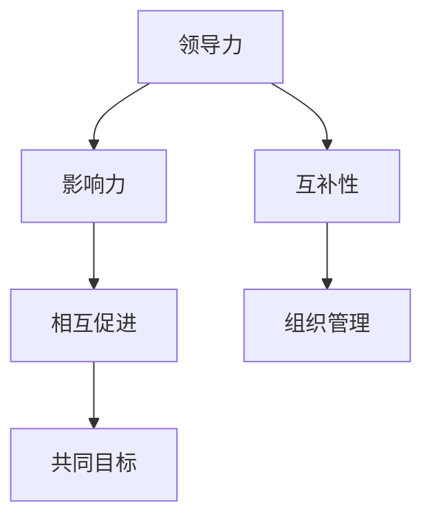

                 

### 目录

**《领导力与影响力扩展：扩大个人影响圈的技巧》**

> 关键词：领导力、影响力、个人品牌、扩展技巧、领导力模型

> 摘要：本文深入探讨了领导力和影响力的概念及其相互关系，详细介绍了如何通过技巧扩展个人的影响圈，包括领导力提升策略、个人品牌建设、网络关系拓展等。通过案例分析、实战项目和最佳实践，本文为读者提供了切实可行的指导，帮助其在职场和生活中提升领导力和影响力。

----------------------------------------------------------------

## 引言

在当今快速变化的世界，领导力和影响力已成为衡量个人成功的重要指标。领导力不仅是管理者必备的素质，也是每个职场人士追求的目标。影响力则决定了一个人在社交、职业和公共领域中的地位和作用。因此，如何扩展个人影响圈，提升领导力，成为许多人在职业发展中需要思考和解决的问题。

《领导力与影响力扩展：扩大个人影响圈的技巧》这本书旨在帮助读者深入了解领导力和影响力的本质，并提供一系列实用的技巧和方法，以扩展个人的影响圈。本书分为以下几个核心章节：

1. **领导力原理**：介绍领导力的基本概念、类型和模型，以及领导力与影响力的关系。
2. **提升领导力的技巧**：探讨如何通过自我认知、人际沟通、团队建设和决策能力等提升领导力。
3. **扩大影响力的策略**：介绍如何通过个人品牌、网络关系、公众演讲等策略扩大个人影响力。
4. **案例研究**：分析成功的企业家和个人在领导力和影响力扩展方面的经验。
5. **个人实践**：提供实践指导和自我提升建议，帮助读者将所学应用到实际生活中。

通过以上章节的深入探讨，本书旨在为读者提供一个全面、系统的领导力和影响力扩展指南，帮助其在职场和生活中取得更大的成功。

### 领导力与影响力的关系

领导力和影响力是两个密切相关但又有区别的概念。领导力（Leadership）是指引导和激励他人实现共同目标的能力。它包括一系列行为、技能和态度，如沟通、决策、激励、组织等。而影响力（Influence）则是通过说服、引导或影响他人思想和行为的能力。影响力可以通过各种途径实现，包括个人魅力、专业知识、社会地位等。

首先，领导力与影响力之间存在相互促进的关系。领导力可以增强个人的影响力，因为一个有效的领导者能够通过其行为和决策，建立信任、赢得尊重，从而在团队或组织中产生深远的影响。反之，一个拥有强大影响力的人，也能够通过其影响力和资源，提升自己的领导力。例如，一个成功的演讲者或公众人物，通过其演讲和影响力，可以影响公众的观点和行为，从而在政治、商业或社会领域发挥领导作用。

其次，领导力和影响力的关系还表现在它们之间的互补性。领导力侧重于管理和激励团队，而影响力则侧重于说服和影响他人。在一个组织中，领导力可以帮助维护秩序和方向，而影响力则可以帮助推动变革和创新。一个有效的领导者需要同时具备领导力和影响力，才能在复杂的环境中应对各种挑战。

为了更好地理解领导力和影响力的关系，我们可以使用Mermaid流程图来展示它们之间的互动关系。

在这个流程图中，A代表领导力，B代表影响力，C表示它们之间的相互促进关系，D表示互补性，E表示共同目标，F表示组织管理。这个流程图帮助我们清晰地看到领导力和影响力在实现共同目标中的相互作用和补充。

### 提升领导力的技巧

提升领导力是一个长期且持续的过程，需要不断地学习、实践和反思。以下是一些具体的技巧和方法，可以帮助个人在职场中提升领导力。

#### 自我认知

自我认知是提升领导力的第一步。一个有效的领导者首先需要了解自己的优点和不足。通过自我反思和评估，个人可以识别出需要改进的领域，并制定相应的计划。以下是一些自我认知的技巧：

- **反思日志**：每天或每周花时间记录自己的行为、思考和感受，帮助自己更好地了解自己的行为模式。
- **心理测试**：通过心理测试，如MBTI（迈尔斯-布里格斯性格类型指标）或DISC（行为风格评估），了解自己的性格特点和偏好。
- **求助他人**：向同事、朋友或导师寻求反馈，了解他们如何看待你的领导力。

#### 人际沟通

人际沟通是领导力的核心。一个有效的领导者需要具备良好的沟通能力，能够清晰地表达自己的想法，倾听他人的意见，并建立积极的人际关系。以下是一些人际沟通的技巧：

- **积极倾听**：在沟通中，积极倾听比说话更重要。通过倾听，领导者可以更好地理解他人的需求和期望，从而做出更有效的决策。
- **清晰表达**：领导者需要能够清晰地表达自己的想法和期望，确保团队成员理解并支持领导的决策。
- **建立信任**：信任是领导力的重要基石。通过诚实、透明和一致性，领导者可以建立信任，从而更好地领导团队。

#### 团队建设

团队建设是提升领导力的关键。一个成功的领导者需要能够建立高效、协作的团队，并激发团队成员的潜力。以下是一些团队建设的技巧：

- **明确目标**：领导者需要为团队设定清晰、明确的目标，确保每个成员都了解团队的使命和愿景。
- **赋予责任**：领导者应赋予团队成员相应的责任，鼓励他们自主决策和承担责任，从而提高团队的效率。
- **激励和奖励**：领导者应通过激励和奖励机制，激发团队成员的积极性和创造力。

#### 决策能力

决策能力是领导力的关键要素之一。一个有效的领导者需要能够快速、准确地做出决策，并在决策过程中考虑各种因素。以下是一些提高决策能力的技巧：

- **信息收集**：在做出决策前，领导者需要收集和分析相关信息，确保决策基于充分的数据和事实。
- **风险评估**：领导者应评估决策的风险和可能的结果，并制定相应的应对措施。
- **团队合作**：在决策过程中，领导者应与团队成员合作，充分利用团队的知识和经验。

#### 领导风格

领导风格是指领导者处理团队和任务的方式。不同的领导风格适用于不同的情境和团队。以下是一些常见的领导风格：

- **权威型领导**：领导者拥有绝对的决策权，团队成员需服从领导的决定。
- **民主型领导**：领导者鼓励团队成员参与决策，团队成员有较大的自主权。
- **教练型领导**：领导者关注团队成员的个人成长和发展，提供指导和支持。

通过以上技巧和方法，个人可以不断提升自己的领导力，成为更有效的领导者。然而，领导力是一个不断发展的过程，需要持续的学习和实践。

### 扩大影响力的策略

在现代社会中，影响力已经成为了个人和品牌成功的关键因素。无论您是一名职业人士、企业家还是普通员工，了解和运用扩大个人影响力的策略都至关重要。以下是一些具体的策略，帮助您在职场和生活中扩大个人影响力。

#### 个人品牌的建立与维护

个人品牌是指个人在公众心目中的形象和认知。一个强大的个人品牌可以帮助您在职业和社交领域中脱颖而出，从而增强您的个人影响力。以下是一些建立和维护个人品牌的策略：

1. **明确个人定位**：首先，您需要明确自己的优势和独特之处，这将为您的个人品牌奠定基础。
2. **持续专业学习**：通过不断学习和提升自己的专业知识和技能，您可以增强自己的竞争力，树立专业形象。
3. **主动分享知识**：通过撰写博客、发表文章、进行演讲等方式，主动分享您的专业知识和见解，提升您的知名度和影响力。
4. **社交媒体运用**：利用社交媒体平台，如LinkedIn、Twitter和Facebook，展示您的专业形象和价值观，扩大您的社交网络。

#### 网络关系的拓展

网络关系是扩大个人影响力的关键。一个广泛而有力的社交网络可以帮助您获取资源、机会和信息，从而提升您的个人影响力。以下是一些拓展网络关系的策略：

1. **主动拓展社交圈**：参加行业会议、研讨会和其他社交活动，结识不同领域的人士，扩大您的社交网络。
2. **建立信任**：通过真诚、诚实和互助，建立信任关系，这是网络关系的基石。
3. **维护关系**：定期与您的社交网络保持联系，通过邮件、电话或社交媒体与他们互动，维护良好的关系。
4. **提供价值**：在社交网络中，通过分享有价值的信息、提供帮助和解决方案，增加您的社交价值，从而提升您的个人影响力。

#### 公众演讲和表达能力

公众演讲和表达能力是展现个人影响力的有效方式。通过有效的演讲和表达，您可以向更多人传递您的观点和价值观，从而扩大您的个人影响力。以下是一些提升公众演讲和表达能力的策略：

1. **准备充分**：在演讲前，充分准备您的主题，确保对所讲内容有深刻的理解和掌握。
2. **掌握演讲技巧**：学习并运用各种演讲技巧，如故事讲述、互动、肢体语言等，增强演讲的吸引力。
3. **练习和反馈**：定期练习演讲，并寻求他人的反馈，不断改进您的演讲技巧。
4. **自信展现**：在演讲中展现自信，自信的态度可以增强您的个人魅力和说服力。

#### 影响力传播与推广

影响力的传播与推广是扩大个人影响力的重要环节。以下是一些影响力传播与推广的策略：

1. **利用媒体资源**：通过新闻媒体、行业杂志、博客等媒体资源，传播您的观点和影响力。
2. **合作与联盟**：与其他有影响力的个人或组织建立合作，通过合作共享资源和影响力。
3. **在线营销**：利用搜索引擎优化（SEO）、社交媒体广告、电子邮件营销等在线营销手段，提升您的知名度和影响力。
4. **个人品牌商品化**：通过推出个人品牌商品，如书籍、课程、咨询服务等，将个人影响力转化为实际的收益。

通过以上策略，您可以在职场和生活中有效地扩大个人影响力，树立强大的个人品牌，从而实现更大的成功。

### 案例研究

在探讨领导力和影响力扩展的技巧时，通过真实的案例研究可以提供宝贵的经验和启示。以下是两个案例研究，分别展示了企业级个人和企业家的领导力和影响力扩展。

#### 企业案例：成功企业家的领导力和影响力扩展

**案例背景**：

某科技公司的创始人李先生，作为一名年轻的企业家，如何在竞争激烈的科技行业中迅速崛起，扩大个人影响圈？

**领导力和影响力扩展技巧**：

1. **明确愿景和目标**：李先生在创业初期，就明确了公司的愿景和目标，并通过各种渠道与员工和合作伙伴分享，确保大家有共同的方向和目标。

2. **激励团队**：李先生通过设立激励机制，如股票期权和年终奖，激励员工为公司的发展贡献力量。同时，他经常与团队成员进行一对一的沟通，了解他们的需求和期望，帮助他们解决工作上的问题。

3. **建立个人品牌**：李先生积极参与行业会议和研讨会，通过演讲和撰写技术文章，分享自己的见解和经验，提升个人在业界的知名度和影响力。

4. **社交媒体运用**：李先生充分利用LinkedIn和Twitter等社交媒体平台，展示公司的最新动态和成就，同时分享自己的思考和对行业趋势的看法，吸引更多的关注和追随者。

5. **合作与联盟**：李先生与行业内其他知名企业和专家建立合作关系，通过共享资源和知识，扩大个人和公司的影响力。

**成果**：

通过上述策略，李先生不仅成功地将公司发展成为行业领导者，还建立了强大的个人品牌，成为了业内公认的技术专家和领导者。他的个人影响圈不断扩大，为公司吸引了更多优秀的人才和资源。

#### 个人案例：普通人的领导力扩展故事

**案例背景**：

张女士是一名普通员工，如何通过自我提升，最终成为公司的高级经理？

**领导力和影响力扩展技巧**：

1. **自我认知和反思**：张女士在职业生涯初期，通过定期反思和评估，了解自己的优势和不足，并制定了个人成长计划。

2. **学习和提升**：张女士积极参加各种培训和学习机会，不断提升自己的专业知识和技能。她通过阅读专业书籍、参加行业研讨会，以及请教经验丰富的同事，积累了丰富的知识和经验。

3. **积极参与项目**：张女士主动参与公司的重要项目，通过实际工作锻炼自己的领导力和决策能力。

4. **建立人际关系**：张女士注重与同事和上级建立良好的关系，通过真诚和互助，赢得了大家的信任和支持。

5. **积极展现**：张女士在公司的各种场合，如会议、演讲和报告，积极展现自己的专业能力和领导力。

**成果**：

通过多年的努力和不断自我提升，张女士最终晋升为公司的高级经理，带领团队取得了显著的业绩。她的个人影响圈逐渐扩大，不仅在公司内部获得了认可，还在业界建立了良好的声誉。

这两个案例研究展示了不同背景下个人和企业家如何通过有效的领导力和影响力扩展策略，取得了成功。无论是企业还是个人，通过明确目标、持续学习和积极实践，都可以实现领导力和影响力的提升。

### 个人实践

在了解了领导力和影响力扩展的理论和策略之后，如何将所学应用到实际生活中，成为有效的实践者，是每个读者需要思考和解决的问题。以下是一些建议和步骤，帮助您将所学知识转化为实际行动。

#### 实践步骤

1. **设定目标**：首先，明确您在领导力和影响力扩展方面的目标。这些目标可以是具体的，如提升某项技能、增加社交网络中的关键联系人，或者实现某个职业发展的里程碑。设定目标有助于您保持方向和动力。

2. **制定计划**：根据目标，制定详细的行动计划。例如，如果您希望提升演讲能力，可以计划参加演讲培训课程、定期练习演讲技巧、录制并分析自己的演讲视频等。

3. **执行行动**：按照行动计划，逐步实施各项任务。执行过程中，注意记录进展和反馈，以便及时调整计划。

4. **反思与调整**：定期反思您的实践过程，评估目标实现情况。根据反馈和评估结果，调整计划和方法，确保实践过程更加有效。

#### 实践案例

**案例1：提升领导力**

目标：提升项目管理能力，确保项目按时完成并达到预期质量。

行动计划：

- **参加项目管理培训**：报名参加项目管理认证培训课程，学习项目管理的基本理论和实践方法。
- **实践项目管理**：选择一个团队项目，实际应用所学知识，尝试制定项目计划、风险评估和管理报告。
- **寻求反馈**：定期与团队成员和上级沟通，了解项目进展和反馈，及时调整项目计划。

**案例2：扩大影响力**

目标：在社交媒体上建立个人品牌，增加关注者数量并提高互动率。

行动计划：

- **内容规划**：制定内容发布计划，确保每周发布有价值、有吸引力的文章或视频。
- **互动与回应**：积极与关注者互动，回复评论和私信，建立良好的社交网络关系。
- **分析数据**：定期分析社交媒体数据，了解受众偏好和互动情况，优化内容策略。

#### 实践中的注意事项

- **持续学习**：领导力和影响力扩展是一个持续的过程，需要不断学习和实践。保持对最新知识和技能的敏感度，及时更新自己的知识库。
- **合理分配时间**：在实践过程中，合理安排时间，确保有足够的时间用于学习、实践和反思。
- **保持耐心**：扩展领导力和影响力需要时间和努力，不要期望一蹴而就。保持耐心和毅力，逐步实现目标。

通过以上实践步骤和案例，您可以将领导力和影响力扩展的理论应用到实际生活中，逐步提升自己的领导力和影响力。

### 最佳实践 Tips

在领导力和影响力扩展的实践过程中，以下是一些最佳实践 Tips，可以帮助您更有效地实现目标：

1. **定期反思**：定期花时间反思自己的行为和决策，识别改进的机会。

2. **持续学习**：不断学习新的知识和技能，保持对行业动态和趋势的敏感度。

3. **真诚互动**：在与他人互动时，保持真诚和透明，建立信任和良好的关系。

4. **设定明确目标**：设定具体、可衡量的目标，有助于您保持方向和动力。

5. **寻求反馈**：积极寻求他人的反馈，了解自己在领导力和影响力扩展方面的优点和不足。

6. **培养耐心**：扩展领导力和影响力是一个长期的过程，保持耐心和毅力，逐步实现目标。

7. **利用社交媒体**：充分利用社交媒体平台，展示您的专业知识和价值观，扩大您的个人品牌影响力。

### 小结

本文从领导力和影响力的基本概念出发，详细探讨了如何通过提升领导力和扩展个人影响力来实现职业和个人发展。通过理论讲解、案例分析和个人实践，读者可以了解到领导力和影响力扩展的核心技巧和策略。希望本文能够为读者提供有益的启示和指导，帮助其在职场和生活中取得更大的成功。

### 注意事项

在实施领导力和影响力扩展策略时，需要注意以下几点：

1. **尊重他人**：在任何情况下，尊重他人的意见和需求是建立信任和良好关系的基础。

2. **适度展示**：在社交媒体等平台上，适度展示自己的专业知识和成就，避免过度自我吹嘘。

3. **持续反馈**：定期与团队成员、同事和导师交流，获取反馈并不断改进。

4. **遵守法律和道德规范**：在任何情况下，遵守法律和道德规范，确保个人行为不会对他人或组织造成负面影响。

### 拓展阅读

1. **《影响力：说服的心理学》**（Robert B. Cialdini）：探讨影响力和说服力的心理学原理，对理解和运用影响力策略有重要帮助。

2. **《领导力：理论与实践》**（John P. Kotter）：详细阐述了领导力的基本理论和实践方法，对提升领导力有重要指导作用。

3. **《个人品牌：如何打造自己的品牌》**（Dan Schawbel）：介绍如何建立和维持个人品牌，提升个人影响力。

### 作者介绍

**作者：AI天才研究院/AI Genius Institute & 禅与计算机程序设计艺术 /Zen And The Art of Computer Programming**

AI天才研究院（AI Genius Institute）致力于推动人工智能领域的创新和发展。我们的研究人员在计算机科学、机器学习和人工智能等领域拥有深厚的学术背景和丰富的实践经验。此外，作者还撰写了《禅与计算机程序设计艺术》（Zen And The Art of Computer Programming），该书以深入浅出的方式，探讨了计算机编程的艺术和哲学，深受读者喜爱。

