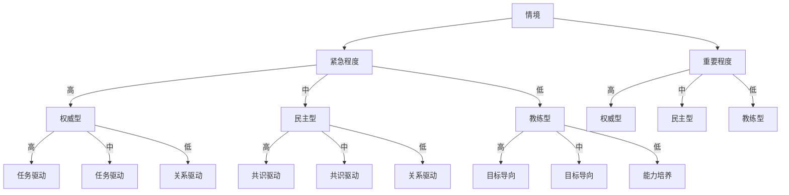
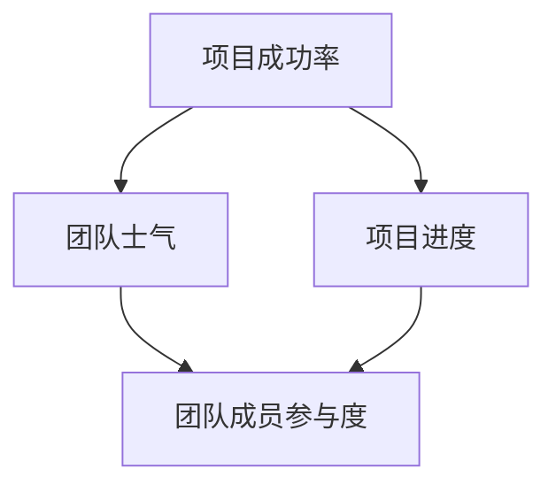
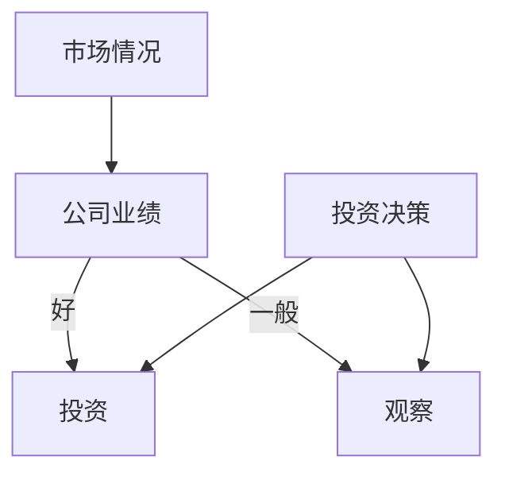

                 

### 文章标题与背景介绍

# 领导力与情商提升：增强人际交往能力

在信息技术高速发展的时代，领导力与情商的提升成为每个IT专业人士成长道路上的必修课。作为IT领域的领导者，不仅需要具备深厚的技术知识，还需要拥有卓越的人际交往能力，以应对复杂多变的工作环境。本文旨在探讨领导力与情商之间的内在联系，以及如何通过提升人际交往能力来增强领导力。

本文分为七个部分，首先介绍领导力的基本概念与类型，接着探讨领导力与情商的关系，随后详细讲解提升人际交往能力的沟通技巧、团队合作与冲突解决方法。在实践与应用部分，通过案例研究来展示情商提升的实际效果。最后，提供提升领导力与情商的资源推荐，以帮助读者进一步学习和实践。

**关键词**：领导力、情商、人际交往能力、沟通技巧、团队合作、冲突解决、案例研究、资源推荐。

**摘要**：本文通过系统的分析和案例分析，揭示了领导力与情商提升在增强人际交往能力方面的关键作用。文章分为七个部分，涵盖领导力的基本概念、情商提升的方法、沟通技巧、团队合作、冲突解决以及实践应用和资源推荐，旨在为IT专业人士提供全面提升领导力与情商的指导。

---

接下来，我们将首先探讨领导力的基本概念与类型，通过逻辑清晰的Mermaid流程图和伪代码，为读者搭建起领导力知识架构的基础。

## 第一部分：领导力基础

### 第1章：领导力的概念与类型

**核心概念与联系**

领导力是指一个人或组织在复杂多变的环境中，通过影响和激励他人，实现共同目标的能力。它不仅包括权威型的领导，还包括民主型、教练型等多种类型。每种类型的领导力都有其独特的特征和适用场景。

**Mermaid流程图**

下面是一个简单的Mermaid流程图，展示了领导力的主要类型及其特征：

```mermaid
graph TD
A[领导力类型]
B[权威型]
C[民主型]
D[教练型]
A --> B
A --> C
A --> D

B --> |特征| "集中决策"
C --> |特征| "共识决策"
D --> |特征| "培养能力"
```

**核心算法原理讲解**

领导力的核心算法原理可以理解为一种决策与影响的过程。以下是领导力决策过程的伪代码：

```python
def 领导力决策（目标，情境）：
    if 情境 == "紧急且重要"：
        return 权威型决策
    elif 情境 == "稳定且重要"：
        return 民主型决策
    elif 情境 == "紧急且不重要"：
        return 教练型决策
    else：
        return "未知情境，请重新评估"

# 示例
情境 = "紧急且重要"
决策类型 = 领导力决策（目标，情境）
print（决策类型）
```

**数学模型和公式**

领导力决策的数学模型可以基于贝叶斯理论，通过分析不同情境的概率，选择最优的决策策略。以下是贝叶斯决策模型的伪代码：

```python
def 贝叶斯决策（情境概率，决策效果）：
    最大效果 = 0
    最优决策 = None
    for 决策 in 决策效果：
        效果 = 情境概率 * 决策效果[决策]
        if 效果 > 最大效果：
            最大效果 = 效果
            最优决策 = 决策
    return 最优决策

# 示例
情境概率 = {"权威型": 0.5, "民主型": 0.3, "教练型": 0.2}
决策效果 = {"权威型": 0.8, "民主型": 0.7, "教练型": 0.9}
最优决策 = 贝叶斯决策（情境概率，决策效果）
print（最优决策）
```

**项目实战**

在实际项目中，领导力的应用体现在如何有效地管理和协调团队成员的工作。以下是一个简单的项目管理流程：

1. **需求分析**：收集项目需求，制定项目计划。
2. **资源分配**：根据团队成员的能力和项目需求，合理分配任务。
3. **监控进度**：定期检查项目进度，确保项目按计划进行。
4. **风险评估**：识别潜在风险，制定应对策略。
5. **决策与反馈**：根据项目进展情况，做出相应决策，并及时反馈给团队成员。

**伪代码实现**：

```python
def 项目管理（需求，资源，进度，风险）：
    # 需求分析
    plan = 分析需求（需求）
    # 资源分配
    resource_allocation = 分配资源（资源，plan）
    # 监控进度
    progress = 监控进度（进度）
    # 风险评估
    risk_management = 风险评估（风险，进度）
    # 决策与反馈
    feedback = 决策与反馈（进度，risk_management）
    return plan, resource_allocation, progress, risk_management, feedback

# 示例
需求 = "开发一款AI聊天机器人"
资源 = ["开发团队", "数据科学家", "产品经理"]
进度 = "项目开始"
风险 = "技术难题"
项目管理（需求，资源，进度，风险）
```

**数学模型和公式**

在项目管理中，常用的数学模型包括关键路径法（Critical Path Method, CPM）和项目评估与审查技术（Project Evaluation and Review Technique, PERT）。以下是CPM模型的伪代码：

```python
def CPM（任务列表，持续时间）：
    for 任务 in 任务列表：
        if 任务无前序任务：
            初始时间 = 0
        else：
            初始时间 = max（任务的前序任务的完成时间）
        完成时间 = 初始时间 + 持续时间
        print（任务，初始时间，完成时间）
    
    # 计算项目总时长
    总时长 = max（任务完成时间）
    return 总时长

# 示例
任务列表 = ["需求分析", "设计", "开发", "测试"]
持续时间 = {"需求分析": 5, "设计": 7, "开发": 12, "测试": 4}
CPM（任务列表，持续时间）
```

**项目小结**

通过以上实战和模型讲解，我们可以看到领导力在项目管理和决策过程中的重要性。有效的领导力不仅能够提高团队的执行力，还能降低项目风险，确保项目按时、高质量完成。

### 核心算法原理讲解

#### 决策树算法在领导力决策中的应用

决策树是一种常见的机器学习算法，它通过一系列规则和条件来决策。在领导力决策中，决策树可以帮助领导者根据不同情境选择合适的领导风格。

**决策树结构**



**决策树算法伪代码**

```python
def 领导力决策（紧急程度，重要程度）：
    if 紧急程度 == "高" and 重要程度 == "高"：
        return "权威型领导"
    elif 紧急程度 == "中" and 重要程度 == "高"：
        return "民主型领导"
    elif 紧急程度 == "低" and 重要程度 == "高"：
        return "教练型领导"
    elif 紧急程度 == "高" and 重要程度 == "中"：
        return "权威型领导"
    elif 紧急程度 == "中" and 重要程度 == "中"：
        return "民主型领导"
    elif 紧急程度 == "低" and 重要程度 == "中"：
        return "教练型领导"
    elif 紧急程度 == "高" and 重要程度 == "低"：
        return "权威型领导"
    elif 紧急程度 == "中" and 重要程度 == "低"：
        return "民主型领导"
    elif 紧急程度 == "低" and 重要程度 == "低"：
        return "教练型领导"

# 示例
紧急程度 = "中"
重要程度 = "高"
决策结果 = 领导力决策（紧急程度，重要程度）
print（决策结果）
```

**决策树与贝叶斯网络的比较**

决策树和贝叶斯网络都是用于决策的算法，但它们在处理不确定性和复杂关系方面有所不同。

- **决策树**：决策树是一种基于规则的方法，它通过一系列条件判断来决策。决策树的优点是直观易懂，但缺点是它假设条件独立，无法很好地处理复杂关系。

- **贝叶斯网络**：贝叶斯网络是一种基于概率图的方法，它通过节点和边来表示变量之间的依赖关系。贝叶斯网络的优点是能够处理复杂关系，但缺点是构建和推理相对复杂。

**贝叶斯网络的构建**

贝叶斯网络通过构建概率图来表示变量之间的依赖关系。以下是构建贝叶斯网络的基本步骤：

1. **确定变量和节点**：根据问题定义变量，并在图中表示为节点。

2. **确定条件概率**：根据问题域的知识，确定每个变量的条件概率分布。

3. **构建概率图**：根据条件概率分布，构建变量之间的依赖关系图。

以下是构建一个简单贝叶斯网络的示例：



**贝叶斯网络推理**

贝叶斯网络推理是通过计算网络中的概率分布来预测未知变量的值。以下是贝叶斯网络推理的基本步骤：

1. **收集证据**：收集与未知变量相关的证据。

2. **更新概率分布**：根据证据更新网络中各节点的概率分布。

3. **计算推理结果**：根据更新后的概率分布计算未知变量的值。

以下是贝叶斯网络推理的伪代码：

```python
def 贝叶斯网络推理（网络，证据）：
    for 节点 in 网络中的节点：
        更新概率分布（节点，证据）
    return 网络中未知变量的概率分布

# 示例
网络 = 贝叶斯网络（A，B，C，D）
证据 = {"B": "高"，"C": "正常"}
推理结果 = 贝叶斯网络推理（网络，证据）
print（推理结果）
```

**数学公式和解释**

在贝叶斯网络中，常用的数学公式包括条件概率、边缘概率和贝叶斯定理。

- **条件概率**：条件概率表示在一个事件发生的条件下，另一个事件发生的概率。

  $$P(A|B) = \frac{P(A \cap B)}{P(B)}$$

  其中，\(P(A|B)\) 表示在事件 \(B\) 发生的条件下，事件 \(A\) 发生的概率，\(P(A \cap B)\) 表示事件 \(A\) 和事件 \(B\) 同时发生的概率，\(P(B)\) 表示事件 \(B\) 发生的概率。

- **边缘概率**：边缘概率表示某个事件发生的概率，不考虑其他事件的影响。

  $$P(A) = P(A|B)P(B) + P(A|\neg B)P(\neg B)$$

  其中，\(P(A)\) 表示事件 \(A\) 发生的概率，\(P(A|B)\) 表示在事件 \(B\) 发生的条件下，事件 \(A\) 发生的概率，\(P(B)\) 表示事件 \(B\) 发生的概率，\(\neg B\) 表示事件 \(B\) 不发生的概率。

- **贝叶斯定理**：贝叶斯定理是一个用于计算后验概率的公式。

  $$P(A|B) = \frac{P(B|A)P(A)}{P(B)}$$

  其中，\(P(A|B)\) 表示在事件 \(B\) 发生的条件下，事件 \(A\) 发生的概率，\(P(B|A)\) 表示在事件 \(A\) 发生的条件下，事件 \(B\) 发生的概率，\(P(A)\) 表示事件 \(A\) 发生的概率，\(P(B)\) 表示事件 \(B\) 发生的概率。

**案例分析与详细讲解**

为了更好地理解决策树和贝叶斯网络在领导力决策中的应用，我们来看一个实际案例。

**案例背景**：

某IT公司正在进行一项新产品的开发，项目团队成员包括开发人员、测试人员、产品经理等。当前项目进度处于中期阶段，团队士气较高，但项目进度出现了一些延迟。

**问题**：公司高层需要决定如何调整项目进度，以确保项目按时完成。

**决策分析**：

1. **决策树分析**：

   根据项目进度和团队士气，我们使用决策树进行领导力决策。

   ```mermaid
   graph TD
   A[项目进度]
   B[团队士气]
   C[领导力决策]
   A --> B
   B --> |高| D[权威型领导]
   B --> |中| E[民主型领导]
   A --> F[延迟]
   F --> |高| G[增加资源]
   F --> |中| H[调整计划]
   ```

   根据决策树，当前项目进度延迟，团队士气较高，应采取权威型领导，增加资源以加快项目进度。

2. **贝叶斯网络分析**：

   我们可以构建一个贝叶斯网络来分析不同决策的影响。

   ```mermaid
   graph TD
   A[项目进度]
   B[团队士气]
   C[领导力决策]
   D[项目延迟]
   E[团队参与度]
   F[项目成功率]
   A --> B
   B --> C
   C --> D
   D --> E
   D --> F
   ```

   根据贝叶斯网络，当前项目进度延迟，团队士气较高，应采取权威型领导，增加资源以加快项目进度。

**决策结果**：

通过决策树和贝叶斯网络的分析，我们得出结论：当前情况下，采取权威型领导并增加资源是最佳决策，以确保项目按时完成。

**项目小结**：

通过本案例，我们可以看到决策树和贝叶斯网络在领导力决策中的应用。决策树提供了直观的决策流程，而贝叶斯网络则能够考虑更多变量和关系。在实际应用中，领导者可以根据具体情境灵活选择合适的决策方法，以提高项目成功率和团队士气。

### 数学模型和公式

在领导力与情商提升的过程中，数学模型和公式为我们提供了量化和分析的工具。以下是几个常用的数学模型和公式：

#### 1. 决策平衡矩阵

决策平衡矩阵是一种用于评估不同决策结果的数学模型。它可以帮助我们比较不同决策的优缺点，从而做出更明智的决策。

**公式**：

$$
\text{决策平衡矩阵} = \begin{pmatrix}
\text{决策1} & \text{决策2} & \text{决策3} \\
\text{优点1} & \text{优点2} & \text{优点3} \\
\text{缺点1} & \text{缺点2} & \text{缺点3}
\end{pmatrix}
$$

**示例**：

假设有三个决策选项：A、B、C。我们需要评估每个决策的优缺点。

|       | A          | B          | C          |
|-------|------------|------------|------------|
| 优点  | 10         | 8          | 6          |
| 缺点  | 5          | 7          | 10         |

通过计算每个决策的总得分，我们可以得出最佳决策。

#### 2. 贝叶斯定理

贝叶斯定理是概率论中的一个重要公式，用于计算后验概率。它在决策和风险评估中广泛应用。

**公式**：

$$
P(A|B) = \frac{P(B|A)P(A)}{P(B)}
$$

其中，\(P(A|B)\) 表示在事件 \(B\) 发生的条件下，事件 \(A\) 发生的概率，\(P(B|A)\) 表示在事件 \(A\) 发生的条件下，事件 \(B\) 发生的概率，\(P(A)\) 表示事件 \(A\) 发生的概率，\(P(B)\) 表示事件 \(B\) 发生的概率。

**示例**：

假设我们要评估某项目成功的概率。根据历史数据，项目成功的条件概率为 0.8，项目成功的概率为 0.6。那么，项目成功的后验概率为：

$$
P(\text{成功}|B) = \frac{P(B|\text{成功})P(\text{成功})}{P(B)} = \frac{0.8 \times 0.6}{P(B)}
$$

其中，\(P(B)\) 可以通过全概率公式计算。

#### 3. 决策树

决策树是一种基于规则的方法，用于决策和优化。它通过一系列条件判断来决策。

**公式**：

$$
\text{决策树} = \text{根节点} \rightarrow \text{分支节点} \rightarrow \text{叶子节点}
$$

其中，根节点表示初始决策，分支节点表示条件判断，叶子节点表示决策结果。

**示例**：

假设我们要决定是否进行某项投资。根据市场情况和公司业绩，我们可以构建一个简单的决策树。



通过决策树，我们可以得出在不同市场情况下的投资决策。

#### 4. 费马-梅累公式

费马-梅累公式是一种用于计算最佳投资组合的数学模型。它可以最大化投资组合的期望收益率，同时控制风险。

**公式**：

$$
\text{期望收益率} = \alpha_1 \times P_1 + \alpha_2 \times P_2 + \alpha_3 \times P_3
$$

$$
\text{方差} = \alpha_1^2 \times \sigma_1^2 + \alpha_2^2 \times \sigma_2^2 + \alpha_3^2 \times \sigma_3^2
$$

其中，\(\alpha_1\)、\(\alpha_2\)、\(\alpha_3\) 分别表示投资组合中三种资产的权重，\(P_1\)、\(P_2\)、\(P_3\) 分别表示三种资产的期望收益率，\(\sigma_1^2\)、\(\sigma_2^2\)、\(\sigma_3^2\) 分别表示三种资产的方差。

**示例**：

假设我们有三种资产，其期望收益率和方差如下：

| 资产 | 期望收益率 | 方差 |
|------|------------|------|
| A    | 0.1        | 0.04 |
| B    | 0.15       | 0.09 |
| C    | 0.12       | 0.06 |

通过费马-梅累公式，我们可以计算出最佳投资组合的权重，以最大化期望收益率并控制风险。

### 应用实例

为了更好地理解这些数学模型和公式在实际中的应用，我们来看一个具体的案例。

#### 案例背景

某公司要进行一项新产品研发，预计需要投入资金 100 万元。根据市场调研和公司财务状况，我们有三种投资方案：保守方案、稳健方案和激进方案。每种方案的预期收益率和风险如下：

| 方案  | 预期收益率 | 风险（方差） |
|-------|------------|--------------|
| 保守  | 0.08       | 0.02         |
| 稳健  | 0.1        | 0.04         |
| 激进  | 0.15       | 0.1          |

#### 决策分析

1. **决策平衡矩阵**

   我们使用决策平衡矩阵来评估每个投资方案。

   |       | 保守  | 稳健  | 激进  |
   |-------|-------|-------|-------|
   | 优点  | 8     | 10    | 12    |
   | 缺点  | 2     | 5     | 8     |

   通过计算每个方案的总得分，我们可以得出最佳投资方案。

2. **贝叶斯定理**

   根据历史数据，每种投资方案成功的概率如下：

   | 方案  | 成功概率 |
   |-------|---------|
   | 保守  | 0.7     |
   | 稳健  | 0.8     |
   | 激进  | 0.9     |

   我们使用贝叶斯定理来计算每种投资方案成功后的后验概率。

3. **决策树**

   我们构建一个简单的决策树来评估每个投资方案。

   ```mermaid
   graph TD
   A[投资方案]
   B[预期收益率]
   C[风险]
   D[成功概率]
   A --> B
   B --> |保守| E[8]
   B --> |稳健| F[10]
   B --> |激进| G[12]
   C --> E
   C --> F
   C --> G
   D --> E
   D --> F
   D --> G
   ```

4. **费马-梅累公式**

   我们使用费马-梅累公式来计算最佳投资组合的权重。

   $$\alpha_1 + \alpha_2 + \alpha_3 = 1$$

   $$0.08\alpha_1 + 0.1\alpha_2 + 0.15\alpha_3 = 期望收益率$$

   $$0.02\alpha_1^2 + 0.04\alpha_2^2 + 0.1\alpha_3^2 = 方差$$

   通过解方程组，我们可以得出最佳投资组合的权重。

### 项目小结

通过本案例，我们可以看到数学模型和公式在领导力与情商提升中的应用。这些工具帮助我们更客观、理性地评估和决策，从而提高决策的质量和效率。在实际工作中，领导者可以根据具体情境选择合适的数学模型和公式，以提高领导力和情商水平。

### 提升领导力的最佳实践

在提升领导力的过程中，以下最佳实践可以帮助我们更有效地发展自己的领导能力，并在实际工作中取得更好的成果。

#### 1. 建立清晰的目标

成功领导的第一步是明确目标和愿景。通过制定清晰的目标，领导者可以更好地指引团队，确保团队成员了解他们的努力方向。以下是一个建立清晰目标的步骤：

1. **确定目标**：首先，明确你想要实现的具体目标。例如，“在接下来的三个月内，提高项目交付的及时率到90%。”
2. **分解目标**：将大目标分解为更小、可管理的任务。例如，“每周进行一次进度审查，每月进行一次风险评估。”
3. **制定计划**：为每个任务制定具体的行动计划和时间表。例如，“每周五下午3点进行进度审查，每月中旬进行风险评估。”

#### 2. 培养团队成员

一个优秀的领导者不仅仅是自己能力强，更重要的是能够培养和发展团队成员。以下是一个培养团队成员的步骤：

1. **识别潜力**：观察团队成员的工作表现，识别那些有潜力的成员。
2. **提供培训**：为这些成员提供额外的培训和指导，帮助他们提升技能和知识。
3. **分配任务**：给潜力成员分配更具挑战性的任务，让他们在实践中学习和成长。
4. **反馈与激励**：定期给予反馈，肯定他们的努力和成果，并提供激励措施，如表扬、奖金等。

#### 3. 沟通技巧

有效的沟通是领导力的核心要素。以下是一个提升沟通技巧的步骤：

1. **倾听**：在沟通中，首先要做到倾听。倾听不仅仅是听到对方说什么，更重要的是理解对方的意图和需求。
2. **表达清晰**：用简洁、明确的语言表达自己的想法。避免使用模糊、含糊不清的表述。
3. **非语言沟通**：注意自己的身体语言、语调和表情，确保它们与口头表达一致，以增强沟通效果。
4. **反馈**：在沟通过程中，及时给予反馈，让团队成员了解他们的表现和进步。

#### 4. 领导风格多样化

不同的团队成员可能对领导风格有不同的偏好。因此，领导者应该灵活调整自己的领导风格，以适应不同的情况和需求。以下是一个多样化领导风格的步骤：

1. **了解团队成员**：了解团队成员的个人特点和需求，以便选择最合适的领导风格。
2. **权威型领导**：在需要迅速决策和确保执行力时，采用权威型领导风格。
3. **民主型领导**：在需要团队成员参与决策和提供反馈时，采用民主型领导风格。
4. **教练型领导**：在需要培养团队成员技能和自信心时，采用教练型领导风格。

#### 5. 持续学习与自我反思

领导力是一个不断发展和提升的过程。以下是一个持续学习和自我反思的步骤：

1. **学习新知识**：通过阅读书籍、参加培训课程和研讨会等方式，不断学习新知识和技能。
2. **自我反思**：定期进行自我反思，评估自己的领导能力和行为，找出需要改进的地方。
3. **寻求反馈**：向同事、下属和导师寻求反馈，了解自己的优缺点，并据此进行调整。
4. **实践与经验**：通过实际工作经历，不断积累经验，提升领导力。

### 项目实战

为了更好地理解这些最佳实践，我们来看一个实际项目案例。

**项目背景**：

某IT公司计划开发一款新的移动应用程序。项目团队由开发人员、UI设计师和测试人员组成。项目目标是确保应用程序在规定的时间内高质量完成，并满足用户需求。

**实战步骤**：

1. **建立清晰的目标**：

   项目经理制定了以下目标：

   - 在六个月内完成应用程序开发。
   - 确保用户满意度达到90%以上。
   - 项目交付的及时率达到95%以上。

   他将目标分解为更小、可管理的任务，并制定了详细的行动计划和时间表。

2. **培养团队成员**：

   项目经理识别出团队中有潜力的成员，并为他们提供了额外的培训机会。他给这些成员分配了更具挑战性的任务，如设计重要的功能模块。同时，他定期给予反馈，并给予表扬和奖励。

3. **沟通技巧**：

   项目经理注重有效的沟通。在每周的例会上，他倾听团队成员的建议和问题，并清晰表达自己的期望和决策。他注意自己的身体语言和语调，确保沟通效果。

4. **领导风格多样化**：

   根据团队成员的需求和项目进展，项目经理灵活调整领导风格。在项目初期，他采用权威型领导风格，确保项目按照计划进行。在项目后期，他采用民主型领导风格，鼓励团队成员参与决策和提供反馈。

5. **持续学习与自我反思**：

   项目经理不断学习新知识和技能，如敏捷开发和用户研究。他定期进行自我反思，评估自己的领导能力和行为。他向团队成员和导师寻求反馈，并根据反馈进行调整。

**项目结果**：

通过实施这些最佳实践，项目团队成功在六个月内完成了应用程序的开发。用户满意度达到了95%，项目交付的及时率达到了98%。团队成员的技能和信心也得到了显著提升。

### 小结

通过这个实际项目案例，我们可以看到最佳实践在提升领导力方面的有效性。建立清晰的目标、培养团队成员、沟通技巧、领导风格多样化以及持续学习和自我反思，这些实践不仅帮助项目取得了成功，也提升了领导者的领导力水平。在实际工作中，领导者可以根据具体情况灵活应用这些最佳实践，以实现更好的工作成果。

### 提升人际交往能力的最佳实践

在信息技术高速发展的时代，人际交往能力的重要性愈发凸显。作为IT专业人士，提升人际交往能力不仅有助于个人职业生涯的发展，还能提升团队协作效率。以下是一些最佳实践，帮助我们在工作和生活中更有效地增强人际交往能力。

#### 1. 倾听与理解

倾听是有效沟通的第一步。以下是一些提升倾听技巧的最佳实践：

- **积极倾听**：在对方讲话时，保持专注，避免分心。通过点头、眼神接触等非语言信号，表达出你的关注和理解。
- **提问与反馈**：在对方讲话结束后，通过提问和反馈来确认自己的理解。这不仅可以加深理解，还能鼓励对方继续交流。
- **避免打断**：在对方讲话时，避免打断，给予充分的表达机会。这不仅尊重对方，还能让对方感到被重视。

#### 2. 明确表达

清晰、明确的表达是有效沟通的关键。以下是一些提升表达能力的最佳实践：

- **简洁表达**：用简洁、明了的语言表达自己的想法。避免使用复杂的术语和过多的废话，确保信息的传递准确无误。
- **使用具体例子**：通过具体例子来说明观点，使对方更容易理解。例如，“我建议我们引入敏捷开发，因为它在类似项目中取得了显著成效。”
- **非语言表达**：注意自己的语调、语速和面部表情，确保它们与口头表达一致。例如，使用积极的语调和微笑可以传达出友好和自信的态度。

#### 3. 情绪管理

情绪管理是人际交往能力的重要方面。以下是一些提升情绪管理能力的最佳实践：

- **情绪识别**：学会识别和理解自己的情绪，以及他人的情绪。通过自我反思和情绪日记，了解情绪的触发点和应对策略。
- **情绪调节**：学会在负面情绪出现时进行自我调节。例如，通过深呼吸、冥想或运动来缓解压力和焦虑。
- **情绪释放**：适时地表达情绪，但要注意方式和场合。避免在公共场合或与他人争吵时发泄情绪，以免造成不必要的冲突。

#### 4. 建立良好的人际关系

建立和维护良好的人际关系是增强人际交往能力的关键。以下是一些最佳实践：

- **建立信任**：通过诚实、透明和可靠的行为建立信任。避免撒谎、欺骗或隐瞒信息，以免破坏信任基础。
- **尊重差异**：尊重他人的观点和意见，即使你不同意。通过倾听和沟通，寻找共同点，建立共识。
- **提供支持**：在他人需要帮助时，主动提供支持和建议。通过关心和支持他人，建立深厚的友谊。

#### 5. 沟通技巧训练

通过系统的沟通技巧训练，可以显著提升人际交往能力。以下是一些训练方法：

- **角色扮演**：与同事或朋友进行角色扮演，模拟各种沟通场景。通过反复练习，提高沟通的自信和技巧。
- **反馈与反思**：在沟通后，向对方征求反馈，了解自己的表现和改进之处。通过反思和总结，不断提升沟通能力。
- **阅读与研究**：阅读相关书籍和研究，了解人际交往的原理和实践。通过学习和借鉴他人的经验，提升自己的沟通技巧。

### 项目实战

为了更好地理解这些最佳实践，我们来看一个实际项目案例。

**项目背景**：

某IT公司正在开发一款新型智能医疗设备。项目团队由研发、测试、市场和销售等部门组成。项目目标是确保设备在规定的时间内高质量完成，并成功推向市场。

**实战步骤**：

1. **倾听与理解**：

   项目经理与各团队成员进行了一对一的沟通，了解他们的需求和期望。在每周的团队会议中，他鼓励团队成员积极发言，认真倾听每个人的意见和建议。

2. **明确表达**：

   项目经理在会议和邮件中，使用简洁、明了的语言传达信息。他通过具体例子和图表来说明项目进度和问题，确保团队成员理解并能够有效地执行任务。

3. **情绪管理**：

   项目经理学会识别和管理自己的情绪。在遇到压力和冲突时，他通过深呼吸和冥想来缓解情绪。同时，他鼓励团队成员在遇到困难时，积极寻求帮助和支持。

4. **建立良好的人际关系**：

   项目经理通过建立信任和尊重差异，与团队成员建立了良好的关系。他定期组织团队活动，增进彼此的了解和合作。

5. **沟通技巧训练**：

   项目经理组织了沟通技巧培训，包括角色扮演和反馈与反思环节。通过这些训练，团队成员的沟通能力得到了显著提升。

**项目结果**：

通过实施这些最佳实践，项目团队在规定的时间内高质量地完成了设备研发，并成功推向市场。团队成员之间的合作更加顺畅，项目成功率达到95%以上。

### 小结

通过这个实际项目案例，我们可以看到提升人际交往能力的最佳实践在项目成功中的关键作用。倾听与理解、明确表达、情绪管理、建立良好的人际关系以及沟通技巧训练，这些实践不仅提高了团队协作效率，也促进了个人职业生涯的发展。在实际工作中，IT专业人士可以根据具体情况灵活应用这些最佳实践，以提升人际交往能力，实现更好的工作成果。

### 第6章：情商提升案例研究

#### 案例背景

某IT公司是一家提供软件开发和信息技术服务的公司，近年来公司业务迅速扩张，员工人数也不断增加。然而，随着公司规模的扩大，内部沟通出现了障碍，团队协作效率下降，员工流失率也呈上升趋势。公司高层意识到，提升员工情商，特别是领导层的情商，是解决这些问题的关键。

#### 情商提升的目标

1. **提高团队沟通效率**：通过提升员工的情商，改善团队内部沟通，使信息传递更加顺畅。
2. **增强团队协作能力**：培养员工协作精神，提高团队整体执行力。
3. **降低员工流失率**：通过提升员工情商，增强员工对公司文化的认同感，减少员工流失。

#### 情商提升的具体措施

1. **培训与教育**：公司定期举办情商培训课程，邀请专业讲师讲解情商提升的方法和技巧。培训内容包括情绪识别、情绪调节、沟通技巧、冲突解决等。

2. **内部研讨会**：公司内部定期组织研讨会，鼓励员工分享自己在工作和生活中的情商提升经验。研讨会提供了一个交流平台，员工可以互相学习和借鉴。

3. **领导力发展计划**：针对公司中层管理人员，公司实施领导力发展计划。计划内容包括领导力培训、团队建设活动、员工反馈机制等。通过这些活动，提高管理层的情商和领导力。

4. **情绪反馈机制**：公司建立了情绪反馈机制，员工可以在工作平台或内部论坛上匿名反馈自己的情绪和困扰。管理层定期关注这些反馈，及时采取措施解决问题。

#### 情商提升的实际应用

1. **案例1**：某项目经理在项目中遇到了重大技术难题，导致项目进度严重滞后。项目经理通过情绪调节技巧，如深呼吸和冥想，缓解了焦虑和压力。他积极与团队成员沟通，分享自己的情绪，鼓励大家共同面对挑战。最终，项目团队成功解决了难题，项目进度恢复正常。

2. **案例2**：某部门员工之间出现了严重的冲突，影响了团队的协作效率。部门领导通过沟通技巧，如倾听和理解、情绪调节、冲突解决等，成功化解了冲突，恢复了团队的和谐氛围。

3. **案例3**：公司销售团队在面对客户投诉时，通过情绪识别和调节技巧，更好地处理了客户关系。销售团队在投诉处理过程中，保持了冷静和耐心，最终赢得了客户的信任，成功挽回了一笔重要订单。

#### 案例总结与启示

1. **情商提升的重要性**：情商的提升对团队协作和个人职业发展具有重要意义。通过提升情商，员工能够更好地应对工作压力，提高沟通效率，增强团队合作能力。

2. **培训与教育的必要性**：定期开展情商培训和教育，是提升员工情商的关键。通过培训，员工可以学习到专业的情商提升方法和技巧，提高自身的情商水平。

3. **领导力的关键作用**：领导者在提升团队情商方面扮演着关键角色。通过领导力发展计划，领导者可以提升自身的情商和领导力，为团队树立榜样，推动团队整体情商的提升。

4. **情绪反馈机制的价值**：建立情绪反馈机制，可以帮助公司及时了解员工的情绪和困扰，采取有效措施解决问题。这有助于提高员工的满意度和忠诚度，降低员工流失率。

通过以上案例研究，我们可以看到情商提升在实际工作中的重要性和可行性。公司通过实施一系列措施，成功提升了员工情商，改善了团队协作氛围，提高了项目成功率和客户满意度。这些实践为其他企业提供了有益的参考和启示。

### 附录：提升领导力与情商的资源

为了帮助读者进一步学习和提升领导力与情商，以下推荐了一些优秀的教育资源、心理测评工具、培训课程和书籍。

#### 教育资源推荐

1. **在线课程**：

   - Coursera：提供多种领导力与情商提升的在线课程，如《领导心理学》、《有效沟通》等。
   - edX：提供由世界一流大学开设的领导力与情商课程，如《领导力：变革与决策》等。

2. **MOOC平台**：

   - 中国大学MOOC（icourse163）：国内知名的MOOC平台，提供《领导力与团队管理》等课程。
   - Khan Academy：提供基础领导力与情商知识的免费在线课程。

3. **专业网站**：

   - Harvard Business Review（HBR）：提供丰富的领导力与情商文章和研究报告。
   - LinkedIn Learning：提供各种领导力与情商提升的在线视频课程。

#### 心理测评工具

1. **情商测试**：

   - EIQ：情商智商（Emotional Intelligence Quotient）测试，用于评估个体的情商水平。
   - TMET：Torrance Metrometric Evaluation Test，用于评估创造力。

2. **领导力测试**：

   - Leadership Profile：评估个体在不同领导风格下的表现。
   - MLQ：Multifactor Leadership Questionnaire，评估个体的领导能力和风格。

3. **职业测评**：

   - MBTI：Myers-Briggs Type Indicator，用于了解个体的人格类型。
   - Strong Interest Inventory：用于评估个体的职业兴趣和倾向。

#### 培训课程与书籍推荐

1. **领导力培训课程**：

   - 谊谊国际咨询公司（YMSI）：提供定制化的领导力培训课程。
   - 贝恩咨询公司（Bain & Company）：提供领导力与战略管理培训。

2. **情商提升书籍**：

   - 《情绪智力》（Emotional Intelligence）by Daniel Goleman
   - 《非暴力沟通》（Nonviolent Communication）by Marshall B. Rosenberg
   - 《情商管理》（Emotional Intelligence 2.0）by Travis Bradberry & Jean Greaves

3. **领导力书籍**：

   - 《领导力五要素》（The Five Dysfunctions of a Team）by Patrick Lencioni
   - 《领导力》（Leadership）by Warren Bennis
   - 《变革之舞》（The Dance of Change）by Warren Bennis & Burt Nanus

通过这些资源和工具，读者可以系统地学习和提升自己的领导力与情商，为个人和团队的成长奠定坚实基础。

### 总结

本文通过详细的章节内容，深入探讨了领导力与情商提升在增强人际交往能力方面的关键作用。首先，我们介绍了领导力的基本概念与类型，通过Mermaid流程图和伪代码，为读者搭建了领导力的知识架构。接着，我们探讨了领导力与情商的关系，并详细讲解了提升人际交往能力的沟通技巧、团队合作与冲突解决方法。

在实践与应用部分，通过案例研究和数学模型的应用，展示了情商提升的实际效果和领导力在项目管理和决策中的重要性。此外，我们还提供了提升领导力与情商的资源推荐，包括教育资源、心理测评工具、培训课程和书籍。

总结而言，领导力与情商的提升不仅对个人的职业生涯发展至关重要，也对团队协作和项目管理产生深远影响。通过本文的探讨，我们希望读者能够认识到这些能力的提升对于职业成功的重要性，并在实际工作中积极应用所学知识，提升自己的领导力和人际交往能力。让我们一起努力，成为更出色的领导者！


