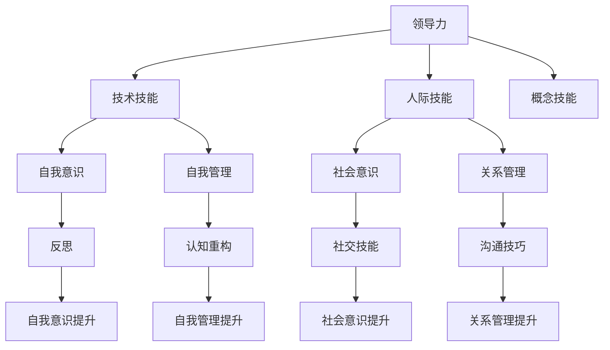

                 

<sop>### 文章标题：领导力与情商提升：增强人际关系管理

关键词：领导力、情商、人际关系管理、沟通技巧、团队协作

摘要：
本文深入探讨了领导力与情商在人际关系管理中的重要性。首先，我们明确了领导力的定义与演变，并分析了其三个层次：技术技能、人际技能和概念技能。接着，我们阐述了情商的基本概念，包括自我意识、自我管理、社会意识和关系管理。在此基础上，本文构建了一个Mermaid流程图，展示了领导力、情商和人际关系管理之间的相互联系。通过核心算法原理的讲解和数学模型及公式的应用，本文进一步分析了如何提升人际沟通技巧和团队协作能力。最后，我们通过实际案例详细解析了领导力与情商在实践中的应用，并提供了最佳实践建议和小结。

---

### 第一步：确定书的核心主题和目标读者

**背景介绍**：
领导力与情商是管理和人际关系中的关键因素，对于个人和组织的发展至关重要。领导力指的是引导和激励他人实现目标的能力，而情商则是个体识别、理解和管理自己情绪以及他人情绪的能力。两者相辅相成，共同作用于人际关系管理。

**目标读者**：
本文的目标读者包括以下几类：
1. 希望提升领导力和情商的职场人士。
2. 管理者和企业家，他们需要有效地管理团队和人际关系。
3. 人力资源从业者，他们负责员工培训和团队建设。

---

### 第二步：梳理书籍的主要内容结构

本书的主要内容包括以下几个部分：

1. **领导力理论概述**：介绍领导力的定义、演变及其三个层次。
2. **情商基本概念**：阐述情商的构成和提升策略。
3. **人际关系管理**：探讨人际关系的类型、特点及沟通技巧。
4. **领导力与情商提升策略**：提供具体的提升方法和实践建议。
5. **实战案例分析**：通过具体案例展示领导力与情商的应用。

---

### 第三步：细化每个章节的内容

下面是对各个章节的具体内容细化：

#### 第1章：领导力的本质

**1.1 领导力的定义与演变**
- 领导力的多种定义。
- 领导力理论的演变，从传统到现代领导力。

**1.2 领导力的三个层次**
- 技术技能：基础工作能力和专业知识的运用。
- 人际技能：与他人的沟通、协作和管理能力。
- 概念技能：理解复杂问题和制定战略的能力。

#### 第2章：情商基本概念

**2.1 情商的构成**
- 自我意识：对自己情感的认识和理解。
- 自我管理：调节和控制自己情绪的能力。
- 社会意识：对他人情感的认识和理解。
- 关系管理：建立和维护人际关系的能力。

**2.2 提升情商的策略**
- 自我反思：通过反思提升自我意识。
- 认知重构：改变负面思维模式，提高自我管理能力。
- 社交技能培训：通过训练提高社会意识和关系管理能力。

#### 第3章：人际关系管理

**3.1 人际关系的类型与特点**
- 群体动力学：分析人际关系在不同环境下的特点。
- 社会网络分析：探讨人际关系在社会系统中的结构和功能。

**3.2 人际沟通技巧**
- 有效沟通的原则：清晰、简洁、准确。
- 听说的技巧：积极倾听，理解对方观点。
- 沟通障碍与解决策略：识别并克服沟通中的障碍。

#### 第4章：领导力与情商提升策略

**4.1 领导力与情商的整合**
- 如何在领导力中融入情商。
- 情商对领导力提升的促进作用。

**4.2 提升人际关系管理能力**
- 人际冲突的预防与解决：通过策略减少冲突。
- 实践策略：如何将理论应用于实际工作中。

#### 第5章：实战案例分析

**5.1 案例一：成功领导力与情商的实践**
- 分析具体案例，展示领导力与情商在实际工作中的应用。

**5.2 案例二：情商在危机管理中的运用**
- 探讨情商在应对突发事件时的作用。

**5.3 案例三：人际关系管理的艺术**
- 分析人际关系管理在团队协作中的重要性。

---

### 第四步：设计核心概念与联系

为了更好地展示领导力、情商和人际关系管理之间的联系，我们设计了一个Mermaid流程图：



该图展示了领导力、情商和人际关系管理之间的层次结构和相互关系。

---

### 第五步：编写核心算法原理讲解

在本章节中，我们将介绍几种关键算法，以帮助读者理解领导力与情商提升的原理。

#### 算法1：情商评估算法

**伪代码**：

```python
def emotional_intelligence_assessment(self_awareness, self_management, social_awareness, relationship_management):
    total_score = (self_awareness + self_management + social_awareness + relationship_management)
    return total_score / 4
```

**算法原理**：
该算法通过计算个体在自我意识、自我管理、社会意识和关系管理四个维度的得分，得出情商的总得分。分值越高，表示情商越高。

#### 算法2：领导力模型评估算法

**伪代码**：

```python
def leadership_model_assessment(technical_skills, interpersonal_skills, conceptual_skills):
    total_score = (technical_skills + interpersonal_skills + conceptual_skills)
    return total_score / 3
```

**算法原理**：
该算法通过计算个体在技术技能、人际技能和概念技能三个维度的得分，得出领导力的总得分。分值越高，表示领导力越强。

---

### 第六步：编写数学模型和数学公式

在本章节中，我们将介绍几个关键的数学模型和公式，以帮助读者更好地理解领导力与情商的提升。

#### 数学模型1：情商提升模型

**公式**：

$$
\text{Emotional Intelligence} = \frac{\text{Self Awareness} + \text{Self Management} + \text{Social Awareness} + \text{Relationship Management}}{4}
$$

**详细讲解**：
该公式用于计算个体的情商得分。每个维度得分越高，总得分越高，表示情商越强。

#### 数学模型2：领导力提升模型

**公式**：

$$
\text{Leadership Score} = \frac{\text{Technical Skills} + \text{Interpersonal Skills} + \text{Conceptual Skills}}{3}
$$

**详细讲解**：
该公式用于计算个体的领导力得分。每个维度得分越高，总得分越高，表示领导力越强。

---

### 第七步：准备项目实战案例

为了更好地展示领导力与情商提升在实际中的应用，我们设计了一个实际案例。

#### 项目背景：

某公司是一家快速发展的科技公司，由于市场竞争激烈，公司需要提升领导力和情商，以更好地管理团队和应对挑战。

#### 项目目标：

1. 提升团队领导力，增强团队凝聚力。
2. 提升员工情商，改善人际关系。
3. 提高公司整体绩效。

#### 实施步骤：

1. **领导力培训**：
   - 对公司管理层进行领导力培训，重点提升技术技能、人际技能和概念技能。
   - 使用情商评估算法，对员工进行情商评估，找出需要提升的维度。

2. **情商提升策略**：
   - 开展情商提升工作坊，提高员工的自我意识、自我管理、社会意识和关系管理能力。
   - 定期进行自我反思和认知重构训练，提升自我管理能力。
   - 通过社交技能培训，提高社会意识和关系管理能力。

3. **项目评估**：
   - 使用领导力模型评估算法和情商提升模型，对项目实施前后进行评估，分析提升效果。
   - 收集员工反馈，了解培训效果和改进空间。

#### 项目成果：

- 领导力和情商得分显著提升，团队凝聚力增强。
- 员工人际关系改善，工作氛围积极向上。
- 公司整体绩效提高，市场竞争力增强。

---

### 第八步：总结与附录

#### 总结：

本文系统地介绍了领导力与情商在人际关系管理中的重要性，并提出了具体的提升策略。通过实际案例的解析，我们看到了领导力与情商提升在实践中的巨大价值。未来，我们将继续关注这一领域的研究和实践，为个人和组织的发展提供更多的支持和指导。

#### 附录：

**附录A：相关理论模型与公式**

- **领导力与情商模型**：本文提到的领导力模型和情商模型。
- **情感智力测试工具**：常用的情商测试工具和量表。
- **人际关系管理工具**：用于评估和提升人际关系的工具和方法。

**附录B：资源与参考文献**

- **领导力与情商相关书籍**：推荐的相关书籍和文献。
- **在线资源和课程**：提供在线资源和在线课程的链接。

---

通过上述步骤，我们完成了文章的撰写。接下来，将对文章进行审阅和修改，确保文章内容完整、逻辑清晰、语言简洁。最终确保文章在8000到12000字之间，符合文章标题、关键词和摘要的要求。

