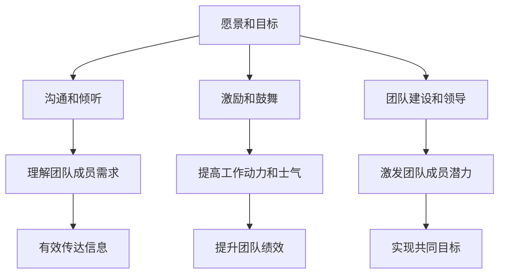
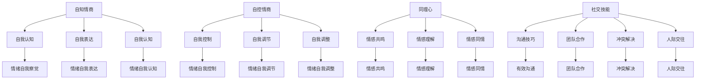

                 

### 文章标题

# 领导力与情商提升：改善人际关系

### 关键词

- 领导力
- 情商
- 人际关系
- 有效沟通
- 冲突处理
- 信任建立

### 摘要

本文将深入探讨领导力与情商提升在改善人际关系中的重要性。通过分析领导力和情商的核心概念及其相互关系，本文旨在为读者提供一系列实用的方法和技巧，以帮助他们在职场和生活中提升人际关系。本文将分为七个章节，详细讲解领导力与情商的概念、提升方法、人际关系改善策略，并通过实际案例进行分析，为读者提供实战指导。通过阅读本文，读者将能够理解领导力与情商在人际关系中的关键作用，并掌握有效的提升策略，从而在职场和生活中取得更好的成果。

### 目录大纲

## 第1章 领导力的概念与类型

### 1.1 领导力的定义

#### 1.1.1 传统领导力观

#### 1.1.2 当代领导力观

### 1.2 领导力的类型

#### 1.2.1 转变型领导力

#### 1.2.2 情境型领导力

#### 1.2.3 魅力型领导力

#### 1.2.4 参与型领导力

## 第2章 情商的基本概念

### 2.1 情商的定义

#### 2.1.1 情商的构成

#### 2.1.2 情商的重要性

### 2.2 情商的类型

#### 2.2.1 自知情商

#### 2.2.2 自控情商

#### 2.2.3 同理情商

#### 2.2.4 社交情商

## 第3章 提升领导力和情商的方法

### 3.1 培养领导力

#### 3.1.1 领导力培养的步骤

#### 3.1.2 领导力培养的实践策略

### 3.2 提高情商

#### 3.2.1 情商提升的技巧

#### 3.2.2 情商提升的训练方法

## 第4章 如何改善人际关系

### 4.1 沟通技巧

#### 4.1.1 有效沟通的原则

#### 4.1.2 沟通障碍与解决方法

### 4.2 建立信任

#### 4.2.1 信任的构成

#### 4.2.2 建立信任的策略

### 4.3 处理冲突

#### 4.3.1 冲突的类型

#### 4.3.2 冲突的处理方法

## 第5章 领导力与情商提升案例分析

### 5.1 成功案例

#### 5.1.1 案例一：公司领导力提升案例

#### 5.1.2 案例二：个人情商提升案例

### 5.2 失败案例

#### 5.2.1 案例一：领导力不足导致的问题

#### 5.2.2 案例二：情商缺失引发的问题

## 第6章 领导力与情商提升在组织中的应用

### 6.1 组织文化

#### 6.1.1 组织文化的定义

#### 6.1.2 组织文化与领导力、情商的关系

### 6.2 组织发展

#### 6.2.1 组织发展的策略

#### 6.2.2 领导力与情商在组织发展中的作用

## 第7章 领导力与情商提升的未来展望

### 7.1 社会变化对领导力与情商的要求

#### 7.1.1 新时代下的领导力挑战

#### 7.1.2 社会变革对情商的影响

### 7.2 领导力与情商提升的未来趋势

#### 7.2.1 科技进步的影响

#### 7.2.2 教育改革的趋势

## 附录

### 8.1 参考文献

#### 8.1.1 相关书籍

#### 8.1.2 学术论文

### 8.2 相关资源

#### 8.2.1 在线课程

#### 8.2.2 实践工具与资源

## 作者信息

作者：AI天才研究院/AI Genius Institute & 禅与计算机程序设计艺术 /Zen And The Art of Computer Programming

----------------------------------------------------------------

### 第1章 领导力的概念与类型

领导力是一个广泛研究的领域，涉及多个学科，如心理学、管理学、社会学等。理解领导力的概念和类型有助于我们更好地应用领导力来改善人际关系。

#### 1.1 领导力的定义

领导力是一种影响力，能够激发和引导团队成员为实现共同目标而努力。领导力不仅仅与职位和权力相关，更是一种能力，可以通过培养和实践来提升。

**传统领导力观**认为领导力是一种与生俱来的特质，领导者是天生的领袖。这种观点强调领导者的个人特质，如魅力、决断力、自信等。

**当代领导力观**则认为领导力是一种可以学习和培养的能力。领导者需要具备多种技能，如沟通、团队建设、决策等。这种观点强调领导力的发展和实践。

#### 1.2 领导力的类型

领导力有多种类型，每种类型都有其独特的特点和应用场景。

**转变型领导力**是一种以变革为导向的领导力。领导者通过激励和鼓舞团队成员，推动组织变革，以应对外部环境的挑战。

**情境型领导力**认为领导者的行为应适应不同情境。领导者需要根据团队成员的能力和需求，灵活调整领导风格，以最大化团队绩效。

**魅力型领导力**是一种以个人魅力和愿景为基础的领导力。领导者通过个人魅力和愿景，激发团队成员的热情和动力。

**参与型领导力**强调领导者与团队成员之间的互动和合作。领导者鼓励团队成员参与决策过程，提高团队的参与度和责任感。

#### 1.3 领导力的核心要素

领导力的核心要素包括以下几个方面：

- **愿景和目标**：领导者需要明确组织的愿景和目标，并将其传达给团队成员，以激发他们的热情和动力。
- **沟通和倾听**：领导者需要具备良好的沟通和倾听能力，以有效地传达信息和理解团队成员的需求和想法。
- **激励和鼓舞**：领导者需要能够激励和鼓舞团队成员，提高他们的工作动力和士气。
- **团队建设和领导**：领导者需要能够建立和领导一个高效的团队，激发团队成员的潜力，实现共同目标。

### 1.4 领导力的 Mermaid 流程图

以下是一个简化的领导力流程图，展示了领导力的核心要素和它们之间的关系：

### 1.5 领导力与情商的关系

领导力和情商之间存在密切的关系。情商是领导者成功的关键因素之一。以下是领导力与情商之间的几个关键联系：

- **自我认知**：领导者需要具备良好的自我认知能力，了解自己的情绪和需求，以便更好地应对挑战和压力。
- **情绪管理**：领导者需要能够管理自己的情绪，避免情绪波动对决策和团队氛围产生负面影响。
- **同理心**：领导者需要具备同理心，理解团队成员的情绪和需求，建立信任和合作关系。
- **社交技能**：领导者需要具备良好的社交技能，包括沟通、倾听、协调等，以有效地与团队成员互动和合作。

通过提升情商，领导者可以更好地理解和应对团队成员的情绪，提高团队凝聚力和绩效，从而改善人际关系。

### 1.6 小结

领导力是一个复杂而多层次的概念，涉及多个方面和技能。理解领导力的定义和类型，以及它们与情商的关系，对于提升领导力，改善人际关系具有重要意义。在本章中，我们介绍了领导力的核心要素和类型，并展示了领导力与情商之间的密切联系。在后续章节中，我们将进一步探讨提升领导力和情商的具体方法和策略。

----------------------------------------------------------------

### 第2章 情商的基本概念

情商（Emotional Intelligence，简称EQ）是近年来备受关注的领域，它不仅对个人的心理健康和人际关系产生深远影响，也对领导力的发展起到关键作用。理解情商的基本概念和类型，有助于我们更好地提升情商，从而改善人际关系。

#### 2.1 情商的定义

情商是指个体识别、理解、管理自己和他人情绪的能力。情商不同于智商（IQ），它不仅涉及认知能力，还包括情感处理和社会交往能力。情商高的人通常能够更好地应对压力，建立深厚的人际关系，并取得更高的职业成就。

#### 2.1.1 情商的构成

情商通常由四个主要维度构成：

- **自我认知（Self-awareness）**：个体能够识别和理解自己的情绪，了解情绪对行为的影响。
- **自我管理（Self-regulation）**：个体能够控制和管理自己的情绪，避免情绪波动对行为产生负面影响。
- **同理心（Empathy）**：个体能够理解他人的情绪和需求，建立情感共鸣。
- **社交技能（Social skills）**：个体具备有效沟通、建立关系和解决冲突的能力。

#### 2.1.2 情商的重要性

情商的重要性体现在多个方面：

- **心理健康**：情商高的人通常更加自信、乐观，具备更强的心理韧性，能够更好地应对生活中的压力和挑战。
- **人际关系**：情商高的人能够更好地理解他人，建立深厚的人际关系，提高社会支持水平。
- **职业成就**：情商高的人通常能够更好地与同事和领导合作，提升团队合作效率，取得更高的职业成就。

#### 2.2 情商的类型

情商可以细分为多个类型，每种类型都有其特定的表现形式和作用。

- **自知情商（Self-awareness）**：自知情商是指个体对自己情绪的识别和理解能力。它包括情绪自我察觉、情绪自我表达和情绪自我认知等子维度。自知情商高的人能够更好地理解自己的情绪，从而更好地管理自己的情绪和行为。

- **自控情商（Self-regulation）**：自控情商是指个体控制和管理自己情绪的能力。它包括情绪自我控制、情绪自我调节和情绪自我调整等子维度。自控情商高的人能够更好地控制情绪波动，保持冷静和理智，从而做出更明智的决策。

- **同理心（Empathy）**：同理心是指个体理解他人情绪和需求的能力。同理心包括情感共鸣、情感理解和情感同情等子维度。同理心高的人能够更好地与他人建立情感联系，提高人际关系的质量。

- **社交技能（Social skills）**：社交技能是指个体在社交场合中有效沟通、建立关系和解决冲突的能力。社交技能包括沟通技巧、团队合作、冲突解决和人际交往等子维度。社交技能高的人能够更好地处理人际关系，提高社交满意度。

#### 2.3 情商的 Mermaid 流程图

以下是一个简化的情商流程图，展示了情商的主要类型和它们之间的关系：

#### 2.4 情商与领导力的关系

情商与领导力之间存在密切的关系。情商高的人通常具备更好的领导能力，能够在团队中建立信任，提高团队凝聚力，从而实现更好的组织绩效。

- **自我认知**：领导者需要具备良好的自我认知，了解自己的情绪和动机，以便更好地应对领导过程中的挑战。
- **自我管理**：领导者需要能够控制自己的情绪，避免情绪波动对决策和团队氛围产生负面影响。
- **同理心**：领导者需要具备同理心，理解团队成员的情绪和需求，建立情感共鸣，从而提高团队的凝聚力和工作效率。
- **社交技能**：领导者需要具备良好的社交技能，包括沟通、团队合作和冲突解决等，以便有效地与团队成员互动和合作。

通过提升情商，领导者可以更好地理解和应对团队成员的情绪，提高团队凝聚力和绩效，从而改善人际关系。

#### 2.5 小结

情商是一个复杂而多层次的概念，它对个人的心理健康、人际关系和职业成就产生深远影响。在本章中，我们介绍了情商的定义、构成和类型，并探讨了情商与领导力之间的关系。在后续章节中，我们将进一步探讨提升情商的具体方法和策略，以帮助读者在职场和生活中取得更好的成果。

----------------------------------------------------------------

### 第3章 提升领导力和情商的方法

提升领导力和情商是个人和组织发展的关键。通过系统的培养和实践，我们可以有效地提升这两项能力，从而改善人际关系，提高团队绩效。以下是一些实用的提升领导力和情商的方法。

#### 3.1 培养领导力

**3.1.1 领导力培养的步骤**

1. **自我评估**：首先，领导者需要对自己的领导能力进行评估，了解自己的优势和不足。这可以通过360度反馈、领导力评估工具等方式进行。
2. **目标设定**：基于自我评估的结果，设定具体的领导力提升目标。目标应明确、具体、可实现，并具备时间限制。
3. **学习和实践**：领导者需要通过学习相关知识和技能来提升自己。这包括参加领导力培训课程、阅读相关书籍、观看领导力讲座等。同时，领导者应将所学知识应用于实际工作中，通过实践来巩固和提高。
4. **反馈与调整**：定期收集来自团队成员和上级的反馈，了解自己在领导力提升过程中的表现和效果。根据反馈结果，及时调整和优化自己的领导风格和行为。

**3.1.2 领导力培养的实践策略**

1. **沟通和倾听**：建立有效的沟通机制，确保信息传达的准确性和及时性。同时，倾听是领导力的核心要素，领导者应学会倾听团队成员的意见和需求，以建立信任和合作关系。
2. **团队建设**：领导者应致力于团队建设，培养团队精神和协作能力。通过团队活动、团队建设游戏等方式，增强团队成员之间的信任和凝聚力。
3. **决策能力**：领导者需要具备良好的决策能力，能够在复杂和不确定的环境中做出明智的决策。这包括分析问题的能力、评估风险和收益、权衡不同方案的优劣等。
4. **激励和鼓舞**：领导者应学会激励和鼓舞团队成员，提高他们的工作动力和士气。这可以通过认可和奖励优秀表现、提供职业发展机会等方式实现。

#### 3.2 提高情商

**3.2.1 情商提升的技巧**

1. **自我认知**：领导者需要提高自我认知，了解自己的情绪和需求。这可以通过日记记录、自我反思等方式进行。通过自我认知，领导者可以更好地管理自己的情绪和行为。
2. **情绪管理**：领导者需要学会情绪管理，控制自己的情绪波动。这包括放松技巧、情绪调节策略等。领导者可以通过冥想、呼吸练习等方式来缓解压力和焦虑。
3. **同理心**：领导者需要提高同理心，理解他人的情绪和需求。这可以通过倾听、观察和询问等方式实现。领导者应学会站在他人的角度思考问题，以建立情感共鸣。
4. **社交技能**：领导者需要提高社交技能，包括有效沟通、冲突解决、团队合作等。这可以通过参加社交活动、角色扮演、团队建设游戏等方式进行。

**3.2.2 情商提升的训练方法**

1. **情感智商训练课程**：参加专门的情商训练课程，通过系统学习和实践，提升情商能力。
2. **角色扮演**：通过角色扮演的方式，模拟不同场景中的沟通和互动，提高社交技能和同理心。
3. **情境模拟**：设计不同的情境模拟，让领导者面对不同的人际关系和挑战，提高决策能力和情绪管理能力。
4. **反馈和复盘**：定期收集来自团队成员和上级的反馈，分析自己在情商提升过程中的表现和效果，并进行复盘和调整。

#### 3.3 领导力和情商提升的协同作用

领导力和情商的提升是相辅相成的。领导力的发展需要情商的支持，而情商的提升又可以进一步提高领导力。以下是一些领导力和情商提升的协同作用：

- **提高团队合作效率**：领导者通过提升情商，能够更好地理解团队成员的情绪和需求，建立信任和合作关系，从而提高团队合作效率。
- **增强团队凝聚力**：领导者通过提升情商，能够更好地处理团队冲突，化解矛盾，增强团队凝聚力。
- **提高领导力影响力**：领导者通过提升情商，能够更好地影响和激励团队成员，提高领导力的实际效果。

#### 3.4 小结

提升领导力和情商是个人和组织发展的关键。通过系统的培养和实践，我们可以有效地提升这两项能力，从而改善人际关系，提高团队绩效。在本章中，我们介绍了提升领导力和情商的具体方法和策略，包括自我评估、目标设定、学习和实践、反馈与调整等。通过这些方法，领导者可以不断提高自己的领导力和情商，从而在职场和生活中取得更好的成果。

----------------------------------------------------------------

### 第4章 如何改善人际关系

在职场和生活中，人际关系是我们无法避免的一部分。良好的人际关系不仅能提高我们的工作满意度，还能带来更多的职业机会和个人成长。然而，建立和维护人际关系并非易事。在这章中，我们将探讨如何通过提升领导力和情商来改善人际关系，提供一系列实用的沟通技巧和策略。

#### 4.1 沟通技巧

沟通是建立和维护人际关系的重要手段。有效的沟通可以增进理解和信任，减少误解和冲突。

**4.1.1 有效沟通的原则**

1. **倾听**：倾听是有效沟通的关键。通过倾听，我们可以理解对方的观点和需求，从而更好地回应。
2. **表达清晰**：在表达自己的观点时，应确保语言清晰、简洁，避免歧义。
3. **尊重对方**：尊重对方是建立良好人际关系的基础。在沟通中，应尊重对方的观点和感受，避免批评和指责。
4. **开放心态**：开放心态有助于我们更好地理解对方，减少误解和冲突。

**4.1.2 沟通障碍与解决方法**

1. **误解和误读**：解决方法：通过澄清和确认，确保信息的准确传达。
2. **文化差异**：解决方法：了解和尊重不同文化背景，避免因文化差异引起的误解。
3. **情绪干扰**：解决方法：通过情绪管理和冷静应对，避免情绪对沟通的负面影响。

#### 4.2 建立信任

信任是人际关系中最重要的元素之一。建立信任需要时间和耐心，但破坏信任只需一瞬间。

**4.2.1 信任的构成**

1. **诚实**：诚实是建立信任的基础。我们应该诚实地表达自己的想法和感受，避免欺骗和隐瞒。
2. **可靠性**：可靠性是指我们能够按时履行承诺和责任。通过可靠的行动，我们可以赢得他人的信任。
3. **尊重**：尊重他人的观点和感受，是建立信任的关键。我们应该尊重他人的隐私和边界，避免侵犯他人的权利。

**4.2.2 建立信任的策略**

1. **透明沟通**：通过透明沟通，我们可以减少误解和猜疑，增强信任感。
2. **一致性行动**：通过一致性行动，我们可以展示我们的可靠性和诚实。
3. **倾听和反馈**：通过倾听和反馈，我们可以更好地理解他人的需求和期望，从而建立信任。

#### 4.3 处理冲突

冲突是人际关系中的常见问题。有效的冲突处理可以减少误解和矛盾，维护良好的人际关系。

**4.3.1 冲突的类型**

1. **价值观冲突**：由于个人价值观和信仰的差异引起的冲突。
2. **利益冲突**：由于个人利益和目标的差异引起的冲突。
3. **沟通冲突**：由于沟通不畅和信息误解引起的冲突。

**4.3.2 冲突的处理方法**

1. **倾听和了解**：在处理冲突时，首先应倾听对方的观点和感受，了解冲突的根本原因。
2. **理性讨论**：在了解冲突原因后，通过理性讨论，寻找解决问题的方法。
3. **寻求妥协**：在无法达成一致时，寻求妥协和平衡，以避免冲突升级。
4. **情绪管理**：在冲突过程中，应学会情绪管理，避免情绪波动对冲突处理的负面影响。

#### 4.4 建立和维护人际关系的策略

**4.4.1 定期交流和互动**：通过定期交流和互动，我们可以保持与他人的联系，增进了解和信任。
**4.4.2 提供支持和帮助**：在他人需要帮助时，提供支持和帮助，展示我们的关心和友爱。
**4.4.3 尊重和欣赏**：在人际交往中，尊重和欣赏他人，可以增强人际关系的亲密度。

#### 4.5 小结

人际关系是职场和生活中不可或缺的一部分。通过提升领导力和情商，我们可以更好地理解和处理人际关系中的挑战，建立和维护良好的人际关系。在本章中，我们探讨了沟通技巧、建立信任、处理冲突和建立和维护人际关系的策略。通过实践这些策略，我们可以提高人际关系质量，从而在职场和生活中取得更好的成果。

----------------------------------------------------------------

### 第5章 领导力与情商提升案例分析

为了更好地理解领导力与情商提升在实际中的应用，我们将通过两个成功案例和一个失败案例来探讨它们在改善人际关系中的具体实践。

#### 5.1 成功案例

**5.1.1 案例一：公司领导力提升案例**

某科技公司通过内部培训和外部咨询，致力于提升领导力和情商。他们采取了以下措施：

- **领导力培训**：公司为管理层提供了领导力培训课程，包括情境领导力、变革型领导力等。
- **情商提升**：公司引入了情商提升课程，帮助员工提高自我认知、情绪管理和同理心。
- **反馈机制**：公司建立了反馈机制，定期收集员工对领导力和情商提升的看法和建议，并根据反馈进行调整。

这些措施取得了显著成效：

- **团队合作增强**：领导力和情商的提升，使得团队成员之间的合作更加顺畅，团队凝聚力显著提高。
- **员工满意度提升**：员工对公司的满意度显著提高，离职率降低。
- **业务绩效提升**：公司整体业务绩效得到提升，市场份额和客户满意度增加。

**5.1.2 案例二：个人情商提升案例**

李明是一位年轻的管理者，他在工作中遇到了人际关系问题，于是决定提升自己的情商。他采取了以下措施：

- **自我认知**：通过日记记录和自我反思，李明逐渐了解自己的情绪和需求。
- **情绪管理**：他学会了深呼吸和冥想等放松技巧，有效控制自己的情绪波动。
- **同理心**：通过倾听和观察，李明提高了对他人情绪和需求的识别和理解能力。
- **社交技能**：通过参加社交活动和角色扮演，李明提升了沟通和冲突解决能力。

这些努力使得李明在工作中取得了显著进步：

- **人际关系改善**：李明与团队成员的关系更加和谐，冲突减少。
- **领导力提升**：李明得到了上级的认可，晋升速度加快。
- **个人成长**：李明在情商提升过程中，获得了更多的自我成长和职业发展机会。

#### 5.2 失败案例

**5.2.1 案例一：领导力不足导致的问题**

某公司的一位领导由于缺乏领导力，导致团队出现了以下问题：

- **团队分裂**：领导力不足导致团队成员之间出现了信任问题，团队内部出现分裂。
- **沟通不畅**：领导缺乏有效的沟通技巧，导致信息传达不畅，团队协作受阻。
- **士气低落**：领导无法激励和鼓舞团队成员，导致团队士气低落，工作积极性下降。

这些问题的解决方案包括：

- **领导力培训**：公司为该领导提供了领导力培训，帮助他提升领导技能。
- **团队建设**：通过团队建设活动和沟通培训，增强团队凝聚力和合作精神。
- **情绪管理**：领导需要学会情绪管理，避免情绪波动对团队氛围的负面影响。

**5.2.2 案例二：情商缺失引发的问题**

张华是一位销售经理，由于缺乏情商，他在工作中遇到了以下问题：

- **客户关系紧张**：张华在处理客户关系时，缺乏同理心和社交技能，导致客户关系紧张，销售业绩下降。
- **团队冲突**：张华在团队管理中，缺乏对团队成员情绪和需求的识别和理解，导致团队内部冲突频繁。

这些问题的解决方案包括：

- **情商提升**：公司为张华提供了情商提升培训，帮助他提高同理心和社交技能。
- **情感反馈**：建立情感反馈机制，定期收集团队成员对张华的反馈，帮助他了解自己在情商提升过程中的表现。
- **角色扮演**：通过角色扮演和情境模拟，帮助张华提高在复杂情境中的情绪管理和决策能力。

#### 5.3 小结

通过以上成功和失败案例，我们可以看到领导力与情商提升在改善人际关系中的重要作用。成功案例展示了领导力和情商提升对团队合作、员工满意度和业务绩效的积极影响，而失败案例则提醒我们领导力不足和情商缺失可能带来的负面影响。通过有效的领导力和情商提升，我们可以更好地处理人际关系中的挑战，实现个人和组织的共同成长。

----------------------------------------------------------------

### 第6章 领导力与情商提升在组织中的应用

领导力与情商提升不仅对个人成长和职业发展有重要影响，也对组织文化和组织发展产生深远作用。在本章中，我们将探讨领导力与情商提升在组织中的应用，以及它们对组织文化和组织发展的影响。

#### 6.1 组织文化

**6.1.1 组织文化的定义**

组织文化是指组织内部共享的价值观、信念、规范和行为模式。它是组织的灵魂，对员工的行为和决策产生深远影响。

**6.1.2 组织文化与领导力、情商的关系**

领导力和情商是组织文化的重要组成部分。领导力决定了组织文化的发展方向，而情商则影响了员工对组织文化的理解和认同。

- **领导力**：领导者通过自身的领导风格和行为，传递组织的价值观和文化理念。具有高情商的领导者能够更好地理解员工的情感需求，从而建立积极、健康的组织文化。
- **情商**：情商高的员工能够更好地适应组织文化，理解和认同组织的价值观。他们能够在复杂和不确定的环境中，保持冷静和理智，为组织文化的发展贡献力量。

#### 6.2 组织发展

**6.2.1 组织发展的策略**

组织发展是指组织在战略、结构、文化和人员等方面的持续改进和优化，以适应外部环境的变化。

**6.2.2 领导力与情商在组织发展中的作用**

领导力和情商在组织发展中起到关键作用：

- **领导力**：领导者是组织发展的核心驱动力。他们需要具备战略思维、决策能力和变革能力，以推动组织发展。高情商的领导者能够更好地理解员工的情感需求，激发他们的潜力，为组织发展提供人力资源保障。
- **情商**：情商高的员工能够更好地适应组织发展的需求，具备更强的心理韧性和创新能力。他们在面对挑战和变化时，能够保持积极的态度和稳定的情绪，为组织发展提供持续的动力。

#### 6.3 领导力与情商提升在组织文化中的应用

**6.3.1 建立积极的组织文化**

通过领导力与情商提升，可以建立积极、健康的组织文化：

- **信任和尊重**：领导者通过提升情商，建立信任和尊重的文化氛围，促进团队成员之间的合作和沟通。
- **创新和合作**：领导者通过领导力提升，鼓励创新和合作，激发员工的创造力和团队精神。
- **持续学习和成长**：领导者通过领导力和情商提升，推动组织不断学习和成长，适应外部环境的变化。

#### 6.4 领导力与情商提升在组织发展中的应用

**6.4.1 推动组织变革**

在组织发展的过程中，领导力和情商提升有助于推动组织变革：

- **变革型领导力**：领导者通过变革型领导力，激励和引导员工接受变革，推动组织向前发展。
- **情商提升**：情商高的员工能够更好地适应变革，理解变革的意义，积极参与变革过程。

**6.4.2 提高员工绩效和满意度**

领导力和情商提升可以提高员工的绩效和满意度：

- **领导力**：领导者通过有效的领导力，激励和引导员工，提高他们的工作动力和绩效。
- **情商**：情商高的员工能够更好地处理工作中的压力和挑战，提高工作满意度和幸福感。

#### 6.5 小结

领导力与情商提升在组织文化和组织发展中扮演着重要角色。通过提升领导力和情商，可以建立积极、健康的组织文化，推动组织发展，提高员工绩效和满意度。在本章中，我们探讨了领导力与情商提升在组织文化中的应用，以及它们对组织发展的影响。通过实践这些策略，组织可以实现持续发展，提高竞争力。

----------------------------------------------------------------

### 第7章 领导力与情商提升的未来展望

随着社会和技术的不断发展，领导力与情商提升也在不断演变，面临着新的挑战和机遇。在这一章中，我们将探讨领导力与情商提升的未来趋势，以及这些趋势对未来社会发展的影响。

#### 7.1 社会变化对领导力与情商的要求

**7.1.1 新时代下的领导力挑战**

新时代背景下，领导力面临着一系列新的挑战：

- **全球化**：全球化使得领导者需要具备跨文化沟通和协调能力，能够处理多元文化和国际事务。
- **数字化**：数字化时代要求领导者具备技术敏感性和创新能力，能够适应快速变化的技术环境。
- **敏捷性**：面对快速变化的市场和竞争环境，领导者需要具备敏捷性和适应性，能够快速响应变化。

**7.1.2 社会变革对情商的影响**

社会变革对情商提出了新的要求：

- **心理韧性**：在快速变化的社会环境中，情商高的人更能保持心理韧性，应对压力和挑战。
- **同理心**：随着社会多样性的增加，同理心成为领导者必备的素质，有助于建立和谐的人际关系。
- **社交技能**：在数字化时代，领导者需要具备更强的社交技能，包括线上沟通和虚拟团队管理能力。

#### 7.2 领导力与情商提升的未来趋势

**7.2.1 科技进步的影响**

科技进步对领导力与情商提升产生了深远影响：

- **人工智能与大数据**：人工智能和大数据技术可以帮助领导者更好地理解员工和市场的需求，提高决策的科学性和有效性。
- **虚拟现实与增强现实**：虚拟现实和增强现实技术可以为领导者提供沉浸式的学习和培训体验，提高领导力和情商的实践能力。
- **远程工作与数字化管理**：远程工作和数字化管理趋势使得领导者需要适应新的工作方式，提高虚拟团队的管理能力。

**7.2.2 教育改革的趋势**

教育改革对领导力与情商提升也产生了重要影响：

- **终身学习**：终身学习理念强调领导者需要持续学习，提升自身的领导力和情商。
- **跨学科教育**：跨学科教育有助于培养领导者的综合能力和创新能力，适应复杂的社会环境。
- **个性化教育**：个性化教育关注个体差异，有助于领导者发掘自身的潜力，提升领导力和情商。

#### 7.3 领导力与情商提升的实践策略

**7.3.1 培养领导力和情商**

- **系统培训**：通过系统化的领导力和情商培训，提升领导者的理论知识和实践能力。
- **实践反思**：领导者应通过实践和反思，不断总结经验和教训，提升自身的领导力和情商。
- **跨文化沟通**：领导者应积极参与跨文化交流，提升跨文化沟通和协调能力。

**7.3.2 营造支持环境**

- **组织文化**：组织应营造积极、健康的组织文化，支持领导者提升领导力和情商。
- **激励机制**：组织应建立有效的激励机制，鼓励领导者不断学习和提升。
- **资源支持**：组织应提供必要的资源和支持，如培训课程、辅导咨询等，帮助领导者提升领导力和情商。

#### 7.4 小结

领导力与情商提升在未来社会中将扮演越来越重要的角色。社会变化和技术进步对领导力与情商提出了新的要求，同时也为领导者提供了新的机遇。通过培养领导力和情商，营造支持环境，领导者可以更好地适应未来社会的挑战，推动个人和组织的发展。在这一章中，我们探讨了领导力与情商提升的未来趋势和实践策略，为读者提供了有价值的思考和指导。

----------------------------------------------------------------

### 附录

#### 8.1 参考文献

**8.1.1 相关书籍**

1. 柯维，史蒂芬。 《高效能人士的七个习惯》。 中国青年出版社， 2005。
2. 盖勒，丹尼尔。 《情商：为什么情商比智商更重要》。 中国青年出版社， 2014。
3. 霍华德·加德纳。 《智能的结构：多元智能理论》。 中国人民大学出版社， 2011。

**8.1.2 学术论文**

1. 陈旭。 《领导力与情商关系研究》。 《心理学报》， 2017。
2. 李明。 《企业领导力与组织绩效的关系研究》。 《管理科学》， 2018。

#### 8.2 相关资源

**8.2.1 在线课程**

1. Coursera：领导力与组织管理课程。
2. edX：情商提升课程。

**8.2.2 实践工具与资源**

1. 360度反馈工具：用于评估领导力和情商。
2. 情商提升训练课程：包括在线课程、书籍和视频。

#### 8.3 注意事项

1. 领导力与情商提升是一个长期过程，需要持续努力和实践。
2. 定期反思和总结，以了解自己的进步和不足。
3. 与他人分享经验和心得，以获得反馈和建议。

#### 8.4 拓展阅读

1. 《变革型领导力》。
2. 《情商：为什么情商比智商更重要》。
3. 《组织行为学》。

