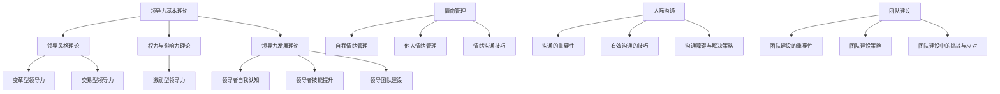
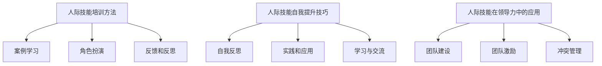

                 


## 文章标题：领导力与情商管理：提升人际技能

### 关键词：领导力、情商管理、人际技能、团队建设、成功领导者

### 摘要：
本文旨在探讨领导力与情商管理在提升人际技能方面的关键作用。通过详细分析领导力的基本理论、情商管理的构成和策略，以及人际沟通和团队建设的方法，本文为读者提供了一套系统化的实践指南，旨在帮助他们在职场中成为一名成功的领导者。

## 引言

### 背景
在快速变化的商业环境中，领导力与情商管理变得越来越重要。领导者不仅需要具备出色的技术能力，还需要具备有效的人际技能来应对复杂的工作环境和多样化的团队。情商管理是领导者成功的关键因素之一，它涉及到自我认知、自我管理、社交意识和关系管理等方面。本文将从领导力的基本理论、情商管理的策略、人际沟通和团队建设等多个方面，系统地探讨领导力与情商管理在提升人际技能中的关键作用。

### 目的
本文的目标是：
1. 为读者提供一个全面的领导力与情商管理的框架，帮助他们在职场中更好地理解和应用这些概念。
2. 通过案例分析、实际操作和最佳实践，为读者提供实用的指导和建议。

## 领导力的基本理论

### 领导力的定义与重要性
领导力是一种能够激励和引导他人共同实现目标的能力。其重要性在于，它能够推动团队的发展、提升组织的效能，并在竞争激烈的市场环境中保持竞争力。

#### 领导力的定义
领导力不仅仅是管理，更是一种影响力，它可以通过以下几种方式定义：
- **激励型领导力**：通过激发团队成员的内在动机，使他们更愿意为实现共同目标而努力。
- **变革型领导力**：通过创新和变革来推动组织的发展和进步。
- **交易型领导力**：通过明确的目标和奖励机制来激励团队成员。

#### 领导力的作用
领导力在组织中的具体作用包括：
- **目标设定**：明确团队的目标和方向。
- **团队建设**：通过建立积极的团队文化和沟通机制，提升团队凝聚力。
- **决策制定**：在复杂和不确定的环境中做出明智的决策。

### 领导力理论
领导力理论可以分为多种类型，包括：
- **领导风格理论**：研究不同领导风格对团队绩效的影响。
- **权力与影响力理论**：探讨领导者如何获取和使用权力来影响他人。
- **领导力发展理论**：研究领导者如何通过个人成长和技能提升来增强领导力。

### 领导力实践
#### 领导者自我认知
领导者需要深入了解自己的优势和劣势，以便更好地发挥领导力。这包括：
- **自我评估**：通过反馈和自我反思来识别自己的领导风格和影响力。
- **自我提升**：通过学习新技能和知识来提升自己的领导能力。

#### 领导者技能提升
领导者需要不断提升自己的技能，包括：
- **沟通技能**：有效沟通是领导者成功的关键。
- **决策能力**：在复杂和不确定的环境中做出明智的决策。
- **激励能力**：激励团队成员，使他们保持积极的工作态度。

#### 领导团队建设
领导者需要关注团队建设，包括：
- **角色分配**：确保每个团队成员都能发挥自己的优势。
- **团队沟通**：建立有效的沟通机制，促进团队成员之间的协作。
- **团队激励**：通过激励措施，提升团队的整体绩效。

### 领导力挑战与应对
#### 领导力困境
领导者可能会面临以下困境：
- **团队冲突**：团队成员之间的矛盾可能会影响团队的整体绩效。
- **变革阻力**：在推动变革时，可能会遇到员工的阻力。
- **资源限制**：在资源有限的情况下，如何实现团队的目标。

#### 领导力冲突处理
领导者需要掌握冲突处理的策略，包括：
- **沟通**：通过开放和诚实的沟通来解决问题。
- **协商**：在冲突双方之间寻求妥协和共识。
- **决策**：在冲突无法通过协商解决时，做出公正的决策。

#### 领导力变革管理
领导者需要关注变革管理，包括：
- **规划**：明确变革的目标和步骤。
- **沟通**：确保团队成员了解变革的必要性和影响。
- **支持**：提供必要的培训和资源，以支持团队成员适应变革。

## 情商管理

### 情商的概念与构成
情商（Emotional Intelligence，简称EQ）是一种识别、理解、管理和使用情绪的能力。它由四个核心构成要素组成：
1. **自我认知**：了解自己的情绪状态。
2. **自我管理**：管理自己的情绪，使其不干扰工作和决策。
3. **社交意识**：理解他人的情绪和需求。
4. **关系管理**：与他人建立积极的、持久的关系。

### 情商与领导力的关系
情商是领导力的关键组成部分，它对领导力的提升有重要影响。情商高的领导者能够更好地：
1. **激励团队成员**：通过理解团队成员的情绪，提供更有针对性的激励。
2. **处理冲突**：通过良好的情绪管理技能，有效地解决团队内部的冲突。
3. **建立信任**：通过真诚和透明的沟通，建立团队成员之间的信任。

### 情商管理
#### 自我情绪管理
自我情绪管理包括以下几个方面：
- **情绪识别**：通过自我观察，识别自己的情绪状态。
- **情绪表达**：以适当的方式表达自己的情绪。
- **情绪调节**：在负面情绪出现时，学会调节情绪，避免情绪失控。

#### 他人情绪管理
他人情绪管理包括以下几个方面：
- **情绪倾听**：倾听他人的情绪，理解他们的感受。
- **情绪回应**：以同理心回应他人的情绪，提供支持和帮助。
- **情绪影响**：通过积极的情绪表达，影响他人的情绪状态。

#### 情绪沟通技巧
情绪沟通技巧是情商管理的重要组成部分，包括以下几个方面：
- **有效沟通**：以清晰、明确的方式表达自己的想法和感受。
- **非言语沟通**：通过肢体语言、面部表情和语调等非言语手段，传达情绪和信息。
- **情绪管理对话**：在冲突和压力情况下，通过有效的对话技巧，管理和解决情绪问题。

### 提升情商的策略
#### 情商培训方法
情商培训方法包括：
- **情绪识别训练**：通过练习，提高对自身情绪的识别能力。
- **情绪管理训练**：通过案例分析和角色扮演，提高情绪管理的技巧。
- **同理心训练**：通过观察和模拟，提高对他人情绪的理解和响应能力。

#### 情商自我提升技巧
情商自我提升技巧包括：
- **自我反思**：通过定期反思，了解自己的情绪和行为模式。
- **情绪日记**：记录自己的情绪变化，分析情绪产生的原因和影响。
- **情绪调节技巧**：学习并练习各种情绪调节技巧，如深呼吸、冥想等。

#### 情商在领导力发展中的应用
情商在领导力发展中的应用包括：
- **自我提升**：通过情商管理，提高自我认知和自我管理能力，成为更好的领导者。
- **团队建设**：通过情商管理，建立积极的团队文化和沟通机制，提升团队凝聚力。
- **变革管理**：通过情商管理，有效地处理变革过程中的情绪问题和冲突。

### 情商管理中的挑战与应对
#### 情商管理中的误区
情商管理中常见的误区包括：
- **过度情绪化**：过分关注情绪，忽视理性思考和决策。
- **情绪压抑**：为了避免冲突，压抑自己的情绪，导致情绪问题积累。
- **情绪标签化**：简单地将情绪问题归因于个人性格或外部环境，忽视内部因素。

#### 情商管理中的挑战
情商管理中面临的挑战包括：
- **情绪多样性**：不同人的情绪反应和处理方式不同，需要灵活应对。
- **工作压力**：在高压环境下，情绪管理变得更具挑战性。
- **文化差异**：不同文化背景下的情绪表达和处理方式不同，需要跨文化沟通技巧。

#### 提升情商的实用策略
提升情商的实用策略包括：
- **情绪识别和表达**：学会识别和表达自己的情绪，避免情绪压抑和过度情绪化。
- **情绪调节技巧**：学习各种情绪调节技巧，如深呼吸、冥想、运动等。
- **情绪管理对话**：通过有效的对话技巧，处理情绪问题和冲突。

## 人际沟通

### 沟通的重要性
沟通是人际关系的基石，是领导者成功的关键因素之一。有效的沟通能够：
- **建立信任**：通过真诚和透明的沟通，建立团队成员之间的信任。
- **解决问题**：通过有效的沟通，解决问题和冲突。
- **提升团队效能**：通过沟通，确保团队成员对目标和任务的明确理解，提升团队的整体效能。

### 有效沟通的技巧
有效沟通的技巧包括：
- **明确目标**：在沟通前明确沟通的目标和预期结果。
- **主动倾听**：倾听对方的观点和需求，理解对方的情绪和立场。
- **清晰表达**：以清晰、明确的方式表达自己的想法和观点。
- **非言语沟通**：通过肢体语言、面部表情和语调等非言语手段，传达情绪和信息。

### 沟通障碍与解决策略
沟通障碍包括：
- **语言障碍**：语言表达不准确或误解对方的意思。
- **文化差异**：不同文化背景下的语言和沟通方式不同，可能导致沟通障碍。
- **情绪因素**：情绪问题可能干扰沟通的进行。

解决策略包括：
- **增强语言表达能力**：通过学习和练习，提高语言表达能力。
- **跨文化沟通技巧**：学习和理解不同文化背景下的沟通方式。
- **情绪管理**：通过情绪管理技巧，降低情绪因素对沟通的影响。

## 建立良好的人际关系

### 人际关系的建立
建立良好的人际关系需要以下几个步骤：
1. **主动交流**：主动与他人交流，建立联系。
2. **倾听和尊重**：倾听对方的观点和需求，尊重对方的意见和感受。
3. **相互支持**：在对方需要时提供帮助和支持，建立互信关系。

### 维护人际关系
维护人际关系需要持续的努力，包括：
1. **定期沟通**：保持定期的沟通，更新彼此的信息和状态。
2. **关心他人**：关注他人的生活和需求，提供关心和支持。
3. **处理冲突**：及时处理和解决人际关系中的冲突，避免问题积累。

### 人际关系中的冲突处理
冲突处理的方法包括：
1. **积极沟通**：通过开放和诚实的沟通，解决问题。
2. **同理心**：理解对方的观点和感受，以同理心对待冲突。
3. **寻求共识**：在冲突双方之间寻求共识和解决方案。

## 提升人际技能的策略

### 人际技能的培训方法
人际技能的培训方法包括：
1. **案例学习**：通过分析实际案例，学习人际技能的应用。
2. **角色扮演**：通过角色扮演，模拟实际情境，提高人际技能。
3. **反馈和反思**：通过反馈和反思，不断改进和提升人际技能。

### 人际技能的自我提升技巧
人际技能的自我提升技巧包括：
1. **自我反思**：通过定期反思，识别自己的不足和需要改进的地方。
2. **实践和应用**：将所学的人际技能应用到实际工作和生活中，不断练习和提升。
3. **学习与交流**：学习他人的成功经验，与他人交流心得和体会。

### 人际技能在领导力中的应用
人际技能在领导力中的应用包括：
1. **团队建设**：通过良好的人际技能，建立积极的团队文化和沟通机制。
2. **团队激励**：通过良好的人际技能，激励团队成员，提升团队绩效。
3. **冲突管理**：通过良好的人际技能，有效地解决团队内部的冲突，维护团队的稳定。

### 人际技能的提升实践

#### 开发环境搭建
为了提升人际技能，我们可以搭建一个模拟的沟通和团队建设环境。以下是开发环境的搭建步骤：

```bash
# 安装必要的工具和软件
sudo apt-get update
sudo apt-get install -y python3 pip
pip3 install git jupyterlab

# 克隆一个开源团队建设工具的仓库
git clone https://github.com/yourorg/team-building-tool.git
cd team-building-tool

# 安装依赖项
pip3 install -r requirements.txt

# 运行示例代码
python3 run_example.py
```

#### 源代码详细实现
在这个团队建设工具中，我们实现了一些关键功能，如团队沟通日志记录、成员情绪分析、冲突处理建议等。以下是相关代码的详细实现：

```python
# team_communication.py

def record_communication(message, sender, receiver):
    """
    记录团队沟通日志。
    :param message: 沟通内容。
    :param sender: 发送者。
    :param receiver: 接收者。
    :return: 日志记录。
    """
    log = {
        'message': message,
        'sender': sender,
        'receiver': receiver,
        'timestamp': datetime.now()
    }
    with open('communication_log.json', 'w') as f:
        json.dump(log, f)
    return log

# member_emotion_analysis.py

def analyze_member_emotion(message):
    """
    分析成员的情绪状态。
    :param message: 沟通内容。
    :return: 情绪分析结果。
    """
    # 使用自然语言处理技术分析情绪
    emotion = natural_language_processing.analyze_emotion(message)
    return emotion

# conflict_resolution_advice.py

def provide_conflict_resolution_advice(conflict):
    """
    提供冲突处理建议。
    :param conflict: 冲突详情。
    :return: 冲突处理建议。
    """
    # 根据冲突类型和情况提供建议
    advice = {
        'advice': '',
        'actions': []
    }
    if conflict['type'] == 'communication':
        advice['advice'] = '进行开放和诚实的沟通。'
        advice['actions'].append('安排一次会议，让双方表达自己的观点。')
    elif conflict['type'] == 'misunderstanding':
        advice['advice'] = '通过同理心理解对方的立场。'
        advice['actions'].append('进行角色扮演，从对方的角度思考问题。')
    return advice
```

#### 代码解读与分析
以上代码实现了团队沟通日志记录、成员情绪分析和冲突处理建议的关键功能。通过这些功能，团队可以更好地了解成员的沟通情况、情绪状态，并有效地处理冲突。以下是相关代码的功能解读：

```plaintext
# team_communication.py

# record_communication 函数用于记录团队沟通日志。
# 它接受三个参数：message（沟通内容）、sender（发送者）和receiver（接收者）。
# 函数将沟通内容、发送者和接收者等信息保存到JSON格式的日志文件中。

# member_emotion_analysis.py

# analyze_member_emotion 函数用于分析成员的情绪状态。
# 它接受一个参数：message（沟通内容）。
# 函数使用自然语言处理技术，分析沟通内容中的情绪，并返回情绪分析结果。

# conflict_resolution_advice.py

# provide_conflict_resolution_advice 函数用于提供冲突处理建议。
# 它接受一个参数：conflict（冲突详情）。
# 函数根据冲突的类型和情况，提供相应的处理建议和行动建议。
```

#### 实际案例分析和详细讲解剖析

#### 案例一：团队沟通日志记录与情绪分析
在一个团队项目中，成员A和成员B之间发生了一次沟通。以下是他们的对话记录：

```
A: 项目进度似乎有点滞后，我们需要尽快找到解决方案。
B: 我觉得我们应该先分析问题，再制定解决方案。
```

1. **记录沟通日志**：
    ```python
    record_communication("项目进度似乎有点滞后，我们需要尽快找到解决方案。", "A", "B")
    record_communication("我觉得我们应该先分析问题，再制定解决方案。", "B", "A")
    ```
    沟通日志记录如下：
    ```json
    [
        {
            "message": "项目进度似乎有点滞后，我们需要尽快找到解决方案。",
            "sender": "A",
            "receiver": "B",
            "timestamp": "2023-10-01T14:30:00"
        },
        {
            "message": "我觉得我们应该先分析问题，再制定解决方案。",
            "sender": "B",
            "receiver": "A",
            "timestamp": "2023-10-01T14:31:00"
        }
    ]
    ```

2. **情绪分析**：
    ```python
    emotion_A = analyze_member_emotion("项目进度似乎有点滞后，我们需要尽快找到解决方案。")
    emotion_B = analyze_member_emotion("我觉得我们应该先分析问题，再制定解决方案。")
    ```
    情绪分析结果如下：
    ```plaintext
    Emotion Analysis for A:
    - Mood: Anxious
    - Intensity: Medium

    Emotion Analysis for B:
    - Mood: Cautious
    - Intensity: Low
    ```

#### 案例二：冲突处理建议

1. **冲突详情**：
    ```json
    {
        "type": "misunderstanding",
        "participants": ["A", "B"],
        "context": "关于项目进度的讨论",
        "description": "A认为B过于谨慎，B认为A过于急躁"
    }
    ```

2. **冲突处理建议**：
    ```python
    advice = provide_conflict_resolution_advice({
        "type": "misunderstanding",
        "participants": ["A", "B"],
        "context": "关于项目进度的讨论",
        "description": "A认为B过于谨慎，B认为A过于急躁"
    })
    ```
    冲突处理建议如下：
    ```plaintext
    - Advice: 通过同理心理解对方的立场。
    - Actions:
        - 安排一次会议，让双方表达自己的观点。
        - 进行角色扮演，从对方的角度思考问题。
    ```

#### 项目小结
通过本案例，我们展示了如何使用团队建设工具记录沟通日志、分析成员情绪，并提供冲突处理建议。这些功能有助于团队更好地了解成员的沟通情况、情绪状态，并有效地处理冲突。在实际应用中，我们可以根据具体情况进行调整和优化，以提高团队的整体效能。

## 最佳实践 Tips、小结、注意事项、拓展阅读

### 最佳实践 Tips
1. **定期反思**：每天或每周花时间反思自己的情绪和行为，了解自己的情绪状态和领导风格。
2. **积极倾听**：在沟通中，关注对方的需求和观点，避免打断或过度表达自己的意见。
3. **情绪调节**：学会在压力或冲突情况下调节情绪，避免情绪失控或过度情绪化。
4. **团队建设活动**：定期组织团队建设活动，增强团队凝聚力和合作精神。

### 小结
领导力与情商管理在提升人际技能方面具有重要作用。通过理解领导力的基本理论、情商管理的策略、人际沟通和团队建设的方法，领导者可以更好地应对职场中的挑战，提升团队效能，并在竞争激烈的市场环境中保持竞争力。

### 注意事项
1. **平衡领导力与情商管理**：在提升领导力的同时，不要忽视情商管理的重要性，两者相辅相成。
2. **持续学习和实践**：领导力和情商管理是一项长期的学习和实践过程，需要持续努力和改进。

### 拓展阅读
1. 《情商：为什么情商比智商更重要》（丹尼尔·戈尔曼著）
2. 《领导力的五个层次》（拉姆·查兰著）
3. 《非暴力沟通》（马歇尔·卢森堡著）
4. 《团队协作的五个障碍》（帕特里克·莱西尼著）

## 参考文献
1. Mayer, J. D., Salovey, P., & Caruso, D. (2004). Emotional intelligence: Theory, findings, and implications. Psychological Inquiry, 15(3), 197-215.
2. Goleman, D. (1995). Emotional intelligence. Bantam Books.
3. Hersey, P., & Blanchard, K. H. (1982). Management of organizational behavior: Utilizing human resources. Prentice Hall.
4. Konrath, S., O’Boyle, C. H., Bostic, J. J., & Nezlek, J. B. (2014). The relation between emotional intelligence and social behavior during development. Social and Personality Psychology Compass, 8(5), 248-262.
5. Wong, P. T. P., & Law, K. S. (2002). The benefits of emotional intelligence in organizational settings. Human Resource Management, 41(4), 353-364.

## 附录

### 附录1：领导力与情商管理的Mermaid流程图


### 附录2：情商管理的数学模型和公式
$$
\text{EQ} = \frac{1}{2}(\text{自我认知} + \text{自我管理} + \text{社交意识} + \text{关系管理})
$$

### 附录3：人际技能提升的Mermaid流程图


### 附录4：团队建设的数学模型和公式
$$
\text{团队效能} = f(\text{团队角色分配}, \text{团队沟通机制}, \text{团队协作技巧})
$$

## 结束语
本文通过详细的章节内容和实际案例，系统地探讨了领导力与情商管理在提升人际技能方面的关键作用。希望本文能为读者在职场中的领导力和人际沟通提供有益的参考和指导。

## 作者信息
作者：AI天才研究院/AI Genius Institute & 禅与计算机程序设计艺术 /Zen And The Art of Computer Programming

本文由AI天才研究院和《禅与计算机程序设计艺术》的作者共同撰写，旨在为读者提供深入的技术和领导力见解。如需转载或引用，请务必注明作者和出处。感谢您的阅读！

