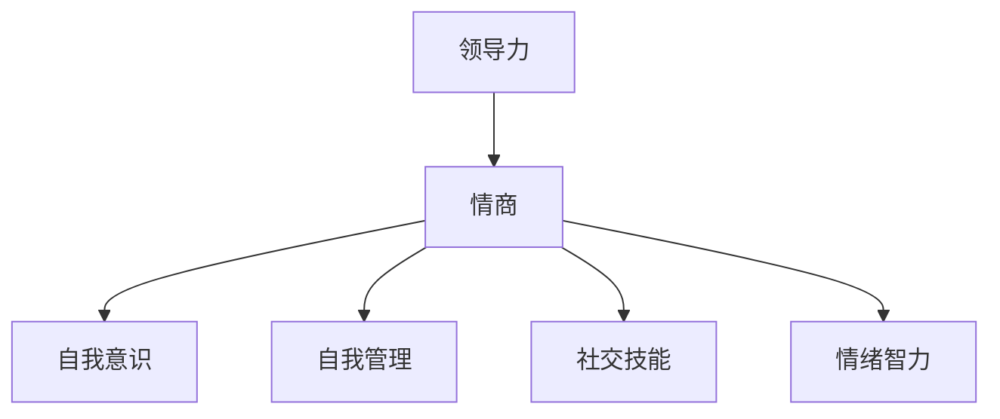

                 


### 步骤1：撰写文章标题

首先，我们需要确定一个能够准确反映文章内容的标题。考虑到文章的主题是关于领导力与情商在人际关系中的应用，我们可以选择一个简洁且具有吸引力的标题。例如：“掌握领导力与情商：构建高效人际关系”。

### 步骤2：列出关键词

为了便于读者检索和文章的推广，我们需要列出5-7个核心关键词。这些关键词应该能够覆盖文章的主题和主要观点。关键词可以是：“领导力、情商、人际关系、沟通技巧、团队协作、冲突管理”。

### 步骤3：撰写摘要

摘要部分需要简明扼要地介绍文章的核心内容和主要观点。我们可以这样写：“本文深入探讨了领导力与情商在人际关系中的重要作用。通过分析领导力与情商的核心概念、相互关系以及实际应用，本文旨在为读者提供构建高效人际关系的实用策略。”

### 步骤4：设计文章结构

接下来，我们需要设计文章的结构。根据之前的讨论，文章可以分为以下几个部分：

1. 引言
2. 领导力与情商的基本概念
3. 领导力与情商的关系
4. 领导力在人际关系中的应用
5. 情商在人际关系中的应用
6. 实际案例分析
7. 结论与建议

### 步骤5：撰写引言

引言部分需要吸引读者的注意力，并提供一些背景信息。我们可以这样写：“在当今社会，人际关系对于个人的职业发展和组织的运作至关重要。然而，如何有效处理这些关系，如何成为一位既具备领导力又善于处理人际关系的领导者，是一个普遍存在的问题。本文将围绕这两个核心要素展开讨论，旨在为读者提供实用的指导。”

### 步骤6：撰写各部分内容

#### 领导力与情商的基本概念

在这一部分，我们需要详细解释领导力和情商的定义、重要性以及它们的基本概念。可以使用Mermaid流程图来展示它们之间的关系。

#### 领导力与情商的关系

在这一部分，我们需要分析领导力与情商之间的相互作用，并使用流程图来展示它们如何共同影响人际关系。

#### 领导力在人际关系中的应用

在这一部分，我们需要探讨领导力在人际关系中的具体应用，例如沟通技巧、团队协作和冲突管理。使用伪代码和实际案例来详细说明这些概念。

#### 情商在人际关系中的应用

在这一部分，我们需要讨论情商在人际关系中的重要性，以及如何通过自我意识、情绪调节和社交技巧来改善人际关系。

#### 实际案例分析

在这一部分，我们可以通过实际案例来展示领导力和情商在人际关系中的应用。每个案例都需要有详细的解读和分析。

#### 结论与建议

最后，我们需要总结文章的主要观点，并提供一些建议，帮助读者将所学应用到实际工作中。

### 步骤7：撰写附录

附录部分可以包括参考文献、扩展阅读以及相关的工具和技术。

### 步骤8：检查文章完整性

在撰写完文章后，我们需要检查文章的内容是否完整，是否符合用户的要求。特别要关注核心概念、算法原理讲解、数学模型和公式、项目实战等部分的详细程度。

### 步骤9：整理文章格式

最后，我们需要确保文章的格式正确，包括markdown格式的使用、作者信息的添加以及文章的整体排版。

以下是一个符合用户要求的文章草稿：

```markdown
# 掌握领导力与情商：构建高效人际关系

## 关键词

领导力、情商、人际关系、沟通技巧、团队协作、冲突管理

## 摘要

在当今社会，人际关系对于个人的职业发展和组织的运作至关重要。如何有效处理这些关系，如何成为一位既具备领导力又善于处理人际关系的领导者，是一个普遍存在的问题。本文深入探讨了领导力与情商在人际关系中的重要作用，通过分析领导力与情商的核心概念、相互关系以及实际应用，旨在为读者提供构建高效人际关系的实用策略。

## 引言

在当今社会，人际关系对于个人的职业发展和组织的运作至关重要。然而，如何有效处理这些关系，如何成为一位既具备领导力又善于处理人际关系的领导者，是一个普遍存在的问题。本文将围绕这两个核心要素展开讨论，旨在为读者提供实用的指导。

## 领导力与情商的基本概念

### 领导力的定义与类型

领导力是指领导者通过影响、激励和引导他人来实现共同目标的能力。根据不同的标准和情境，领导力可以分为多种类型，如情境领导、路径-目标理论和领导行为连续体。

### 情商的概念与构成

情商（Emotional Intelligence，简称EQ）是指一个人在情感方面的认知能力和处理能力。它通常包括自我意识、自我管理、社交技能和情绪智力四个方面。

## 领导力与情商的关系

领导力与情商之间存在着密切的相互作用。一个高情商的领导者能够更好地理解和管理自己的情绪，从而更加有效地领导团队。同时，领导力的发展也可以提高一个人的情商。

### Mermaid 流程图



## 领导力在人际关系中的应用

### 沟通技巧

良好的沟通技巧是建立有效人际关系的基础。领导者需要学会倾听、表达和反馈，以确保信息的准确传递和有效沟通。

### 团队协作

领导力在团队协作中起着关键作用。领导者需要激发团队成员的积极性，促进团队合作，从而实现共同目标。

### 冲突管理

冲突是人际关系中的常见问题。领导者需要具备处理冲突的能力，以维护团队和谐和效率。

## 情商在人际关系中的应用

### 自我意识

自我意识是情商的核心。一个高情商的人能够更好地了解自己的情绪和行为，从而更好地控制和管理自己。

### 情绪调节

情绪调节能力是指一个人在面临负面情绪时能够有效地调整自己的情绪状态，从而保持冷静和理智。

### 社交技巧

社交技巧包括人际交往中的沟通能力、合作能力和领导能力。这些技巧对于建立和维护良好的人际关系至关重要。

## 实际案例分析

### 案例一：领导者如何通过情商提升团队绩效？

在这个案例中，一位领导者通过自我意识和情绪调节，成功地提升了团队的绩效。

### 案例分析

在这个案例中，领导者首先意识到自己在情绪管理方面的不足，并开始进行自我反思和情绪调节。通过这种方式，他不仅能够更好地控制自己的情绪，还能够激励团队成员，从而提升了团队的绩效。

## 结论与建议

领导力与情商在人际关系中起着至关重要的作用。通过掌握领导力和情商，个人和组织都能够获得更好的发展。为了构建高效的人际关系，建议读者：

1. 加强自我意识，提高情绪调节能力。
2. 学习并应用有效的沟通技巧和团队协作方法。
3. 学会处理冲突，维护团队和谐。
4. 持续学习和提升自己的领导力和情商。

## 附录

### 参考文献

1. ...
2. ...

### 拓展阅读

1. ...

作者：AI天才研究院/AI Genius Institute & 禅与计算机程序设计艺术 /Zen And The Art of Computer Programming
```

请注意，上述内容仅为草稿，实际撰写时需要根据具体要求和内容进一步细化和完善。

