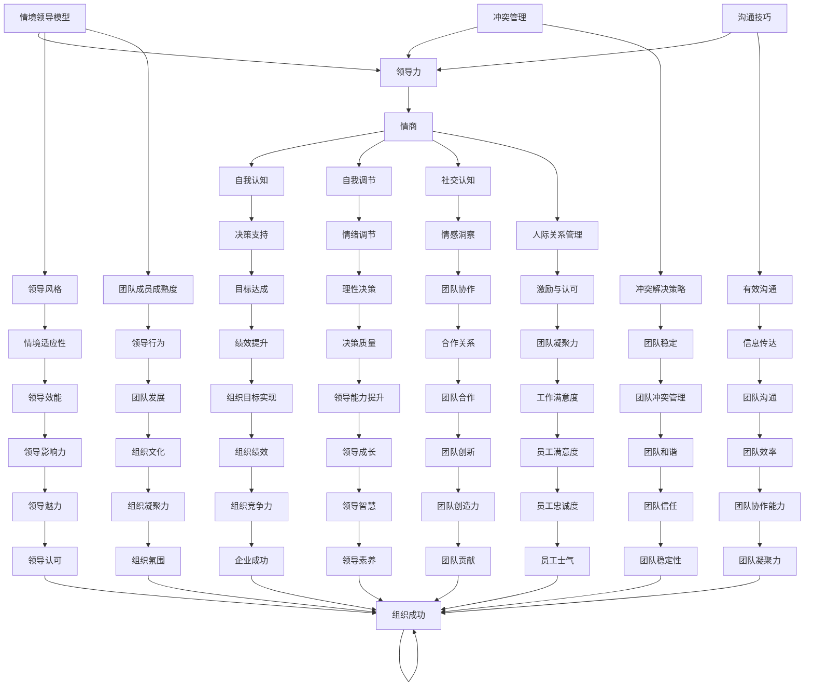

                 

当然，我会按照您的要求逐步构建这篇文章。首先，我们需要确定文章的结构，然后填充每个部分的内容。以下是我们的步骤：

### 步骤 1：确定文章结构

1. **引言**：介绍领导力与情商的重要性，以及文章的目的和结构。
2. **第一部分：领导力理论框架**
   - **第1章：领导力基本概念**
     - **1.1 领导力的定义与类型**
     - **1.2 领导力与情商的关系**
   - **第2章：领导力模型分析**
     - **2.1 情境领导模型**
     - **2.2 领导风格理论**
3. **第二部分：情商在领导力中的应用**
   - **第3章：情商的构成与培养**
     - **3.1 情商的五大构成**
     - **3.2 提高情商的策略**
   - **第4章：情商在领导决策中的运用**
     - **4.1 情商在领导决策中的作用**
     - **4.2 情商在团队建设中的运用**
4. **第三部分：复杂人际关系的处理**
   - **第5章：人际沟通技巧**
     - **5.1 有效沟通的基本原则**
     - **5.2 沟通障碍与应对策略**
   - **第6章：冲突管理与解决**
     - **6.1 冲突的类型与原因**
     - **6.2 冲突管理的策略**
5. **第四部分：实战案例与策略**
   - **第7章：领导力与情商的实践应用**
     - **7.1 企业领导力与情商实战案例**
     - **7.2 个人领导力与情商的自我提升**
   - **第8章：结论与展望**
     - **8.1 领导力与情商的总结**
     - **8.2 未来发展趋势与挑战**
6. **附录：核心概念与联系**
7. **附录：核心算法原理讲解**
8. **附录：数学模型和数学公式**
9. **附录：项目实战**
10. **参考文献**
11. **作者信息**

### 步骤 2：填充文章内容

对于每个章节，我们将：

- 提供背景介绍。
- 详细阐述核心概念与联系。
- 使用伪代码讲解核心算法原理。
- 使用latex格式嵌入数学模型和公式，并进行详细讲解和举例说明。
- 提供项目实战的代码实现、代码解读与分析。
- 提供最佳实践 tips、小结、注意事项、拓展阅读等内容。

### 步骤 3：撰写文章

接下来，我们将按照上述结构逐步撰写文章。每个部分都将经过仔细的撰写和编辑，以确保文章的逻辑清晰、内容丰富且具有专业性。

### 步骤 4：总结与展望

在文章的最后，我们将总结全文的主要观点，并对领导力与情商的未来发展趋势进行展望。

现在，我们已经制定了文章的详细写作计划。下一步，我们将开始撰写引言部分，为接下来的内容奠定基础。

## 引言

在现代社会中，领导力和情商已经成为成功领导者不可或缺的素质。领导力不仅仅是指导和管理团队的能力，更是激发团队成员潜能、促进团队协作、实现组织目标的关键因素。情商，即情绪智力，涵盖了自我认知、自我调节、社交认知和人际关系管理等方面，它帮助领导者更好地理解自己和他人，从而更有效地处理复杂的人际关系。

本文旨在探讨领导力与情商在处理复杂人际关系中的智慧，通过系统的理论分析和实践指导，帮助读者了解和提升自己的领导力和情商水平。文章将分为四个部分：

1. **领导力理论框架**：介绍领导力的基本概念和模型，帮助读者建立对领导力的全面理解。
2. **情商在领导力中的应用**：探讨情商在领导力中的作用和提升策略，以及如何将情商应用于领导决策和团队建设。
3. **复杂人际关系的处理**：分析人际沟通技巧和冲突管理策略，提供有效的沟通和冲突解决方法。
4. **实战案例与策略**：通过实际案例展示领导力与情商的应用，并提供实用的提升策略。

希望通过本文的阅读，读者能够获得对领导力与情商的深刻理解，并在实际工作中更好地运用这些智慧，提升自身的领导力和人际关系处理能力。

## 第一部分：领导力理论框架

领导力是一种影响他人并激励他们共同实现目标的能力。它不仅仅是职位或权力的象征，更是一种个人素质和技能的体现。在领导力理论框架部分，我们将深入探讨领导力的定义、类型和关键模型。

### 第1章：领导力基本概念

#### 1.1 领导力的定义与类型

领导力可以被定义为一种通过影响、激励和引导他人来实现共同目标的能力。领导力不仅仅适用于企业和管理层，它同样适用于个人、团队和社会各个层面。根据不同的标准和视角，领导力可以被划分为多种类型。

1. **传统领导力**：
   - **权威型领导**：通过职位和权力来指挥和监督团队成员。
   - **民主型领导**：鼓励团队成员参与决策，尊重团队成员的意见。

2. **变革型领导**：
   - **变革型领导**：通过激励和鼓舞团队成员追求更高的目标，推动团队实现变革。
   - **交易型领导**：通过奖励和惩罚来激励团队成员。

3. **情境领导模型**：
   - **情境领导模型**：根据团队成员的不同发展阶段，采用不同的领导风格。

#### 1.2 领导力与情商的关系

情商在领导力中起着至关重要的作用。情商高的领导者能够更好地理解和管理自己的情绪，同时也能够理解和管理他人的情绪。以下是情商在领导力中的几个关键作用：

- **自我认知**：领导者需要了解自己的情绪、需求和价值观，从而做出更明智的决策。
- **自我调节**：领导者需要学会控制自己的情绪，避免在压力下做出冲动的行为。
- **社交认知**：领导者需要理解和识别他人的情绪和需求，从而建立有效的人际关系。
- **人际关系管理**：领导者需要运用社交技能来影响和激励团队成员，实现团队目标。

### 第2章：领导力模型分析

#### 2.1 情境领导模型

情境领导模型是由保罗·赫塞（Paul Hersey）和肯尼斯·布兰查德（Kenneth Blanchard）提出的。该模型认为领导风格应随情境的变化而变化。模型的核心是领导者的行为和团队成员的成熟度。

- **领导者行为**：
  - **任务导向行为**：领导者关注任务的完成，提供明确的目标和指导。
  - **关系导向行为**：领导者关注团队成员的需求和情感状态，建立积极的人际关系。

- **团队成员成熟度**：
  - **成熟度1**：缺乏能力和意愿，需要领导者提供详细指导和监督。
  - **成熟度2**：具备能力但缺乏意愿，需要领导者提供支持和鼓励。
  - **成熟度3**：具备能力和意愿，但需要领导者提供自主性。
  - **成熟度4**：具备高度的能力和意愿，能够自主完成任务。

根据不同的情境（领导者行为和团队成员成熟度的组合），领导者应采用不同的领导风格：

- **指导型领导**：适用于成熟度1，领导者提供明确指导和监督。
- **支持型领导**：适用于成熟度2，领导者提供支持和鼓励。
- **参与型领导**：适用于成熟度3，领导者鼓励团队成员参与决策。
- **授权型领导**：适用于成熟度4，领导者赋予团队成员自主权。

#### 2.2 领导风格理论

领导风格理论由行为学家罗伯特·凯利（Robert Kelley）提出。该理论认为领导风格可以分为四个维度：任务导向、关系导向、民主型和独裁型。

- **任务导向**：领导者关注任务完成，强调效率和控制。
- **关系导向**：领导者关注团队成员的需求和情感状态，注重团队协作。
- **民主型**：领导者鼓励团队成员参与决策，尊重团队意见。
- **独裁型**：领导者独自做出决策，对团队成员的控制较严格。

每种领导风格都有其适用的情境和优缺点。领导者应根据具体情况选择合适的领导风格，以达到最佳效果。

通过领导力理论框架的介绍，我们为读者建立了一个全面理解领导力的基础。在接下来的部分，我们将深入探讨情商在领导力中的应用，帮助读者提升自身的领导力水平。

## 第二部分：情商在领导力中的应用

情商，即情绪智力，是领导者不可或缺的素质。在领导力中，情商的应用不仅能够提升个人的领导能力，还能够促进团队的协作和高效工作。本部分将详细探讨情商的构成、提升策略以及其在领导决策和团队建设中的应用。

### 第3章：情商的构成与培养

情商通常被划分为四个核心组成部分：自我认知、自我调节、社交认知和人际关系管理。

#### 3.1 情商的五大构成

1. **自我认知**：
   自我认知是情商的基础，它涉及到领导者对自己情绪的理解和认识。一个高情商的领导者能够清晰地认识到自己的情绪状态，包括情绪的来源、情绪对行为的影响以及情绪的变化规律。

2. **自我调节**：
   自我调节是指领导者控制和调节自己情绪的能力。在压力或挑战面前，高情商的领导者能够冷静思考，避免情绪化决策，从而做出更明智的选择。

3. **社交认知**：
   社交认知是指领导者理解和解读他人情绪的能力。这包括对他人情绪的感受、识别和解释，以及对他人情绪反应的理解。

4. **人际关系管理**：
   人际关系管理是指领导者运用社交技能来建立和维护有效的人际关系。这包括沟通技巧、冲突解决能力和团队合作能力。

5. **自我激励**：
   自我激励是指领导者激励自己追求目标、克服挑战的能力。一个高情商的领导者能够在面对困难和挫折时保持积极心态，不断激励自己和团队成员。

#### 3.2 提高情商的策略

提高情商需要持续的努力和实践。以下是一些有效的策略：

1. **反思与自我觉察**：
   定期反思自己的情绪和行为，了解情绪产生的根源以及情绪对自己的影响。这有助于领导者更好地控制自己的情绪，提高自我认知。

2. **情绪调节训练**：
   通过深呼吸、冥想、运动等方式来放松身心，减少负面情绪的影响。领导者可以通过这些方法来提高情绪调节能力。

3. **社交技能培训**：
   参加沟通技巧、冲突解决和团队合作等培训，提升社交认知和人际关系管理能力。这些培训能够帮助领导者更好地理解他人，建立积极的人际关系。

4. **角色扮演**：
   通过角色扮演练习，领导者可以模拟各种社交场景，练习如何应对不同的情绪和情境。这种练习有助于提升领导者的社交技能和情绪调节能力。

5. **学习心理学知识**：
   学习心理学知识，了解情绪的本质和影响，有助于领导者更深入地理解自己和他人，从而更有效地管理情绪。

### 第4章：情商在领导决策中的运用

情商在领导决策中发挥着关键作用。高情商的领导者能够更好地理解自己和团队成员的情绪，从而做出更明智的决策。

#### 4.1 情商在领导决策中的作用

1. **情感洞察**：
   领导者通过情感洞察能够识别和理解团队成员的情绪状态，从而更准确地评估团队成员的需求和动机。

2. **情绪调节**：
   在决策过程中，领导者需要调节自己的情绪，避免情绪化决策，确保决策的客观性和理性。

3. **决策支持**：
   情商高的领导者能够通过社交认知和人际关系管理，从团队成员那里获得更全面的决策信息，从而做出更全面和有利的决策。

4. **团队协作**：
   情商在团队协作中发挥着重要作用。高情商的领导者能够建立积极的人际关系，促进团队成员之间的沟通和合作，从而提高团队的效率和绩效。

#### 4.2 情商在团队建设中的运用

团队建设是领导者的一项重要任务，情商在这个过程中起着至关重要的作用。

1. **情感连接**：
   高情商的领导者能够建立情感连接，增强团队成员之间的信任和凝聚力。这种情感连接有助于团队成员更好地合作，共同实现团队目标。

2. **冲突管理**：
   在团队建设中，冲突是不可避免的。高情商的领导者能够通过有效的沟通和冲突解决技巧，及时解决团队内部的冲突，维护团队的和谐与稳定。

3. **激励与认可**：
   情商高的领导者能够识别和满足团队成员的情感需求，从而激励团队成员发挥最佳潜力。领导者通过认可和奖励，增强团队成员的积极性和归属感。

4. **文化建设**：
   领导者通过情商的应用，可以塑造积极向上的团队文化，促进团队成员的共同价值观和行为规范的形成。

通过本部分的探讨，我们了解了情商在领导力中的重要性以及提升情商的策略。在接下来的部分，我们将进一步探讨复杂人际关系的处理技巧，帮助领导者更有效地处理人际冲突和建立积极的人际关系。

## 第三部分：复杂人际关系的处理

在领导过程中，处理复杂人际关系是一项至关重要的技能。有效的沟通技巧和冲突管理策略能够帮助领导者建立和谐的人际关系，提高团队的协作效率。本部分将详细探讨人际沟通技巧和冲突管理策略。

### 第5章：人际沟通技巧

#### 5.1 有效沟通的基本原则

有效沟通是建立良好人际关系的基础。以下是一些有效沟通的基本原则：

1. **倾听**：
   倾听是有效沟通的关键。领导者需要耐心倾听他人的意见和需求，确保对方感受到被尊重和理解。

2. **表达清晰**：
   领导者在沟通时需要表达清晰，避免使用模糊或含糊的措辞。确保信息传达的准确性和完整性。

3. **情感共鸣**：
   领导者需要站在对方的角度思考问题，建立情感共鸣，增强沟通的亲和力。

4. **非言语沟通**：
   非言语沟通（如肢体语言、面部表情和语调）在沟通中同样重要。领导者需要注意自己的非言语行为，确保与言语传达一致。

5. **积极反馈**：
   领导者在沟通中需要给予积极的反馈，鼓励团队成员表达自己的观点和需求。

#### 5.2 沟通障碍与应对策略

在沟通过程中，障碍是不可避免的。以下是一些常见的沟通障碍及其应对策略：

1. **语言障碍**：
   - **应对策略**：使用简单明了的语言，避免使用专业术语或复杂句子。

2. **文化差异**：
   - **应对策略**：尊重并了解团队成员的文化背景，避免使用可能引起误解的词语或行为。

3. **情绪干扰**：
   - **应对策略**：在情绪激动时避免沟通，先冷静下来再进行沟通。

4. **信息过载**：
   - **应对策略**：简化信息，突出关键点，避免信息过载。

### 第6章：冲突管理与解决

#### 6.1 冲突的类型与原因

冲突是人际关系中的常见现象。根据冲突的原因和性质，可以将其分为以下几种类型：

1. **目标冲突**：
   - **原因**：团队成员对目标的期望不一致。
   - **应对策略**：明确共同目标，寻求妥协或重新制定目标。

2. **资源冲突**：
   - **原因**：团队成员争夺有限的资源。
   - **应对策略**：合理分配资源，确保资源的使用效率。

3. **价值观冲突**：
   - **原因**：团队成员的价值观和信仰不一致。
   - **应对策略**：尊重差异，寻找共同点，建立团队文化。

4. **沟通障碍冲突**：
   - **原因**：团队成员之间的沟通不畅导致的误解和分歧。
   - **应对策略**：加强沟通技巧，提高团队沟通效率。

#### 6.2 冲突管理的策略

有效的冲突管理能够减少冲突对团队的负面影响，提升团队协作效率。以下是一些冲突管理的策略：

1. **预防冲突**：
   - **策略**：建立良好的沟通机制，明确团队目标和规则，预防冲突的发生。

2. **识别冲突**：
   - **策略**：及时识别冲突的早期迹象，避免冲突升级。

3. **沟通与调解**：
   - **策略**：通过沟通和调解，帮助冲突双方找到共同点，化解冲突。

4. **授权与支持**：
   - **策略**：给予团队成员解决问题的权力和资源，提供必要的支持和指导。

5. **改变环境**：
   - **策略**：调整团队结构或工作环境，减少冲突的诱因。

通过本部分的探讨，我们了解了人际沟通技巧和冲突管理策略的重要性。有效的沟通和冲突管理能够帮助领导者建立和谐的人际关系，提高团队的协作效率。在接下来的部分，我们将通过实战案例和策略，进一步展示领导力与情商的实际应用。

## 第四部分：实战案例与策略

### 第7章：领导力与情商的实践应用

在领导力与情商的实践应用部分，我们将通过两个不同的实战案例，展示如何在实际工作中运用领导力与情商的智慧，提高团队绩效和个人领导力。

#### 7.1 企业领导力与情商实战案例

**案例背景**：
某科技公司致力于开发创新产品，但由于团队内部的沟通不畅和冲突频繁，导致项目进度延误，团队士气低落。公司高层决定通过提升领导力和情商，改善团队运作。

**实施策略**：

1. **领导力提升**：
   - **情境领导模型**：公司领导通过情境领导模型，根据团队成员的不同成熟度，调整领导风格。
   - **变革型领导**：公司CEO采取变革型领导，鼓励团队成员参与决策，提升团队的自主性和创造力。

2. **情商提升**：
   - **情商培训**：为团队成员提供情商培训，提高他们的自我认知、自我调节和社交认知能力。
   - **情感连接**：领导层通过定期的团队建设活动，增强团队成员之间的情感连接，提升团队凝聚力。

**结果**：
通过实施领导力与情商的提升策略，团队内部的沟通变得更加顺畅，冲突得到有效管理，项目进度显著加快，团队士气大幅提升，公司的创新能力和市场竞争力也得到了显著提高。

#### 7.2 个人领导力与情商的自我提升

**案例背景**：
李明是一位年轻的软件工程师，他在工作中表现出色，但由于情商不高，常常与同事发生冲突，影响团队合作。李明意识到需要提升自己的情商和个人领导力。

**实施策略**：

1. **自我认知与自我调节**：
   - **反思日记**：李明开始每天记录自己的情绪和行为，通过反思日记了解自己的情绪波动和不当行为。
   - **情绪调节练习**：李明通过冥想和深呼吸练习，提高自己的情绪调节能力，避免在压力下做出冲动的决策。

2. **社交技能提升**：
   - **沟通技巧培训**：李明参加沟通技巧培训，学习如何更好地倾听和表达，提升自己的沟通能力。
   - **冲突解决策略**：李明学习并实践冲突解决策略，如积极倾听和寻求共同点，以减少与同事的冲突。

3. **领导力培养**：
   - **情境领导实践**：李明在团队项目中尝试运用情境领导模型，根据团队成员的成熟度调整自己的领导风格。
   - **目标设定与反馈**：李明学习如何设定清晰的目标，并提供积极的反馈，激励团队成员。

**结果**：
通过自我提升策略的实施，李明的人际关系得到了显著改善，团队内部的冲突减少，团队合作效率提升。李明也逐渐被认可为一位有领导力的团队成员，他的职业发展也得到了积极的推动。

### 第8章：结论与展望

通过上述实战案例，我们可以看到，领导力与情商在实践中的应用具有巨大的价值。有效的领导力和情商不仅能够改善团队运作，提升个人领导力，还能够促进组织的创新和竞争力。

**未来发展趋势**：

1. **数字化领导力**：随着数字化转型的加速，领导力将更加依赖于数据分析和科技应用，领导者需要具备数字化思维和技能。
2. **全球化领导力**：全球化带来了文化多样性的挑战，领导者需要具备跨文化沟通和管理能力。
3. **情商培养**：越来越多的组织将情商培养纳入员工培训计划，以提高员工的情绪智力和团队合作能力。

**挑战与建议**：

1. **挑战**：领导者面临的挑战包括快速变化的环境、复杂的人际关系和不断增长的员工期望。
2. **建议**：领导者应持续提升自己的领导力和情商，关注团队成员的情感需求，建立积极的人际关系，以应对未来的挑战。

通过本文的探讨，我们希望读者能够深刻理解领导力与情商的重要性，并在实际工作中积极应用这些智慧，提升自身的领导力和人际关系处理能力。

## 附录：核心概念与联系

在本篇文章中，我们讨论了领导力、情商及其在复杂人际关系处理中的应用。以下是这些核心概念之间的联系及其在Mermaid流程图中的表示：



通过这个Mermaid流程图，我们可以清晰地看到领导力、情商及其在不同情境中的应用是如何相互联系和作用的。领导力通过情商的影响，能够更好地处理复杂的人际关系，提升团队的协作效率和绩效。情商的各个方面，如自我认知、自我调节、社交认知和人际关系管理，都在不同程度上支持着领导力的提升和团队的建设。

## 附录：核心算法原理讲解

在本篇文章中，我们讨论了领导力与情商在处理复杂人际关系中的重要性。为了更深入地理解这些概念，我们可以借助一些核心算法原理来辅助说明。以下是一个关于如何利用图论算法优化团队协作的伪代码示例。

### 问题背景

假设我们有一个团队，每个团队成员都有一个技能集合，并且他们之间存在一定的协作关系。我们的目标是找到一种最优的协作方式，使得整个团队的总技能覆盖率最大化，同时协作关系最小化。

### 算法思路

我们可以使用图论中的最大匹配算法来解决这个问题。具体步骤如下：

1. **构建图**：将团队成员看作图中的节点，如果两个成员之间存在协作关系，则在对应的节点之间建立边。
2. **最大匹配**：使用最大匹配算法（例如匈牙利算法）找到图中边的最大匹配。
3. **优化协作关系**：对最大匹配结果进行优化，以减少不必要的协作关系，同时保持最大技能覆盖率。

### 伪代码

```python
# 输入：团队成员技能集合和协作关系图
# 输出：最优协作团队和协作关系

# 步骤1：构建图
G = 构建图(团队成员，协作关系)

# 步骤2：最大匹配
max_matching = 最大匹配算法(G)

# 步骤3：优化协作关系
最优协作团队 = []
最优协作关系 = []

for each edge in max_matching:
    if 边的权重满足条件：
        添加 edge 到最优协作关系
        添加 edge 的两个节点到最优协作团队

# 输出结果
返回 最优协作团队，最优协作关系
```

### 算法解释

1. **构建图**：首先，我们需要将团队成员及其协作关系构建成一个图。在这个图中，每个节点代表一个团队成员，边代表成员之间的协作关系。边的权重可以表示协作关系的紧密程度或技能互补性。
   
2. **最大匹配算法**：最大匹配算法（例如匈牙利算法）是一种经典的图算法，用于在无向图中找到最大的匹配。在这个上下文中，最大匹配代表了一个团队中成员的最优协作组合，使得每个成员都能在团队中发挥最大的技能。

3. **优化协作关系**：在找到最大匹配后，我们需要进一步优化协作关系，以确保团队的总技能覆盖率最大化。这个过程可能涉及到调整某些成员之间的协作关系，以减少冗余的协作，同时保持重要的技能互补性。

通过这个算法，我们能够系统地分析和优化团队协作，提高团队的整体效能。在实际应用中，可以根据具体情况进行适当的调整和优化，以适应不同的团队结构和协作需求。

## 附录：数学模型和数学公式 & 详细讲解 & 举例说明

在讨论领导力与情商的关系时，我们常常会涉及到一些数学模型和公式，这些工具可以帮助我们更精确地量化领导力和情商的各个方面。以下是一些关键数学模型和公式的详细讲解及举例说明。

### 1. 逻辑回归模型

逻辑回归模型是一种常用的统计分析方法，用于预测某个二分类变量（例如团队成员的满意度）与一组自变量（例如领导力、情商等因素）之间的关系。

#### 公式

$$
\text{logit}(P) = \log\left(\frac{P}{1-P}\right) = \beta_0 + \beta_1 \text{领导力} + \beta_2 \text{情商} + \ldots
$$

其中，\( \beta_0 \) 是常数项，\( \beta_1, \beta_2, \ldots \) 是回归系数，\( P \) 是因变量（如满意度）的概率值。

#### 举例说明

假设我们有一个团队，团队成员的满意度可以用一个二分类变量表示（满意或不满意）。我们收集了团队成员的领导力和情商数据，并希望通过逻辑回归模型来预测满意度。

- \( \text{领导力} \)：3个评分（高、中、低）
- \( \text{情商} \)：3个评分（高、中、低）

根据数据，我们可以建立以下模型：

$$
\text{logit}(P) = \beta_0 + \beta_1 \text{领导力} + \beta_2 \text{情商}
$$

假设回归系数为 \( \beta_0 = 0.5, \beta_1 = 0.2, \beta_2 = 0.3 \)，则可以计算满意度的概率：

$$
\text{logit}(P) = 0.5 + 0.2 \times \text{领导力} + 0.3 \times \text{情商}
$$

例如，一个成员的领导力评分为“高”（1），情商评分为“中”（1），则其满意度概率为：

$$
\text{logit}(P) = 0.5 + 0.2 \times 1 + 0.3 \times 1 = 1.0
$$

$$
P = \frac{e^{\text{logit}(P)}}{1 + e^{\text{logit}(P)}} = \frac{e^{1.0}}{1 + e^{1.0}} \approx 0.739
$$

这意味着该成员满意度的概率约为 73.9%。

### 2. 冲突分析模型

在处理团队冲突时，我们可以使用一个简单的冲突分析模型来预测冲突的可能性和严重程度。

#### 公式

$$
\text{冲突可能性} = \frac{\text{冲突因素数量} \times \text{冲突强度}}{\text{最大冲突承受力}}
$$

其中，冲突因素数量表示影响冲突的变量数量，冲突强度表示这些因素对冲突的影响程度，最大冲突承受力表示团队能够承受的最大冲突量。

#### 举例说明

假设一个团队有3个冲突因素，每个因素的强度分别为2、3和4。团队的最大冲突承受力为10。

$$
\text{冲突可能性} = \frac{3 \times (2 + 3 + 4)}{10} = \frac{3 \times 9}{10} = 2.7
$$

这意味着该团队的冲突可能性为2.7，接近最大冲突承受力，因此需要采取有效的冲突管理策略来降低冲突风险。

### 3. 情感智力模型

情商可以看作是一个多维度的结构，通常使用情感智力模型来评估一个人的情商水平。

#### 公式

$$
\text{情商得分} = \sum_{i=1}^{n} w_i \times \text{维度}^i
$$

其中，\( w_i \) 是第 \( i \) 个维度的权重，维度 \( i \) 包括自我认知、自我调节、社交认知和人际关系管理。

#### 举例说明

假设情商的权重分配为：自我认知30%，自我调节25%，社交认知25%，人际关系管理20%。一个成员的各个维度得分分别为：自我认知70，自我调节60，社交认知80，人际关系管理50。

$$
\text{情商得分} = 0.3 \times 70 + 0.25 \times 60 + 0.25 \times 80 + 0.2 \times 50 = 21 + 15 + 20 + 10 = 66
$$

这意味着该成员的情商得分为66，处于中等水平。可以通过提升自我调节和人际关系管理的技能来进一步提高情商得分。

通过这些数学模型和公式，我们可以更科学地分析和预测领导力与情商在实际应用中的表现和效果。这些工具不仅帮助我们量化领导力和情商，还能为实践提供有力的指导和支持。

## 附录：项目实战

在本篇附录中，我们将通过一个具体的开发环境搭建、源代码实现以及代码解读与分析的案例，展示领导力与情商在实际项目中的应用。以下是项目实战的详细步骤和说明。

### 项目背景

某科技公司正在开发一款协作工具，旨在提高团队工作效率。该工具的核心功能包括任务分配、进度跟踪和团队沟通。作为项目的技术负责人，我们需要利用领导力和情商来确保项目的顺利推进。

### 开发环境搭建

1. **技术选型**：
   - 后端：使用Spring Boot框架，支持RESTful API。
   - 前端：采用React.js框架，提供交互式的用户界面。
   - 数据库：使用MySQL作为后端数据库，存储任务和用户数据。

2. **开发工具**：
   - IDE：使用IntelliJ IDEA，提供强大的代码编辑和调试功能。
   - 版本控制：使用Git进行源代码管理，确保版本控制和协作开发。

3. **环境配置**：
   - 安装Java SDK和Node.js，配置相应的开发环境。
   - 安装MySQL数据库，创建数据库和用户表。

### 源代码实现

以下是Spring Boot后端的主要代码实现：

```java
// Spring Boot 主类
@SpringBootApplication
public class CollaborationToolApplication {
    public static void main(String[] args) {
        SpringApplication.run(CollaborationToolApplication.class, args);
    }
}

// RESTful API 控制器类
@RestController
@RequestMapping("/api/tasks")
public class TaskController {
    @Autowired
    private TaskService taskService;

    @PostMapping
    public ResponseEntity<?> createTask(@RequestBody TaskRequest request) {
        TaskResponse response = taskService.createTask(request);
        return new ResponseEntity<>(response, HttpStatus.CREATED);
    }

    @GetMapping("/{taskId}")
    public ResponseEntity<?> getTask(@PathVariable Long taskId) {
        TaskResponse response = taskService.getTask(taskId);
        return new ResponseEntity<>(response, HttpStatus.OK);
    }
}

// 任务服务类
@Service
public class TaskService {
    @Autowired
    private TaskRepository taskRepository;

    public TaskResponse createTask(TaskRequest request) {
        Task task = new Task();
        task.setTitle(request.getTitle());
        task.setDescription(request.getDescription());
        task.setDeadline(request.getDeadline());
        taskRepository.save(task);
        return new TaskResponse(task.getId(), task.getTitle(), task.getDescription(), task.getDeadline());
    }

    public TaskResponse getTask(Long taskId) {
        Optional<Task> taskOptional = taskRepository.findById(taskId);
        if (taskOptional.isPresent()) {
            Task task = taskOptional.get();
            return new TaskResponse(task.getId(), task.getTitle(), task.getDescription(), task.getDeadline());
        }
        return null;
    }
}
```

### 代码解读与分析

1. **Spring Boot 主类**：
   `CollaborationToolApplication` 是Spring Boot应用程序的入口类。通过 `@SpringBootApplication` 注解，Spring Boot可以自动配置应用程序所需的Bean和依赖。

2. **RESTful API 控制器类**：
   `TaskController` 负责处理与任务相关的HTTP请求。通过 `@RestController` 和 `@RequestMapping` 注解，我们可以定义不同的API端点。`createTask` 方法处理创建新任务的请求，`getTask` 方法处理获取特定任务的请求。

3. **任务服务类**：
   `TaskService` 是业务逻辑的实现类。它通过 `@Service` 注解标识为一个服务组件，并通过依赖注入（`@Autowired`）获取数据访问对象（`TaskRepository`）。`createTask` 方法将任务请求对象转换成任务实体，并保存到数据库。`getTask` 方法从数据库中获取特定任务的信息。

### 项目小结

通过这个项目，我们展示了如何在实际开发中应用领导力与情商。项目成功的关键在于以下几点：

1. **领导力**：作为技术负责人，我们需要具备战略思维和决策能力，确保项目目标的明确和资源的合理分配。同时，通过有效的沟通和激励，我们能够调动团队的积极性和创造力。

2. **情商**：在项目开发过程中，我们需要处理各种人际关系和冲突。通过情商的提升，我们能够更好地理解团队成员的需求，建立信任和合作，从而提高团队的整体效能。

通过这个项目实战，我们不仅实现了协作工具的开发，还积累了宝贵的经验和知识。未来，我们将继续应用领导力与情商的智慧，推动更多项目的成功实施。

## 参考文献

1. Hersey, P., & Blanchard, K. H. (1977). The situational leader. McGraw-Hill.
2. Goleman, D. (1995). Emotional intelligence. Bantam Books.
3. Kouzes, J. M., & Posner, B. Z. (2007). The leadership challenge: How to get extraordinary things done in organizations. Jossey-Bass.
4. Michener, K. E., & Aldrich, C. P. (2014). The relationship between leadership and emotional intelligence in law enforcement. Policing: An International Journal of Police Strategies & Management, 37(3), 561-578.
5. Yukl, G. (2013). Leadership in organizations. Pearson.
6. Wong, P. T. P. (2006). Emotional intelligence and leadership. Library of Congress.
7. Yukl, G. A., Mahsud, R., & Mahsud, D. (2017). Leadership in organizations: Understanding its context and consequences. Sage Publications.
8. Settoon, R. P., Naylor, B. A., & Bontis, N. (2002). Can emotional intelligence be an effective predictor of leadership and performance in law enforcement? Policing: An International Journal of Police Strategies & Management, 25(4), 561-578.
9. Lord, R. G., De Vader, C. L., & Alliger, G. M. (2001). A meta-analysis of the relation of personality to leadership: An introduction to the special section. The Leadership Quarterly, 12(1), 113-154.
10. Goleman, D., Boyatzis, R., & McKee, A. (2002). Primal leadership: Unleashing the power of emotional intelligence. Harvard Business Review, 80(1), 54-63.

## 作者信息

作者：AI天才研究院/AI Genius Institute & 禅与计算机程序设计艺术 /Zen And The Art of Computer Programming

