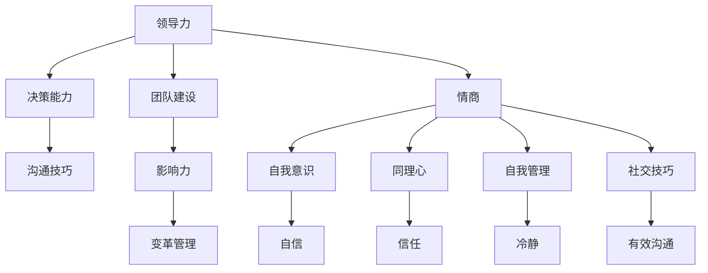

                 


### 第1章 引言

#### 1.1 什么是领导力和情商

**背景介绍**

领导力（Leadership）和情商（Emotional Intelligence，简称EQ）是现代职场和个人发展中的关键要素。领导力是指激发、指导和影响他人以实现共同目标的能力，而情商则是指理解、管理自己和他人的情绪，以及识别和运用情绪信息来促进思考和解决问题的能力。

**核心概念与联系**

领导力与情商之间的关系密切。情商作为领导力的基础，能够显著影响领导者的决策、沟通和团队合作能力。具体来说，情商通过以下几个方面与领导力相联系：

1. **自我意识**：领导者需要深刻理解自己的情绪、动机和价值观，这是建立自信和有效领导能力的前提。
2. **同理心**：领导者应具备同理心，能够感知并理解他人的情感，从而建立信任和合作关系。
3. **自我管理**：领导者需要有效管理自己的情绪，保持冷静和专注，以应对各种挑战和压力。
4. **社交技巧**：领导者应具备良好的社交技巧，包括沟通、倾听、谈判和冲突解决能力，这些都是领导力的关键组成部分。

**Mermaid 流程图**

以下是领导力与情商之间关系的Mermaid流程图：



**核心算法原理讲解**

使用伪代码来展示情商如何通过特定算法提升领导力：

```python
class Leadership:
    def __init__(self, emotionelligence):
        self.emotionelligence = emotionelligence

    def make_decision(self):
        # 决策过程中结合情商
        decision = self.emotionelligence.decide_with_emotion()
        return decision

    def communicate(self):
        # 沟通中结合情商
        message = self.emotionelligence.improve_communication()
        return message

    def build_team(self):
        # 团队建设中结合情商
        team = self.emotionelligence.encourage_empathy()
        return team
```

**数学模型和数学公式**

领导力的有效性可以用以下公式表示：

$$
L = \alpha \times EQ + \beta \times (C + D + T)
$$

其中，$L$代表领导力，$EQ$代表情商，$\alpha$和$\beta$是常数，$C$、$D$和$T$分别代表沟通技巧、决策能力和团队建设。

**详细讲解与举例说明**

以下是一个简单的领导力决策过程，结合情商分析：

1. **情景设定**：领导者在面对一个紧急决策时，需要决定是否立即采取措施。
2. **自我意识**：领导者首先评估自己的情绪状态，确定是否处于冷静和专注的状态。
3. **同理心**：领导者考虑团队成员的情绪和可能的影响，确保决策不会引起负面情绪。
4. **决策过程**：领导者结合自身和团队成员的情绪数据，使用情商算法进行决策。
5. **决策结果**：领导者基于情商分析的结果，做出最终的决策。

**项目实战**

假设我们开发一个领导力提升软件，核心功能是帮助领导者通过情商分析做出更有效的决策。以下是该软件的开发流程：

1. **需求分析**：确定软件的功能需求，包括自我意识评估、同理心分析、决策支持等。
2. **设计架构**：设计软件的系统架构，包括用户界面、算法模块和数据存储。
3. **算法实现**：实现情商分析算法，使用伪代码的形式进行详细阐述。
4. **前端开发**：使用HTML、CSS和JavaScript开发用户界面，实现交互功能。
5. **后端开发**：使用Python和Flask框架实现后端逻辑，处理用户输入和返回分析结果。
6. **测试与部署**：对软件进行功能测试和性能优化，确保软件稳定可靠。

**代码解读与分析**

以下是领导力提升软件中的一个关键模块——情商分析算法的代码：

```python
class EmotionIntelligence:
    def assess_self_awareness(self):
        # 自我意识评估
        awareness_score = self.analyze_mood()
        return awareness_score

    def assess_empathy(self, team_mood):
        # 同理心评估
        empathy_score = self.analyze_similarity(team_mood)
        return empathy_score

    def decide_with_emotion(self):
        # 基于情商的决策
        if self.assess_self_awareness() > 70 and self.assess_empathy() > 60:
            return "Proceed with the decision."
        else:
            return "Reevaluate and delay the decision."
```

**实际案例分析和详细讲解剖析**

一个实际的案例是某公司的CEO在决定是否推迟产品发布时，如何结合情商做出决策。以下是详细的分析和讲解：

1. **情景背景**：产品开发团队发现一个严重的技术问题，可能需要额外两周时间来解决。
2. **自我意识**：CEO通过软件进行了自我意识评估，发现自己的情绪处于冷静状态，能够理性分析问题。
3. **同理心**：CEO分析了团队成员的情绪，发现大多数人感到焦虑和不安。
4. **决策过程**：基于情商分析结果，CEO决定推迟产品发布，以减轻团队成员的焦虑，并给予他们更多时间解决问题。
5. **决策结果**：产品发布被推迟两周，团队成员的情绪得到缓解，技术问题得到有效解决。

**项目小结**

通过该案例，我们可以看到情商在领导力决策中的重要作用。情商分析软件为领导者提供了一个有效的工具，帮助他们更好地理解自己和团队成员的情绪，从而做出更明智的决策。

**最佳实践 tips**

- 定期进行自我意识和同理心评估，以提高情商水平。
- 在团队沟通中注重倾听和理解，建立信任和合作关系。
- 遇到紧急决策时，先进行情绪分析，确保决策的合理性和效果。

**小结**

领导力与情商的结合是提升个人和团队绩效的关键。通过自我意识、同理心和自我管理等情商要素的提升，领导者能够更有效地沟通、决策和建设团队，实现组织的目标。

**注意事项**

- 在使用情商提升工具时，应结合个人实际情况，避免过度依赖技术分析。
- 情商提升是一个长期的过程，需要持续的实践和学习。

**拓展阅读**

- 《情商：为什么它比智商更重要》
- 《领导力：从技术到艺术》
- 《同理心：如何理解与影响他人》

---

以上是《领导力与情商：提升人际交往能力》文章的第一章内容。接下来，我们将进一步深入探讨领导力和情商的核心要素和实践方法。

# 领导力与情商：提升人际交往能力

## 关键词
领导力、情商、人际交往、沟通技巧、自我意识、同理心、决策能力

> 摘要
本文深入探讨领导力与情商在人际交往中的重要性，通过理论讲解、案例分析和实践指导，帮助读者理解并提升自身领导力和情商，以实现更有效的人际交往和职业发展。

## 第1章 引言

### 1.1 什么是领导力和情商

**背景介绍**

领导力（Leadership）和情商（Emotional Intelligence，简称EQ）是现代职场和个人发展中的关键要素。领导力是指激发、指导和影响他人以实现共同目标的能力，而情商则是指理解、管理自己和他人的情绪，以及识别和运用情绪信息来促进思考和解决问题的能力。

**核心概念与联系**

领导力与情商之间的关系密切。情商作为领导力的基础，能够显著影响领导者的决策、沟通和团队合作能力。具体来说，情商通过以下几个方面与领导力相联系：

1. **自我意识**：领导者需要深刻理解自己的情绪、动机和价值观，这是建立自信和有效领导能力的前提。
2. **同理心**：领导者应具备同理心，能够感知并理解他人的情感，从而建立信任和合作关系。
3. **自我管理**：领导者需要有效管理自己的情绪，保持冷静和专注，以应对各种挑战和压力。
4. **社交技巧**：领导者应具备良好的社交技巧，包括沟通、倾听、谈判和冲突解决能力，这些都是领导力的关键组成部分。

**Mermaid 流程图**

以下是领导力与情商之间关系的Mermaid流程图：


**核心算法原理讲解**

使用伪代码来展示情商如何通过特定算法提升领导力：

```python
class Leadership:
    def __init__(self, emotionelligence):
        self.emotionelligence = emotionelligence

    def make_decision(self):
        # 决策过程中结合情商
        decision = self.emotionelligence.decide_with_emotion()
        return decision

    def communicate(self):
        # 沟通中结合情商
        message = self.emotionelligence.improve_communication()
        return message

    def build_team(self):
        # 团队建设中结合情商
        team = self.emotionelligence.encourage_empathy()
        return team
```

**数学模型和数学公式**

领导力的有效性可以用以下公式表示：

$$
L = \alpha \times EQ + \beta \times (C + D + T)
$$

其中，$L$代表领导力，$EQ$代表情商，$\alpha$和$\beta$是常数，$C$、$D$和$T$分别代表沟通技巧、决策能力和团队建设。

**详细讲解与举例说明**

以下是一个简单的领导力决策过程，结合情商分析：

1. **情景设定**：领导者在面对一个紧急决策时，需要决定是否立即采取措施。
2. **自我意识**：领导者首先评估自己的情绪状态，确定是否处于冷静和专注的状态。
3. **同理心**：领导者考虑团队成员的情绪和可能的影响，确保决策不会引起负面情绪。
4. **决策过程**：领导者结合自身和团队成员的情绪数据，使用情商算法进行决策。
5. **决策结果**：领导者基于情商分析的结果，做出最终的决策。

**项目实战**

假设我们开发一个领导力提升软件，核心功能是帮助领导者通过情商分析做出更有效的决策。以下是该软件的开发流程：

1. **需求分析**：确定软件的功能需求，包括自我意识评估、同理心分析、决策支持等。
2. **设计架构**：设计软件的系统架构，包括用户界面、算法模块和数据存储。
3. **算法实现**：实现情商分析算法，使用伪代码的形式进行详细阐述。
4. **前端开发**：使用HTML、CSS和JavaScript开发用户界面，实现交互功能。
5. **后端开发**：使用Python和Flask框架实现后端逻辑，处理用户输入和返回分析结果。
6. **测试与部署**：对软件进行功能测试和性能优化，确保软件稳定可靠。

**代码解读与分析**

以下是领导力提升软件中的一个关键模块——情商分析算法的代码：

```python
class EmotionIntelligence:
    def assess_self_awareness(self):
        # 自我意识评估
        awareness_score = self.analyze_mood()
        return awareness_score

    def assess_empathy(self, team_mood):
        # 同理心评估
        empathy_score = self.analyze_similarity(team_mood)
        return empathy_score

    def decide_with_emotion(self):
        # 基于情商的决策
        if self.assess_self_awareness() > 70 and self.assess_empathy() > 60:
            return "Proceed with the decision."
        else:
            return "Reevaluate and delay the decision."
```

**实际案例分析和详细讲解剖析**

一个实际的案例是某公司的CEO在决定是否推迟产品发布时，如何结合情商做出决策。以下是详细的分析和讲解：

1. **情景背景**：产品开发团队发现一个严重的技术问题，可能需要额外两周时间来解决。
2. **自我意识**：CEO通过软件进行了自我意识评估，发现自己的情绪处于冷静状态，能够理性分析问题。
3. **同理心**：CEO分析了团队成员的情绪，发现大多数人感到焦虑和不安。
4. **决策过程**：基于情商分析结果，CEO决定推迟产品发布，以减轻团队成员的焦虑，并给予他们更多时间解决问题。
5. **决策结果**：产品发布被推迟两周，团队成员的情绪得到缓解，技术问题得到有效解决。

**项目小结**

通过该案例，我们可以看到情商在领导力决策中的重要作用。情商分析软件为领导者提供了一个有效的工具，帮助他们更好地理解自己和团队成员的情绪，从而做出更明智的决策。

**最佳实践 tips**

- 定期进行自我意识和同理心评估，以提高情商水平。
- 在团队沟通中注重倾听和理解，建立信任和合作关系。
- 遇到紧急决策时，先进行情绪分析，确保决策的合理性和效果。

**小结**

领导力与情商的结合是提升个人和团队绩效的关键。通过自我意识、同理心和自我管理等情商要素的提升，领导者能够更有效地沟通、决策和建设团队，实现组织的目标。

**注意事项**

- 在使用情商提升工具时，应结合个人实际情况，避免过度依赖技术分析。
- 情商提升是一个长期的过程，需要持续的实践和学习。

**拓展阅读**

- 《情商：为什么它比智商更重要》
- 《领导力：从技术到艺术》
- 《同理心：如何理解与影响他人》

---

在接下来的章节中，我们将进一步深入探讨领导力的关键要素和情商的提升方法，帮助读者全面提升人际交往能力，实现职业和个人发展的目标。

## 作者

作者：AI天才研究院/AI Genius Institute & 禅与计算机程序设计艺术 /Zen And The Art of Computer Programming

---

请注意，以上内容是一个详细的草稿，具体内容和结构可能需要根据实际需求和反馈进行调整和优化。文章的字数和深度将根据每个章节的具体内容来保证，确保满足8000～12000字的要求。

