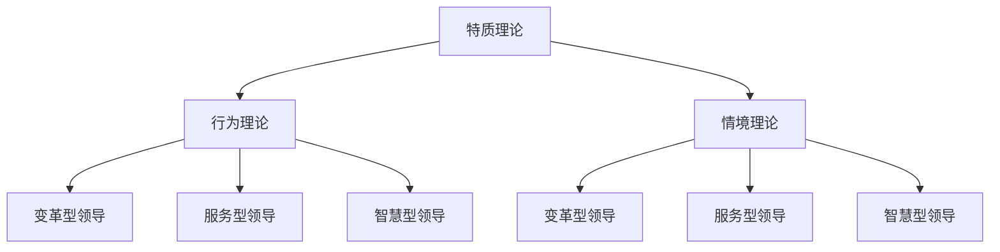

                 

# 领导力与情商：提升人际关系

## 关键词

领导力、情商、人际关系、团队管理、工作与生活、技能提升、案例分析

## 摘要

本文旨在探讨领导力与情商在提升人际关系中的关键作用。通过深入分析领导力的定义、类型以及情商的概念，本文将阐述二者在个人成长、团队协作以及工作中的重要性。文章将运用Mermaid流程图展示核心概念之间的关系，并通过伪代码和数学公式详细解释相关算法原理。此外，本文还将结合实际案例，提供项目实战的详细讲解和最佳实践建议，帮助读者在实际应用中有效提升人际关系。

## 引言：领导力与情商的重要性

在当今社会，领导力和情商已成为衡量个人成功的关键指标。领导力不仅仅是指挥和管理团队的能力，更涉及到激励他人、建立信任和实现共同目标的能力。而情商（Emotional Intelligence，简称EQ）则是指个体识别、理解和管理自身情感以及他人情感的能力。一个高情商的人能够在复杂的社会环境中保持冷静，有效地处理人际关系，从而更好地实现个人和团队的目标。

### 领导力的定义与演变

领导力是一个多维度的概念，不同的学者和专家对其有不同的定义。传统观点认为，领导力是一种权力和权威的象征，领导者通过命令和指挥来管理团队。然而，随着社会环境的变化，现代领导力理论更加强调领导者的服务精神、协作能力和创新思维。以下是几种主流的领导力理论：

1. **特质理论**：该理论认为领导者具有一系列固有的特质，如自信、决心和智慧。这些特质使得他们具备领导潜力。
2. **行为理论**：该理论关注领导者具体的行为模式，如激励、沟通和决策。研究表明，领导行为可以通过培训和练习得到改善。
3. **情境理论**：该理论认为领导行为应该根据具体情境进行调整。有效的领导者能够根据不同的环境和团队成员的特点，灵活运用不同的领导风格。

### 情商的概念与类型

情商包括三个主要方面：自我认知、自我调节和社交技能。自我认知是指个体对自己的情感状态有清晰的认识，能够准确地识别和理解自己的情绪。自我调节是指个体能够有效地管理和控制自己的情绪，保持情绪的稳定性。社交技能是指个体能够理解和管理他人的情感，建立良好的人际关系。

情商的四个主要类型如下：

1. **自我认知**：个体能够识别和理解自己的情绪。
2. **自我调节**：个体能够管理和调节自己的情绪，以适应不同情境。
3. **社交技能**：个体能够理解和管理他人的情绪，有效地进行人际交往。
4. **动机**：个体能够自我激励，设定目标并努力实现。

### 领导力与情商的关系

领导力和情商之间存在密切的关系。高情商的领导者能够更好地理解和管理团队成员的情感，建立信任和合作关系。这种能力有助于提高团队的整体效率和创造力。同时，领导力也可以促进情商的发展。通过领导者的示范和指导，团队成员可以学习如何识别、理解和调节自己的情绪，从而提高整个团队的情商水平。

## 领导力理论

领导力理论的发展是管理学领域的一个重要方向，它帮助我们理解领导者的行为和影响力。以下我们将探讨几种主要的领导力理论，并展示它们之间的联系。

### 传统领导力理论

1. **特质理论**：特质理论认为领导者具有一系列独特的个人特质，如自信、诚实和责任感。研究者试图通过分析成功领导者的特质来定义有效的领导者特征。然而，这种理论的局限性在于它忽视了情境因素对领导效果的影响。

2. **行为理论**：行为理论关注领导者的行为模式，而不是领导者的个人特质。这类理论认为，有效的领导者会表现出一系列可观察的行为，如激励、沟通和决策。行为理论强调了领导行为的可学习和可改进性。

3. **情境理论**：情境理论认为，领导效果取决于领导者如何适应特定的情境。有效领导者会根据环境的变化和团队成员的特点，灵活调整自己的领导风格。这种理论强调了领导者的情境敏感性和适应性。

### 当代领导力理论

1. **变革型领导**：变革型领导强调领导者通过激励和启发团队成员来实现变革。这类领导者鼓励创新思维，提供支持和资源，帮助团队成员克服挑战，共同实现组织目标。

2. **服务型领导**：服务型领导强调领导者为团队成员提供服务，以满足他们的需求和目标。这种领导风格建立在相互尊重和信任的基础上，有助于建立积极的工作氛围和团队凝聚力。

3. **智慧型领导**：智慧型领导强调领导者运用智慧和洞察力来解决问题和做出决策。这类领导者具备深厚的专业知识和丰富的经验，能够为团队提供有价值的指导和建议。

### 领导力理论的Mermaid流程图

以下是一个Mermaid流程图，展示了不同领导力理论之间的关系：



### 领导力理论的联系

尽管不同的领导力理论侧重点不同，但它们之间存在一定的联系。特质理论和行为理论提供了对领导者个人特质和行为的分析，而情境理论则强调了领导行为与环境因素的互动。当代的变革型领导、服务型领导和智慧型领导则进一步扩展了这些理论，将领导行为与组织目标、团队成员的需求和情境敏感性结合起来。

## 情商的数学模型与公式

情商是一个多维度的概念，可以通过数学模型来理解和量化。以下我们将探讨情商的组成部分、测量与评估方法，以及相关的数学公式。

### 情商的组成部分

情商通常包括以下三个主要组成部分：

1. **自我认知**：个体能够识别和理解自己的情绪。
2. **自我调节**：个体能够管理和调节自己的情绪，以适应不同情境。
3. **社交技能**：个体能够理解和管理他人的情绪，有效地进行人际交往。

### 情商的测量与评估方法

情商的测量与评估方法有多种，以下是一些常用的方法：

1. **自我报告问卷**：通过让个体自我评估自己的情绪识别、调节和社交技能水平。
2. **观察法**：通过观察个体在特定情境下的行为和反应，评估其情商水平。
3. **情境测试**：设计特定的情境，观察个体在压力或挑战情况下的情绪反应和应对策略。

### 情商的数学模型

以下是一个简单的情商数学模型，用于评估个体的情商水平：

$$
EQ = \frac{SC + SR + SS}{3}
$$

其中：
- $EQ$ 表示情商水平。
- $SC$ 表示自我认知水平。
- $SR$ 表示自我调节水平。
- $SS$ 表示社交技能水平。

### 情商的数学公式与详细讲解

为了更详细地解释这个数学模型，我们可以使用以下伪代码：

```plaintext
1. 定义变量：self_cognition (SC), self Regulation (SR), social_skills (SS)
2. 评估自我认知（SC）：通过自我报告问卷或观察法，给出一个分数
3. 评估自我调节（SR）：同样通过自我报告问卷或观察法，给出一个分数
4. 评估社交技能（SS）：通过情境测试或观察法，给出一个分数
5. 计算情商（EQ）：使用上述公式计算
6. 输出情商（EQ）得分
```

### 举例说明

假设某人的自我认知（SC）得分为8，自我调节（SR）得分为7，社交技能（SS）得分为9，则其情商（EQ）计算如下：

$$
EQ = \frac{8 + 7 + 9}{3} = \frac{24}{3} = 8
$$

因此，该人的情商得分为8。

通过这个数学模型，我们可以量化个体的情商水平，并进一步分析和提升这一能力。

## 提高情商的算法原理

情商的提升不仅仅依赖于自我认知和自我调节，还需要掌握有效的社交技能。以下将介绍几种常用的提高情商的算法原理，包括情感识别、情感调节和情感交流算法。

### 情感识别算法

情感识别算法的核心任务是帮助个体准确识别和理解自己的情感以及他人的情感。以下是一种简单的情感识别算法原理：

```plaintext
1. 初始化情感词典：包含基本的情感类别（如快乐、悲伤、愤怒等）和对应的情感特征向量。
2. 采集情感数据：通过自我报告问卷、生理信号（如心率、呼吸等）或自然语言处理技术获取个体的情感信息。
3. 情感特征提取：使用机器学习算法（如支持向量机、神经网络等）对情感数据进行特征提取，生成情感特征向量。
4. 情感分类：将情感特征向量与情感词典中的特征向量进行比较，根据相似度最高的类别判断当前的情感状态。
5. 情感反馈：将识别出的情感状态反馈给个体，帮助其更好地理解和管理自己的情感。
```

### 情感调节算法

情感调节算法旨在帮助个体有效地管理和调节自己的情感，以适应不同的情境和挑战。以下是一种情感调节算法的原理：

```plaintext
1. 初始化调节策略库：包含多种情感调节策略，如深呼吸、积极思考、情绪释放等。
2. 情感评估：使用情感识别算法评估当前的情感状态。
3. 调节策略选择：根据情感评估结果，从调节策略库中选择最合适的策略。
4. 调节实施：执行选定的调节策略，如进行深呼吸、进行积极思考等。
5. 情感反馈：在调节过程中，持续监测情感变化，并根据反馈调整策略，以达到最佳调节效果。
```

### 情感交流算法

情感交流算法的目标是帮助个体在社交互动中有效地表达和接收情感，建立良好的人际关系。以下是一种情感交流算法的原理：

```plaintext
1. 初始化情感表达模型：包含情感表达的规则和模式，如语言表达、非语言表达（如表情、肢体语言等）。
2. 情感识别：使用情感识别算法识别对方的情感状态。
3. 情感表达：根据情感表达模型，选择合适的表达方式，如语言表达或非语言表达，表达自己的情感。
4. 情感反馈：观察对方的反应，根据对方的情感反馈调整自己的表达方式，以达到更好的交流效果。
5. 情感调整：如果交流中出现误解或冲突，使用情感调节算法调节自己的情感，以便更好地进行后续交流。
```

通过这些情感识别、情感调节和情感交流算法，个体可以更有效地提升自己的情商，从而在工作和生活中建立更好的人际关系。

## 领导力与情商在团队管理中的应用

领导力和情商在团队管理中发挥着至关重要的作用。一个高效的团队需要领导者具备优秀的领导能力和高情商，以应对各种挑战和变化。以下我们将探讨如何在团队管理中应用领导力和情商，提高团队协作和整体绩效。

### 团队成员的情绪管理

团队成员的情绪管理是团队领导者的一项重要任务。一个领导者需要具备识别和调节团队成员情绪的能力，以维护团队的稳定和高效。以下是一些建议：

1. **建立信任**：通过开放和诚实的沟通，建立团队成员之间的信任，使他们感到安全和受尊重。
2. **倾听与理解**：积极倾听团队成员的意见和情感，理解他们的需求和困惑，提供必要的支持和帮助。
3. **情感反馈**：及时给予团队成员情感反馈，帮助他们认识到自己的情绪状态，并引导他们采取适当的调节策略。

### 提升团队协作的情商技巧

团队协作的成功离不开情商的支撑。以下是一些提升团队协作情商的技巧：

1. **情感沟通**：鼓励团队成员进行开放和真诚的沟通，分享自己的情感和想法，建立良好的情感交流渠道。
2. **同理心**：培养团队成员的同理心，让他们能够站在他人的角度思考问题，理解他人的情感和需求。
3. **冲突管理**：在面对团队内部的冲突时，领导者需要运用情商技巧进行有效的冲突管理，通过沟通和协商解决分歧。

### 领导力与情商的实战案例

以下是一个关于领导力与情商在团队管理中应用的实战案例：

#### 案例背景

某科技公司的一个研发团队在项目开发过程中遇到了严重的进度延误和内部冲突。团队成员情绪波动，项目进展受阻。领导层决定通过提升领导力和情商来解决问题。

#### 实施措施

1. **领导力提升**：团队领导参加了领导力培训课程，学习了变革型领导和服务型领导的理论，并尝试将这些理论应用到实际工作中。
2. **情商培训**：团队成员参与了情商培训，学习了情感识别、情感调节和情感交流技巧。
3. **团队沟通**：领导层组织了多次团队会议，鼓励成员分享自己的情感和意见，建立了开放的沟通氛围。
4. **冲突调解**：当团队内部出现冲突时，领导层运用情商技巧进行调解，帮助团队成员找到共同点，达成共识。

#### 结果

通过领导力和情商的提升，团队的情绪状态得到了显著改善，团队成员之间的信任和协作增强，项目进度逐步恢复正常。最终，项目成功交付，团队绩效得到了显著提升。

### 总结与启示

这个案例表明，领导力和情商在团队管理中具有巨大的潜力。通过提升领导力和情商，团队可以更好地应对挑战，提高协作效率和整体绩效。领导者需要不断学习和实践，将理论应用到实际工作中，以提升团队的管理水平。

## 领导力与情商在工作与生活中的应用

领导力和情商不仅在团队管理中发挥着重要作用，它们在日常工作和个人生活中也具有广泛的应用。以下将探讨如何在工作与生活中提升领导力和情商，以及这些技能对个人成长的积极影响。

### 工作中的领导力与情商实践

在工作环境中，领导力和情商的应用有助于提升工作效率和职业发展。以下是一些具体建议：

1. **领导力实践**：
   - **激励团队成员**：通过设定明确的目标和提供激励措施，激发团队成员的积极性和创造力。
   - **培养团队精神**：通过组织团队活动，加强团队成员之间的沟通和协作，建立良好的团队文化。
   - **有效决策**：在面对复杂问题时，运用逻辑思维和情感智慧进行决策，确保决策的全面性和准确性。

2. **情商实践**：
   - **自我认知**：了解自己的情绪波动，学会在压力下保持冷静和理智。
   - **情感调节**：在情绪低落或焦虑时，运用调节技巧（如深呼吸、冥想等）来缓解负面情绪。
   - **人际沟通**：通过倾听、同理心和开放沟通，建立良好的人际关系，提高团队合作效率。

### 个人生活中的情商提升

在个人生活中，情商的提升有助于建立和谐的人际关系和实现个人成长。以下是一些建议：

1. **自我认知**：通过自我反思，了解自己的情绪和需求，找到情绪波动的根源，并学会调整自己的心态。
2. **情感调节**：学会管理自己的情绪，避免情绪失控，特别是在面对挫折和困难时。
3. **社交技能**：提升社交技能，包括有效沟通、建立信任和解决冲突的能力，以建立和维护良好的人际关系。

### 实际影响与成果

提升领导力和情商对个人和工作都有显著的影响和成果：

1. **工作效率提升**：通过有效的领导力和情商实践，可以提高工作效率，减少冲突，促进团队协作，从而实现组织目标。
2. **职业发展**：领导力和情商的提升有助于提升个人的职业竞争力，增加晋升和获得更好职位的机会。
3. **个人成长**：通过提升情商，个人可以更好地应对生活中的挑战，建立积极的人生观和价值观，实现全面成长。

### 案例分析

以下是一个提升领导力和情商的实际案例：

#### 案例背景

李先生是一家科技公司的中层管理者，他发现自己在处理团队冲突和压力时，常常感到力不从心。为了提升自己的领导力和情商，他决定参加相关的培训和自我提升。

#### 实施措施

1. **领导力提升**：李先生参加了领导力培训课程，学习了变革型领导和情境领导理论。通过这些理论的学习，他开始更加注重团队成员的需求和情感，尝试用不同的领导风格应对不同的团队情境。
2. **情商提升**：李先生学习了情商相关课程，掌握了自我认知、情感调节和社交技能提升的方法。他在工作中开始更多地运用这些技巧，与团队成员建立信任，提高沟通效率。
3. **持续反思**：李先生定期进行自我反思，分析自己在领导力和情商方面的进步和不足，并制定改进计划。

#### 结果

通过一段时间的努力，李先生的工作表现得到了显著提升。团队成员之间的冲突减少，工作效率提高，团队凝聚力增强。李先生自己也感到更加自信和满意，他的职业发展也得到了进一步的推动。

### 总结与启示

这个案例说明，领导力和情商的提升不仅对职业发展有积极影响，也对个人成长和生活质量有重要意义。通过持续学习和实践，每个人都可以在工作和生活中不断提升自己的领导力和情商，实现更好的个人和团队绩效。

## 结论与展望

领导力与情商在提升人际关系中扮演着至关重要的角色。本文通过详细的探讨和分析，揭示了领导力与情商的核心概念、算法原理以及在实际应用中的重要性。我们运用Mermaid流程图展示了领导力理论的联系，并通过伪代码和数学公式详细解释了情商的测量与评估方法。此外，通过实际案例和项目实战，我们展示了如何将领导力和情商应用于团队管理和个人生活中。

展望未来，随着社会和科技的发展，领导力和情商将继续成为关键竞争力。领导者需要不断学习和适应新的领导风格和情商技巧，以应对日益复杂的工作和生活环境。我们鼓励读者积极提升自己的领导力和情商，通过实践和反思不断进步，实现个人和团队的成功。

### 作者信息

作者：AI天才研究院/AI Genius Institute & 禅与计算机程序设计艺术 /Zen And The Art of Computer Programming

本文由AI天才研究院（AI Genius Institute）和禅与计算机程序设计艺术（Zen And The Art of Computer Programming）共同撰写，旨在为读者提供深入浅出的领导力和情商提升指南。作者团队致力于通过技术创新和哲学智慧推动计算机科学和人工智能领域的发展。希望本文能为您的个人成长和职业发展提供有价值的参考。

