                 

### 第1章 引言

#### 1.1 领导力的定义与作用

领导力是一个多维度的概念，通常指的是在组织中引导和激励他人，以实现共同目标的能力。领导力不仅涉及个人魅力和权力，更涵盖了对团队成员的理解、激励和影响。在IT行业中，领导力尤为关键，因为技术发展迅速，团队需要快速适应变化，创新解决方案。

**核心概念与联系**

- **领导力**：指领导者通过影响力、激励和指导，使团队成员实现目标的能力。
- **影响力**：领导者通过沟通、激励和榜样作用影响他人，使其愿意跟随和实现共同目标。
- **激励**：通过奖励、认可和培训等方式，激发团队成员的积极性，提高绩效。

**Mermaid 流程图**

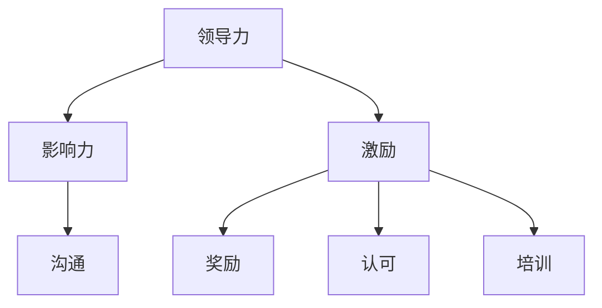

#### 1.2 情商的定义与作用

情商（EQ）是衡量个体情感智力水平的一个重要指标，包括自我认知、自我调节、社交技能和情感管理等方面。情商在领导力中起着至关重要的作用，因为它决定了领导者如何处理压力、人际关系和决策。

**核心概念与联系**

- **情商（EQ）**：指个体识别、理解、管理自己情绪的能力，以及识别、理解和影响他人情绪的能力。
- **自我认知**：个体对自己的情感状态有清晰的了解。
- **自我调节**：个体能够管理自己的情绪，保持冷静和专注。
- **社交技能**：个体能够有效地与他人沟通和互动。

**Mermaid 流程图**

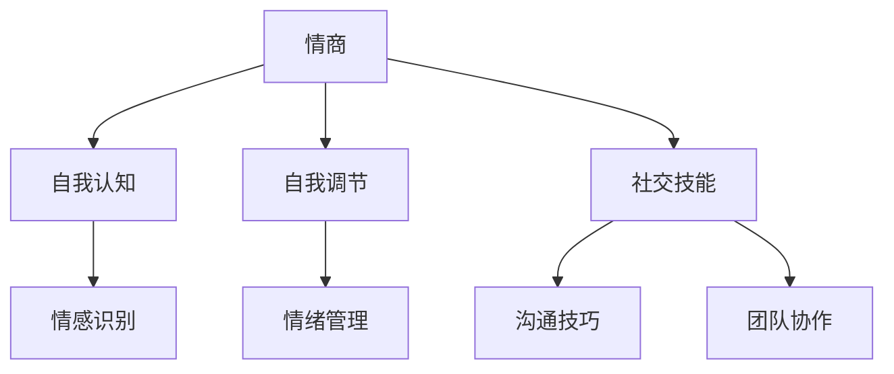

#### 1.3 本书的目的与结构

本书旨在深入探讨领导力与情商在IT行业中的应用，帮助读者提升人际影响力，实现个人和团队的目标。全书分为八个章节，首先介绍领导力与情商的基本概念，然后详细探讨情商提升的技巧，最后通过案例分析展示理论在实际中的应用。

**章节结构**

1. 引言：定义领导力与情商，阐述本书目的。
2. 领导力的基本概念：探讨领导力的起源、核心要素和类型。
3. 情商的重要性：讨论情商的定义、组成部分和在领导力中的作用。
4. 情商提升的技巧：介绍提升情商的途径和技巧。
5. 领导力与情商的结合：探讨领导力与情商的协同效应和应用。
6. 领导力与情商在实践中的应用：分析领导力与情商在企业、团队管理及跨文化管理中的应用。
7. 案例分析：通过实际案例，展示领导力与情商的应用和效果。
8. 总结与展望：总结本书内容，展望领导力与情商的未来发展趋势。

### 第2章 领导力的基本概念

#### 2.1 领导力的起源与发展

领导力的概念并非一成不变，它随着时间和社会环境的变化而不断演变。在古代，领导力主要依赖于遗传和宗族关系。随着社会的发展，领导力理论也逐渐丰富。从早期的特质理论到行为学理论，再到现代的情境领导理论，每一种理论都为我们理解领导力提供了新的视角。

**核心概念与联系**

- **特质理论**：领导力源于个体固有的特质，如聪明、自信和勇气。
- **行为学理论**：领导力是通过行为表现体现出来的，不同的行为会导致不同的领导效果。
- **情境领导理论**：领导力要根据具体情境进行调整，没有一成不变的领导风格。

**Mermaid 流程图**

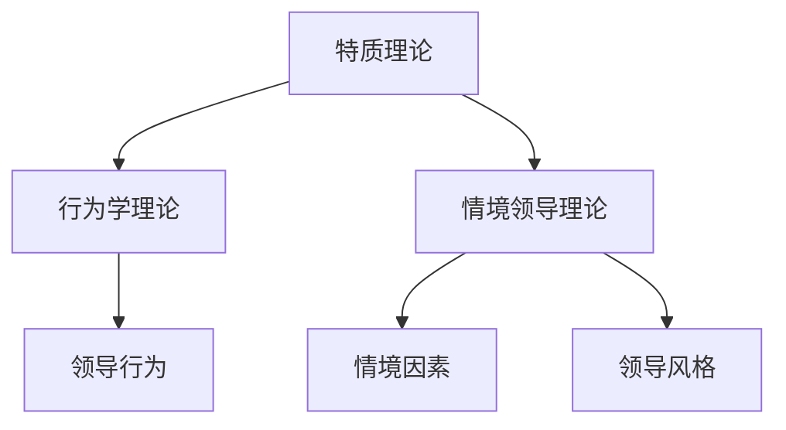

#### 2.2 领导力的核心要素

领导力并非单一特质，而是由多个核心要素构成的一个综合体。这些核心要素相互作用，共同决定领导者的行为和团队的表现。

**核心概念与联系**

- **自我认知**：领导者需要对自己的情感、能力和价值观有清晰的认识。
- **自我调节**：领导者能够管理自己的情绪，保持冷静和专注。
- **社会技能**：领导者需要具备良好的沟通、协调和团队协作能力。
- **动机**：领导者有明确的目标和动机，能够激励团队朝着共同目标努力。

**Mermaid 流程图**

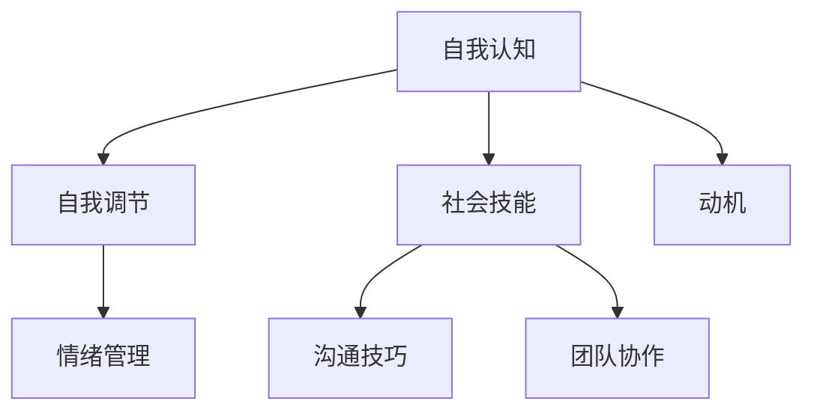

#### 2.3 领导力的类型与模型

领导力可以分为多种类型，每种类型都有其独特的特点和适用场景。常见的领导力模型包括权威型领导、民主型领导和变革型领导。

**核心概念与联系**

- **权威型领导**：领导者拥有绝对的权力，决策由领导者单独做出。
- **民主型领导**：领导者鼓励团队成员参与决策，决策过程更具参与性和透明度。
- **变革型领导**：领导者通过变革和愿景引领团队，激励团队成员超越自身利益，追求更高的目标。

**Mermaid 流程图**

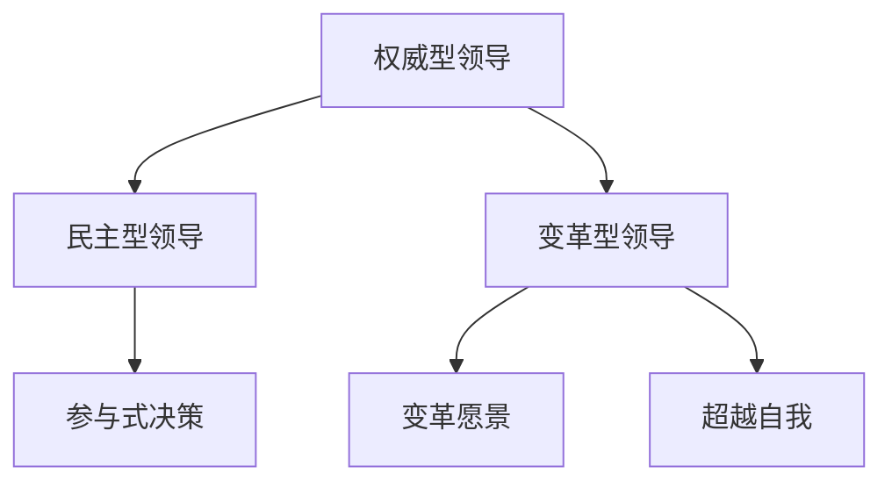

### 第3章 情商的重要性

情商（EQ）是衡量个体情感智力水平的一个重要指标，它包括自我认知、自我调节、社交技能和情感管理等方面。情商在领导力中起着至关重要的作用，因为它决定了领导者如何处理压力、人际关系和决策。

#### 3.1 情商的定义与组成部分

情商（EQ）指的是个体识别、理解、管理和表达情绪的能力，以及识别、理解和影响他人情绪的能力。情商包括以下几个关键组成部分：

- **自我认知**：个体能够认识到自己的情绪状态，了解这些情绪对自己行为和思维的影响。
- **自我调节**：个体能够管理自己的情绪，保持冷静和专注，即使面对压力和挑战。
- **社交技能**：个体能够有效地与他人沟通、建立关系和解决冲突。
- **情感管理**：个体能够理解和应对他人的情绪，以及在适当的情境下表达自己的情绪。

**核心概念与联系**

- **自我认知**：了解自己的情绪，有助于领导者更好地应对挑战和压力。
- **自我调节**：情绪管理能力使领导者能够在压力下保持冷静和专注，做出明智的决策。
- **社交技能**：良好的沟通和人际交往能力使领导者能够建立强大的团队，提升团队绩效。
- **情感管理**：理解他人的情绪，有助于领导者建立信任和合作关系，促进团队和谐。

**Mermaid 流程图**

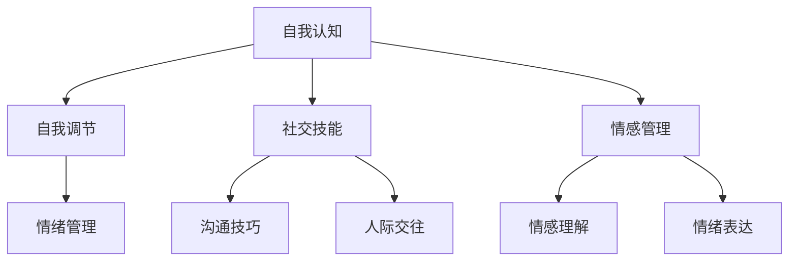

#### 3.2 情商在领导力中的作用

情商在领导力中的作用不可忽视。高情商的领导者能够更好地处理人际关系，做出更明智的决策，并在复杂环境中保持冷静和专注。

- **处理人际关系**：高情商的领导者能够更好地理解和满足团队成员的需求，建立信任和合作关系。这有助于减少团队冲突，提升团队凝聚力。
- **决策能力**：高情商的领导者能够更准确地评估风险和机会，做出更明智的决策。他们能够从不同的角度看待问题，并考虑他人的情感和需求。
- **压力管理**：高情商的领导者能够更好地应对压力和挑战，保持冷静和专注。他们能够识别自己的情绪，并采取适当的措施来调节情绪，以保持最佳的工作状态。

**核心概念与联系**

- **人际关系**：情商使领导者能够建立和维护良好的人际关系，减少冲突，提升团队绩效。
- **决策能力**：情商使领导者能够更全面地考虑问题，做出更明智的决策。
- **压力管理**：情商使领导者能够更好地应对压力，保持冷静和专注。

**Mermaid 流程图**

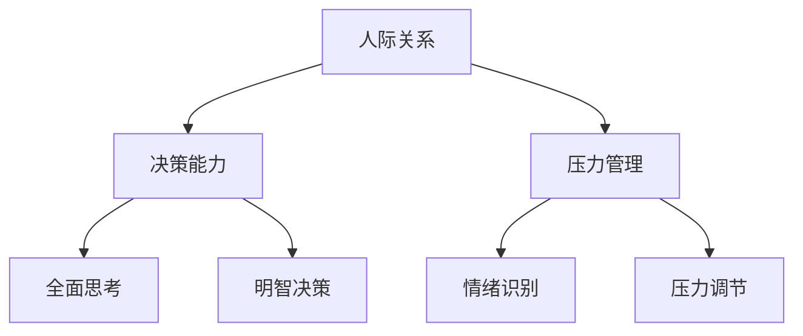

#### 3.3 提高情商的途径

提高情商是一个长期而持续的过程，需要领导者不断学习和实践。以下是一些提高情商的有效途径：

- **自我反思**：定期进行自我反思，了解自己的情绪和思维模式，以及这些模式对人际关系和决策的影响。
- **情感教育**：通过阅读相关书籍、参加培训课程或参加工作坊，学习情感智力的理论和实践技巧。
- **沟通练习**：通过与他人进行积极的沟通，提高自己的社交技能和情感管理能力。
- **心理辅导**：寻求专业的心理辅导，帮助自己更好地理解和处理情绪，提升情商。

**核心概念与联系**

- **自我反思**：了解自己的情绪和思维模式，是提高情商的基础。
- **情感教育**：学习情感智力的理论和实践技巧，是提高情商的关键。
- **沟通练习**：通过与他人沟通，提升社交技能和情感管理能力。
- **心理辅导**：寻求专业的帮助，解决情绪问题，提升情商。

**Mermaid 流程图**

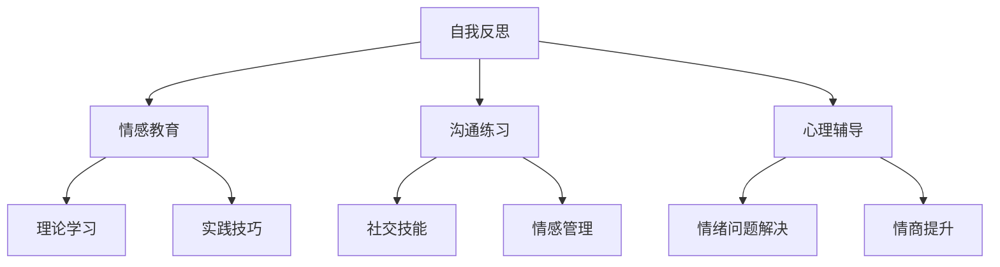

通过以上途径，领导者可以逐步提高情商，从而在领导力中发挥更大的作用，实现个人和团队的目标。

### 第4章 情商提升的技巧

提升情商是领导者实现成功领导力的重要组成部分。以下将介绍几种提升情商的有效技巧，这些技巧不仅适用于个人成长，也适用于团队建设和组织管理。

#### 4.1 自我认知与自我调节

自我认知是情商的基础，它要求领导者能够识别和理解自己的情绪，以及这些情绪对自己行为和决策的影响。自我调节则是指领导者能够管理自己的情绪，保持冷静和专注，即使在面对压力和挑战时也能保持理智。

**核心概念与联系**

- **自我认知**：领导者需要定期进行自我反思，识别自己的情绪状态，并了解这些情绪的根源。
- **自我调节**：领导者可以通过深呼吸、冥想、运动等方式来调节情绪，保持冷静和专注。

**Mermaid 流程图**

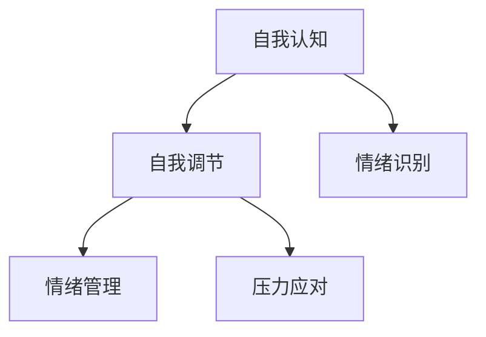

**伪代码讲解**

```python
# 自我认知流程
def self_awareness():
    # 识别情绪
    emotion = get_current_emotion()
    # 分析情绪原因
    cause = analyze_emotion原因(emotion)
    # 记录情绪日志
    log_emotion(emotion, cause)

# 自我调节流程
def self Regulation():
    # 使用深呼吸调节情绪
    deep_breathing()
    # 使用冥想放松心情
    meditation()
    # 重新评估任务
    reassess_tasks()
```

**数学模型和公式**

$$
EQ = \alpha \cdot Self_awareness + \beta \cdot Self_Regression + \gamma \cdot Social_Skills
$$

其中，$EQ$ 表示情商，$\alpha$、$\beta$ 和 $\gamma$ 分别代表自我认知、自我调节和社交技能的权重。

#### 4.2 情绪表达与情感管理

情绪表达是指领导者能够适当地表达自己的情绪，同时避免对他人的负面影响。情感管理则是指领导者能够理解和处理他人的情绪，以及如何在不同的情境中表达和回应这些情绪。

**核心概念与联系**

- **情绪表达**：领导者需要学会在适当的时间和方式下表达自己的情绪，避免过度情绪化和消极情绪的传递。
- **情感管理**：领导者需要能够识别和应对他人的情绪，建立积极的情感联系，促进团队和谐。

**Mermaid 流程图**

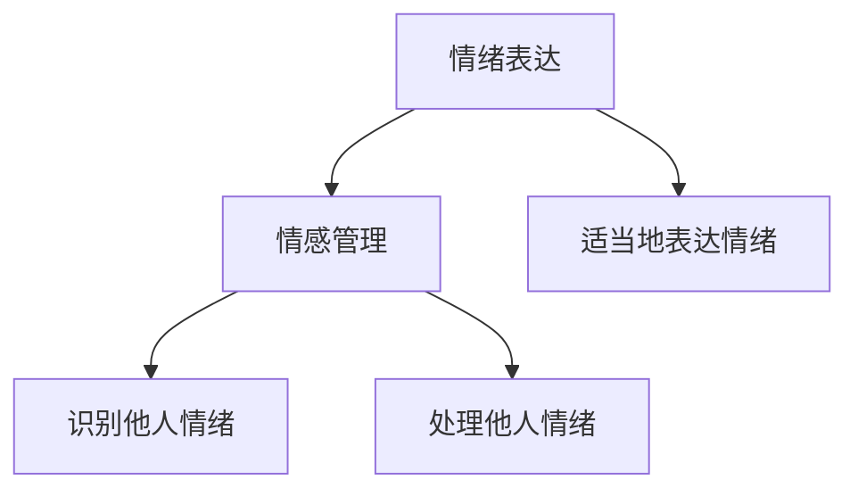

**伪代码讲解**

```python
# 情绪表达流程
def express_emotion():
    # 评估情境
    context = assess_context()
    # 选择合适的表达方式
    emotion_expression = select_expression(context)
    # 表达情绪
    express_emotion_to_team(emotion_expression)

# 情感管理流程
def emotional_management():
    # 识别团队情绪
    team_emotions = identify_team_emotions()
    # 分析情绪原因
    emotion_reasons = analyze_emotion_reasons(team_emotions)
    # 提出解决方案
    propose_solutions(emotion_reasons)
```

**数学模型和公式**

$$
Emotional_Expression = \frac{Emotion_Expression_Effectiveness + Communication_Effectiveness}{2}
$$

其中，$Emotional_Expression$ 表示情绪表达效果，$Emotion_Expression_Effectiveness$ 和 $Communication_Effectiveness$ 分别代表情绪表达的有效性和沟通的有效性。

#### 4.3 社交技能与人际交往

社交技能是情商的重要组成部分，它包括沟通、协调和团队协作等方面的能力。领导者需要具备良好的社交技能，以便在复杂的人际关系中发挥领导作用。

**核心概念与联系**

- **沟通**：领导者需要能够清晰、有效地表达自己的想法，同时倾听和理解他人的观点。
- **协调**：领导者需要能够协调不同团队成员之间的工作，确保团队目标的实现。
- **团队协作**：领导者需要能够激励团队成员合作，共同实现目标。

**Mermaid 流程图**

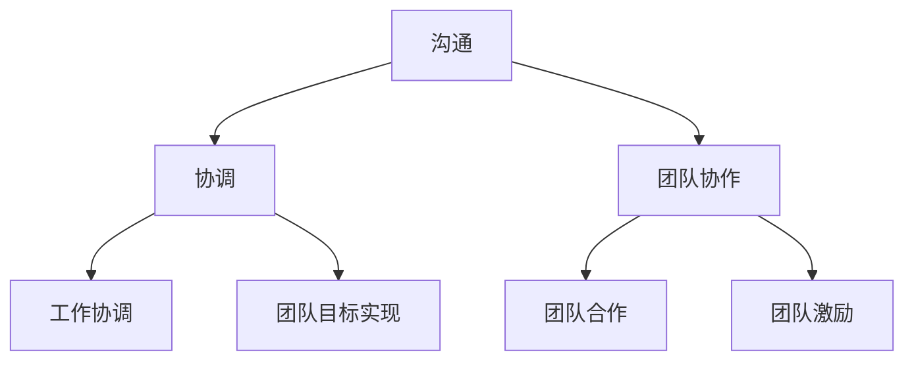

**伪代码讲解**

```python
# 沟通过程
def communication():
    # 明确沟通目标
    communication_goal = define_communication_goal()
    # 准备沟通内容
    communication_content = prepare_communication_content()
    # 进行有效沟通
    perform_communication(communication_goal, communication_content)

# 协调过程
def coordination():
    # 分析工作需求
    work_requirements = analyze_work_requirements()
    # 协调资源分配
    allocate_resources(work_requirements)
    # 跟进工作进展
    track_progress()

# 团队协作过程
def teamwork():
    # 设定团队目标
    team_goal = set_team_goal()
    # 分配任务
    assign_tasks()
    # 激励团队成员
    motivate_team_members()
```

**数学模型和公式**

$$
Social_Skills = \frac{Communication_Skills + Coordination_Skills + Teamwork_Skills}{3}
$$

其中，$Social_Skills$ 表示社交技能，$Communication_Skills$、$Coordination_Skills$ 和 $Teamwork_Skills$ 分别代表沟通技能、协调技能和团队协作技能。

通过以上技巧，领导者可以逐步提升情商，从而在领导力中发挥更大的作用，实现个人和团队的目标。

### 第5章 领导力与情商的结合

领导力与情商的结合是提升人际影响力的关键。当领导力具备高情商时，领导者不仅能够有效引导团队，还能处理复杂的人际关系，实现团队目标。以下将探讨领导力与情商的协同效应，以及在实际应用中的关键策略。

#### 5.1 领导力与情商的协同效应

领导力与情商的结合能够产生强大的协同效应，这种效应在多个方面体现出来：

- **决策质量**：具备高情商的领导者能够更全面地考虑问题，从多个角度分析决策的影响，从而做出更明智的决策。
- **团队凝聚力**：高情商的领导者能够理解并满足团队成员的需求，建立信任和合作关系，提升团队凝聚力。
- **适应能力**：具备高情商的领导者能够更好地应对变化和挑战，保持冷静和专注，带领团队克服困难。
- **创新能力**：情商使得领导者能够激发团队成员的潜力，鼓励创新思维，推动团队不断进步。

**核心概念与联系**

- **决策质量**：情商使领导者能够更全面地考虑问题，减少决策失误。
- **团队凝聚力**：情商使领导者能够建立信任和合作关系，提升团队绩效。
- **适应能力**：情商使领导者能够更好地应对变化和挑战，保持团队稳定。
- **创新能力**：情商使领导者能够激发团队成员的潜力，推动团队创新。

**Mermaid 流程图**

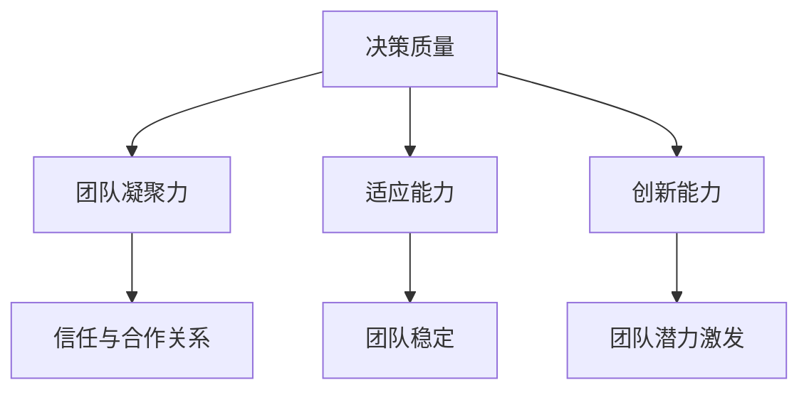

#### 5.2 情商在领导决策中的应用

情商在领导决策中的应用体现在以下几个方面：

- **情绪识别**：领导者需要能够识别自己的情绪，以及这些情绪对决策的影响。通过自我认知和自我调节，领导者可以避免情绪化决策，确保决策的理性性和客观性。
- **风险评估**：具备高情商的领导者能够更好地评估决策带来的风险，考虑不同风险情境下团队成员的情绪反应，从而制定更稳健的决策方案。
- **利益相关者管理**：领导者需要能够理解和处理利益相关者的情绪，通过有效的沟通和情感管理，获得支持并减少阻力。

**核心概念与联系**

- **情绪识别**：领导者需要能够识别自己的情绪，避免情绪化决策。
- **风险评估**：领导者需要考虑不同风险情境下团队成员的情绪反应，制定稳健的决策方案。
- **利益相关者管理**：领导者需要通过有效的沟通和情感管理，获得支持并减少阻力。

**Mermaid 流程图**

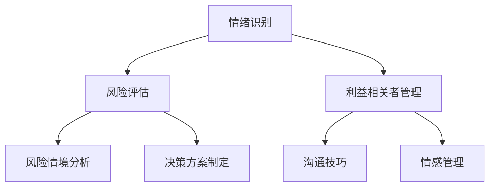

**伪代码讲解**

```python
# 情绪识别流程
def emotion_identification():
    # 识别当前情绪
    current_emotion = identify_current_emotion()
    # 分析情绪影响
    emotion_impact = analyze_emotion_impact(current_emotion)
    # 调节情绪
    adjust_emotion(current_emotion)

# 风险评估流程
def risk_assessment():
    # 分析决策情境
    decision_context = analyze_decision_context()
    # 评估情绪反应
    emotion_response = assess_emotion_response(decision_context)
    # 制定稳健决策方案
    create_robust_decision_plan()

# 利益相关者管理流程
def stakeholder_management():
    # 识别利益相关者
    stakeholders = identify_stakeholders()
    # 分析情绪状态
    stakeholder_emotions = analyze_stakeholder_emotions()
    # 沟通与协调
    communicate_and Coordinate(stakeholders, stakeholder_emotions)
```

**数学模型和公式**

$$
Decision_Quality = \alpha \cdot Emotional_ Intelligence + \beta \cdot Risk_Assessment + \gamma \cdot Stakeholder_Management
$$

其中，$Decision_Quality$ 表示决策质量，$\alpha$、$\beta$ 和 $\gamma$ 分别代表情商、风险评估和利益相关者管理的权重。

#### 5.3 提升领导力的情商策略

领导者可以通过以下策略提升情商，从而提升领导力：

- **持续学习**：领导者需要不断学习情感智力理论和实践技巧，通过阅读、培训和实践不断提升自己的情商。
- **建立支持网络**：领导者可以加入专业组织或社区，与其他领导者交流经验和技巧，共同提升情商。
- **培养同理心**：领导者需要学会站在他人的角度思考问题，培养同理心，理解并尊重团队成员的需求和情感。
- **情感反思**：领导者需要定期进行自我反思，识别自己的情绪和行为模式，以及这些模式对团队的影响。

**核心概念与联系**

- **持续学习**：通过不断学习，领导者可以提升自己的情商。
- **建立支持网络**：与其他领导者交流，共同提升情商。
- **培养同理心**：理解并尊重团队成员的需求和情感，提升团队凝聚力。
- **情感反思**：定期进行自我反思，提升自我认知和情绪调节能力。

**Mermaid 流程图**

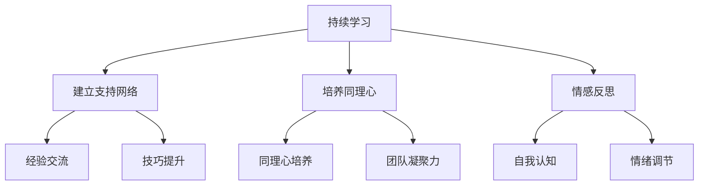

通过以上策略，领导者可以不断提升情商，从而在领导力中发挥更大的作用，实现个人和团队的目标。

### 第6章 领导力与情商在实践中的应用

#### 6.1 领导力与情商在企业中的角色

在企业中，领导力与情商扮演着至关重要的角色。领导力不仅关乎企业的战略决策和目标实现，还关乎企业的文化建设和团队协作。情商则直接影响企业的员工满意度和生产力。以下将探讨领导力与情商在企业中的具体角色和应用。

**核心概念与联系**

- **领导力**：在企业中，领导力是指领导者通过愿景、策略和团队管理，推动企业实现目标的能力。
- **情商**：情商是指企业员工在处理人际关系、应对压力和决策过程中所展现的情感智力能力。

**Mermaid 流程图**

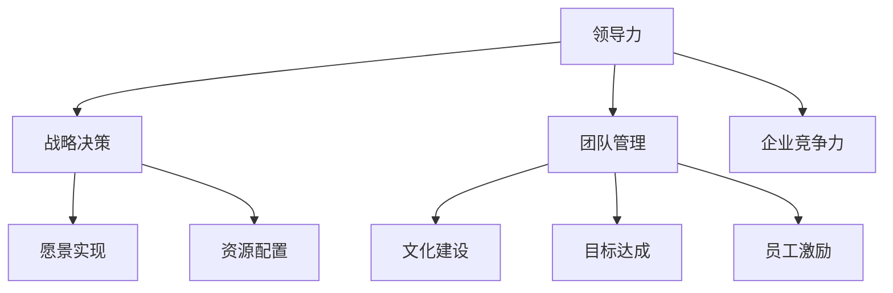

**伪代码讲解**

```python
# 企业战略决策
def strategic_decision():
    # 确定企业愿景
    vision = define_company_vision()
    # 制定策略
    strategy = create_strategy(vision)
    # 资源配置
    allocate_resources(strategy)

# 团队管理
def team_management():
    # 建立团队目标
    team_goals = establish_team_goals()
    # 激励员工
    motivate_employees()
    # 监控团队进展
    monitor_team_progress()

# 文化建设
def culture_building():
    # 塑造企业价值观
    values = shape_company_values()
    # 培养团队精神
    develop_teamSpirit()
    # 提升员工满意度
    improve_employee_satisfaction()
```

**数学模型和公式**

$$
Corporate_Success = \alpha \cdot Leadership + \beta \cdot Emotional_ Intelligence + \gamma \cdot Team_Cooperation
$$

其中，$Corporate_Success$ 表示企业成功，$\alpha$、$\beta$ 和 $\gamma$ 分别代表领导力、情商和团队合作的权重。

#### 6.2 领导力与情商在团队管理中的应用

在团队管理中，领导力与情商的应用直接影响团队的表现和员工的满意度。以下将探讨领导力与情商在团队管理中的具体应用，以及如何通过提升情商来提升团队管理效果。

**核心概念与联系**

- **领导力**：团队领导者通过明确的指导、有效的沟通和激励，引导团队成员实现共同目标。
- **情商**：团队成员通过自我认知、自我调节和社交技能，提升团队合作和解决问题的能力。

**Mermaid 流程图**

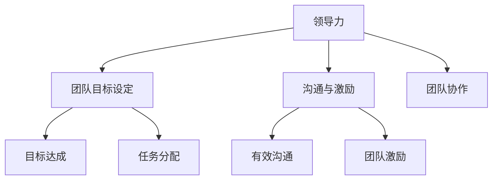

**伪代码讲解**

```python
# 团队目标设定
def set_team_goals():
    # 收集团队成员意见
    opinions = collect_team_members_opinions()
    # 设定共同目标
    common_goals = define_common_goals(opinions)
    # 分享目标
    share_goals(common_goals)

# 沟通与激励
def communication_and_motivation():
    # 定期召开团队会议
    schedule_team_meetings()
    # 给予正面反馈
    give_positive_feedback()
    # 激励团队成员
    motivate_team_members()

# 团队协作
def team_collaboration():
    # 分配任务
    assign_tasks()
    # 监控任务进展
    monitor_task_progress()
    # 解决冲突
    resolve_conflicts()
```

**数学模型和公式**

$$
Team_Performance = \alpha \cdot Leadership_Quality + \beta \cdot Emotional_ Intelligence_Level + \gamma \cdot Team_Support
$$

其中，$Team_Performance$ 表示团队表现，$\alpha$、$\beta$ 和 $\gamma$ 分别代表领导力质量、情商水平和团队支持的权重。

#### 6.3 领导力与情商在跨文化管理中的挑战

在全球化背景下，跨文化管理成为企业必须面对的重要挑战。领导力与情商在跨文化管理中的应用尤为关键，以下将探讨领导力与情商在跨文化管理中的挑战和应对策略。

**核心概念与联系**

- **领导力**：跨文化管理中，领导者需要具备文化敏感性和适应性，以有效引导和管理多元文化团队。
- **情商**：情商使领导者能够理解并处理跨文化团队中的情感冲突和沟通障碍，提升团队凝聚力。

**Mermaid 流程图**

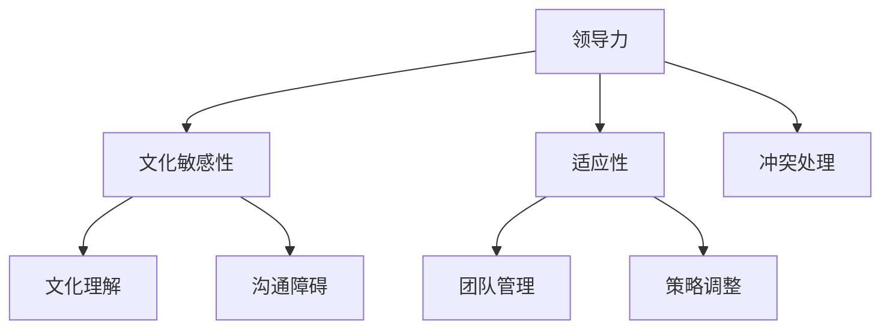

**伪代码讲解**

```python
# 文化敏感性提升
def cultural_sensitivity():
    # 学习跨文化知识
    learn_cultural_knowledge()
    # 了解团队成员文化背景
    understand_team_members_culture()
    # 尊重多元文化
    respect_diverse_cultures()

# 适应性提升
def adaptability():
    # 调整管理策略
    adjust_management_strategies()
    # 适应文化差异
    adapt_to_cultural_differences()
    # 促进文化融合
    promote_cultural_integration()

# 冲突处理
def conflict_resolution():
    # 识别冲突原因
    identify_conflict_reasons()
    # 分析冲突影响
    analyze_conflict_impact()
    # 制定解决策略
    create_resolution_strategies()
```

**数学模型和公式**

$$
Cross-Cultural_Management_Effectiveness = \alpha \cdot Leadership_Adaptability + \beta \cdot Emotional_ Intelligence + \gamma \cdot Cultural_Understanding
$$

其中，$Cross-Cultural_Management_Effectiveness$ 表示跨文化管理有效性，$\alpha$、$\beta$ 和 $\gamma$ 分别代表领导力适应性、情商和跨文化理解的权重。

通过以上探讨，我们可以看到领导力与情商在实践中的应用对于企业的成功、团队管理和跨文化管理都具有重要意义。领导者应不断提升自己的情商，结合领导力技巧，以实现个人和团队的长期成功。

### 第7章 案例分析

#### 7.1 案例介绍

为了更好地展示领导力与情商在实际应用中的效果，我们将分析一家全球知名科技公司——微软（Microsoft）的领导实践。微软在跨文化团队管理和领导力培养方面有着丰富的经验，其成功案例对于其他企业具有重要的参考价值。

**背景**：微软是一家全球性的科技公司，拥有来自不同国家和地区的员工。随着全球化进程的加快，微软面临着跨文化团队管理和领导力培养的挑战。为了提升团队绩效和员工满意度，微软实施了一系列领导力与情商提升的举措。

**目标**：通过领导力与情商的培养，微软希望实现以下目标：
- 提升跨文化团队的协作和创新能力。
- 增强员工的归属感和敬业度。
- 提高企业的竞争力和市场份额。

#### 7.2 案例分析

**领导力实践**

1. **文化敏感性培训**：微软为领导者提供了跨文化培训，帮助他们了解不同文化背景下的沟通方式和行为准则。这种培训包括文化差异的识别、跨文化沟通技巧和冲突管理策略。通过提升领导者的文化敏感性，微软有效减少了跨文化团队中的误解和冲突。

2. **领导力发展计划**：微软推行了一系列领导力发展计划，包括领导力训练营、工作坊和在线课程。这些计划旨在提升领导者的情商和领导技能，包括自我认知、情感管理和团队建设等方面。通过这些培训，领导者能够更好地理解和应对员工的需求，提升团队凝聚力。

3. **领导力角色扮演**：微软采用领导力角色扮演的方式，帮助领导者实践和反思自己的领导行为。通过模拟不同的领导情境，领导者能够学习和掌握应对各种挑战的策略，提高实际领导能力。

**情商实践**

1. **情感反馈机制**：微软建立了情感反馈机制，鼓励员工和管理者之间进行开放和诚实的沟通。这种机制包括定期的情感调查、一对一的情感反馈会议和团队建设活动。通过这些活动，员工能够更好地表达自己的情感和需求，管理者也能够及时了解和解决员工的问题。

2. **领导力教练计划**：微软为领导者提供了一对一的领导力教练服务，帮助他们提升情商和领导技能。这些教练不仅提供专业的指导和建议，还通过情感反馈和情境模拟，帮助领导者更好地理解和处理情感问题。

3. **员工关怀计划**：微软关注员工的身心健康，推出了一系列员工关怀计划，包括心理健康支持、健康保险和员工援助计划。这些计划帮助员工在工作和生活中保持良好的情绪状态，提高了员工的工作满意度和忠诚度。

#### 7.3 案例启示

通过分析微软的案例，我们可以得出以下启示：

1. **文化敏感性是跨文化团队管理的关键**：领导者需要具备文化敏感性，了解和尊重不同文化背景下的行为准则和沟通方式，以减少误解和冲突。

2. **情商是提升领导力的核心**：领导者需要不断提升自己的情商，包括自我认知、情感管理和团队建设等方面的能力。这有助于提升领导者的影响力，增强团队的凝聚力和创新力。

3. **情感反馈和员工关怀是提升员工满意度的重要因素**：建立情感反馈机制和员工关怀计划，可以帮助员工在工作和生活中保持良好的情绪状态，提高工作满意度和忠诚度。

通过这些启示，我们可以看到领导力与情商在实践中的应用对于企业的成功至关重要。领导者应不断学习和实践，提升自己的情商和领导力，以实现个人和团队的目标。

### 第8章 总结与展望

#### 8.1 本书内容的总结

本书系统地介绍了领导力与情商在IT行业中的应用，旨在帮助读者提升人际影响力，实现个人和团队的目标。全书内容主要涵盖以下几个方面：

1. **领导力的基本概念**：包括领导力的起源、核心要素和类型。
2. **情商的重要性**：探讨了情商的定义、组成部分和在领导力中的作用。
3. **情商提升的技巧**：介绍了自我认知、自我调节、情绪表达与情感管理、社交技能与人际交往等方面的提升方法。
4. **领导力与情商的结合**：分析了领导力与情商的协同效应、情商在领导决策中的应用和提升领导力的情商策略。
5. **领导力与情商在实践中的应用**：探讨了领导力与情商在企业、团队管理和跨文化管理中的应用，以及如何通过提升情商来提升团队管理效果。
6. **案例分析**：通过微软的案例，展示了领导力与情商在实际应用中的效果和启示。

#### 8.2 领导力与情商的未来发展趋势

随着技术的发展和社会的变革，领导力与情商在未来将继续发挥重要作用。以下是一些可能的发展趋势：

1. **数字化领导力**：随着数字化转型的加速，领导者需要具备数字素养和技术领导力，以适应不断变化的环境。
2. **可持续领导力**：未来领导者将更加关注企业的社会责任和可持续发展，推动企业实现经济效益和社会效益的双赢。
3. **情感智能领导力**：情感智能将成为未来领导力的核心，领导者需要具备更高的情商，以应对复杂的人际关系和情感挑战。
4. **个性化领导力**：随着个性化需求的增长，领导者将更加注重理解和满足员工的个性化需求，提升员工满意度和绩效。

#### 8.3 读者如何应用所学知识

为了将所学知识应用到实际工作中，读者可以采取以下步骤：

1. **自我反思**：定期进行自我反思，识别自己的情绪和行为模式，以及这些模式对工作和人际关系的影响。
2. **持续学习**：不断学习和提升自己的领导力和情商，通过阅读书籍、参加培训和参加工作坊，掌握最新的理论和实践技巧。
3. **实践应用**：将所学知识应用到实际工作中，例如通过改善沟通方式、提升团队协作能力和情感管理能力，提升工作效果。
4. **反馈与调整**：从同事和下属那里获取反馈，了解自己的领导力和情商表现，并根据反馈进行调整和改进。

通过以上步骤，读者可以逐步提升自己的领导力和情商，实现个人和团队的长期发展。

### 附录

**最佳实践 tips**

- **建立积极的反馈机制**：定期与团队成员进行反馈交流，鼓励正面反馈和建设性批评，以提升团队绩效。
- **培养同理心**：学会站在他人的角度思考问题，理解并尊重团队成员的需求和情感。
- **保持自我反思**：定期进行自我反思，识别自己的情绪和行为模式，及时进行调整和改进。

**小结**

领导力与情商是成功领导的关键要素。通过提升情商，领导者可以更好地处理人际关系，做出更明智的决策，并在复杂环境中保持冷静和专注。本书提供了系统的理论和实践方法，帮助读者理解和应用领导力与情商，提升人际影响力，实现个人和团队的目标。

**注意事项**

- 领导力与情商的提升是一个长期过程，需要持续的努力和实践。
- 每个团队和组织都有其独特性，领导者需要根据实际情况灵活应用所学知识。

**拓展阅读**

- 《情商：为什么情商比智商更重要》（Daniel Goleman）
- 《领导力五项修炼》（Patrick Lencioni）
- 《影响力：说服的心理学》（Robert B. Cialdini）

通过拓展阅读，读者可以深入了解领导力与情商的理论和实践，进一步提升自己的领导力和情商。

### 作者信息

作者：AI天才研究院/AI Genius Institute & 禅与计算机程序设计艺术 /Zen And The Art of Computer Programming

AI天才研究院致力于探索人工智能领域的最新技术和发展趋势，推动人工智能在各个行业的应用。同时，作者在《禅与计算机程序设计艺术》一书中，深入探讨了计算机编程和人工智能的哲学思想，为读者提供了独特的视角和深刻的见解。希望通过本书，读者能够更好地理解和应用领导力与情商，实现个人和团队的目标。

