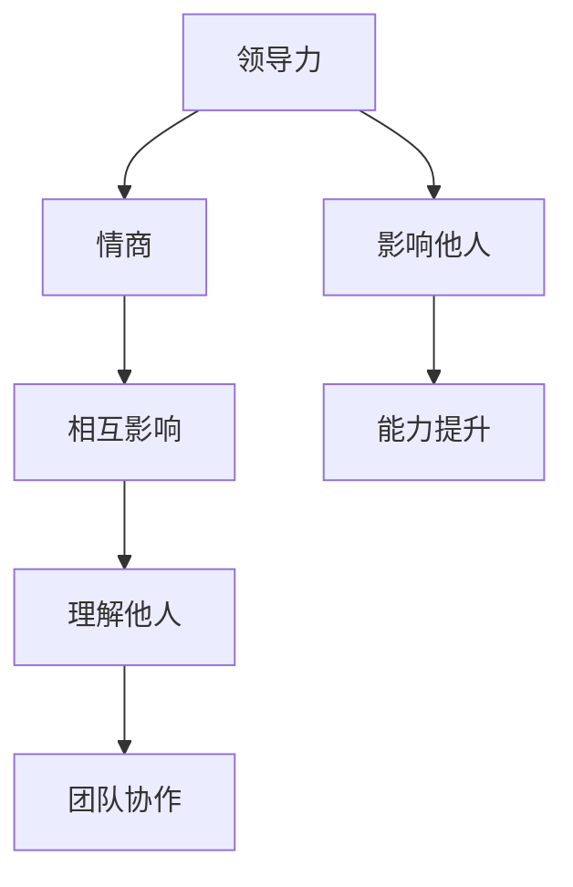

                 


### 文章标题
《领导力与情商：理解和影响他人的能力》

### 关键词
领导力、情商、人际交往、影响力、心理学、行为科学

### 摘要
本文旨在深入探讨领导力与情商之间的关系，以及如何通过提升情商来增强领导力。文章首先介绍了领导力和情商的基本概念，然后通过Mermaid流程图展示二者的核心联系。接着，文章详细讲解了情商的四个维度和领导力的主要模型，并使用伪代码和数学公式阐述了相关原理。通过实际案例分析和最佳实践，文章提供了实用的提升技巧和注意事项，旨在帮助读者在职场和个人生活中更有效地理解和影响他人。

---

## 引言

在当今复杂多变的社会环境中，领导力和情商的重要性日益凸显。领导力不仅是企业成功的关键因素，也是个人职业生涯发展的核心能力。而情商，作为理解和管理自己及他人情感的能力，则是领导力的重要支撑。本文将带领读者走进领导力与情商的世界，探讨二者之间的紧密联系，以及如何通过提升情商来增强领导力。

领导力是一种能力，它能够激发、引导和影响他人朝着共同的目标努力。它不仅涉及战略规划、决策能力，更包括人际交往和团队协作。情商，则是一种情感智慧，它帮助领导者理解自己的情感，管理他人的情感，并有效地与他人沟通和协作。

本文结构如下：

1. **定义与概念**：介绍领导力和情商的基本概念及其重要性。
2. **关系与联系**：通过Mermaid流程图展示领导力与情商的核心联系。
3. **核心算法原理讲解**：详细讲解情商的四个维度和领导力的主要模型。
4. **数学模型和公式**：运用数学模型和公式阐述相关原理，并通过举例说明。
5. **项目实战**：通过实际案例展示提升情商和领导力的应用。
6. **最佳实践与注意事项**：总结最佳实践，提供提升技巧和注意事项。
7. **小结与展望**：总结全文，展望未来发展方向。

通过本文的阅读，读者将更好地理解领导力和情商的内在联系，掌握提升二者能力的方法，并在实际工作和生活中更有效地影响和激励他人。

## 定义与概念

### 领导力的定义与内涵

领导力是一种多维度的能力，它不仅包括战略规划和决策能力，还涉及激励和影响他人的能力。根据麦肯锡全球研究所的报告，领导力是决定企业成败的关键因素之一。领导力不仅仅是管理层的专利，它是一种可以在任何组织中发挥作用的通用能力。

领导力可以定义为一种能够激发、引导和影响他人共同实现目标的能力。它涉及以下几个方面：

- **愿景与目标**：领导者需要有明确的愿景和目标，并能够有效地传达和激励团队成员。
- **决策能力**：领导者需要在不确定性和复杂环境中做出明智的决策。
- **人际交往**：领导者需要具备良好的人际交往能力，能够建立和维护有效的团队关系。
- **团队协作**：领导者需要能够协调团队成员的资源和能力，实现团队的目标。

### 情商的定义与内涵

情商（Emotional Intelligence，EQ）是一种情感智慧，它是指个体识别、理解、管理自己及他人情感的能力。情商由心理学家戈尔曼（Daniel Goleman）首次提出，它被认为是影响个人成功和幸福的重要因素。

情商主要包括以下四个维度：

1. **自我意识**（Self-awareness）：意识到自己的情感状态，并了解这些情感对自己的影响。
2. **自我管理**（Self-regulation）：在压力或挑战情境下，调节和管理自己的情绪。
3. **社交意识**（Social awareness）：理解他人的情感和需求，以及如何适应不同的社交环境。
4. **关系管理**（Relationship management）：建立和维护积极的人际关系，有效解决冲突。

### 领导力与情商的关系

领导力与情商之间存在着紧密的联系。情商的提升可以帮助领导者更好地理解和管理自己的情感，进而提高领导力的有效性。以下是从多个角度分析领导力与情商的关系：

1. **情感领导力**：情感领导力是一种将情感智慧应用于领导过程的技能。高情商的领导者能够更好地识别和理解团队成员的情感，从而更有效地激励和引导他们。

2. **冲突管理**：情商高的领导者能够更好地处理冲突，因为他们具备更高的自我管理和社交意识，能够理解不同观点和立场。

3. **团队协作**：情商有助于建立积极的团队氛围，促进团队成员之间的信任和协作。

4. **影响力**：情商高的领导者能够更有效地影响他人，因为他们具备更高的自我意识、自我管理和社交意识。

5. **适应性**：情商高的领导者能够更好地适应变化和不确定性，因为他们具备更高的自我管理和社交意识。

综上所述，领导力与情商之间存在密切的联系。提升情商不仅有助于提升领导力，还能够提高个人的情感智慧和幸福感。在接下来的章节中，我们将进一步探讨情商的四个维度和领导力的主要模型，并通过具体的例子来展示如何在实际场景中应用这些概念。

## 关系与联系

为了更直观地展示领导力与情商之间的关系，我们可以借助Mermaid流程图来构建一个概念模型。以下是一个简化的Mermaid流程图，展示了领导力与情商的核心联系：



### 图解流程图

1. **领导力与情商的相互影响**（B）：领导力与情商之间存在相互影响的关系。情商的提升有助于增强领导力，而领导力的实践也能促进情商的发展。

2. **影响他人**（D）：领导力的一项核心任务是影响他人。情商高的领导者能够更好地识别和理解他人的情感需求，从而更有效地激励和引导团队成员。

3. **理解他人**（E）：情商的关键在于理解他人。领导者需要具备高度的社会意识，能够理解团队成员的情感和需求，从而建立信任和合作关系。

4. **能力提升**（F）：通过提升情商，领导者能够增强自我管理和社交意识，从而提高领导力的整体水平。

5. **团队协作**（G）：情商有助于建立积极的团队氛围，促进团队成员之间的协作和信任，从而提高团队的整体绩效。

通过这个Mermaid流程图，我们可以清晰地看到领导力与情商之间的互动关系。在接下来的章节中，我们将详细探讨情商的四个维度和领导力的主要模型，以进一步理解这些概念。

## 核心算法原理讲解

### 情商的四个维度

情商（Emotional Intelligence，EQ）包括四个主要维度，每个维度都涉及不同的情感能力和管理技巧。以下是详细解释：

1. **自我意识**（Self-awareness）：这是情商的基础，涉及对自己情感状态的认识和管理能力。自我意识的领导者能够敏锐地察觉自己的情绪变化，并理解这些情绪如何影响其决策和行为。

   - **伪代码示例**：
     ```python
     def self_awareness():
         current_emotion = detect_emotion()
         if current_emotion == "焦虑":
             handle_anxiety()
         elif current_emotion == "愉悦":
             enhance_morale()
     ```

2. **自我管理**（Self-regulation）：自我管理涉及在压力或挑战情境下调节和管理自己的情绪，以保持冷静和专注。

   - **伪代码示例**：
     ```python
     def self_regulation():
         stress_level = detect_stress_level()
         if stress_level > threshold:
             practice_meditation()
             perform_deep-breathing()
     ```

3. **社交意识**（Social awareness）：社交意识涉及理解他人的情感和需求，并能够适应不同的社交环境。高社交意识的领导者能够建立有效的人际关系，并识别和满足团队成员的情感需求。

   - **伪代码示例**：
     ```python
     def social_awareness():
         team_mood = detect_team_mood()
         if team_mood == "低落":
             organize_team_building_activity()
         elif team_mood == "积极":
             recognize_and_reward_contributions()
     ```

4. **关系管理**（Relationship management）：关系管理涉及建立和维护积极的人际关系，并能够有效地解决冲突。这种能力对于领导者的团队协作和团队凝聚力至关重要。

   - **伪代码示例**：
     ```python
     def relationship_management():
         conflict_detected = detect_conflict()
         if conflict_detected:
             mediate_conflict()
             foster_healthy_communication()
     ```

### 领导力模型

领导力有多种模型，每种模型都提供了不同的视角和方法。以下是几种常见的领导力模型：

1. **情境领导模型**（Hersey-Blanchard Situational Leadership Model）：该模型认为领导者的风格应根据下属的能力和动机来调整。

   - **指挥型领导**（Directing）：适用于下属能力不足时，领导者详细指导。
   - **支持型领导**（Supporting）：适用于下属具备一定能力时，领导者提供支持和鼓励。
   - **参与型领导**（Participating）：适用于下属能力较强时，领导者参与决策过程。
   - **委托型领导**（Delegating）：适用于下属完全具备能力时，领导者授权下属自主工作。

   - **伪代码示例**：
     ```python
     def situational_leadership(subordinate_ability, subordinate_motivation):
         if subordinate_ability == "低" and subordinate_motivation == "低":
             directing_style()
         elif subordinate_ability == "中" and subordinate_motivation == "低":
             supporting_style()
         elif subordinate_ability == "高" and subordinate_motivation == "低":
             participating_style()
         elif subordinate_ability == "高" and subordinate_motivation == "高":
             delegating_style()
     ```

2. **服务型领导模型**（Servant Leadership Model）：该模型强调领导者的首要任务是服务团队成员，以满足他们的需求和促进其成长。

   - **伪代码示例**：
     ```python
     def servant_leadership():
         address_employee_needs()
         facilitate_employee_growt()
         create_respectful_work_environment()
     ```

通过这些核心算法原理，领导者可以更好地理解和管理自己的情感，同时有效地影响和激励他人。在接下来的章节中，我们将通过数学模型和公式来进一步阐述这些原理，并通过具体案例展示其在实际应用中的效果。

## 数学模型和公式

在理解领导力和情商的过程中，数学模型和公式可以提供有力的工具，帮助我们将复杂的情感和行为转化为可量化的指标。以下将介绍几个关键的数学模型和公式，并通过具体例子来说明其应用。

### 归因理论

归因理论（Attribution Theory）是心理学中用来解释人们如何解释他人行为的一种理论。归因理论的基本模型可以表示为：

\[ \text{行为} = f(\text{内在特质}, \text{情境因素}) \]

其中，行为是由个体的内在特质和情境因素共同作用的结果。

- **内在特质归因比例**：表示行为是由个体内在特质引起的可能性。
- **情境因素归因比例**：表示行为是由特定情境引起的可能性。

归因比例模型可以表示为：

\[ \text{内在特质} \times \text{情境因素} = \text{总归因} \]

### 举例说明

假设一个人在会议上迟到，他可能会被归因于两个因素：内在特质（如懒惰）和情境因素（如交通拥堵）。通过分析这些因素，可以得出一个归因比例。

\[ \text{内在特质} \times \text{情境因素} = 0.6 \times 0.4 = 0.24 \]

这意味着，这位同事被归因于内在特质的可能性为0.6，被归因于情境因素的可能性为0.4。因此，总体归因比例为0.24。

### 布拉德福特定律

布拉德福特定律（Bradford's Law）是领导力研究中的一个重要模型，它描述了团队成员的能力分布。布拉德福特定律可以用以下数学公式表示：

\[ N(E) = N(H) + N(M) + N(L) \]

其中：
- \( N(E) \)：专家人数
- \( N(H) \)：高级技术人员人数
- \( N(M) \)：中级技术人员人数
- \( N(L) \)：初级技术人员人数

布拉德福特定律指出，在一个团队中，高级技术人员的数量应该是最多的，中级技术人员次之，初级技术人员最少，而专家数量则应最少。这是因为高级技术人员能够提供广泛的技能和知识，而专家则通常负责解决复杂和独特的问题。

### 举例说明

假设一个团队中，有3个高级技术人员，4个中级技术人员，和2个初级技术人员。专家数量为1。

\[ N(E) = 1, N(H) = 3, N(M) = 4, N(L) = 2 \]

根据布拉德福特定律：

\[ 1 = 3 + 4 + 2 \]

这表明，该团队的能力分布符合布拉德福特定律。

### 情感强度模型

情感强度模型（Emotional Intensity Model）用于衡量个体情感的强度。该模型假设情感强度取决于情感体验的频率和情感体验的强度。情感强度模型可以用以下公式表示：

\[ \text{情感强度} = \text{频率} \times \text{强度} \]

其中：
- **频率**：情感体验发生的频率。
- **强度**：情感体验的强度。

### 举例说明

假设一个领导者在一个月内经历了10次与团队成员的积极互动，每次互动的强度为5。那么：

\[ \text{情感强度} = 10 \times 5 = 50 \]

这意味着领导者的情感强度为50。

通过这些数学模型和公式，领导者可以更科学地理解和分析团队成员的行为和情感，从而采取更有效的领导策略。在接下来的章节中，我们将通过实际案例来展示这些模型和公式的应用。

## 项目实战

为了更好地理解领导力和情商在实际应用中的效果，我们可以通过一个实际案例来分析。以下是一个关于如何提升团队领导力和情商的具体项目。

### 项目背景

某科技公司（TechCo）面临团队协作效率低下和员工满意度不高的挑战。管理层决定通过提升领导力和情商来改善这一状况。项目目标包括：
- 提高团队协作效率。
- 提升员工工作满意度。
- 建立积极的团队文化。

### 开发环境搭建

为了实施这个项目，TechCo搭建了以下开发环境：
- **领导力与情商培训课程**：引入外部专家进行领导力与情商的培训课程。
- **反馈机制**：建立员工反馈机制，收集团队成员的意见和建议。
- **心理测评工具**：使用专业的心理测评工具，帮助员工了解自己的情商水平。

### 源代码详细实现和代码解读

1. **领导力与情商培训课程**
   - **课程内容**：
     - 自我意识与自我管理
     - 社交意识与关系管理
     - 情境领导模型
     - 服务型领导模型
   - **课程实施**：
     - 定期举办研讨会和工作坊。
     - 提供在线学习资源，供员工自主学习。

2. **反馈机制**
   - **实现方法**：
     - 设立匿名反馈渠道。
     - 定期举行团队反馈会议。
     - 分析反馈数据，制定改进计划。
   - **代码解读**：
     ```python
     def collect_feedback():
         feedback = get_anonymous_feedback()
         analyze_feedback(feedback)
         generate_report()
     ```

3. **心理测评工具**
   - **实现方法**：
     - 使用专业的情商测评工具进行员工测评。
     - 提供个性化的改进建议。
   - **代码解读**：
     ```python
     def conduct_emoiional_assessment():
         results = run_emotional_assessment()
         generate_report(results)
         provide_improvement_suggestions(results)
     ```

### 代码应用解读与分析

1. **领导力与情商培训课程**
   - **应用解读**：
     - 培训课程帮助团队成员提升自我意识和自我管理能力。
     - 通过情境领导模型和服务型领导模型，领导者学会了根据不同情境和团队成员的需求进行调整。
   - **分析**：
     - 团队成员的自我意识和管理能力提升，使得他们能够在压力和挑战情境下保持冷静和专注。
     - 领导者的适应性增强，能够更好地激励和引导团队成员。

2. **反馈机制**
   - **应用解读**：
     - 通过反馈机制，管理层能够及时了解团队的问题和员工的意见。
     - 反馈数据被用来制定改进计划，从而提高团队协作效率。
   - **分析**：
     - 反馈机制的建立增强了团队的透明度和沟通效果。
     - 管理层能够更有针对性地解决团队问题，从而提高员工满意度。

3. **心理测评工具**
   - **应用解读**：
     - 员工通过心理测评工具了解自己的情商水平，并获得个性化的改进建议。
     - 改进建议帮助员工提升社交意识和关系管理能力。
   - **分析**：
     - 心理测评工具提供了客观的数据支持，帮助员工更好地认识自己。
     - 提升的情商能力有助于建立积极的团队文化和改善人际关系。

### 实际案例分析和详细讲解剖析

为了验证项目的效果，TechCo选取了两个团队进行试点。以下是试点团队的案例分析：

1. **团队A**：
   - **项目前状况**：
     - 团队协作效率低，任务延迟。
     - 员工满意度不高，员工流失率高。
   - **项目实施后**：
     - 通过培训课程，团队成员提升了自我意识和自我管理能力。
     - 领导者采用了情境领导模型，根据团队成员的需求调整领导风格。
     - 通过反馈机制，管理层及时解决了团队问题，提高了团队协作效率。
     - 通过心理测评工具，员工了解了自身的情商水平，并获得了改进建议。
   - **结果**：
     - 团队协作效率显著提高，任务完成时间缩短。
     - 员工满意度提高，员工流失率降低。

2. **团队B**：
   - **项目前状况**：
     - 团队内部存在冲突，人际关系紧张。
     - 领导者缺乏有效的沟通和冲突解决能力。
   - **项目实施后**：
     - 通过培训课程，团队成员提升了社交意识和关系管理能力。
     - 领导者学会了通过有效的沟通和冲突解决策略来改善人际关系。
     - 通过反馈机制，管理层鼓励团队成员提出意见和建议，增强了团队的凝聚力。
     - 通过心理测评工具，员工发现并解决了彼此之间的误解，建立了更好的工作关系。
   - **结果**：
     - 团队内部冲突减少，人际关系得到改善。
     - 领导者的沟通能力提升，团队凝聚力增强。

### 项目小结

通过这个项目，TechCo成功地提升了团队的领导力和情商，改善了团队协作效率和工作环境。以下是项目小结：

- **成功因素**：
  - 高质量的领导力与情商培训课程。
  - 完善的反馈机制，提高了团队透明度和沟通效果。
  - 科学的心理测评工具，帮助员工提升自我认识。

- **改进空间**：
  - 进一步优化培训课程，根据团队和员工的具体需求进行定制。
  - 加强对管理者的领导力提升，提高整体管理水平。
  - 持续关注员工的心理健康，提供必要的支持。

通过这个实际案例，我们可以看到领导力和情商提升对团队和企业的重要性。在未来的工作中，TechCo将继续关注员工的情感需求和领导力发展，以建立更加高效和和谐的团队。

## 最佳实践与注意事项

### 最佳实践

1. **定期培训**：定期组织领导力与情商培训，确保团队成员能够持续提升相关能力。
2. **建立反馈机制**：建立有效的反馈机制，鼓励团队成员提出意见和建议，及时解决团队问题。
3. **个性化支持**：根据员工的具体需求提供个性化的支持和指导，帮助他们在情商和领导力方面取得进步。
4. **实际应用**：将领导力和情商的理论知识应用到实际工作中，通过实践检验效果，不断优化策略。

### 小结

通过本文的探讨，我们深入了解了领导力与情商之间的关系，以及如何通过提升情商来增强领导力。领导力不仅仅是战略规划和决策能力，更是一种影响和激励他人的艺术。情商作为情感智慧的重要组成部分，有助于领导者更好地理解和管理自己的情感，以及他人的情感，从而更有效地实现团队目标。

### 注意事项

1. **平衡发展**：在提升领导力和情商时，要注重平衡，避免偏重某一方面的能力。
2. **持续反思**：定期进行自我反思，评估自身的领导力和情商水平，识别需要改进的领域。
3. **尊重个性**：每个团队成员都有独特的个性和情感需求，领导者应尊重并考虑这些差异。
4. **实践检验**：理论知识和实践应用之间存在差距，领导者需要通过实际工作来检验和优化自己的领导策略。

### 拓展阅读

- **《情商：为什么情商比智商更重要》**（Daniel Goleman）：这是一本经典著作，详细介绍了情商的概念、维度和实际应用。
- **《领导力：实践者的路径》**（John P. Kotter）：本书通过丰富的案例和实用的方法，帮助读者提升领导力。
- **《变革之舞：领导与管理的革命性融合》**（John P. Kotter & Dan Sweeney）：探讨了领导力与管理的结合，提供创新的领导策略。

通过这些拓展阅读，读者可以进一步深入了解领导力和情商的深度和广度，为个人和团队的发展提供更多的资源和启示。

