                 


# 《领导力与情商：理解并影响他人的能力》

> 关键词：领导力，情商，影响力，人际关系，沟通技巧，团队管理

> 摘要：本文深入探讨领导力与情商的关系，解析其在理解并影响他人方面的作用。通过详细阐述领导力的基本概念、情商的培养与运用，以及心理学基础和实际项目案例，旨在为读者提供一套实用的领导力与情商提升策略。

---

## 目录大纲

### 第一部分：领导力概述

#### 第1章：领导力的基本概念

1.1 领导力的定义  
1.2 领导力的重要性  
1.3 领导力的类型

#### 第2章：领导力的核心要素

2.1 情商在领导力中的作用  
2.2 沟通技巧  
2.3 决策能力

### 第二部分：情商的深度探讨

#### 第3章：情商的基本原理

3.1 情商的定义  
3.2 情商的类型  
3.3 情商的培养

#### 第4章：情商在领导力中的实践

4.1 情商对领导力的影响  
4.2 高情商领导者的特点  
4.3 提升情商的方法

### 第三部分：理解他人

#### 第5章：心理学基础

5.1 心理学的基本原理  
5.2 人格特质  
5.3 人际关系

#### 第6章：影响他人的策略

6.1 非暴力沟通技巧  
6.2 情感驱动策略  
6.3 建立信任与支持

### 第四部分：项目实战

#### 第7章：领导力与情商在团队管理中的应用

7.1 团队建设的策略  
7.2 处理团队冲突  
7.3 激励团队士气

#### 第8章：领导力与情商在实际工作中的应用

8.1 领导力在项目管理中的应用  
8.2 情商在客户服务中的应用  
8.3 领导力与情商的综合运用

### 第五部分：自我提升

#### 第9章：领导力与情商的自我评估

9.1 自我评估的方法  
9.2 自我提升的途径  
9.3 持续学习的态度

#### 第10章：领导力与情商的持续发展

10.1 领导力与情商的发展趋势  
10.2 跨文化领导力  
10.3 领导力与情商的未来挑战

### 附录

- 附录A：推荐阅读书目
- 附录B：领导力与情商相关资源

## 后记

- 写在最后：关于领导力与情商的思考

---

## 第一部分：领导力概述

### 第1章：领导力的基本概念

领导力是一个多维度的概念，它不仅仅是指导和指挥他人完成任务的技巧，更是一种激励和影响他人的能力。在现代社会中，领导力被广泛认为是成功的关键因素之一，无论是在个人职业生涯还是组织管理中。本章节将深入探讨领导力的定义、重要性和类型。

#### 1.1 领导力的定义

领导力是一个复杂且多样化的概念，不同的人和研究者在定义上可能存在差异。但可以将其概括为一种通过激励和影响他人来实现共同目标的能力。领导力不仅仅是管理，它涉及到个人魅力、决策能力、沟通技巧和情商等多方面的因素。

- **领导力的定义**：领导力是一种能够影响、激励和引导他人，共同实现目标的能力。
- **领导力与管理的关系**：管理与领导力是两个相互关联但不同的概念。管理侧重于维持秩序、规划资源和确保目标的实现，而领导力则强调激发和激励团队成员，以实现更高的目标和更大的成就。

#### 1.2 领导力的重要性

领导力在个人和组织中扮演着至关重要的角色。一个优秀的领导者不仅能够提升团队绩效，还能够塑造组织的文化，推动组织的持续发展。

- **对个人成长的影响**：领导力能力的提升有助于个人在职业生涯中取得更大的成就。通过领导力，个人能够更好地理解他人的需求和动机，从而提高人际沟通和团队协作能力。
- **对团队和组织的影响**：领导力能够激发团队成员的潜力和创造力，提高团队的凝聚力和工作效率。在一个优秀的领导者带领下，团队往往能够实现更高的目标，并在竞争中保持优势。

#### 1.3 领导力的类型

领导力并不是一种单一的能力，它有多种类型，每种类型都有其特定的特点和适用场景。

- **权威型领导**：权威型领导者通过明确的指导和命令来领导团队，他们倾向于控制决策过程，并对团队成员的行为有严格的要求。
- **参与型领导**：参与型领导者鼓励团队成员参与决策过程，重视团队意见，并寻求共识。这种领导风格能够提高团队成员的参与感和责任感。
- **趋势型领导**：趋势型领导者关注未来的发展方向，善于创新和变革，能够引导团队迎接挑战并实现突破。

在领导力类型的讨论中，我们可以借助Mermaid流程图来展示不同类型领导力的特点：

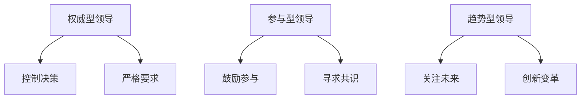

通过这个流程图，我们可以更直观地理解不同领导力的核心特点和适用场景。

---

## 第二部分：情商的深度探讨

### 第3章：情商的基本原理

情商（Emotional Intelligence，简称EQ）是指个体识别、理解、管理自己和他人情感的能力。与传统的智商（IQ）相比，情商在领导力中的作用越来越受到重视。本章节将深入探讨情商的定义、类型及其培养方法。

#### 3.1 情商的定义

情商的定义涉及多个维度，包括情感识别、理解、管理和运用。情商不仅仅关注个体的内在情感，还涉及到与他人的情感互动。

- **情商的定义**：情商是指个体识别、理解、管理和运用情感的能力，包括自我情感管理、他人情感识别和社交技能等方面。
- **情商与心理健康的联系**：高情商个体往往表现出较好的心理健康状态，包括自我认知、自我控制、社会能力和情感智力等方面。

#### 3.2 情商的类型

情商可以划分为四个基本类型，每种类型都有其特定的表现和作用。

- **自我情感管理**：这种情商类型涉及个体识别和接受自己的情感，并有效地管理自己的情绪和行为。
- **他人情感识别**：这种情商类型涉及个体理解和识别他人的情感状态，包括情绪识别和情绪理解。
- **社交技能**：这种情商类型涉及个体在社会交往中运用情感知识，建立和维护人际关系。
- **情感运用**：这种情商类型涉及个体将情感知识应用于决策和解决问题的过程中，包括情感智力和创造力。

为了更好地理解情商的四个类型，我们可以使用Mermaid流程图来展示它们之间的关系：

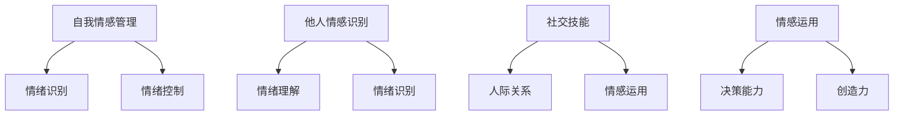

通过这个流程图，我们可以更清晰地看到情商的四个类型如何相互作用，共同影响个体的情感智力。

#### 3.3 情商的培养

情商并非与生俱来，它可以通过后天的培养和实践得到提升。以下是一些有效的情商培养方法：

- **自我反思**：通过自我反思，个体可以更好地了解自己的情感状态，并学会控制和管理自己的情绪。
- **情感识别练习**：通过情感识别练习，个体可以增强对自身和他人的情感识别能力。
- **社交技能训练**：通过社交技能训练，个体可以学会如何在社交场合中运用情感知识，建立和维护良好的人际关系。

在情商的培养过程中，我们可以使用以下Mermaid流程图来展示关键步骤：

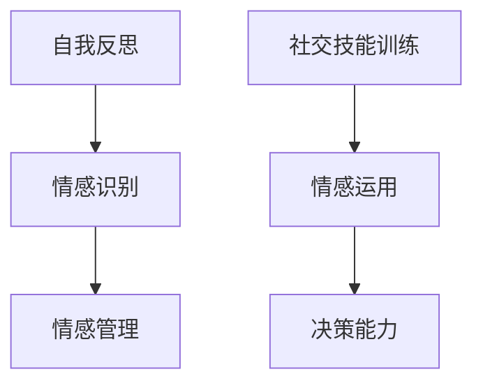

通过这个流程图，我们可以更直观地看到情商培养的步骤和关键环节。

---

## 第三部分：理解他人

### 第5章：心理学基础

心理学是研究人类行为和心理过程的科学，它在领导力与情商的实践中发挥着重要作用。本章节将介绍心理学的基本原理、人格特质以及人际关系，为理解他人提供理论基础。

#### 5.1 心理学的基本原理

心理学的基本原理包括认知、情感和行为三个方面。理解这些原理有助于领导者更好地理解他人的行为和心理。

- **认知**：认知是指个体获取、处理和应用信息的过程。认知原理包括注意力、记忆、思维和问题解决等。
- **情感**：情感是指个体对事件的感受和反应。情感原理包括情感的识别、表达和管理等。
- **行为**：行为是指个体在特定环境中的外部表现。行为原理包括行为模式、习惯和动机等。

为了更好地理解心理学的基本原理，我们可以使用以下Mermaid流程图：

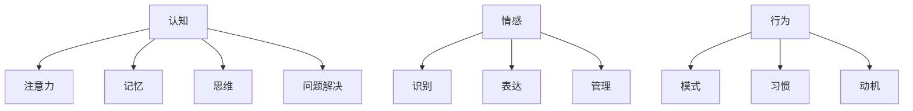

通过这个流程图，我们可以更清晰地看到心理学的基本原理及其相互关系。

#### 5.2 人格特质

人格特质是指个体相对稳定的心理特征，它影响个体的行为和情感。了解人格特质有助于领导者更好地理解他人，并采取相应的策略进行沟通和管理。

- **大五人格理论**：大五人格理论将人格分为五个维度：开放性、责任心、外向性、宜人性和神经质。每个维度都有其特定的特征和表现。

为了展示大五人格理论，我们可以使用以下Mermaid流程图：

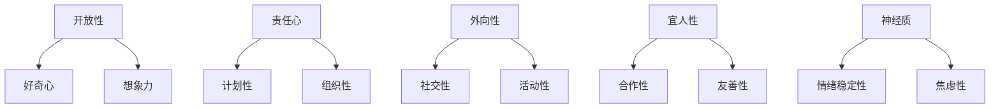

通过这个流程图，我们可以更直观地了解大五人格理论的五个维度及其特征。

#### 5.3 人际关系

人际关系是指个体之间的相互作用和影响。了解人际关系有助于领导者更好地管理团队，提升团队绩效。

- **人际关系的模型**：人际关系可以划分为多个模型，包括控制型、依赖型、合作型、竞争型和冲突型等。每种模型都有其特定的特征和作用。

为了展示人际关系模型，我们可以使用以下Mermaid流程图：

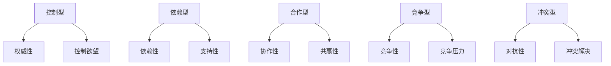

通过这个流程图，我们可以更清晰地了解人际关系模型及其特征。

---

## 第三部分：理解他人

### 第6章：影响他人的策略

在领导和管理中，理解他人并有效地影响他人是至关重要的。本章节将探讨两种关键策略：非暴力沟通技巧和情感驱动策略。

#### 6.1 非暴力沟通技巧

非暴力沟通（Non-Violent Communication，简称NVC）是一种以同情和理解为基础的沟通方法。它强调在沟通中保持诚实、尊重和同情，避免冲突和误解。

- **非暴力沟通的四个步骤**：

  1. **观察**：描述你所看到、听到、感受到的事实，避免评价和判断。
  2. **感受**：表达你的感受和需要，而不是指责或批评。
  3. **请求**：提出具体的请求，而不是命令或要求。
  4. **共鸣**：倾听对方的感受和需要，寻求共同点。

为了更好地理解非暴力沟通的四个步骤，我们可以使用以下Mermaid流程图：

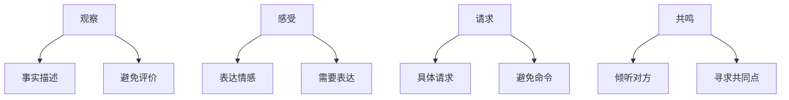

通过这个流程图，我们可以更直观地看到非暴力沟通的四个步骤及其要点。

#### 6.2 情感驱动策略

情感驱动策略是基于情感动机和需求来影响他人的一种方法。通过激发他人的情感，领导者可以更有效地实现目标。

- **情感驱动策略的设计**：

  1. **识别情感动机**：了解他人的情感动机，包括恐惧、希望、渴望和需求等。
  2. **构建情感桥梁**：通过故事、经历和情感体验建立与他人的情感联系。
  3. **激发情感反应**：使用视觉、听觉和触觉等感官刺激来激发他人的情感反应。
  4. **引导情感导向行为**：通过情感驱动策略，引导他人采取符合组织目标的行为。

为了展示情感驱动策略的设计，我们可以使用以下Mermaid流程图：

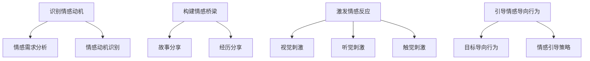

通过这个流程图，我们可以更清晰地看到情感驱动策略的设计步骤和关键环节。

#### 6.3 建立信任与支持

建立信任与支持是影响他人的关键。信任是一种情感的纽带，它能够促进团队合作和共同进步。

- **建立信任的方法**：

  1. **诚实与透明**：保持诚实，对他人透明，减少误解和猜疑。
  2. **一致性**：保持行为和言语的一致性，建立可靠的信任基础。
  3. **倾听与理解**：倾听他人的需求和意见，展示同理心和理解。
  4. **支持与鼓励**：在他人遇到困难时提供支持，鼓励他们克服挑战。

为了展示建立信任与支持的方法，我们可以使用以下Mermaid流程图：

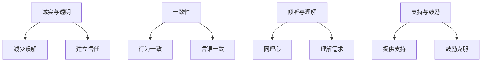

通过这个流程图，我们可以更直观地看到建立信任与支持的方法及其重要性。

---

## 第四部分：项目实战

### 第7章：领导力与情商在团队管理中的应用

团队管理是领导力与情商实践的重要领域。本章节将探讨领导力与情商在团队管理中的应用，包括团队建设策略、冲突处理和激励团队士气。

#### 7.1 团队建设的策略

团队建设是提升团队绩效和凝聚力的重要手段。有效的团队建设策略能够增强团队成员之间的信任和合作。

- **团队建设的策略**：

  1. **明确团队目标**：确保团队成员对团队目标有清晰的认识，并为之共同努力。
  2. **建立团队文化**：培育积极、健康和包容的团队文化，促进团队成员之间的合作。
  3. **加强沟通与协作**：建立有效的沟通渠道和协作机制，确保信息畅通和资源共享。
  4. **培养团队成员**：关注团队成员的个人成长和发展，提供必要的培训和指导。

为了展示团队建设的策略，我们可以使用以下Mermaid流程图：

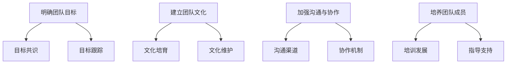

通过这个流程图，我们可以更直观地看到团队建设的策略及其关键环节。

#### 7.2 处理团队冲突

团队冲突是团队管理中常见的问题，有效的冲突处理能够降低冲突带来的负面影响，促进团队和谐。

- **处理团队冲突的方法**：

  1. **识别冲突类型**：了解冲突的起因和类型，包括目标冲突、资源冲突、价值观冲突等。
  2. **倾听与理解**：倾听双方的意见和立场，展示同理心和理解。
  3. **寻求共识**：通过对话和协商，寻求双方都能接受的解决方案。
  4. **建立规则**：制定明确的团队规则，防止类似冲突再次发生。

为了展示处理团队冲突的方法，我们可以使用以下Mermaid流程图：

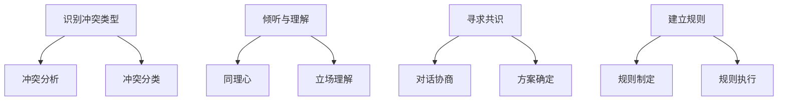

通过这个流程图，我们可以更直观地看到处理团队冲突的方法及其步骤。

#### 7.3 激励团队士气

激励团队士气是提升团队绩效和凝聚力的重要手段。有效的激励策略能够激发团队成员的积极性和创造力。

- **激励团队士气的方法**：

  1. **认可与奖励**：及时认可和奖励团队成员的成就和贡献，增强他们的自信心和动力。
  2. **目标设定**：与团队成员共同设定具有挑战性和可实现性的目标，激发他们的工作热情。
  3. **支持与鼓励**：在团队成员遇到困难时提供支持和鼓励，帮助他们克服挑战。
  4. **团队活动**：组织团队活动，增强团队成员之间的互动和凝聚力。

为了展示激励团队士气的方法，我们可以使用以下Mermaid流程图：

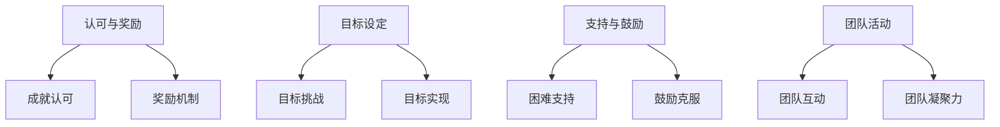

通过这个流程图，我们可以更直观地看到激励团队士气的方法及其步骤。

---

## 第四部分：项目实战

### 第8章：领导力与情商在实际工作中的应用

在实际工作中，领导力与情商的运用对于项目的成功至关重要。本章节将探讨领导力与情商在项目管理、客户服务和综合运用中的具体应用。

#### 8.1 领导力在项目管理中的应用

在项目管理中，领导力是确保项目成功的关键因素。有效的领导力能够协调团队成员，解决冲突，确保项目按时按质完成。

- **领导力在项目管理中的应用**：

  1. **项目规划**：作为领导者，需要制定详细的项目计划，明确项目目标、任务分配和时间安排。
  2. **团队协调**：领导者在项目执行过程中需要协调团队成员的工作，确保任务顺利进行。
  3. **问题解决**：当项目遇到问题时，领导者需要及时解决，确保项目不受影响。
  4. **风险管理**：领导者需要识别和评估项目风险，制定相应的风险应对策略。

为了展示领导力在项目管理中的应用，我们可以使用以下Mermaid流程图：

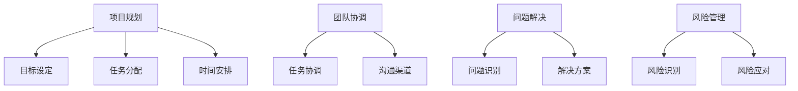

通过这个流程图，我们可以更直观地看到领导力在项目管理中的应用及其关键环节。

#### 8.2 情商在客户服务中的应用

在客户服务中，情商的运用能够提升客户满意度，增强客户忠诚度。

- **情商在客户服务中的应用**：

  1. **情感识别**：了解客户的情感需求，包括他们的期望、担忧和需求。
  2. **情感响应**：根据客户的情感需求，及时提供适当的情感支持和服务。
  3. **沟通技巧**：运用有效的沟通技巧，包括倾听、表达和理解，建立良好的客户关系。
  4. **问题解决**：在处理客户问题时，运用情感智慧，快速、有效地解决客户问题。

为了展示情商在客户服务中的应用，我们可以使用以下Mermaid流程图：

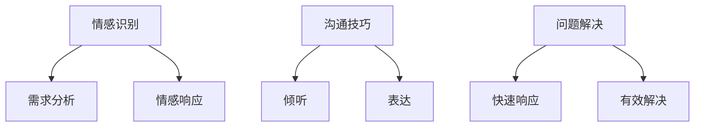

通过这个流程图，我们可以更直观地看到情商在客户服务中的应用及其关键环节。

#### 8.3 领导力与情商的综合运用

在实际工作中，领导力与情商的综合运用能够提升团队绩效，实现组织目标。

- **领导力与情商的综合运用**：

  1. **团队建设**：通过领导力和情商的运用，建立高效、和谐的团队。
  2. **冲突管理**：运用情商的技巧，有效处理团队冲突，维护团队稳定。
  3. **客户关系**：结合领导力和情商，提升客户满意度，增强客户忠诚度。
  4. **领导风格**：根据不同场景，灵活运用不同的领导风格，提升领导效果。

为了展示领导力与情商的综合运用，我们可以使用以下Mermaid流程图：

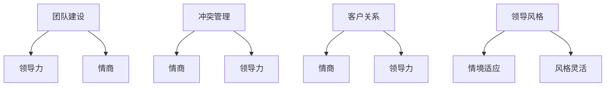

通过这个流程图，我们可以更直观地看到领导力与情商的综合运用及其关键环节。

---

## 第五部分：自我提升

### 第9章：领导力与情商的自我评估

自我评估是提升领导力与情商的重要步骤。通过自我评估，个体可以了解自己的优势和不足，并有针对性地进行提升。

#### 9.1 自我评估的方法

自我评估可以通过多种方法进行，包括自我反思、他人反馈和工具评估等。

- **自我评估的方法**：

  1. **自我反思**：通过回顾自己的行为和表现，识别自己的优势和不足。
  2. **他人反馈**：向同事、朋友或领导寻求反馈，了解他人对自己的评价。
  3. **工具评估**：使用专业的评估工具，如情商测试、领导力评估等，进行量化评估。

为了展示自我评估的方法，我们可以使用以下Mermaid流程图：

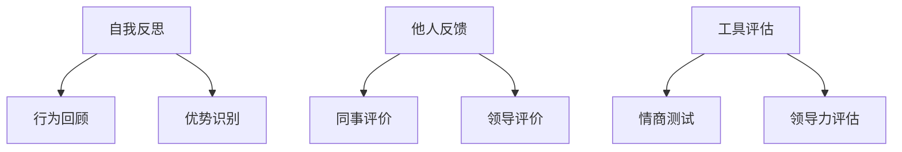

通过这个流程图，我们可以更直观地看到自我评估的方法及其步骤。

#### 9.2 自我提升的途径

自我提升需要持续的努力和正确的策略。以下是一些有效的自我提升途径：

- **自我提升的途径**：

  1. **学习与培训**：通过参加培训课程、阅读相关书籍和文章，提升自己的知识和技能。
  2. **实践与应用**：将所学知识应用于实际工作中，通过实践提升自己的能力。
  3. **反思与总结**：定期反思自己的行为和表现，总结经验教训，不断改进。
  4. **寻求指导**：向经验丰富的导师或领导寻求指导，获取宝贵的建议和反馈。

为了展示自我提升的途径，我们可以使用以下Mermaid流程图：

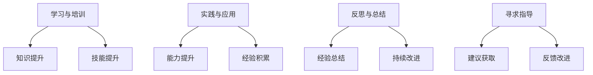

通过这个流程图，我们可以更直观地看到自我提升的途径及其步骤。

#### 9.3 持续学习的态度

持续学习是自我提升的关键。以下是一些培养持续学习态度的方法：

- **持续学习的态度**：

  1. **设定学习目标**：明确自己的学习目标和计划，确保学习有针对性和有效性。
  2. **保持好奇心**：保持对新知识的好奇心，不断探索和尝试。
  3. **积极参与**：积极参与培训课程、研讨会和学术交流，与他人分享和学习。
  4. **利用资源**：利用各种学习资源，如在线课程、专业书籍、学术论文等，丰富自己的知识储备。

为了展示持续学习的态度，我们可以使用以下Mermaid流程图：

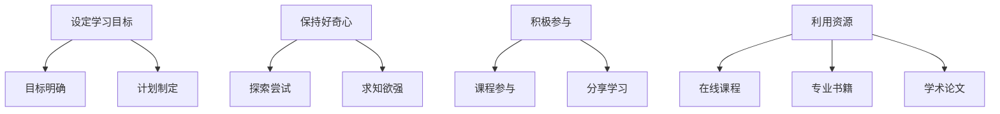

通过这个流程图，我们可以更直观地看到持续学习的态度及其方法。

---

## 第五部分：自我提升

### 第9章：领导力与情商的自我评估

在领导力与情商的持续发展过程中，自我评估是一个不可或缺的环节。它不仅有助于个体了解自身的优势和不足，还能够为后续的自我提升提供明确的指导。本章节将探讨自我评估的方法、自我提升的途径以及如何培养持续学习的态度。

#### 9.1 自我评估的方法

有效的自我评估方法能够帮助个体从不同角度审视自己的领导力与情商水平。

- **自我评估的方法**：

  1. **自我反思**：定期进行自我反思，回顾自己的行为和决策，分析成功和失败的原因。这种方法有助于个体深入了解自己的内在需求和外部表现。

  ```mermaid
  graph TD
      A[自我反思] --> B[行为回顾]
      A --> C[成功分析]
      A --> D[失败分析]
  ```

  2. **他人反馈**：向信任的同事、朋友或导师寻求反馈，了解他人对自己的看法。这种方法能够提供外部视角，帮助个体更全面地认识自己。

  ```mermaid
  graph TD
      E[他人反馈] --> F[同事评价]
      E --> G[朋友评价]
      E --> H[导师评价]
  ```

  3. **工具评估**：使用专业的领导力与情商评估工具，如情商测试、360度评估等，对个体进行量化评估。这种方法能够提供客观的数据支持，帮助个体了解自己在群体中的相对位置。

  ```mermaid
  graph TD
      I[工具评估] --> J[情商测试]
      I --> K[360度评估]
  ```

#### 9.2 自我提升的途径

自我提升是一个持续的过程，需要个体采取一系列有效的策略和行动。

- **自我提升的途径**：

  1. **学习与培训**：通过参加培训课程、研讨会和在线学习平台，获取新的知识和技能。这种方法能够帮助个体快速提升自身的专业素养。

  ```mermaid
  graph TD
      L[学习与培训] --> M[课程学习]
      L --> N[研讨会]
      L --> O[在线学习]
  ```

  2. **实践与应用**：将所学知识和技能应用于实际工作中，通过实践来巩固和提升自己的能力。这种方法能够帮助个体将理论知识转化为实际行动。

  ```mermaid
  graph TD
      P[实践与应用] --> Q[工作实践]
      P --> R[项目参与]
  ```

  3. **反思与总结**：定期进行反思和总结，从成功和失败中吸取教训，不断优化自己的行为和策略。这种方法能够帮助个体持续改进，提升自我。

  ```mermaid
  graph TD
      S[反思与总结] --> T[经验总结]
      S --> U[策略优化]
  ```

  4. **寻求指导**：向经验丰富的导师或领导寻求指导，获取宝贵的建议和反馈。这种方法能够帮助个体在短时间内获得有价值的经验和知识。

  ```mermaid
  graph TD
      V[寻求指导] --> W[导师指导]
      V --> X[领导反馈]
  ```

#### 9.3 持续学习的态度

持续学习是领导力与情商提升的关键。以下是一些培养持续学习态度的方法：

- **持续学习的态度**：

  1. **设定学习目标**：明确自己的学习目标和计划，确保学习有针对性和有效性。这种方法能够帮助个体保持学习的动力和方向。

  ```mermaid
  graph TD
      Y[设定学习目标] --> Z[目标明确]
      Y --> AA[计划制定]
  ```

  2. **保持好奇心**：对未知保持好奇，积极探索新的知识和领域。这种方法能够激发个体的学习兴趣，增强学习的主动性。

  ```mermaid
  graph TD
      BB[保持好奇心] --> CC[探索未知]
      BB --> DD[求知欲强]
  ```

  3. **积极参与**：积极参与各种学习活动，与他人分享和学习。这种方法能够拓宽个体的知识视野，提升学习效果。

  ```mermaid
  graph TD
      EE[积极参与] --> FF[课程参与]
      EE --> GG[研讨会]
      EE --> HH[学术交流]
  ```

  4. **利用资源**：充分利用各种学习资源，如在线课程、专业书籍、学术论文等。这种方法能够帮助个体获取丰富的知识，提升自身的知识储备。

  ```mermaid
  graph TD
      II[利用资源] --> JJ[在线课程]
      II --> KK[专业书籍]
      II --> LL[学术论文]
  ```

通过上述方法，个体可以逐步提升自己的领导力与情商，实现自我价值的最大化。持续学习和自我提升不仅能够提升个人的能力，还能够为团队和组织的发展贡献力量。

---

## 第五部分：自我提升

### 第9章：领导力与情商的自我评估

自我评估是领导力与情商发展的重要环节，它帮助个体识别自身优势和不足，从而制定有针对性的提升计划。以下将详细介绍自我评估的方法、自我提升的途径以及如何培养持续学习的态度。

#### 9.1 自我评估的方法

1. **自我反思**

   自我反思是一种深入自我分析的过程，有助于个体了解自身的思维模式、行为习惯和心理状态。以下步骤有助于有效进行自我反思：

   - **记录**：每天或每周记录自己的行为、情绪和想法，形成日志。
   - **分析**：定期回顾日志，分析自己在各种情境下的表现，识别成功和失败的共同点。
   - **总结**：总结反思结果，制定改进计划。

   ```mermaid
   graph TD
       A[记录] --> B[日志]
       B --> C[分析]
       C --> D[总结]
   ```

2. **他人反馈**

   他人反馈提供了一个外部视角，有助于个体更全面地认识自己。以下步骤有助于获取有效反馈：

   - **寻求**：主动向同事、朋友和导师寻求反馈。
   - **倾听**：认真倾听他人的意见，避免打断或辩解。
   - **反思**：根据反馈进行自我反思，识别他人的观点与自己看法的差异。

   ```mermaid
   graph TD
       E[寻求] --> F[反馈]
       F --> G[倾听]
       G --> H[反思]
   ```

3. **工具评估**

   使用专业的评估工具，如情商测试、360度评估等，能够提供量化的评估结果。以下步骤有助于进行工具评估：

   - **选择**：选择合适的评估工具。
   - **参与**：积极参与评估，如实作答。
   - **分析**：分析评估结果，识别自身的优势和不足。

   ```mermaid
   graph TD
       I[选择] --> J[评估工具]
       J --> K[参与]
       K --> L[分析]
   ```

#### 9.2 自我提升的途径

1. **学习与培训**

   学习与培训是提升领导力和情商的有效途径。以下步骤有助于进行学习和培训：

   - **规划**：制定学习计划，明确学习目标和内容。
   - **参与**：积极参加培训课程、研讨会和在线学习。
   - **实践**：将所学知识应用于实际工作中，通过实践巩固和提升能力。

   ```mermaid
   graph TD
       M[规划] --> N[学习计划]
       N --> O[培训参与]
       O --> P[实践应用]
   ```

2. **反思与总结**

   反思与总结有助于个体从经验中学习和成长。以下步骤有助于进行反思与总结：

   - **回顾**：定期回顾自己的行为和决策，分析成功和失败的原因。
   - **记录**：记录反思过程和结果，形成个人知识库。
   - **调整**：根据反思结果调整行为和策略，持续改进。

   ```mermaid
   graph TD
       Q[回顾] --> R[反思]
       R --> S[记录]
       S --> T[调整]
   ```

3. **寻求指导**

   寻求导师或领导的指导，有助于个体快速提升能力。以下步骤有助于寻求指导：

   - **选择**：选择经验丰富的导师或领导。
   - **沟通**：主动与导师或领导沟通，分享自己的困惑和疑问。
   - **反馈**：接受导师或领导的反馈，制定改进计划。

   ```mermaid
   graph TD
       U[选择] --> V[导师选择]
       V --> W[沟通]
       W --> X[反馈]
   ```

#### 9.3 持续学习的态度

持续学习是领导力和情商发展的基础。以下方法有助于培养持续学习的态度：

1. **设定目标**

   明确自己的学习目标，确保学习有针对性和方向性。以下步骤有助于设定目标：

   - **长远**：设定长期和短期目标，明确学习方向。
   - **具体**：将目标具体化，如学习某种技能或掌握某项知识。

   ```mermaid
   graph TD
       Y[长远目标] --> Z[短期目标]
       Y --> AA[具体目标]
   ```

2. **保持好奇心**

   对新知识和新领域保持好奇心，激发学习的兴趣和动力。以下步骤有助于保持好奇心：

   - **探索**：主动探索未知的领域，尝试新的学习方式。
   - **提问**：积极提问，解决学习过程中的困惑。

   ```mermaid
   graph TD
       BB[探索] --> CC[提问]
       BB --> DD[好奇心]
   ```

3. **积极参与**

   积极参与学习活动，与他人分享和交流，拓宽知识视野。以下步骤有助于积极参与：

   - **课程**：参加培训课程和研讨会，提升专业能力。
   - **交流**：参与学术交流，分享经验和见解。

   ```mermaid
   graph TD
       EE[课程参与] --> FF[学术交流]
       EE --> GG[分享经验]
   ```

4. **利用资源**

   充分利用各种学习资源，如在线课程、专业书籍、学术论文等，丰富自己的知识储备。以下步骤有助于利用资源：

   - **获取**：获取并阅读专业书籍和学术论文。
   - **应用**：将所学知识应用于实际工作中，提高实践能力。

   ```mermaid
   graph TD
       II[获取] --> JJ[阅读]
       JJ --> KK[应用]
   ```

通过以上方法，个体可以不断提升自己的领导力和情商，实现个人和职业发展的目标。

---

## 第五部分：自我提升

### 第9章：领导力与情商的自我评估

在个人和职业生涯的发展中，领导力与情商的自我评估是一个至关重要的步骤。它不仅有助于我们识别自身的优势和不足，还能为自我提升和职业发展提供明确的方向。以下，我们将详细介绍自我评估的方法、自我提升的途径以及如何培养持续学习的态度。

#### 9.1 自我评估的方法

自我评估是一个系统性的过程，包括自我反思、他人反馈和工具评估等多种方法。

1. **自我反思**

   自我反思是通过审视自己的行为、决策和反应来识别自身优势和不足。以下步骤有助于进行自我反思：

   - **记录**：每天或每周记录自己的行为、情绪和想法，形成个人日志。
   - **回顾**：定期回顾日志，分析自己在各种情境下的表现。
   - **总结**：总结反思结果，识别自己的优点和需要改进的地方。

   ```mermaid
   graph TD
       A[记录] --> B[日志]
       B --> C[回顾]
       C --> D[总结]
   ```

2. **他人反馈**

   他人反馈提供了外部视角，有助于我们更全面地了解自己。以下步骤有助于获取他人反馈：

   - **寻求**：主动向同事、朋友和家人寻求反馈。
   - **倾听**：认真倾听他人的意见，避免打断或辩解。
   - **反思**：根据他人反馈进行自我反思，识别他人的观点与自我认知的差异。

   ```mermaid
   graph TD
       E[寻求] --> F[反馈]
       F --> G[倾听]
       G --> H[反思]
   ```

3. **工具评估**

   使用专业的评估工具，如情商测试、360度评估等，可以帮助我们进行量化的自我评估。以下步骤有助于进行工具评估：

   - **选择**：选择合适的评估工具。
   - **参与**：积极参与评估，如实作答。
   - **分析**：分析评估结果，识别自身的优势和不足。

   ```mermaid
   graph TD
       I[选择] --> J[评估工具]
       J --> K[参与]
       K --> L[分析]
   ```

#### 9.2 自我提升的途径

自我提升是一个持续的过程，需要我们采取一系列有效的策略和行动。

1. **学习与培训**

   学习与培训是提升领导力和情商的有效途径。以下步骤有助于进行学习和培训：

   - **规划**：制定详细的学习计划，明确学习目标和内容。
   - **参与**：积极参加各种培训课程、研讨会和在线学习。
   - **实践**：将所学知识应用于实际工作中，通过实践巩固和提升能力。

   ```mermaid
   graph TD
       M[规划] --> N[学习计划]
       N --> O[培训参与]
       O --> P[实践应用]
   ```

2. **反思与总结**

   反思与总结有助于我们从经验中学习和成长。以下步骤有助于进行反思与总结：

   - **回顾**：定期回顾自己的行为和决策，分析成功和失败的原因。
   - **记录**：记录反思过程和结果，形成个人知识库。
   - **调整**：根据反思结果调整行为和策略，持续改进。

   ```mermaid
   graph TD
       Q[回顾] --> R[反思]
       R --> S[记录]
       S --> T[调整]
   ```

3. **寻求指导**

   寻求导师或领导的指导，有助于我们快速提升能力。以下步骤有助于寻求指导：

   - **选择**：选择经验丰富的导师或领导。
   - **沟通**：主动与导师或领导沟通，分享自己的困惑和疑问。
   - **反馈**：接受导师或领导的反馈，制定改进计划。

   ```mermaid
   graph TD
       U[选择] --> V[导师选择]
       V --> W[沟通]
       W --> X[反馈]
   ```

#### 9.3 持续学习的态度

持续学习是领导力和情商发展的基础。以下方法有助于培养持续学习的态度：

1. **设定目标**

   明确自己的学习目标，确保学习有针对性和方向性。以下步骤有助于设定目标：

   - **长远**：设定长期和短期目标，明确学习方向。
   - **具体**：将目标具体化，如学习某种技能或掌握某项知识。

   ```mermaid
   graph TD
       Y[长远目标] --> Z[短期目标]
       Y --> AA[具体目标]
   ```

2. **保持好奇心**

   对新知识和新领域保持好奇心，激发学习的兴趣和动力。以下步骤有助于保持好奇心：

   - **探索**：主动探索未知的领域，尝试新的学习方式。
   - **提问**：积极提问，解决学习过程中的困惑。

   ```mermaid
   graph TD
       BB[探索] --> CC[提问]
       BB --> DD[好奇心]
   ```

3. **积极参与**

   积极参与学习活动，与他人分享和交流，拓宽知识视野。以下步骤有助于积极参与：

   - **课程**：参加培训课程和研讨会，提升专业能力。
   - **交流**：参与学术交流，分享经验和见解。

   ```mermaid
   graph TD
       EE[课程参与] --> FF[学术交流]
       EE --> GG[分享经验]
   ```

4. **利用资源**

   充分利用各种学习资源，如在线课程、专业书籍、学术论文等，丰富自己的知识储备。以下步骤有助于利用资源：

   - **获取**：获取并阅读专业书籍和学术论文。
   - **应用**：将所学知识应用于实际工作中，提高实践能力。

   ```mermaid
   graph TD
       II[获取] --> JJ[阅读]
       JJ --> KK[应用]
   ```

通过以上方法，我们可以不断提升自己的领导力和情商，实现个人和职业发展的目标。

---

## 第五部分：自我提升

### 第9章：领导力与情商的自我评估

在个人和职业生涯的发展中，领导力与情商的自我评估是一个至关重要的步骤。它不仅有助于我们识别自身的优势和不足，还能为自我提升和职业发展提供明确的方向。以下，我们将详细介绍自我评估的方法、自我提升的途径以及如何培养持续学习的态度。

#### 9.1 自我评估的方法

自我评估是一个系统性的过程，包括自我反思、他人反馈和工具评估等多种方法。

1. **自我反思**

   自我反思是通过审视自己的行为、决策和反应来识别自身优势和不足。以下步骤有助于进行自我反思：

   - **记录**：每天或每周记录自己的行为、情绪和想法，形成个人日志。
   - **回顾**：定期回顾日志，分析自己在各种情境下的表现。
   - **总结**：总结反思结果，识别自己的优点和需要改进的地方。

   ```mermaid
   graph TD
       A[记录] --> B[日志]
       B --> C[回顾]
       C --> D[总结]
   ```

2. **他人反馈**

   他人反馈提供了外部视角，有助于我们更全面地了解自己。以下步骤有助于获取他人反馈：

   - **寻求**：主动向同事、朋友和家人寻求反馈。
   - **倾听**：认真倾听他人的意见，避免打断或辩解。
   - **反思**：根据他人反馈进行自我反思，识别他人的观点与自我认知的差异。

   ```mermaid
   graph TD
       E[寻求] --> F[反馈]
       F --> G[倾听]
       G --> H[反思]
   ```

3. **工具评估**

   使用专业的评估工具，如情商测试、360度评估等，可以帮助我们进行量化的自我评估。以下步骤有助于进行工具评估：

   - **选择**：选择合适的评估工具。
   - **参与**：积极参与评估，如实作答。
   - **分析**：分析评估结果，识别自身的优势和不足。

   ```mermaid
   graph TD
       I[选择] --> J[评估工具]
       J --> K[参与]
       K --> L[分析]
   ```

#### 9.2 自我提升的途径

自我提升是一个持续的过程，需要我们采取一系列有效的策略和行动。

1. **学习与培训**

   学习与培训是提升领导力和情商的有效途径。以下步骤有助于进行学习和培训：

   - **规划**：制定详细的学习计划，明确学习目标和内容。
   - **参与**：积极参加各种培训课程、研讨会和在线学习。
   - **实践**：将所学知识应用于实际工作中，通过实践巩固和提升能力。

   ```mermaid
   graph TD
       M[规划] --> N[学习计划]
       N --> O[培训参与]
       O --> P[实践应用]
   ```

2. **反思与总结**

   反思与总结有助于我们从经验中学习和成长。以下步骤有助于进行反思与总结：

   - **回顾**：定期回顾自己的行为和决策，分析成功和失败的原因。
   - **记录**：记录反思过程和结果，形成个人知识库。
   - **调整**：根据反思结果调整行为和策略，持续改进。

   ```mermaid
   graph TD
       Q[回顾] --> R[反思]
       R --> S[记录]
       S --> T[调整]
   ```

3. **寻求指导**

   寻求导师或领导的指导，有助于我们快速提升能力。以下步骤有助于寻求指导：

   - **选择**：选择经验丰富的导师或领导。
   - **沟通**：主动与导师或领导沟通，分享自己的困惑和疑问。
   - **反馈**：接受导师或领导的反馈，制定改进计划。

   ```mermaid
   graph TD
       U[选择] --> V[导师选择]
       V --> W[沟通]
       W --> X[反馈]
   ```

#### 9.3 持续学习的态度

持续学习是领导力和情商发展的基础。以下方法有助于培养持续学习的态度：

1. **设定目标**

   明确自己的学习目标，确保学习有针对性和方向性。以下步骤有助于设定目标：

   - **长远**：设定长期和短期目标，明确学习方向。
   - **具体**：将目标具体化，如学习某种技能或掌握某项知识。

   ```mermaid
   graph TD
       Y[长远目标] --> Z[短期目标]
       Y --> AA[具体目标]
   ```

2. **保持好奇心**

   对新知识和新领域保持好奇心，激发学习的兴趣和动力。以下步骤有助于保持好奇心：

   - **探索**：主动探索未知的领域，尝试新的学习方式。
   - **提问**：积极提问，解决学习过程中的困惑。

   ```mermaid
   graph TD
       BB[探索] --> CC[提问]
       BB --> DD[好奇心]
   ```

3. **积极参与**

   积极参与学习活动，与他人分享和交流，拓宽知识视野。以下步骤有助于积极参与：

   - **课程**：参加培训课程和研讨会，提升专业能力。
   - **交流**：参与学术交流，分享经验和见解。

   ```mermaid
   graph TD
       EE[课程参与] --> FF[学术交流]
       EE --> GG[分享经验]
   ```

4. **利用资源**

   充分利用各种学习资源，如在线课程、专业书籍、学术论文等，丰富自己的知识储备。以下步骤有助于利用资源：

   - **获取**：获取并阅读专业书籍和学术论文。
   - **应用**：将所学知识应用于实际工作中，提高实践能力。

   ```mermaid
   graph TD
       II[获取] --> JJ[阅读]
       JJ --> KK[应用]
   ```

通过以上方法，我们可以不断提升自己的领导力和情商，实现个人和职业发展的目标。

---

## 第五部分：自我提升

### 第9章：领导力与情商的自我评估

在个人和职业生涯的发展中，领导力与情商的自我评估是一个至关重要的步骤。它不仅有助于我们识别自身的优势和不足，还能为自我提升和职业发展提供明确的方向。以下，我们将详细介绍自我评估的方法、自我提升的途径以及如何培养持续学习的态度。

#### 9.1 自我评估的方法

自我评估是一个系统性的过程，包括自我反思、他人反馈和工具评估等多种方法。

1. **自我反思**

   自我反思是通过审视自己的行为、决策和反应来识别自身优势和不足。以下步骤有助于进行自我反思：

   - **记录**：每天或每周记录自己的行为、情绪和想法，形成个人日志。
   - **回顾**：定期回顾日志，分析自己在各种情境下的表现。
   - **总结**：总结反思结果，识别自己的优点和需要改进的地方。

   ```mermaid
   graph TD
       A[记录] --> B[日志]
       B --> C[回顾]
       C --> D[总结]
   ```

2. **他人反馈**

   他人反馈提供了外部视角，有助于我们更全面地了解自己。以下步骤有助于获取他人反馈：

   - **寻求**：主动向同事、朋友和家人寻求反馈。
   - **倾听**：认真倾听他人的意见，避免打断或辩解。
   - **反思**：根据他人反馈进行自我反思，识别他人的观点与自我认知的差异。

   ```mermaid
   graph TD
       E[寻求] --> F[反馈]
       F --> G[倾听]
       G --> H[反思]
   ```

3. **工具评估**

   使用专业的评估工具，如情商测试、360度评估等，可以帮助我们进行量化的自我评估。以下步骤有助于进行工具评估：

   - **选择**：选择合适的评估工具。
   - **参与**：积极参与评估，如实作答。
   - **分析**：分析评估结果，识别自身的优势和不足。

   ```mermaid
   graph TD
       I[选择] --> J[评估工具]
       J --> K[参与]
       K --> L[分析]
   ```

#### 9.2 自我提升的途径

自我提升是一个持续的过程，需要我们采取一系列有效的策略和行动。

1. **学习与培训**

   学习与培训是提升领导力和情商的有效途径。以下步骤有助于进行学习和培训：

   - **规划**：制定详细的学习计划，明确学习目标和内容。
   - **参与**：积极参加各种培训课程、研讨会和在线学习。
   - **实践**：将所学知识应用于实际工作中，通过实践巩固和提升能力。

   ```mermaid
   graph TD
       M[规划] --> N[学习计划]
       N --> O[培训参与]
       O --> P[实践应用]
   ```

2. **反思与总结**

   反思与总结有助于我们从经验中学习和成长。以下步骤有助于进行反思与总结：

   - **回顾**：定期回顾自己的行为和决策，分析成功和失败的原因。
   - **记录**：记录反思过程和结果，形成个人知识库。
   - **调整**：根据反思结果调整行为和策略，持续改进。

   ```mermaid
   graph TD
       Q[回顾] --> R[反思]
       R --> S[记录]
       S --> T[调整]
   ```

3. **寻求指导**

   寻求导师或领导的指导，有助于我们快速提升能力。以下步骤有助于寻求指导：

   - **选择**：选择经验丰富的导师或领导。
   - **沟通**：主动与导师或领导沟通，分享自己的困惑和疑问。
   - **反馈**：接受导师或领导的反馈，制定改进计划。

   ```mermaid
   graph TD
       U[选择] --> V[导师选择]
       V --> W[沟通]
       W --> X[反馈]
   ```

#### 9.3 持续学习的态度

持续学习是领导力和情商发展的基础。以下方法有助于培养持续学习的态度：

1. **设定目标**

   明确自己的学习目标，确保学习有针对性和方向性。以下步骤有助于设定目标：

   - **长远**：设定长期和短期目标，明确学习方向。
   - **具体**：将目标具体化，如学习某种技能或掌握某项知识。

   ```mermaid
   graph TD
       Y[长远目标] --> Z[短期目标]
       Y --> AA[具体目标]
   ```

2. **保持好奇心**

   对新知识和新领域保持好奇心，激发学习的兴趣和动力。以下步骤有助于保持好奇心：

   - **探索**：主动探索未知的领域，尝试新的学习方式。
   - **提问**：积极提问，解决学习过程中的困惑。

   ```mermaid
   graph TD
       BB[探索] --> CC[提问]
       BB --> DD[好奇心]
   ```

3. **积极参与**

   积极参与学习活动，与他人分享和交流，拓宽知识视野。以下步骤有助于积极参与：

   - **课程**：参加培训课程和研讨会，提升专业能力。
   - **交流**：参与学术交流，分享经验和见解。

   ```mermaid
   graph TD
       EE[课程参与] --> FF[学术交流]
       EE --> GG[分享经验]
   ```

4. **利用资源**

   充分利用各种学习资源，如在线课程、专业书籍、学术论文等，丰富自己的知识储备。以下步骤有助于利用资源：

   - **获取**：获取并阅读专业书籍和学术论文。
   - **应用**：将所学知识应用于实际工作中，提高实践能力。

   ```mermaid
   graph TD
       II[获取] --> JJ[阅读]
       JJ --> KK[应用]
   ```

通过以上方法，我们可以不断提升自己的领导力和情商，实现个人和职业发展的目标。

---

## 第五部分：自我提升

### 第9章：领导力与情商的自我评估

在个人和职业生涯的发展中，领导力与情商的自我评估是一个至关重要的步骤。它不仅有助于我们识别自身的优势和不足，还能为自我提升和职业发展提供明确的方向。以下，我们将详细介绍自我评估的方法、自我提升的途径以及如何培养持续学习的态度。

#### 9.1 自我评估的方法

自我评估是一个系统性的过程，包括自我反思、他人反馈和工具评估等多种方法。

1. **自我反思**

   自我反思是通过审视自己的行为、决策和反应来识别自身优势和不足。以下步骤有助于进行自我反思：

   - **记录**：每天或每周记录自己的行为、情绪和想法，形成个人日志。
   - **回顾**：定期回顾日志，分析自己在各种情境下的表现。
   - **总结**：总结反思结果，识别自己的优点和需要改进的地方。

   ```mermaid
   graph TD
       A[记录] --> B[日志]
       B --> C[回顾]
       C --> D[总结]
   ```

2. **他人反馈**

   他人反馈提供了外部视角，有助于我们更全面地了解自己。以下步骤有助于获取他人反馈：

   - **寻求**：主动向同事、朋友和家人寻求反馈。
   - **倾听**：认真倾听他人的意见，避免打断或辩解。
   - **反思**：根据他人反馈进行自我反思，识别他人的观点与自我认知的差异。

   ```mermaid
   graph TD
       E[寻求] --> F[反馈]
       F --> G[倾听]
       G --> H[反思]
   ```

3. **工具评估**

   使用专业的评估工具，如情商测试、360度评估等，可以帮助我们进行量化的自我评估。以下步骤有助于进行工具评估：

   - **选择**：选择合适的评估工具。
   - **参与**：积极参与评估，如实作答。
   - **分析**：分析评估结果，识别自身的优势和不足。

   ```mermaid
   graph TD
       I[选择] --> J[评估工具]
       J --> K[参与]
       K --> L[分析]
   ```

#### 9.2 自我提升的途径

自我提升是一个持续的过程，需要我们采取一系列有效的策略和行动。

1. **学习与培训**

   学习与培训是提升领导力和情商的有效途径。以下步骤有助于进行学习和培训：

   - **规划**：制定详细的学习计划，明确学习目标和内容。
   - **参与**：积极参加各种培训课程、研讨会和在线学习。
   - **实践**：将所学知识应用于实际工作中，通过实践巩固和提升能力。

   ```mermaid
   graph TD
       M[规划] --> N[学习计划]
       N --> O[培训参与]
       O --> P[实践应用]
   ```

2. **反思与总结**

   反思与总结有助于我们从经验中学习和成长。以下步骤有助于进行反思与总结：

   - **回顾**：定期回顾自己的行为和决策，分析成功和失败的原因。
   - **记录**：记录反思过程和结果，形成个人知识库。
   - **调整**：根据反思结果调整行为和策略，持续改进。

   ```mermaid
   graph TD
       Q[回顾] --> R[反思]
       R --> S[记录]
       S --> T[调整]
   ```

3. **寻求指导**

   寻求导师或领导的指导，有助于我们快速提升能力。以下步骤有助于寻求指导：

   - **选择**：选择经验丰富的导师或领导。
   - **沟通**：主动与导师或领导沟通，分享自己的困惑和疑问。
   - **反馈**：接受导师或领导的反馈，制定改进计划。

   ```mermaid
   graph TD
       U[选择] --> V[导师选择]
       V --> W[沟通]
       W --> X[反馈]
   ```

#### 9.3 持续学习的态度

持续学习是领导力和情商发展的基础。以下方法有助于培养持续学习的态度：

1. **设定目标**

   明确自己的学习目标，确保学习有针对性和方向性。以下步骤有助于设定目标：

   - **长远**：设定长期和短期目标，明确学习方向。
   - **具体**：将目标具体化，如学习某种技能或掌握某项知识。

   ```mermaid
   graph TD
       Y[长远目标] --> Z[短期目标]
       Y --> AA[具体目标]
   ```

2. **保持好奇心**

   对新知识和新领域保持好奇心，激发学习的兴趣和动力。以下步骤有助于保持好奇心：

   - **探索**：主动探索未知的领域，尝试新的学习方式。
   - **提问**：积极提问，解决学习过程中的困惑。

   ```mermaid
   graph TD
       BB[探索] --> CC[提问]
       BB --> DD[好奇心]
   ```

3. **积极参与**

   积极参与学习活动，与他人分享和交流，拓宽知识视野。以下步骤有助于积极参与：

   - **课程**：参加培训课程和研讨会，提升专业能力。
   - **交流**：参与学术交流，分享经验和见解。

   ```mermaid
   graph TD
       EE[课程参与] --> FF[学术交流]
       EE --> GG[分享经验]
   ```

4. **利用资源**

   充分利用各种学习资源，如在线课程、专业书籍、学术论文等，丰富自己的知识储备。以下步骤有助于利用资源：

   - **获取**：获取并阅读专业书籍和学术论文。
   - **应用**：将所学知识应用于实际工作中，提高实践能力。

   ```mermaid
   graph TD
       II[获取] --> JJ[阅读]
       JJ --> KK[应用]
   ```

通过以上方法，我们可以不断提升自己的领导力和情商，实现个人和职业发展的目标。

---

## 第五部分：自我提升

### 第9章：领导力与情商的自我评估

在个人和职业生涯的发展中，领导力与情商的自我评估是一个至关重要的步骤。它不仅有助于我们识别自身的优势和不足，还能为自我提升和职业发展提供明确的方向。以下，我们将详细介绍自我评估的方法、自我提升的途径以及如何培养持续学习的态度。

#### 9.1 自我评估的方法

自我评估是一个系统性的过程，包括自我反思、他人反馈和工具评估等多种方法。

1. **自我反思**

   自我反思是通过审视自己的行为、决策和反应来识别自身优势和不足。以下步骤有助于进行自我反思：

   - **记录**：每天或每周记录自己的行为、情绪和想法，形成个人日志。
   - **回顾**：定期回顾日志，分析自己在各种情境下的表现。
   - **总结**：总结反思结果，识别自己的优点和需要改进的地方。

   ```mermaid
   graph TD
       A[记录] --> B[日志]
       B --> C[回顾]
       C --> D[总结]
   ```

2. **他人反馈**

   他人反馈提供了外部视角，有助于我们更全面地了解自己。以下步骤有助于获取他人反馈：

   - **寻求**：主动向同事、朋友和家人寻求反馈。
   - **倾听**：认真倾听他人的意见，避免打断或辩解。
   - **反思**：根据他人反馈进行自我反思，识别他人的观点与自我认知的差异。

   ```mermaid
   graph TD
       E[寻求] --> F[反馈]
       F --> G[倾听]
       G --> H[反思]
   ```

3. **工具评估**

   使用专业的评估工具，如情商测试、360度评估等，可以帮助我们进行量化的自我评估。以下步骤有助于进行工具评估：

   - **选择**：选择合适的评估工具。
   - **参与**：积极参与评估，如实作答。
   - **分析**：分析评估结果，识别自身的优势和不足。

   ```mermaid
   graph TD
       I[选择] --> J[评估工具]
       J --> K[参与]
       K --> L[分析]
   ```

#### 9.2 自我提升的途径

自我提升是一个持续的过程，需要我们采取一系列有效的策略和行动。

1. **学习与培训**

   学习与培训是提升领导力和情商的有效途径。以下步骤有助于进行学习和培训：

   - **规划**：制定详细的学习计划，明确学习目标和内容。
   - **参与**：积极参加各种培训课程、研讨会和在线学习。
   - **实践**：将所学知识应用于实际工作中，通过实践巩固和提升能力。

   ```mermaid
   graph TD
       M[规划] --> N[学习计划]
       N --> O[培训参与]
       O --> P[实践应用]
   ```

2. **反思与总结**

   反思与总结有助于我们从经验中学习和成长。以下步骤有助于进行反思与总结：

   - **回顾**：定期回顾自己的行为和决策，分析成功和失败的原因。
   - **记录**：记录反思过程和结果，形成个人知识库。
   - **调整**：根据反思结果调整行为和策略，持续改进。

   ```mermaid
   graph TD
       Q[回顾] --> R[反思]
       R --> S[记录]
       S --> T[调整]
   ```

3. **寻求指导**

   寻求导师或领导的指导，有助于我们快速提升能力。以下步骤有助于寻求指导：

   - **选择**：选择经验丰富的导师或领导。
   - **沟通**：主动与导师或领导沟通，分享自己的困惑和疑问。
   - **反馈**：接受导师或领导的反馈，制定改进计划。

   ```mermaid
   graph TD
       U[选择] --> V[导师选择]
       V --> W[沟通]
       W --> X[反馈]
   ```

#### 9.3 持续学习的态度

持续学习是领导力和情商发展的基础。以下方法有助于培养持续学习的态度：

1. **设定目标**

   明确自己的学习目标，确保学习有针对性和方向性。以下步骤有助于设定目标：

   - **长远**：设定长期和短期目标，明确学习方向。
   - **具体**：将目标具体化，如学习某种技能或掌握某项知识。

   ```mermaid
   graph TD
       Y[长远目标] --> Z[短期目标]
       Y --> AA[具体目标]
   ```

2. **保持好奇心**

   对新知识和新领域保持好奇心，激发学习的兴趣和动力。以下步骤有助于保持好奇心：

   - **探索**：主动探索未知的领域，尝试新的学习方式。
   - **提问**：积极提问，解决学习过程中的困惑。

   ```mermaid
   graph TD
       BB[探索] --> CC[提问]
       BB --> DD[好奇心]
   ```

3. **积极参与**

   积极参与学习活动，与他人分享和交流，拓宽知识视野。以下步骤有助于积极参与：

   - **课程**：参加培训课程和研讨会，提升专业能力。
   - **交流**：参与学术交流，分享经验和见解。

   ```mermaid
   graph TD
       EE[课程参与] --> FF[学术交流]
       EE --> GG[分享经验]
   ```

4. **利用资源**

   充分利用各种学习资源，如在线课程、专业书籍、学术论文等，丰富自己的知识储备。以下步骤有助于利用资源：

   - **获取**：获取并阅读专业书籍和学术论文。
   - **应用**：将所学知识应用于实际工作中，提高实践能力。

   ```mermaid
   graph TD
       II[获取] --> JJ[阅读]
       JJ --> KK[应用]
   ```

通过以上方法，我们可以不断提升自己的领导力和情商，实现个人和职业发展的目标。

---

## 第五部分：自我提升

### 第9章：领导力与情商的自我评估

在个人和职业生涯的发展中，领导力与情商的自我评估是一个至关重要的步骤。它不仅有助于我们识别自身的优势和不足，还能为自我提升和职业发展提供明确的方向。以下，我们将详细介绍自我评估的方法、自我提升的途径以及如何培养持续学习的态度。

#### 9.1 自我评估的方法

自我评估是一个系统性的过程，包括自我反思、他人反馈和工具评估等多种方法。

1. **自我反思**

   自我反思是通过审视自己的行为、决策和反应来识别自身优势和不足。以下步骤有助于进行自我反思：

   - **记录**：每天或每周记录自己的行为、情绪和想法，形成个人日志。
   - **回顾**：定期回顾日志，分析自己在各种情境下的表现。
   - **总结**：总结反思结果，识别自己的优点和需要改进的地方。

   ```mermaid
   graph TD
       A[记录] --> B[日志]
       B --> C[回顾]
       C --> D[总结]
   ```

2. **他人反馈**

   他人反馈提供了外部视角，有助于我们更全面地了解自己。以下步骤有助于获取他人反馈：

   - **寻求**：主动向同事、朋友和家人寻求反馈。
   - **倾听**：认真倾听他人的意见，避免打断或辩解。
   - **反思**：根据他人反馈进行自我反思，识别他人的观点与自我认知的差异。

   ```mermaid
   graph TD
       E[寻求] --> F[反馈]
       F --> G[倾听]
       G --> H[反思]
   ```

3. **工具评估**

   使用专业的评估工具，如情商测试、360度评估等，可以帮助我们进行量化的自我评估。以下步骤有助于进行工具评估：

   - **选择**：选择合适的评估工具。
   - **参与**：积极参与评估，如实作答。
   - **分析**：分析评估结果，识别自身的优势和不足。

   ```mermaid
   graph TD
       I[选择] --> J[评估工具]
       J --> K[参与]
       K --> L[分析]
   ```

#### 9.2 自我提升的途径

自我提升是一个持续的过程，需要我们采取一系列有效的策略和行动。

1. **学习与培训**

   学习与培训是提升领导力和情商的有效途径。以下步骤有助于进行学习和培训：

   - **规划**：制定详细的学习计划，明确学习目标和内容。
   - **参与**：积极参加各种培训课程、研讨会和在线学习。
   - **实践**：将所学知识应用于实际工作中，通过实践巩固和提升能力。

   ```mermaid
   graph TD
       M[规划] --> N[学习计划]
       N --> O[培训参与]
       O --> P[实践应用]
   ```

2. **反思与总结**

   反思与总结有助于我们从经验中学习和成长。以下步骤有助于进行反思与总结：

   - **回顾**：定期回顾自己的行为和决策，分析成功和失败的原因。
   - **记录**：记录反思过程和结果，形成个人知识库。
   - **调整**：根据反思结果调整行为和策略，持续改进。

   ```mermaid
   graph TD
       Q[回顾] --> R[反思]
       R --> S[记录]
       S --> T[调整]
   ```

3. **寻求指导**

   寻求导师或领导的指导，有助于我们快速提升能力。以下步骤有助于寻求指导：

   - **选择**：选择经验丰富的导师或领导。
   - **沟通**：主动与导师或领导沟通，分享自己的困惑和疑问。
   - **反馈**：接受导师或领导的反馈，制定改进计划。

   ```mermaid
   graph TD
       U[选择] --> V[导师选择]
       V --> W[沟通]
       W --> X[反馈]
   ```

#### 9.3 持续学习的态度

持续学习是领导力和情商发展的基础。以下方法有助于培养持续学习的态度：

1. **设定目标**

   明确自己的学习目标，确保学习有针对性和方向性。以下步骤有助于设定目标：

   - **长远**：设定长期和短期目标，明确学习方向。
   - **具体**：将目标具体化，如学习某种技能或掌握某项知识。

   ```mermaid
   graph TD
       Y[长远目标] --> Z[短期目标]
       Y --> AA[具体目标]
   ```

2. **保持好奇心**

   对新知识和新领域保持好奇心，激发学习的兴趣和动力。以下步骤有助于保持好奇心：

   - **探索**：主动探索未知的领域，尝试新的学习方式。
   - **提问**：积极提问，解决学习过程中的困惑。

   ```mermaid
   graph TD
       BB[探索] --> CC[提问]
       BB --> DD[好奇心]
   ```

3. **积极参与**

   积极参与学习活动，与他人分享和交流，拓宽知识视野。以下步骤有助于积极参与：

   - **课程**：参加培训课程和研讨会，提升专业能力。
   - **交流**：参与学术交流，分享经验和见解。

   ```mermaid
   graph TD
       EE[课程参与] --> FF[学术交流]
       EE --> GG[分享经验]
   ```

4. **利用资源**

   充分利用各种学习资源，如在线课程、专业书籍、学术论文等，丰富自己的知识储备。以下步骤有助于利用资源：

   - **获取**：获取并阅读专业书籍和学术论文。
   - **应用**：将所学知识应用于实际工作中，提高实践能力。

   ```mermaid
   graph TD
       II[获取] --> JJ[阅读]
       JJ --> KK[应用]
   ```

通过以上方法，我们可以不断提升自己的领导力和情商，实现个人和职业发展的目标。

---

## 附录

### 附录A：推荐阅读书目

1. 《情商：为什么情商比智商更重要》（丹尼尔·戈尔曼著）
2. 《非暴力沟通》（马歇尔·卢森堡著）
3. 《领导力与决策》（赫伯特·西蒙著）
4. 《如何赢得朋友与影响他人》（戴尔·卡耐基著）
5. 《第五项修炼：学习型组织的艺术与实务》（彼得·圣吉著）

### 附录B：领导力与情商相关资源

1. [情商测试](https://www.emotionalintelligencequotient.org/)
2. [非暴力沟通训练](https://www.nonviolentcommunication.com/)
3. [领导力发展课程](https://www.leadervault.com/)
4. [心理学在线资源库](https://www.psychologytoday.com/)
5. [在线学习平台](https://www.udemy.com/)

## 后记

在撰写《领导力与情商：理解并影响他人的能力》的过程中，我们深入探讨了领导力和情商的核心概念、相互关系以及实际应用。通过系统的分析和案例研究，我们希望读者能够对领导力和情商有更深入的理解，并能够将其应用于个人和职业发展。

领导力和情商不仅是个体成功的关键，也是团队和组织发展的基石。我们鼓励读者在阅读本文后，结合自身实际情况，进行自我评估和反思，并采取积极的行动提升自己的领导力和情商。

在快速变化的社会和职场环境中，持续学习和自我提升是每个成功领导者不可或缺的品质。我们希望本文能够成为读者在领导力和情商发展道路上的一个有益的指南。

最后，感谢您花时间阅读本文。我们期待您的反馈和建议，以便我们不断改进和完善我们的内容。愿领导力和情商的智慧，助力您在个人和职业道路上取得更加辉煌的成就。

作者：AI天才研究院/AI Genius Institute & 禅与计算机程序设计艺术 /Zen And The Art of Computer Programming

