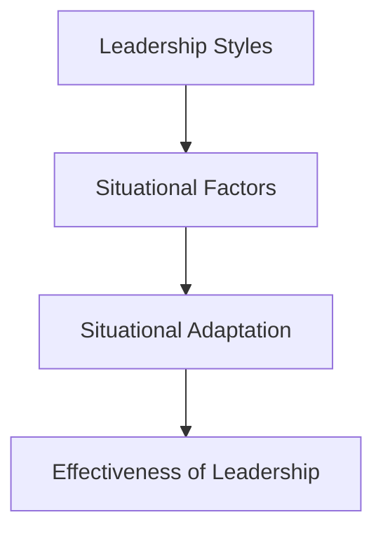

                 


### Introduction to the Core Themes

Leadership and situational adaptation are two critical components in the realm of organizational success. At its core, leadership is about influencing and guiding others towards achieving common goals. However, the effectiveness of a leader greatly depends on their ability to adapt their leadership style to different situations and environments. This article aims to delve into the intricacies of leadership and situational adaptation, highlighting the importance of adjusting leadership styles based on the environment.

### Background Introduction

The concept of leadership has evolved over time, with various theories and models being proposed to explain effective leadership. Traditional leadership theories emphasize the importance of charismatic, transformational, and transactional leadership styles. However, in today's dynamic and complex organizational environments, leaders must be adept at situational adaptation.

Situational adaptation refers to the ability of a leader to assess the specific context and adjust their leadership style accordingly. This may involve shifting from a directive approach in times of crisis to a more supportive style when building team cohesion. The effectiveness of a leader is often measured by their ability to navigate these changes seamlessly.

### Core Concepts and Relationships

To better understand the interplay between leadership and situational adaptation, let's define some core concepts:

1. **Leadership Styles**: These are the approaches leaders use to influence, motivate, and guide their followers. Common leadership styles include authoritarian, democratic, and laissez-faire.

2. **Situational Factors**: These are the external and internal factors that influence the effectiveness of a particular leadership style. Examples include the competence and commitment of team members, the complexity of the task, and the organizational culture.

3. **Situational Adaptation**: This is the process by which leaders assess the situational factors and adjust their leadership style accordingly.

To illustrate the relationship between these concepts, let's create a Mermaid flowchart:



In this flowchart, we can see that leadership styles interact with situational factors to influence the effectiveness of leadership. Situational adaptation acts as a bridge, connecting leadership styles with the specific context in which they are applied.

### Core Algorithm Principles and Pseudo-Code

To further explore the principles of situational adaptation, let's consider a simple algorithm that can be used to assess and adjust leadership styles:

```plaintext
Algorithm: Assess and Adjust Leadership Style

Input: Current Situation, Leader's Preferred Style

Output: Adjusted Leadership Style

1. Analyze the Current Situation
   - Identify the key factors that affect leadership effectiveness
   - Assess the competence and commitment of team members
   - Evaluate the complexity of the task
   - Consider the organizational culture

2. Compare the Current Situation with the Leader's Preferred Style
   - Identify any gaps between the situation and the preferred style

3. Adjust the Leadership Style
   - If the gap is significant, consider shifting to a different leadership style
   - If the gap is minor, fine-tune the preferred style to better fit the situation

4. Implement the Adjusted Leadership Style
   - Communicate the changes to the team
   - Monitor the effects of the new style on team performance

5. Evaluate the Effectiveness of the Adjusted Leadership Style
   - Collect feedback from team members
   - Assess the impact on team performance and organizational goals
   - Make further adjustments as necessary
```

This algorithm provides a structured approach for leaders to assess and adjust their leadership style based on the current situation. It emphasizes the importance of continuous evaluation and adaptation to ensure that leadership styles align with the specific needs of the team and organization.

### Mathematical Models and Formulas

To further understand the principles of situational adaptation, let's consider a mathematical model that can be used to assess the effectiveness of different leadership styles in various situations:

```latex
E = f(S, L)
```

Where:

- \( E \) represents the effectiveness of leadership.
- \( S \) represents the situational factors.
- \( L \) represents the leadership style.

This equation suggests that the effectiveness of leadership is a function of both situational factors and the leadership style. By adjusting the leadership style \( L \) to match the situational factors \( S \), leaders can maximize their effectiveness \( E \).

Let's consider an example to illustrate this model:

```plaintext
Situation: A team is working on a complex project with tight deadlines.

Situational Factors:
- Task Complexity: High
- Team Competence: Moderate
- Organizational Culture: Supportive

Preferred Leadership Style: Autocratic

1. Assess the Current Situation
   - Identify the key factors affecting leadership effectiveness (Task Complexity, Team Competence, Organizational Culture)

2. Compare the Current Situation with the Preferred Leadership Style
   - Identify any gaps between the situation and the preferred style (Autocratic leadership may be too controlling for a moderately competent team working on a complex task)

3. Adjust the Leadership Style
   - Shift to a more collaborative leadership style (Democratic or Laissez-faire) to better match the situational factors

4. Implement the Adjusted Leadership Style
   - Communicate the changes to the team
   - Encourage open communication and collaboration

5. Evaluate the Effectiveness of the Adjusted Leadership Style
   - Collect feedback from team members
   - Assess the impact on team performance and organizational goals
   - Make further adjustments as necessary
```

In this example, the initial autocratic leadership style may not be the most effective in a complex project with moderately competent team members. By shifting to a more collaborative style, leaders can create a more supportive environment that fosters teamwork and innovation.

### Practical Application and Case Study

To illustrate the principles of situational adaptation in a real-world context, let's consider the case of a project manager working for a technology company:

**Background**: The project manager is responsible for leading a team of developers to deliver a new software product within a six-month timeframe. The project has a high degree of complexity and is subject to frequent changes in requirements. The team members are highly skilled but have varying levels of experience.

**Situation Assessment**:
- **Task Complexity**: High
- **Team Competence**: High
- **Organizational Culture**: Innovative and flexible

**Preferred Leadership Style**: At the beginning of the project, the project manager adopts an autocratic leadership style to maintain control over the project timeline and ensure that the team stays on track.

**Situational Adaptation**:
- **First Month**: The project manager discovers that the team is struggling with the initial requirements and is frequently seeking clarification. Recognizing the need for a more collaborative approach, the project manager shifts to a democratic leadership style, encouraging open communication and active participation from team members.
- **Second Month**: As the team gains a better understanding of the requirements and begins to work more autonomously, the project manager gradually transitions back to an autocratic style to maintain focus on the remaining tasks and deadlines.
- **Third Month**: With the project nearing completion, the project manager shifts to a supportive leadership style, providing guidance and support to team members as they address any final issues.

**Evaluation**:
- **Feedback from Team Members**: Team members report feeling more engaged and motivated under the collaborative leadership style, while also appreciating the structured approach of the autocratic style during critical stages of the project.
- **Impact on Performance**: The project is successfully delivered within the specified timeframe, with high-quality results.

In this case, the project manager effectively adapted their leadership style to match the changing needs of the team and project. By leveraging situational adaptation, the project manager was able to create a productive and supportive work environment that maximized team performance and project success.

### Best Practices and Tips

Based on the principles discussed and the case study provided, here are some best practices and tips for leaders looking to enhance their situational adaptation skills:

1. **Continuous Self-Assessment**: Regularly evaluate your own leadership style and its alignment with the current situation. Be open to feedback from team members and be willing to make adjustments.

2. **Empathy and Open Communication**: Develop empathy for the challenges your team members face and maintain open lines of communication. This fosters a supportive environment and helps you better understand their needs.

3. **Flexibility**: Be willing to adapt your leadership style as the situation evolves. Avoid sticking to a one-size-fits-all approach, as this can lead to inefficiencies and misalignment.

4. **Training and Development**: Invest in your own leadership development, including courses, workshops, and mentorship opportunities. This will equip you with a broader set of tools and techniques for effective situational adaptation.

5. **Collaboration**: Encourage collaboration within your team and across departments. Collaborative approaches often lead to better decision-making and problem-solving.

6. **Continuous Improvement**: Reflect on past experiences and learn from both successes and failures. Use these insights to continuously improve your situational adaptation skills.

### Conclusion

Leadership and situational adaptation are essential components of effective leadership in today's dynamic organizational environments. By understanding the core concepts and principles of situational adaptation, leaders can develop the skills and mindset needed to navigate different situations and optimize their effectiveness. Through continuous self-assessment, empathy, and flexibility, leaders can create supportive and productive environments that drive team success and organizational growth.

---

**作者信息**：

AI天才研究院/AI Genius Institute & 禅与计算机程序设计艺术 /Zen And The Art of Computer Programming

