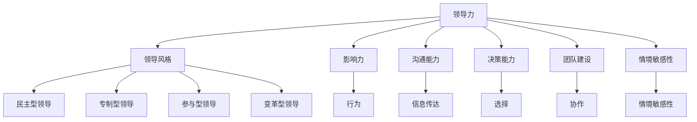
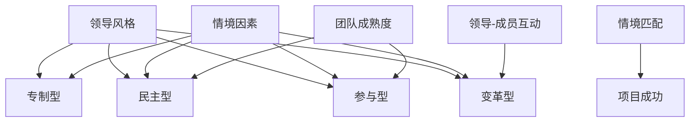
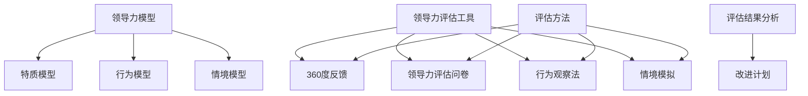
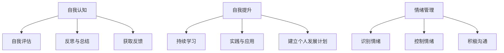
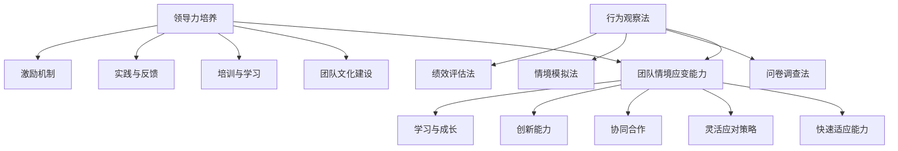
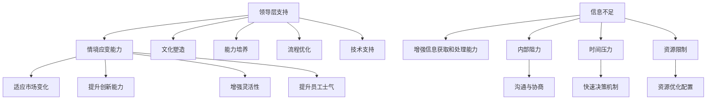
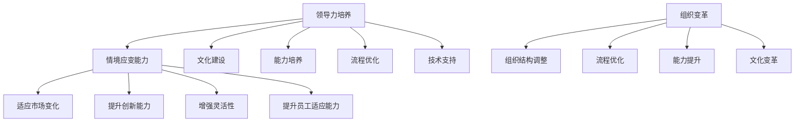

                 

### 概述

《领导力与情境应变：灵活应对不同情境》是一本专为探讨领导力在复杂多变环境中的应用而设计的书籍。书中的核心目标是帮助读者理解领导力的本质，掌握在不同情境下灵活应对的策略，并提升自身的领导力和情境应变能力。

#### 关键词

- **领导力**
- **情境应变**
- **灵活应对**
- **复杂情境**
- **团队管理**
- **组织变革**

#### 摘要

本书分为三个主要部分，分别从基础理论、能力建设到实际应用对领导力与情境应变进行深入探讨。第一部分详细介绍了领导力的起源、演变以及核心要素，帮助读者建立对领导力的全面理解。第二部分重点阐述情境应变的基本概念、分析方法以及应对策略，通过具体案例和实践指导，让读者掌握情境应变的方法和技巧。第三部分结合实际应用，探讨了领导力与情境应变在组织变革、团队管理和项目管理中的重要性，提供了实用的实践指导。

本文将逐步分析领导力的基本理论，深入探讨情境应变的原理与方法，并结合实际案例，展示如何灵活应对不同情境，从而提升领导者的整体素质和团队的管理效能。通过这篇文章，读者将能够系统地了解领导力与情境应变的重要性，以及如何在复杂多变的环境中有效应用这些策略。

### 第一部分：领导力基础理论

领导力，作为一个历史悠久且不断发展的概念，其定义和内涵在不同领域和学者间存在一定的差异。但总体而言，领导力可以理解为一种能够激发、影响和引导他人达成共同目标的能力。在组织和管理学中，领导力被视为一个关键因素，对团队效能和组织发展具有深远影响。

#### 1.1 领导力的定义与类型

领导力的定义多种多样，根据领导行为学派的定义，领导力是指领导者在特定情境下，通过影响他人来实现组织目标的能力。而变革领导理论则强调领导者在组织变革过程中的重要作用。除此之外，还有权变领导理论、情境领导理论等多种不同的领导力定义。

领导力的类型可以根据不同的分类标准进行划分。从领导风格来看，领导力可分为民主型领导、专制型领导、参与型领导和变革型领导等。民主型领导注重团队成员的参与和反馈，专制型领导则更多依靠权威决策，参与型领导强调合作与共识，而变革型领导则致力于推动组织变革和创新。

#### 1.2 领导力的核心要素

领导力的核心要素包括：

- **影响力**：领导者需要具备强大的影响力，能够通过言语和行为引导团队成员。

- **沟通能力**：良好的沟通能力是领导力的关键，领导者需要能够清晰、有效地传达信息和指令。

- **决策能力**：决策能力是领导者必须具备的另一重要素质，能够在复杂多变的环境中做出明智的选择。

- **团队建设**：领导者需致力于团队建设，培养团队协作精神和凝聚力。

- **情境敏感性**：领导者需要具备高度情境敏感性，能够根据不同情境调整领导策略。

#### 1.3 领导力的发展历程

领导力的发展历程可以追溯到古代的军事领导和管理理论。在古代，领导力主要依赖于权威和武力，随着社会的进步，领导力理论逐渐演变和丰富。

- **早期领导理论**：从20世纪初开始，领导理论逐渐形成。早期领导理论主要关注领导者的个人特质和性格特征，如特质理论。

- **行为理论**：20世纪中叶，行为理论兴起，开始关注领导者的行为模式。行为理论强调领导者通过具体的行为方式影响团队。

- **情境理论**：随着对领导情境的深入研究，情境理论成为领导力研究的一个重要方向。情境理论认为领导力是情境依赖的，不同的情境需要不同的领导策略。

- **现代领导理论**：现代领导理论整合了前人的研究成果，更加注重领导者的全面发展，包括领导风格、情境敏感性、团队建设等方面。

#### 核心概念与联系

为了更好地理解领导力的核心概念和它们之间的关系，我们可以借助 Mermaid 流程图来展示这些概念之间的相互关系。

从上述 Mermaid 流程图中可以看出，领导力涵盖了多个核心要素，这些要素相互关联，共同作用于领导行为。领导风格、影响力、沟通能力、决策能力、团队建设和情境敏感性是领导力的关键组成部分，它们在不同情境下相互影响，共同决定领导者的效能。

通过这一节的内容，我们初步了解了领导力的基本理论，明确了领导力的定义、核心要素以及其发展历程。在接下来的章节中，我们将深入探讨领导风格与情境匹配、领导力模型与评估，以及领导力的个人发展等方面，帮助读者更全面地理解领导力在实践中的应用。

### 第2章：领导风格与情境匹配

领导风格是领导者与团队成员互动的基本方式，不同的领导风格对团队的影响各不相同。领导风格与情境匹配理论认为，一个有效的领导者需要根据不同的情境选择合适的领导风格。在这一章中，我们将详细介绍领导风格的分类、情境匹配的理论基础，并通过实际案例探讨领导风格与情境匹配的应用。

#### 2.1 领导风格的分类

领导风格可以分为多种类型，常见的分类方法包括：

- **专制型领导**：领导者做出决策，团队成员被动执行。这种风格适用于需要迅速决策且团队成员技能不足的情境。

- **民主型领导**：团队成员参与决策过程，领导者更多起到协调和引导作用。这种风格适用于需要团队协作和创新的项目。

- **参与型领导**：领导者与团队成员共同制定决策，强调团队合作和共识。这种风格适用于复杂项目和需要持续改进的情境。

- **变革型领导**：领导者通过激发团队成员的潜能，推动组织变革和创新。这种风格适用于需要大规模变革和突破的情境。

#### 2.2 领导风格与情境匹配的理论基础

领导风格与情境匹配的理论基础包括以下几个方面：

- **权变理论**：权变理论认为，领导风格的有效性取决于情境因素。不同的情境需要不同的领导风格，没有一种领导风格适用于所有情境。

- **情境领导理论**：情境领导理论提出，领导者应根据下属的成熟度选择不同的领导风格。成熟度包括心理成熟度和技能成熟度，领导者需要根据这些因素调整领导风格。

- **领导-成员交换理论**：该理论强调领导者与团队成员之间的互动关系，认为有效的领导是建立在这种互动关系基础上的。领导者需要根据成员的需求和期望调整领导风格。

#### 2.3 实践案例：领导风格与情境匹配的应用

以下是一个关于领导风格与情境匹配的实际案例：

**案例背景**：某高科技公司正在开发一款新型人工智能产品，项目周期紧张且竞争激烈。公司领导者张先生是一位变革型领导者，他一贯以推动创新和变革为己任。但在项目初期，团队面临诸多技术难题，进度缓慢。

**情境分析**：在这个情境下，团队成员需要更多的技术支持和指导，同时也需要领导者的激励和鼓励。如果张先生继续采用变革型领导风格，可能会给团队成员带来压力，影响项目进展。

**解决方案**：张先生决定调整领导风格，采用参与型领导风格。他组织了多次团队会议，与团队成员共同讨论技术难题，鼓励他们提出创新解决方案。同时，他定期与团队成员沟通，了解他们的需求和期望，提供必要的支持和资源。

**结果**：通过调整领导风格，团队的合作氛围得到了显著改善，成员们更加积极地参与项目，技术难题也逐渐得到解决。项目最终在预定时间内完成，并取得了良好的市场反响。

从上述案例中可以看出，领导风格与情境匹配对于项目成功至关重要。领导者需要根据不同情境灵活调整领导风格，以适应团队的需求和环境的变化。

#### 核心概念与联系

为了更好地理解领导风格与情境匹配的核心概念和它们之间的关系，我们可以借助 Mermaid 流程图来展示这些概念之间的相互关系。

从上述 Mermaid 流程图中可以看出，领导风格、情境因素、团队成熟度和领导-成员互动是领导风格与情境匹配的核心概念。这些概念相互关联，共同决定了领导者的效能。领导者需要根据情境因素和团队成熟度调整领导风格，以实现最佳领导效果。

通过这一节的内容，我们深入探讨了领导风格的分类、情境匹配的理论基础以及实际应用案例。在接下来的章节中，我们将继续讨论领导力模型与评估，以及领导力的个人发展等方面，帮助读者更全面地理解领导力在实践中的应用。

### 第3章：领导力模型与评估

在领导力研究领域，多个领导力模型被提出，旨在帮助领导者理解自身的行为，评估领导效能，并制定改进策略。本节将介绍几种常见的领导力模型，包括特质模型、行为模型和情境模型，并探讨如何对这些模型进行评估。

#### 3.1 常见的领导力模型

- **特质模型**：特质模型认为领导者的成功取决于其个人特质。这些特质包括智力、自信、冒险精神、领导欲望等。特质模型的代表性理论包括托马斯·卡兹的领导特质理论。

- **行为模型**：行为模型关注领导者的具体行为，认为领导行为可以通过训练和学习来改变。行为模型的主要代表包括领导行为四分图模型（库尔特·勒温）和行为连续体模型（保罗·赫赛和肯尼斯·布兰查德）。

- **情境模型**：情境模型认为领导力是情境依赖的，不同的情境需要不同的领导策略。代表性的理论包括权变领导理论（费德勒）和情境领导理论（赫赛和布兰查德）。

#### 3.2 领导力评估工具与方法

为了评估领导力，研究者们开发了多种评估工具和方法，包括：

- **360度反馈**：360度反馈是一种全面的评估方法，通过收集来自领导者的上级、下属、同事和自我评估的信息来综合评价领导力。这种方法可以提供全面的领导力评估，但可能存在反馈偏差。

- **领导力评估问卷**：这类问卷通常包含一系列关于领导行为和效能的问题，通过量化评分来评估领导力。常见的评估问卷包括迈尔斯-布里格斯类型指标（MBTI）和领导力行为问卷（LBDQ）。

- **行为观察法**：通过观察领导者在实际工作环境中的行为来评估其领导力。这种方法可以直接了解领导者的行为表现，但需要专业观察员进行评估。

- **情境模拟**：通过模拟实际工作场景，评估领导者在特定情境下的应对能力和决策能力。这种方法可以提供真实的评估情境，但成本较高且需时间较长。

#### 3.3 领导力评估案例分析

以下是一个领导力评估的案例：

**案例背景**：某公司需要对其高层管理人员进行领导力评估，以提高整体管理效能。

**评估过程**：

1. **确定评估目标**：公司管理层明确了评估的目的是了解管理人员的领导力现状，找出改进点，并为未来的领导力发展提供指导。

2. **选择评估工具**：公司选择了360度反馈和领导力评估问卷作为评估工具。360度反馈用于全面了解管理人员在上级、下属和同事眼中的领导力表现；领导力评估问卷则用于量化评估管理人员的具体领导行为。

3. **实施评估**：公司通过在线平台发放问卷，并安排专业评估员进行360度反馈访谈。评估过程保密，确保参与者能够真实、客观地提供反馈。

4. **分析结果**：评估结果汇总后，公司管理层分析了每位管理人员的领导力得分，识别出表现优秀和需要改进的方面。

5. **制定改进计划**：根据评估结果，公司为每位管理人员制定了个性化的领导力发展计划，包括培训课程、导师指导和个人发展目标。

**评估效果**：通过领导力评估，公司明确了管理人员的领导力现状，并采取了一系列改进措施。评估后的一年里，管理人员的领导效能显著提升，团队凝聚力和工作满意度也得到改善。

#### 核心概念与联系

为了更好地理解领导力评估的核心概念和它们之间的关系，我们可以借助 Mermaid 流程图来展示这些概念之间的相互关系。

从上述 Mermaid 流程图中可以看出，领导力模型、评估工具和方法、评估结果分析以及改进计划是领导力评估的核心概念。这些概念相互关联，共同构成了一个完整的领导力评估流程。

通过这一节的内容，我们介绍了常见的领导力模型、领导力评估工具和方法，并通过实际案例展示了评估过程和效果。在接下来的章节中，我们将继续探讨领导力的个人发展，以及如何提升领导力和情境应变能力。

### 第4章：领导力的个人发展

领导力的提升不仅依赖于外部的培训和教育，更需要领导者自身的不断努力和自我发展。在这一章中，我们将探讨领导者的自我认知、自我提升以及情绪管理，这些都是领导力发展的关键要素。

#### 4.1 自我认知

自我认知是领导者发展的第一步，它涉及到领导者对自己的了解，包括个人优势、弱点、价值观和信念。自我认知有助于领导者明确自己的发展方向，并制定合理的发展计划。

- **自我评估**：领导者可以通过自我评估工具，如能力矩阵、SWOT分析等，来识别自己的优势和不足。

- **反思与总结**：定期进行反思和总结，回顾自己的行为和决策，分析成功和失败的原因。

- **获取反馈**：积极寻求上级、同事和下属的反馈，了解他人眼中的自己，从而更全面地认识自己。

#### 4.2 自我提升

自我提升是领导力发展的关键，它涉及到领导者通过不断学习和实践来提升自己的能力。

- **持续学习**：领导者应保持持续学习的态度，通过阅读、参加培训课程、参加工作坊等方式不断充实自己的知识和技能。

- **实践与应用**：将所学知识应用到实际工作中，通过实践来验证和提升自己的能力。

- **建立个人发展计划**：制定明确的个人发展计划，设定具体的目标和行动步骤，定期检查进度，确保自我提升的持续性和有效性。

#### 4.3 情绪管理

情绪管理是领导者必须掌握的一项技能，它有助于领导者更好地应对压力和挑战，保持良好的工作状态。

- **识别情绪**：领导者需要学会识别自己的情绪，理解情绪背后的原因。

- **控制情绪**：通过深呼吸、冥想等放松技巧来控制情绪，避免情绪化行为。

- **积极沟通**：与团队成员和上级建立良好的沟通渠道，分享自己的情绪和感受，寻求支持和理解。

#### 案例分析

以下是一个领导者自我发展的案例分析：

**案例背景**：李先生是一家中型企业的部门经理，他意识到自己的领导力有待提升，特别是在团队管理和冲突解决方面。

**自我认知**：通过自我评估，李先生发现自己在情绪管理和沟通技巧方面存在不足，并且缺乏系统的领导力知识。

**自我提升**：

1. **学习领导力知识**：李先生参加了一系列的领导力培训课程，学习了领导力的基础理论和实践技巧。

2. **实践与应用**：他将所学知识应用到实际工作中，如通过有效的沟通技巧来解决问题，通过激励和奖励机制来提升团队士气。

3. **建立个人发展计划**：李先生制定了个人发展计划，设定了具体的短期和长期目标，并定期检查自己的进度。

**情绪管理**：

1. **识别情绪**：李先生学会了通过日记记录来识别自己的情绪，并理解情绪背后的原因。

2. **控制情绪**：在遇到压力和冲突时，李先生通过深呼吸和冥想来控制自己的情绪，避免情绪化的决策。

3. **积极沟通**：李先生与团队成员和上级建立了良好的沟通渠道，分享自己的情绪和感受，得到了他们的支持和理解。

**结果**：通过自我认知和自我提升，李先生在领导力方面取得了显著进步。他的团队表现出色，工作效率和团队士气都得到了提升。

#### 核心概念与联系

为了更好地理解领导力个人发展的核心概念和它们之间的关系，我们可以借助 Mermaid 流程图来展示这些概念之间的相互关系。

从上述 Mermaid 流程图中可以看出，自我认知、自我提升和情绪管理是领导力个人发展的核心概念。这些概念相互关联，共同构成了领导者个人发展的整体框架。

通过这一节的内容，我们探讨了领导力的个人发展，包括自我认知、自我提升和情绪管理。在领导力的自我发展过程中，领导者需要不断进行自我评估，持续学习和实践，同时学会情绪管理，以提升自己的领导能力。在接下来的章节中，我们将进一步探讨情境应变能力的建设，帮助读者全面掌握领导力与情境应变的相关理论和实践。

### 第5章：团队情境应变能力建设

在快速变化的商业环境中，团队情境应变能力成为组织成功的关键因素。团队情境应变能力指的是团队在面对不确定性和挑战时，能够迅速适应并有效应对的能力。本章将探讨团队情境应变能力的概念、建设方法和实际应用。

#### 5.1 团队情境应变能力的概念

团队情境应变能力是指团队在面对各种不同情境时，能够灵活调整自身策略和行为，以实现目标的能力。这种能力包括以下几个方面：

- **快速适应能力**：团队能够迅速适应外部环境的变化，调整工作计划和目标。

- **灵活应对策略**：团队具备多种应对策略，能够在不同情境下选择最有效的策略。

- **协同合作**：团队成员能够有效协作，共同应对挑战。

- **创新能力**：团队能够不断探索新的解决方案，适应新的环境和需求。

- **学习与成长**：团队通过持续学习和经验积累，不断提升情境应变能力。

#### 5.2 团队情境应变能力的发展

团队情境应变能力的发展是一个系统的过程，需要从以下几个方面进行建设：

- **领导力培养**：领导者应具备情境敏感性，能够指导团队根据不同情境调整策略。

- **团队文化建设**：建立积极、开放、包容的团队文化，鼓励团队成员分享观点和经验，共同应对挑战。

- **培训与学习**：定期进行情境应变能力的培训，帮助团队成员掌握应对不同情境的技巧和方法。

- **实践与反馈**：通过实际项目和案例研究，让团队成员在实践中学习和成长，及时获取反馈，优化应对策略。

- **激励机制**：建立激励机制，鼓励团队成员积极应对挑战，勇于尝试新方法。

#### 5.3 团队情境应变能力的评估

为了有效评估团队情境应变能力，可以采用以下几种方法：

- **行为观察法**：通过观察团队在实际工作情境中的表现，评估其应变能力。

- **问卷调查法**：设计情境应变能力评估问卷，收集团队成员和上级的反馈。

- **情境模拟法**：设计模拟情境，评估团队在面对不同情境时的应对策略和合作能力。

- **绩效评估法**：通过团队项目完成情况和绩效指标，评估团队情境应变能力。

#### 实际案例：团队情境应变能力的建设与应用

以下是一个关于团队情境应变能力建设与应用的实际案例：

**案例背景**：某电子商务公司面临市场环境的变化，需要提升团队情境应变能力，以保持竞争力。

**建设过程**：

1. **领导力培养**：公司高层领导组织了一系列情境敏感性培训，帮助团队成员了解市场动态和变化，提升情境敏感性。

2. **团队文化建设**：公司倡导开放、包容的团队文化，鼓励团队成员主动分享经验和观点，共同应对挑战。

3. **培训与学习**：公司定期举办情境应变能力培训，邀请行业专家进行讲座，帮助团队成员掌握应对不同情境的技巧。

4. **实践与反馈**：公司通过实际项目，如市场推广和产品更新，让团队成员在实践中学习和成长，并及时获取反馈，优化应对策略。

5. **激励机制**：公司设立情境应变能力奖，激励团队成员积极应对挑战，勇于尝试新方法。

**应用效果**：通过团队情境应变能力的建设，公司团队的应变能力显著提升，能够迅速适应市场变化，推出创新产品，并在竞争激烈的市场中保持领先地位。

#### 核心概念与联系

为了更好地理解团队情境应变能力的核心概念和它们之间的关系，我们可以借助 Mermaid 流程图来展示这些概念之间的相互关系。

从上述 Mermaid 流程图中可以看出，团队情境应变能力由多个核心概念组成，包括快速适应能力、灵活应对策略、协同合作、创新能力和学习与成长。领导力培养、团队文化建设、培训与学习、实践与反馈和激励机制是团队情境应变能力建设的关键因素。行为观察法、问卷调查法、情境模拟法和绩效评估法是评估团队情境应变能力的主要方法。

通过这一节的内容，我们探讨了团队情境应变能力的概念、建设方法和实际应用。在接下来的章节中，我们将深入探讨领导力与情境应变在组织发展中的应用，帮助读者全面理解领导力在复杂环境中的实际应用。

### 第6章：情境应变与组织发展

情境应变能力不仅对团队效能有着深远影响，更是推动组织持续发展的关键要素。在这一章中，我们将探讨情境应变能力对组织发展的影响，分析如何建设和提升组织的情境应变能力，并探讨在情境应变过程中可能遇到的挑战及解决方案。

#### 6.1 情境应变能力对组织发展的影响

情境应变能力对组织发展具有以下几个重要影响：

- **适应市场变化**：在快速变化的市场环境中，具备情境应变能力的组织能够迅速适应市场动态，抓住机遇，避免风险。

- **提升创新能力**：情境应变能力促使组织不断探索和创新，推动新技术、新产品的开发，保持竞争优势。

- **增强灵活性**：情境应变能力使得组织在面对不确定性和挑战时能够灵活调整策略，快速响应，提高整体运作效率。

- **提升员工士气**：情境应变能力的提升能够激励员工积极参与变革，增强团队凝聚力，提升员工士气和工作满意度。

#### 6.2 组织情境应变能力的建设

组织情境应变能力的建设需要从以下几个方面进行：

- **领导层支持**：领导层的支持是情境应变能力建设的关键。领导者需要树立情境敏感性，通过制定战略目标和激励措施，推动组织情境应变能力的提升。

- **文化塑造**：建立开放、包容、创新的组织文化，鼓励员工分享观点和经验，勇于面对挑战，促进情境应变能力的提升。

- **能力培养**：通过培训和教育，提升员工的专业能力和情境敏感性，使其能够更好地应对各种复杂情境。

- **流程优化**：优化组织流程，减少冗余环节，提高响应速度，增强组织的整体应变能力。

- **技术支持**：利用先进的信息技术和管理工具，提升组织的信息处理能力和决策速度，增强情境应变能力。

#### 6.3 情境应变过程中的挑战与解决方案

在情境应变过程中，组织可能会遇到以下挑战：

- **信息不足**：在快速变化的环境中，组织可能面临信息不足或信息质量不高的问题，影响决策的准确性。

- **内部阻力**：情境应变可能涉及组织结构和流程的调整，可能会遇到员工的抵触和阻力。

- **时间压力**：在紧急情况下，组织需要在短时间内做出决策，这可能增加决策风险。

- **资源限制**：情境应变可能需要额外的资源和投入，组织需要在有限资源下做出最佳决策。

针对上述挑战，可以采取以下解决方案：

- **增强信息获取和处理能力**：通过建立信息收集和处理机制，提高信息的准确性和及时性，为决策提供可靠依据。

- **沟通与协商**：通过有效的沟通和协商，缓解内部阻力，增强员工的参与感和认同感。

- **快速决策机制**：建立快速决策机制，简化决策流程，提高决策速度和准确性。

- **资源优化配置**：通过资源优化配置，确保情境应变所需的资源得到有效利用，降低资源浪费。

#### 实际案例：情境应变能力在组织发展中的应用

以下是一个关于情境应变能力在组织发展中应用的实际案例：

**案例背景**：某大型制造企业面临原材料价格上涨、市场竞争加剧等外部挑战，需要提升情境应变能力以保持竞争力。

**解决方案**：

1. **领导层支持**：公司高层领导召开紧急会议，分析市场形势，制定应对策略，确保情境应变能力的提升。

2. **文化塑造**：公司倡导开放、包容的文化，鼓励员工积极参与变革，共同应对挑战。

3. **能力培养**：公司组织多场培训课程，提升员工的市场分析和决策能力，增强情境敏感性。

4. **流程优化**：公司简化采购流程，提高采购效率，降低原材料成本。

5. **技术支持**：公司引入先进的生产技术和设备，提高生产效率和产品质量，增强市场竞争力。

**结果**：通过情境应变能力的提升，公司成功应对了外部挑战，降低了原材料成本，提高了产品质量，增强了市场竞争力，实现了业务的持续增长。

#### 核心概念与联系

为了更好地理解情境应变能力对组织发展的影响以及其建设方法，我们可以借助 Mermaid 流程图来展示这些概念之间的相互关系。

从上述 Mermaid 流程图中可以看出，情境应变能力对组织发展具有多方面的影响，包括适应市场变化、提升创新能力、增强灵活性和提升员工士气。领导层支持、文化塑造、能力培养、流程优化和技术支持是建设情境应变能力的关键要素。信息不足、内部阻力、时间压力和资源限制是情境应变过程中可能遇到的挑战，针对这些挑战，可以采取增强信息获取和处理能力、沟通与协商、快速决策机制和资源优化配置等解决方案。

通过这一节的内容，我们探讨了情境应变能力对组织发展的影响及其建设方法，以及应对情境应变过程中可能遇到的挑战和解决方案。在接下来的章节中，我们将进一步探讨领导力与情境应变在项目管理中的应用，帮助读者全面理解领导力在复杂环境中的实际应用。

### 第7章：情境应变与组织发展

在快速变化的商业环境中，组织必须具备高度的情境应变能力，以确保其持续发展和竞争力。本章将深入探讨情境应变能力对组织发展的影响，以及如何通过情境应变能力建设来推动组织变革。

#### 7.1 情境应变能力对组织发展的影响

情境应变能力对组织发展的影响主要体现在以下几个方面：

- **适应市场变化**：在市场环境不断变化的情况下，具有情境应变能力的组织能够迅速适应市场需求，抓住市场机遇，避免潜在风险。

- **提升创新能力**：情境应变能力促使组织不断探索和尝试新方法、新技术，从而推动产品创新和服务改进，增强市场竞争力。

- **增强灵活性和适应性**：组织在面对外部和内部变化时，能够灵活调整策略和资源配置，确保业务的持续运作和增长。

- **提升员工适应能力**：通过情境应变能力的培养，员工能够更好地应对变化，提升个人和团队的能力，从而推动组织的整体发展。

#### 7.2 组织情境应变能力建设

建设组织情境应变能力需要从以下几个方面进行：

- **领导力培养**：领导者应具备高度的情境敏感性，能够洞察市场动态和变化，并指导团队快速响应。

- **文化建设**：建立以创新和变革为核心的组织文化，鼓励员工勇于面对挑战，积极应对变化。

- **能力培养**：通过培训和学习，提升员工的市场分析、决策和问题解决能力，增强情境应变能力。

- **流程优化**：优化组织流程，减少冗余环节，提高响应速度，确保组织能够迅速适应外部变化。

- **技术支持**：利用先进的信息技术和管理工具，提升组织的信息处理能力和决策效率。

#### 7.3 情境应变下的组织变革

情境应变能力建设往往伴随着组织变革。在情境应变过程中，组织可能需要进行以下几个方面的变革：

- **组织结构调整**：根据市场环境和业务需求，调整组织结构，提高组织的灵活性和响应速度。

- **流程优化**：重新设计业务流程，减少冗余环节，提高运营效率。

- **能力提升**：通过培训和选拔，提升员工的专业能力和情境应变能力。

- **文化变革**：建立以创新和变革为核心的组织文化，鼓励员工勇于尝试和接受新事物。

#### 案例分析

以下是一个关于情境应变与组织变革的实际案例：

**案例背景**：某电子商务企业在互联网市场竞争激烈的环境下，面临用户需求变化快、市场环境不确定性增加的挑战。

**情境应变措施**：

1. **领导力培养**：公司高层领导通过组织市场分析、竞争态势分析等活动，提升领导团队的情境敏感性。

2. **文化建设**：公司倡导以用户为中心的文化，鼓励员工关注用户需求，勇于尝试和接受新事物。

3. **能力培养**：公司定期举办培训课程，提升员工的市场分析、产品设计和用户服务能力。

4. **流程优化**：公司简化业务流程，提高订单处理速度和客户响应时间。

5. **技术支持**：公司引入先进的电商管理系统和数据分析工具，提升信息处理和决策效率。

**变革效果**：

- 公司在市场环境中展现出更高的灵活性和适应性，迅速调整业务策略，抓住了多个市场机遇。

- 员工的情境应变能力和创新能力显著提升，公司产品和服务得到了用户的认可。

- 通过组织结构和文化变革，公司运营效率提高，市场份额不断扩大。

#### 核心概念与联系

为了更好地理解情境应变能力对组织发展的影响以及组织变革的方法，我们可以借助 Mermaid 流程图来展示这些概念之间的相互关系。

从上述 Mermaid 流程图中可以看出，情境应变能力对组织发展具有多方面的影响，包括适应市场变化、提升创新能力、增强灵活性和提升员工适应能力。领导力培养、文化建设、能力培养、流程优化和技术支持是建设情境应变能力的关键要素。组织变革包括组织结构调整、流程优化、能力提升和文化变革，这些变革措施旨在提升组织的情境应变能力，以应对外部环境的变化。

通过这一节的内容，我们探讨了情境应变能力对组织发展的影响、建设方法以及组织变革的必要性。在接下来的章节中，我们将结合案例分析，进一步展示情境应变能力在实际项目中的应用，帮助读者更全面地理解领导力与情境应变的实际操作。

### 第8章：案例分析与实践

在探讨领导力与情境应变的过程中，结合实际案例进行分析是理解理论如何应用于实践的重要步骤。本章将通过对两个具体案例的详细分析，展示领导力与情境应变在实际工作中的应用，并提供实用的实践指导。

#### 案例一：应对市场动荡的企业变革

**案例背景**：某全球知名家电企业面临激烈的市场竞争和全球经济动荡的双重压力，市场份额和盈利能力持续下降。

**领导力与情境应变应用**：

1. **领导力培养**：公司高层领导通过定期召开战略研讨会，分析市场变化和竞争态势，提升领导团队的情境敏感性。

2. **情境应变策略**：公司决定推出一系列产品创新和成本优化措施，以应对市场变化。具体包括推出高性价比产品、优化供应链和降低运营成本。

3. **实践指导**：

   - **产品创新**：公司成立产品创新团队，专注于开发符合市场需求的创新产品，并通过用户调研和反馈不断改进产品。

   - **成本优化**：公司通过引入精益生产技术和优化供应链管理，降低生产成本，提高运营效率。

**结果与评估**：

- 通过产品创新和成本优化，公司成功稳定了市场份额，并逐步实现了盈利能力的提升。

- 员工的情境应变能力和创新能力得到了显著提高，公司整体运营效率得到优化。

#### 案例二：危机中的团队领导力

**案例背景**：某科技公司在研发一款关键产品时，遭遇了技术瓶颈，项目进度严重滞后。

**领导力与情境应变应用**：

1. **领导力培养**：公司领导层组织了一次紧急会议，分析项目瓶颈的原因，并制定应对策略。

2. **情境应变策略**：公司决定调整研发策略，重新分配资源，并引入外部专家提供技术支持。

3. **实践指导**：

   - **重新分配资源**：公司根据项目进展情况，重新调整研发团队的资源分配，确保关键资源得到充分利用。

   - **外部专家支持**：公司引入具有相关技术背景的外部专家，协助解决技术难题，并提供了新的技术思路。

**结果与评估**：

- 通过领导层的积极干预和有效沟通，项目最终得以顺利完成，产品按时推向市场。

- 团队的情境应变能力得到了锻炼，团队成员的技术能力和团队合作精神显著提升。

#### 实用实践指导

基于上述案例分析，以下是一些实用的实践指导，帮助领导者在实际工作中提升情境应变能力：

1. **保持情境敏感性**：领导者需要时刻关注市场动态和团队状况，及时识别潜在问题和机遇。

2. **建立应急响应机制**：制定应急预案，确保在紧急情况下能够迅速响应，减少风险和损失。

3. **加强团队协作**：建立高效的沟通渠道，确保团队成员能够及时分享信息，共同应对挑战。

4. **持续学习和创新**：鼓励团队成员参与培训和学习，提升专业技能和创新能力。

5. **灵活调整策略**：根据实际情况灵活调整计划和策略，确保目标实现。

6. **评估与反馈**：定期评估情境应变能力的提升效果，及时调整措施，确保持续改进。

通过案例分析与实践指导，领导者可以更好地理解领导力与情境应变在实际工作中的应用，从而提升团队和管理效能，推动组织持续发展。

### 结论与展望

《领导力与情境应变：灵活应对不同情境》这本书从领导力的基础理论、情境应变能力建设到实际应用，全面探讨了领导力在复杂环境中的重要性。通过深入分析领导力的定义、类型和核心要素，读者能够建立对领导力的全面理解。此外，书中详细阐述了情境应变的原理和方法，通过实际案例展示了如何灵活应对不同情境，提升领导者的整体素质和团队的管理效能。

领导力与情境应变能力的关系密不可分。领导力不仅是个人素质的体现，更是情境依赖的。一个有效的领导者需要具备高度的情境敏感性，能够在不同情境下灵活调整领导策略。情境应变能力则是领导者应对不确定性、推动组织发展的重要保障。通过本书的探讨，我们认识到，领导力与情境应变能力的结合，能够帮助领导者更好地应对复杂多变的环境，实现组织的持续发展和竞争优势。

展望未来，随着全球化和技术变革的加速，领导力与情境应变能力的重要性将进一步凸显。领导者需要不断学习新知识、新技能，提升自身的适应能力和创新能力。同时，组织需要建立灵活、高效的管理体系，培养团队成员的情境应变能力，以应对未来可能出现的各种挑战。

在此，我鼓励读者持续关注领导力和情境应变能力的提升，积极实践书中的理论和方法。通过不断学习和反思，相信每一位领导者都能在复杂环境中脱颖而出，为组织的发展贡献自己的力量。

### 最佳实践 Tips

在提升领导力和情境应变能力的过程中，以下是一些最佳实践技巧，供读者参考：

1. **定期自我反思**：通过日记或反思日志，定期回顾自己的领导行为和决策，识别成功和失败的教训。

2. **持续学习**：利用在线课程、读书会等方式，不断更新自己的知识库，保持对新兴技术和市场动态的敏感度。

3. **建立学习社区**：与同行建立学习小组，共同分享经验和案例，互相学习，共同进步。

4. **实践与反思**：将所学知识应用到实际工作中，通过实践检验理论的有效性，并不断调整和优化。

5. **培养情境敏感性**：通过模拟情境和角色扮演，提升自己在不同情境下的应对能力。

6. **关注团队反馈**：定期与团队成员沟通，了解他们的需求和期望，及时调整领导策略。

7. **灵活调整计划**：在面对不确定性时，保持开放的心态，灵活调整计划和策略，以适应新的环境和需求。

通过这些最佳实践，领导者能够更有效地提升自己的领导力和情境应变能力，为组织的成功奠定坚实基础。

### 注意事项

在提升领导力和情境应变能力的过程中，以下是一些需要注意的事项：

1. **避免盲目模仿**：不同情境下的领导策略和方法各不相同，领导者应根据实际情况灵活调整，避免盲目模仿他人的成功经验。

2. **平衡领导风格**：领导者应避免单一领导风格，应根据不同情境和团队成员的特点，灵活调整领导风格，实现最佳领导效果。

3. **重视团队建设**：团队凝聚力是情境应变能力的重要基础，领导者应注重团队建设，培养团队协作精神和信任感。

4. **关注长期发展**：情境应变能力建设是一个长期过程，领导者需要持续投入时间和精力，通过培训、实践和反馈不断优化。

5. **培养应变思维**：领导者应培养开放、创新的思维模式，鼓励团队成员提出新的观点和解决方案，共同应对挑战。

6. **防止过度风险**：在应对不确定性时，领导者应谨慎评估风险，避免盲目冒险，确保组织的稳定运营。

通过注意这些事项，领导者能够更好地提升自己的领导力和情境应变能力，为组织的持续发展提供有力支持。

### 拓展阅读

为了更深入地了解领导力和情境应变能力的理论和实践，以下是一些推荐的拓展阅读资源：

1. **书籍推荐**：

   - 《领导力心理学》（《Leadership Psychology》）：详细探讨领导力的心理基础，以及如何通过心理技巧提升领导效能。

   - 《情境领导力》（《Situational Leadership》）：由保罗·赫赛和肯尼斯·布兰查德所著，系统介绍了情境领导理论及其应用。

   - 《变革之舞》（《The Dance of Change》）：由沃伦·本尼斯和伯特·纳米尔所著，探讨了组织变革中的领导力角色和策略。

2. **在线资源**：

   - **哈佛商业评论**（Harvard Business Review）：提供丰富的领导力和管理文章，涵盖多种领导理论和实践案例。

   - **领导力发展协会**（Leadership Development Institute）：提供领导力培训课程和资源，帮助领导者提升自身能力。

3. **学术期刊**：

   - **《领导力季刊》**（Journal of Leadership Studies）：发表领导力研究的最新成果，涵盖广泛的研究领域和实际案例。

   - **《管理科学季刊》**（Management Science）：探讨组织管理、领导力和决策科学的最新理论和方法。

通过这些拓展阅读资源，读者可以进一步深化对领导力和情境应变能力的理解，为实践中的领导工作提供更多理论支持和实用指导。

