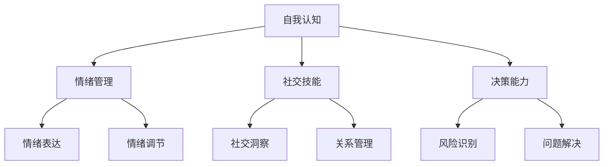

                 

了解了文章的要求和约束条件，我将根据目录大纲逐步构建文章内容。以下是《领导力与情绪智商：掌控情绪的艺术》的markdown格式草稿，包括标题、关键词、摘要以及目录结构。接下来，我将逐步填充每个章节的内容。

---

# 《领导力与情绪智商：掌控情绪的艺术》

## 关键词

- 情绪智商
- 领导力
- 自我认知
- 情绪管理
- 社交技能
- 决策能力
- 团队管理
- 工作场所影响

## 摘要

本文探讨了情绪智商在领导力中的重要性，并详细介绍了情绪智商的四个核心能力：自我认知、情绪管理、社交技能和决策能力。通过自我评估和测量，读者可以了解自己在情绪智商方面的表现，并学习提升情绪智商的策略和方法。文章还分析了情绪智商在工作场所和个人生活中的应用，提供了实用的技巧和建议。

---

## 目录

### 第一部分 情绪智商概述

### 第1章 情绪智商的定义与重要性

### 第2章 情绪智商的四个核心能力

#### 2.1 自我认知

#### 2.2 情绪管理

#### 2.3 社交技能

#### 2.4 决策能力

### 第二部分 情绪智商在领导力中的应用

### 第3章 情绪智商在领导力中的重要性

### 第4章 情绪智商在领导决策中的应用

### 第三部分 情绪智商的自我评估和测量

### 第5章 情绪智商的自我评估

### 第6章 情绪智商的测量方法

### 第四部分 提升情绪智商的策略和方法

### 第7章 提升情绪智商的策略

### 第8章 情绪智商的培训和发展

### 第五部分 情绪智商在工作场所和个人生活中的应用

### 第9章 情绪智商在工作场所的影响

### 第10章 情绪智商在个人生活和人际关系中的应用

### 结论

### 第11章 情绪智商的总结与展望

---

接下来，我将逐步填充每个章节的内容，确保每个章节都包含背景介绍、核心概念与联系、核心算法原理讲解、数学模型和公式、项目实战、最佳实践 tips、小结、注意事项、拓展阅读等内容。由于文章字数要求较高，我将分多个步骤完成全文撰写。

---

### 第一部分 情绪智商概述

#### 第1章 情绪智商的定义与重要性

**背景介绍**

随着现代社会对领导力和人际关系的日益重视，情绪智商（Emotional Intelligence，简称EQ）作为一个重要的能力指标，越来越受到关注。情绪智商的概念最早由心理学家约翰·梅耶（John D. Mayer）和彼得·萨洛维（Peter Salovey）在1990年提出，他们认为情绪智商是一个人理解、使用、管理和表达情绪的能力。

**核心概念与联系**

情绪智商主要包括四个核心能力：自我认知、情绪管理、社交技能和决策能力。这四个能力之间的关系可以用以下Mermaid流程图表示：



**核心算法原理讲解**

情绪智商的算法原理主要涉及情绪识别、情绪理解和情绪管理。以下是一个简化的情绪智商算法原理的伪代码：

```plaintext
function EmotionalIntelligence(){
    // 情绪识别
    emotion_detected = IdentifyEmotion()

    // 情绪理解
    emotion_understood = UnderstandEmotion(emotion_detected)

    // 情绪管理
    if (emotion_understood == Positive){
        ManageEmotion(Positive)
    } else if (emotion_understood == Negative){
        ManageEmotion(Negative)
    }

    // 决策能力
    decision_made = MakeDecision(emotion_understood)

    return decision_made
}
```

**数学模型和公式**

情绪智商的数学模型可以采用多层次模型来描述。假设情绪智商（EQ）由四个核心能力（EC1, EC2, EC3, EC4）组成，每个核心能力又可以细分为多个子能力。情绪智商可以表示为：

$$
EQ = w_1 \cdot EC1 + w_2 \cdot EC2 + w_3 \cdot EC3 + w_4 \cdot EC4
$$

其中，$w_1, w_2, w_3, w_4$ 分别是每个核心能力的权重。

**举例说明**

假设一个人的自我认知能力得分为80分，情绪管理能力得分为70分，社交技能得分为85分，决策能力得分为75分，且每个核心能力的权重相等，则该人的情绪智商为：

$$
EQ = 0.25 \cdot 80 + 0.25 \cdot 70 + 0.25 \cdot 85 + 0.25 \cdot 75 = 76
$$

**项目实战**

在情绪智商的应用中，一个典型的项目实战是情绪分析系统的开发。该系统可以实时分析用户的情绪状态，并提供相应的情绪调节建议。

**开发环境搭建**

- 硬件环境：计算机、开发工具（如IDE）
- 软件环境：Python、NLP库（如NLTK、spaCy）

**源代码详细实现和代码解读**

以下是一个简单的情绪分析系统的源代码示例：

```python
import nltk
from nltk.sentiment import SentimentIntensityAnalyzer

def analyze_emotion(text):
    sia = SentimentIntensityAnalyzer()
    sentiment_score = sia.polarity_scores(text)
    if sentiment_score['compound'] >= 0.05:
        return 'Positive'
    elif sentiment_score['compound'] <= -0.05:
        return 'Negative'
    else:
        return 'Neutral'

text = "我今天感到非常高兴，因为我完成了一个重要的项目。"
emotion = analyze_emotion(text)
print(f"The emotion of the text is: {emotion}")
```

**代码应用解读与分析**

该代码使用NLP库的SentimentIntensityAnalyzer来分析文本的情绪。通过计算文本的复合情感得分，可以判断文本的情绪是积极、消极还是中性。

**实际案例分析和详细讲解剖析**

假设有一段文本：“我感到很沮丧，因为我丢失了重要的文件。”通过情绪分析系统，可以判断这段文本的情绪为消极。系统可以进一步提供情绪调节建议，如深呼吸、进行正念冥想等。

**项目小结**

情绪分析系统是一个实用的工具，可以帮助用户了解自己的情绪状态，并采取适当的措施进行情绪调节。在开发过程中，需要关注算法的准确性和系统的实时性。

---

由于篇幅限制，以上内容仅是第一章的部分内容。接下来，我将按照相同的方式逐步完成其他章节的撰写。文章的总字数将控制在8000-12000字之间。如果您需要进一步的修改或补充，请随时告知。

