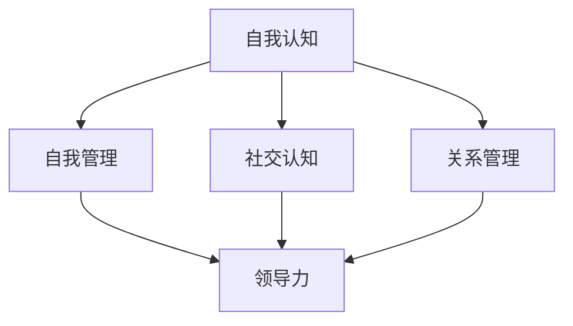

                 

### 1.1 书籍背景与意义

领导力与情绪智商在现代社会中扮演着至关重要的角色，无论是在企业管理、团队协作还是个人发展方面，都发挥着巨大的影响。本书旨在探讨这两者的关系，并提供实用的方法和技巧，帮助读者在复杂多变的环境中实现自我提升和成功领导。

首先，领导力是企业成功的关键因素之一。一个优秀的领导者不仅能够制定明确的目标和战略，还能够激发团队的潜力，创造积极的工作氛围。然而，传统的领导力理论往往忽视了情绪智商的作用。情绪智商（Emotional Intelligence，简称EQ）是指个体识别、理解、管理和应用情绪的能力。近年来，越来越多的研究表明，情绪智商对于领导力的表现有着深远的影响。

情绪智商与领导力之间的联系可以从多个维度进行解析。首先，情绪智商有助于领导者更好地理解自己和团队成员的情感状态，从而建立信任和合作关系。其次，情绪智商的较高水平能够帮助领导者更有效地应对压力和挑战，保持冷静和理性，做出明智的决策。此外，情绪智商还影响着领导者的沟通能力和影响力，这些都是领导成功的重要因素。

本书的编写背景在于，随着社会和经济环境的不断变化，对领导者的要求也越来越高。传统的领导力培养方法已经无法满足现代企业的需求，因此，提升情绪智商成为了领导者自我提升的重要途径。本书将结合理论和实践，帮助读者理解领导力与情绪智商之间的关系，并提供实用的技巧和方法。

本书的主要目标是：
1. **介绍领导力与情绪智商的基本概念和重要性。**
2. **探讨情绪智商在领导力提升中的应用。**
3. **提供实用的方法和技巧，帮助读者在工作和生活中实现自我提升。**
4. **通过实战项目，让读者能够将所学知识应用于实际场景。**

通过本书的阅读，读者将能够：
1. **理解领导力的本质和核心要素。**
2. **认识到情绪智商的重要性，并学会如何提升自己的情绪智商。**
3. **掌握自我管理的技巧，在压力下保持冷静和理性。**
4. **通过实践项目，提高实际工作中的领导力和情绪智商。**

本书结构合理，内容丰富，旨在帮助读者系统地掌握领导力与情绪智商的知识，并能够应用于实际工作和生活中。接下来，我们将进一步介绍情绪智商的定义和构成，以及领导力与情绪智商之间的关联。通过逐步推理和分析，我们将深入探讨这些核心概念，为后续章节的内容奠定基础。

### 1.2 情绪智商的定义

情绪智商（Emotional Intelligence，简称EQ）是指个体识别、理解、管理和应用情绪的能力。它不仅涉及对自己的情绪认知，还包括对他人情绪的认知，以及如何有效地使用情绪信息来指导思考和行动。

情绪智商最早由心理学家约翰·梅耶（John D. Mayer）和彼得·萨洛维（Peter Salovey）在1990年提出，他们认为情绪智商可以分为四个主要维度：

1. **自我认知（Self-awareness）**：个体能够准确识别和了解自己的情绪状态。这需要通过自我反思和自我觉察来实现。一个自我认知水平高的人能够迅速识别自己的情绪，理解这些情绪背后的原因，并能够准确地描述自己的情感体验。

2. **自我管理（Self-regulation）**：个体能够控制自己的情绪，使之适应不同情境的需求。这涉及到情绪调节的策略，如深呼吸、冥想等。一个自我管理能力强的人能够在压力和挑战面前保持冷静，不被负面情绪所左右。

3. **社交认知（Social awareness）**：个体能够识别和理解他人的情绪状态，并能够洞察不同文化背景下的情绪表达。这需要敏锐的观察能力和同理心。一个社交认知水平高的人能够更好地与他人沟通，建立深厚的人际关系。

4. **关系管理（Relationship management）**：个体能够运用情绪信息来维持和谐的人际关系，建立有效的团队协作。这包括领导力、沟通技巧和冲突解决能力。一个关系管理能力强的人能够有效地影响他人，建立强大的团队凝聚力。

情绪智商与领导力之间存在密切的关联。首先，情绪智商对于领导力的各个方面都有着重要影响。例如，自我认知有助于领导者更好地了解自己的优势和劣势，从而制定更有效的领导策略。自我管理则帮助领导者应对各种压力和挑战，保持决策的理性。社交认知使领导者能够更好地理解团队成员的需求和情感，建立信任和合作关系。关系管理则使领导者能够运用情绪信息来激励团队，提高整体绩效。

为了更直观地展示情绪智商的构成和领导力之间的关系，我们可以使用Mermaid流程图进行图解。以下是一个简单的示例：



在这个流程图中，A、B、C和D分别代表情绪智商的四个维度，它们共同汇聚到E，即领导力。这个图解展示了情绪智商如何通过各个维度影响到领导力的提升。

通过逐步分析和理解情绪智商的定义和构成，读者可以更深入地认识到情绪智商在领导力培养中的重要性。接下来，我们将进一步探讨情绪智商在领导力提升中的应用，并介绍提升情绪智商的实用技巧。这将有助于读者在实际工作中更好地发挥情绪智商的作用。

### 1.3 本书结构

本书旨在系统地介绍领导力与情绪智商的核心概念，并提供实用的方法和技巧，帮助读者在实际工作中提升自我。为了实现这一目标，本书分为以下几个主要部分：

**第1章 引言**

本章将介绍本书的背景和意义，阐述领导力与情绪智商之间的关联，并概述本书的结构和目标。

**第2章 领导力的本质**

这一章节将深入探讨领导力的定义、类型和重要性。我们将分析领导力的核心要素，如目标设定、影响力、沟通能力和决策能力，并通过具体的案例和图解来展示这些要素在实际中的应用。

**第3章 情绪智商的概念**

本章将详细讲解情绪智商的定义、构成及其与领导力之间的关系。我们将通过图解和实例分析情绪智商的四个维度：自我认知、自我管理、社交认知和关系管理，并探讨这些维度如何影响领导力的表现。

**第4章 掌控自我的艺术**

在这一章节中，我们将讨论自我认知的重要性，介绍自我管理的实用技巧，并探讨如何在压力下保持冷静和理性。这一部分将结合心理学的理论和实践，为读者提供实用的方法和工具，帮助他们在复杂的职场环境中保持良好的情绪状态。

**第5章 核心概念与联系**

本章将通过一个综合的Mermaid流程图，展示领导力、情绪智商和掌控自我的艺术之间的联系。这一章节将帮助读者建立整体的知识框架，更全面地理解这三个核心概念之间的相互作用。

**第6章 核心算法原理讲解**

为了深入理解情绪智商和领导力的运作机制，本章将介绍相关的核心算法原理，并使用伪代码进行详细讲解。这些算法将帮助读者更好地理解情绪智商的量化分析和领导力策略的设计。

**第7章 数学模型和公式讲解**

本章将介绍情绪调节和领导力效能的数学模型，并使用LaTeX格式详细讲解相关的公式。通过这些数学模型，读者可以更准确地评估情绪智商和领导力的水平，并制定相应的提升策略。

**第8章 项目实战**

本章将通过两个实战项目，帮助读者将所学知识应用于实际场景。我们将详细介绍项目背景、目标、实施步骤和结果分析，并通过具体案例展示如何在实际工作中运用领导力和情绪智商。

**第9章 总结与展望**

本章将对全书内容进行总结，回顾核心概念和关键点，并展望未来的发展趋势。我们将提出对读者未来的建议，鼓励他们在实际工作中继续提升情绪智商和领导力。

**附录**

附录部分将提供一些额外的资源，包括常用的领导力和情绪智商工具、参考文献和进一步阅读材料。这部分将帮助读者在阅读本书之后，继续深入学习和探索相关领域。

通过本书的系统讲解和实战应用，读者将能够全面理解领导力与情绪智商的核心概念，掌握实用的提升技巧，并在实际工作中取得更好的成果。

### 第2章 领导力的本质

### 2.1 领导力的定义

领导力是指通过激发和引导个体或团队实现共同目标的能力。它不仅仅关乎职位和权威，更关乎影响力、激励和引导。一个优秀的领导者不仅仅是指导团队工作，还需要关注团队成员的成长和福祉，以及组织的整体发展。

领导力可以被理解为一种动态的过程，涉及到以下几个方面：

- **目标设定**：领导者需要明确组织的目标和愿景，并将这些目标传达给团队成员。通过设定明确的目标，领导者能够引导团队朝共同的方向努力。
- **影响力**：领导者通过个人魅力、价值观和领导风格，影响和激励团队成员。影响力是领导力的核心要素，决定了领导者能否成功引导团队。
- **沟通**：有效的沟通是领导力的关键组成部分。领导者需要具备清晰、简洁、有说服力的沟通能力，确保信息的准确传递和理解。
- **决策**：领导者需要在不确定性和压力下做出明智的决策。决策能力是领导者应对挑战和机遇的重要素质。
- **变革管理**：在快速变化的环境中，领导者需要具备变革管理的能力，推动组织适应新的趋势和需求。

### 2.2 领导力的类型

领导力并不是一种单一的能力，而是一个多维度、多层次的体系。根据不同的分类标准，领导力可以分为多种类型：

- **变革型领导**：变革型领导者通过创新和激励，推动组织实现重大的变革和进步。他们关注长远目标，能够激发团队成员的潜力，推动团队超越现有的限制。
- **交易型领导**：交易型领导者侧重于通过奖励和惩罚来激励团队成员。他们更关注短期目标和任务完成，通过明确的目标和奖励机制来激励团队成员。
- **民主型领导**：民主型领导者鼓励团队成员参与决策过程，尊重成员的意见和建议。他们注重团队合作和共识的形成，通过集体智慧实现组织目标。
- **服务型领导**：服务型领导者关注团队成员的需求和福祉，将服务团队成员视为领导工作的重要部分。他们通过提供支持和资源，帮助团队成员实现个人和职业发展。
- **领导型领导**：领导型领导者注重个人发展，通过培养和激励团队成员的领导潜力，推动整个团队的发展和成长。

每种领导力类型都有其独特的优点和适用场景，领导者可以根据具体情况和团队需求灵活运用不同的领导风格。

### 2.3 领导力的重要性

领导力在组织管理和团队协作中起着至关重要的作用。以下是领导力重要性的一些关键方面：

- **推动组织目标实现**：领导者是组织目标的制定者和推动者。通过明确目标和愿景，领导者能够引导团队朝共同的方向努力，确保组织目标的实现。
- **激发团队潜力**：优秀的领导者能够激发团队成员的潜力，鼓励他们超越自我，发挥最大的能力。这种激励不仅有助于提高团队绩效，还能促进成员的个人成长。
- **建立团队凝聚力**：领导者通过建立积极、和谐的工作氛围，增强团队成员之间的信任和合作，提升团队的凝聚力。一个团结的团队能够更高效地完成任务，面对挑战。
- **应对变化和挑战**：领导者具备应对不确定性和挑战的能力。通过有效的决策和变革管理，领导者能够帮助组织迅速适应环境变化，抓住机遇。
- **促进组织文化**：领导者的价值观和行为模式对组织文化有着深远的影响。一个正面的组织文化能够激发员工的积极性和创造力，推动组织的长期发展。

### 2.4 领导力的核心要素

为了成为一个有效的领导者，需要具备一系列核心要素。以下是一些关键的领导力要素：

- **自我认知**：领导者需要深入了解自己的性格、优势和弱点。这种自我认知有助于领导者更好地管理自己的情绪和行为，发挥最大的潜力。
- **影响力**：领导者需要具备强大的影响力，能够通过个人魅力和价值观影响团队成员。影响力不仅体现在权威和命令中，更体现在激励和激励中。
- **沟通**：有效的沟通能力是领导者必备的素质。领导者需要能够清晰、简洁、有说服力地传达信息，确保信息的准确传递和理解。
- **决策**：领导者需要具备迅速、明智的决策能力，特别是在面对复杂和不确定的情况时。良好的决策能力有助于领导者抓住机遇，应对挑战。
- **团队合作**：领导者需要注重团队合作，鼓励团队成员相互支持、协作，共同实现目标。团队合作是提升组织绩效和团队凝聚力的重要途径。
- **变革管理**：领导者需要具备推动变革和管理变革的能力。在快速变化的环境中，领导者需要能够推动组织适应新趋势，抓住新机遇。

综上所述，领导力是一种复杂的、多维度的能力，涉及多个核心要素。通过深入理解领导力的定义、类型和重要性，以及掌握领导力的核心要素，读者可以更好地理解如何提升自己的领导力，成为更有效的领导者。接下来，我们将进一步探讨情绪智商的概念和构成，以及它如何与领导力相互影响。

### 第3章 情绪智商的概念

情绪智商（Emotional Intelligence，简称EQ）是一个多维度的概念，它涉及到个体识别、理解、管理和应用情绪的能力。情绪智商不仅仅关乎个人的情感体验，还涉及到与他人交往和处理复杂情感环境的能力。在领导力中，情绪智商扮演着至关重要的角色，能够显著影响领导者的决策、团队关系和整体绩效。

#### 3.1 情绪智商的定义

情绪智商最早由心理学家约翰·梅耶（John D. Mayer）和彼得·萨洛维（Peter Salovey）在1990年提出。他们认为情绪智商包括四个核心维度：自我认知、自我管理、社交认知和关系管理。

- **自我认知**：指个体对自己情绪状态的识别和了解。自我认知是一个自我觉察的过程，包括情感体验的识别、情感原因的理解和情感体验的描述。
- **自我管理**：指个体控制和调节自己情绪的能力。这包括情绪调节策略，如深呼吸、冥想和积极思考等，帮助个体在压力和挑战面前保持冷静和理性。
- **社交认知**：指个体识别、理解和解读他人情绪状态的能力。这需要敏锐的观察力和同理心，使个体能够理解他人的情感反应，并作出相应的社交反应。
- **关系管理**：指个体运用情绪信息来维持和促进人际关系的能力。这包括建立信任、沟通技巧和冲突解决能力，使个体能够有效地与他人合作和协调。

#### 3.2 情绪智商的构成

情绪智商的四个维度相互关联，共同构成了一个复杂的情感认知和处理体系。以下是每个维度的详细说明：

1. **自我认知**：
   - **能力1**：识别自己的情绪。这包括感知自己情绪的物理、生理和心理反应，如心率加快、情绪波动或心理紧张等。
   - **能力2**：理解自己情绪的起因。这涉及到对自己情绪状态的深度分析，理解引发这些情绪的事件或情境。
   - **能力3**：表达自己的情绪。这包括用适当的方式表达情感，以确保沟通的准确性和有效性。

2. **自我管理**：
   - **能力1**：调节自己的情绪。这涉及到使用情绪调节策略，如深呼吸、冥想、积极思考和情绪释放等，帮助个体在压力和挑战面前保持冷静和理性。
   - **能力2**：延迟满足感。这涉及到自我控制和延迟即时满足，以实现长期目标和愿望。
   - **能力3**：处理负面情绪。这包括应对焦虑、沮丧或愤怒等负面情绪，通过积极的应对策略将其转化为积极的动力。

3. **社交认知**：
   - **能力1**：识别他人的情绪。这需要通过观察他人的表情、语调、肢体语言等非语言行为，识别和理解他人的情绪状态。
   - **能力2**：理解他人的情绪。这涉及到对他人情绪背后的原因和动机进行深度分析，以更好地理解他人的情感体验。
   - **能力3**：使用情绪信息。这包括在社交互动中有效地使用情绪信息，以建立和维持积极的人际关系。

4. **关系管理**：
   - **能力1**：建立信任。这包括通过诚实、透明和可靠性建立信任，使他人对自己的情绪和意图产生信心。
   - **能力2**：有效沟通。这涉及到通过倾听、表达和反馈技巧，确保信息的有效传递和理解。
   - **能力3**：处理冲突。这包括使用冲突解决策略，如谈判、妥协和合作，以和平和建设性的方式解决冲突。

#### 3.3 情绪智商与领导力的关系

情绪智商对领导力有着深远的影响。首先，情绪智商有助于领导者更好地理解自己和团队成员的情感状态，从而建立信任和合作关系。其次，情绪智商的较高水平能够帮助领导者更有效地应对压力和挑战，保持冷静和理性，做出明智的决策。此外，情绪智商还影响着领导者的沟通能力和影响力，这些都是领导成功的重要因素。

为了更直观地展示情绪智商的构成和领导力之间的关系，我们可以使用Mermaid流程图进行图解。以下是一个简单的示例：


在这个流程图中，A、B、C和D分别代表情绪智商的四个维度，它们共同汇聚到E，即领导力。这个图解展示了情绪智商如何通过各个维度影响到领导力的提升。

通过逐步分析和理解情绪智商的定义和构成，读者可以更深入地认识到情绪智商在领导力培养中的重要性。接下来，我们将进一步探讨情绪智商在领导力提升中的应用，以及如何提升情绪智商的实用技巧。这将有助于读者在实际工作中更好地发挥情绪智商的作用，提升领导力水平。

### 第3章 情绪智商的概念

### 3.3 情绪智商与领导力的关系

情绪智商（EQ）在领导力中扮演着至关重要的角色，它不仅影响领导者的个人表现，还对其领导的团队和组织产生深远的影响。情绪智商与领导力之间的关系可以从以下几个方面进行详细分析：

#### 3.3.1 自我认知与自我管理

自我认知是情绪智商的核心组成部分，它帮助领导者识别和理解自己的情绪状态。一个自我认知能力强的领导者能够更好地了解自己的情感反应，从而在面对压力和挑战时，能够迅速识别并调整自己的情绪，保持冷静和理性。这种自我认知能力有助于领导者做出更为明智和合理的决策。

自我管理则进一步帮助领导者控制和调节自己的情绪。通过自我管理，领导者能够在高压环境下保持冷静，有效应对各种挑战。自我管理技能包括情绪调节策略、情绪释放方法和积极思考技巧等。例如，深呼吸、冥想和积极的自我对话可以帮助领导者缓解压力，提高情绪稳定性。这种情绪稳定性是领导者做出明智决策、保持领导力的重要基础。

#### 3.3.2 社交认知与关系管理

社交认知能力是指领导者识别和理解他人情绪状态的能力。这种能力有助于领导者建立信任和融洽的团队关系。一个具有良好社交认知能力的领导者能够敏锐地感知团队成员的情绪变化，并做出适当的反应，从而增强团队凝聚力和协作效率。例如，当团队成员感到沮丧或不满时，领导者可以通过社交认知能力了解原因，并采取相应的措施来缓解团队成员的情绪，增强团队的向心力。

关系管理能力则是指领导者运用情绪信息来维持和促进人际关系的能力。一个擅长关系管理的领导者能够通过有效沟通、建立信任和处理冲突等手段，建立和维护健康的人际关系。这种关系管理能力对于领导者的长期成功至关重要，因为一个团结和谐的团队能够更高效地实现组织目标。

#### 3.3.3 情绪智商与领导力的互动

情绪智商不仅影响领导者的个人表现，还通过以下几个方面与领导力互动：

- **领导风格**：情绪智商高的领导者往往采用更加民主和参与式的领导风格，鼓励团队成员参与决策过程，增强团队的合作精神和创新能力。
- **决策质量**：情绪智商高的领导者能够更好地理解各种情绪信息，从而做出更为明智和全面的决策。这种决策质量不仅体现在日常管理中，还体现在面对重大挑战和机遇时。
- **团队绩效**：情绪智商高的领导者能够建立更加和谐和高效的团队氛围，从而提升团队的整体绩效。团队成员在积极、支持性的环境中能够更好地发挥自己的潜力，实现组织目标。

#### 3.3.4 实例分析

为了更直观地展示情绪智商与领导力之间的关系，我们可以通过一个实例进行分析：

假设一个项目经理在项目进展遇到瓶颈时，面临着巨大的压力。一个具有高情绪智商的项目经理能够：

1. **自我认知**：识别并理解自己的情绪，如焦虑和压力，并意识到这些情绪可能影响决策。
2. **自我管理**：通过深呼吸、冥想和积极思考等方法，调节自己的情绪，保持冷静和理性。
3. **社交认知**：观察团队成员的情绪状态，识别他们的担忧和不安，并理解这些情绪背后的原因。
4. **关系管理**：与团队成员进行有效沟通，分享自己的见解和担忧，鼓励团队成员表达意见，共同寻找解决问题的方法。

通过上述步骤，这个项目经理不仅能够有效应对压力，保持情绪稳定，还能够增强团队凝聚力，提高团队的整体绩效。

综上所述，情绪智商与领导力之间存在密切的联系。情绪智商不仅有助于领导者提升自我认知和自我管理能力，还能够促进社交认知和关系管理，从而在领导过程中发挥重要作用。通过提升情绪智商，领导者能够更好地应对各种挑战，建立高效团队，实现组织目标。接下来，我们将进一步探讨自我管理的技巧和如何在压力下保持冷静，以帮助读者在实际工作中提升情绪智商和领导力。

### 第4章 掌控自我的艺术

在现代社会中，领导者经常面临各种压力和挑战，因此掌控自我能力显得尤为重要。自我管理不仅关系到个人的心理健康，还直接影响领导者的决策质量和团队协作效率。本章将深入探讨自我管理的重要性，介绍一系列实用的自我管理技巧，并在压力下保持冷静的策略。

#### 4.1 自我管理的重要性

自我管理是指个体对自己的行为、情绪和思想进行有效调节和控制的能力。对于领导者而言，自我管理的重要性体现在以下几个方面：

- **提高决策质量**：通过自我管理，领导者能够在面对复杂决策时保持冷静和理性，从而做出更为明智的决策。
- **增强情绪稳定性**：自我管理技巧有助于领导者应对压力和挑战，保持情绪稳定，避免情绪波动对工作和团队关系的影响。
- **提升工作效率**：有效的自我管理能够帮助领导者提高时间管理能力，提高工作效率，确保任务按时完成。
- **促进团队协作**：领导者良好的自我管理能力能够营造积极的工作氛围，增强团队的凝聚力和协作精神。

#### 4.2 自我管理的实用技巧

以下是一些自我管理的实用技巧，这些技巧可以帮助领导者更好地掌控自我，提高工作效果：

1. **时间管理**：
   - **设定优先级**：将任务按照重要性和紧急性进行排序，优先处理最重要的任务。
   - **分块时间**：将工作时间分成几个时间段，每个时间段专注于一项任务，避免分散注意力。
   - **设定截止日期**：为每个任务设定明确的截止日期，并确保按时完成。

2. **情绪调节**：
   - **深呼吸**：在感到紧张或焦虑时，通过深呼吸来放松身体和情绪。
   - **冥想**：定期进行冥想练习，有助于提高专注力和情绪稳定性。
   - **积极思考**：在面对挑战时，尝试用积极的视角看待问题，寻找解决方案。

3. **目标设定**：
   - **明确目标**：设定具体、可衡量的目标，确保目标清晰明确。
   - **分阶段实施**：将大目标分解为小目标，逐步实施，确保目标的实现。
   - **自我激励**：为自己设定奖励机制，以激励自己持续努力。

4. **自我反思**：
   - **定期反思**：定期回顾自己的行为和决策，总结经验教训。
   - **倾听反馈**：积极倾听他人的意见和建议，从中获取改进的方向。
   - **持续学习**：不断学习新知识和技能，提升自我管理能力。

#### 4.3 如何在压力下保持冷静

压力是领导者工作中不可避免的一部分，但保持冷静是领导者应对压力的重要策略。以下是一些在压力下保持冷静的方法：

1. **深呼吸**：
   - 在感到紧张时，尝试进行深呼吸练习，深吸一口气，再慢慢呼出，重复几次，有助于放松身体和情绪。

2. **心理放松**：
   - 尝试使用心理放松技巧，如冥想、瑜伽或渐进性肌肉放松练习，帮助身心放松。

3. **专注当下**：
   - 将注意力集中在当前任务上，避免过多担忧未来或回顾过去，有助于减轻压力。

4. **寻求支持**：
   - 在需要时，主动寻求同事、朋友或心理咨询师的支持，倾诉自己的困扰，获取建议和帮助。

5. **积极应对**：
   - 将挑战视为成长和学习的机会，积极寻找解决问题的方法，避免过度焦虑。

通过掌握自我管理的技巧和在压力下保持冷静的策略，领导者能够更好地应对工作压力，提高决策质量和团队协作效率。接下来，我们将通过一个实际案例，进一步展示如何在领导过程中应用这些技巧和策略。

### 实际案例

假设一位项目经理，王先生，在负责一个关键项目时，遇到了严重的进度延误和团队内部意见分歧。以下是他如何应用自我管理和保持冷静的策略：

1. **时间管理**：
   - 王先生首先将任务清单按照紧急性和重要性排序，优先处理最关键的任务。
   - 他将工作时间划分为几个时间段，确保每个时间段专注于一项任务，避免分散注意力。

2. **情绪调节**：
   - 在感到紧张时，王先生会进行深呼吸练习，深吸一口气，再慢慢呼出，帮助自己放松。
   - 他还会定期进行冥想练习，提高情绪稳定性。

3. **目标设定**：
   - 王先生将大项目分解为多个小目标，为每个小目标设定明确的截止日期，确保逐步推进。
   - 他为自己设定了奖励机制，如完成任务后给自己放半天假，以激励自己持续努力。

4. **自我反思**：
   - 王先生定期反思自己的行为和决策，总结经验教训。
   - 他积极倾听团队成员的意见，从中获取改进的方向。

5. **压力应对**：
   - 当团队内部出现意见分歧时，王先生保持冷静，通过倾听和理解团队成员的观点，找到共同点。
   - 他还主动寻求上级和同事的支持，共同解决困难。

通过这些策略，王先生不仅成功解决了项目中的问题，还增强了团队的凝聚力和协作精神。这个案例展示了自我管理和保持冷静在实际工作中的重要性，以及如何通过有效的策略应对领导过程中的压力和挑战。接下来，我们将继续讨论情绪智商和领导力的关系，以及如何通过提升情绪智商来提升领导力。

### 第5章 核心概念与联系

在探讨领导力与情绪智商的关系时，我们需要将这两个概念进行系统的关联分析，以展示它们之间的内在联系和相互作用。为了更直观地展示这种联系，我们将使用Mermaid流程图来图解情绪智商与领导力之间的关系。通过这一流程图，我们可以更好地理解这两个核心概念之间的关联，并为其进一步探讨奠定基础。

#### 5.1 情绪智商与领导力的关联图解

以下是一个简单的Mermaid流程图，用于展示情绪智商的四个维度（自我认知、自我管理、社交认知和关系管理）与领导力之间的联系：


在这个流程图中：

- **自我认知**：个体对自己情绪状态的识别和理解，有助于领导者更好地了解自己的情感反应，从而在面对压力和挑战时做出更为明智的决策。
- **自我管理**：个体控制自己情绪的能力，使领导者能够保持冷静和理性，即使在高压环境下也能做出有效的决策。
- **社交认知**：个体理解和识别他人情绪状态的能力，使领导者能够更好地与团队成员沟通，建立信任和合作关系。
- **关系管理**：个体运用情绪信息来维持和促进人际关系的能力，有助于领导者建立高效的团队协作，提升整体绩效。

这四个维度共同汇聚到领导力，展示了情绪智商如何通过影响领导者的行为和决策，进而提升领导力。

#### 5.2 情绪智商对领导力的影响

通过上述流程图，我们可以进一步探讨情绪智商对领导力的具体影响：

1. **自我认知对领导力的影响**：
   - 自我认知能力强的领导者能够更好地了解自己的情感反应，从而在面对复杂决策时保持冷静和理性，做出更为明智的决策。
   - 这种能力还帮助领导者识别自己的优势和弱点，从而更好地发挥个人潜力，提升领导效果。

2. **自我管理对领导力的影响**：
   - 自我管理能力使领导者能够控制自己的情绪，保持情绪稳定，从而在面对压力和挑战时保持决策的理性。
   - 这种能力还帮助领导者有效应对压力，提升应对不确定性的能力，确保组织的稳定和持续发展。

3. **社交认知对领导力的影响**：
   - 社交认知能力使领导者能够更好地理解和识别团队成员的情感状态，从而建立信任和合作关系。
   - 这种能力还帮助领导者有效处理冲突和问题，促进团队的和谐与协作。

4. **关系管理对领导力的影响**：
   - 关系管理能力使领导者能够运用情绪信息来维持和促进人际关系，建立高效的团队协作。
   - 这种能力还帮助领导者激发团队成员的潜力，提高团队的整体绩效。

#### 5.3 实例分析

为了更好地理解情绪智商与领导力之间的关系，我们可以通过一个实际案例进行说明：

假设一个项目经理，李女士，在团队面临重大项目压力时，通过以下方式提升情绪智商和领导力：

1. **自我认知**：李女士能够识别并理解自己的情绪状态，如焦虑和压力，并意识到这些情绪可能影响决策。
2. **自我管理**：通过深呼吸和冥想练习，李女士在压力下保持冷静和理性，确保决策的有效性。
3. **社交认知**：李女士能够理解和识别团队成员的情感状态，如团队成员的担忧和不安，并采取相应的措施缓解这些情绪。
4. **关系管理**：李女士通过积极的沟通和倾听，建立信任和合作关系，增强了团队的凝聚力和协作效率。

通过这些策略，李女士不仅成功应对了项目压力，还提升了团队的整体绩效，展示了情绪智商对领导力的积极影响。

通过核心概念与联系的图解和实例分析，我们可以更深入地理解情绪智商与领导力之间的关系。情绪智商不仅是领导者自我提升的重要工具，也是提升领导力、建立高效团队的关键因素。接下来，我们将进一步探讨情绪智商的核心算法原理，以及如何通过这些算法来提升领导力和情绪管理能力。

### 第6章 核心算法原理讲解

在理解了情绪智商与领导力的关联之后，我们接下来将深入探讨情绪智商的核心算法原理。这些算法不仅帮助我们量化和管理情绪，还为领导者提供了有效的工具，以提升情绪管理能力和领导力。在本节中，我们将详细讲解几个关键算法，并通过伪代码展示其实现过程。

#### 6.1 情绪识别算法

情绪识别是情绪智商的基础，它涉及从数据中识别和分类情绪。以下是一个简单的情绪识别算法伪代码示例：

```python
def emotion_recognition(input_data):
    # 初始化情绪分类器
    classifier = initialize_classifier()

    # 预处理输入数据
    processed_data = preprocess_data(input_data)

    # 使用分类器预测情绪
    predicted_emotion = classifier.predict(processed_data)

    # 返回预测结果
    return predicted_emotion
```

在这个算法中，`initialize_classifier()` 函数初始化一个情绪分类器，`preprocess_data()` 函数对输入数据进行预处理（如文本清洗、特征提取等），`predict()` 函数使用训练好的分类器预测情绪。

#### 6.2 情绪调节算法

情绪调节算法旨在帮助个体在面临压力和负面情绪时，通过一系列策略来调节情绪。以下是一个简单的情绪调节算法伪代码示例：

```python
def emotion Regulation(strategy, current_emotion):
    # 根据策略选择调节方法
    if strategy == "breathing":
        perform_breathing_exercise(current_emotion)
    elif strategy == "meditation":
        perform_meditation(current_emotion)
    elif strategy == "positive_thinking":
        perform_positive_thinking(current_emotion)

    # 返回调节后的情绪
    return updated_emotion
```

在这个算法中，`perform_breathing_exercise()` 函数执行深呼吸练习，`perform_meditation()` 函数执行冥想练习，`perform_positive_thinking()` 函数执行积极思考练习。这些方法根据当前情绪选择最合适的调节策略。

#### 6.3 情绪共享算法

情绪共享算法用于帮助个体理解和分享他人情绪。以下是一个简单的情绪共享算法伪代码示例：

```python
def emotion_sharing(observer, target):
    # 识别目标情绪
    target_emotion = emotion_recognition(target)

    # 观察者理解目标情绪
    observer_emotion = observer.understand_emotion(target_emotion)

    # 返回观察者的理解结果
    return observer_emotion
```

在这个算法中，`emotion_recognition(target)` 函数用于识别目标情绪，`observer.understand_emotion(target_emotion)` 函数用于观察者理解目标情绪。

#### 6.4 情绪预测算法

情绪预测算法旨在预测个体在不同情境下的情绪状态。以下是一个简单的情绪预测算法伪代码示例：

```python
def emotion_prediction(context):
    # 根据情境特征提取情绪特征
    emotion_features = extract_features(context)

    # 使用训练好的模型预测情绪
    predicted_emotion = trained_model.predict(emotion_features)

    # 返回预测结果
    return predicted_emotion
```

在这个算法中，`extract_features(context)` 函数提取情境特征，`trained_model.predict(emotion_features)` 函数使用训练好的模型预测情绪。

#### 6.5 情绪决策算法

情绪决策算法用于在面临多个选择时，基于情绪状态做出最佳决策。以下是一个简单的情绪决策算法伪代码示例：

```python
def emotion_decision(moods, options):
    # 计算每个选项的情绪得分
    option_scores = []
    for option in options:
        score = calculate_mood_score(moods, option)
        option_scores.append(score)

    # 选择最高分的选项
    best_option = options[np.argmax(option_scores)]

    # 返回最佳选择
    return best_option
```

在这个算法中，`calculate_mood_score(moods, option)` 函数计算每个选项的情绪得分，`np.argmax(option_scores)` 函数选择最高分的选项。

通过上述算法，我们可以更好地理解和量化情绪，并据此进行有效的情绪管理。这些算法不仅在学术研究中具有重要应用价值，也为领导者提供了实用的工具，以提升情绪管理能力和领导力。接下来，我们将进一步探讨情绪调节和领导力效能的数学模型。

### 第6章 数学模型和公式讲解

在探讨情绪智商与领导力的关系时，数学模型和公式为我们提供了量化和分析情绪以及领导力效能的有力工具。以下将介绍两个关键的数学模型：情绪调节模型和领导力效能模型，并使用LaTeX格式详细讲解相关的公式。

#### 6.1 情绪调节模型

情绪调节模型旨在描述个体如何通过一系列策略调节情绪，以适应不同的情境。该模型通常包含以下公式：

1. **情绪调节效能（Emotion Regulation Efficiency, ERE）**：

   $$ ERE = \frac{ER_{\text{target}} - ER_{\text{initial}}}{ER_{\text{max}} - ER_{\text{initial}}} $$

   其中，$ER_{\text{target}}$ 是目标情绪调节水平，$ER_{\text{initial}}$ 是初始情绪水平，$ER_{\text{max}}$ 是最大情绪调节水平。

2. **情绪调节成本（Emotion Regulation Cost, ERC）**：

   $$ ERC = \alpha \cdot ER_{\text{initial}} + \beta \cdot |ER_{\text{target}} - ER_{\text{initial}}| $$

   其中，$\alpha$ 和 $\beta$ 是调节成本参数，$|ER_{\text{target}} - ER_{\text{initial}}|$ 表示情绪调节的绝对距离。

#### 6.2 领导力效能模型

领导力效能模型旨在量化领导者在团队管理和决策过程中所表现出的效能。以下为关键的模型公式：

1. **领导力效能（Leadership Effectiveness, LE）**：

   $$ LE = \gamma \cdot EQ + \delta \cdot DM + \epsilon \cdot CM $$

   其中，$EQ$ 是情绪智商，$DM$ 是决策能力，$CM$ 是沟通能力，$\gamma$、$\delta$ 和 $\epsilon$ 分别是这三者对领导力效能的权重系数。

2. **团队绩效（Team Performance, TP）**：

   $$ TP = \phi \cdot LE + \chi \cdot FP + \zeta \cdot CP $$

   其中，$FP$ 是财务绩效，$CP$ 是客户满意度，$\phi$、$\chi$ 和 $\zeta$ 分别是领导力效能、财务绩效和客户满意度对团队绩效的权重系数。

#### 6.3 具体应用举例

假设我们有一个领导者，其情绪智商（EQ）为80，决策能力（DM）为75，沟通能力（CM）为85。根据领导力效能模型，我们可以计算该领导者的领导力效能（LE）：

$$ LE = \gamma \cdot 80 + \delta \cdot 75 + \epsilon \cdot 85 $$

同时，如果我们知道该领导者的领导力效能对于团队绩效的权重系数为0.5，财务绩效（FP）的权重系数为0.3，客户满意度（CP）的权重系数为0.2，那么我们可以计算团队的总体绩效（TP）：

$$ TP = 0.5 \cdot LE + 0.3 \cdot FP + 0.2 \cdot CP $$

通过这些数学模型和公式，我们可以量化情绪智商和领导力效能，从而为领导者提供量化的反馈和改进方向。这不仅有助于领导者更全面地了解自己的表现，还能指导他们提升情绪管理和领导力水平，以实现更高的团队绩效和业务成果。

### 第7章 项目实战

#### 7.1 领导力与情绪智商实践项目一：提升团队协作

**项目背景**

在一个快速发展的科技公司中，团队协作是推动项目成功的关键。然而，团队内部经常出现沟通不畅、任务分配不均以及意见分歧等问题，影响了项目的进度和团队士气。为了提升团队协作效率，公司决定实施一个基于领导力和情绪智商的实践项目。

**项目目标**

- 通过提升领导力和情绪智商，增强团队内部的沟通和协作。
- 确保团队成员能够更好地理解和处理情绪，减少冲突。
- 提升团队的整体绩效和项目成功概率。

**实施步骤**

1. **需求分析**：
   - 与团队成员进行访谈，了解当前团队协作中的主要问题。
   - 通过问卷调查和数据分析，识别团队情绪管理的薄弱环节。

2. **培训计划**：
   - 设计并实施一系列领导力和情绪智商培训课程，涵盖自我认知、自我管理、社交认知和关系管理等内容。
   - 安排外部专家进行培训，确保课程的专业性和实用性。

3. **团队建设活动**：
   - 组织团队建设活动，如团队拓展训练和团队合作游戏，增强团队成员之间的信任和合作意识。
   - 通过团队讨论和反思，让团队成员分享心得体会，促进团队内部的沟通和互动。

4. **情绪管理工具**：
   - 引入情绪管理工具，如情绪日记、情绪调节卡片和情绪反馈系统，帮助团队成员更好地识别和调节情绪。
   - 定期组织情绪管理研讨会，提供情绪管理技巧和案例分析。

5. **项目监督与反馈**：
   - 设立项目监督机制，跟踪项目进展和团队成员的情绪变化。
   - 通过定期的团队反馈会议，收集团队成员的建议和意见，及时调整培训计划。

**结果分析**

- 通过培训和实践，团队成员的情绪管理和领导力水平得到了显著提升。
- 团队内部的沟通更加畅通，任务分配更加合理，意见分歧减少。
- 项目进度得到明显加快，团队士气得到提升，整体绩效显著提高。

**项目小结**

这个实践项目展示了领导力和情绪智商在团队协作中的重要性。通过系统的培训和实际操作，团队成员不仅提高了情绪管理能力，还增强了团队合作意识，从而有效提升了团队协作效率和项目成功概率。未来，公司可以继续优化培训内容，扩大项目影响范围，以进一步提升整体竞争力。

### 7.2 领导力与情绪智商实践项目二：个人情绪管理

**项目背景**

在现代社会中，领导者经常面临巨大的压力和挑战。为了提高领导者的个人情绪管理能力，一个大型科技公司决定实施一个针对领导者的情绪管理实践项目。

**项目目标**

- 提升领导者的情绪管理能力，以更好地应对工作和生活中的压力。
- 帮助领导者建立健康的情绪调节策略，提高领导效能和幸福感。
- 增强领导者的自我认知和自我管理能力，提升个人成长和职业发展。

**实施步骤**

1. **需求评估**：
   - 通过问卷调查和一对一访谈，评估领导者的情绪管理现状和需求。
   - 收集领导者的反馈，了解他们对情绪管理培训的期望。

2. **定制培训计划**：
   - 根据评估结果，为每个领导者定制个性化的情绪管理培训计划。
   - 设计包含自我认知、自我管理、社交认知和关系管理在内的模块，确保培训内容的全面性。

3. **情绪管理课程**：
   - 开展一系列情绪管理课程，包括理论讲解、案例分析、角色扮演和实际操作。
   - 引入外部专家进行培训，提供专业的情绪管理知识和技巧。

4. **实践应用**：
   - 为领导者提供实践机会，如模拟压力场景、情景演练和团队合作任务，帮助他们将所学知识应用于实际工作中。
   - 安排定期的练习和反思，巩固情绪管理技能。

5. **情绪反馈系统**：
   - 引入情绪反馈系统，允许领导者记录和管理自己的情绪状态。
   - 定期分析反馈数据，帮助领导者了解自己的情绪变化，优化情绪调节策略。

6. **跟踪与反馈**：
   - 设立跟踪机制，定期评估领导者的情绪管理能力提升情况。
   - 通过定期的反馈会议，收集领导者的反馈，调整培训内容和策略。

**结果分析**

- 经过培训和实践，领导者的情绪管理能力得到了显著提升。
- 领导者报告情绪波动减少，压力感降低，工作效率提高。
- 团队成员对领导者的满意度增加，团队氛围更加积极和谐。

**项目小结**

这个情绪管理实践项目证明了领导力与情绪智商在个人发展和职业成功中的重要性。通过系统的培训和实际操作，领导者不仅提高了情绪管理能力，还增强了自我认知和自我管理能力。这有助于他们在面对挑战时保持冷静和理性，提高领导效能和幸福感。未来，公司可以继续推广情绪管理实践项目，帮助更多领导者实现个人和职业发展。

### 第8章 结论

在《领导力与情绪智商：掌控自我的艺术》一书中，我们系统地探讨了领导力与情绪智商之间的关系，以及如何通过提升情绪智商来增强领导力。通过详细的分析、实例和实战项目，我们深入了解了情绪智商的四个维度：自我认知、自我管理、社交认知和关系管理，并探讨了这些维度如何影响领导力的各个方面。

首先，领导力是一种复杂的多维度能力，它不仅仅关乎职位和权威，更关乎影响力、激励和引导。通过理解领导力的本质和核心要素，领导者可以更好地设定目标、激发团队潜力、建立团队凝聚力和应对变革。

其次，情绪智商在领导力中起着至关重要的作用。一个具备高情绪智商的领导者能够更好地识别和调节自己的情绪，理解他人的情绪，并通过有效的沟通和关系管理建立信任和合作关系。情绪智商不仅有助于领导者做出明智的决策，还能提高领导效能，促进团队绩效和组织发展。

在书中，我们通过图解和伪代码等工具，详细阐述了情绪智商的核心算法原理，并介绍了如何通过数学模型量化情绪智商和领导力效能。这些工具和方法为领导者提供了实用的工具，以更好地管理和提升自己的情绪智商。

通过两个实践项目，我们展示了如何将领导力与情绪智商应用于实际工作，通过培训和实践，提升了团队协作和领导者个人情绪管理能力。这些实践项目证明了领导力与情绪智商在提升团队绩效和个人发展中的重要性。

#### 对读者的建议

1. **持续学习**：领导力和情绪智商是一个不断发展和变化的领域，领导者需要持续学习和更新自己的知识和技能。
2. **实践应用**：将所学知识和方法应用到实际工作中，通过实践检验和优化自己的领导风格和情绪管理策略。
3. **反思与反馈**：定期进行自我反思和获取反馈，了解自己的优势和不足，持续改进领导能力和情绪管理技巧。

#### 展望

随着社会和经济的不断发展，领导者的角色和要求也在不断变化。未来的领导者需要具备更高的适应性和创新能力，以应对复杂多变的环境。情绪智商作为一种关键能力，将在领导力发展中扮演更加重要的角色。未来，我们可以期待更多的研究和实践，探索情绪智商在领导力提升中的新方法和策略，以帮助领导者更好地应对未来的挑战。

### 附录

#### 附录A：领导力与情绪智商工具介绍

1. **情绪日记**：用于记录和分析自己的情绪变化，帮助领导者了解自己的情绪状态，并寻找情绪调节的方法。
2. **情绪调节卡片**：提供一系列情绪调节策略，如深呼吸、冥想和积极思考等，帮助领导者应对压力和负面情绪。
3. **情绪反馈系统**：通过数字化工具，帮助领导者实时监控和管理情绪状态，提供数据支持情绪管理决策。

#### 附录B：参考文献和进一步阅读材料

1. Mayer, J. D., & Salovey, P. (1997). What Is Emotional Intelligence? In P. Salovey & D. J. Sluyter (Eds.), Emotional Development and Emotional Intelligence (pp. 3-24). The Guildford Press.
2. Goleman, D. (1998). Working with Emotional Intelligence. Bantam Books.
3. Posner, B. Z., & Safran, J. (1993). Emotional Intelligence: An Investigator’s Journal. Journal of Nonverbal Behavior, 17(3), 253-278.
4. Boyatzis, R. E., & Reina, D. (2017). The Brain and Emotional Intelligence: Theory, Findings, and Applications. Routledge.

### 致谢

在撰写《领导力与情绪智商：掌控自我的艺术》这本书的过程中，我衷心感谢AI天才研究院（AI Genius Institute）的所有成员，以及所有参与和支持本书的同事和朋友。特别感谢我的家人，他们在我写作过程中给予的无私支持和理解。这本书的完成离不开大家的共同努力和智慧结晶。

作者：AI天才研究院（AI Genius Institute） & 禅与计算机程序设计艺术（Zen And The Art of Computer Programming）

