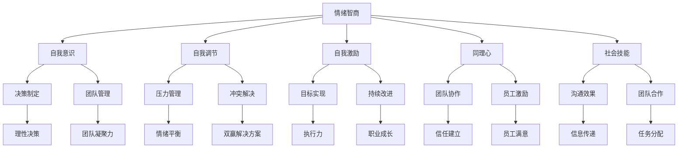

                 

### 文章标题

《领导力与情绪智商：控制情绪的智慧》

### 关键词

领导力、情绪智商、情绪管理、团队管理、决策制定、冲突解决

### 摘要

在现代社会中，领导力与情绪智商已成为衡量领导者成功与否的重要标准。本文旨在探讨情绪智商在领导力中的重要性，通过详细分析情绪智商的核心概念、情绪管理技巧及其在领导力中的应用，帮助读者理解如何通过控制情绪来实现高效的领导。文章将结合实际案例，提供提升情绪智商的方法，并总结情绪智商对领导力的影响。通过本文的阅读，读者将获得对情绪智商的深入理解，并学会如何在领导岗位上有效运用这一智慧。

## 引言

### 书籍目的与重要性

在当前快速发展的社会环境中，领导力作为一种关键能力，被广泛应用于各个领域。然而，传统的领导力理论往往侧重于策略、决策和组织管理，而忽略了领导者自身情感素养的重要性。近年来，情绪智商这一概念逐渐受到学术界和企业的关注，成为提升领导效能的重要途径。

《领导力与情绪智商：控制情绪的智慧》旨在填补这一空白，通过系统探讨情绪智商的核心概念、情绪管理技巧及其在领导力中的应用，帮助读者理解如何通过控制情绪来实现高效的领导。本书不仅适用于企业管理者，也为各类领导者提供了实用的指导。

情绪智商的重要性不仅体现在个人层面，更体现在组织层面。一个具有高情绪智商的领导者能够更好地处理压力、激励团队、解决问题和应对挑战，从而提升组织的整体绩效和竞争力。因此，了解和提升情绪智商对于现代领导者来说至关重要。

### 情绪智商的基本概念

情绪智商，又称情感智商（Emotional Intelligence，简称EQ），是指个体识别、理解、管理自己情绪的能力，以及识别、理解和影响他人情绪的能力。情绪智商的概念由心理学家约翰·梅耶（John D. Mayer）和彼得·萨洛维（Peter Salovey）在1990年代提出，他们认为情绪智商是衡量个体成功的关键因素之一，甚至比传统的智商（IQ）更为重要。

情绪智商通常被划分为五个核心要素：

1. **自我意识**：指个体对自己情绪的识别和理解。这包括能够准确感知自己的情绪状态，理解情绪对自己行为和决策的影响。
2. **自我调节**：指个体管理和调整自己情绪的能力。这包括使用有效策略来调节负面情绪，保持情绪的平衡和稳定。
3. **自我激励**：指个体在面临挑战时能够自我激励，保持积极态度和高度动力。这包括设定目标、规划实现目标的路径，并在实现过程中保持专注和坚持。
4. **同理心**：指个体能够理解和感受他人情绪的能力。这包括对他人情绪的识别、理解和反应，从而建立良好的人际关系。
5. **社交技能**：指个体在社交环境中有效地与他人沟通和协作的能力。这包括有效表达自己、倾听他人、建立信任和解决冲突等技能。

梅耶和萨洛维提出，情绪智商的核心要素不仅对个人发展有重要影响，也对领导力有着深远的作用。具有高情绪智商的领导者能够更好地理解自己和他人，有效管理情绪，从而在领导岗位上取得更好的成效。

### 情绪智商与领导力的关系

情绪智商在领导力中的作用不可忽视。一个高情绪智商的领导者不仅能够更好地理解和管理自己的情绪，还能有效识别和影响他人的情绪，从而在领导过程中取得显著优势。

首先，情绪智商有助于领导者更好地理解自己。自我意识是情绪智商的核心要素之一，它使领导者能够准确感知自己的情绪状态，理解情绪如何影响决策和行为。这种自我认知有助于领导者避免情绪化的决策，从而提高决策的质量和准确性。

其次，情绪智商有助于领导者管理团队情绪。同理心和社交技能使领导者能够理解团队成员的情绪状态，并通过有效的沟通和激励策略来调动团队的积极性和合作精神。这种情感上的连接能够增强团队的凝聚力，提高工作效率和创造力。

此外，情绪智商在冲突管理和决策制定中发挥着重要作用。高情绪智商的领导者能够更好地处理冲突，通过理解和调节自己及他人的情绪，找到双赢的解决方案。在决策过程中，情绪智商使领导者能够保持冷静和理性，避免被情绪所左右，从而做出更明智的决策。

总的来说，情绪智商是领导力的关键组成部分。它不仅影响领导者的个人成长，还直接影响领导效能和组织绩效。因此，提升情绪智商对于领导者来说是一项重要且迫切的任务。

## 情绪智商的核心概念

### 情绪智商的定义与构成

情绪智商（Emotional Intelligence，简称EQ）是指个体识别、理解、管理自己情绪的能力，以及识别、理解和影响他人情绪的能力。这一概念最早由心理学家约翰·梅耶（John D. Mayer）和彼得·萨洛维（Peter Salovey）在1990年代提出。与传统的智商（IQ）不同，情绪智商关注的是情感而非认知能力，是衡量个体在社会和情感环境中成功的重要因素。

情绪智商的构成要素主要包括自我意识、自我调节、自我激励、同理心和社会技能。以下是每个要素的详细说明：

1. **自我意识**：自我意识是情绪智商的基础，它涉及个体对自己情绪的识别和理解。这包括能够感知自己情绪的起因、情绪状态以及情绪对行为和决策的影响。自我意识使个体能够更好地管理自己的情绪，从而做出更为理智和有效的决策。

2. **自我调节**：自我调节是指个体在情感上的自我控制和调节能力。它包括使用有效策略来管理负面情绪，保持情绪的平衡和稳定。自我调节使个体能够在压力和挑战面前保持冷静，从而更好地应对复杂情境。

3. **自我激励**：自我激励是指个体在面临挑战时能够自我激励，保持积极态度和高度动力。这包括设定目标、规划实现目标的路径，并在实现过程中保持专注和坚持。自我激励使个体能够克服困难，追求卓越，实现个人和职业目标。

4. **同理心**：同理心是指个体能够理解和感受他人情绪的能力。它包括对他人情绪的识别、理解和反应，从而建立良好的人际关系。同理心使个体能够更好地理解和满足他人的需求，提高沟通效果和团队合作能力。

5. **社会技能**：社会技能是指个体在社交环境中与他人有效沟通和协作的能力。它包括有效表达自己、倾听他人、建立信任和解决冲突等技能。社会技能使个体能够建立和维护健康的人际关系，提升领导力和团队绩效。

### 情绪智商与领导力的关系架构 Mermaid 流程图

情绪智商对领导力的影响可以通过以下 Mermaid 流程图来展示：

该流程图清晰地展示了情绪智商的五个核心要素如何与领导力中的关键领域（如决策制定、团队管理、冲突解决等）相互关联。通过这种关系架构，读者可以更直观地理解情绪智商在领导力中的重要作用。

### 情绪智商对领导效果的影响

情绪智商对领导效果的影响是多方面的，它在多个关键领域发挥着重要作用。首先，在决策制定方面，高情绪智商的领导者能够更好地理解自身情绪，避免情绪化决策。他们能够冷静分析问题，从多个角度评估潜在风险和收益，从而做出更为明智的决策。

其次，情绪智商在团队管理中同样至关重要。具有高情绪智商的领导者能够识别团队成员的情绪状态，理解他们的需求和期望，从而采取适当的激励措施。这种同理心使团队更加紧密，提高了团队的凝聚力和工作效率。

在冲突解决方面，情绪智商同样扮演了关键角色。高情绪智商的领导者能够有效地调节自己和他人的情绪，找到双赢的解决方案。他们能够避免情绪激化，通过理性分析和有效沟通来化解冲突，维护团队和谐。

此外，情绪智商在领导力中的角色还体现在压力管理和持续改进方面。高情绪智商的领导者能够更好地管理压力，保持情绪平衡。他们在面对挑战和困难时能够保持积极态度，不断寻求改进和进步。这种自我激励和自我调节能力使他们能够在竞争激烈的环境中保持领先地位。

总的来说，情绪智商对领导效果的影响是深远和广泛的。它不仅提高了领导者的个人素养和决策能力，还增强了团队的凝聚力和工作效率，最终推动组织绩效的提升。因此，提升情绪智商对于领导者来说是一项重要且有益的任务。

### 情绪智商在组织管理中的角色

情绪智商在组织管理中的角色同样不容忽视。首先，在团队管理方面，高情绪智商的管理者能够更好地识别和理解团队成员的情绪状态。通过同理心和社交技能，他们能够有效地激励和引导团队成员，提高团队的整体士气和生产力。

其次，情绪智商在决策制定过程中也发挥着重要作用。具有高情绪智商的管理者能够冷静分析问题，避免情绪化决策。他们在面对复杂和不确定的情况时，能够保持理性，从多个角度评估潜在风险和收益，从而做出更为明智的决策。

在冲突管理方面，情绪智商同样发挥了关键作用。高情绪智商的管理者能够有效地调节自己和他人的情绪，找到双赢的解决方案。他们能够避免冲突升级，通过理性分析和有效沟通来化解矛盾，维护团队的和谐与稳定。

此外，情绪智商在组织文化塑造中也起到了重要作用。高情绪智商的管理者能够建立积极的组织文化，通过积极的情感表达和互动，促进团队成员之间的信任和合作。这种文化有助于提升组织的整体绩效和创新能力。

总之，情绪智商在组织管理中具有多重角色，它不仅提升了管理者的个人素养和决策能力，还促进了团队的凝聚力和工作效率，最终推动了组织的可持续发展。因此，组织管理者应重视提升情绪智商，将其作为提升管理效能的重要途径。

### 情绪管理技巧

情绪管理是情绪智商的核心要素之一，对于领导者来说尤为重要。有效的情绪管理不仅能够提升个人素养，还能显著影响团队和组织的整体效能。以下我们将详细探讨几种关键的情绪管理技巧，包括自我意识、自我调节、自我激励和社会意识。

#### 自我意识

自我意识是情绪管理的基石，它涉及到个体对自己情绪的识别和理解。一个具有高自我意识的人能够清楚地感知自己的情绪状态，并了解这些情绪是如何影响他们的行为和决策的。以下是一些提升自我意识的方法：

1. **情绪日记**：定期记录自己的情绪变化，包括情绪的类型、发生的情境以及情绪对自己的影响。这种方法有助于个体更好地理解自己的情绪模式。
2. **情绪地图**：通过绘制情绪地图，将不同情绪在时间和情境中的分布情况可视化，从而更直观地了解自己的情绪状态。
3. **反思与自我提问**：在面临重要决策或冲突时，停下来反思自己的情绪反应，问自己这些情绪是如何影响当前情境的，以及如何更理智地应对。

#### 自我调节

自我调节是指个体管理和调整自己情绪的能力，尤其是在面对压力和挑战时。以下是一些提升自我调节技巧的方法：

1. **呼吸练习**：深呼吸有助于减轻紧张和焦虑，通过慢而深的呼吸，个体能够迅速恢复冷静。
2. **放松技巧**：练习瑜伽、冥想或其他放松技巧，有助于减轻压力，提高情绪平衡。
3. **情绪应对策略**：当情绪波动时，可以采取积极的应对策略，如运动、听音乐或进行一些感兴趣的活动，从而转移注意力，缓解负面情绪。
4. **自我对话**：通过积极的自我对话，个体可以调整自己的思维方式和情绪反应，避免消极的自我评价和过度担忧。

#### 自我激励

自我激励是指个体在面对挑战时能够自我激励，保持积极态度和高度动力。以下是一些提升自我激励技巧的方法：

1. **目标设定**：设定明确的个人和职业目标，并将目标分解为可实现的步骤。这种方法有助于个体保持动力和专注。
2. **奖励机制**：为自己设定奖励，每完成一个目标或阶段性任务，就给自己一些奖励，从而增强成就感和动力。
3. **正面思考**：培养积极的心态，关注自己的优势和成就，避免消极的自我评价和过度自我批评。
4. **角色模型**：寻找并学习成功人士的经验和策略，将他们的成功作为激励自己的动力。

#### 社会意识

社会意识是指个体能够理解和识别他人的情绪，并通过有效的沟通和互动来促进积极的情感交流。以下是一些提升社会意识的技巧：

1. **同理心练习**：通过阅读、观看电影或参与模拟情境，培养对他人情绪的敏感度和理解力。
2. **倾听技巧**：在沟通中，注重倾听他人的观点和感受，避免打断和急于表达自己的意见。
3. **非语言沟通**：注意自己的肢体语言、面部表情和语调，确保它们与言语表达一致，从而增强沟通效果。
4. **情感反馈**：在适当的情境下，给予他人积极的情感反馈，表达对他们情绪的理解和支持。

总之，情绪管理技巧不仅对个人发展至关重要，也对领导力有着深远的影响。领导者通过有效的情绪管理，不仅能够提升自己的个人素养，还能更好地激励和引导团队，实现组织目标。

### 情绪智商在团队管理中的应用

情绪智商在团队管理中的应用至关重要，它不仅能提升团队的整体绩效，还能增强团队凝聚力。一个具有高情绪智商的领导者能够在团队管理中发挥关键作用，通过有效的情绪管理技巧来促进团队合作、激发团队成员的潜力，并在面对冲突时找到合适的解决方案。

#### 建立积极的团队氛围

建立积极的团队氛围是团队管理的重要一环。具有高情绪智商的领导者能够识别和理解团队成员的情绪状态，并通过积极的情感表达和互动来营造一个友好、支持和鼓励的环境。

1. **情感反馈**：领导者应鼓励团队成员之间进行积极、真诚的情感反馈，这有助于增强团队成员之间的信任和理解。通过赞赏、鼓励和认可，领导者可以激发团队成员的积极性和创造力。
2. **同理心**：同理心是建立积极团队氛围的关键要素。领导者需要具备对他人情绪的敏感度和理解力，能够站在团队成员的角度考虑问题，从而更好地满足他们的需求和期望。
3. **情感沟通**：领导者应注重情感沟通，通过开放、诚实和透明的交流来建立团队的信任和凝聚力。有效的情感沟通不仅能解决团队成员之间的矛盾和误解，还能促进团队成员之间的合作和协作。

#### 领导者的情绪管理

领导者的情绪管理对团队氛围和成员士气有着直接的影响。高情绪智商的领导者能够自我调节情绪，避免情绪波动对团队造成的负面影响。

1. **情绪自我调节**：领导者需要学会情绪自我调节技巧，如深呼吸、冥想和放松练习，以保持冷静和理智。在面临压力和挑战时，领导者应避免过度情绪化，从而做出更为明智和合理的决策。
2. **情绪表达**：领导者需要学会如何表达自己的情绪，确保情绪表达是建设性和适时的。在表达负面情绪时，领导者应避免指责和攻击，而是采取更为客观和中立的方式来沟通，以避免伤害团队成员的感情。
3. **情绪领导力**：领导者应通过情绪领导力来激励和引导团队成员。他们应关注团队成员的情感需求，通过情感激励来激发团队成员的内在动力，从而提高团队的整体绩效。

#### 激励团队成员

激励团队成员是团队管理中的重要任务。高情绪智商的领导者能够识别和理解团队成员的动机和需求，从而采取有效的激励措施。

1. **个性化激励**：每个团队成员都有独特的需求和动机，领导者应通过个性化激励来满足他们的需求。这可以通过设定个人目标、提供发展机会和奖励来实现。
2. **情感认可**：领导者应通过情感认可来激励团队成员，如公开赞赏和表彰团队成员的成就，增强他们的自信心和归属感。
3. **情感支持**：领导者应提供情感支持，帮助团队成员应对工作和生活中的挑战。这可以通过倾听、理解和关心来实现，从而增强团队成员之间的信任和凝聚力。

#### 应对团队冲突

团队冲突是团队管理中不可避免的问题。高情绪智商的领导者能够通过有效的情绪管理技巧来应对和解决团队冲突，维护团队的和谐与稳定。

1. **情绪调节**：在冲突发生时，领导者需要先进行情绪调节，避免过度情绪化和激化冲突。通过深呼吸、冥想或其他放松技巧，领导者可以迅速恢复冷静和理智。
2. **同理心**：领导者应具备同理心，理解和尊重团队成员的情感和立场。通过换位思考和情感共鸣，领导者可以更好地理解冲突的根源，并找到合适的解决方案。
3. **有效沟通**：领导者应通过有效沟通来解决团队冲突。这包括倾听、表达和理解，确保冲突双方都能充分表达自己的观点和感受，从而找到共同点和解决方案。

总之，情绪智商在团队管理中的应用具有重要作用。具有高情绪智商的领导者能够通过有效的情绪管理技巧来建立积极的团队氛围、激励团队成员并解决团队冲突，从而提高团队的整体绩效和凝聚力。领导者应不断提升自己的情绪智商，以应对日益复杂的团队管理挑战。

### 情绪智商在决策制定中的作用

情绪智商在决策制定过程中发挥着至关重要的作用。一个具有高情绪智商的领导者能够在面对复杂决策时，保持冷静和理性，避免情绪对决策产生负面影响，从而做出更为明智和有效的决策。

首先，自我意识是情绪智商的核心要素之一。高情绪智商的领导者能够识别和理解自己的情绪状态，包括对情绪的起因、类型和影响的清晰认识。这种自我认知能力使他们能够在决策过程中意识到自身情绪的存在，并避免被情绪所左右。例如，当领导者面临重要决策时，如果能够意识到自己正处于焦虑或愤怒的情绪中，他们可以采取适当的策略来调节情绪，从而避免做出冲动和不理智的决策。

其次，自我调节能力也是决策制定中的关键因素。高情绪智商的领导者具备自我控制和情绪调节的技巧，能够在压力和不确定性面前保持冷静和理智。他们通过深呼吸、冥想或放松练习等方法来管理自己的情绪，从而在决策过程中保持情绪的平衡和稳定。这种情绪调节能力有助于领导者更好地分析问题、评估风险和收益，从而做出更为明智的决策。

自我激励也是情绪智商在决策制定中的作用之一。具有高自我激励能力的领导者能够在面对困难和挑战时，保持积极的态度和高度的动力。他们能够设定清晰的目标，制定实现目标的策略，并在实现过程中保持专注和坚持。这种自我激励能力使领导者在决策制定过程中能够克服困难和阻力，保持决策的连续性和有效性。

同理心是情绪智商中的另一个关键要素，它对决策制定有着重要的影响。高情绪智商的领导者能够理解和感受他人的情绪，这种同理心能力使他们能够更好地了解团队成员的需求和期望。在决策过程中，领导者可以站在团队成员的角度考虑问题，从而做出更符合团队利益和期望的决策。同理心还有助于领导者建立信任和合作关系，提高决策执行的效率和效果。

最后，社交技能在决策制定中也发挥着重要作用。高情绪智商的领导者具备有效的沟通和协作能力，能够在团队内部建立良好的沟通渠道和协作机制。他们能够倾听团队成员的意见和反馈，收集多方面的信息，从而做出更为全面和客观的决策。同时，领导者还可以通过有效的沟通和协调，使团队成员更好地理解和接受决策，提高决策执行的执行力和成功率。

综上所述，情绪智商在决策制定中具有重要作用。一个具有高情绪智商的领导者能够通过自我意识、自我调节、自我激励、同理心和社交技能等要素，更好地管理情绪，做出更为明智和有效的决策。因此，提升情绪智商对于领导者来说是一项重要且有益的任务，它不仅能够提高个人决策能力，还能促进团队的协作和组织的整体绩效。

### 情绪智商在冲突解决中的应用

情绪智商在冲突解决中的应用至关重要，它不仅有助于领导者找到合适的解决方案，还能有效缓解冲突带来的负面影响，维护团队的和谐与稳定。以下是情绪智商在冲突解决中的具体应用和策略：

#### 情绪调节

在冲突解决过程中，领导者首先需要调节自己的情绪，保持冷静和理智。高情绪智商的领导者能够识别和理解自己的情绪状态，并通过深呼吸、冥想或放松练习等方法来管理情绪，避免情绪激化冲突。例如，当面对激烈冲突时，领导者可以通过深呼吸来平复情绪，从而更好地分析和处理冲突。

#### 同理心

同理心是情绪智商中的重要要素，它在冲突解决中起着关键作用。领导者需要具备对他人情绪的敏感度和理解力，能够站在对方的角度考虑问题，从而找到双方都能接受的解决方案。通过同理心，领导者可以更好地理解冲突的原因和双方的需求，从而制定出更为公平和合理的解决方案。

#### 沟通技巧

有效的沟通技巧是解决冲突的关键。领导者需要具备良好的沟通能力，能够清晰地表达自己的观点和感受，同时倾听对方的意见和诉求。通过开放、诚实和透明的沟通，领导者可以促进双方的理解和共识，从而找到解决问题的方法。例如，在冲突发生时，领导者可以采取“我-信息”沟通方式，表达自己的感受和需求，避免指责和攻击对方。

#### 双赢策略

在冲突解决中，寻找双赢的解决方案是理想的目标。领导者需要通过合理的利益分配和合作机制，使双方都能在冲突中得到满足。通过平衡双方的利益和需求，领导者可以制定出公平和可持续的解决方案，从而避免冲突的再次发生。

#### 建立信任

建立信任是解决冲突的基础。领导者需要通过诚信和承诺来建立与团队成员之间的信任关系。在冲突解决过程中，领导者应保持中立和公正，避免偏袒任何一方，从而赢得双方的信任和尊重。信任关系的建立有助于冲突的解决和团队的长期稳定。

总之，情绪智商在冲突解决中的应用至关重要。一个具有高情绪智商的领导者能够通过情绪调节、同理心、沟通技巧、双赢策略和建立信任等策略，有效地解决冲突，维护团队的和谐与稳定。因此，提升情绪智商对于领导者来说是一项重要且有益的任务。

### 案例分析

为了更好地理解情绪智商在领导力实践中的应用，以下将介绍两个成功案例和一个失败案例，通过具体实例展示情绪智商在实际工作环境中的影响。

#### 成功案例一：谷歌的领导力文化

谷歌以其独特的领导力和企业文化而闻名，其成功离不开高情绪智商的领导者。谷歌的创始人拉里·佩奇（Larry Page）和谢尔盖·布林（Sergey Brin）就是两个典型的高情绪智商领导者。他们在公司文化中强调同理心、开放性和创新精神，这种文化极大地促进了谷歌的快速发展。

1. **同理心**：佩奇和布林在管理过程中始终关注员工的情感需求，通过定期的员工反馈会议和开放的沟通渠道，了解员工的意见和建议。他们能够站在员工的角度考虑问题，从而制定出符合员工期望的政策和措施。
2. **自我激励**：佩奇和布林在面对挑战时能够自我激励，保持积极的态度和高度的动力。他们设定明确的目标，并通过持续的创新和改进来实现这些目标。他们的自我激励精神激励了整个团队，使谷歌成为全球最具创新力的公司之一。
3. **社交技能**：佩奇和布林具备出色的社交技能，能够有效地沟通和协调团队内部和外部的关系。他们在面对复杂的商业环境时，能够建立广泛的合作伙伴关系，为谷歌的发展提供了强有力的支持。

#### 成功案例二：微软的领导转型

微软在经历了几次领导层的变动后，通过提升领导者的情绪智商，实现了公司的成功转型。在萨提亚·纳德拉（Satya Nadella）的领导下，微软逐渐从传统的软件公司转型为云计算和人工智能领域的领军企业。

1. **自我调节**：纳德拉在领导过程中展现出了出色的自我调节能力。在面对公司战略调整和市场变化时，他能够迅速调整自己的情绪和心态，保持冷静和理智，从而做出明智的决策。
2. **同理心**：纳德拉注重员工的情感需求，通过开放的沟通渠道和定期的员工反馈机制，了解员工的意见和建议。他的同理心使他能够更好地理解员工的需求和期望，从而制定出更为人性化的管理措施。
3. **社交技能**：纳德拉具备出色的社交技能，能够有效地沟通和协调团队内部和外部的关系。他通过建立广泛的合作伙伴关系，为微软的发展提供了强有力的支持。

#### 失败案例：特斯拉的领导挑战

尽管特斯拉在电动汽车领域取得了巨大成功，但其领导者埃隆·马斯克（Elon Musk）在情绪管理方面存在明显不足，导致了一系列的领导挑战。

1. **情绪波动**：马斯克在公开场合表现出的情绪波动，尤其是在面对媒体和投资者时，常常引起公众的关注和质疑。他的情绪化行为不仅影响了公司的形象，还可能对员工士气产生负面影响。
2. **沟通障碍**：马斯克在沟通方面存在障碍，有时未能有效传达公司的战略目标和愿景，导致员工对公司的未来感到困惑和不安。这种沟通障碍可能导致员工缺乏动力和方向感。
3. **决策失误**：马斯克的决策有时受到情绪的影响，导致公司面临风险和挑战。例如，在2018年，特斯拉因生产问题导致Model 3交付延迟，引发了投资者的担忧和股价波动。

总之，通过上述成功和失败案例，我们可以看到情绪智商在领导力实践中的重要性。具有高情绪智商的领导者能够更好地管理自己的情绪，理解员工的情感需求，并通过有效的沟通和决策来推动组织的发展。相反，情绪管理不足的领导者可能会面临一系列挑战，甚至影响组织的整体绩效。因此，提升情绪智商对于领导者来说是一项至关重要且持续的任务。

### 情绪智商提升方法

提升情绪智商是一项系统性的任务，需要从多个方面进行努力。以下提供几种有效的方法，帮助领导者提升情绪智商，从而在领导岗位上更加得心应手。

#### 教育与培训

1. **情绪智商课程**：参加专门的情绪智商课程，了解情绪智商的核心概念和构成要素。这些课程通常包括自我意识、自我调节、自我激励、同理心和社会技能等方面的内容。
2. **心理学学习**：深入学习心理学知识，特别是情感心理学和管理心理学。通过了解情绪的本质、情绪对个体行为的影响以及情绪调节策略，领导者可以更好地理解和管理自身和团队的情绪。
3. **在线资源**：利用在线资源，如TED演讲、学术论文和博客等，持续学习和探索情绪智商的相关知识。这些资源提供了丰富的理论和实践案例，有助于领导者不断更新和提升自己的认知。

#### 心理辅导与咨询服务

1. **个人辅导**：寻求专业的心理咨询师或职业顾问进行个人辅导。通过一对一的交流，心理咨询师可以提供针对性的建议和指导，帮助领导者识别和解决情绪问题。
2. **团队辅导**：组织团队心理辅导活动，增强团队成员之间的情感连接和信任。这种活动可以包括情绪管理培训、团队合作练习和情绪反馈会议等。
3. **领导力教练**：聘请专业的领导力教练，为领导者提供个性化的培训和指导。领导力教练可以根据领导者的具体需求和情况，制定个性化的提升计划，帮助领导者不断提升情绪智商。

#### 自我提升策略

1. **自我反思**：定期进行自我反思，识别自己的情绪状态和行为模式。通过记录情绪日记或进行心理测试，领导者可以更清晰地了解自己的情绪状况，从而有针对性地进行调节和改进。
2. **情绪调节练习**：通过冥想、深呼吸和瑜伽等情绪调节练习，帮助领导者减轻压力，保持情绪平衡。这些练习有助于提高领导者的情绪稳定性和自我控制能力。
3. **积极心态**：培养积极的心态，关注自己的优势和成就。领导者可以通过设定小目标、庆祝成功和寻找生活中的乐趣来增强自我激励和积极情绪。

#### 实际应用

1. **情景模拟**：通过模拟情境，领导者可以在实际操作中练习情绪管理和决策制定。这种方法有助于领导者将理论知识应用到实际工作中，提高情绪智商的应用能力。
2. **角色扮演**：与团队成员一起进行角色扮演练习，模拟不同情绪状态下的行为和反应。通过这种练习，领导者可以更好地理解和管理自身情绪，同时提高同理心和社交技能。
3. **反馈与改进**：定期收集团队成员的反馈，了解他们在情绪管理和领导力方面的体验和感受。领导者可以根据反馈进行自我评估和改进，不断提升情绪智商。

总之，提升情绪智商需要领导者从多个方面进行努力，包括教育与培训、心理辅导、自我提升策略和实际应用。通过这些方法，领导者可以更好地管理自己的情绪，提升领导效能，从而在领导岗位上取得更大的成功。

### 总结

通过本文的探讨，我们可以清楚地看到情绪智商在领导力中的重要性。情绪智商不仅帮助领导者更好地理解和管理自己的情绪，还使他们能够更有效地激励和引导团队，解决冲突，做出明智的决策。具有高情绪智商的领导者能够建立积极的团队氛围，提升组织绩效，实现可持续发展。

情绪智商的提升是一项长期而系统的任务，需要领导者从自我意识、自我调节、自我激励、同理心和社会技能等多个方面进行努力。通过教育与培训、心理辅导、自我提升策略和实际应用，领导者可以不断提升情绪智商，从而在领导岗位上更加得心应手。

总之，情绪智商是现代领导者必备的能力。只有通过不断提升情绪智商，领导者才能在复杂多变的环境中保持冷静和理智，带领团队取得成功。希望本文能够为读者提供有价值的启示，激发他们对情绪智商的重视和探索。作者：AI天才研究院/AI Genius Institute & 禅与计算机程序设计艺术 /Zen And The Art of Computer Programming。

