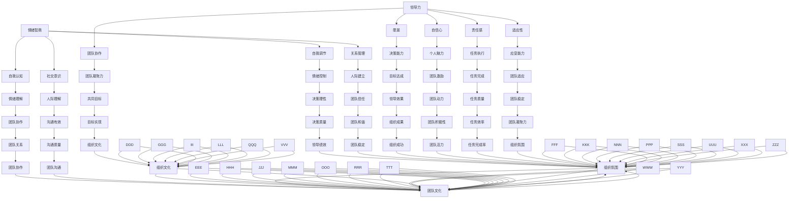

                 

### 背景介绍

在当今快速变化和高度竞争的商业环境中，领导力与情绪智商成为组织成功的关键因素。领导力不仅仅关乎个人魅力的展现，更涉及到如何激发团队潜力，实现共同目标。而情绪智商，则是指个体识别、理解和管理自己及他人情绪的能力。情绪智商的高低直接影响到团队的整体绩效和组织的文化氛围。

随着信息技术的迅猛发展，企业和组织对员工的要求也日益提高。传统的管理方法已无法应对复杂多变的市场环境。现代领导力要求领导者不仅具备战略眼光和决策能力，更需要在情绪管理上做到游刃有余。领导者必须学会如何面对和处理团队成员的情绪波动，如何通过情绪智商的提升来增强团队凝聚力，以及如何在逆境中保持积极心态，带领团队走向成功。

本文旨在探讨领导力与情绪智商之间的内在联系，通过详细分析自我情绪管理、情绪智力与沟通、情绪智力与团队管理等方面的内容，帮助读者理解并提升自身的情绪智商。文章将以逻辑清晰、结构紧凑、简单易懂的专业技术语言，逐步剖析情绪智商在领导力中的应用，并提供实用的方法与技巧，以期为领导者提供实践指导，促进团队和组织的全面发展。

### 核心概念与联系

在深入探讨领导力与情绪智商的关系之前，我们首先需要明确这两个核心概念及其相互之间的联系。

#### 领导力的定义与特征

领导力是一种复杂的多维度能力，它不仅包括个人魅力和影响力，还涉及到决策、沟通、激励、协调等多个方面。领导力可以被定义为影响他人实现共同目标的能力。其特征包括：愿景、自信心、责任感、适应性、团队协作等。

- **愿景（Vision）**：领导者需要具备远见和目标感，能够为团队描绘一幅清晰的发展蓝图，并激励团队成员为之奋斗。
- **自信心（Self-Confidence）**：领导者应具备坚定的自信心，这不仅能增强自身的决策能力，还能为团队成员提供信心和安全感。
- **责任感（Accountability）**：领导者需对团队和组织的成果负责，这种责任感体现在对任务的认真态度和对团队成员的支持上。
- **适应性（Adaptability）**：领导者需要具备适应环境变化的能力，灵活应对各种挑战和不确定性。
- **团队协作（Team Collaboration）**：领导者的成功在很大程度上取决于其能否有效地协调团队工作，实现团队协作最大化。

#### 情绪智商的定义与维度

情绪智商（Emotional Intelligence，简称EQ）是一种识别、理解和管理自己及他人情绪的能力。情绪智商通常包括四个主要维度：自我认知、自我调节、社交意识和关系管理。

- **自我认知（Self-awareness）**：这是情绪智商的基础，指的是个体对自己情绪状态的认识和感知能力。自我认知有助于个体更好地理解自己的情绪，从而做出更合理的决策。
- **自我调节（Self-regulation）**：指的是个体管理和调整自己情绪的能力，以适应不同情境的需要。自我调节能力强的人能够更好地控制情绪波动，保持冷静和理性。
- **社交意识（Social Awareness）**：这涉及对他人情绪和感受的理解，包括察觉他人情绪的能力和对情绪在社会互动中的作用的认知。
- **关系管理（Relationship Management）**：指的是个体运用情绪智力来建立和维护健康的人际关系，这包括解决冲突、激励他人和建立团队凝聚力。

#### 领导力与情绪智商的关系架构

领导力与情绪智商之间的关系可以看作是一种相辅相成的动态互动。情绪智商对领导力的提升有以下几个方面的作用：

1. **增强自我认知与自我调节**：情绪智商高的领导者能够更好地理解和管理自己的情绪，从而在面对压力和挑战时保持冷静和决策能力。
2. **提高社交意识与关系管理**：领导者通过高水平的社交意识，能够更好地理解团队成员的情绪和需求，从而建立互信和合作关系。
3. **促进团队协作与沟通**：情绪智商高的领导者能够通过有效的沟通和激励，激发团队潜力，实现共同目标。

为了更直观地理解这两个概念之间的联系，我们可以使用Mermaid流程图来展示：

通过上述流程图，我们可以清晰地看到领导力与情绪智商之间相互关联的多个维度，以及它们如何共同作用于团队和组织的发展。理解这两个核心概念及其相互关系，将为后续章节的深入探讨打下坚实的基础。

### 自我情绪管理

自我情绪管理是情绪智商的基础，也是领导力的关键组成部分。自我情绪管理能力强的领导者能够更好地理解自己的情绪，从而在面临压力和挑战时做出更合理、更有效的决策。下面，我们将探讨如何认识和调整自己的情绪，以及如何通过自我控制来实现情绪的稳定和积极状态。

#### 认识自己的情绪

首先，领导者需要学会如何认识和识别自己的情绪。情绪并不是一种主观的感受，它们有其生物学和心理学的根源。领导者可以通过以下方法来认识自己的情绪：

1. **情绪日记**：记录每天的情绪变化，包括情绪的类型（如焦虑、愉悦、愤怒等）、情绪发生的时间和情境、情绪的影响等。通过持续记录，领导者可以逐步建立起对自身情绪的敏锐感知能力。
   
2. **情绪标签**：为常见的情绪赋予标签，例如“紧张”、“兴奋”、“沮丧”等。这样做可以帮助领导者快速识别和分类情绪，从而更好地理解情绪背后的原因。

3. **情绪映射**：通过身体感受和情感状态来识别情绪。例如，当感到心跳加速、肌肉紧张时，可能正在经历焦虑；当感到轻松愉快时，可能是处于愉悦状态。

#### 调整自己的情绪

在认识情绪之后，领导者需要学会如何调整和调节情绪，以应对各种情境。以下是一些实用的情绪调节策略：

1. **深呼吸**：当感到情绪波动时，可以尝试深呼吸练习。深呼吸有助于降低心率，放松身体，从而缓解紧张和焦虑情绪。具体做法是慢慢吸气，使腹部膨胀，然后缓慢呼气，感受身体的放松。

2. **正念冥想**：通过正念冥想，领导者可以培养对当前情绪和体验的专注和接纳。正念练习包括坐姿冥想、身体扫描等，可以帮助领导者更好地理解和接纳自己的情绪。

3. **情绪重构**：通过改变对事件和情境的认知和解释，来调节情绪。例如，面对一项困难的任务时，可以将其视为一种挑战和成长的机会，而不是一种负担。

#### 情绪的自我控制

情绪的自我控制是领导者成熟和有效的标志。通过以下方法，领导者可以更好地控制自己的情绪：

1. **延迟反应**：在面对激动或愤怒的情境时，领导者可以尝试先暂停一下，让自己冷静下来。通过延迟反应，领导者可以避免在情绪激动时做出冲动和错误的决定。

2. **认知重评**：领导者可以通过认知重评来调整自己的思维方式。例如，将负面情绪转化为积极情绪，将失败视为学习机会，而不是打击。

3. **角色扮演**：领导者可以尝试从他人的角度来审视自己的情绪和行为。通过角色扮演，领导者可以更好地理解他人的感受，从而调整自己的情绪和行为。

#### 实践举例

假设一位项目经理在项目截止日期前面临严重的压力。通过以下方法，他可以有效地管理自己的情绪：

1. **记录情绪日记**：他可以每天记录自己的情绪变化，了解自己何时感到焦虑或沮丧，并分析这些情绪的触发因素。

2. **深呼吸**：每当感到紧张时，他可以停下来进行深呼吸练习，以缓解压力。

3. **正念冥想**：他可以每天进行正念冥想，帮助自己保持冷静和专注。

4. **情绪重构**：他将项目压力视为一个挑战，而不是负担，相信自己有能力应对并解决问题。

5. **延迟反应**：在团队会议中，他避免在情绪激动时立即发言，而是先倾听他人的意见，再做出决策。

6. **认知重评**：他意识到失败是成长的一部分，每次遇到困难时，他都会将其视为一个学习和改进的机会。

通过上述方法，这位项目经理不仅能够有效管理自己的情绪，还能在团队中树立积极的榜样，增强团队的凝聚力和士气。

总之，自我情绪管理是领导者不可或缺的能力。通过认识和调整自己的情绪，领导者可以更好地应对挑战，保持冷静和理性，从而做出更明智的决策，实现个人和团队的共同目标。

### 情绪智力与沟通

情绪智力（EQ）在沟通中扮演着至关重要的角色。高情商的领导者能够更好地理解他人的情绪，从而进行有效沟通，建立互信，并解决冲突。以下是情绪智力在沟通中的具体应用及其实际影响。

#### 有效沟通的策略

1. **倾听与理解**：倾听是沟通的基础。高情商的领导者会通过积极的倾听技巧，如保持目光接触、不打断对方发言等，来理解他人的观点和感受。通过倾听，领导者可以更准确地把握对方情绪，从而做出恰当回应。

2. **情感共鸣**：情感共鸣是指领导者能够设身处地地理解他人的情绪，并用言语或行为表达这种理解。通过情感共鸣，领导者可以拉近与团队成员的情感距离，建立信任和共鸣。

3. **清晰表达**：领导者需要清晰、准确地表达自己的想法和意图。高情商的领导者会使用简单明了的语言，避免使用过于复杂或模糊的表述，以确保信息的传递准确无误。

4. **非语言沟通**：非语言沟通，如肢体语言、面部表情和语调等，也是沟通的重要组成部分。高情商的领导者会注意自己的非语言表达，以确保其与言语表达一致，从而增强沟通效果。

#### 情绪智力在解决冲突中的应用

冲突是团队合作中不可避免的现象。高情商的领导者能够通过情绪智力来有效解决冲突，以下是几种常见的方法：

1. **识别和认可情绪**：在冲突中，领导者需要首先识别和认可双方的情绪。通过表达对对方情绪的理解，如“我理解你现在的感受”，可以减少对方的抵触情绪。

2. **避免情绪攻击**：在处理冲突时，领导者应避免情绪攻击，如指责、批评或嘲讽。这些行为往往只会加剧矛盾，而不是解决问题。相反，领导者应保持冷静和理性，以事实和逻辑来引导对话。

3. **寻求共同点**：领导者应努力寻找冲突双方的共同点，通过建立共同目标或利益来缓解紧张关系。例如，可以提出“我们的目标是确保项目成功，那么我们应该如何合作实现这个目标？”

4. **制定解决方案**：在解决冲突时，领导者应鼓励双方共同参与制定解决方案。通过这种方式，不仅可以找到双方都能接受的解决方案，还能增强团队的合作意识和凝聚力。

#### 情绪智力在团队协作中的应用

情绪智力不仅在解决冲突中发挥重要作用，还在团队协作中起到关键作用。以下是情绪智力在团队协作中的应用：

1. **促进团队沟通**：高情商的领导者能够通过有效的沟通促进团队协作。他们能够建立开放、透明和信任的沟通环境，使团队成员更愿意分享信息和意见。

2. **增强团队凝聚力**：通过识别和认可团队成员的情绪，领导者可以增强团队的凝聚力。例如，当团队成员遇到困难时，领导者可以提供支持和鼓励，从而增强团队的归属感和团队精神。

3. **激发团队潜力**：领导者通过情绪智力激发团队成员的潜力。他们能够识别团队成员的情感状态，并提供适当的激励和支持，以激发团队成员的工作热情和创造力。

#### 案例分析

假设一个团队在项目中期遇到了严重的技术难题，导致项目进度滞后。团队中有些人开始感到沮丧和焦虑。作为领导者，以下是如何应用情绪智力来处理这种情况：

1. **倾听与理解**：领导者首先通过倾听了解团队成员的担忧和情绪。他可能会说：“我注意到大家都很焦虑，这是很正常的，但我们可以一起找到解决方案。”

2. **情感共鸣**：领导者通过情感共鸣表达对团队成员的理解和支持。例如：“我理解你们现在的压力，但我相信我们有能力克服这个难题。”

3. **清晰表达**：领导者明确表达自己的观点和期望。他可能会说：“我们需要保持冷静，集中精力解决问题。让我们一起制定一个行动计划。”

4. **非语言沟通**：领导者通过积极的肢体语言和面部表情，如微笑和点头，来传达支持和鼓励。

5. **解决冲突**：当团队成员之间出现分歧时，领导者通过识别和认可情绪、避免情绪攻击、寻求共同点和制定解决方案来处理冲突。

6. **促进团队沟通**：领导者鼓励团队成员分享信息，建立信任和透明度，确保所有成员都能参与项目决策。

7. **增强团队凝聚力**：领导者通过认可团队成员的努力和成就，增强团队的凝聚力。例如，他可能会在团队会议上表扬某个成员的贡献。

8. **激发团队潜力**：领导者通过积极的激励和指导，帮助团队成员发挥最大潜力。他可能会说：“我相信你们每个人都有解决这个问题的能力，让我们一起努力。”

通过上述方法，领导者不仅解决了团队面临的困难，还增强了团队的协作和凝聚力，为项目的成功奠定了基础。

总之，情绪智力在沟通中的应用对于领导者的成功至关重要。通过倾听、理解、清晰表达和有效解决冲突，领导者可以建立开放、透明和信任的沟通环境，增强团队协作和凝聚力，从而实现个人和团队的目标。

### 情绪智力与团队管理

情绪智力在团队管理中扮演着至关重要的角色。高情商的领导者能够更好地理解和管理团队成员的情绪，从而提升团队的绩效和凝聚力。以下将探讨情绪智力在团队管理中的应用，包括团队建设、领导力和团队冲突管理等方面。

#### 情绪智力在团队建设中的应用

团队建设是领导者的核心任务之一，而情绪智力在此过程中发挥着关键作用。以下是情绪智力在团队建设中的应用：

1. **建立信任**：信任是团队协作的基础。高情商的领导者能够通过识别和认可团队成员的情绪，建立互信。例如，在团队会议中，领导者可以通过倾听和回应团队成员的感受，表达对他们的信任和理解。

2. **增强团队凝聚力**：领导者可以通过情感共鸣和激励来增强团队凝聚力。他们能够识别团队成员的情感需求，提供支持和鼓励，从而增强团队的归属感和团队精神。

3. **促进沟通**：高情商的领导者能够促进团队内部的沟通。他们能够识别和理解团队成员的情绪，从而提供适当的沟通策略，如鼓励开放讨论、建立透明度等。

4. **培养团队合作精神**：领导者可以通过激励和示范，培养团队成员的合作精神。他们能够识别和认可团队成员的贡献，并鼓励团队成员相互支持和协作。

#### 情绪智力在领导力中的应用

情绪智力对领导力有着深远的影响。高情商的领导者能够更好地应对团队情绪波动，提升领导效果。以下是情绪智力在领导力中的应用：

1. **情绪感知**：领导者需要具备敏锐的情绪感知能力，能够识别团队成员的情绪状态。这有助于领导者更好地理解团队的情绪氛围，从而采取适当的领导策略。

2. **情绪调节**：领导者需要能够调节自己的情绪，以保持冷静和理性。在面对团队情绪波动时，领导者可以通过深呼吸、冥想等方法来调节自己的情绪，从而做出更明智的决策。

3. **情绪引导**：领导者可以通过积极的情绪引导，影响团队成员的情绪状态。例如，在团队面临挑战时，领导者可以通过鼓舞人心的讲话和行动来激励团队成员保持积极态度。

4. **情绪支持**：领导者需要提供情感支持，帮助团队成员应对工作压力和个人挑战。通过倾听和理解，领导者可以提供必要的支持和鼓励，增强团队成员的信心和动力。

#### 情绪智力在团队冲突管理中的应用

团队冲突是团队合作中不可避免的现象。高情商的领导者能够通过情绪智力有效地管理团队冲突，以下是具体方法：

1. **识别和认可情绪**：在冲突发生时，领导者需要首先识别和认可双方的情绪。通过表达对对方情绪的理解，如“我理解你现在的感受”，可以减少对方的抵触情绪。

2. **避免情绪攻击**：在处理冲突时，领导者应避免情绪攻击，如指责、批评或嘲讽。这些行为往往只会加剧矛盾，而不是解决问题。相反，领导者应保持冷静和理性，以事实和逻辑来引导对话。

3. **寻求共同点**：领导者应努力寻找冲突双方的共同点，通过建立共同目标或利益来缓解紧张关系。例如，可以提出“我们的目标是确保项目成功，那么我们应该如何合作实现这个目标？”

4. **制定解决方案**：在解决冲突时，领导者应鼓励双方共同参与制定解决方案。通过这种方式，不仅可以找到双方都能接受的解决方案，还能增强团队的合作意识和凝聚力。

#### 实践举例

假设一个团队在项目中期遇到了技术难题，导致项目进度滞后。团队成员情绪波动较大，有些成员开始感到沮丧和焦虑。作为领导者，以下是如何应用情绪智力来处理这种情况：

1. **倾听与理解**：领导者首先通过倾听了解团队成员的担忧和情绪。他可能会说：“我注意到大家都很焦虑，这是很正常的，但我们可以一起找到解决方案。”

2. **情感共鸣**：领导者通过情感共鸣表达对团队成员的理解和支持。例如：“我理解你们现在的压力，但我相信我们有能力克服这个难题。”

3. **清晰表达**：领导者明确表达自己的观点和期望。他可能会说：“我们需要保持冷静，集中精力解决问题。让我们一起制定一个行动计划。”

4. **非语言沟通**：领导者通过积极的肢体语言和面部表情，如微笑和点头，来传达支持和鼓励。

5. **解决冲突**：当团队成员之间出现分歧时，领导者通过识别和认可情绪、避免情绪攻击、寻求共同点和制定解决方案来处理冲突。

6. **促进团队沟通**：领导者鼓励团队成员分享信息，建立信任和透明度，确保所有成员都能参与项目决策。

7. **增强团队凝聚力**：领导者通过认可团队成员的努力和成就，增强团队的凝聚力。例如，他可能会在团队会议上表扬某个成员的贡献。

8. **激发团队潜力**：领导者通过积极的激励和指导，帮助团队成员发挥最大潜力。他可能会说：“我相信你们每个人都有解决这个问题的能力，让我们一起努力。”

通过上述方法，领导者不仅解决了团队面临的困难，还增强了团队的协作和凝聚力，为项目的成功奠定了基础。

总之，情绪智力在团队管理中发挥着重要作用。通过识别和管理团队成员的情绪，领导者可以建立信任、增强凝聚力、促进沟通，并有效解决冲突，从而实现团队的长期成功。

### 提升情绪智商的方法

提升情绪智商（EQ）是一项长期且系统的工程，它不仅需要领导者自我反省，还需要通过系统的培训和实践来不断进步。以下将介绍几种提升情绪智商的方法，包括情绪智商培训的设计、情绪智商开发的方法，以及情绪智商提升的实践。

#### 情绪智商培训的设计

1. **自我认知工作坊**：通过自我认知工作坊，领导者可以学习如何识别和理解自己的情绪。这种工作坊通常包括自我反思练习、情绪日记记录和小组讨论。例如，参与者可以填写情绪记录表，记录每天的情绪变化和触发因素，然后在小组中分享和讨论。

2. **情绪调节训练**：情绪调节训练旨在帮助领导者学习如何管理和控制自己的情绪。这些训练可以包括深呼吸练习、冥想和正念练习。例如，通过指导领导者进行深呼吸练习，帮助他们在压力情况下保持冷静和专注。

3. **沟通技巧培训**：沟通技巧培训可以帮助领导者提高与他人沟通的能力。这种培训可以包括非语言沟通技巧、有效倾听技巧和冲突解决策略。例如，通过角色扮演和模拟练习，领导者可以在安全的环境中练习沟通技巧，提高实际沟通能力。

4. **社交意识培养**：社交意识培养涉及对他人情绪和感受的理解。这种培训可以包括情感映射练习、同理心训练和团队互动活动。例如，通过观察他人的非语言行为和情感表达，领导者可以更好地理解他人的情绪，从而建立更好的社交关系。

#### 情绪智商开发的方法

1. **自我反思**：自我反思是提升情绪智商的基础。领导者可以通过定期进行自我反思，回顾自己的行为和情绪反应，识别情绪触发点和改进策略。例如，每周安排一段时间进行自我反思，记录自己的情绪波动和应对方式，并思考如何改进。

2. **情感学习**：情感学习是通过学习他人和自己的情绪经历来提升情绪智商。领导者可以通过阅读相关书籍、观看教育视频和参与在线课程来学习情感知识和技巧。例如，阅读《情绪智力》等经典书籍，可以帮助领导者深入了解情绪智力的概念和应用。

3. **模拟练习**：模拟练习是一种在实践中提升情绪智商的有效方法。领导者可以通过角色扮演和模拟情境来练习处理不同情绪和冲突。例如，在一个模拟团队会议中，领导者可以尝试处理团队成员的情绪波动，从而提高实际处理冲突的能力。

4. **心理辅导**：心理辅导是一种专业的提升情绪智商的方法。领导者可以通过与心理咨询师进行定期会话，探讨自己的情绪问题和应对策略。例如，心理咨询师可以帮助领导者识别和处理深层情绪问题，提供个性化的指导和支持。

#### 情绪智商提升的实践

1. **情感日记**：记录情感日记是提升情绪智商的一种实践方法。领导者可以每天记录自己的情绪变化、触发因素和应对方式。通过这种持续的记录和反思，领导者可以更好地理解和管理自己的情绪。

2. **情绪调节练习**：定期进行情绪调节练习，如深呼吸、冥想和正念练习，可以帮助领导者保持情绪稳定。例如，每天早晨或晚上进行10分钟的冥想练习，可以帮助领导者放松身心，提高情绪调节能力。

3. **情感对话**：与他人进行情感对话是提升情绪智商的重要途径。领导者可以与同事、朋友或家人分享自己的情绪体验，听取他人的反馈和建议。这种对话可以帮助领导者更好地理解自己的情绪，并获得新的应对策略。

4. **团队合作**：通过参与团队合作，领导者可以在实际情境中提升情绪智商。在团队项目中，领导者需要与团队成员有效沟通，处理冲突，并激励团队。这种实践经验可以帮助领导者提升情感感知、沟通技巧和团队管理能力。

总之，提升情绪智商需要领导者进行系统的培训和持续的实践。通过自我认知、情感学习、模拟练习和心理辅导等方法，领导者可以逐步提升自身的情绪智商，从而更好地应对工作中的挑战，提升领导效果。

### 情绪智商在领导力实践中的应用案例

情绪智商（EQ）在领导力中的有效应用，往往能够带来显著的绩效提升和团队和谐。以下，我们通过几个具体案例，详细探讨情绪智商在实际领导工作中的应用。

#### 案例一：情绪智商在应对突发危机中的应用

**背景**：一家跨国公司因为市场变化，面临订单骤减的危机。公司的生产部门急需在短时间内调整生产计划，以降低成本并保持竞争力。

**情绪智商应用**：

1. **识别和调节情绪**：公司CEO首先识别并调节自己的情绪，避免因危机而产生的恐慌和焦虑。他通过冥想和深呼吸来稳定情绪，确保自己能够冷静分析问题。

2. **情感共鸣与激励**：CEO在紧急会议上表达了对团队成员的理解和同情，他说：“我知道这让大家都很焦虑，但这是我们共同面对的挑战。我相信我们有能力克服它。”这种情感共鸣增强了团队的凝聚力。

3. **明确目标和激励**：CEO明确了新的生产目标，并通过激励措施调动员工的积极性。他提出了“快速响应市场变化，共同实现目标”的口号，并设立了奖励机制，激励员工积极参与。

**结果**：通过CEO的情绪智商应用，公司生产部门迅速调整了生产计划，降低了成本，并在市场上重新获得了竞争优势。

#### 案例二：情绪智商在解决团队冲突中的应用

**背景**：一家大型软件开发公司因项目进度问题，团队内部出现严重分歧。开发团队与测试团队之间的沟通不畅，导致项目延期，团队成员情绪紧张。

**情绪智商应用**：

1. **识别和认可情绪**：项目经理首先识别并认可双方的负面情绪，他组织了一次闭门会议，让双方代表表达自己的观点和情绪。

2. **避免情绪攻击**：项目经理强调尊重和理解，避免在会议中发生情绪攻击。他说：“我理解大家都很着急，但我们现在需要冷静下来，一起找出解决方案。”

3. **寻求共同点**：项目经理引导双方寻找共同点，并提出了“确保项目成功”的共同目标。通过讨论，双方认识到只有合作才能解决当前问题。

4. **制定解决方案**：项目经理与团队一起制定了新的项目计划，并设立了一个沟通协调小组，确保开发与测试团队之间的有效沟通。

**结果**：通过项目经理的情绪智商应用，团队冲突得到了有效解决，项目进度逐渐恢复正常，团队成员的合作关系也得到了改善。

#### 案例三：情绪智商在激励团队成员中的应用

**背景**：一家初创公司初创初期，团队士气低落，员工感到压力巨大。

**情绪智商应用**：

1. **情感支持与认可**：公司创始人定期与员工进行一对一的情感支持谈话，了解他们的困惑和压力，并提供帮助。他说：“我知道你们在努力工作，我非常感激。你们的努力是我最大的动力。”

2. **激励与目标设定**：创始人通过设立短期和长期目标，激励团队成员。他提出了“在每个季度实现一个关键里程碑”的目标，并设立了相应的奖励机制。

3. **团队建设活动**：创始人组织了团队建设活动，如户外拓展、团队聚餐等，增强团队成员之间的情感联系和团队合作精神。

**结果**：通过创始人的情绪智商应用，团队成员的士气显著提升，工作压力减轻，公司业绩也在逐渐回升。

#### 启示与反思

通过上述案例，我们可以看到情绪智商在领导力实践中的应用，不仅有助于解决具体问题，还能提升团队的凝聚力、士气和绩效。以下是一些启示：

1. **情绪智商是领导力的核心**：领导者需要具备识别、理解和管理自身及他人情绪的能力，这有助于他们在复杂和多变的环境中做出更有效的决策。

2. **情感共鸣和激励**：领导者通过情感共鸣和激励，可以增强团队成员的归属感和工作动力，从而提升团队的整体绩效。

3. **有效沟通和冲突解决**：领导者需要通过有效沟通和冲突解决策略，确保团队内部的合作顺畅，避免因情绪问题而影响工作进展。

4. **持续实践和反思**：提升情绪智商需要持续实践和反思。领导者应不断学习和应用新的情绪智商技巧，并在实践中不断调整和优化。

总之，情绪智商在领导力中的有效应用，能够为团队和组织带来积极的影响。通过理解并提升情绪智商，领导者可以更好地应对挑战，实现团队和组织的长期成功。

### 情绪智商相关资源

在提升情绪智商（EQ）的过程中，掌握相关资源和工具是非常有帮助的。以下将介绍几种情绪智商的研究资料、培训资源以及相关的工具和软件，以帮助读者更深入地了解情绪智商的概念和提升方法。

#### 情绪智商研究资料

1. **《情绪智力》**（Emotional Intelligence）：由丹尼尔·戈尔曼（Daniel Goleman）所著，这是情绪智商领域的经典著作。书中详细介绍了情绪智力的概念、四个维度及其在实际中的应用。

2. **《情商：为什么情商比智商更重要》**（Emotional Intelligence 2.0）：由吉姆·汤姆森（Jeanne Segal, Ph.D.）等人所著，这本书提供了实用的情绪智商提升技巧和练习，适合希望提高自身情商的读者。

3. **《情商训练手册》**（The EQ Leader：A Transformative Guide to Developing Your Emotional Intelligence）：由拉塞尔·邦德（Russell H. Bombaci）所著，该书通过案例研究和实用工具，帮助领导者提升情绪智力。

#### 情绪智商培训资源

1. **EQ-i 2.0评估工具**：这是一款专业的情绪智商评估工具，由梅耶（Reuven Bar-On）和杰克逊（Josh Jackson）开发。通过该工具，个人可以全面了解自己的情绪智力水平，并获得详细的评估报告和提升建议。

2. **正念冥想培训**：正念冥想是一种提高情绪智力的有效方法。许多在线平台，如YouTube和Coursera，提供免费的冥想课程和指导，帮助读者掌握冥想技巧，提升情绪调节能力。

3. **情商领导力工作坊**：许多专业培训机构和组织提供情商领导力工作坊，如哈佛大学、斯坦福大学等。这些工作坊通过互动式教学和案例研讨，帮助领导者提升情绪智力和领导力。

#### 情绪智商相关的工具和软件

1. **EmoTrak**：这是一个情绪追踪应用，帮助用户记录和分析日常情绪变化。通过数据可视化，用户可以更直观地了解自己的情绪模式，并制定相应的调整策略。

2. **Headspace**：这是一个冥想和正念练习应用，提供各种冥想课程和指导，帮助用户放松心情、提高情绪调节能力。

3. **Emotion Hero**：这是一个基于游戏化学习的情绪智力提升应用，通过互动式练习和挑战，帮助用户提高情绪认知、调节和社交技能。

#### 拓展阅读

1. **《同理心：一种领导者必备的技能》**（Empathy: The Secret to Success）：由德博拉·麦克纳米（Deborah Mcnamara）所著，详细探讨了同理心在领导力中的应用。

2. **《心理学与生活》**（Psychology and Life）：由理查德·吉尔伯特（Richard J. Gerrig）和菲利普·洛克利（Philip G. Zimbardo）所著，这本书通过生动的案例和实用的技巧，帮助读者理解情绪和心理学的应用。

3. **《领导力心理学》**（The Psychology of Leadership）：由斯蒂芬·罗宾斯（Stephen P. Robbins）和玛丽·罗宾斯（Mary Coulthard Robbins）所著，详细分析了情绪智力在领导力中的作用。

通过这些资源和工具，读者可以更全面地了解情绪智商的概念和提升方法，从而在实际工作和生活中更有效地运用情绪智力，提升自身和团队的绩效。希望这些资料能为读者的学习和实践提供有力的支持。

### 作者信息

作者：AI天才研究院/AI Genius Institute & 禅与计算机程序设计艺术 /Zen And The Art of Computer Programming

