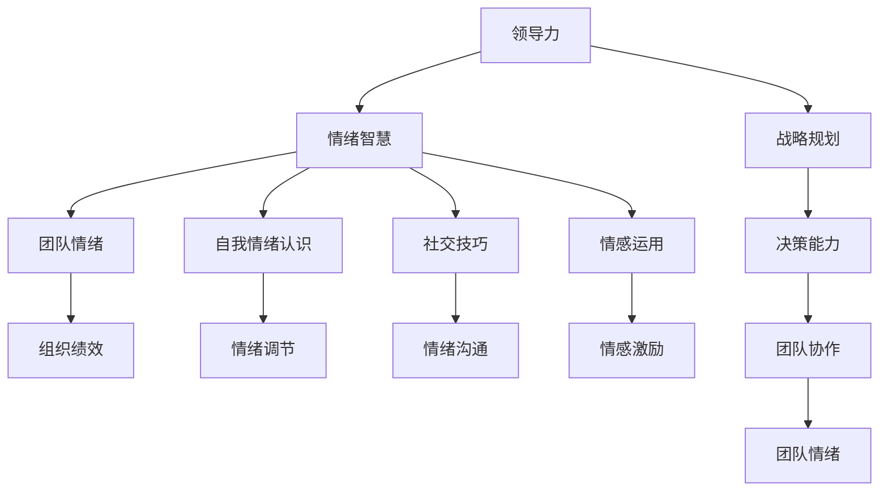

                 

### 引言

领导力与情绪智慧在现代社会和组织中扮演着至关重要的角色。随着知识经济和全球化进程的加速，领导者不仅需要具备传统领导力所需的战略规划和组织管理能力，还需要拥有高度的情绪智慧（emotional intelligence），以便更有效地理解、管理和影响团队成员的情绪。情绪智慧涉及自我情绪认识、自我管理、社交技巧和情感运用等方面，它不仅能够提升领导者的个人魅力和影响力，还能够对团队情绪和整体组织绩效产生深远的影响。

本文旨在深入探讨领导力与情绪智慧之间的关系，以及如何利用情绪智慧来理解和影响团队情绪。文章将首先介绍领导力的基本概念和情绪智慧的定义，然后探讨团队情绪的概念和影响因素，接着分析情绪智慧在领导力中的具体应用。此外，还将通过案例分析展示情绪智慧在实际工作场景中的运用，最后提出结论与未来展望。

### 领导力与情绪智慧

#### 领导力的定义和重要性

领导力是一种影响力，它涉及激励和引导他人为实现共同目标而行动。传统的领导力模型通常关注领导者具备的特质和技能，如决策能力、沟通技巧、战略规划等。然而，现代领导力更加强调适应性、变革能力和情绪智慧。

领导力在组织中的作用不可忽视。首先，领导力能够塑造组织文化，激发员工的创造力和团队合作精神。其次，有效的领导力能够提高员工的工作满意度和忠诚度，从而降低离职率和提升员工绩效。最后，领导力还直接影响组织的创新能力和市场竞争力。

#### 情绪智慧的定义和构成

情绪智慧，也称为情商（Emotional Intelligence），是由心理学家戈尔曼（Daniel Goleman）提出的一个概念，它包括以下几个关键方面：

1. **自我情绪认识**：意识到自己的情绪状态，并能够准确表达和处理这些情绪。
2. **自我管理**：调控情绪，避免情绪失控，保持冷静和专注。
3. **社交技巧**：理解和管理他人的情绪，建立和维护良好的人际关系。
4. **情感运用**：运用情绪促进思考、创造力和决策。

情绪智慧不仅对个人的职业成功至关重要，还在领导力中发挥着关键作用。领导者具备高情绪智慧，能够更好地理解团队成员的需求和情感状态，从而更有效地激励和引导团队。

#### 领导力与情绪智慧的关系

情绪智慧对领导力有着显著的积极影响。首先，情绪智慧能够帮助领导者更好地识别和应对团队成员的情绪，从而建立信任和共鸣。其次，情绪智慧有助于领导者更好地应对压力和不确定性，提高决策质量和适应变革能力。最后，情绪智慧还能够促进领导者的自我发展，提高领导者的个人魅力和影响力。

反过来，领导力也会影响情绪智慧的发展。有效的领导力通过提供正面反馈、鼓励和培训，可以帮助团队成员提高自我情绪认识和自我管理能力。同时，领导者的行为和决策也会直接影响团队情绪，从而影响团队情绪智慧的总体水平。

### 团队情绪

#### 团队情绪的概念和分类

团队情绪是指团队成员在共同工作环境中产生的情绪状态。情绪可以分为积极情绪和消极情绪两大类：

- **积极情绪**：如兴奋、满意、自信和团结。
- **消极情绪**：如焦虑、沮丧、愤怒和冲突。

#### 团队情绪的影响因素

团队情绪受到多种因素的影响，包括：

1. **组织文化**：组织文化会影响团队成员的情绪状态，如鼓励创新的文化可能导致团队成员更愿意尝试新事物，而严格保守的文化可能引发焦虑和压力。
2. **工作环境**：工作环境包括物理环境和心理环境。例如，一个开放和舒适的工作环境可能促进团队成员的积极情绪，而一个拥挤和混乱的环境可能引发消极情绪。
3. **个体差异**：不同成员有不同的性格、经历和价值观，这些差异会影响他们对相同事件的情感反应。

#### 团队情绪的重要性

团队情绪对组织绩效有着深远的影响。首先，积极的团队情绪能够提升员工的工作满意度和创造力，从而提高工作效率和绩效。其次，消极的团队情绪可能导致员工产生倦怠感，降低工作积极性和团队合作精神。此外，团队情绪还直接影响组织的创新能力和市场竞争力。

综上所述，了解和有效管理团队情绪是领导者的一项重要任务，它不仅关乎团队成员的个人福祉，还直接影响组织的整体绩效和可持续发展。

### 理解团队情绪

#### 观察和识别团队情绪

要理解团队情绪，首先需要具备观察和识别情绪的能力。这包括以下几个方面：

1. **面部表情**：面部表情是情绪表达的一个重要途径。通过观察团队成员的面部表情，可以初步了解他们的情绪状态。
2. **肢体语言**：肢体语言包括姿态、手势和身体接触等。这些非言语信号往往比言语表达更真实地反映情绪状态。
3. **言语表达**：团队成员的言语表达，包括语调、语速和词汇选择，都蕴含着情绪信息。仔细倾听和解读言语中的情绪成分，是理解团队情绪的关键。

为了更准确地识别团队情绪，可以使用一些情绪识别工具，如情绪量表和情绪问卷。这些工具可以帮助领导者系统性地收集和分析情绪数据，从而获得更全面的了解。

#### 倾听和沟通技巧

倾听是理解团队情绪的重要技能。有效的倾听不仅仅是听对方说什么，更重要的是理解对方话语背后的情感和需求。以下是几种提高倾听技巧的方法：

1. **全神贯注**：在倾听时，领导者应将注意力集中在对方身上，避免分心。
2. **开放性态度**：保持开放性态度，不要急于做出判断或提出解决方案，而是尝试理解对方的情感和需求。
3. **提问和反馈**：通过提问和反馈，领导者可以进一步澄清对方的情绪和意图，建立更好的沟通和理解。

沟通技巧也是理解团队情绪的关键。以下是一些提高沟通技巧的方法：

1. **清晰表达**：确保自己的表达清晰、简洁，避免使用模糊或混淆的术语。
2. **非言语沟通**：利用肢体语言和面部表情等非言语手段，增强沟通的效果。
3. **积极倾听**：在对方表达时，积极倾听并给予反馈，表达自己的理解和关心。

通过提升倾听和沟通技巧，领导者可以更好地理解团队成员的情绪，建立更紧密的团队关系，从而更有效地管理和影响团队情绪。

#### 情绪智力的提升

情绪智力（情商）的提升对于领导者理解和管理团队情绪至关重要。以下是几种提升情绪智力的方法：

1. **自我认知**：通过自我反思和自我评估，领导者可以更好地认识自己的情绪状态，找到情绪管理的切入点。
2. **社交技巧**：通过参与社交活动和培训，领导者可以学习如何理解和管理他人的情绪，建立和维护良好的人际关系。
3. **情绪调节**：通过学习和实践情绪调节技巧，如深呼吸、冥想和放松练习，领导者可以更好地控制情绪，避免情绪波动对工作和团队关系的影响。

提升情绪智力不仅有助于领导者更好地管理团队情绪，还能提高个人的领导力和影响力，促进组织的整体发展。

### 影响团队情绪

#### 情绪传染

情绪传染（Emotional Contagion）是指一个人的情绪状态可以影响周围人的情绪状态，这种现象在团队中尤为明显。情绪传染的机制主要涉及以下几个方面：

1. **观察和模仿**：团队成员通过观察他人的情绪表达，模仿并体验类似的情绪状态。
2. **共享情绪体验**：团队成员在共同的工作和生活中，共享情绪体验，从而影响彼此的情绪。
3. **情绪反馈**：情绪反馈机制使团队成员能够通过言语和非言语方式表达对他人情绪的反应，进一步影响对方的情绪。

情绪传染在团队中可能导致积极的情绪状态蔓延，如团队合作精神的提升和士气的高涨，但也可能引发消极情绪的传播，如焦虑和压力的扩散。领导者需要认识到情绪传染的影响，通过积极的情绪管理和沟通策略，控制负面情绪的传播，促进团队情绪的整体健康。

#### 情绪领导力策略

情绪领导力是一种利用情绪智慧来引导和管理团队情绪的领导方式。以下是几种情绪领导力策略：

1. **情绪反馈**：领导者通过积极的反馈和鼓励，表达对团队成员情绪状态的认可和理解，增强团队成员的正面情绪。
2. **情绪引导**：领导者通过引导和鼓励团队成员表达情绪，帮助他们理解和处理负面情绪，从而提高情绪智慧。
3. **情绪激励**：领导者运用情绪智慧激励团队成员，通过激发积极情绪，提升团队成员的工作热情和创造力。

这些情绪领导力策略不仅有助于提升团队情绪，还能增强团队的凝聚力和协作能力，促进组织目标的实现。

#### 情绪反馈和调整

情绪反馈和调整是领导者管理团队情绪的重要手段。以下是几种有效的情绪反馈和调整策略：

1. **正面反馈**：领导者通过积极的反馈，表达对团队成员情绪状态的认可和理解，增强他们的正面情绪。
2. **负面反馈**：领导者以建设性的方式提供负面反馈，帮助团队成员理解和调整负面情绪，防止情绪问题恶化。
3. **情绪调整**：领导者通过情绪调节技巧，如深呼吸、冥想和放松练习，帮助团队成员控制情绪波动，维持情绪稳定。

通过有效的情绪反馈和调整，领导者可以改善团队情绪氛围，提高团队成员的情绪稳定性和工作满意度，从而促进团队的整体绩效和组织目标的实现。

### 案例研究

#### 案例一：如何通过情绪智慧提升团队凝聚力

在一个高科技初创公司，团队凝聚力一直是领导者面临的重要挑战。通过引入情绪智慧培训，领导者成功地提升了团队凝聚力。以下是具体案例：

1. **培训与教育**：公司组织了一系列情绪智慧培训，帮助团队成员了解自我情绪认识和情绪管理的重要性。通过互动课程和练习，团队成员学会了如何识别和调节自己的情绪。
2. **情绪反馈**：领导者通过定期的团队会议，鼓励团队成员表达自己的情绪和观点。领导者以开放和接纳的态度倾听，提供积极的反馈，增强了团队成员之间的信任和共鸣。
3. **情绪引导**：领导者通过情绪引导策略，帮助团队成员理解和处理负面情绪。例如，在团队成员感到压力和焦虑时，领导者会组织团队建设活动，如团队游戏和体育比赛，以缓解压力和提升团队士气。
4. **情绪激励**：领导者利用情绪智慧激励团队成员，通过正面情绪的传递，激发团队成员的工作热情和创造力。例如，在项目成功时，领导者会组织庆祝活动，以增强团队的凝聚力和归属感。

通过这些情绪智慧策略，团队的凝聚力显著提升。团队成员之间的沟通更加顺畅，合作更加紧密，工作绩效也得到了显著提高。

#### 案例二：情绪领导力在危机管理中的应用

在一家大型金融机构，一场突如其来的市场危机对公司的运营和员工情绪产生了巨大冲击。领导者通过情绪领导力成功地应对了危机，保持了团队的稳定和士气。以下是具体案例：

1. **情绪感知**：领导者通过观察和倾听，迅速了解员工在危机中的情绪反应。他们注意到许多员工感到不安和焦虑，担心自己的职位和公司的未来。
2. **情绪引导**：领导者通过积极的情绪引导，帮助员工理解和处理负面情绪。他们组织了一系列的沟通会议，向员工传递公司的应对策略，解释危机的暂时性和公司的长远计划，缓解员工的焦虑情绪。
3. **情绪激励**：领导者利用情绪智慧激励员工，通过传递信心和希望，提升员工应对危机的信心和决心。他们强调团队合作的重要性，鼓励员工相互支持和协作，共同度过难关。
4. **情绪调整**：领导者通过情绪调整策略，帮助员工控制情绪波动，维持情绪稳定。他们组织了一系列的心理健康活动，如冥想、放松练习和团队建设活动，帮助员工缓解压力，保持情绪稳定。

通过这些情绪领导力策略，公司成功地应对了危机，保持了团队的稳定和士气。员工情绪逐渐恢复，工作绩效也逐渐回升，为公司的持续发展奠定了坚实的基础。

### 结论与展望

本文通过深入探讨领导力与情绪智慧之间的关系，以及如何利用情绪智慧理解和影响团队情绪，为现代领导者提供了一种全新的视角。情绪智慧不仅对个人领导力的提升至关重要，也对团队情绪和组织绩效产生深远的影响。通过观察和识别团队情绪、提升情绪智力、实施情绪领导力策略以及进行情绪反馈和调整，领导者可以有效地管理团队情绪，提升团队凝聚力，促进组织的整体发展。

然而，情绪智慧在领导力中的应用仍有许多研究空间。未来研究可以进一步探讨情绪智慧在不同文化背景和组织环境中的表现和影响，开发更有效的情绪管理和领导力培训方法，以及利用人工智能和大数据技术提升情绪智慧的预测和分析能力。

### 附录：技术细节与代码实现

#### Mermaid 流程图

以下是一个使用 Mermaid 语言的流程图，展示了领导力、情绪智慧和团队情绪之间的关系：



#### 伪代码

以下是一个用于分析情绪影响因素和情绪领导力策略的伪代码示例：

```python
# 初始化情绪状态
current_emotion = "中性"

# 分析情绪影响因素
def analyze_emotions(team_members):
    for member in team_members:
        if member.is_anxious():
            current_emotion = "焦虑"
        elif member.is_satisfied():
            current_emotion = "满意"

# 应用情绪领导力策略
def apply_emotional_leadership_strategy():
    if current_emotion == "焦虑":
        offer_support()
        organize_activities()
    elif current_emotion == "满意":
        provide признание()
        encourage_innovation()

# 情绪调节函数
def regulate_emotion():
    if current_emotion == "焦虑":
        perform_meditation()
    elif current_emotion == "满意":
        share_positiveStories()

# 调用函数
team_members = get_team_members()
analyze_emotions(team_members)
apply_emotional_leadership_strategy()
regulate_emotion()
```

#### 数学模型和公式

以下是一个使用 LaTeX 格式的情绪传染模型：

```latex
\documentclass{article}
\usepackage{amsmath}
\begin{document}
\begin{equation}
    \frac{dS}{dt} = -\beta S I + \mu_S
\end{equation}
\end{document}
```

这个公式描述了感染（I）人数随时间（t）的变化，其中 S 表示未感染但易感的人数，β 是传染率，μ_S 是自然恢复率。

#### 代码实现与解读

以下是一个简单的 Python 代码示例，用于构建一个团队情绪分析系统：

```python
class TeamMember:
    def __init__(self, name, emotion="中性"):
        self.name = name
        self.emotion = emotion

    def change_emotion(self, new_emotion):
        self.emotion = new_emotion

    def is_happy(self):
        return self.emotion == "满意"

    def is_sad(self):
        return self.emotion == "沮丧"

# 创建团队成员
team_members = [
    TeamMember("Alice"),
    TeamMember("Bob"),
    TeamMember("Charlie")
]

# 初始状态
current_emotions = [member.emotion for member in team_members]

# 模拟情绪传染
def simulate_infection(team_members, infection_probability=0.2):
    for member in team_members:
        if member.is_happy() and random.random() < infection_probability:
            member.change_emotion("焦虑")

# 运行模拟
simulate_infection(team_members)

# 打印结果
print([member.emotion for member in team_members])
```

这个代码实现了一个简单的情绪传染模型，其中团队成员的情绪状态可以通过 `change_emotion` 方法改变。通过调用 `simulate_infection` 函数，可以模拟情绪传染的过程。

### 最佳实践 Tips

1. **情绪智慧培训**：定期组织情绪智慧培训，帮助团队成员提升自我情绪认识和情绪管理能力。
2. **情绪反馈机制**：建立情绪反馈机制，鼓励团队成员表达情绪，领导者及时给予反馈和指导。
3. **情绪引导策略**：在团队面临压力和挑战时，领导者应采用情绪引导策略，帮助团队成员理解和处理负面情绪。
4. **情绪激励**：利用情绪智慧激励团队成员，通过正面情绪的传递，提升团队士气和工作积极性。

### 小结

本文探讨了领导力与情绪智慧之间的关系，以及如何利用情绪智慧理解和影响团队情绪。通过实际案例，展示了情绪智慧在提升团队凝聚力和危机管理中的重要作用。领导者应重视情绪智慧的培养和应用，以提升团队绩效和组织竞争力。

### 注意事项

1. **文化差异**：在应用情绪智慧时，应注意文化差异，避免采取一刀切的策略。
2. **个体差异**：团队成员的个性、价值观和经历会影响情绪反应，领导者应充分考虑个体差异。
3. **持续反馈**：情绪管理和领导力提升是一个持续的过程，领导者应不断进行自我反思和反馈。

### 拓展阅读

- [1] Goleman, D. (1995). **Emotional Intelligence**. Bantam Books.
- [2] Mayer, J. D., Salovey, P., & Caruso, D. (1999). **Measuring emotional intelligence with the Mayer, Salovey, Caruso Emotional Intelligence Test (MSCEIT)**. Emotion, 1(3), 97-105.
- [3] Meshoulam, R. (2004). **The Psychology of Leadership**. American Psychological Association.
- [4] Tjosvold, D. (1995). **Leadership, stress, and performance in organizations**. Leadership Quarterly, 6(2), 109-131.

### 作者信息

作者：AI天才研究院/AI Genius Institute & 禅与计算机程序设计艺术 /Zen And The Art of Computer Programming

