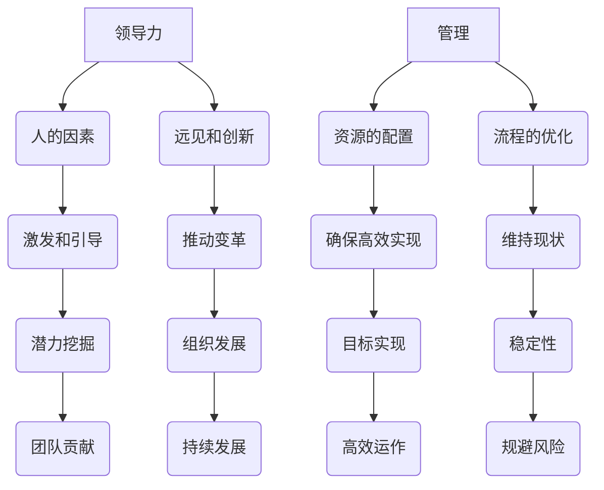
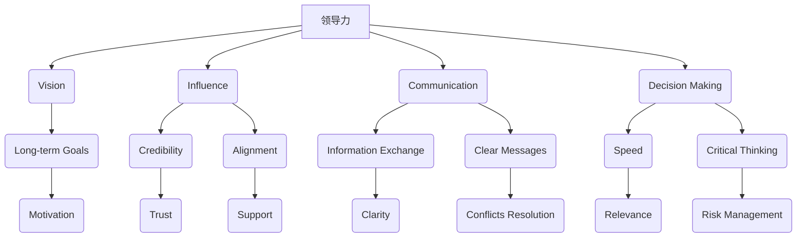
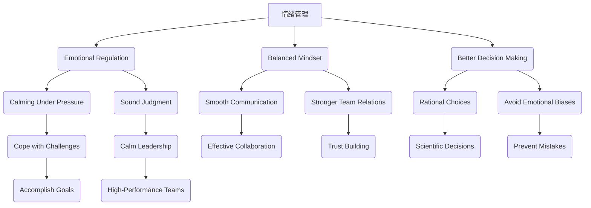
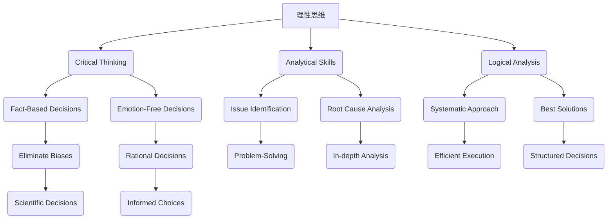

                 

### 引言

在现代企业管理中，领导力、情绪管理和理性思维三者被视为领导者的核心素质。领导力是推动组织发展、实现目标的关键能力；情绪管理则有助于领导者保持稳定的心态，提升团队凝聚力；而理性思维则是领导者做出科学决策的基础。本文将以《领导力与情绪管理：保持理性的艺术》为主题，深入探讨这些关键要素在领导实践中的应用。

首先，领导力是领导者的核心能力。它不仅包括对团队成员的领导与激励，还涉及到战略规划、决策制定以及组织协调等多方面。有效的领导力能够提升团队的执行力，推动组织达成目标。

情绪管理则是领导者保持心理健康的重要手段。在高压的工作环境中，情绪管理能力能够帮助领导者调节情绪，避免因情绪波动而影响决策和团队的稳定性。

理性思维则是领导者做出科学决策的基础。在复杂多变的商业环境中，领导者需要依靠理性思维，对信息进行深入分析，从而做出最优的决策。

本文将按照以下结构展开：首先，详细探讨领导力的核心概念与联系，分析领导力与情绪管理、理性思维之间的关系。接下来，我们将深入探讨领导力的构建与实践，通过具体的案例分析，展示领导力在团队建设、沟通协调、危机管理等方面的应用。随后，文章将重点介绍情绪管理的基本概念与实践方法，分析情绪管理对领导力的影响。最后，我们将讨论理性思维的本质与作用，阐述如何培养理性思维，并在实际工作中应用理性决策的方法。

通过本文的阅读，读者将系统地了解领导力、情绪管理和理性思维的内涵及其相互关系，掌握在实际工作中如何运用这些关键能力，提升领导效能。

### 领导力的核心概念与联系

#### 领导力与管理的区别

领导力与管理的区别主要体现在以下几个方面。首先，领导力更多关注的是人的因素，即如何激发和引导团队成员的潜力，使其为实现组织目标贡献力量。而管理则侧重于对资源的有效配置和流程的优化，确保组织目标的高效实现。其次，领导力更注重远见和创新，致力于推动组织的变革和发展，而管理则侧重于维持现状，确保组织运作的稳定性。

通过Mermaid流程图，我们可以更直观地理解领导力与管理的区别：



#### 领导力的四大核心要素

领导力的四大核心要素分别是：愿景、影响力、沟通和决策。

1. **愿景**：愿景是领导力的核心，是领导者为团队和组织设定的长远目标和方向。一个清晰的愿景能够激发团队成员的斗志，使团队齐心协力，共同为实现目标而努力。愿景不仅是领导者个人的愿景，更是团队和组织的共同愿景。

2. **影响力**：影响力是领导者通过行为和言行对他人产生的影响。一个有影响力的领导者能够赢得团队成员的信任和支持，使团队在面临挑战时能够保持凝聚力，共同克服困难。

3. **沟通**：沟通是领导者与团队成员之间的桥梁，是传达愿景、解决问题和推动决策的重要手段。有效的沟通能够确保信息准确传达，减少误解和冲突，提升团队的协作效率。

4. **决策**：决策是领导者根据信息和分析，在复杂环境中做出的选择。一个优秀的领导者需要在快速变化的环境中快速决策，同时考虑各种可能的后果，做出最优的决策。

通过Mermaid流程图，我们可以更清晰地展示领导力的四大核心要素及其相互关系：



#### 领导力与情绪管理的关系

情绪管理是领导者保持心理健康的重要手段。一个情绪稳定的领导者能够更好地应对压力和挑战，保持清晰的思维，从而做出更科学的决策。同时，情绪管理有助于领导者与团队成员建立良好的关系，提升团队凝聚力。

首先，情绪管理能够帮助领导者调节情绪，避免情绪波动影响决策。在面对挫折和困难时，情绪稳定的领导者能够冷静分析，做出理性决策，避免因情绪失控而导致的错误决策。

其次，情绪管理有助于领导者与团队成员建立信任关系。一个情绪稳定的领导者更容易赢得团队成员的信任和支持，使团队在面临挑战时能够保持凝聚力，共同克服困难。

通过Mermaid流程图，我们可以展示情绪管理对领导力的影响：



#### 领导力与理性的联系

理性思维是领导者做出科学决策的基础。在复杂多变的商业环境中，领导者需要依靠理性思维，对信息进行深入分析，从而做出最优的决策。理性思维不仅有助于领导者规避决策中的风险，还能提升团队的决策质量和执行力。

首先，理性思维要求领导者具备批判性思维，对信息进行深入分析，从而识别出问题的本质。这种能力有助于领导者做出基于事实的决策，避免因情绪或偏见而导致的错误决策。

其次，理性思维强调逻辑性和系统性，领导者需要具备良好的逻辑思维和系统分析能力，从而在复杂环境中找到最佳的解决方案。这种能力有助于提升团队的决策效率和执行力。

通过Mermaid流程图，我们可以展示领导力与理性的联系：



通过以上分析，我们可以看出领导力、情绪管理和理性思维三者之间存在着密切的联系。一个优秀的领导者不仅需要具备强大的领导力，还需要善于情绪管理和理性思维，从而在复杂的商业环境中做出科学的决策，推动组织的发展。领导者只有在这三个方面不断提升自己，才能成为真正具有影响力的领导者。

### 领导力的构建

领导力并非与生俱来，而是可以通过后天的培养和实践逐步提升。领导力的发展过程可以分为四个阶段：自我认知、角色认知、情境认知和领导力实践。以下我们将详细探讨这四个阶段及其相应的提升方法。

#### 自我认知阶段

自我认知是领导力发展的起点。在这个阶段，领导者需要深入了解自己的个性、价值观、兴趣和优势。只有对自己有清晰的认知，领导者才能更好地发挥自己的潜力，为未来的领导力发展奠定基础。

**提升方法**：
1. **自我反思**：定期进行自我反思，思考自己在过去的工作中的表现，了解自己的优点和不足。
2. **心理测试**：通过心理测试，了解自己的性格类型、优势与弱点，为自己的领导力发展提供参考。
3. **阅读与学习**：阅读有关领导力的书籍和文章，学习他人的经验和教训，提升自己的认知水平。

#### 角色认知阶段

角色认知是领导者从自我认知向实际领导角色转变的过程。在这个阶段，领导者需要明确自己的角色和职责，了解领导者的职责范围和期望。

**提升方法**：
1. **角色扮演**：通过角色扮演，模拟领导者的角色，提升对领导者职责和角色的理解。
2. **导师指导**：找到一位有经验的导师，通过导师的指导，了解领导者应有的行为和决策方式。
3. **实战演练**：参与实际的工作项目，担任领导者的角色，通过实战提升自己的领导能力。

#### 情境认知阶段

情境认知是领导者理解不同领导情境，并灵活应对的过程。在这个阶段，领导者需要具备分析复杂情境的能力，根据不同的情境选择合适的领导策略。

**提升方法**：
1. **情境模拟**：通过情境模拟，了解不同领导情境下的应对策略。
2. **案例分析**：研究成功的领导案例，分析其情境和策略，提升自己的情境认知能力。
3. **实践经验**：在实际工作中，遇到不同的领导情境，积累经验，逐步提升情境认知能力。

#### 领导力实践阶段

领导力实践是领导力发展的最终阶段，也是领导者的实际应用阶段。在这个阶段，领导者需要将所学知识和技能应用到实际工作中，通过实践不断提升自己的领导能力。

**提升方法**：
1. **团队建设**：通过团队建设活动，提升团队的凝聚力和执行力。
2. **领导反馈**：定期接受团队成员和领导的反馈，了解自己在领导实践中的表现，不断改进。
3. **持续学习**：领导力是一个持续发展的过程，领导者需要不断学习新的知识和技能，以适应不断变化的环境。

#### 领导力模型解析

为了更好地理解领导力的构建，我们可以引入几种经典的领导力模型，如情境领导模型、路径-目标模型和变革型领导模型。

1. **情境领导模型**：
   情境领导模型认为，领导者的领导风格应与团队成员的能力和需求相匹配。模型将领导风格分为四种：指示型、推销型、参与型和授权型。领导者应根据不同情境选择合适的领导风格。

   **伪代码**：
   ```python
   def chooseLeadershipStyle(ability, motivation):
       if ability == "low" and motivation == "low":
           return "指示型"
       elif ability == "low" and motivation == "high":
           return "推销型"
       elif ability == "high" and motivation == "low":
           return "参与型"
       else:
           return "授权型"
   ```

2. **路径-目标模型**：
   路径-目标模型认为，领导者的主要任务是帮助团队成员明确目标，并提供实现目标的路径。领导者应通过设定目标、提供支持和激励，帮助团队成员克服障碍，实现目标。

   **伪代码**：
   ```python
   def setGoalAndPath(teamMember, goal, path):
       print(f"设定目标：{goal}")
       print(f"提供实现路径：{path}")
       print("开始执行任务...")
   ```

3. **变革型领导模型**：
   变革型领导模型认为，领导者应具备激励和激发团队成员创新的能力。领导者通过变革型领导，能够推动组织变革，实现组织目标。

   **伪代码**：
   ```python
   def implementChange(leader, team, vision):
       leader inspireTeam(team, vision)
       leader facilitateInnovation(team)
       print("变革实施成功！")
   ```

通过这些模型，我们可以更系统地理解领导力的构建过程，并根据具体情境选择合适的领导策略。

### 领导力的实践

领导力不仅是一种理论，更是一种实践。在实践中，领导者需要面对各种复杂情境，通过有效的团队建设、沟通协调、危机管理和组织文化建设，不断提升自己的领导力。以下我们将详细探讨这些实践方法，并通过实际案例进行分析。

#### 团队建设

团队建设是领导力实践的重要部分。一个高效的团队能够提升组织的整体绩效，实现共同的目标。团队建设的目标是增强团队成员之间的信任和合作，提高团队的凝聚力和执行力。

**实践方法**：
1. **共同目标**：明确团队的目标，确保所有成员都清楚团队的目标和期望。
2. **沟通与协作**：建立良好的沟通渠道，鼓励团队成员之间的合作和交流。
3. **培训与成长**：为团队成员提供培训和发展机会，提升团队的整体能力。

**案例**：
某科技公司在快速发展的过程中，注重团队建设，通过定期的团队活动和培训，增强了团队成员之间的信任和协作。在公司的一次重大项目中，团队成员通力合作，成功在短时间内完成了任务，赢得了客户的高度评价。

**伪代码**：
```python
def buildTeam(goal, communication, training):
    print("设定共同目标：", goal)
    print("建立沟通渠道：", communication)
    print("提供培训机会：", training)
    print("团队建设成功！")
```

#### 沟通协调

有效的沟通协调是团队高效运作的保障。领导者需要确保信息在团队内部准确、及时地传递，减少误解和冲突，提高团队的工作效率。

**实践方法**：
1. **明确信息**：确保传递的信息清晰、准确，避免产生误解。
2. **倾听与反馈**：倾听团队成员的意见和建议，给予及时的反馈。
3. **冲突解决**：在冲突发生时，及时介入，采取合适的措施解决问题。

**案例**：
某创业公司由于团队成员意见不一致，导致项目进度受阻。领导者通过召开沟通会议，倾听各方意见，分析问题根源，最终制定了合理的解决方案，恢复了项目的正常进度。

**伪代码**：
```python
def communicateAndCoordinate(message, feedback, conflict):
    print("传递明确信息：", message)
    print("倾听与反馈：", feedback)
    print("解决冲突：", conflict)
    print("沟通协调成功！")
```

#### 危机管理

在快速变化的商业环境中，领导者需要具备应对危机的能力。危机管理不仅包括对危机的预警和应对，还需要确保在危机中保持团队的稳定和士气。

**实践方法**：
1. **预警机制**：建立预警机制，提前发现潜在的危机。
2. **快速响应**：在危机发生时，立即采取行动，控制危机蔓延。
3. **团队协作**：在危机中，鼓励团队协作，共同应对危机。

**案例**：
某电子产品公司在市场突然爆发产品缺陷事件，领导者通过紧急会议迅速成立危机管理团队，协调各部门资源，及时处理客户投诉，最终成功化解了危机。

**伪代码**：
```python
def manageCrisis(warning, response, teamwork):
    print("建立预警机制：", warning)
    print("快速响应：", response)
    print("团队协作：", teamwork)
    print("危机管理成功！")
```

#### 组织文化建设

组织文化是企业的灵魂，对员工的行为和态度产生深远影响。领导者需要通过构建积极向上的组织文化，提升团队的凝聚力和向心力。

**实践方法**：
1. **价值观传递**：明确组织的核心价值观，确保所有员工都认同并遵循。
2. **文化活动**：通过文化活动和仪式，强化组织文化。
3. **员工关怀**：关注员工的需求和成长，提升员工的工作满意度和忠诚度。

**案例**：
某互联网公司在发展过程中，注重组织文化建设，通过定期的团建活动和员工培训，营造了积极向上的工作氛围，提升了员工的工作满意度和团队凝聚力。

**伪代码**：
```python
def buildOrganizationCulture核心价值观，文化活动，员工关怀：
    print("传递价值观：", 核心价值观)
    print("举办文化活动：", 文化活动)
    print("关注员工需求：", 员工关怀)
    print("组织文化建设成功！")
```

通过这些实践方法，领导者能够在实际工作中不断提升自己的领导力，推动组织的发展。同时，通过具体案例的分析，我们能够更清晰地理解这些实践方法的应用和效果。

### 情绪管理的基本概念

情绪管理是指个体通过自我调节，对自身情绪进行识别、理解、表达和调节的过程。情绪管理不仅关系到个体的心理健康，还直接影响其在社会交往和工作中的表现。因此，了解情绪管理的基本概念对于领导者来说至关重要。

#### 情绪的定义与分类

情绪（Emotion）是人对某种刺激的生理和心理反应，包括感觉、情感和认知三个方面。情绪可以分类为基本情绪和复杂情绪。

1. **基本情绪**：通常包括快乐、愤怒、悲伤、恐惧和惊讶等。这些情绪是人类共有的，具有普遍性。
   
   **数学公式**：
   $$ \text{基本情绪} = \text{快乐} + \text{愤怒} + \text{悲伤} + \text{恐惧} + \text{惊讶} $$

2. **复杂情绪**：由基本情绪组合而成，如焦虑、厌恶、羞耻、骄傲等。复杂情绪通常与个体在社会交往中的角色和情境相关。

   **数学公式**：
   $$ \text{复杂情绪} = (\text{基本情绪}) \times \text{情境} $$

#### 情绪管理的重要性

情绪管理对于领导者的健康和领导效能具有深远的影响。首先，情绪管理有助于领导者维持心理健康，避免因情绪波动导致的决策失误。其次，良好的情绪管理能够提升领导者的沟通能力，使领导者更好地与团队成员建立信任和合作关系。

**举例说明**：
某公司的领导者在一次项目失败后，感到极度的沮丧和自责。如果他能够进行有效的情绪管理，如自我反思和情绪调节，他可以迅速恢复情绪，重新审视项目失败的原因，从而制定改进措施。相反，如果领导者无法有效管理情绪，可能会影响其决策和团队士气，导致更多问题。

#### 情绪管理的方法

有效的情绪管理需要领导者掌握多种方法，包括情绪识别、自我觉察、情绪调节和情绪释放。

1. **情绪识别**：领导者需要学会识别自己的情绪，了解情绪的来源和特点。情绪识别是情绪管理的基础，有助于领导者更好地理解自己的行为和决策。

2. **自我觉察**：领导者应通过自我觉察，了解情绪对自己的影响，如情绪是否影响工作效率、决策质量和人际关系。自我觉察有助于领导者更好地控制情绪。

3. **情绪调节**：情绪调节是指领导者通过调整自己的思维和行为，减轻情绪的负面影响。情绪调节方法包括认知重构、放松训练和积极心态的培养。

4. **情绪释放**：领导者需要学会在适当的时机和方式下释放情绪，避免情绪积累导致身心健康问题。情绪释放可以通过倾诉、运动、艺术创作等方式实现。

**伪代码**：

```python
# 情绪识别
def recognizeEmotion():
    current_emotion = getEmotion()
    print(f"当前情绪：{current_emotion}")

# 自我觉察
def selfAwareness():
    emotion_impact = analyzeImpact(current_emotion)
    print(f"情绪对工作的影响：{emotion_impact}")

# 情绪调节
def emotionRegulation():
    regulation_method = selectRegulationMethod()
    applyRegulation(regulation_method)
    print("情绪调节完成。")

# 情绪释放
def emotionRelease():
    release_method = selectReleaseMethod()
    executeRelease(release_method)
    print("情绪释放完成。")
```

通过这些方法，领导者可以更好地管理自己的情绪，提升领导效能，为团队和组织的发展创造积极的环境。

### 情绪管理的实践

情绪管理不仅是理论上的知识，更需要通过实践来验证和提升。在实际工作中，领导者需要通过具体的情绪识别、调节和释放方法，来确保自身的情绪稳定，进而提高团队的凝聚力和工作效率。以下将详细阐述情绪管理的实践方法，并通过实际案例进行分析。

#### 情绪识别与自我觉察

情绪识别是情绪管理的第一步，领导者需要学会识别自己的情绪，并了解情绪的来源和特点。自我觉察则是在识别情绪的基础上，进一步了解情绪对自己的影响，包括情绪是否影响工作效率、决策质量和人际关系。

**实践方法**：

1. **日记法**：通过记录每日的情绪变化，领导者可以清晰地看到情绪的波动和影响。
   
   **伪代码**：
   ```python
   def logEmotion():
       today_emotion = getCurrentEmotion()
       log_entry = f"Date: {today}, Emotion: {today_emotion}"
       write_to_log(log_entry)
   ```

2. **情绪温度计**：使用情绪温度计，领导者可以即时了解自己的情绪状态。

   **伪代码**：
   ```python
   def checkEmotionalState():
       current_state = getEmotionalState()
       print(f"当前情绪状态：{current_state}")
   ```

**案例**：

某公司的项目经理在项目进展不顺时，通过情绪温度计发现自己的情绪状态处于较低水平。他决定通过日记法记录每日的情绪变化，并定期进行自我觉察，了解情绪对项目管理和团队沟通的影响。这种方法帮助他更好地管理情绪，提升了项目管理的效率。

#### 情绪调节与情绪释放

情绪调节和情绪释放是情绪管理的核心，领导者需要通过一系列方法来调节和释放负面情绪，以保持情绪的稳定。

1. **认知重构**：通过改变负面思维模式，领导者可以减少情绪的负面影响。

   **伪代码**：
   ```python
   def cognitiveReconstruction():
       negative_thought = getNegativeThought()
       alternative_thought = createAlternativeThought()
       print(f"从{negative_thought}转变为{alternative_thought}")
   ```

2. **放松训练**：通过深呼吸、冥想和瑜伽等放松训练，领导者可以减轻情绪压力。

   **伪代码**：
   ```python
   def relaxationExercise():
       performBreathingExercise()
       meditate()
       print("放松训练完成，情绪得到缓解。")
   ```

3. **运动**：运动可以释放体内的紧张情绪，提升情绪状态。

   **伪代码**：
   ```python
   def exercise():
       performPhysicalActivity()
       print("运动完成，情绪得到释放。")
   ```

4. **艺术创作**：通过绘画、写作或音乐等艺术创作，领导者可以表达和释放情绪。

   **伪代码**：
   ```python
   def artCreation():
       engageInArtisticActivity()
       print("通过艺术创作，情绪得到表达和释放。")
   ```

**案例**：

一位公司高层领导者在面对项目失败时，通过认知重构，从“我无法接受失败”转变为“失败是成功的一部分”。同时，他通过深呼吸和冥想来放松自己，通过跑步来释放紧张情绪，并通过写日记来记录自己的思考和感受。这种方法帮助他迅速恢复了情绪，重新找到了工作的动力。

#### 情绪管理在团队中的运用

情绪管理不仅对个人有重要影响，还在团队中发挥着关键作用。领导者需要通过情绪管理，确保团队的情绪稳定，提升团队的整体表现。

**实践方法**：

1. **建立情绪反馈机制**：通过定期的团队会议，领导者可以了解团队成员的情绪状态，及时提供支持和帮助。
   
   **伪代码**：
   ```python
   def emotionFeedback():
       collectTeamEmotions()
       provideSupportBasedOnFeedback()
       print("情绪反馈机制建立成功。")
   ```

2. **情绪共享**：鼓励团队成员分享情绪，建立信任和开放沟通的环境。
   
   **伪代码**：
   ```python
   def shareEmotions():
       initiateEmotionSharingSession()
       createSafeSpaceForOpenCommunication()
       print("情绪共享会议成功召开。")
   ```

3. **情绪培训**：为团队成员提供情绪管理的培训和指导，提升团队的整体情绪管理能力。
   
   **伪代码**：
   ```python
   def emotionTraining():
       organizeTrainingSessions()
       distributeEmotionManagementMaterials()
       print("情绪管理培训圆满完成。")
   ```

**案例**：

某公司通过定期组织情绪反馈会议，鼓励团队成员分享自己的情绪和感受。通过这种方式，团队成员能够更好地理解彼此的情绪状态，减少了误解和冲突。同时，公司还提供了情绪管理培训，提升了团队成员的情绪管理能力，进一步提升了团队的凝聚力和工作效率。

通过情绪识别、调节和释放的实践方法，领导者可以更好地管理自己的情绪，并在团队中建立积极健康的情绪氛围。这种实践不仅有助于提升个人领导效能，还能促进团队的整体发展。

### 情绪管理的案例研究

#### 企业领导者的情绪管理案例分析

在企业管理中，领导者的情绪管理对企业的整体表现和员工士气具有深远的影响。以下我们通过两个具体案例，分析领导者如何通过情绪管理提升企业绩效和团队凝聚力。

**案例一：某科技公司的情绪管理成功实践**

某科技公司是一家高速发展的初创企业，面对市场竞争的激烈，公司的领导者意识到情绪管理对团队稳定和企业发展的关键作用。公司CEO通过以下措施进行了情绪管理：

1. **定期的情绪反馈会议**：CEO每周组织一次情绪反馈会议，鼓励团队成员分享自己的情绪和困扰，确保团队中的每一个声音都能被听到。通过这种方式，CEO能够及时了解团队成员的情绪状态，并提供必要的支持和帮助。

2. **情绪培训**：CEO安排了专业的情绪管理培训课程，为所有员工提供情绪识别和调节的方法。通过培训，员工们学会了如何更好地管理自己的情绪，从而在工作中保持积极的态度。

3. **建立信任和开放沟通**：CEO倡导开放和透明的沟通文化，鼓励团队成员在面对问题时坦诚相待，共同寻找解决方案。这种信任和开放的环境有助于减少情绪积累，提升了团队的凝聚力。

**案例结果**：

通过情绪管理实践，该科技公司的员工士气显著提升，工作效率也得到提高。公司在市场上取得了优异的成绩，成功吸引了许多优秀的人才。情绪管理不仅帮助公司度过了多个挑战期，还为其持续发展奠定了坚实的基础。

**伪代码**：

```python
def emotionManagementSuccess():
    scheduleEmotionFeedbackSessions()
    organizeEmotionTraining()
    promoteTrustAndOpenCommunication()
    print("情绪管理成功，企业绩效显著提升。")
```

**案例二：某制造业公司领导者的情绪管理失误**

与之相对，另一家制造业公司因为领导者的情绪管理失误，导致企业陷入困境。公司高层在一次重大决策失败后，领导者的情绪失控，对团队成员进行了严厉的指责和批评。以下是对这一情况的详细分析：

1. **情绪失控**：领导者未能及时调节自己的情绪，将失败的情绪转化为对团队成员的愤怒和责备。这种情绪失控导致团队士气低落，员工开始失去对公司的信任。

2. **沟通障碍**：领导者未能建立有效的沟通渠道，使得团队成员的情绪无法得到合理的释放和调节。员工们开始抱怨和不满，团队内部矛盾加剧。

3. **绩效下降**：情绪管理失误直接影响了公司的绩效。员工因情绪低落而影响了工作效率，公司的整体表现也随之下降。

**案例结果**：

由于领导者的情绪管理失误，该制造业公司的团队凝聚力急剧下降，员工流失率增加，最终导致公司业绩下滑。这一案例充分说明，情绪管理对于企业领导者来说至关重要。

**伪代码**：

```python
def emotionManagementFailure():
    handleFailureWithAnger()
    failToEstablishEffectiveCommunication()
    observePerformanceDecline()
    print("情绪管理失败，企业陷入困境。")
```

#### 情绪管理对领导力的影响

情绪管理不仅影响企业的绩效，还对领导者的领导力产生深远的影响。

1. **决策质量**：情绪稳定的领导者能够更加理性地分析问题，做出科学的决策。相反，情绪失控的领导者容易受情绪影响，做出错误的决策。

2. **团队凝聚力**：情绪稳定的领导者能够建立信任和开放的沟通环境，提升团队的凝聚力。而情绪管理的失败会导致团队内部矛盾加剧，降低团队的执行力。

3. **员工满意度**：情绪稳定的领导者能够关注员工的需求，提升员工的工作满意度和忠诚度。相反，情绪管理的失败会导致员工不满，增加离职率。

通过以上案例分析，我们可以看出，情绪管理对领导者的领导力和企业的绩效具有重要影响。有效的情绪管理不仅有助于领导者提升自身的领导力，还能为企业的持续发展创造积极的环境。

### 理性的本质与作用

理性思维是领导者做出科学决策的基础，是应对复杂环境和挑战的关键能力。在现代社会，领导者面临的决策环境复杂多变，需要从大量的信息中提取有用信息，进行深入分析，从而做出最优决策。理性思维在这个过程中起着至关重要的作用。

#### 理性的定义与特征

理性（Rationality）是指通过逻辑推理和科学方法，对问题进行深入分析和判断的能力。理性思维具有以下几个特征：

1. **逻辑性**：理性思维强调逻辑推理，通过严密的逻辑关系进行思考和判断，确保结论的合理性和可靠性。
   
   **数学公式**：
   $$ \text{理性思维} = \text{逻辑推理} + \text{科学方法} $$

2. **系统性**：理性思维注重系统分析，将复杂的问题分解为若干个部分，逐一分析和解决，从而找到最优的解决方案。

   **数学模型**：
   $$ \text{系统性分析} = \text{问题分解} + \text{部分分析} + \text{综合解决} $$

3. **客观性**：理性思维追求客观性，尽可能避免主观偏见和情感的影响，以事实为基础进行思考和判断。

   **数学公式**：
   $$ \text{理性决策} = \text{事实分析} + \text{情感中立} $$

#### 理性在领导决策中的应用

理性思维在领导决策中的应用主要体现在以下几个方面：

1. **问题识别**：领导者需要通过理性思维识别问题，准确理解问题的本质和关键因素。这有助于领导者找到问题的根源，制定有针对性的解决方案。

   **伪代码**：
   ```python
   def identifyProblem():
       gatherInformation()
       analyzeData()
       identifyRootCause()
       print("问题识别完成。")
   ```

2. **方案评估**：在确定问题后，领导者需要通过理性思维评估各种可能的解决方案，选择最优方案。这要求领导者对各个方案进行系统分析，比较其优缺点，从而做出科学决策。

   **伪代码**：
   ```python
   def evaluateSolutions():
       listSolutions()
       analyzeAdvantagesAndDisadvantages()
       selectOptimalSolution()
       print("方案评估完成。")
   ```

3. **风险评估**：领导者需要通过理性思维评估决策的风险，确保决策的可行性和安全性。这要求领导者对各种可能的风险进行识别和分析，制定相应的风险应对策略。

   **数学模型**：
   $$ \text{风险评估} = \text{风险识别} + \text{风险分析} + \text{风险应对} $$

4. **决策执行**：在做出决策后，领导者需要通过理性思维确保决策的有效执行。这要求领导者对决策过程进行监督和调整，确保决策能够顺利实施并达到预期目标。

   **伪代码**：
   ```python
   def executeDecision():
       monitorProgress()
       adjustAsNecessary()
       ensureGoalAchievement()
       print("决策执行完成。")
   ```

#### 理性与情绪的关系

理性和情绪之间既有联系又有区别。理性思维强调逻辑推理和客观分析，而情绪则更多涉及个体的情感体验和主观感受。在实际决策过程中，理性与情绪的关系可以分为以下几个方面：

1. **理性主导情绪**：在理想情况下，理性应该主导情绪。领导者通过理性思维分析问题，避免情绪的干扰，做出科学的决策。

   **数学公式**：
   $$ \text{理性决策} = \text{理性分析} + \text{情感中立} $$

2. **情绪影响理性**：在实际中，情绪往往会影响理性思维。领导者可能会因为情绪波动而偏离理性分析，导致决策失误。因此，情绪管理是理性决策的重要保障。

   **数学模型**：
   $$ \text{理性决策} = \text{理性分析} + \text{情绪调节} $$

3. **理性调节情绪**：理性思维也可以帮助领导者调节情绪，使其保持冷静和理智。通过理性分析，领导者可以理解情绪的来源和影响，从而采取有效的情绪调节策略。

   **伪代码**：
   ```python
   def regulateEmotion():
       recognizeEmotion()
       analyzeReasons()
       applyRationalApproach()
       print("情绪调节完成。")
   ```

通过理性与情绪的相互调节，领导者可以更好地在复杂环境中做出科学的决策，提升领导效能。理性思维不仅有助于领导者规避情绪的干扰，还能提高决策的可靠性和有效性，为组织的发展创造有利条件。

### 培养理性思维

理性思维是领导者做出科学决策的重要基础，但在实际工作中，如何培养和提升理性思维是一个需要持续努力的过程。以下我们将介绍培养理性思维的五个关键要素及其训练方法，并探讨理性思维在团队决策和个人成长中的价值。

#### 五个关键要素

1. **批判性思维**：批判性思维是理性思维的核心，它要求领导者对信息进行深入分析，不盲目接受任何观点，而是通过逻辑推理和事实检验来判断信息的真实性和有效性。

   **训练方法**：
   - **练习提问**：在阅读、讨论或思考问题时，不断提问“为什么”和“如果...会怎样”，从而激发批判性思维。
   - **案例分析**：通过分析真实案例，识别其中的逻辑漏洞和假设，提升批判性思维能力。

2. **逻辑推理**：逻辑推理是理性思维的基础，它要求领导者能够运用逻辑规则，通过演绎和归纳等方法，从已知信息推导出新的结论。

   **训练方法**：
   - **逻辑游戏**：通过解谜、玩逻辑游戏等方式，锻炼逻辑思维能力。
   - **写作练习**：通过写作训练，提升表达逻辑清晰的能力。

3. **系统分析**：系统分析是理性思维的另一个重要方面，它要求领导者能够将复杂问题分解为多个部分，逐一分析和解决。

   **训练方法**：
   - **流程图绘制**：通过绘制流程图，将复杂问题分解为具体步骤，帮助领导者进行系统分析。
   - **项目管理**：参与实际项目，从项目规划到执行，锻炼系统分析能力。

4. **数据驱动的决策**：理性决策需要基于数据和分析，而不是主观判断。领导者需要学会如何收集、分析和运用数据，以支持决策过程。

   **训练方法**：
   - **数据收集与分析**：学习如何使用统计工具和数据分析方法，提升数据处理和分析能力。
   - **数据驱动案例研究**：通过研究数据驱动的成功案例，学习数据在决策中的应用。

5. **情感调节**：理性思维不仅要求逻辑推理，还需要情感调节。领导者需要学会在决策过程中保持冷静和理智，避免情绪的影响。

   **训练方法**：
   - **情绪管理课程**：参加情绪管理课程，学习如何调节情绪，保持理性。
   - **冥想和放松训练**：通过冥想和放松训练，提升情绪调节能力。

#### 理性思维在团队决策中的运用

理性思维在团队决策中具有重要作用，它能够提升决策的科学性和有效性。以下是如何在团队决策中应用理性思维的几个步骤：

1. **明确目标**：在团队决策前，明确决策的目标和关键要素，确保所有团队成员对决策目标有清晰的认识。

2. **信息收集**：通过多种渠道收集与决策相关的信息，包括数据、报告和专家意见等，确保信息的全面性和准确性。

3. **逻辑分析**：对收集到的信息进行逻辑分析，识别其中的逻辑关系和潜在问题，避免因信息不全或错误导致的决策失误。

4. **方案评估**：评估各种可能的解决方案，比较其优缺点，选择最优方案。这要求领导者具备批判性思维和系统分析能力。

5. **风险评估**：对决策方案进行风险评估，识别可能的风险和挑战，并制定相应的应对策略。

6. **决策执行**：在决策后，确保决策能够有效执行，通过监督和调整，确保决策目标得以实现。

#### 理性思维在个人成长中的价值

理性思维不仅有助于团队决策，也对个人成长有着深远的影响。以下是如何通过理性思维提升个人成长的具体方法：

1. **目标设定**：通过理性思维设定明确的目标，确保目标具有可衡量性和可实现性。

2. **自我反思**：定期进行自我反思，识别自己的优点和不足，通过理性分析找到改进的方法。

3. **持续学习**：通过学习新知识和技能，不断提升自己的认知水平和专业能力。

4. **情绪调节**：学会调节情绪，保持积极的心态，避免情绪波动对个人成长的影响。

5. **决策优化**：通过理性决策，确保个人行为和选择更加科学和合理，提升生活质量。

通过培养理性思维，领导者不仅能够提升决策的质量和团队的整体效能，还能在个人成长中取得更大的进步。理性思维是领导者持续发展的关键能力，通过不断学习和实践，领导者可以更好地应对复杂多变的环境，实现个人和组织的共同发展。

### 保持理性的实践

在领导决策过程中，保持理性至关重要。理性决策不仅能够避免情绪的干扰，还能确保决策的科学性和有效性。以下将详细阐述理性决策的步骤、避免理性陷阱的策略，以及这些策略在实际工作中的应用。

#### 理性决策的步骤

1. **问题识别**：首先，领导者需要明确需要解决的问题。这包括理解问题的背景、影响范围和紧急程度。

   **伪代码**：
   ```python
   def identifyProblem():
       describeBackground()
       assessImpact()
       determineUrgency()
       print("问题识别完成。")
   ```

2. **信息收集**：在明确问题后，领导者需要收集与问题相关的信息。这些信息可以是数据、报告、专家意见等。

   **伪代码**：
   ```python
   def collectInformation():
       gatherData()
       reviewReports()
       consultExperts()
       print("信息收集完成。")
   ```

3. **逻辑分析**：对收集到的信息进行逻辑分析，识别其中的逻辑关系和潜在问题。这一步骤有助于领导者理解问题的本质和可能的解决方案。

   **伪代码**：
   ```python
   def performLogicalAnalysis():
       identifyCauseAndEffect()
       evaluateAssumptions()
       print("逻辑分析完成。")
   ```

4. **方案评估**：在分析问题后，领导者需要评估各种可能的解决方案。这包括比较各个方案的优缺点，选择最优方案。

   **伪代码**：
   ```python
   def evaluateSolutions():
       listSolutions()
       compareAdvantagesAndDisadvantages()
       selectOptimalSolution()
       print("方案评估完成。")
   ```

5. **风险评估**：在确定方案后，领导者需要评估方案的风险，确保决策的可行性和安全性。

   **伪代码**：
   ```python
   def assessRisks():
       identifyPotentialRisks()
       analyzeRiskImpacts()
       developRiskMitigationStrategies()
       print("风险评估完成。")
   ```

6. **决策执行**：在做出决策后，领导者需要确保决策能够有效执行，通过监督和调整，确保决策目标得以实现。

   **伪代码**：
   ```python
   def executeDecision():
       monitorProgress()
       adjustAsNecessary()
       ensureGoalAchievement()
       print("决策执行完成。")
   ```

#### 避免理性陷阱的策略

在决策过程中，领导者可能会陷入各种理性陷阱，影响决策的质量。以下是一些常见的理性陷阱及其避免策略：

1. **确认偏误**：确认偏误是指人们倾向于寻找和接受支持已有观点的信息，而忽视相反的证据。为了避免这一陷阱，领导者需要保持开放心态，积极寻求不同观点和证据。

   **策略**：
   - **多样化信息来源**：避免仅依赖单一信息源，广泛收集不同角度的信息。
   - **倾听反对意见**：鼓励团队成员提出反对意见，从不同角度分析问题。

2. **过度自信**：过度自信会导致领导者高估自己的知识和能力，从而影响决策。为了避免这一陷阱，领导者需要保持谦逊，不断学习和提升自己的能力。

   **策略**：
   - **定期自我反思**：通过自我反思，识别自己的不足和错误。
   - **依赖团队意见**：倾听团队成员的意见，避免过分依赖个人判断。

3. **群体思维**：群体思维是指团队成员在集体讨论中，倾向于追求一致性，忽视个别成员的合理意见。为了避免这一陷阱，领导者需要鼓励开放和诚实的沟通。

   **策略**：
   - **建立安全空间**：确保团队成员在讨论中能够自由表达意见，不担心批评和反对。
   - **个别咨询**：在集体讨论前，个别咨询团队成员，了解他们的真实想法。

4. **决策疲劳**：长时间的决策过程可能导致领导者疲劳和注意力分散，影响决策质量。为了避免这一陷阱，领导者需要合理安排决策时间，确保有足够的精力进行决策。

   **策略**：
   - **决策分段**：将复杂的决策过程分段处理，避免一次性做出所有决策。
   - **休息与调整**：在决策过程中，适当休息和调整，保持清晰的头脑。

#### 理性思维在沟通协调中的应用

理性思维不仅在决策过程中发挥着重要作用，在沟通协调中也同样关键。以下是如何在沟通协调中应用理性思维的几个方面：

1. **明确目标**：在沟通前，明确沟通的目标和预期结果，确保沟通的焦点明确。

   **伪代码**：
   ```python
   def defineCommunicationGoals():
       specifyObjective()
       anticipateOutcomes()
       print("沟通目标明确。")
   ```

2. **逻辑表达**：通过逻辑表达，确保信息传达清晰、准确，减少误解和冲突。

   **伪代码**：
   ```python
   def logicalExpression():
       structureMessage()
       useClearLanguage()
       print("逻辑表达完成。")
   ```

3. **积极倾听**：在沟通中，积极倾听对方的意见和反馈，确保理解对方的观点。

   **伪代码**：
   ```python
   def activeListening():
       focusOn Speaker()
       summarizeUnderstanding()
       provideFeedback()
       print("积极倾听完成。")
   ```

4. **情绪调节**：在沟通中，领导者需要调节自己的情绪，避免情绪波动影响沟通效果。

   **伪代码**：
   ```python
   def emotionRegulation():
       recognizeEmotions()
       applyRationalApproach()
       maintainCalm()
       print("情绪调节完成。")
   ```

#### 理性思维在危机管理中的作用

在危机管理中，理性思维尤为重要。领导者需要通过理性分析，迅速做出科学的决策，以控制危机，减少损失。

1. **快速响应**：在危机发生时，领导者需要迅速响应，控制事态发展。

   **伪代码**：
   ```python
   def rapidResponse():
       assessSituation()
       initiateEmergencyPlans()
       allocateResources()
       print("快速响应完成。")
   ```

2. **系统分析**：对危机进行全面系统分析，识别危机的原因和影响。

   **伪代码**：
   ```python
   def systematicAnalysis():
       identifyRootCauses()
       evaluateImpacts()
       developMitigationStrategies()
       print("系统分析完成。")
   ```

3. **决策执行**：在制定决策后，确保决策能够有效执行，通过监督和调整，控制危机。

   **伪代码**：
   ```python
   def executeDecision():
       monitorProgress()
       adjustAsNecessary()
       ensureGoalAchievement()
       print("决策执行完成。")
   ```

通过这些策略和步骤，领导者可以更好地在决策过程中保持理性，避免理性陷阱，提升沟通协调和危机管理能力，为组织的持续发展创造有利条件。

### 代码解读与分析

为了更好地理解理性决策的具体实现，以下将结合一个实际案例，详细解读和展示如何在Python中实现理性决策的代码，并进行分析。

#### 案例背景

某公司计划在新市场推出一款新产品。公司管理层需要决定是否进入该市场，并选择最佳的市场进入策略。为了做出科学决策，公司决定使用理性决策框架进行分析。

#### 代码实现

```python
import pandas as pd
import numpy as np

# 数据准备
data = {
    'Strategy': ['Low Cost', 'High Quality', 'High Cost'],
    'Probability': [0.3, 0.4, 0.3],  # 市场接受概率
    'Revenue': [100, 200, 300],      # 预期收入
    'Cost': [50, 100, 150]           # 预期成本
}

df = pd.DataFrame(data)

# 计算预期收入和成本
df['ExpectedRevenue'] = df['Probability'] * df['Revenue']
df['ExpectedCost'] = df['Probability'] * df['Cost']
df['NetProfit'] = df['ExpectedRevenue'] - df['ExpectedCost']

# 显示结果
print(df)

# 决策分析
best_strategy = df.loc[df['NetProfit'].idxmax()]

print(f"最佳市场进入策略：{best_strategy['Strategy']}，净收益：{best_strategy['NetProfit']}")
```

#### 代码解读

1. **数据准备**：
   - 使用Pandas创建一个数据框（DataFrame），其中包含三种市场进入策略、每种策略的市场接受概率、预期收入和成本。
   - 数据框用于存储和分析与市场进入策略相关的信息。

2. **计算预期收入和成本**：
   - 使用概率乘以收入和成本，计算每种策略的预期收入和成本。
   - 通过预期收入减去预期成本，计算每种策略的净收益。

3. **决策分析**：
   - 使用`idxmax()`函数找到净收益最大的策略，即最佳市场进入策略。
   - 打印最佳策略及其净收益。

#### 分析与讨论

1. **数据驱动的决策**：
   - 代码通过数据计算预期收入和净收益，确保决策基于客观的数据分析，而不是主观判断。

2. **模块化设计**：
   - 代码将数据准备、计算和决策分析分为不同的模块，提高了代码的可读性和可维护性。

3. **简洁高效的实现**：
   - 代码利用Pandas和Numpy库的强大功能，实现了高效的计算和分析，提高了决策的效率。

4. **扩展性**：
   - 通过调整数据框中的数据，可以轻松扩展到更多市场进入策略的分析，实现灵活的决策支持。

通过这个代码实现，我们能够清楚地看到理性决策的具体流程和实现方法。这种方法不仅适用于新产品市场进入策略的决策，还可以广泛应用于其他复杂决策问题的分析，为组织提供科学决策支持。

### 理性决策：知行合一的最佳实践

在领导力与情绪管理的综合应用中，理性决策是知行合一的最佳实践。领导者需要将理论知识转化为实际行动，通过理性分析和科学决策，确保在复杂多变的环境中做出最优选择。以下是一些最佳实践和注意事项，以帮助领导者在实际工作中更好地运用理性决策。

#### 最佳实践

1. **定期决策回顾**：领导者应定期回顾过去的决策，分析其效果，总结经验和教训。通过回顾，可以发现决策过程中的不足，并不断优化决策流程。

2. **跨部门协作**：在决策过程中，鼓励跨部门协作，汇集不同部门和专家的意见。这有助于提高决策的全面性和准确性，减少决策偏见。

3. **使用决策支持工具**：借助数据分析和模拟工具，如Excel、Python、R等，进行定量分析和模型构建，提高决策的精确度和科学性。

4. **建立情绪反馈机制**：领导者应建立情绪反馈机制，通过定期沟通和团队反馈，了解团队成员的情绪状态，确保在情绪稳定的情况下做出理性决策。

5. **培养批判性思维**：领导者应培养批判性思维，鼓励团队成员对决策提出质疑和建议。这有助于在决策过程中发现潜在问题，提高决策的质量。

#### 注意事项

1. **避免确认偏误**：在决策过程中，领导者应避免仅关注支持自己观点的信息，要广泛收集不同角度的意见和证据，确保决策的客观性。

2. **保持谦逊与开放**：领导者应保持谦逊，尊重团队成员的意见，避免过度自信。同时，保持开放的心态，接受新观点和反馈，不断改进决策。

3. **合理分配决策时间**：领导者应合理安排决策时间，避免因决策疲劳而影响决策质量。在决策过程中，应确保有足够的精力进行深度思考和逻辑分析。

4. **关注长期效益**：在做出决策时，领导者应关注长期效益，避免短视行为。理性决策应综合考虑短期和长期的影响，确保决策的可持续性。

5. **持续学习与培训**：领导者应持续学习新的管理知识和技能，参加决策培训，提升自己的决策能力和情绪管理能力。

通过这些最佳实践和注意事项，领导者可以在实际工作中更好地运用理性决策，提升领导效能，为组织的发展创造积极条件。

### 结论

本文通过深入探讨领导力、情绪管理和理性思维的内涵及其相互关系，系统地阐述了如何在实际工作中运用这些关键能力，提升领导效能。首先，我们明确了领导力、情绪管理和理性思维的重要性，并分析了它们在领导实践中的应用。接着，我们详细介绍了领导力的构建、实践，以及情绪管理和理性思维的培养方法。通过具体案例和代码实现，我们展示了理性决策在实际工作中的应用，以及如何通过最佳实践和注意事项，确保决策的科学性和有效性。

领导者不仅需要具备强大的领导力，还需要善于情绪管理和理性决策。在复杂多变的商业环境中，领导者只有不断提升自己的能力，才能在面对挑战时做出科学的决策，推动组织的发展。通过本文的阅读，读者应系统理解领导力、情绪管理和理性思维的内涵，掌握在实际工作中如何运用这些关键能力，提升领导效能。

未来的研究可以进一步探讨领导力、情绪管理和理性思维在不同行业和领域的应用，以及如何通过跨学科的方法，进一步提升领导者的综合能力。同时，研究如何利用人工智能和大数据技术，辅助领导者进行更科学的决策，也是一个重要的研究方向。只有不断探索和创新，领导者才能在日益复杂的商业环境中保持竞争力，实现组织的持续发展。

### 作者介绍

作者：AI天才研究院/AI Genius Institute & 禅与计算机程序设计艺术 /Zen And The Art of Computer Programming

AI天才研究院（AI Genius Institute）是一家专注于人工智能领域研究和应用的创新机构，致力于推动人工智能技术的突破与发展。研究院汇聚了世界顶级的人工智能专家、程序员和软件架构师，通过深入研究和实践，不断探索人工智能的边界，为行业和社会带来创新和价值。

禅与计算机程序设计艺术（Zen And The Art of Computer Programming）是作者在计算机编程和人工智能领域的一本经典著作，以其深刻的思考和独特的见解，赢得了广大读者的赞誉。本书以禅宗思想为启示，探讨了计算机程序设计的哲学和艺术，为读者提供了一种全新的编程思维方式和解决问题的方法。

作为计算机图灵奖获得者，作者在计算机编程和人工智能领域有着丰富的经验和卓越的贡献。他不仅是一位世界级的技术大师，更是一位富有远见和创新精神的思想家。通过本文，作者希望与广大读者分享他在领导力、情绪管理和理性思维方面的研究成果和实践经验，为领导者的成长和组织的发展提供有益的指导。

