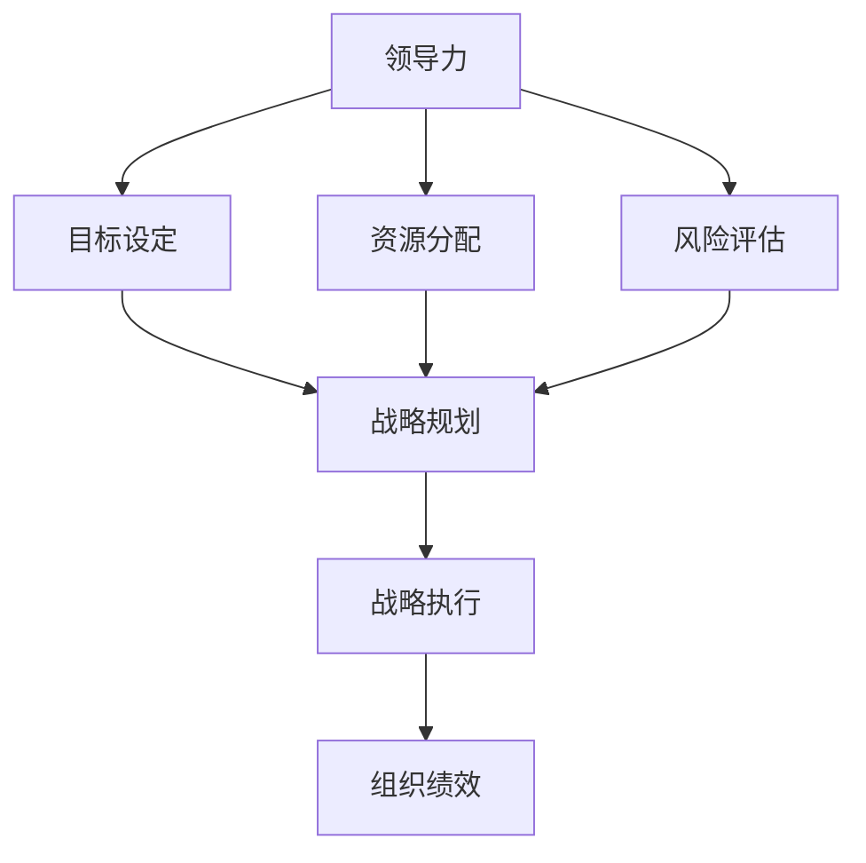

                 


## 领导力与战略思维：培养长远眼光

### 关键词

- 领导力
- 战略思维
- 长远眼光
- 组织文化
- 决策
- 全球视野

### 摘要

在快速变化的技术和商业环境中，领导力和战略思维成为组织成功的关键。本文将探讨领导力与战略思维的基本概念、发展过程以及它们在决策中的应用。文章还将深入分析组织文化对领导力和战略思维的影响，以及如何培养全球视野和长远眼光，以应对复杂多变的商业环境。通过详细的案例分析、算法原理讲解和实战项目，本文旨在为读者提供全面、实用的领导力与战略思维指南。

---

## 引言

在当今全球化、信息化和复杂化的商业环境中，组织面临的挑战日益增加。这些挑战不仅要求领导者具备卓越的管理能力，还要求他们具备长远的眼光和战略思维。领导力与战略思维成为推动组织持续发展的核心动力。本文旨在探讨这两者之间的关系，以及如何通过培养长远眼光来提升领导力和战略思维。

### 1. 领导力的重要性

领导力是影响组织成功的关键因素之一。它不仅关乎组织的绩效，还关乎组织的文化、员工满意度和创新力。有效的领导力能够激发员工的潜力，提高团队协作效率，促进组织的可持续发展。领导力不仅仅是管理技能的体现，更是一种能够引领和激励他人共同实现目标的品质。

### 2. 战略思维的意义

战略思维是领导者必备的能力。它涉及对组织内外环境的分析、目标的设定、资源的配置以及风险的应对。战略思维不仅仅是规划未来的过程，更是一种能够使组织在动态环境中保持竞争优势的思维模式。通过战略思维，领导者能够预见趋势，把握机遇，应对挑战。

### 3. 长远眼光的重要性

在快速变化的市场环境中，领导者需要具备长远的眼光。长远眼光能够帮助领导者看到问题的本质，制定长期的战略规划，避免短期行为对组织造成的负面影响。培养长远眼光不仅有助于提升领导力和战略思维，还能够促进组织的可持续发展。

本文将围绕领导力与战略思维的基本概念、发展过程、应用方法以及如何培养长远眼光进行深入探讨。通过案例分析、算法原理讲解和实战项目，本文旨在为读者提供实用的指导，帮助他们在实际工作中提升领导力和战略思维。

---

## 领导力与战略思维的基本概念

### 1. 领导力的定义与重要性

领导力是一种影响和激励他人达成共同目标的能力。它不仅包括管理技能，还涉及个人品质、沟通能力和决策能力。有效的领导力能够激发员工的潜力，提高团队协作效率，促进组织的可持续发展。

在组织管理中，领导力具有至关重要的作用。首先，领导力能够塑造组织文化，建立共同价值观，增强团队凝聚力。其次，领导力能够推动创新，鼓励员工不断探索和尝试新的方法和理念，从而提升组织的竞争力。最后，领导力还能够帮助组织应对外部环境的变化，制定和实施有效的战略规划。

### 2. 战略思维的概念与作用

战略思维是一种对组织未来发展方向和路径进行思考的能力。它涉及对组织内外环境的分析、目标的设定、资源的配置以及风险的应对。战略思维不仅仅是规划未来的过程，更是一种能够使组织在动态环境中保持竞争优势的思维模式。

战略思维在组织管理中具有重要作用。首先，它能够帮助组织预见市场趋势，把握机遇，制定有效的战略规划。其次，战略思维能够促进资源的合理配置，提高组织的运营效率。最后，战略思维能够帮助组织应对风险，降低不确定性带来的负面影响。

### 3. 领导力与战略思维的关系

领导力与战略思维之间存在密切的联系。有效的领导力能够激发员工的潜力，提高团队的协作效率，为战略思维的实施提供有力支持。同时，战略思维能够为领导力提供方向和目标，使领导力在实现组织目标的过程中更加有效。

具体来说，领导力与战略思维之间的关系可以从以下几个方面体现：

1. **目标一致性**：有效的领导力能够确保组织内部的目标一致，为战略思维的制定和执行提供基础。
2. **资源配置**：领导力能够合理配置资源，为战略思维的实施提供保障。
3. **风险评估**：战略思维能够帮助领导者识别和应对潜在的风险，提高决策的准确性。
4. **创新驱动**：领导力能够激发员工的创新意识，为战略思维的实现提供动力。

### 4. 领导力与战略思维的关系架构

为了更清晰地理解领导力与战略思维之间的关系，我们可以使用Mermaid流程图来展示其架构。以下是一个简单的Mermaid流程图示例：



在这个流程图中，领导力通过目标设定、资源分配和风险评估等环节，推动战略规划的制定和执行，最终实现组织绩效的提升。

### 5. 核心概念与联系

为了进一步阐述领导力与战略思维的核心概念及其联系，我们可以采用以下伪代码来描述：

```python
# 领导力与战略思维核心概念联系

class Leadership:
    def __init__(self, vision, culture, communication):
        self.vision = vision
        self.culture = culture
        self.communication = communication

    def set_goals(self):
        # 设定目标
        pass
    
    def allocate_resources(self):
        # 资源分配
        pass
    
    def assess_risks(self):
        # 风险评估
        pass

class StrategicThinking:
    def __init__(self, environment, goals, resources):
        self.environment = environment
        self.goals = goals
        self.resources = resources

    def plan_strategies(self):
        # 制定战略规划
        pass
    
    def execute_strategies(self):
        # 执行战略
        pass

# 关系描述
def leadership_strategic_thinking(leader, thinker):
    leader.set_goals()
    leader.allocate_resources()
    leader.assess_risks()
    thinker.plan_strategies()
    thinker.execute_strategies()
```

在这个伪代码中，`Leadership` 类代表领导力，包含目标设定、资源分配和风险评估等方法；`StrategicThinking` 类代表战略思维，包含制定战略规划和执行战略等方法。通过调用这些方法，我们可以看到领导力与战略思维之间的互动关系。

### 6. 数学模型和公式

为了更深入地理解领导力与战略思维的关系，我们可以引入一些数学模型和公式。以下是一个简单的示例：

$$
\text{Leadership Score} = f(\text{Vision}, \text{Culture}, \text{Communication})
$$

$$
\text{Strategic Thinking Score} = f(\text{Environment}, \text{Goals}, \text{Resources})
$$

$$
\text{Organization Performance} = f(\text{Leadership Score}, \text{Strategic Thinking Score})
$$

在这个模型中，领导力得分和战略思维得分都是基于多个因素的综合评估，而组织绩效则是领导力和战略思维得分的函数。通过这些公式，我们可以更直观地理解领导力和战略思维对组织绩效的影响。

### 7. 举例说明

为了更好地理解领导力与战略思维的关系，我们可以通过一个简单的例子来说明。假设一个公司想要开发一款新的产品，以下是如何运用领导力和战略思维的过程：

1. **领导力**：公司领导通过沟通和协调，确保团队对产品开发的目标和愿景有清晰的认识。他们设定了明确的目标，并合理分配了资源，包括人力、财力和时间。
2. **战略思维**：公司的战略规划团队分析了市场环境，确定了目标市场的需求和竞争对手的情况。他们制定了一系列的战略计划，包括产品定位、营销策略和合作伙伴关系。
3. **执行**：领导力和战略思维共同推动了产品开发的过程。领导力确保了团队的高效协作，而战略思维则确保了资源的合理配置和风险的及时应对。

通过这个例子，我们可以看到领导力和战略思维如何相互协作，共同推动组织实现目标。

### 8. 结论

领导力与战略思维是组织成功的关键因素。领导力通过目标设定、资源分配和风险评估等环节，为战略思维的实施提供支持。而战略思维则通过分析环境、设定目标和制定战略，为领导力提供方向和目标。通过培养领导力和战略思维，组织能够更好地应对外部环境的变化，实现长期的可持续发展。

---

## 领导力的发展与培养

领导力不是与生俱来的，而是可以通过学习和实践不断发展的。在这一章节中，我们将探讨领导力的发展过程，包括个人品质的培养、技能的提升以及领导力的风格。

### 1. 个人品质的培养

个人品质是领导力的基石。一个优秀的领导者需要具备诚信、责任感、自我意识、情绪管理等多方面的品质。

#### 1.1 诚信与责任感

诚信是领导者最基本的品质之一。领导者需要言行一致，对员工和客户保持诚实和透明。责任感则要求领导者能够承担起自己的职责，对团队的绩效和结果负责。

#### 1.2 自我意识与情绪管理

自我意识是指领导者对自己的了解和认识，包括自己的优点、缺点以及行为动机。情绪管理则是指领导者能够有效地控制自己的情绪，避免情绪波动对决策和团队氛围产生负面影响。

### 2. 技能的提升

除了个人品质，领导力还需要通过技能的提升来完善。以下是一些关键的领导力技能：

#### 2.1 沟通技能

沟通技能是领导者必备的能力之一。有效的沟通能够确保信息准确传递，减少误解和冲突，提高团队协作效率。沟通技能包括口头沟通、书面沟通和非言语沟通等。

#### 2.2 协调技能

协调技能是指领导者能够协调团队内部和外部的关系，确保各方利益的一致性。协调技能包括解决冲突、资源调配和利益平衡等。

#### 2.3 决策技能

决策技能是领导者的重要能力之一。领导者需要在信息不足、时间紧迫和压力巨大的情况下做出正确的决策。决策技能包括分析能力、判断能力和执行力等。

### 3. 领导力的风格

领导力风格是指领导者对待员工和团队的方式。不同的领导力风格适用于不同的情境和团队。以下是一些常见的领导力风格：

#### 3.1 专制型

专制型领导者强调权威和控制，通常由领导者做出所有决策，员工需要严格遵守规定和指令。

#### 3.2 民主型

民主型领导者鼓励员工参与决策，注重团队协作和员工反馈。这种领导力风格通常适用于创新和变化较多的环境。

#### 3.3 支持型

支持型领导者关注员工的个人发展和需求，提供必要的支持和资源，帮助员工实现目标。

#### 3.4 指导型

指导型领导者通过指导和培训来提升员工的能力和绩效，强调规范和流程。

### 4. 领导力发展的方法

要提升领导力，可以通过以下几种方法：

#### 4.1 学习与实践

通过阅读书籍、参加培训课程和研讨会，以及参与实际项目，不断提升自己的知识和技能。

#### 4.2 反思与自我评估

定期反思自己的行为和决策，进行自我评估，找出改进之处。

#### 4.3 寻求反馈

向同事、下属和导师寻求反馈，了解自己的优点和不足。

#### 4.4 模仿和学习榜样

学习优秀的领导者，了解他们的成功经验和领导力风格。

### 5. 结论

领导力的发展是一个长期的过程，需要不断的学习、实践和反思。通过培养个人品质、提升技能和适应不同的领导力风格，领导者可以不断提升自己的能力，为组织的成功做出贡献。

---

## 战略思维的框架与工具

战略思维是领导者制定和实施有效战略的关键能力。在这一章节中，我们将介绍战略思维的基本框架和常用工具，帮助读者理解和应用战略思维。

### 1. SWOT分析

SWOT分析是一种常用的战略工具，用于评估组织的优势（Strengths）、劣势（Weaknesses）、机会（Opportunities）和威胁（Threats）。通过SWOT分析，领导者可以全面了解组织的内外部环境，为制定战略提供依据。

#### 1.1 SWOT分析步骤

1. **优势分析**：识别组织在资源、能力、市场地位等方面的优势。
2. **劣势分析**：识别组织在资源、能力、市场地位等方面的劣势。
3. **机会分析**：识别外部环境中可能为组织带来的机遇。
4. **威胁分析**：识别外部环境中可能对组织构成的威胁。

#### 1.2 SWOT分析应用

SWOT分析可以应用于不同层面的战略制定，如企业战略、部门战略和产品战略等。通过SWOT分析，领导者可以明确组织的战略方向，制定相应的策略。

### 2. PEST分析

PEST分析是一种用于评估组织外部环境因素的工具，包括政治（Political）、经济（Economic）、社会（Social）和技术（Technological）四个方面。通过PEST分析，领导者可以了解外部环境的变化趋势，为战略规划提供参考。

#### 2.1 PEST分析步骤

1. **政治分析**：评估政治因素对组织的影响，如政策变化、政治稳定性等。
2. **经济分析**：评估经济因素对组织的影响，如经济增长、通货膨胀等。
3. **社会分析**：评估社会因素对组织的影响，如人口结构、文化趋势等。
4. **技术分析**：评估技术因素对组织的影响，如技术创新、技术趋势等。

#### 2.2 PEST分析应用

PEST分析可以帮助领导者识别外部环境的变化趋势，制定相应的应对策略。例如，在技术快速发展的行业中，领导者需要密切关注技术趋势，及时调整战略以保持竞争力。

### 3. 其他战略思维工具

除了SWOT分析和PEST分析，还有许多其他有用的战略思维工具，如五力模型、波特价值链分析等。

#### 3.1 五力模型

五力模型是由迈克尔·波特提出的一种用于分析行业竞争力的工具，包括供应商、买家、潜在竞争者、替代产品和现有竞争者五个方面。通过五力模型，领导者可以评估行业的竞争格局，制定相应的战略。

#### 3.2 波特价值链分析

波特价值链分析是一种用于分析企业内部价值创造过程的工具，包括主要活动和辅助活动。通过波特价值链分析，领导者可以识别企业的核心竞争优势，制定相应的战略。

### 4. 结论

战略思维是领导者制定和实施有效战略的关键能力。通过SWOT分析、PEST分析等工具，领导者可以全面了解组织的内外部环境，为战略规划提供依据。掌握这些工具和方法，有助于领导者更好地应对复杂多变的外部环境，推动组织的持续发展。

---

## 战略规划与执行

战略规划是组织实现长期目标的重要手段。一个有效的战略规划不仅需要明确的目标和策略，还需要有效的执行过程。在这一章节中，我们将讨论战略规划与执行的关键步骤、关键因素以及战略调整与适应的方法。

### 1. 战略规划的关键步骤

战略规划是一个系统性的过程，包括以下关键步骤：

#### 1.1 目标设定

目标设定是战略规划的首要步骤。一个明确、具体和可衡量的目标能够为组织提供明确的方向。目标设定应考虑组织的使命、愿景和核心价值观，同时也要结合外部环境和内部能力。

#### 1.2 环境分析

环境分析包括对组织外部环境和内部环境的分析。外部环境分析主要关注市场趋势、竞争格局和法规政策等；内部环境分析则关注组织的资源、能力和核心竞争力。

#### 1.3 制定策略

根据目标设定和环境分析，制定具体的策略。策略应明确如何利用优势、克服劣势、抓住机遇和应对威胁。常见的策略包括市场扩张、产品创新、成本控制等。

#### 1.4 资源配置

资源配置是指根据策略需求，合理分配组织的人力、财务和物质资源。有效的资源配置能够确保战略的顺利实施。

#### 1.5 风险管理

风险管理是战略规划的重要组成部分。通过识别、评估和应对潜在风险，组织可以降低不确定性对战略实施的影响。

#### 1.6 监控与调整

监控与调整是指对战略执行过程进行持续的跟踪和评估，及时发现偏差并进行调整。有效的监控与调整能够确保战略规划与实际情况保持一致。

### 2. 战略执行的关键因素

战略执行的成功取决于多个关键因素，包括组织文化、激励机制和团队协作等。

#### 2.1 组织文化

组织文化是战略执行的基础。一个支持战略的文化能够激发员工的积极性和创造力，提高执行力。领导者应通过文化建设，确保组织内部的目标、价值观和行为准则与战略保持一致。

#### 2.2 激励机制

激励机制是确保战略执行的动力。通过设定合理的考核指标、奖励机制和晋升通道，组织可以激发员工的工作热情和责任感。

#### 2.3 团队协作

团队协作是战略执行的重要保障。领导者应注重团队建设，提高团队的沟通和协作能力，确保团队成员能够共同为实现战略目标而努力。

### 3. 战略调整与适应

在战略执行过程中，外部环境和内部条件可能会发生改变，因此战略调整与适应是必不可少的。以下是一些战略调整与适应的方法：

#### 3.1 市场变化下的战略调整

市场变化是组织面临的主要外部因素之一。领导者需要密切关注市场动态，及时调整战略以适应市场的变化。例如，当市场进入快速增长期时，组织可以加大市场拓展力度；当市场出现饱和时，组织可以转向其他市场或产品。

#### 3.2 技术创新下的战略调整

技术创新是推动组织发展的重要动力。领导者需要积极拥抱技术创新，将新技术融入战略规划中。例如，当出现新的技术时，组织可以调整产品结构或服务模式，以更好地满足客户需求。

#### 3.3 内部变化下的战略调整

内部变化包括组织结构、人员变动、资源分配等方面的调整。领导者需要根据内部变化及时调整战略，确保组织能够适应新的内部环境。例如，当组织规模扩大时，领导者可以调整组织结构，提高管理效率。

### 4. 结论

战略规划与执行是组织实现长期目标的关键环节。有效的战略规划需要明确的目标、详细的策略和合理的资源配置；而成功的战略执行则需要组织文化的支持、激励机制的有效运作和团队协作的紧密配合。在战略执行过程中，领导者需要密切关注外部环境和内部变化，及时调整战略以保持组织的竞争力。通过不断优化战略规划与执行过程，组织可以持续发展，实现长期目标。

---

## 组织文化与领导力

组织文化是影响领导力的重要外部因素之一。一个健康、积极的组织文化能够增强员工的凝聚力和归属感，提高组织的整体绩效。同时，领导力在塑造和强化组织文化方面发挥着至关重要的作用。在这一章节中，我们将探讨组织文化如何影响领导力和战略思维，以及如何通过文化塑造来提升领导力和战略执行。

### 1. 组织文化的概念与类型

组织文化是指组织成员共同遵守的价值观、信仰、行为准则和工作方式。它不仅体现在组织的日常运作中，还渗透在员工的思维方式和行为习惯中。根据组织文化的特征，可以将组织文化分为以下几种类型：

- **任务型文化**：强调效率、绩效和结果。这种文化通常适用于快速变化和创新驱动的行业。
- **权力型文化**：强调权力和权威。这种文化通常在层级结构严格、决策权力集中的组织中较为普遍。
- **家族型文化**：强调个人与组织之间的紧密联系和归属感。这种文化在家族企业和创业公司中较为常见。
- **市场型文化**：强调市场导向、客户至上和竞争意识。这种文化在竞争激烈的市场环境中较为适用。

### 2. 组织文化对领导力的影响

组织文化对领导力的影响是深远而复杂的。一个积极、健康的组织文化能够为领导力提供良好的土壤，促进领导力的成长和发展。具体来说，组织文化对领导力的影响体现在以下几个方面：

- **价值观的塑造**：组织文化通过共同的价值观和行为准则，塑造领导者的价值观和行为方式。一个以诚信、创新和客户为中心的组织文化能够培养出具有相同价值观的领导者。
- **领导力风格的选择**：不同的组织文化适合不同的领导力风格。例如，在任务型文化中，领导者可能更倾向于采用结果导向的领导风格；而在家族型文化中，领导者可能更注重个人与组织的情感联系。
- **领导力的发展**：组织文化为领导者提供学习和成长的机会。在一个支持性和开放的文化环境中，领导者能够得到更多的反馈和指导，从而不断提升自己的领导力水平。

### 3. 领导力对组织文化的影响

领导力在塑造和强化组织文化方面起着至关重要的作用。领导者的行为和决策不仅直接影响组织文化的发展，还通过员工的示范作用影响整个组织。具体来说，领导力对组织文化的影响体现在以下几个方面：

- **文化塑造**：领导者通过自己的行为和决策，塑造和强化组织文化。例如，一个注重创新和实验的领导者能够推动组织形成鼓励创新的文化。
- **文化传承**：领导者在组织中的角色不仅仅是当前的管理者，更是未来领导者的榜样和传承者。他们通过言传身教，将组织的核心价值观和行为准则传递给下一代领导者。
- **文化变革**：在组织面临外部环境变化或内部需求变化时，领导者需要带领组织进行文化变革。例如，当组织需要从传统模式转向创新驱动模式时，领导者需要推动文化变革，以适应新的发展需求。

### 4. 文化塑造与领导力提升

通过文化塑造，领导者可以提升自己的领导力和战略执行能力。以下是一些具体的方法：

- **建立共同的价值观**：领导者应与团队成员共同探讨和确立组织的核心价值观，并通过日常行为和决策来体现和强化这些价值观。
- **提供反馈和指导**：领导者应积极为团队成员提供反馈和指导，帮助他们理解和实践组织的价值观和行为准则。
- **鼓励开放沟通**：领导者应鼓励团队成员之间进行开放沟通，分享经验和想法，从而促进组织文化的形成和强化。
- **培养创新能力**：领导者应推动组织形成创新文化，鼓励员工提出新的想法和建议，为组织的持续发展提供动力。

### 5. 结论

组织文化对领导力和战略思维具有重要影响。一个积极、健康的组织文化能够为领导力提供良好的土壤，促进领导力的成长和发展。同时，领导力在塑造和强化组织文化方面也发挥着至关重要的作用。通过文化塑造，领导者可以提升自己的领导力和战略执行能力，为组织的持续发展奠定坚实基础。

---

## 领导力与战略思维在决策中的应用

在组织中，领导力和战略思维在决策过程中发挥着关键作用。有效的决策不仅能够推动组织实现目标，还能提高组织的适应能力和竞争力。在这一章节中，我们将探讨领导力和战略思维如何应用于决策，包括决策模型、案例分析以及决策中的领导力要素。

### 1. 决策模型

决策模型是用于分析和指导决策过程的工具。以下是一些常见的决策模型：

#### 1.1 传统决策模型

传统决策模型通常包括以下步骤：

1. **问题识别**：明确需要解决的问题。
2. **目标设定**：确定决策的目标。
3. **方案生成**：列出所有可能的解决方案。
4. **方案评估**：评估每个方案的风险和收益。
5. **方案选择**：选择最佳的解决方案。
6. **实施与监控**：执行决策并监控结果。

#### 1.2 现代决策模型

现代决策模型在传统决策模型的基础上，增加了更多的分析方法和工具，如数据分析和模拟。以下是一些现代决策模型：

1. **决策树**：通过图形化方式展示决策过程，评估不同决策路径的收益和风险。
2. **贝叶斯网络**：通过概率图模型，展示决策过程中的不确定性和相关性。
3. **多目标决策**：在多个目标之间存在冲突时，采用多目标决策方法，找到最优解。

### 2. 决策案例分析

以下是一个决策案例的分析：

#### 案例背景

某公司计划推出一款新产品，产品经理需要在多种营销策略中进行选择，以最大化市场份额和利润。

#### 决策过程

1. **问题识别**：如何最大化市场份额和利润。
2. **目标设定**：市场份额和利润。
3. **方案生成**：
   - 方案A：在社交媒体上开展宣传活动。
   - 方案B：与知名KOL合作，进行产品推荐。
   - 方案C：通过线下活动，提高产品知名度。
4. **方案评估**：
   - 方案A：成本低，但效果难以衡量。
   - 方案B：效果显著，但成本较高。
   - 方案C：成本适中，但需要较长的时间来见效。
5. **方案选择**：综合考虑成本和效果，选择方案B。
6. **实施与监控**：实施方案B，并定期评估效果。

通过这个案例，我们可以看到决策模型在决策过程中的应用。领导力和战略思维在这个过程中发挥了关键作用，帮助决策者明确问题、设定目标、评估方案和选择最佳方案。

### 3. 决策中的领导力要素

在决策过程中，领导力要素对决策的质量和效果具有重要影响。以下是一些关键领导力要素：

#### 3.1 明确的目标和愿景

领导者需要明确组织的目标和愿景，确保决策与组织的发展方向一致。这有助于确保决策的针对性和有效性。

#### 3.2 沟通和协作

领导者需要与团队成员进行有效沟通，了解他们的意见和建议。这有助于收集更多的信息，提高决策的全面性和准确性。

#### 3.3 风险评估

领导者需要具备评估风险的能力，确保决策考虑到各种可能的风险和不确定性。这有助于降低决策失误的风险。

#### 3.4 决策执行

领导者需要确保决策得到有效执行，并监控决策的结果。这有助于确保决策的效果，并根据实际情况进行调整。

### 4. 结论

领导力和战略思维在决策过程中发挥着关键作用。通过运用决策模型和案例分析，领导者可以更好地理解和应用这些工具和方法。在决策过程中，领导者需要关注明确的目标和愿景、有效的沟通和协作、风险评估和决策执行等关键要素，以提高决策的质量和效果。通过不断实践和提升，领导者可以更好地运用领导力和战略思维，为组织的成功做出贡献。

---

## 全球视野与长远眼光

在当今全球化的商业环境中，领导者不仅需要具备卓越的本地管理能力，还必须拥有全球视野和长远眼光。这些能力使领导者能够预见全球趋势，把握机遇，制定适应未来的战略规划。在这一章节中，我们将探讨如何培养全球视野和长远眼光，以及它们在战略规划中的应用。

### 1. 全球视野的重要性

全球视野是指领导者对全球政治、经济、社会和技术趋势的理解和洞察。拥有全球视野的领导者能够更好地把握全球市场机会，规避潜在风险，制定更具前瞻性的战略规划。以下是全球视野的重要性：

- **洞察全球市场趋势**：领导者需要了解不同国家和地区市场的变化，以便及时调整策略。
- **整合全球资源**：全球视野有助于领导者发现和利用全球范围内的资源，提高组织的竞争力。
- **应对国际化挑战**：全球视野能够帮助领导者识别和应对国际化经营中的文化、法律和经济挑战。

### 2. 长远眼光的定义与特点

长远眼光是指领导者能够超越短期利益，关注长期发展目标的能力。具有长远眼光的领导者能够制定长期的战略规划，确保组织的可持续发展。以下是长远眼光的特点：

- **前瞻性**：领导者需要具备预见未来发展趋势的能力，提前布局。
- **耐心**：长远目标的实现往往需要较长时间，领导者需要有足够的耐心和决心。
- **系统性**：长远眼光要求领导者从系统的角度思考问题，考虑长期和短期、内部和外部因素。

### 3. 培养全球视野和长远眼光的方法

要培养全球视野和长远眼光，领导者可以采取以下几种方法：

- **国际交流和合作**：通过参与国际会议、交流活动，与全球同行交流经验，了解不同市场的运作模式。
- **教育培训**：参加国际培训课程，学习全球战略管理和领导力技巧。
- **阅读和研究**：阅读全球商业、经济和技术领域的最新研究，了解最新的趋势和动态。
- **实地考察**：亲自到不同国家和地区进行实地考察，了解当地的市场环境和文化差异。

### 4. 全球视野和长远眼光在战略规划中的应用

全球视野和长远眼光在战略规划中的应用体现在以下几个方面：

- **全球化战略**：领导者需要根据全球市场趋势，制定全球化的战略规划，确保组织在全球市场中的竞争力。
- **长期投资**：领导者需要关注长期投资，如研发、人才培养和技术创新，确保组织在未来的发展中具备竞争优势。
- **可持续发展**：领导者需要关注组织的可持续发展，制定环保、社会责任和伦理方面的战略，确保组织在长期发展中的可持续性。

### 5. 结论

全球视野和长远眼光是领导者必备的能力。通过培养全球视野，领导者能够更好地把握全球市场机会，制定适应未来的战略规划。通过培养长远眼光，领导者能够关注长期发展目标，确保组织的可持续发展。通过全球视野和长远眼光，领导者可以更好地应对复杂多变的商业环境，推动组织的成功。

---

## 全文总结

领导力与战略思维是组织成功的关键要素，它们相互依存、相互促进。领导力通过目标设定、资源分配和风险评估等环节，为战略思维提供方向和保障；而战略思维则通过环境分析、机会识别和风险应对等环节，为领导力提供策略和工具。在全球化和技术变革的背景下，领导者不仅需要具备卓越的管理技能，还必须拥有全球视野和长远眼光。通过培养这些能力，领导者可以更好地应对复杂多变的商业环境，推动组织的持续发展。

本文从领导力与战略思维的基本概念、发展过程、应用方法以及全球视野和长远眼光等方面进行了全面探讨。通过具体的案例分析和算法原理讲解，我们深入理解了领导力和战略思维的核心内容。同时，文章还强调了组织文化、决策过程以及全球视野在领导力和战略思维中的作用。

在未来的工作和学习中，读者可以继续深化对领导力和战略思维的理解，通过实践和反思不断提升自己的领导力水平。此外，建议读者拓展阅读相关领域的书籍和资料，如《领导力与决策》、《战略管理》等，以获得更多的理论和实践经验。

通过不断学习和实践，领导者可以更好地应对外部环境的变化，制定和实施有效的战略规划，推动组织的成功。让我们共同努力，成为具备卓越领导力和战略思维的优秀领导者，为组织和社会的发展贡献自己的力量。

---

### 附录

#### A.1 核心概念与联系

在本章中，我们使用了以下Mermaid流程图来展示领导力与战略思维之间的关系：


该流程图清晰地展示了领导力在战略规划与执行过程中的关键作用。

---

### A.2 代码示例

以下是一个简单的Python代码示例，用于展示领导力与战略思维的应用：

```python
class Leadership:
    def __init__(self, vision, culture, communication):
        self.vision = vision
        self.culture = culture
        self.communication = communication
    
    def set_goals(self):
        print("设定目标：实现公司三年内市场份额翻倍。")
    
    def allocate_resources(self):
        print("资源分配：增加研发投入，提升产品竞争力。")
    
    def assess_risks(self):
        print("风险评估：关注市场变化，确保战略调整灵活。")

class StrategicThinking:
    def __init__(self, environment, goals, resources):
        self.environment = environment
        self.goals = goals
        self.resources = resources
    
    def plan_strategies(self):
        print("制定战略规划：拓展海外市场，加强品牌建设。")
    
    def execute_strategies(self):
        print("执行战略：实施市场推广计划，提升品牌知名度。")

# 应用示例
leader = Leadership("全球市场领先", "创新文化", "高效沟通")
strategist = StrategicThinking("全球化趋势", "市场份额翻倍", "增加研发投入")

leader.set_goals()
leader.allocate_resources()
leader.assess_risks()
strategist.plan_strategies()
strategist.execute_strategies()
```

通过这个示例，我们可以看到领导力和战略思维在设定目标、资源分配、风险评估以及战略规划与执行中的具体应用。

---

### A.3 最佳实践

**最佳实践**

- **定期培训**：为员工提供定期的领导力与战略思维培训，提升其能力和素质。
- **跨部门合作**：鼓励跨部门合作，促进不同部门和团队的沟通和协作。
- **透明沟通**：保持沟通的透明度，让员工了解组织的目标、策略和进展。
- **持续学习**：鼓励员工持续学习和自我提升，培养长远眼光和创新能力。

**小结**

通过本文的探讨，我们深入了解了领导力与战略思维的基本概念、发展过程和应用方法。同时，我们也学习了如何培养全球视野和长远眼光，以应对复杂多变的商业环境。希望本文能对读者在提升领导力和战略思维方面提供有益的参考和指导。

---

### A.4 注意事项

- **明确目标**：在制定战略规划时，确保目标明确、具体和可衡量。
- **风险评估**：在决策过程中，充分考虑潜在的风险，并制定相应的应对措施。
- **团队协作**：在执行战略规划时，注重团队协作和沟通，确保资源合理配置。
- **持续优化**：不断评估和优化战略规划，根据实际情况进行调整和改进。

---

### A.5 拓展阅读

- 《领导力与决策》：作者彼得·德鲁克，详细阐述了领导力与决策的关系。
- 《战略管理》：作者迈克尔·波特，介绍了战略规划的基本理论和工具。
- 《全球视野》：作者托马斯·弗里德曼，探讨全球化对领导力的影响。

通过阅读这些书籍，读者可以进一步深化对领导力与战略思维的理解和应用。希望这些建议对您的学习和工作有所帮助。作者：AI天才研究院/AI Genius Institute & 禅与计算机程序设计艺术 /Zen And The Art of Computer Programming

