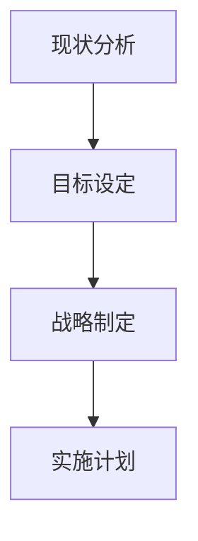
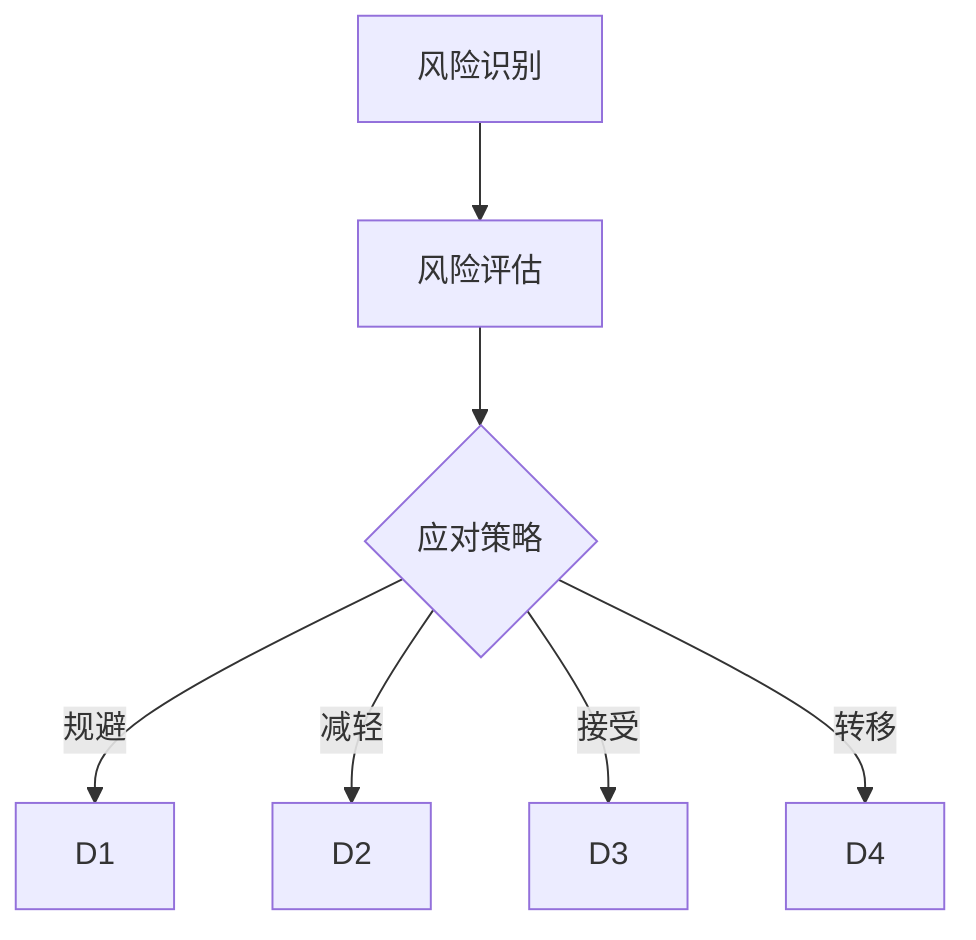
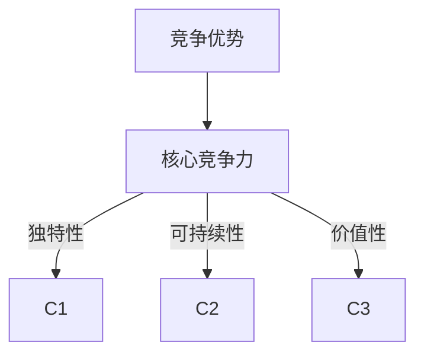
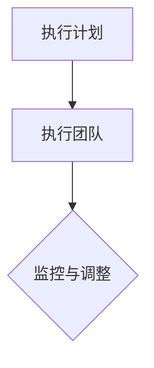

                 

### 文章标题

# 领导力与战略思维：长远规划团队发展

领导力与战略思维是企业管理中不可或缺的两个关键要素，对于团队的长期发展至关重要。本篇文章将深入探讨这两个主题，旨在帮助读者理解它们的核心概念、相互关系以及在实际应用中的重要性。

本文将分为三个主要部分：

## 第一部分：领导力基础

在这一部分中，我们将介绍领导力的定义与作用，探讨领导者的特质与能力，解析领导力模型与理论，并探讨团队领导风格与沟通技巧。

## 第二部分：战略思维

在这一部分中，我们将深入探讨战略规划与目标设定，风险评估与应对策略，竞争优势与核心竞争力，以及战略执行与监控。

## 第三部分：长远规划与团队发展

在这一部分中，我们将探讨长远规划的重要性，团队建设与人才发展，人员激励与绩效管理，团队持续发展与创新。

通过这三个部分的详细分析，我们将帮助读者理解领导力与战略思维如何相辅相成，共同推动团队的长远发展。

---

## 文章关键词

- 领导力
- 战略思维
- 长远规划
- 团队发展
- 目标设定
- 风险评估
- 竞争优势
- 绩效管理
- 沟通技巧

---

## 文章摘要

本文旨在探讨领导力与战略思维在团队长远发展中的关键作用。首先，我们将分析领导力的定义与作用，介绍领导者的特质与能力，并探讨不同领导力模型与理论。接着，我们将深入探讨战略思维的核心要素，包括战略规划与目标设定、风险评估与应对策略、竞争优势与核心竞争力，以及战略执行与监控。最后，我们将探讨如何通过长远规划、团队建设、人才发展、人员激励与绩效管理，推动团队的持续发展与创新。通过本文的深入分析，读者将更好地理解领导力与战略思维的实际应用，为团队的长远发展奠定坚实基础。

---

### 领导力的定义与作用

领导力是一种复杂且多维度的影响力，它不仅关乎个人的能力和特质，还涉及到团队和组织层面的协同与互动。首先，我们定义领导力：领导力是一种能够激励、引导和影响他人，共同实现目标的能力。它不仅包括领导者的个人特质，还涉及到领导者与团队成员之间的互动和关系。

在企业管理中，领导力扮演着至关重要的角色。以下是领导力在企业管理中的一些核心作用：

#### 1. 促进团队协作与执行力

领导力能够激发团队成员的积极性，提高团队的协作效率，从而增强企业的执行力。一个优秀的领导者能够明确目标，制定合理的策略，并通过有效的沟通和激励，确保团队成员为实现目标而努力。

#### 2. 引领企业变革与创新

在快速变化的市场环境中，领导力是推动企业变革与创新的关键因素。领导者需要具备前瞻性思维，能够识别市场趋势，制定相应的战略，并带领团队迅速适应变革，从而保持企业的竞争力。

#### 3. 激发员工潜力与成长

领导力不仅仅是一种管理能力，更是一种激励与培养人才的能力。一个优秀的领导者能够发现员工的潜力，提供成长机会，并通过有效的激励机制，激发员工的内在动力，促进其个人与职业成长。

#### 4. 维护企业文化与价值观

领导力在塑造和维护企业文化方面发挥着重要作用。领导者通过自己的言行示范，传递企业的核心价值观，促进企业文化的形成和传承，从而增强企业的凝聚力和向心力。

### 领导者的特质与能力

领导者的特质和能力是决定其领导效果的重要因素。以下是一些关键的领导者特质和能力：

#### 1. 沟通能力

沟通能力是领导者必备的基本能力。有效的沟通不仅能够确保信息的准确传达，还能够增强团队的凝聚力和信任感。领导者需要具备良好的口头和书面沟通技巧，能够清晰、准确地表达自己的想法，并倾听和理解团队成员的意见。

#### 2. 决策能力

决策能力是领导者的重要特质之一。在面临复杂和不确定的情况时，领导者需要能够迅速做出明智的决策，并承担相应的责任。这需要领导者具备分析问题的能力，以及面对风险的勇气和决心。

#### 3. 激励能力

激励能力是领导者影响团队成员的关键因素。领导者需要能够识别员工的动机和需求，并通过适当的激励措施，激发员工的内在动力，使其能够更好地发挥自己的潜力。

#### 4. 情绪管理能力

情绪管理能力是领导者应对压力和挑战的重要能力。领导者需要能够自我调节情绪，保持冷静和理智，以应对复杂多变的情境。同时，领导者还需要能够识别和调节团队成员的情绪，以促进团队的和谐与协作。

#### 5. 学习能力

学习能力是领导者持续成长的关键。领导者需要保持对新知识、新技能的渴望，并通过不断学习和实践，提升自己的领导能力和管理水平。

### 领导力模型与理论

领导力模型与理论为领导者提供了指导框架，帮助他们更好地理解和管理团队。以下是一些重要的领导力模型与理论：

#### 1. 司马光领导力模型

司马光领导力模型是中国古代著名的领导力理论之一。该模型认为，领导者应具备“德、才、胆、识”四项基本素质，即道德品质、才能、胆略和见识。这一模型强调领导者的道德品质和综合素质，对于现代企业管理仍有很强的启示意义。

#### 2. 华莱士领导力模型

华莱士领导力模型是一个基于心理学理论的领导力模型，它认为领导者的领导风格可以分为四种类型：专制型、民主型、放任型和变革型。每种领导风格都有其适用的情境和优缺点，领导者需要根据实际情况灵活运用。

#### 3. 波斯纳领导力模型

波斯纳领导力模型是一个基于组织行为学的领导力模型，它认为领导力由五个要素构成：领导者与追随者的关系、领导行为、领导者对组织的承诺、领导者对变革的推动能力以及领导者的认知能力。这一模型提供了一个全面的视角，帮助领导者理解和提升自己的领导能力。

#### 4. 领导连续体模型

领导连续体模型认为领导风格是动态变化的，没有绝对的优劣之分。领导者需要根据不同的情境和团队成员的需求，灵活调整自己的领导风格，以实现最佳领导效果。

### 团队领导风格与沟通技巧

团队领导风格是领导者管理团队的方式和方法，不同的领导风格会对团队产生不同的影响。以下是几种常见的团队领导风格：

#### 1. 专制型领导风格

专制型领导风格的特点是领导者独自做出决策，并强制执行。这种风格在紧急情况下可能有效，但长期来看，可能会导致团队士气低落和创新能力受限。

#### 2. 民主型领导风格

民主型领导风格的特点是领导者鼓励团队成员参与决策，并尊重每个人的意见。这种风格有助于增强团队的凝聚力和创新能力，但决策过程可能较为缓慢。

#### 3. 放任型领导风格

放任型领导风格的特点是领导者放任团队成员自行管理，不干预具体事务。这种风格适合高度自治的团队，但可能导致团队目标不明确和协作效率低下。

#### 4. 变革型领导风格

变革型领导风格的特点是领导者具有远见和愿景，能够激发团队成员的潜能，推动团队实现变革。这种风格在组织变革和创新中尤为重要。

沟通技巧是团队领导的重要能力之一，以下是几种关键的沟通技巧：

#### 1. 清晰表达

清晰表达是有效沟通的基础。领导者需要能够清晰、准确地传达信息，避免误解和沟通障碍。

#### 2. 倾听

倾听是建立信任和理解的关键。领导者需要耐心倾听团队成员的意见和反馈，以便更好地了解团队的需求和问题。

#### 3. 适应性沟通

适应性沟通是指领导者根据不同的情境和团队成员的特点，灵活调整沟通方式。这需要领导者具备良好的观察力和适应能力。

#### 4. 正面沟通

正面沟通是指领导者以积极、建设性的态度进行沟通。这有助于增强团队的凝聚力，提升团队士气。

### 总结

领导力在企业管理中具有至关重要的作用。通过理解领导力的定义与作用，了解领导者的特质与能力，掌握领导力模型与理论，以及运用适当的团队领导风格和沟通技巧，领导者可以更好地管理团队，推动企业的长远发展。

在下一部分中，我们将深入探讨战略思维的核心要素，包括战略规划与目标设定、风险评估与应对策略、竞争优势与核心竞争力，以及战略执行与监控。这将帮助我们进一步理解如何通过战略思维，为团队的长远发展制定明确的方向和路径。

---

### 战略思维的核心要素

战略思维是企业领导者和管理者在复杂环境中制定和实施长期规划的重要工具。战略思维不仅仅是对现状的分析，更是对未来趋势的预见和对潜在机会的把握。在本节中，我们将详细探讨战略思维的核心要素，包括战略规划与目标设定、风险评估与应对策略、竞争优势与核心竞争力，以及战略执行与监控。

#### 1. 战略规划与目标设定

战略规划是战略思维的核心，它决定了企业的发展方向和目标。战略规划的过程通常包括以下几个步骤：

**1.1 现状分析**

首先，领导者需要对企业当前的运营状况、市场环境、资源状况等进行全面的分析。这一步有助于确定企业的优势和劣势，为后续的战略制定提供依据。

**1.2 目标设定**

在了解现状后，企业需要设定清晰、具体、可行的目标。目标设定应遵循SMART原则（Specific具体的、Measurable可衡量的、Achievable可实现的、Relevant相关的、Time-bound有时限的）。例如，企业可以设定在未来三年内实现50%的销售额增长。

**1.3 战略制定**

基于现状分析和目标设定，企业需要制定具体的战略。这可能包括市场拓展、产品创新、组织变革等多个方面。战略应具有指导性和灵活性，以适应外部环境的变化。

**1.4 实施计划**

战略制定后，企业需要制定详细的实施计划，明确各项任务的负责人、时间节点和资源需求。实施计划的制定应充分考虑资源的合理配置和效率。

**Mermaid 流程图：**

#### 2. 风险评估与应对策略

在战略规划过程中，风险评估是至关重要的一环。企业需要识别可能影响战略实施的各种风险，并制定相应的应对策略。

**2.1 风险识别**

风险识别是评估风险的第一步。企业可以通过历史数据、专家咨询、市场调研等方式，识别潜在的风险因素。这些因素可能包括市场变化、技术变革、竞争压力、政策法规等。

**2.2 风险评估**

在识别风险后，企业需要对风险进行评估，确定其发生概率和影响程度。评估方法可以采用定性的方法，如风险矩阵，也可以采用定量的方法，如蒙特卡洛模拟。

**2.3 应对策略**

针对不同类型的风险，企业需要制定相应的应对策略。这包括风险规避、风险减轻、风险接受和风险转移等策略。

**Mermaid 流�程图：**

#### 3. 竞争优势与核心竞争力

竞争优势是企业在市场竞争中取得优势的关键。核心竞争力则是企业长期竞争优势的源泉。

**3.1 竞争优势**

竞争优势是指企业通过独特的资源、能力或战略，在市场上获得优势地位的能力。这可以通过成本领先、差异化和集中化等策略实现。

**3.2 核心竞争力**

核心竞争力是企业在长期竞争中保持优势的关键能力。它通常具有以下特点：

- **独特性**：核心竞争力是企业的独特优势，难以被竞争对手模仿。
- **可持续性**：核心竞争力能够在长时间内保持优势。
- **价值性**：核心竞争力能够为企业和客户创造价值。

**Mermaid 流程图：**

#### 4. 战略执行与监控

战略执行是将战略转化为实际行动的过程。有效的战略执行需要明确的执行计划、高效的执行团队和持续的监控与调整。

**4.1 执行计划**

执行计划是战略执行的关键。企业需要明确各项任务的执行时间、负责人和所需资源，以确保战略目标的实现。

**4.2 执行团队**

执行团队是战略执行的核心力量。企业需要选拔和培养一支具备执行力、协作能力和创新能力的团队。

**4.3 监控与调整**

在战略执行过程中，企业需要持续监控战略实施情况，及时发现和解决问题。根据实际情况，企业可能需要调整战略目标和执行计划，以确保战略的持续有效。

**Mermaid 流程图：**

### 总结

战略思维是企业长远发展的关键。通过战略规划与目标设定，企业可以明确发展方向和目标；通过风险评估与应对策略，企业可以降低不确定性；通过竞争优势与核心竞争力的构建，企业可以在市场中获得持续竞争优势；通过战略执行与监控，企业可以确保战略目标的实现。在下一部分中，我们将探讨如何通过长远规划与团队发展，实现企业的持续成功。

---

### 长远规划的重要性

长远规划是企业在不确定的环境中保持竞争优势和持续发展的关键。它不仅仅是短期的策略和目标，而是对企业的长期愿景、战略路径和资源配置的全面规划和设计。以下从几个方面来探讨长远规划的重要性：

#### 1. 明确企业愿景与目标

长远规划的首要任务是明确企业的愿景和目标。通过设定清晰、具体、可量化的长期目标，企业可以指引自己的发展方向，避免在瞬息万变的市场中迷失方向。愿景和目标应当具有挑战性，同时也要符合企业的实际能力和市场环境。

**愿景示例：** 在未来十年内，成为全球领先的云计算服务提供商。

**目标设定：** 
- 在未来五年内，市场份额达到行业前三名。
- 在未来三年内，实现年营收增长30%。

#### 2. 优化资源配置

长远规划有助于企业优化资源配置，确保资源的有效利用。通过全面分析企业的资源状况，包括资金、人才、技术、市场等，企业可以制定合理的资源配置策略，避免资源浪费，提高运营效率。

**资源配置策略：** 
- 根据长期目标，优先投资于核心业务领域。
- 通过人才发展计划，提升团队的整体能力。

#### 3. 应对不确定性

市场环境瞬息万变，长远规划可以帮助企业预见和应对潜在的风险和挑战。通过对市场趋势、技术变革、政策法规等因素的深入分析，企业可以制定应对策略，减少不确定性对企业的影响。

**应对策略：** 
- 定期进行市场调研，了解客户需求和市场变化。
- 建立灵活的运营模式，快速响应市场变化。

#### 4. 保持竞争优势

长远规划有助于企业保持竞争优势，确保在激烈的市场竞争中立于不败之地。通过构建独特的核心竞争力，企业可以在市场中脱颖而出，吸引和保留客户。

**核心竞争力：** 
- 技术创新：持续投入研发，保持技术领先。
- 服务质量：提供高质量的服务，建立客户忠诚度。

#### 5. 促进持续发展

长远规划不仅关注短期利益，更注重企业的长期可持续性。通过制定长期发展战略，企业可以在确保短期效益的同时，实现长期的稳定发展。

**可持续发展策略：** 
- 绿色环保：采用环保技术，减少碳排放。
- 社会责任：积极参与社会公益活动，提升企业形象。

#### 6. 增强企业凝聚力

长远规划能够激发员工的归属感和使命感，增强企业的凝聚力。通过明确企业的愿景和目标，员工能够更好地理解自己的工作价值，并与企业的长期发展目标保持一致。

**员工激励：** 
- 设立长期激励机制，鼓励员工为企业目标努力。
- 提供职业发展机会，帮助员工实现个人成长。

### 综合案例分析

以下是一个综合案例，展示了长远规划在企业中的应用：

**企业背景：** 一家云计算服务提供商，成立于2000年。

**长期目标：** 成为全球领先的云计算服务提供商。

**战略路径：** 
1. 投资研发，保持技术领先。
2. 拓展全球市场，提升市场份额。
3. 提供高质量的服务，建立客户忠诚度。

**资源配置：** 
- 资金：每年投入20%的营收用于研发。
- 人才：建立人才发展计划，每年招聘和培训100名技术人员。

**应对策略：** 
- 定期进行市场调研，了解客户需求和市场变化。
- 建立灵活的运营模式，快速响应市场变化。

**核心竞争力：** 
- 技术创新：自主研发的云计算平台，具有高性能和可靠性。
- 服务质量：提供7x24小时客户服务，确保客户满意度。

**可持续发展：** 
- 绿色环保：采用节能技术，减少碳排放。
- 社会责任：积极参与公益活动，提升企业形象。

**员工激励：** 
- 设立长期激励机制，鼓励员工为企业目标努力。
- 提供职业发展机会，帮助员工实现个人成长。

通过这个案例，我们可以看到长远规划如何帮助企业明确目标、优化资源配置、应对不确定性、保持竞争优势、促进持续发展和增强企业凝聚力。

### 总结

长远规划是企业成功的关键，它不仅帮助企业明确发展方向和目标，优化资源配置，应对不确定性，保持竞争优势，促进持续发展，还能增强企业的凝聚力和员工的归属感。通过深入分析和全面规划，企业可以制定切实可行的长远规划，为未来的成功奠定坚实基础。在下一部分中，我们将探讨团队建设与人才发展，进一步了解如何通过这些措施推动企业的长期成功。

---

### 团队建设与人才发展

团队建设与人才发展是企业长远规划中至关重要的一环。一个高效的团队能够激发成员的潜力，提高工作效率，实现企业的战略目标。以下是团队建设与人才发展的核心策略：

#### 1. 明确团队目标

团队目标应当清晰、具体，并与企业的整体战略相一致。通过明确的目标，团队成员能够理解自己的工作方向和贡献，从而提高工作积极性和凝聚力。

**目标设定示例：**
- 短期目标：在接下来的六个月内，完成新产品的研发并投入市场。
- 长期目标：在未来三年内，提升团队的技术能力，成为行业领先者。

#### 2. 搭建高效的团队结构

团队结构应当根据企业的战略需求和工作任务进行设计，确保团队成员具备互补的技能和经验。常见的团队结构包括跨职能团队、项目团队和矩阵团队。

**团队结构示例：**
- 跨职能团队：由研发、市场、销售、技术等部门的代表组成，共同推进新产品开发。
- 项目团队：由项目经理、团队成员和专家组成，负责特定项目的执行。

#### 3. 培养团队合作精神

团队合作精神是团队成功的关键。通过建立有效的沟通机制、促进团队成员之间的信任和理解，可以增强团队的凝聚力。

**培养团队合作精神的策略：**
- 定期召开团队会议，分享进展和问题。
- 组织团队建设活动，如团建训练、户外拓展，增强团队协作能力。

#### 4. 人才选拔与培养

人才选拔与培养是团队建设的重要环节。企业需要建立科学的人才选拔机制，确保选拔到具备潜力和能力的人才。同时，通过培训和发展计划，提升员工的专业技能和综合素质。

**人才选拔与培养策略：**
- 制定明确的选拔标准，如能力、经验、潜力等。
- 提供内部培训和发展机会，如技术培训、管理培训等。
- 设立导师制度，帮助新员工快速融入团队。

#### 5. 人员激励与绩效管理

有效的激励与绩效管理能够激发员工的工作热情和创造力，提高工作绩效。企业需要制定合理的激励政策和绩效评估体系，确保员工在公平、公正的环境中工作。

**人员激励与绩效管理策略：**
- 设立与工作绩效挂钩的奖金和晋升机制。
- 定期进行绩效评估，提供反馈和建议。
- 组织表彰活动，奖励优秀员工。

#### 6. 持续改进与创新

团队建设不仅是短期的任务，更是一个持续改进和创新的过程。通过不断优化团队结构、改进工作流程、引入新理念和新方法，企业可以保持团队的活力和竞争力。

**持续改进与创新的策略：**
- 建立反馈机制，鼓励员工提出改进建议。
- 引入外部资源和经验，促进团队学习与成长。
- 设立创新项目，鼓励团队成员尝试新的想法和方法。

#### 7. 综合案例分析

以下是一个综合案例，展示了团队建设与人才发展在实际企业中的应用：

**企业背景：** 一家快速发展的互联网公司，专注于电子商务平台的建设与运营。

**团队建设与人才发展策略：**
- **明确团队目标：** 团队目标与公司愿景紧密结合，明确短期和长期目标。
- **搭建高效的团队结构：** 采用跨职能团队结构，确保各部门的协作与协调。
- **培养团队合作精神：** 通过定期团队会议、团建活动等方式，增强团队凝聚力。
- **人才选拔与培养：** 建立严格的招聘流程，注重候选人的潜力和能力；提供内部培训计划，提升员工技能。
- **人员激励与绩效管理：** 设立与工作绩效挂钩的奖金制度，定期进行绩效评估。
- **持续改进与创新：** 通过反馈机制和外部学习，推动团队不断优化和创新。

**实施效果：**
- 团队成员的工作积极性和满意度显著提升。
- 团队协作效率提高，项目完成时间缩短。
- 人才流失率降低，员工流失率仅为行业平均水平的一半。
- 公司在短时间内实现了市场份额的快速增长。

通过这个案例，我们可以看到团队建设与人才发展对于企业成功的重要性。有效的团队建设和人才发展策略能够帮助企业打造高效团队，提升整体竞争力，实现长远发展目标。

### 总结

团队建设与人才发展是企业长远规划中不可或缺的一环。通过明确团队目标、搭建高效团队结构、培养团队合作精神、选拔和培养人才、激励与绩效管理，以及持续改进与创新，企业可以打造一支高效、有凝聚力的团队，为企业的长期成功奠定坚实基础。在下一部分中，我们将探讨如何通过人员激励与绩效管理，进一步激发团队潜力，推动企业的持续发展。

---

### 人员激励与绩效管理

人员激励与绩效管理是团队建设与人才发展的关键环节，直接影响员工的工作热情、效率和创新力。通过合理的激励和绩效管理，企业能够激发员工潜力，提高整体绩效，从而实现长远发展目标。

#### 1. 人员激励的理论基础

人员激励的理论基础主要包括马斯洛的需求层次理论、赫茨伯格的双因素理论、维克托·弗鲁姆的期望理论等。

**1.1 马斯洛的需求层次理论**

马斯洛的需求层次理论认为，人的需求可以分为五个层次：生理需求、安全需求、社交需求、尊重需求和自我实现需求。企业应根据员工的不同需求层次，提供相应的激励措施。

**1.2 赫茨伯格的双因素理论**

赫茨伯格的双因素理论将影响员工满意度的因素分为两类：一类是“保健因素”，如工资、工作条件等，它们可以防止员工不满意，但不能直接提高满意度；另一类是“激励因素”，如工作成就、认可等，它们可以直接提高员工的工作满意度和积极性。

**1.3 维克托·弗鲁姆的期望理论**

弗鲁姆的期望理论认为，员工的行为受到期望值、激励值和效价的影响。企业应根据员工的期望，设计具有激励性的目标和奖励机制，以提高员工的工作积极性。

#### 2. 人员激励策略

基于上述理论，企业可以采取以下人员激励策略：

**2.1 目标激励**

目标激励是通过设定明确、具有挑战性的目标，激发员工的内在动力。目标应当符合SMART原则（Specific、Measurable、Achievable、Relevant、Time-bound），确保员工明确自己的工作方向和期望成果。

**2.2 荣誉激励**

荣誉激励是通过表彰和奖励在工作和绩效中表现出色的员工，提高员工的荣誉感和成就感。这可以包括最佳员工奖、优秀团队奖、突出贡献奖等。

**2.3 薪酬激励**

薪酬激励是通过提供有竞争力的薪酬和福利，吸引和留住优秀人才。薪酬应包括基本工资、绩效奖金、股权激励等，确保与员工的工作绩效和贡献相匹配。

**2.4 培训激励**

培训激励是通过提供专业培训和职业发展机会，帮助员工提升技能和职业素养，从而增强员工的自我价值感和职业成就感。

**2.5 赞赏激励**

赞赏激励是通过口头表扬、邮件表彰、团队分享等形式，对员工的优秀表现给予及时认可和肯定，增强员工的自信心和积极性。

#### 3. 绩效管理的流程与技巧

绩效管理是人员激励的重要手段，通过设定目标、评估绩效、反馈和改进，确保员工的工作绩效与企业的战略目标相一致。

**3.1 设定绩效目标**

在绩效管理周期开始时，企业应与员工共同设定绩效目标。目标应具体、可衡量，并与员工的个人发展计划相衔接。

**3.2 绩效评估**

绩效评估是绩效管理的重要环节。企业应采用多种评估方法，如定期评估、360度评估、项目评估等，确保评估结果的全面性和客观性。

**3.3 反馈与改进**

在绩效评估后，企业应向员工提供详细的反馈，指出其优点和不足，并共同制定改进计划。反馈应当及时、具体，鼓励员工积极参与改进过程。

**3.4 绩效沟通**

绩效沟通是绩效管理的核心。企业应建立有效的沟通机制，定期与员工沟通工作进展、绩效评估结果和改进计划，确保员工理解并认同企业的绩效管理政策。

**3.5 绩效改进**

绩效改进是通过持续跟踪和改进员工的绩效，实现企业的长期发展目标。企业应鼓励员工提出改进建议，并支持其实施。

#### 4. 最佳实践案例分析

以下是一个企业的人员激励与绩效管理最佳实践案例：

**企业背景：** 一家国际知名的信息技术公司。

**激励策略：**
- **目标激励：** 设定明确、具体的绩效目标，并与员工签订绩效合同。
- **荣誉激励：** 定期举办最佳员工评选活动，对获奖者进行表彰和奖励。
- **薪酬激励：** 提供具有竞争力的薪酬和福利，并设立股权激励计划。
- **培训激励：** 为员工提供丰富的培训和职业发展机会，帮助其提升技能。
- **赞赏激励：** 建立即时反馈机制，对员工的优秀表现进行口头表扬和邮件表彰。

**绩效管理：**
- **设定绩效目标：** 每年年初与员工共同制定绩效目标。
- **绩效评估：** 采用360度评估方法，综合评估员工的绩效。
- **反馈与改进：** 定期与员工沟通绩效评估结果，并提供详细的反馈和改进建议。
- **绩效沟通：** 建立定期的绩效沟通机制，确保员工理解并认同企业的绩效管理政策。

**实施效果：**
- 员工的工作满意度显著提高，流失率降低。
- 绩效评估结果与员工的工作表现高度相关，绩效管理得到有效实施。
- 公司的整体绩效得到提升，实现了持续增长。

通过这个案例，我们可以看到人员激励与绩效管理对于企业成功的重要性。合理的激励和绩效管理策略能够激发员工潜力，提高整体绩效，从而推动企业的持续发展。

### 总结

人员激励与绩效管理是团队建设与人才发展的关键环节，通过合理的激励和绩效管理，企业能够激发员工潜力，提高整体绩效，实现长远发展目标。在下一部分中，我们将探讨团队持续发展与创新，进一步了解如何通过这些措施推动企业的长期成功。

---

### 团队持续发展与创新

团队持续发展与创新是企业在快速变化的市场环境中保持竞争优势的关键。持续发展意味着团队在实现短期目标的同时，不断提升自身的综合能力和适应力，以应对未来的挑战。以下从几个方面探讨团队持续发展与创新的策略：

#### 1. 持续学习与知识共享

持续学习是团队保持活力和竞争力的基石。企业应当鼓励员工不断学习新知识、新技能，并将其应用到实际工作中。同时，建立知识共享平台，促进团队成员之间的知识交流和经验传递。

**策略：**
- **内部培训：** 定期举办内部培训课程，涵盖最新技术、行业趋势等。
- **外部学习：** 鼓励员工参加行业会议、研讨会等，扩展视野。
- **知识共享平台：** 设立内部Wiki、论坛等，方便员工分享知识。

#### 2. 创新文化的营造

创新文化是推动团队持续发展的动力。企业应当营造一个开放、包容、支持创新的工作环境，鼓励员工勇于提出新想法，并对创新行为给予奖励。

**策略：**
- **鼓励失败：** 对创新过程中的失败持宽容态度，将其视为学习和改进的机会。
- **创新奖励：** 设立创新奖项，对提出创新想法和成功实施的员工给予表彰。
- **内部创业：** 鼓励员工开展内部创业项目，探索新的商业模式和产品。

#### 3. 项目孵化和试验

项目孵化和试验是检验团队创新能力的有效途径。企业应当建立项目孵化机制，为创新项目提供资源和支持，使其能够顺利启动和运行。

**策略：**
- **项目立项：** 对有潜力的创新项目进行立项审批，明确项目目标和资源需求。
- **资源支持：** 提供充足的资金、技术、人力资源等支持，确保项目顺利推进。
- **定期评估：** 定期对孵化项目进行评估，调整项目方向和资源配置。

#### 4. 跨部门合作与外部合作

跨部门合作和外部合作是扩展团队视野、获取外部资源和技术支持的重要途径。通过合作，企业可以推动项目的多元化发展，提高团队的创新能力。

**策略：**
- **跨部门合作：** 建立跨部门项目团队，促进不同部门之间的沟通和协作。
- **外部合作：** 与高校、科研机构、行业合作伙伴建立合作关系，共同开展研发项目。

#### 5. 持续改进与优化

持续改进与优化是团队持续发展的必要条件。企业应当建立持续改进机制，对现有的产品、流程和策略进行定期评估和优化。

**策略：**
- **定期评估：** 对产品、流程和策略进行定期评估，识别改进机会。
- **反馈机制：** 建立有效的反馈机制，收集员工和客户对产品和服务的反馈，及时进行改进。
- **优化流程：** 通过流程再造、自动化等手段，提高工作效率和产品质量。

#### 综合案例分析

以下是一个企业团队持续发展与创新的综合案例：

**企业背景：** 一家互联网公司，专注于提供云计算和大数据服务。

**持续发展与创新策略：**
- **持续学习与知识共享：** 定期举办技术分享会，鼓励员工学习新技能，并建立内部知识库，方便知识共享。
- **创新文化的营造：** 营造一个开放、包容的创新文化，对创新行为给予奖励，鼓励员工提出新想法。
- **项目孵化和试验：** 设立创新孵化基金，支持有潜力的创新项目，定期对孵化项目进行评估和优化。
- **跨部门合作与外部合作：** 建立跨部门项目团队，与高校和行业合作伙伴共同开展研发项目。
- **持续改进与优化：** 对产品和服务进行定期评估和优化，通过用户反馈和数据分析，不断改进和提升。

**实施效果：**
- 员工的学习热情和创新能力显著提高，创新项目成功率达到50%。
- 跨部门合作项目数量增加，项目成功率提高，为公司带来了新的业务增长点。
- 产品质量和用户满意度得到显著提升，市场份额不断扩大。

通过这个案例，我们可以看到团队持续发展与创新对于企业成功的重要性。通过持续学习、知识共享、创新文化的营造、项目孵化和试验、跨部门合作以及持续改进与优化，企业能够不断提升自身能力和竞争力，在激烈的市场竞争中保持领先地位。

### 总结

团队持续发展与创新是企业在快速变化的市场环境中保持竞争优势的关键。通过持续学习与知识共享、创新文化的营造、项目孵化和试验、跨部门合作与外部合作，以及持续改进与优化，企业能够不断提升自身能力和竞争力，实现长期成功。在下一部分中，我们将总结全文，回顾关键概念和策略，为读者提供最佳实践和拓展阅读建议。

---

### 全文总结

在本文中，我们深入探讨了领导力与战略思维在团队长远发展中的重要性。通过分析领导力的定义、作用、领导者特质和能力，我们了解了如何提升领导力，以更好地管理团队和实现企业目标。接着，我们详细介绍了战略思维的核心要素，包括战略规划与目标设定、风险评估与应对策略、竞争优势与核心竞争力，以及战略执行与监控。这些要素为企业提供了明确的发展方向和行动指南。随后，我们探讨了长远规划的重要性，以及如何通过团队建设与人才发展、人员激励与绩效管理，推动企业的持续发展和创新。这些措施不仅有助于提升团队的整体竞争力，还能确保企业在快速变化的市场环境中保持竞争优势。

### 最佳实践与注意事项

在实践领导力与战略思维时，以下是一些最佳实践和注意事项：

**最佳实践：**
1. **明确目标：** 在制定战略和规划时，确保目标具体、可衡量，并与企业愿景相一致。
2. **持续学习：** 鼓励团队成员不断学习新知识和技能，保持团队的活力和创新力。
3. **跨部门合作：** 通过跨部门合作，促进知识和资源的共享，提高团队的整体效能。
4. **风险预警：** 定期进行风险评估，建立预警机制，提前应对潜在风险。
5. **透明沟通：** 建立开放的沟通渠道，确保信息的透明和及时传达。

**注意事项：**
1. **避免过度激励：** 激励措施应适度，避免过度激励导致的负面效应，如员工依赖激励而忽视内在动机。
2. **保持灵活性：** 战略和规划应具备灵活性，能够根据市场变化和企业发展需求进行调整。
3. **注重执行力：** 再好的战略也需要有效的执行，确保各项任务得到落实。
4. **持续监控：** 战略执行过程中，应持续监控进度和效果，及时进行调整和优化。

### 拓展阅读

为了进一步深入了解领导力与战略思维，以下是一些推荐的书籍和资源：

1. **《领导力的五项修炼》** - 史蒂芬·柯维
2. **《竞争战略》** - 迈克尔·波特
3. **《创新者的窘境》** - 克莱顿·克里斯滕森
4. **《团队协作力》** - 约翰·霍金斯
5. **《绩效管理》** - 戴维·尤里奇
6. **《哈佛商业评论》** - 多位作者
7. **在线课程平台**：如Coursera、Udemy等，提供丰富的领导力与战略思维相关课程。

通过阅读这些书籍和资源，读者可以更深入地了解领导力与战略思维的实践方法，为自己的职业生涯和企业发展提供有力支持。希望本文能够为您的领导力和战略思维提供有价值的参考，助力您和您的团队实现长远发展。

### 作者信息

- **作者：AI天才研究院/AI Genius Institute & 禅与计算机程序设计艺术 /Zen And The Art of Computer Programming**

---

本文由AI天才研究院和禅与计算机程序设计艺术共同撰写，旨在为读者提供关于领导力与战略思维在团队长远发展中的深刻见解和实践指南。作者在计算机编程、人工智能和企业管理等领域拥有丰富的经验，致力于通过技术驱动创新，推动企业和社会的进步。希望本文能够帮助您提升领导力和战略思维，实现团队和企业的长远发展。如果您对本文有任何疑问或建议，欢迎在评论区留言，我们期待与您交流。

