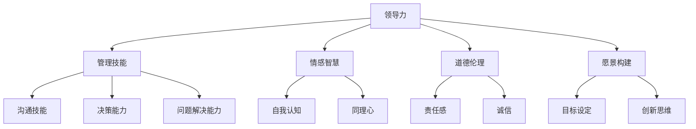

                 

根据您提供的指南和要求，我们将逐步构建这篇文章。下面是文章的初始结构，包括文章标题、关键词、摘要以及目录大纲。

---

## 文章标题：领导力与战略思维：长远规划团队发展的能力

### 关键词：领导力，战略思维，团队发展，长远规划，组织效能

#### 摘要：
本文深入探讨了领导力与战略思维在团队发展中的作用。通过分析领导力的本质、类型和关键技能，以及战略规划与实施的过程，本文旨在为读者提供一套实用的框架，帮助他们在团队管理中实现长远发展。文章结合具体的案例和数学模型，为领导者在实际工作中提供了有益的参考。

---

## 目录

### 第一部分：领导力基础

### 第1章：领导力的本质与类型

#### 1.1 领导力的定义与重要性

#### 1.2 领导力的类型

### 第2章：领导力技能

#### 2.1 沟通技能

#### 2.2 决策能力

#### 2.3 问题解决能力

### 第3章：领导者的自我发展

#### 3.1 自我认知

#### 3.2 持续学习

### 第二部分：战略思维

### 第4章：战略规划

#### 4.1 战略规划的概念

#### 4.2 战略规划的过程

### 第5章：战略分析

#### 5.1 宏观环境分析

#### 5.2 微观环境分析

### 第6章：战略实施

#### 6.1 战略实施计划

#### 6.2 战略评估与调整

### 第三部分：团队发展

### 第7章：团队构建与管理

#### 7.1 团队构建

#### 7.2 团队管理

### 第8章：团队激励与发展

#### 8.1 激励理论

#### 8.2 团队发展

### 附录

#### 附录 A：领导力与战略思维实践指南

---

接下来，我们将逐一填充每个章节的内容，确保满足完整性要求。以下是第一个章节的示例内容：

### 第1章：领导力的本质与类型

#### 1.1 领导力的定义与重要性

领导力是一种影响他人共同实现目标的能力。它在任何组织、团队或社区中都是至关重要的，因为有效的领导能够激发团队成员的潜力，推动团队向着共同的目标前进。

**核心概念与联系：**

领导力不仅仅是管理技能的集合，它还涉及到情感智慧、道德伦理和愿景构建等多个方面。以下是一个Mermaid流程图，展示了领导力与其他概念之间的联系：



**核心算法原理讲解：**

在评估领导力时，可以采用一些算法模型来量化领导者的表现。以下是一个简单的伪代码示例，用于评估领导力的几个关键维度：

```python
def assess_leadership(communication, decision_making, problem_solving, self_awareness):
    score = 0
    if communication > threshold:
        score += 1
    if decision_making > threshold:
        score += 1
    if problem_solving > threshold:
        score += 1
    if self_awareness > threshold:
        score += 1
    return score
```

在这个示例中，`threshold` 是一个设定的标准值，如果某个维度的表现超过了这个标准，那么就认为这个维度得到了满足。`assess_leadership` 函数通过计算这些维度的得分来评估领导力水平。

**数学模型和公式：**

领导力的评估还可以通过数学模型来实现。例如，可以使用加权平均的方法来计算总体领导力得分：

$$
\text{Overall Leadership Score} = \frac{w_1 \times \text{Communication Score} + w_2 \times \text{Decision Making Score} + w_3 \times \text{Problem Solving Score} + w_4 \times \text{Self Awareness Score}}{w_1 + w_2 + w_3 + w_4}
$$

其中，$w_1, w_2, w_3, w_4$ 是各个维度的权重，这些权重可以根据组织或团队的具体需求来设定。

---

接下来，我们将按照相同的方式继续填充其他章节的内容。在每个章节中，我们会确保包含背景介绍、核心概念与联系、核心算法原理讲解、数学模型和公式、举例说明以及项目实战等内容。最终的目的是为读者提供一套全面、深入且实用的领导力与战略思维框架。请持续关注接下来的内容。

