                 


### 文章标题：领导力与战略执行：从宏伟蓝图到落地实施

### 关键词：领导力、战略执行、规划、实施、框架、案例研究

### 摘要：
本文深入探讨了领导力在战略执行中的核心作用。从领导力的定义、类型，到战略执行的具体步骤和框架，本文通过逐步分析，揭示了领导力与战略执行之间的紧密联系。通过案例分析，本文展示了如何从宏伟蓝图到实际落地实施，为读者提供了实用的策略和工具。本文旨在帮助读者理解和掌握有效的领导力与战略执行方法，以实现组织的长期成功。

----------------------------------------------------------------

## 第1章 引言

### 1.1 书籍目的

#### **背景介绍**
在当今快速变化的企业环境中，有效的领导力和战略执行成为组织成功的关键因素。本书旨在为领导者提供一整套系统的理论和实践指南，帮助他们在复杂的环境中制定和执行战略，从而实现组织的长期目标。

#### **核心概念与联系**
- **领导力**：领导者的影响力、决策能力、沟通技巧和团队建设能力。
- **战略执行**：将战略规划转化为实际行动的过程。

#### **Mermaid流程图**
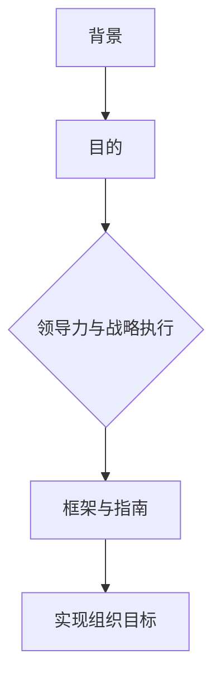

#### **核心算法原理讲解**
- **领导力模型分析**：
    ```python
    def leadership_model(behavior, context):
        if behavior == "transformational" and context == "rapid change":
            return "变革型领导"
        elif behavior == "transactional" and context == "stable environment":
            return "交易型领导"
        # 其他领导力模型...
    ```

#### **数学模型和公式**
- **战略成功率公式**：
    $$ Success\ Rate = \frac{Execution\ Effectiveness}{Planning\ Quality} $$

#### **详细讲解与举例说明**
- **举例**：在一个快速变化的市场中，采用变革型领导能够更好地适应市场变化，提高战略执行的成功率。

### 1.2 领导力与战略执行的重要性

#### **最佳实践 tips**
- **领导力发展计划**：定期进行领导力评估和培训，以提升领导者的综合素质。

## 第2章 领导力概述

### 2.1 领导力的定义与类型

#### **核心概念与联系**
- **变革型领导**：激发团队成员的潜能，推动创新和变革。
- **交易型领导**：通过明确的奖励和惩罚机制，确保团队成员按计划执行。

#### **Mermaid流程图**
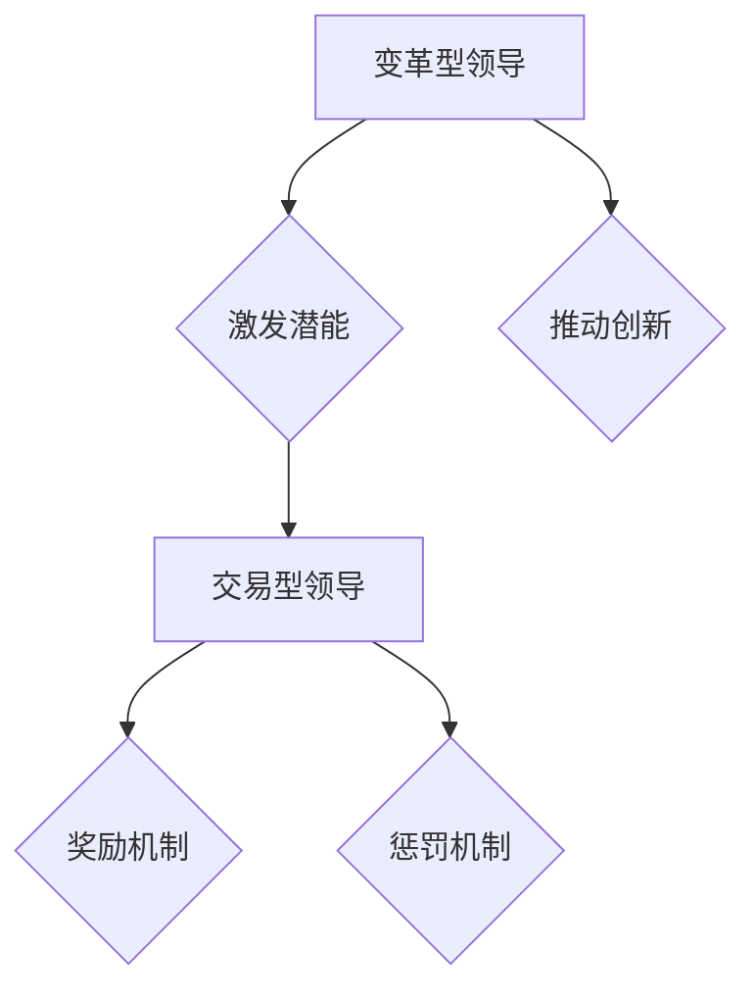

#### **伪代码**
- **领导力类型判断**：
    ```python
    def leadership_type(behavior):
        if behavior == "innovative":
            return "变革型领导"
        elif behavior == "conventional":
            return "交易型领导"
    ```

#### **数学模型和公式**
- **领导力影响力评估**：
    $$ Influence\ Score = \frac{Team\ Performance}{Individual\ Performance} $$

#### **详细讲解与举例说明**
- **举例**：在一个创新型企业中，变革型领导能够更好地激发团队的创新能力，提高整体绩效。

### 2.2 领导力模型与理论

#### **核心概念与联系**
- **领导力发展模型**：如情境领导模型、领导生命周期模型等。
- **领导力理论**：如X理论、Y理论等。

#### **Mermaid流程图**
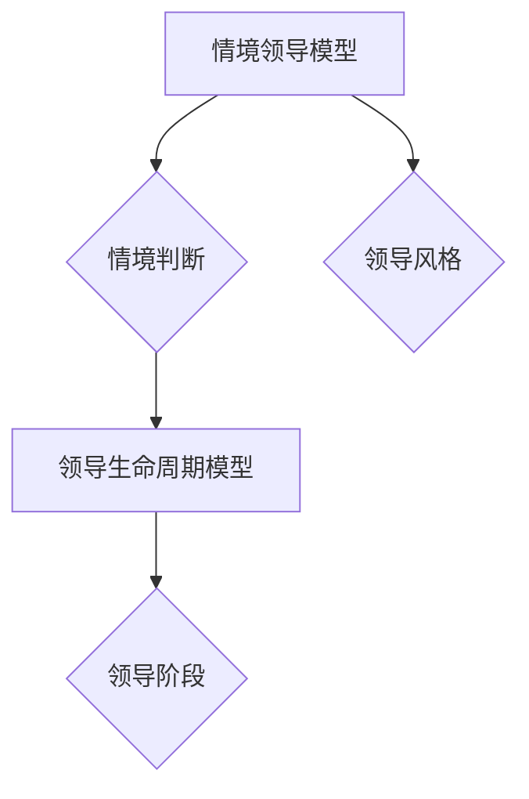

#### **伪代码**
- **领导力发展评估**：
    ```python
    def leadership_development(score):
        if score < 3:
            return "需要改进"
        elif score >= 3 and score < 5:
            return "良好"
        else:
            return "优秀"
    ```

#### **数学模型和公式**
- **领导力发展指数**：
    $$ Leadership\ Development\ Index = \frac{Current\ Score}{Target\ Score} $$

#### **详细讲解与举例说明**
- **举例**：通过定期评估和反馈，领导者可以不断提升自身的领导力水平。

## 第3章 战略执行框架

### 3.1 战略执行的步骤

#### **核心概念与联系**
- **战略规划**：制定组织的长期目标和发展路径。
- **战略执行**：将规划转化为具体的行动。

#### **Mermaid流程图**
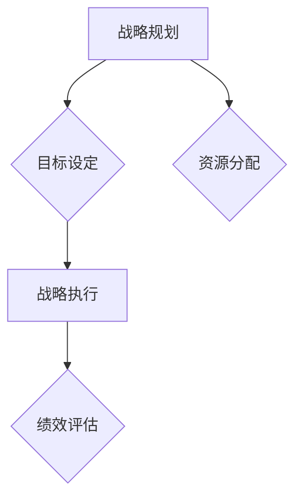

#### **伪代码**
- **战略执行流程**：
    ```python
    def strategy_execution(plan, resources):
        execute_plan(plan)
        monitor_performance(resources)
    ```

#### **数学模型和公式**
- **战略执行效率**：
    $$ Execution\ Efficiency = \frac{Actual\ Performance}{Expected\ Performance} $$

#### **详细讲解与举例说明**
- **举例**：在一个IT公司中，通过明确的目标设定和资源分配，可以提高战略执行的效率。

### 3.2 战略地图

#### **核心概念与联系**
- **战略地图**：展示战略执行的各个要素及其相互关系。
- **平衡计分卡**：用于衡量战略执行的效果。

#### **Mermaid流程图**
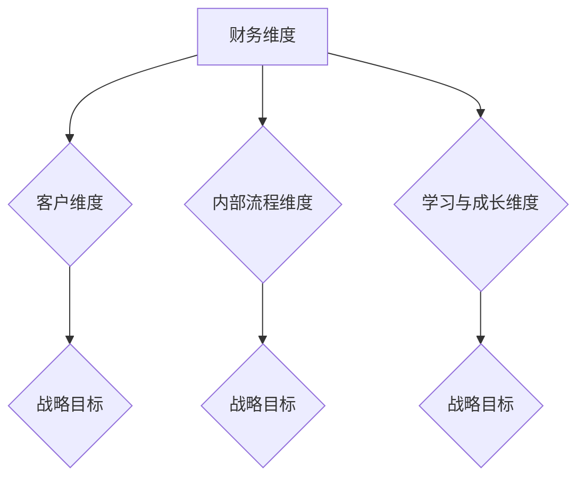

#### **数学模型和公式**
- **平衡计分卡评分**：
    $$ Score = \frac{Weighted\ Score}{Total\ Weight} $$

#### **详细讲解与举例说明**
- **举例**：通过平衡计分卡，公司可以全面衡量战略执行的效果，并据此进行调整。

## 第4章 领导力与战略执行的联系

### 4.1 领导力在战略执行中的角色

#### **核心概念与联系**
- **领导者作用**：推动战略执行，确保目标的实现。
- **领导力与战略执行的互动**：领导力影响战略执行的效果，战略执行反过来也影响领导力的发展。

#### **Mermaid流程图**
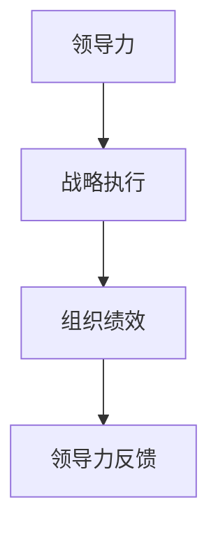

#### **伪代码**
- **领导力与战略执行的互动**：
    ```python
    def leadership_strategy_interaction(leader, strategy):
        leader_improvement = apply_strategy(leader, strategy)
        strategy_effectiveness = evaluate_strategy(leader_improvement)
    ```

#### **数学模型和公式**
- **领导力与战略执行的效果评估**：
    $$ Effectiveness\ Score = \frac{Achieved\ Objectives}{Set\ Objectives} $$

#### **详细讲解与举例说明**
- **举例**：通过有效的领导力，领导者可以推动战略执行，实现组织的长期目标。

### 4.2 战略执行中的领导力挑战

#### **核心概念与联系**
- **挑战识别**：如何识别和解决战略执行中的领导力问题。
- **领导力发展计划**：如何通过培训和指导提升领导者的能力。

#### **Mermaid流程图**
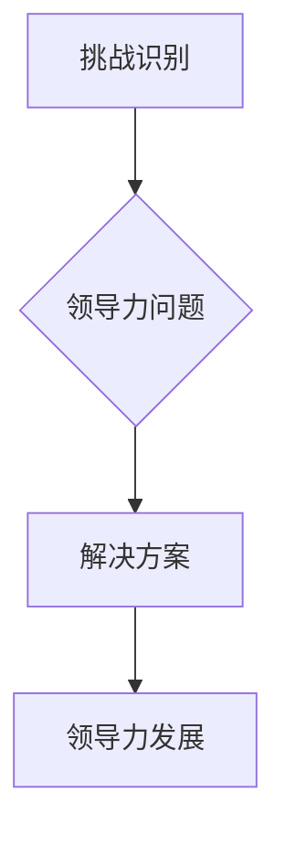

#### **伪代码**
- **领导力发展计划**：
    ```python
    def leadership_development_plan(challenges):
        identify_issues = analyze Challenges
        implement_solution = develop Leadership
        monitor_progress = evaluate Implementation
    ```

#### **数学模型和公式**
- **领导力发展指数**：
    $$ Development\ Index = \frac{Current\ Skills}{Required\ Skills} $$

#### **详细讲解与举例说明**
- **举例**：通过定期评估和反馈，公司可以识别领导力问题，并制定相应的解决方案。

## 第5章 从规划到实施

### 5.1 制定具体的实施计划

#### **核心概念与联系**
- **实施计划**：将战略规划转化为具体的行动方案。
- **关键要素**：资源、时间、预算、风险等。

#### **Mermaid流程图**
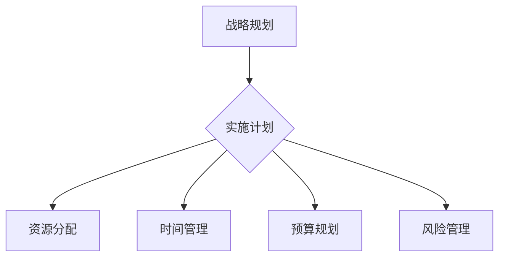

#### **伪代码**
- **实施计划制定**：
    ```python
    def create_execution_plan(strategic_plan):
        allocate_resources(strategic_plan)
        manage_time(strategic_plan)
        plan_budget(strategic_plan)
        assess_risk(strategic_plan)
    ```

#### **数学模型和公式**
- **实施效率**：
    $$ Efficiency\ Rate = \frac{Completed\ Tasks}{Total\ Tasks} $$

#### **详细讲解与举例说明**
- **举例**：通过制定详细的实施计划，公司可以更好地协调资源，提高工作效率。

### 5.2 落地实施的策略

#### **核心概念与联系**
- **调整策略**：根据实际情况调整战略。
- **执行监控**：实时监控执行情况，及时调整。

#### **Mermaid流程图**
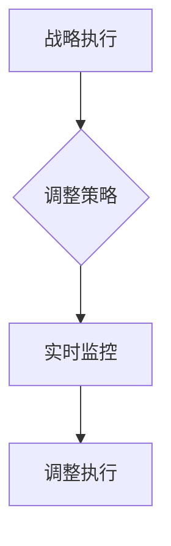

#### **伪代码**
- **执行监控与调整**：
    ```python
    def monitor_and_adjust(execution_plan):
        while execution_plan.is_ongoing():
            check_progress()
            if progress_below_threshold():
                adjust_execution_plan()
    ```

#### **数学模型和公式**
- **执行效果评估**：
    $$ Effectiveness\ Evaluation = \frac{Achieved\ Goals}{Expected\ Goals} $$

#### **详细讲解与举例说明**
- **举例**：通过实时监控和调整，公司可以确保战略执行的有效性。

## 第6章 案例研究

### 6.1 案例一：公司的成功战略执行

#### **核心概念与联系**
- **案例背景**：介绍公司的基本情况。
- **战略执行步骤**：详细描述公司如何制定和执行战略。

#### **Mermaid流程图**
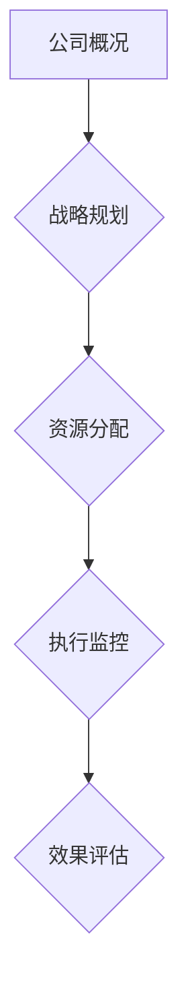

#### **伪代码**
- **战略执行流程**：
    ```python
    def execute_strategy(company):
        plan_strategy(company)
        allocate_resources(company)
        monitor_performance(company)
        evaluate_results(company)
    ```

#### **数学模型和公式**
- **战略成功率**：
    $$ Success\ Rate = \frac{Completed\ Projects}{Total\ Projects} $$

#### **详细讲解与举例说明**
- **举例**：通过详细的战略执行过程，公司实现了预期目标。

### 6.2 案例二：领导力如何影响战略执行

#### **核心概念与联系**
- **案例背景**：介绍领导力在案例中的角色。
- **领导力表现**：分析领导力如何影响战略执行。

#### **Mermaid流程图**
```mermaid
graph TD
A[领导力表现] --> B{战略执行效果}
B --> C[领导力改进]
C --> D[效果提升}
```

#### **伪代码**
- **领导力影响分析**：
    ```python
    def leadership_impact(leader, strategy):
        analyze_performance(leader)
        identify_improvements(leader)
        implement_changes(leader)
    ```

#### **数学模型和公式**
- **领导力改进效果**：
    $$ Improvement\ Score = \frac{Post-improvement\ Performance}{Pre-improvement\ Performance} $$

#### **详细讲解与举例说明**
- **举例**：通过有效的领导力，公司显著提升了战略执行的效果。

## 第7章 持续改进与学习

### 7.1 战略执行的回顾与反思

#### **核心概念与联系**
- **回顾过程**：对战略执行过程进行回顾。
- **反思内容**：分析成功和不足，总结经验教训。

#### **Mermaid流程图**
```mermaid
graph TD
A[战略执行回顾] --> B{成功经验}
A --> C{不足之处}
B --> D[经验总结]
C --> E[改进建议}
```

#### **伪代码**
- **回顾与反思流程**：
    ```python
    def review_and_reflect(execution_results):
        summarize_successes()
        identify_shortcomings()
        suggest_improvements()
    ```

#### **数学模型和公式**
- **反思效果评估**：
    $$ Reflection\ Effectiveness = \frac{Improved\ Processes}{Total\ Processes} $$

#### **详细讲解与举例说明**
- **举例**：通过回顾和反思，公司可以发现并改进执行过程中的问题。

### 7.2 持续改进的实践

#### **核心概念与联系**
- **持续改进**：通过不断调整和优化，提升战略执行效果。
- **实践方法**：介绍持续改进的具体方法和工具。

#### **Mermaid流程图**
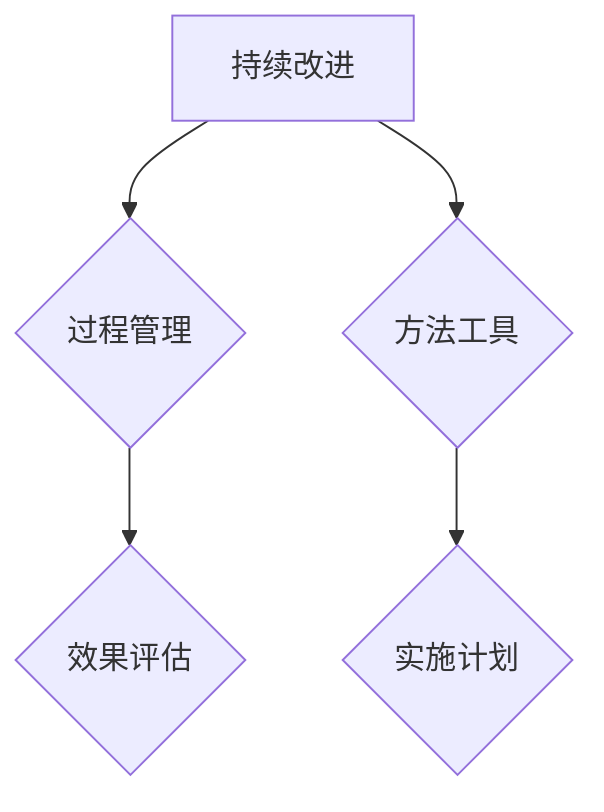

#### **伪代码**
- **持续改进流程**：
    ```python
    def continuous_improvement(execution_plan):
        manage_processes()
        use_tools()
        evaluate_effects()
        implement_changes()
    ```

#### **数学模型和公式**
- **改进效果**：
    $$ Improvement\ Rate = \frac{Current\ Efficiency}{Initial\ Efficiency} $$

#### **详细讲解与举例说明**
- **举例**：通过持续改进，公司可以不断提升战略执行的效果。

## 第8章 结论

### 8.1 领导力与战略执行的重要性

#### **总结核心观点**
- **领导力**：是推动战略执行的核心动力。
- **战略执行**：是实现组织目标的关键。

### 8.2 未来展望与建议

#### **未来趋势**
- **数字化领导**：领导者在数字时代的新角色。
- **可持续战略**：在可持续发展中的重要性。

### **最佳实践 tips**
- **定期评估**：定期评估领导力和战略执行效果。
- **持续学习**：不断学习和更新知识，以适应变化。

### **注意事项**
- **沟通**：确保有效的沟通，以减少误解和冲突。
- **灵活性**：保持灵活性，以适应不确定性的挑战。

### **拓展阅读**
- **推荐书籍**：《领导力与战略管理》、《变革型领导力》等。
- **在线资源**：相关的在线课程和论坛。

## 附录

### 附录 A：领导力与战略执行工具箱

#### **工具介绍**
- **SWOT分析**：用于评估组织的优势、劣势、机会和威胁。
- **5W2H方法**：用于详细规划实施计划。

### 附录 B：推荐阅读与进一步学习资源

#### **书籍推荐**
- **《领导力与战略管理》**：全面介绍领导力和战略管理的基本概念和实践。
- **《变革型领导力》**：深入探讨变革型领导力在组织变革中的应用。

#### **在线资源**
- **在线课程**：Coursera、edX等平台上的领导力和战略管理课程。
- **论坛和社区**：如LinkedIn、Reddit等平台上的领导力专业社区。

**作者：AI天才研究院/AI Genius Institute & 禅与计算机程序设计艺术 /Zen And The Art of Computer Programming**

