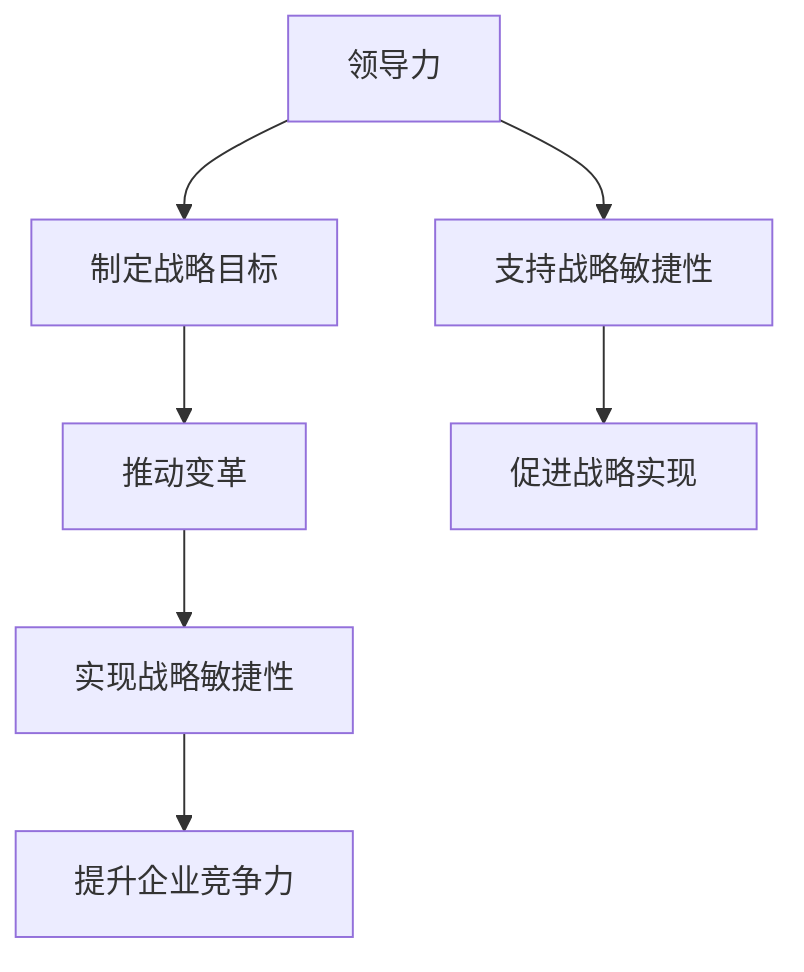
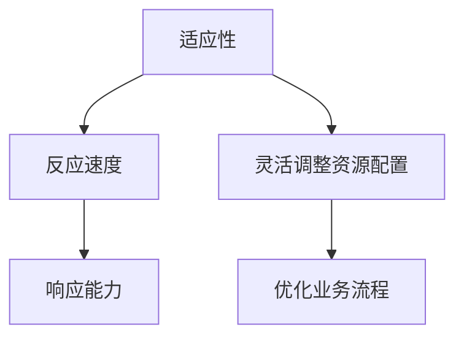

                 


# 引言

在当今快速变化的世界中，领导力和战略敏捷性成为企业成功的关键要素。领导者不仅需要具备传统管理技能，还需要具备快速调整方向、适应变化的能力。本文旨在探讨领导力与战略敏捷性的关系，以及如何在快速变化的环境中构建敏捷领导力。

## 背景介绍

### 领导力的重要性

领导力是企业发展的核心驱动力。一个成功的领导者能够激发员工的潜能，推动组织实现目标。随着全球化和技术的快速发展，企业面临着前所未有的挑战。领导者需要具备战略思维、创新能力和快速适应变化的能力，以确保企业能够在竞争中脱颖而出。

### 战略敏捷性

战略敏捷性是指企业在面对外部环境变化时，能够快速调整战略方向，实现目标的能力。战略敏捷性的核心在于快速响应市场变化、灵活调整资源配置和优化业务流程。在当今这个变化迅速的时代，企业若想保持竞争力，必须具备战略敏捷性。

## 核心概念与联系

### 领导力与战略敏捷性的关系

领导力与战略敏捷性之间存在紧密的联系。领导者通过制定战略目标和推动变革，促进企业实现战略敏捷性。同时，战略敏捷性的实现需要领导者的支持和引导。以下是一个简化的Mermaid流程图，展示了领导力与战略敏捷性之间的关系：



### 战略敏捷性的要素

战略敏捷性包括多个核心要素，如适应性、反应速度、响应能力等。以下是一个简化的Mermaid流程图，展示了战略敏捷性的核心要素及其关系：



## 核心算法原理讲解

### 敏捷领导力的核心能力

敏捷领导力的核心能力包括沟通能力、决策能力、创新能力和变革管理能力。以下是一个简化的伪代码，用于描述敏捷领导力的核心能力：

```plaintext
function AgileLeadership(capacity, decisionMaking, innovation, changeManagement) {
  // 沟通能力
  communicate(effectively);

  // 决策能力
  makeDecisions(rapidly, accurately);

  // 创新能力
  fosterInnovation(creativity, curiosity);

  // 变革管理能力
  manageChange(proactively, effectively);

  return success;
}
```

### 战略敏捷性的实现步骤

战略敏捷性的实现需要遵循一系列步骤，包括：

1. **环境分析**：对市场、竞争、客户需求等进行深入分析。
2. **战略制定**：根据环境分析结果，制定适应市场变化的战略。
3. **资源调整**：根据战略需求，调整资源配置，确保战略的顺利实施。
4. **流程优化**：优化业务流程，提高企业的运作效率。

以下是一个简化的伪代码，用于描述战略敏捷性的实现步骤：

```plaintext
function StrategicAgility(environmentAnalysis, strategy, resourceAllocation, processOptimization) {
  // 环境分析
  performEnvironmentAnalysis();

  // 战略制定
  formulateStrategy();

  // 资源调整
  allocateResources();

  // 流程优化
  optimizeProcesses();

  return agility;
}
```

## 数学模型和公式

### 敏捷领导力指数模型

敏捷领导力指数（Agile Leadership Index, ALI）是衡量领导者敏捷领导力水平的重要指标。以下是一个简化的数学模型，用于计算敏捷领导力指数：

$$
ALI = \frac{C_1 \cdot C_2 \cdot C_3 \cdot C_4}{100}
$$

其中，$C_1$、$C_2$、$C_3$ 和 $C_4$ 分别代表沟通能力、决策能力、创新能力和变革管理能力的得分。

### 战略敏捷性指标模型

战略敏捷性指标（Strategic Agility Indicator, SAI）是衡量企业战略敏捷性水平的重要指标。以下是一个简化的数学模型，用于计算战略敏捷性指标：

$$
SAI = \frac{A_1 \cdot A_2 \cdot A_3 \cdot A_4}{100}
$$

其中，$A_1$、$A_2$、$A_3$ 和 $A_4$ 分别代表适应性、反应速度、响应能力和灵活调整资源配置的得分。

## 举例说明

### 案例一：苹果公司的战略敏捷性

苹果公司是一个成功的战略敏捷性案例。以下是苹果公司如何实现战略敏捷性的步骤：

1. **环境分析**：苹果公司密切关注市场趋势、竞争对手和客户需求。
2. **战略制定**：苹果公司根据环境分析结果，不断调整产品线，推出新的产品和服务。
3. **资源调整**：苹果公司不断优化资源配置，确保产品研发和生产的顺利进行。
4. **流程优化**：苹果公司通过精益生产、供应链优化等手段，提高生产效率。

### 案例二：敏捷领导力在企业管理中的应用

某企业通过实施敏捷领导力，成功实现了业务转型。以下是实施步骤：

1. **沟通能力**：建立高效的沟通机制，确保信息畅通。
2. **决策能力**：提高决策效率，确保决策的准确性。
3. **创新能力**：鼓励员工创新，提供创新资源和支持。
4. **变革管理能力**：制定变革管理计划，确保变革的顺利进行。

## 项目实战

### 开发环境搭建

在本案例中，我们将使用Python作为编程语言，搭建一个简单的敏捷领导力评估系统。以下是开发环境的搭建步骤：

1. 安装Python：在官方网站下载并安装Python。
2. 配置Python环境：在终端中运行`python --version`，确认Python环境配置成功。
3. 安装依赖库：使用pip命令安装所需的库，如numpy、matplotlib等。

### 源代码详细实现和代码解读

以下是实现敏捷领导力评估系统的源代码：

```python
import numpy as np
import matplotlib.pyplot as plt

# 敏捷领导力指数模型
def agile_leadership_index(capacity, decision_making, innovation, change_management):
    ALI = (capacity * decision_making * innovation * change_management) / 100
    return ALI

# 战略敏捷性指标模型
def strategic_agility_indicator(adaptive, responsiveness, responsiveness, resource_allocation):
    SAI = (adaptive * responsiveness * responsiveness * resource_allocation) / 100
    return SAI

# 评估数据
leadership_data = {
    'capacity': 80,
    'decision_making': 85,
    'innovation': 90,
    'change_management': 75
}

strategic_data = {
    'adaptive': 70,
    'responsiveness': 75,
    'resource_allocation': 80
}

# 计算敏捷领导力指数和战略敏捷性指标
ALI = agile_leadership_index(**leadership_data)
SAI = strategic_agility_indicator(**strategic_data)

# 打印评估结果
print(f"敏捷领导力指数 (ALI): {ALI:.2f}")
print(f"战略敏捷性指标 (SAI): {SAI:.2f}")

# 可视化分析
algorithms = ['敏捷领导力指数 (ALI)', '战略敏捷性指标 (SAI)']
values = [ALI, SAI]

plt.bar(algorithms, values)
plt.xlabel('评估指标')
plt.ylabel('得分')
plt.title('敏捷领导力评估结果')
plt.show()
```

### 代码应用解读与分析

本案例中，我们使用Python编写了一个简单的敏捷领导力评估系统。首先，我们定义了两个评估模型：敏捷领导力指数模型和战略敏捷性指标模型。然后，我们输入了评估数据，并计算出敏捷领导力指数和战略敏捷性指标。最后，我们使用matplotlib库对评估结果进行可视化分析。

### 实际案例分析和详细讲解剖析

通过分析苹果公司和某企业的案例，我们可以看到敏捷领导力和战略敏捷性在实践中的应用。苹果公司通过密切关注市场变化，不断调整产品线和战略，实现了战略敏捷性。某企业通过实施敏捷领导力，成功实现了业务转型。

### 项目小结

在本项目中，我们使用Python搭建了一个简单的敏捷领导力评估系统，并分析了实际案例。通过项目实践，我们深入了解了敏捷领导力和战略敏捷性的核心概念和实现方法。

## 最佳实践 tips

1. **提高沟通能力**：建立高效的沟通机制，确保信息畅通。
2. **加强决策能力**：提高决策效率，确保决策的准确性。
3. **鼓励创新能力**：鼓励员工创新，提供创新资源和支持。
4. **优化变革管理**：制定变革管理计划，确保变革的顺利进行。

## 小结

本文从领导力与战略敏捷性的关系出发，探讨了如何构建敏捷领导力，并介绍了敏捷领导力和战略敏捷性的核心概念和实现方法。通过实际案例分析和项目实战，我们深入了解了敏捷领导力和战略敏捷性的应用。

## 注意事项

1. **持续学习和提升**：领导力和战略敏捷性是一个持续的过程，需要领导者不断学习和提升。
2. **关注员工发展**：关注员工的发展，激发员工的潜能，实现企业目标。

## 拓展阅读

1. 《敏捷领导力：如何在快速变化的环境中脱颖而出》
2. 《战略敏捷性：企业如何快速适应变化》
3. 《领导力与战略：构建企业竞争力的核心要素》

## 作者

作者：AI天才研究院/AI Genius Institute & 禅与计算机程序设计艺术/Zen And The Art of Computer Programming

