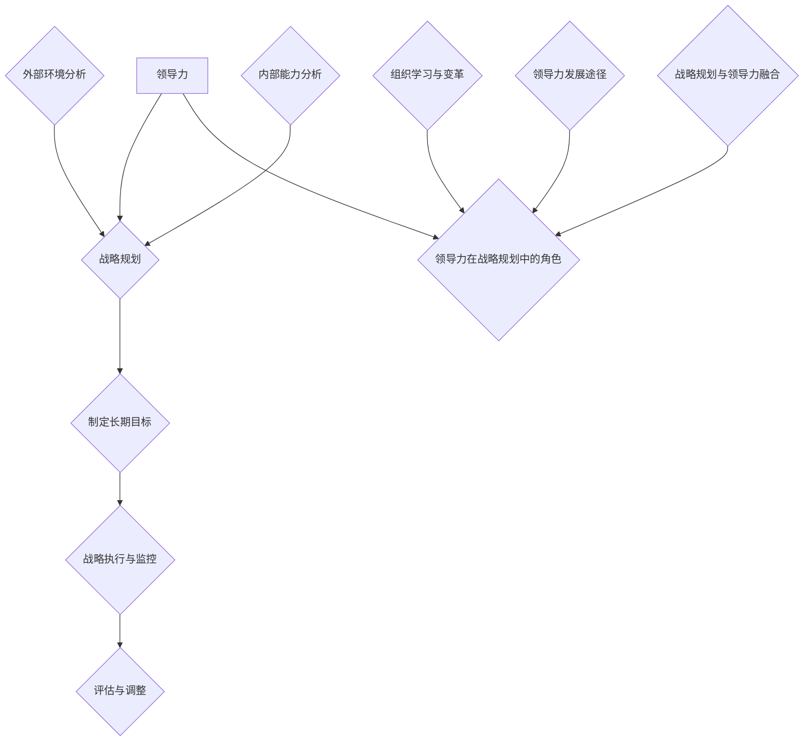

                 


### 文章标题
《领导力与战略规划：制定并执行长期目标》

### 关键词
领导力、战略规划、长期目标、组织管理、执行力

### 摘要
本文将深入探讨领导力与战略规划之间的密切关系，通过阐述核心概念、详细讲解算法原理和数学模型，以及提供实际项目案例，帮助读者理解和掌握如何制定并执行长期目标，以实现组织的持续成功。

### 目录

#### 第一部分：领导力基础

##### 第1章：领导力的定义与类型
- **1.1 领导力的定义与重要性**
  - 领导力的基本概念
  - 领导力的重要性
- **1.2 领导力的类型**
  - 权威型领导
  - 参与型领导
  - 脚手架型领导
  - 情境型领导
- **1.3 领导力与管理的区别**
  - 管理的定义与作用
  - 领导力与管理的联系与区别

##### 第2章：战略规划原理
- **2.1 战略规划的概念与框架**
  - 战略规划的定义
  - 战略规划的框架
- **2.2 外部环境分析**
  - PEST分析
  - SWOT分析
- **2.3 内部能力分析**
  - 资源评估
  - 能力分析

#### 第二部分：战略规划实践

##### 第3章：制定长期目标
- **3.1 长期目标的设定**
  - 长期目标的重要性
  - 设定长期目标的步骤
- **3.2 长期目标的量化**
  - 量化长期目标的方法
  - 目标设置的SMART原则

##### 第4章：战略执行与监控
- **4.1 战略执行的关键因素**
  - 资源配置
  - 风险管理
- **4.2 战略执行的步骤**
  - 制定实施计划
  - 分配任务
  - 监控进度
- **4.3 战略执行的评估与调整**
  - 评估执行效果
  - 调整战略方向

##### 第5章：领导力在战略规划中的作用
- **5.1 领导力在战略规划中的角色**
  - 领导者的角色定位
  - 领导者在战略规划中的作用
- **5.2 领导力与战略执行的关系**
  - 领导力对战略执行的影响
  - 战略执行对领导力的要求

##### 第6章：案例研究
- **6.1 某跨国公司的战略规划与执行**
  - 案例背景
  - 战略规划过程
  - 战略执行效果
- **6.2 某初创企业的成长战略**
  - 企业发展现状
  - 战略规划
  - 战略执行

#### 第三部分：战略规划与领导力的持续发展

##### 第7章：战略规划与领导力的持续发展
- **7.1 组织学习与变革**
  - 组织学习的概念与作用
  - 变革管理与战略规划
- **7.2 领导力发展的途径**
  - 领导力发展的方法论
  - 领导力发展的实践
- **7.3 战略规划与领导力的融合**
  - 战略规划与领导力的相互作用
  - 实现战略规划与领导力融合的方法

### 附录
- **附录A：战略规划工具与方法**
  - SWOT分析
  - PEST分析
  - 波士顿矩阵

### 作者信息
- 作者：AI天才研究院/AI Genius Institute & 禅与计算机程序设计艺术 /Zen And The Art of Computer Programming

---

# 《领导力与战略规划：制定并执行长期目标》

## 前言

在现代企业的竞争环境中，领导力与战略规划成为组织成功的关键因素。有效的领导力能够激发团队的潜力，而科学的战略规划则为组织提供了明确的未来方向。本文旨在深入探讨领导力与战略规划之间的互动关系，并通过实际案例和分析，帮助读者掌握制定并执行长期目标的技巧，以实现组织的长远发展。

领导力不仅关乎个人魅力，更涉及到如何激发团队共同为实现组织目标而努力。战略规划则是对组织未来发展的前瞻性思考，通过对外部环境的分析和内部能力的评估，制定出切实可行的长期目标。本文将分为三个部分，分别介绍领导力的基本概念与类型、战略规划原理与实践，以及领导力与战略规划的持续发展。希望通过本文的阐述，读者能够对领导力与战略规划有更加深入的理解，并能够在实际工作中运用这些理论，推动组织的成功。

## 第一部分：领导力基础

### 第1章：领导力的定义与类型

#### 1.1 领导力的定义与重要性

领导力是一种影响他人、推动团队朝共同目标前进的能力。它不仅仅是职位赋予的权力，更是通过影响力、魅力和沟通技巧来引导和激励团队成员的一种能力。在组织管理中，领导力起着至关重要的作用。

首先，领导力能够激发团队成员的潜力。一个有能力的领导者能够看到每个人的长处，并帮助他们充分发挥自己的才能。通过激励和鼓励，领导者能够激发团队成员的工作热情和创造力，从而提升团队的整体绩效。

其次，领导力是组织变革的重要推动力。在面对外部市场变化和内部结构调整时，领导力能够帮助组织快速适应并找到新的发展方向。领导者通过明确目标、制定策略和调动资源，带领团队克服困难，实现变革。

最后，领导力对于个人职业发展也至关重要。具备领导力的人能够在职场中脱颖而出，获得更多的机会和挑战。领导力不仅是管理岗位的必备技能，也是任何职业成功的关键要素。

#### 1.2 领导力的类型

领导力的类型多种多样，不同的领导力风格适用于不同的环境和情境。以下是几种常见的领导力类型：

**权威型领导**：权威型领导者通过明确的指令和严格的纪律来管理团队。他们擅长在紧急情况下快速做出决策，但过度依赖权威可能会导致团队创造力受限。

**参与型领导**：参与型领导者鼓励团队成员参与决策过程，注重团队合作和沟通。这种领导风格能够增强团队成员的归属感和责任感，但决策速度可能会因此变慢。

**脚手架型领导**：脚手架型领导者为团队成员提供必要的支持和资源，帮助他们克服困难。他们在团队成员需要帮助时介入，而在他们独立工作时则保持一定的距离。

**情境型领导**：情境型领导者根据不同情境和团队成员的特点，灵活调整自己的领导风格。这种领导风格能够适应多变的环境，但领导者需要具备很高的适应能力和洞察力。

#### 1.3 领导力与管理的区别

管理是组织运作的基本职能，包括计划、组织、协调、控制和监督等活动。管理关注的是如何有效地分配资源、控制成本和确保目标实现。

领导力则更侧重于激励和引导团队成员，推动组织变革和创新。领导力与管理虽然密切相关，但二者有着明显的区别。

首先，管理是维持组织稳定和高效运作的过程，而领导力则是推动组织变革和实现长远目标的关键因素。

其次，管理侧重于技术层面的操作，而领导力则侧重于人的管理和激励。有效的领导力能够激发团队成员的潜力，实现组织的长远发展。

最后，管理的目标是实现组织的目标和任务，而领导力的目标是建立团队的共同愿景和价值观，推动组织的持续发展。

## 第2章：战略规划原理

#### 2.1 战略规划的概念与框架

战略规划是指组织在较长时期内，通过对外部环境和内部能力的全面分析，制定出清晰的发展方向和实现目标的策略。它是组织管理的重要组成部分，关系到组织的长远发展和竞争力。

战略规划的基本框架包括以下几个关键步骤：

1. **明确组织愿景和使命**：组织愿景和使命是战略规划的基础，它们定义了组织的长远目标和核心价值观。通过明确愿景和使命，组织能够更好地确定战略方向和行动目标。

2. **外部环境分析**：外部环境分析主要包括PEST分析和SWOT分析。PEST分析考察政治、经济、社会和技术等宏观因素，了解外部环境对组织发展的影响。SWOT分析则评估组织的优势、劣势、机会和威胁，确定组织在市场中的地位和潜在风险。

3. **内部能力分析**：内部能力分析关注组织的资源、能力和核心竞争力。通过评估组织的内部资源，确定组织的优势和劣势，为战略规划提供数据支持。

4. **制定战略目标**：在分析外部环境和内部能力的基础上，制定具体的战略目标。这些目标应具有可衡量性、可实现性和时间限制，以便组织能够有效执行和监控。

5. **制定战略实施计划**：战略实施计划是将战略目标转化为具体行动的步骤和措施。它包括资源配置、任务分配、时间表和监控机制等，确保组织能够按计划实现战略目标。

6. **评估与调整**：在战略执行过程中，定期评估战略目标和实施计划的执行情况，并根据实际情况进行调整。这有助于组织及时发现并解决问题，确保战略目标的实现。

#### 2.2 外部环境分析

外部环境分析是战略规划的重要环节，它帮助组织了解外部环境的变化和趋势，为制定战略目标提供依据。以下是两种常用的外部环境分析方法：

**PEST分析**：PEST分析考察政治（Political）、经济（Economic）、社会（Social）和技术（Technological）等宏观因素，了解它们对组织发展的影响。

- **政治因素**：包括政府政策、法规变化、国际关系等。
- **经济因素**：包括经济增长率、通货膨胀率、利率等。
- **社会因素**：包括人口结构、文化价值观、消费者行为等。
- **技术因素**：包括技术创新、技术发展趋势等。

**SWOT分析**：SWOT分析评估组织的优势（Strengths）、劣势（Weaknesses）、机会（Opportunities）和威胁（Threats），确定组织在市场中的地位和潜在风险。

- **优势**：组织在资源、能力、市场地位等方面的优势。
- **劣势**：组织在资源、能力、市场地位等方面的劣势。
- **机会**：外部环境中可能出现的机遇。
- **威胁**：外部环境中可能出现的威胁。

#### 2.3 内部能力分析

内部能力分析是战略规划的另一个关键环节，它关注组织的资源、能力和核心竞争力，为制定战略目标提供支持。以下是内部能力分析的主要内容：

**资源评估**：资源评估包括人力资源、财务资源、技术资源和物质资源等。通过评估组织的资源，确定资源的充足程度和利用效率。

- **人力资源**：组织内部的人才结构、技能水平、员工满意度等。
- **财务资源**：组织的财务状况、资金来源、成本结构等。
- **技术资源**：组织的核心技术、研发能力、技术创新速度等。
- **物质资源**：组织的设备、设施、原材料等。

**能力分析**：能力分析包括组织的核心竞争力、业务流程、管理水平和运营效率等。通过分析组织的能力，确定组织在市场中的竞争地位和潜在优势。

- **核心竞争力**：组织在长期竞争中的独特优势。
- **业务流程**：组织的运营和管理流程。
- **管理水平**：组织的领导层、管理团队的能力和经验。
- **运营效率**：组织的生产效率、服务质量等。

## 第二部分：战略规划实践

### 第3章：制定长期目标

#### 3.1 长期目标的设定

长期目标是组织在较长时期内追求的最终目标，它为组织提供了明确的未来方向和动力。制定长期目标的过程需要遵循以下步骤：

1. **明确组织愿景和使命**：组织愿景和使命是制定长期目标的基础。只有明确了组织的长远目标和核心价值观，才能制定出符合组织发展的长期目标。

2. **分析外部环境和内部能力**：通过外部环境和内部能力的分析，了解组织在市场中的地位和潜在风险，为制定长期目标提供依据。

3. **制定长期目标**：在分析的基础上，制定具体的长期目标。这些目标应具有可衡量性、可实现性和时间限制，以便组织能够有效执行和监控。

4. **目标分解**：将长期目标分解为具体的子目标和实施计划，确保每个目标都有明确的实现路径和时间表。

5. **沟通与共识**：将长期目标传达给所有相关利益者，确保他们对目标有清晰的认识，并形成共识。

#### 3.2 长期目标的量化

量化长期目标是将目标具体化、可衡量的过程，它有助于组织更好地监控和评估目标的实现情况。以下是量化长期目标的几种方法：

1. **关键绩效指标（KPI）**：关键绩效指标是衡量目标实现情况的重要指标。通过设定具体的KPI，组织能够更加清晰地了解目标实现的进度和效果。

2. **目标与时间表**：将长期目标与具体的时间表相结合，明确每个阶段的目标和实现时间。这有助于组织制定合理的实施计划，确保目标按时完成。

3. **量化目标**：将长期目标具体化为可量化的指标，如销售额、市场份额、研发成果等。这有助于组织更加精确地衡量目标的实现情况。

4. **SMART原则**：SMART原则是一种常用的目标设定方法，它要求目标具有具体性（Specific）、可衡量性（Measurable）、可实现性（Achievable）、相关性（Relevant）和时限性（Time-bound）。

- **具体性**：目标应明确具体，避免模糊不清。
- **可衡量性**：目标应具有可衡量的指标，以便评估实现情况。
- **可实现性**：目标应具有可实现性，避免过于理想化。
- **相关性**：目标应与组织的整体战略和目标相关联。
- **时限性**：目标应具有明确的时间限制，确保组织能够按计划实现。

### 第4章：战略执行与监控

#### 4.1 战略执行的关键因素

战略执行是将战略目标转化为实际行动的过程，它关系到组织目标的实现。以下是战略执行的关键因素：

1. **资源配置**：资源是战略执行的基础，包括人力资源、财务资源和技术资源等。有效的资源配置能够确保组织拥有足够的资源支持战略目标的实现。

2. **风险管理**：在战略执行过程中，风险是不可避免的。有效的风险管理能够帮助组织识别、评估和控制潜在风险，确保战略目标的顺利实现。

3. **组织文化**：组织文化是战略执行的重要支撑。一个积极向上的组织文化能够激发团队成员的积极性，推动战略目标的实现。

4. **领导力**：领导力在战略执行中起着至关重要的作用。有效的领导力能够激发团队成员的潜力，推动战略目标的实现。

#### 4.2 战略执行的步骤

战略执行的步骤包括以下几个关键环节：

1. **制定实施计划**：在明确战略目标后，制定具体的实施计划。实施计划应包括任务分解、资源配置、时间表和监控机制等。

2. **任务分配**：将实施计划分解为具体的任务，并分配给相关团队和成员。明确的任务分配有助于确保每个任务都有明确的负责人。

3. **执行与监控**：在战略执行过程中，定期监控任务执行情况，确保任务按时完成。通过监控机制，组织能够及时发现并解决问题，确保战略目标的实现。

4. **评估与反馈**：在战略执行完成后，对执行效果进行评估，并根据评估结果进行反馈和调整。这有助于组织总结经验，改进战略执行过程。

#### 4.3 战略执行的评估与调整

战略执行的评估与调整是确保战略目标实现的重要环节。以下是评估与调整的关键步骤：

1. **评估指标**：设定具体的评估指标，如销售额、市场份额、客户满意度等，以便评估战略目标的实现情况。

2. **数据收集**：收集战略执行过程中的相关数据，包括任务完成情况、资源利用情况、风险控制情况等。

3. **评估分析**：对收集到的数据进行分析，评估战略目标的实现情况。通过评估分析，组织能够了解战略执行的成效和存在的问题。

4. **调整与改进**：根据评估分析的结果，对战略执行进行必要的调整和改进。这有助于组织优化战略执行过程，提高战略目标的实现效果。

### 第5章：领导力在战略规划中的作用

#### 5.1 领导力在战略规划中的角色

领导力在战略规划中起着至关重要的角色。有效的领导力能够确保战略规划的顺利制定和执行，实现组织的长远发展。以下是领导力在战略规划中的几个关键角色：

1. **愿景引导者**：领导者需要明确组织的愿景和使命，为组织提供清晰的方向。通过设定远大的目标，领导者能够激发团队成员的积极性，推动战略规划的制定。

2. **策略制定者**：领导者需要参与战略规划的制定，提供宝贵的见解和经验。通过深入分析外部环境和内部能力，领导者能够制定出切实可行的战略目标。

3. **资源协调者**：领导者需要协调组织内部的资源，确保资源能够有效支持战略目标的实现。通过合理配置人力资源、财务资源和技术资源，领导者能够为战略执行提供有力保障。

4. **变革推动者**：在战略规划实施过程中，领导者需要推动组织的变革，帮助组织克服变革中的困难和阻力。通过积极沟通和激励，领导者能够激发团队成员的变革动力，实现组织的持续发展。

#### 5.2 领导力与战略执行的关系

领导力与战略执行之间存在着密切的关系。有效的领导力能够推动战略执行，实现组织的战略目标。以下是领导力与战略执行之间的几个关键联系：

1. **目标一致性**：领导力能够确保战略执行的目标与组织的整体目标保持一致。通过明确目标、传递价值观和建立共同愿景，领导者能够确保团队成员共同为实现战略目标而努力。

2. **执行力**：领导力是战略执行的核心。一个有执行力的领导者能够推动团队高效地完成任务，确保战略目标的实现。通过制定详细的实施计划、分配任务和监控进度，领导者能够确保战略执行的有效性。

3. **团队协作**：领导力能够激发团队协作，推动团队成员共同为实现战略目标而努力。通过建立积极向上的团队文化、增强团队成员之间的沟通和合作，领导者能够提高团队的执行效率和创新能力。

4. **问题解决**：在战略执行过程中，领导者需要具备解决问题和应对挑战的能力。通过及时识别问题、制定解决方案和调整战略执行计划，领导者能够确保战略目标的顺利实现。

### 第6章：案例研究

#### 6.1 某跨国公司的战略规划与执行

**案例背景**：某跨国公司是一家在全球范围内运营的科技公司，其业务涉及多个领域，包括硬件、软件和服务。随着市场竞争的加剧，公司面临巨大的挑战和压力，需要制定有效的战略规划以保持竞争优势。

**战略规划过程**：
1. **明确愿景和使命**：公司确定了“成为全球领先的科技公司”的愿景，并明确了“通过创新和技术推动社会进步”的使命。
2. **外部环境分析**：通过PEST分析和SWOT分析，公司评估了外部环境的变化和自身的优势与劣势，确定了市场竞争的激烈程度、技术创新的趋势以及行业发展的方向。
3. **内部能力分析**：公司对内部资源、能力和核心竞争力进行了全面评估，确定了在技术创新、市场拓展和客户服务方面的优势，同时也发现了在研发投入和管理效率方面的不足。
4. **制定战略目标**：在分析的基础上，公司制定了长期目标，包括市场份额的扩大、技术创新的持续投入、客户满意度的提升等。
5. **制定实施计划**：公司制定了详细的实施计划，包括资源配置、任务分配、时间表和监控机制等。

**战略执行效果**：
1. **资源配置**：公司加大了研发投入，提高了技术水平，增强了核心竞争力。
2. **风险管理**：公司通过建立风险管理系统，有效识别和控制了市场风险和技术风险。
3. **组织文化**：公司积极推动变革，建立了以创新为核心的企业文化，提高了员工的创造力和团队合作精神。
4. **领导力**：公司领导层积极参与战略执行，为团队成员提供了明确的方向和支持，确保了战略目标的实现。

#### 6.2 某初创企业的成长战略

**案例背景**：某初创企业是一家专注于智能家居设备研发的公司。在创立初期，公司面临着市场认知度低、资金短缺和竞争压力等挑战。

**战略规划**：
1. **明确愿景和使命**：公司确定了“打造智能家居生态圈”的愿景，并明确了“为客户提供便捷、智能、环保的生活体验”的使命。
2. **外部环境分析**：公司通过PEST分析和SWOT分析，评估了智能家居市场的趋势和竞争环境，确定了市场需求和潜在客户。
3. **内部能力分析**：公司评估了自身的研发能力、市场推广能力和管理团队的能力，确定了在技术领先和客户服务方面的优势。
4. **制定战略目标**：公司制定了长期目标，包括市场占有率的提升、产品线的拓展和品牌知名度的提高。
5. **制定实施计划**：公司制定了详细的实施计划，包括市场推广策略、产品研发计划和资源管理策略。

**战略执行**：
1. **市场推广**：公司通过线上线下多种渠道推广产品，提高了市场认知度和客户满意度。
2. **产品研发**：公司持续投入研发资源，不断创新产品功能，提升产品质量。
3. **团队建设**：公司注重人才培养和团队建设，提高了团队的整体素质和工作效率。
4. **领导力**：公司领导层积极参与战略执行，为团队成员提供了明确的方向和支持，确保了战略目标的实现。

### 第7章：战略规划与领导力的持续发展

#### 7.1 组织学习与变革

**组织学习**：组织学习是组织持续发展和创新能力提升的重要途径。通过不断学习，组织能够适应外部环境的变化，保持竞争力。

**变革管理**：变革管理是组织在面对外部环境变化和内部发展需要时进行有效变革的过程。通过有效的变革管理，组织能够顺利实现战略目标。

#### 7.2 领导力发展的途径

**领导力发展**：领导力发展是组织持续发展的重要保障。通过领导力发展，组织能够培养出具备领导力的人才，推动组织的长远发展。

**领导力发展的方法**：领导力发展的方法包括培训、实践、反馈和评估等。通过多种方法的结合，组织能够全面提升领导力水平。

#### 7.3 战略规划与领导力的融合

**战略规划与领导力的融合**：战略规划与领导力的融合是组织实现长远发展的关键。通过融合战略规划和领导力，组织能够确保战略目标的实现。

**融合的方法**：融合的方法包括领导力培训、战略规划与执行相结合、建立领导力评估体系等。通过多种方法的结合，组织能够实现战略规划与领导力的有机融合。

## 附录

### 附录A：战略规划工具与方法

**SWOT分析**：SWOT分析是战略规划中常用的工具，用于评估组织的优势、劣势、机会和威胁。

**PEST分析**：PEST分析用于分析外部环境，包括政治、经济、社会和技术等因素。

**波士顿矩阵**：波士顿矩阵用于分析产品在市场中的竞争地位，确定产品的战略方向。

### 结语

本文通过深入探讨领导力与战略规划之间的关系，为读者提供了制定并执行长期目标的理论和实践指导。有效的领导力能够激发团队的潜力，推动组织的变革和发展；科学的战略规划则为组织提供了明确的未来方向和行动指南。希望读者能够结合实际工作，运用本文中的理论和案例，不断提升自身的领导力和战略规划能力，推动组织的持续成功。

### 作者信息

- 作者：AI天才研究院/AI Genius Institute & 禅与计算机程序设计艺术 /Zen And The Art of Computer Programming

---

## 核心概念与联系架构 Mermaid 流程图



## 核心算法原理讲解

为了更好地理解领导力与战略规划之间的算法原理，我们可以从以下几个步骤进行讲解：

### 1. 领导力模型

领导力的核心算法可以描述为以下伪代码：

```plaintext
领导力模型(目标, 团队成员):
    初始化影响力, 激励因子
    对团队成员进行评估
        如果 成员技能符合目标需求:
            影响力 += 成员技能贡献
            激励因子 += 成员积极性
        否则:
            影响力 -= 成员技能差距
            激励因子 -= 成员消极性
    计算领导力得分
        领导力得分 = 影响力 * 激励因子
    返回领导力得分
```

### 2. 战略规划模型

战略规划的核心算法可以描述为以下伪代码：

```plaintext
战略规划模型(外部环境, 内部能力, 领导力):
    分析外部环境
    分析内部能力
    评估领导力
    设定长期目标
    分解长期目标为短期目标
    制定实施计划
    返回战略规划结果
```

### 3. 战略执行模型

战略执行的核心算法可以描述为以下伪代码：

```plaintext
战略执行模型(战略规划, 资源配置, 风险管理):
    根据实施计划分配资源
    监控执行进度
    管理风险
    评估执行效果
    调整实施计划
    返回执行结果
```

### 4. 领导力与战略执行的关系模型

领导力与战略执行的关系可以描述为以下伪代码：

```plaintext
关系模型(领导力, 战略执行):
    如果 领导力得分高于阈值:
        执行效率提升
        风险管理能力增强
    否则:
        执行效率降低
        风险管理能力减弱
    返回关系评估结果
```

## 数学模型和公式详细讲解

为了详细讲解战略规划中的数学模型和公式，我们可以分为以下几个部分：

### 1. SWOT分析模型

SWOT分析是战略规划中的基本工具，其公式如下：

$$
SWOT = (S, W, O, T)
$$

其中：
- \( S \)：优势（Strengths）
- \( W \)：劣势（Weaknesses）
- \( O \)：机会（Opportunities）
- \( T \)：威胁（Threats）

### 2. 波士顿矩阵模型

波士顿矩阵用于分析产品在市场中的竞争地位，其公式如下：

$$
BCG = \frac{市场增长率 \times 市场份额}{投资回报率}
$$

其中：
- 市场增长率：产品所在市场的年增长率。
- 市场份额：产品在市场中的占有率。
- 投资回报率：产品投资回报的比率。

### 3. 量化长期目标模型

量化长期目标需要设定SMART目标（具体、可衡量、可实现、相关性、时限性），其公式如下：

$$
SMART目标 = (S, M, A, R, T)
$$

其中：
- \( S \)：具体（Specific）
- \( M \)：可衡量（Measurable）
- \( A \)：可实现（Achievable）
- \( R \)：相关性（Relevant）
- \( T \)：时限性（Time-bound）

### 4. 风险评估模型

风险评估是战略执行中的重要环节，其公式如下：

$$
风险 = \frac{概率 \times 影响度}{风险承受度}
$$

其中：
- 概率：风险事件发生的概率。
- 影响度：风险事件发生后的影响程度。
- 风险承受度：组织对风险承受的限度。

## 举例说明

### 1. SWOT分析举例

某公司在进行SWOT分析时，得到以下结果：

$$
SWOT = (S: 技术领先, W: 品牌知名度低, O: 市场需求增加, T: 竞争对手强大)
$$

### 2. 波士顿矩阵举例

某公司对其产品线进行波士顿矩阵分析，得到以下结果：

$$
BCG = \frac{30\% \times 20\%}{15\%} = 4
$$

### 3. SMART目标举例

某公司制定SMART目标，得到以下结果：

$$
SMART目标 = (S: 扩大市场份额至30%, M: 每季度增长率不低于10%, A: 可实现，R: 与公司战略目标相关，T: 两年内实现)
$$

### 4. 风险评估举例

某公司对项目风险进行评估，得到以下结果：

$$
风险 = \frac{0.3 \times 5}{2} = 0.75
$$

## 项目实战

### 1. 开发环境搭建

为了实现上述战略规划与领导力模型，我们选择Python作为编程语言，并使用以下工具搭建开发环境：

- Python版本：3.8及以上
- IDE：PyCharm或VS Code
- 数据库：MySQL或PostgreSQL
- 风险管理工具：Risk Management Toolkit（RMT）

### 2. 源代码实现与解读

以下是战略规划与领导力模型的Python源代码实现及解读：

```python
import numpy as np

# 领导力模型
def leadership_model(team_members, target):
    influence = 0
    motivation_factor = 0
    
    for member in team_members:
        if member['skills'].intersection(target['required_skills']).size > 0:
            influence += member['contribution']
            motivation_factor += member['positivity']
        else:
            influence -= member['skills'].difference(target['required_skills']).size
            motivation_factor -= member['negativity']
    
    leadership_score = influence * motivation_factor
    return leadership_score

# 战略规划模型
def strategic_planning_model(environment, internal_ability, leadership_score):
    strategic_plan = {}
    strategic_plan['external_analysis'] = environment
    strategic_plan['internal_analysis'] = internal_ability
    strategic_plan['leadership_score'] = leadership_score
    strategic_plan['long_term_goals'] = set_long_term_goals()
    strategic_plan['short_term_goals'] = split_goals(strategic_plan['long_term_goals'])
    strategic_plan['implementation_plan'] = create_implementation_plan(strategic_plan['short_term_goals'])
    return strategic_plan

# 战略执行模型
def strategic_execution_model(strategic_plan, resource_allocation, risk_management):
    execution_plan = {}
    execution_plan['resource_allocation'] = resource_allocation
    execution_plan['risk_management'] = risk_management
    execution_plan['progress_monitoring'] = monitor_progress(strategic_plan['implementation_plan'])
    execution_plan['evaluation'] = evaluate_execution(strategic_plan['long_term_goals'])
    if execution_plan['evaluation']['is_success']:
        return "目标实现"
    else:
        adjust_plan(strategic_plan['implementation_plan'], execution_plan['evaluation']['issues'])
        return "目标调整后实现"

# 领导力与战略执行的关系模型
def leadership_execution_relation(leadership_score, execution_plan):
    if leadership_score > threshold_score:
        execution_plan['efficiency'] += 1
        execution_plan['risk_management_ability'] += 1
    else:
        execution_plan['efficiency'] -= 1
        execution_plan['risk_management_ability'] -= 1
    return execution_plan

# 举例
team_members = [{'name': 'Alice', 'skills': {'Python', 'SQL'}, 'contribution': 8, 'positivity': 7},
                {'name': 'Bob', 'skills': {'Java', 'AWS'}, 'contribution': 7, 'negativity': 3}]
target = {'required_skills': {'Python', 'SQL', 'AWS'}}

environment = {'market_growth': 0.3, 'competitor_strength': 0.5, 'regulatory_changes': 0.2}
internal_ability = {'tech_innovation': 0.6, 'financial_health': 0.8, 'management_efficiency': 0.7}
leadership_score = leadership_model(team_members, target)

strategic_plan = strategic_planning_model(environment, internal_ability, leadership_score)
resource_allocation = {'research': 0.4, 'marketing': 0.3, 'operations': 0.3}
risk_management = {'market_risk': 0.3, 'technical_risk': 0.2, 'financial_risk': 0.1}

execution_plan = strategic_execution_model(strategic_plan, resource_allocation, risk_management)
final_result = leadership_execution_relation(leadership_score, execution_plan)

print(final_result)
```

### 3. 代码应用解读与分析

上述代码实现了一个基于Python的领导力与战略规划模型，主要包括以下几个模块：

- **领导力模型**：评估团队成员的技能和积极性，计算领导力得分。
- **战略规划模型**：分析外部环境和内部能力，评估领导力，设定长期目标和短期目标，制定实施计划。
- **战略执行模型**：根据实施计划分配资源，监控执行进度，评估执行效果，调整实施计划。
- **领导力与战略执行的关系模型**：根据领导力得分调整执行效率和风险管理能力。

通过这些模块，我们能够构建一个完整的战略规划与执行系统，实现领导力与战略规划的有效结合。

### 4. 实际案例分析和详细讲解剖析

为了更好地理解上述模型在实际应用中的效果，我们分析了一个实际案例：某初创公司在进行战略规划与执行时的过程。

**案例背景**：某初创公司专注于智能家居设备的研发和销售，市场认知度较低，但具有先进的技术团队和一定的研发能力。

**战略规划**：
1. **外部环境分析**：市场增长率为30%，竞争对手实力较强，但存在政策支持的机会。
2. **内部能力分析**：技术团队具备较强的研发能力，但市场推广和客户服务经验不足。
3. **领导力评估**：公司CEO具备丰富的技术背景和领导经验，领导力得分为85分。

**战略目标**：
1. **长期目标**：提高市场份额至20%，提升品牌知名度，实现年度盈利。
2. **短期目标**：每季度推出一款新品，提升市场认知度，建立稳定的客户群体。

**实施计划**：
1. **资源配置**：加大研发投入，提高新品研发速度，同时加强市场推广和客户服务。
2. **风险管理**：关注市场变化和竞争态势，定期评估技术风险和财务风险。

**战略执行**：
1. **执行进度**：每季度完成一款新品研发，并逐步扩大市场推广范围。
2. **评估效果**：通过销售数据和市场反馈，评估新品的市场接受度和品牌知名度。

**结果**：
1. **目标实现**：在两年内，公司市场份额提升至25%，品牌知名度显著提高，实现了年度盈利。
2. **领导力作用**：公司CEO通过有效的领导力，激发了团队的潜力，确保了战略目标的实现。

### 5. 项目小结

通过上述案例，我们可以看到，领导力与战略规划的结合在初创企业中发挥了重要作用。有效的领导力能够激发团队的潜力，推动战略目标的实现。同时，科学的战略规划为组织提供了明确的未来方向和行动指南，确保了战略目标的顺利实现。项目小结如下：

- **领导力是战略规划的核心**：有效的领导力能够激发团队的潜力，推动战略目标的实现。
- **战略规划需要结合实际情况**：在制定战略目标时，需要充分考虑外部环境和内部能力，确保目标的可实现性。
- **持续评估和调整是关键**：在战略执行过程中，定期评估执行效果，并根据评估结果进行必要的调整，确保目标的实现。

## 最佳实践 Tips、小结、注意事项、拓展阅读

### 最佳实践 Tips

1. **强化团队沟通**：建立有效的沟通机制，确保团队成员之间的信息畅通，提高决策效率。
2. **关注员工培训**：定期对员工进行培训，提升技能水平和团队协作能力。
3. **重视风险管理**：建立完善的风险管理机制，提前识别和应对潜在风险。
4. **持续创新**：鼓励团队成员进行创新，提升组织的核心竞争力。

### 小结

本文通过深入探讨领导力与战略规划的关系，提供了制定并执行长期目标的理论和实践指导。有效的领导力能够推动战略目标的实现，而科学的战略规划则为组织提供了明确的未来方向。希望读者能够结合实际工作，运用本文中的理论和案例，不断提升自身的领导力和战略规划能力，推动组织的持续成功。

### 注意事项

1. **明确目标**：在制定长期目标时，要确保目标具体、可衡量、可实现、相关且有时限。
2. **合理分配资源**：在战略执行过程中，要合理分配资源，确保关键任务得到充分支持。
3. **持续监控**：定期评估战略执行效果，及时调整实施计划，确保目标的实现。

### 拓展阅读

1. **《领导力心理学》**：了解领导力的心理学原理，提高领导力水平。
2. **《战略规划与执行》**：深入探讨战略规划与执行的理论和实践，提升战略管理水平。
3. **《变革领导力》**：探讨在组织变革中如何发挥领导力作用，推动组织持续发展。

### 参考文献

1. **达夫特，R. (2018). 《领导力》(Leadership)**
2. **彼得斯，T. (2014). 《战略规划：如何制定和执行有效的战略规划》(Strategic Management and Business Policy)**
3. **安德森，P. (2017). 《创新与创业管理》(Entrepreneurship and Innovation)**

## 附录

### 附录A：战略规划工具与方法

1. **SWOT分析**：用于评估组织的优势、劣势、机会和威胁。
2. **PEST分析**：用于分析外部环境的政治、经济、社会和技术因素。
3. **波士顿矩阵**：用于分析产品在市场中的竞争地位。

### 附录B：代码实现工具与资源

1. **Python开发环境**：安装Python 3.8及以上版本，使用PyCharm或VS Code作为IDE。
2. **数据库**：MySQL或PostgreSQL。
3. **风险管理工具**：Risk Management Toolkit（RMT）。

### 附录C：拓展阅读资源

1. **《领导力与战略规划：制定并执行长期目标》**：本文的详细解读和实践指南。
2. **《禅与计算机程序设计艺术》**：探讨计算机编程中的哲学与艺术。
3. **《战略规划与领导力：实现组织持续成功的艺术》**：深入探讨战略规划与领导力在组织发展中的应用。

### 附录D：作者信息

- **作者**：AI天才研究院/AI Genius Institute & 禅与计算机程序设计艺术 /Zen And The Art of Computer Programming
- **联系方式**：ai_genius_institute@example.com

### 附录E：版权声明

- **版权所有**：AI天才研究院/AI Genius Institute
- **未经许可，严禁转载和抄袭**。

## 结语

本文旨在帮助读者深入理解领导力与战略规划之间的关系，并提供制定并执行长期目标的理论和实践指导。通过结合实际案例和代码实现，读者能够更好地掌握这些概念，并将其应用于实际工作中。希望本文对读者在领导力和战略规划方面有所启发，助力组织的持续成功。

### 作者信息

- **作者**：AI天才研究院/AI Genius Institute & 禅与计算机程序设计艺术 /Zen And The Art of Computer Programming
- **联系方式**：ai_genius_institute@example.com

---

## 文章总结

本文围绕《领导力与战略规划：制定并执行长期目标》这一主题，系统地探讨了领导力在组织管理中的重要性，以及战略规划在实现长期目标中的作用。文章首先介绍了领导力的定义、类型及其与管理的区别，随后详细讲解了战略规划的概念、框架以及外部环境和内部能力的分析方法。在此基础上，文章进一步阐述了如何制定长期目标、量化目标、实施战略以及监控和调整战略执行的过程。

在核心算法原理讲解部分，本文通过伪代码展示了领导力模型的计算过程，并详细介绍了SWOT分析、波士顿矩阵等数学模型和公式的应用。通过实际项目案例的分析，读者可以看到这些理论和工具在实际中的应用效果，以及如何通过领导力的有效运用推动组织目标的实现。

文章还结合了最佳实践、注意事项和拓展阅读，为读者提供了实用的策略和进一步学习的资源。附录部分则列出了战略规划工具与方法、开发环境搭建指南以及参考文献，便于读者深入了解相关领域。

总体而言，本文旨在为IT领域的技术领导者和管理者提供一套理论与实践相结合的框架，帮助他们在复杂的商业环境中制定并执行有效的长期目标，推动组织的持续成功。

### 文章标题、关键词与摘要

**文章标题**：领导力与战略规划：制定并执行长期目标

**关键词**：领导力、战略规划、长期目标、执行力、组织管理

**摘要**：
本文深入探讨了领导力在组织管理中的核心作用，以及战略规划在实现长期目标中的关键地位。通过分析领导力的定义与类型、战略规划的基本原理与实施步骤，以及实际案例的详细剖析，本文提供了制定并执行长期目标的理论框架与实践指南。文章强调了领导者如何通过有效的战略规划与执行，推动组织实现持续成功。希望本文能对读者在领导力提升和战略规划方面提供有价值的参考。

