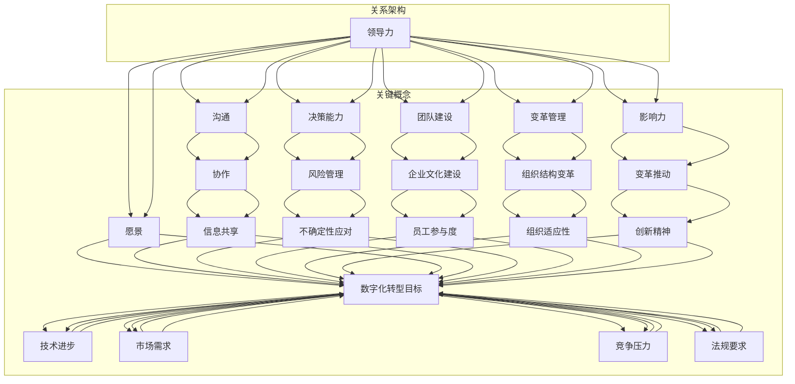

                 


### 背景介绍

在当今快速变化的技术环境中，领导力与数字化转型已成为企业成功的关键要素。随着人工智能、大数据、物联网等新兴技术的快速发展，企业面临着前所未有的挑战和机遇。数字化转型不仅仅是技术的变革，更是企业运营模式、商业模式和文化的全面升级。在这个背景下，领导者的角色变得尤为重要。他们不仅要具备传统的管理能力，还需要深刻理解技术变革带来的影响，以及如何引导团队适应和利用这些新技术。

首先，领导力作为企业管理的基础，其重要性不容忽视。领导力不仅仅是管理技能，更是影响团队成员行为、思维和工作的关键因素。一个优秀的领导者能够激发团队成员的潜力，建立高绩效团队，从而推动企业的持续发展。在数字化转型过程中，领导者的领导力更加关键，因为数字化转型涉及到企业战略的重新定位、业务流程的重新设计、技术的引入与应用等多个方面。

其次，数字化转型已成为企业发展的必然趋势。数字化转型不仅意味着技术手段的创新，还涉及到企业业务模式、管理理念和运营流程的全面变革。通过数字化转型，企业可以实现更高效的资源利用、更精准的市场定位、更优质的客户体验和更灵活的商业模式。然而，数字化转型也面临着诸多挑战，如技术复杂性、组织惯性、文化变革等。因此，如何成功进行数字化转型，是每一个企业领导者都需要面对的课题。

数字化转型与领导力的关系是相辅相成的。一方面，数字化转型为领导者提供了新的工具和方法，帮助他们更好地管理团队、制定战略和推动变革。另一方面，领导者的领导力水平直接影响数字化转型的效果。一个优秀的领导者能够预见技术变革的趋势，把握数字化转型的关键环节，引导团队克服变革中的困难和挑战，确保数字化转型的成功实施。

本文将从领导力与数字化转型的基础理论出发，详细探讨两者之间的关系，并分析领导者在数字化转型中的具体角色和职责。我们将通过具体的案例和实践，展示如何通过领导力提升数字化转型效果，以及如何在数字化转型过程中培养和发挥团队的技术适应能力。此外，本文还将总结数字化转型中的最佳实践和注意事项，为领导者提供有益的启示和指导。

### 核心概念与联系

在探讨领导力与数字化转型的关系时，我们需要明确一些核心概念，并理解它们之间的相互联系。以下是本文中的一些关键概念及其关系架构，我们将使用Mermaid流程图来展示这些概念之间的逻辑关系。

首先，领导力可以定义为一个过程，通过影响、激励和指导他人，实现团队或组织的目标。领导力的核心要素包括：愿景、沟通、决策能力、团队建设、变革管理和影响力。

接下来，数字化转型是一个复杂的过程，涉及企业的全面变革，包括技术、流程、组织和文化。数字化的定义可以认为是通过数据和技术手段来提高效率、创造新价值和增强用户体验。数字化转型的主要动因包括技术进步、市场需求、竞争压力和法规要求。

领导力与数字化转型之间的关系可以从以下几个方面来理解：

1. **领导力的愿景与数字化转型的目标**：领导者的愿景和目标设定是数字化转型成功的基础。领导者的愿景需要与企业的数字化转型目标相一致，以确保团队在变革过程中保持一致的方向。

2. **沟通与协作**：数字化转型需要团队成员之间的紧密协作和信息共享。领导者的沟通能力直接影响团队在数字化转型中的协同效率。

3. **决策能力与风险管理**：数字化转型涉及到许多新的技术和业务模式，领导者需要具备快速决策和风险管理的能力，以应对变革过程中的不确定性。

4. **团队建设与变革管理**：领导者的团队建设能力对于推动企业文化和组织结构的变革至关重要。有效的团队建设能够提高员工的参与度和适应性，从而确保数字化转型顺利实施。

5. **影响力与变革推动**：领导者的影响力是推动企业变革的关键因素。通过树立榜样、激发员工的创新精神，领导者可以有效地引导团队适应新技术和环境的变化。

以下是使用Mermaid绘制的流程图，展示了这些概念之间的逻辑关系：



通过这个流程图，我们可以清晰地看到领导力与数字化转型之间的相互作用和影响。领导力的各个方面如何与数字化转型的目标、动因和实施过程相结合，从而推动企业的持续发展和变革。

### 领导力的核心要素

领导力是一个多维度的概念，包含多个核心要素，每个要素在数字化转型中发挥着关键作用。以下是领导力的几个核心要素及其在数字化转型中的应用：

#### 1. 愿景

愿景是领导力的基石，它为团队提供了明确的方向和目标。在数字化转型过程中，领导者的愿景设定至关重要。一个清晰的愿景能够帮助团队理解数字化转型的长远目标，明确短期目标和里程碑，从而在变革过程中保持一致性和动力。领导者的愿景还应与企业的战略目标相一致，确保数字化转型与企业整体发展方向相契合。

**应用场景**：例如，一个企业的领导者可能在数字化转型的愿景中强调创新和技术领先。在这个愿景的指引下，团队将致力于引入先进技术，优化业务流程，提高运营效率。

**伪代码示例**：
```python
def set_digital_vision():
    # 定义愿景
    vision = "成为行业领先的数字化转型企业，通过技术创新提升竞争力。"
    # 与战略目标对齐
    align_with_strategy(vision)
    # 传达给团队
    communicate_vision_to_team(vision)
    return vision

def align_with_strategy(vision):
    # 对齐战略目标
    strategy = "通过数字化转型实现市场份额增长和运营效率提升。"
    if vision == strategy:
        print("愿景与战略目标一致。")
    else:
        print("调整愿景以与战略目标对齐。")

def communicate_vision_to_team(vision):
    # 传达愿景
    print(f"团队，我们的愿景是：{vision}")
```

#### 2. 沟通

沟通是领导力的关键要素之一，它决定了领导者的决策能否得到有效执行。在数字化转型过程中，沟通的效率和效果直接影响到团队的协作和变革的推进。领导者需要建立开放、透明的沟通机制，确保信息在团队内顺畅流动，促进跨部门合作。

**应用场景**：例如，在一个企业中，领导者可能定期组织团队会议，分享数字化转型的最新进展、遇到的挑战和解决方案，从而确保所有团队成员都了解当前状况，并提供反馈和支持。

**伪代码示例**：
```python
def hold_team_meetings():
    print("召开团队会议，讨论数字化转型进展。")
    # 汇报进展
    report_progress()
    # 收集反馈
    collect_feedback()
    # 解决问题
    resolve_issues()

def report_progress():
    print("进展汇报：数字化转型的里程碑已达成。")

def collect_feedback():
    print("收集反馈：团队对当前数字化转型有何建议？")

def resolve_issues():
    print("解决问题：分析并解决数字化转型中的障碍。")
```

#### 3. 决策能力

在数字化转型中，领导者需要具备快速决策和灵活调整的能力，以应对变革过程中出现的新挑战和不确定性。决策能力不仅体现在技术选择的决策上，还包括资源分配、项目优先级和风险管理的决策。

**应用场景**：例如，当一个企业面临技术选择时，领导者需要分析不同技术的优缺点、成本效益和可行性，从而做出最佳决策。

**伪代码示例**：
```python
def make_technology_decision():
    # 分析技术选择
    analyze_technologies()
    # 评估成本效益
    assess_benefit()
    # 做出决策
    decision = make_choice()
    return decision

def analyze_technologies():
    print("分析技术：比较不同技术的性能和成本。")

def assess_benefit():
    print("评估成本效益：计算技术投入与预期收益。")

def make_choice():
    print("做出决策：选择最优技术方案。")
    return "选定技术方案"
```

#### 4. 团队建设

团队建设是领导力中不可或缺的一部分，特别是在数字化转型过程中，团队的角色和职责将发生重大变化。领导者需要培养团队的凝聚力、协作能力和创新能力，以应对数字化转型的挑战。

**应用场景**：例如，一个领导者可能通过组织团队建设活动、培训和工作坊，提升团队成员的技术技能和团队合作能力。

**伪代码示例**：
```python
def build_digital_team():
    print("建设数字化团队：提升团队技术技能和协作能力。")
    # 组织培训
    organize_training()
    # 促进协作
    promote_collaboration()

def organize_training():
    print("组织培训：为团队提供最新的数字化技术和工具。")

def promote_collaboration():
    print("促进协作：建立跨部门沟通机制，共享知识和资源。")
```

#### 5. 变革管理

变革管理是领导力中的高级要素，它涉及到如何引导团队适应和接受变化。在数字化转型过程中，变革管理尤为重要，因为数字化转型本质上是一场深层次的组织变革。

**应用场景**：例如，一个领导者需要制定详细的变革计划，包括沟通策略、激励机制和培训计划，以确保团队成员顺利适应新的工作模式。

**伪代码示例**：
```python
def manage_transformation():
    print("管理变革：确保数字化转型顺利进行。")
    # 制定计划
    create_transformation_plan()
    # 沟通策略
    communication_strategy()
    # 激励机制
    incentive_mechanism()

def create_transformation_plan():
    print("制定计划：明确数字化转型的目标和步骤。")

def communication_strategy():
    print("沟通策略：建立有效的沟通机制，传达变革信息。")

def incentive_mechanism():
    print("激励机制：设计激励方案，激励团队成员积极参与变革。")
```

通过以上核心要素的详细分析和应用场景，我们可以看到领导力在数字化转型中的重要性。每个要素都在不同的层面上影响着数字化转型的成功，领导者需要综合考虑并灵活运用这些要素，以推动企业的持续发展和变革。

### 数字化转型的概念与趋势

数字化转型，简单来说，是指企业利用数字技术来优化其业务流程、提高效率、创造新价值和增强客户体验的过程。这一概念涵盖了多个方面，包括技术、流程、组织和文化的变革。随着云计算、大数据、物联网、人工智能等新兴技术的快速发展，数字化转型已成为企业提升竞争力的关键策略。

#### 数字化的定义与趋势

数字化不仅仅是指将传统的业务流程和操作转移到线上，更是一种全方位的变革，包括数据的收集、存储、分析和应用。以下是数字化转型的几个关键趋势：

1. **数据驱动的决策制定**：数据成为企业决策的重要依据，通过数据分析和洞察，企业能够更加精准地了解市场和客户需求，从而做出更有效的战略决策。

2. **自动化与智能化**：随着人工智能和机器学习技术的发展，自动化和智能化在业务流程中的应用越来越广泛，显著提高了生产效率和服务质量。

3. **用户体验优化**：通过数字化转型，企业能够提供更加个性化和高效的服务，提升用户体验和客户满意度。

4. **组织结构优化**：数字化改变了企业的组织结构和运作方式，使得组织更加扁平化、灵活化和模块化。

5. **生态系统构建**：企业不再只是独立运作，而是通过与供应商、客户和合作伙伴的数字化连接，构建起更加紧密和高效的生态系统。

#### 数字化转型的动因

企业进行数字化转型的动因多种多样，以下是一些主要的驱动因素：

1. **技术进步**：技术的快速发展，特别是云计算、大数据和人工智能，为企业的数字化转型提供了新的工具和方法。

2. **市场竞争压力**：面对日益激烈的市场竞争，企业需要通过数字化转型来提升自身竞争力，实现差异化。

3. **客户需求变化**：随着互联网和移动设备的普及，客户对服务的需求变得更加个性化和即时化，数字化转型能够满足这些变化。

4. **效率提升**：数字化转型通过自动化和智能化，显著提高了生产效率和管理效率，降低了成本。

5. **法规要求**：某些行业的数字化转型是受到法律法规的要求，如数据隐私保护、合规性等。

#### 数字化转型的挑战

尽管数字化转型带来了诸多机遇，但同时也伴随着一系列挑战：

1. **技术复杂性**：数字化技术多样且快速变化，企业需要不断更新技术栈，以适应新的技术趋势。

2. **组织惯性**：传统的组织结构和文化可能成为数字化转型的障碍，改变这些惯性需要时间和努力。

3. **文化变革**：数字化转型不仅仅是技术的变革，更是文化和思维的变革，需要全员参与和支持。

4. **数据安全和隐私**：数字化带来了大量的数据收集和处理，如何确保数据安全和隐私是一个重要挑战。

5. **人才短缺**：数字化转型需要具备数字技能的人才，但市场上这类人才供不应求。

#### 数字化转型的价值

数字化转型对企业有着深远的价值：

1. **提高运营效率**：通过自动化和智能化，企业能够显著提高运营效率，减少人工错误。

2. **增强创新能力**：数字化技术为企业提供了新的创新工具和方法，促进产品和服务的创新。

3. **提升客户体验**：数字化转型使得企业能够提供更加个性化和高效的服务，提升客户满意度和忠诚度。

4. **优化业务模式**：数字化转型可以帮助企业重构业务模式，开拓新的市场和业务领域。

5. **增强竞争力**：通过数字化转型，企业能够更好地适应市场变化，提升竞争力，在激烈的市场竞争中脱颖而出。

总之，数字化转型不仅是企业应对技术变革的必要手段，更是提升企业整体竞争力和实现可持续发展的关键策略。领导者需要深刻理解数字化转型的概念、趋势和挑战，并积极引导团队适应和利用这些新技术，以实现企业的长期战略目标。

### 数字化转型的战略规划

成功的数字化转型需要明确的战略规划，以确保企业能够在变革过程中保持一致性和方向性。以下是数字化转型战略规划的几个关键步骤：

#### 1. 确定数字化转型的目标与愿景

数字化转型的首要任务是明确目标与愿景。企业领导者需要制定一个清晰的数字化转型路线图，明确数字化转型的长期目标、短期目标和具体的里程碑。这些目标应与企业的整体战略目标相一致，确保数字化转型能够为企业的长期发展带来价值。

**伪代码示例**：
```python
def define_digital_transformation_goals():
    # 设定长期目标
    long_term_goals = "通过数字化转型，实现业务模式创新和市场份额提升。"
    # 设定短期目标
    short_term_goals = "在接下来的一年中，实现关键业务流程的数字化改造。"
    # 设定里程碑
    milestones = ["业务流程优化"、"数据分析能力提升"、"用户体验改善"]
    # 验证目标与愿景一致性
    if are_goals_consistent(long_term_goals, short_term_goals):
        print("数字化转型的目标与愿景一致。")
    else:
        print("调整目标以与愿景一致。")

def are_goals_consistent(long_term_goals, short_term_goals):
    return long_term_goals == short_term_goals
```

#### 2. 评估当前状态与需求

在制定数字化转型战略之前，企业需要全面评估当前的业务状态和数字化水平。这包括对现有技术基础设施、业务流程、数据管理能力和组织结构的评估。通过评估，企业可以识别出数字化转型的优先领域和需求，从而制定有针对性的战略。

**伪代码示例**：
```python
def assess_current_state():
    current_state = {
        "technology": "现有技术已落后，需要升级。",
        "processes": "业务流程繁琐，需要优化。",
        "data_management": "数据管理不规范，需要改进。",
        "organization": "组织结构僵化，需要调整。"
    }
    print(f"当前状态评估结果：{current_state}")
    identify_priorities(current_state)

def identify_priorities(current_state):
    print("识别优先领域：")
    for key, value in current_state.items():
        if value == "需要升级" or value == "需要优化":
            print(f"- {key}：{value}")
```

#### 3. 制定详细的数字化转型计划

基于目标和需求评估，企业需要制定一个详细的数字化转型计划。这个计划应包括具体的实施步骤、时间表、资源分配和风险控制措施。详细的计划有助于确保数字化转型过程中的每个环节都有明确的指导，从而提高实施的成功率。

**伪代码示例**：
```python
def create_digital_transformation_plan():
    plan = {
        "steps": ["业务流程优化"、"数据管理改进"、"技术升级与部署"],
        "time_table": {"start": "2023年1月1日", "end": "2024年12月31日"},
        "resource_allocation": {"budget": 1000000, "team_size": 50},
        "risk_management": ["技术风险"、"数据隐私风险"]
    }
    print(f"数字化转型计划：{plan}")
    execute_plan(plan)

def execute_plan(plan):
    print("执行计划：")
    print(f"- 开始日期：{plan['time_table']['start']}")
    print(f"- 结束日期：{plan['time_table']['end']}")
    print(f"- 资源分配：预算：{plan['resource_allocation']['budget']}，团队规模：{plan['resource_allocation']['team_size']}")
    print(f"- 风险管理：{plan['risk_management']}")
```

#### 4. 建立数字化转型的组织结构

为了确保数字化转型战略的有效实施，企业需要调整组织结构，建立专门的数字化转型团队或部门。这个团队应包括不同领域的专家，如技术专家、业务分析师、数据科学家和项目管理专家等。通过建立专门的团队，企业可以更好地协调和推动数字化转型的各项工作。

**伪代码示例**：
```python
def establish_digital_transformation_organization():
    team = {
        "technology_experts": 10,
        "business_analysts": 5,
        "data_scientists": 5,
        "project_managers": 3
    }
    print(f"数字化转型团队组织结构：{team}")
    coordinate_teams(team)

def coordinate_teams(team):
    print("协调团队：")
    for role, size in team.items():
        print(f"- {role}：{size}人")
```

#### 5. 制定培训与激励机制

数字化转型不仅需要技术层面的支持，还需要团队成员在思维和行为上的转变。为了确保团队能够积极适应数字化转型，企业需要制定全面的培训计划和激励机制。通过培训，提升团队成员的数字化技能和知识水平；通过激励机制，激发团队成员的积极性和创造力。

**伪代码示例**：
```python
def create_training_and_incentive_program():
    training_program = {
        "digital_skills_training": "提供数字化技能培训。",
        "leadership_development": "提升领导者的数字化转型能力。"
    }
    incentives = ["绩效奖金"、"晋升机会"、"创新奖励"]
    print(f"培训计划：{training_program}")
    print(f"激励机制：{incentives}")
    implement_program(training_program, incentives)

def implement_program(training_program, incentives):
    print("实施培训与激励机制：")
    print(f"- 培训：{training_program['digital_skills_training']}")
    print(f"- 培训：{training_program['leadership_development']}")
    print(f"- 激励：{incentives}")
```

通过以上五个步骤，企业可以制定出一个全面的数字化转型战略规划，从而确保数字化转型的成功实施。领导者需要在这个过程中发挥关键作用，通过明确目标、评估需求、制定计划、调整组织结构和实施培训与激励机制，引导团队顺利实现数字化转型的目标。

### 数字化转型实践

数字化转型实践是一个复杂而持续的过程，涉及到多个关键步骤和策略。以下是数字化转型实践的详细步骤，每个步骤都包含具体的操作方法和注意事项：

#### 1. 制定数字化转型计划

**操作方法**：
- **明确目标**：首先，需要明确数字化转型的具体目标和预期成果。这些目标应与企业的长期战略目标一致。
- **评估需求**：评估当前的业务流程、技术基础设施、数据管理能力和组织结构，识别数字化转型的优先领域和需求。
- **制定计划**：基于目标和需求，制定详细的数字化转型计划，包括具体实施步骤、时间表、资源分配和风险控制措施。

**注意事项**：
- 确保计划具有可操作性和可衡量性，以便于监控和调整。
- 需要考虑技术复杂性、组织惯性和文化变革等因素，确保计划的可行性和适应性。

#### 2. 数据驱动的决策制定

**操作方法**：
- **数据收集**：收集与企业业务相关的各类数据，包括客户行为、市场趋势、运营绩效等。
- **数据分析**：利用大数据技术和数据分析工具，对收集到的数据进行分析和挖掘，提取有价值的信息和洞察。
- **决策制定**：基于数据分析结果，制定具体的业务决策和战略调整。

**注意事项**：
- 数据的质量和完整性至关重要，需要确保数据的准确性和可靠性。
- 需要具备数据分析和解读的能力，以充分利用数据的价值。

#### 3. 信息技术在数字化转型中的应用

**操作方法**：
- **技术选型**：根据业务需求和目标，选择合适的数字化技术，如云计算、大数据、人工智能、物联网等。
- **技术部署**：实施选定的技术方案，包括硬件和软件的部署、系统集成和测试。
- **技术优化**：对已部署的技术进行持续优化和改进，以提高性能和效率。

**注意事项**：
- 技术选型和部署需要充分考虑成本效益和技术兼容性。
- 需要建立有效的技术管理和维护机制，确保技术的稳定运行。

#### 4. 数字化人才培养

**操作方法**：
- **人才评估**：评估现有员工的技术能力和知识水平，识别数字化人才缺口。
- **培训计划**：制定全面的培训计划，包括技术培训、管理培训和领导力培训。
- **人才引进**：通过招聘和合作伙伴关系，引进具备数字化技能的高端人才。

**注意事项**：
- 培训计划应结合员工的实际情况，确保培训内容的实用性和有效性。
- 需要建立激励机制，鼓励员工积极参与培训和技能提升。

#### 5. 组织结构和文化变革

**操作方法**：
- **组织结构调整**：根据数字化转型的需求，调整组织结构，建立扁平化、模块化和高效的组织形式。
- **文化变革**：推动企业文化的变革，建立以创新、协作和开放为核心的企业文化。
- **领导力提升**：提升领导者的数字化素养和领导力，确保他们能够有效推动数字化转型的实施。

**注意事项**：
- 组织结构调整和文化变革需要逐步推进，避免引起过大的震动和抵触。
- 需要建立有效的沟通机制，确保员工理解变革的原因和目标，减少抵触情绪。

#### 6. 持续改进与优化

**操作方法**：
- **定期评估**：定期对数字化转型的进展进行评估，包括业务绩效、技术应用效果、员工满意度等。
- **反馈机制**：建立有效的反馈机制，收集员工和客户的反馈，不断优化数字化转型方案。
- **持续改进**：根据评估结果和反馈，持续改进和优化数字化转型的各项举措。

**注意事项**：
- 持续改进是一个长期过程，需要保持耐心和持续性。
- 需要建立持续学习和改进的文化氛围，鼓励员工积极参与改进活动。

#### 7. 实施案例

以下是一个数字化转型实施的案例：

**案例背景**：某大型制造企业希望通过数字化转型提高生产效率和产品质量。

**操作步骤**：
1. **制定数字化转型计划**：明确数字化转型的目标和预期成果，评估当前状态和需求，制定详细的实施计划。
2. **部署智能制造系统**：引进智能制造系统，包括物联网设备、传感器和数据分析工具，实现生产过程的自动化和智能化。
3. **数据驱动决策**：利用收集到的生产数据，进行实时监控和分析，优化生产流程和资源配置。
4. **数字化人才培养**：组织员工参加智能制造和数据分析的培训，提升员工的数字化技能和知识水平。
5. **组织结构和文化变革**：调整组织结构，建立以创新和协作为核心的企业文化。
6. **持续改进与优化**：定期评估数字化转型效果，收集反馈，持续改进和优化各项措施。

**实施效果**：通过数字化转型，该企业的生产效率提高了30%，产品质量提升了20%，运营成本降低了15%。同时，员工满意度和客户满意度也显著提高，为企业带来了显著的经济和社会效益。

**结论**：数字化转型是一项系统工程，需要企业从战略层面进行全面规划和实施。通过明确目标、数据驱动、技术应用、人才培养和组织文化变革，企业可以成功实现数字化转型，提升整体竞争力。

### 领导者在数字化转型中的作用

在数字化转型的过程中，领导者的角色至关重要。领导者不仅是数字化转型的发起者和推动者，还要成为变革的领导者，通过以下方式在数字化转型的各个环节中发挥关键作用：

#### 1. 发起和推动数字化转型

领导者需要具备前瞻性思维，能够预见数字化技术的未来趋势，并在合适的时间点提出数字化转型的倡议。在发起阶段，领导者需要明确数字化转型的目标和愿景，并将其传达给全体员工。通过建立明确的目标和愿景，领导者可以激发员工的参与热情，使整个团队朝着共同的目标努力。

**示例策略**：
- **建立愿景**：明确数字化转型的长远目标，并将其分解为可执行的里程碑。
- **沟通与宣传**：通过内部会议、培训、内部通讯等方式，宣传数字化转型的意义和预期成果。
- **激励员工**：设立激励机制，鼓励员工积极参与数字化转型，如绩效奖金、晋升机会和荣誉表彰。

#### 2. 制定和实施数字化转型战略

数字化转型战略的制定是确保变革顺利进行的关键环节。领导者需要基于企业的实际需求和资源，制定详细的数字化转型计划，并确保计划的可行性和可操作性。在实施过程中，领导者需要协调不同部门之间的合作，确保各项措施得到有效执行。

**示例策略**：
- **评估需求**：全面评估企业的业务流程、技术基础设施、数据管理和组织结构，识别数字化转型的优先领域和需求。
- **制定计划**：制定详细的数字化转型计划，包括实施步骤、时间表、资源分配和风险管理措施。
- **跨部门协作**：建立跨部门协作机制，确保各部门在数字化转型过程中紧密合作，共享资源和信息。

#### 3. 培养数字化素养和技能

数字化转型不仅需要技术层面的变革，还需要员工的思维和行为上的转变。领导者需要关注员工的数字化素养和技能提升，通过培训、学习和实践，帮助员工适应新的技术和工作方式。

**示例策略**：
- **组织培训**：为员工提供定期的数字化技能培训，包括最新技术的应用、数据分析方法和创新思维等。
- **搭建学习平台**：建立在线学习平台，提供丰富的学习资源和案例研究，方便员工随时学习和交流。
- **建立学习社区**：鼓励员工参与数字化创新项目，建立内部学习社区，促进知识和经验的分享。

#### 4. 推动文化变革

数字化转型不仅仅是技术的变革，更是文化和思维的变革。领导者需要推动企业文化的变革，建立以创新、协作和开放为核心的企业文化，以适应数字化时代的需求。

**示例策略**：
- **文化宣导**：通过内部宣传和沟通，强调企业文化的重要性，倡导创新和协作。
- **领导示范**：领导者要以身作则，通过自身的行动和决策，树立榜样，推动文化变革。
- **激励机制**：建立与企业文化相符的激励机制，鼓励员工积极参与变革，提供奖励和认可。

#### 5. 应对变革中的挑战

在数字化转型过程中，领导者需要具备应对变革中各种挑战的能力。这包括技术风险、组织惯性和文化变革等方面的挑战。领导者需要通过有效的管理和策略，引导团队克服这些挑战，确保数字化转型的顺利进行。

**示例策略**：
- **风险管理**：建立全面的风险管理机制，识别和评估数字化转型中的潜在风险，并制定相应的应对措施。
- **沟通与反馈**：建立有效的沟通渠道，及时与员工沟通转型过程中的问题，收集员工的反馈和建议。
- **调整与优化**：根据反馈和实际情况，及时调整和优化转型方案，确保转型过程的顺利进行。

通过以上策略，领导者可以充分发挥其在数字化转型中的作用，引导团队成功实现数字化转型的目标，提升企业的竞争力和创新能力。

### 领导者在数字化转型中的具体职责

在数字化转型过程中，领导者的职责至关重要。他们不仅是变革的发起者和推动者，还需要在各个环节中扮演多种角色，确保数字化转型能够顺利实施并取得预期成果。以下是领导者在这个过程中的具体职责：

#### 1. 制定和传达愿景

领导者的首要职责是明确数字化转型的愿景和目标，并将其传达给全体员工。通过建立清晰的目标和愿景，领导者可以激发团队的积极性和参与度，确保整个团队朝着共同的目标努力。

**具体措施**：
- **愿景制定**：结合企业的长期战略，制定一个明确的数字化转型愿景，包括预期的业务成果、技术方向和变革目标。
- **愿景传达**：通过内部会议、团队培训、内部通讯等方式，向全体员工传达数字化转型的重要性、愿景和目标。

**示例场景**：
- **会议传达**：在公司的月度管理会议上，CEO向全体高层管理者传达了数字化转型的愿景和目标，并解释了为什么这是一项重要的战略决策。

#### 2. 制定和执行战略

领导者需要制定详细的数字化转型战略，包括具体的实施步骤、时间表、资源分配和风险管理措施。在执行阶段，领导者要确保战略得到有效执行，并针对过程中出现的问题进行及时调整。

**具体措施**：
- **战略制定**：基于企业的现状和需求，制定一个详细的数字化转型战略，明确各个阶段的任务和目标。
- **战略执行**：建立跨部门协作机制，确保各项战略措施得到有效执行，并进行定期监控和评估。

**示例场景**：
- **项目启动会**：在数字化转型的启动会上，项目负责人详细介绍了项目的战略规划，明确了各阶段的任务和时间节点，并建立了项目执行团队。

#### 3. 培养数字化技能

领导者需要关注团队成员的数字化技能提升，通过培训、学习和实践，帮助员工适应新的技术和工作方式。这包括技术技能、数据分析能力和创新思维等多方面。

**具体措施**：
- **组织培训**：为员工提供定期的数字化技能培训，包括新技术应用、数据分析方法和创新思维等。
- **搭建学习平台**：建立在线学习平台，提供丰富的学习资源和案例研究，方便员工随时学习和交流。
- **实践机会**：为员工提供实际操作的机会，鼓励他们参与数字化项目，积累实践经验。

**示例场景**：
- **技能提升培训**：公司为所有员工提供了为期三个月的数字化技能提升培训，包括大数据分析和人工智能应用等，确保员工能够适应数字化时代的需求。

#### 4. 推动文化变革

数字化转型不仅仅是技术的变革，更是文化和思维的变革。领导者需要推动企业文化的变革，建立以创新、协作和开放为核心的企业文化，以适应数字化时代的需求。

**具体措施**：
- **文化宣导**：通过内部宣传和沟通，强调企业文化的重要性，倡导创新和协作。
- **领导示范**：领导者要以身作则，通过自身的行动和决策，树立榜样，推动文化变革。
- **激励机制**：建立与企业文化相符的激励机制，鼓励员工积极参与变革，提供奖励和认可。

**示例场景**：
- **内部研讨会**：公司定期举办内部研讨会，讨论数字化转型中的文化挑战和解决方案，鼓励员工提出改进建议，共同推动文化变革。

#### 5. 应对变革中的挑战

在数字化转型过程中，领导者需要具备应对各种挑战的能力。这包括技术风险、组织惯性和文化变革等方面的挑战。领导者需要通过有效的管理和策略，引导团队克服这些挑战，确保数字化转型的顺利进行。

**具体措施**：
- **风险管理**：建立全面的风险管理机制，识别和评估数字化转型中的潜在风险，并制定相应的应对措施。
- **沟通与反馈**：建立有效的沟通渠道，及时与员工沟通转型过程中的问题，收集员工的反馈和建议。
- **调整与优化**：根据反馈和实际情况，及时调整和优化转型方案，确保转型过程的顺利进行。

**示例场景**：
- **问题解决会议**：在数字化转型过程中，项目经理定期召开问题解决会议，讨论项目进展中遇到的问题和挑战，制定解决方案，确保项目按计划推进。

#### 6. 监控和评估进展

领导者需要持续监控和评估数字化转型的进展，确保各项任务按时完成，并达到预期目标。通过定期的评估和反馈，领导者可以及时发现和解决问题，确保数字化转型的顺利实施。

**具体措施**：
- **进度监控**：建立项目进度监控机制，定期检查各项任务的完成情况，确保项目按计划推进。
- **绩效评估**：对数字化转型的绩效进行定期评估，包括业务绩效、技术应用效果和员工满意度等，确保转型目标得到实现。

**示例场景**：
- **绩效评估报告**：公司每月发布一次数字化转型绩效评估报告，包括项目的完成情况、业务绩效指标和员工反馈等，为后续的调整和优化提供依据。

通过以上具体职责和措施，领导者可以有效地推动数字化转型，引导团队克服各种挑战，实现企业的长期战略目标。领导者的角色不仅在于制定战略和推动变革，更在于激发员工的潜力和创造力，共同迎接数字化时代的机遇和挑战。

### 领导者在数字化转型中的挑战与应对策略

尽管领导者在数字化转型中扮演着关键角色，但这一过程中也会面临诸多挑战。以下是领导者可能遇到的一些主要挑战及其应对策略：

#### 挑战一：技术复杂性

数字化转型涉及多种新兴技术，如大数据、人工智能、云计算等，技术复杂性对领导者的技术素养提出了较高要求。领导者需要了解这些技术的原理和应用，以便做出明智的决策。

**应对策略**：
- **持续学习**：领导者应不断更新自己的技术知识，参加专业培训和研讨会，保持对最新技术趋势的敏感性。
- **外部咨询**：聘请外部技术顾问或专家，为数字化转型提供专业意见和指导。

#### 挑战二：组织惯性

企业现有的组织结构和文化往往与数字化转型的新需求不符。组织惯性可能导致变革的推进受阻，员工对新技术的接受和适应也可能遇到困难。

**应对策略**：
- **文化宣导**：通过内部沟通和宣传，强调数字化转型的重要性和紧迫性，培养员工对变革的认同感。
- **逐步推进**：在数字化转型过程中，采取逐步推进的策略，减少对现有组织结构的冲击。

#### 挑战三：人才短缺

数字化转型需要具备多种技能的人才，但市场上这类人才供不应求。人才短缺可能导致项目进度延误，影响数字化转型的效果。

**应对策略**：
- **内部培养**：通过内部培训和发展计划，提升现有员工的技术能力和业务理解。
- **外部引进**：通过招聘和合作，引进具备相关技能和经验的人才，同时提供良好的职业发展机会。

#### 挑战四：数据安全和隐私

数字化转型涉及到大量的数据收集和处理，如何确保数据安全和隐私是一个重要挑战。数据泄露和隐私问题可能对企业造成严重的声誉损失和法律风险。

**应对策略**：
- **建立安全机制**：建立严格的数据安全政策和措施，确保数据在收集、存储和处理过程中的安全性。
- **合规性审查**：定期对数字化转型项目进行合规性审查，确保符合相关法律法规的要求。

#### 挑战五：持续创新与变革管理

数字化转型是一个持续的过程，需要不断地进行创新和调整。同时，领导者在推动变革过程中也需要平衡变革与稳定之间的关系。

**应对策略**：
- **建立创新机制**：鼓励员工提出创新想法，建立内部创新实验室，为员工提供试验和创新的空间。
- **变革管理**：通过有效的变革管理策略，引导员工逐步适应新的工作模式，减少变革带来的震动。

#### 挑战六：跨部门协作

数字化转型通常需要跨部门的合作，不同部门之间的沟通和协调可能存在障碍，影响项目的进展和效果。

**应对策略**：
- **建立跨部门团队**：成立跨部门项目团队，明确各部门的职责和任务，确保信息的透明和协作的顺畅。
- **定期沟通会议**：定期组织跨部门沟通会议，讨论项目的进展和问题，确保各部门之间的信息同步。

通过上述应对策略，领导者可以有效地克服数字化转型过程中的各种挑战，确保数字化转型的顺利进行，并取得预期的成果。

### 技术适应能力

在数字化转型过程中，技术适应能力是企业和团队成功的关键因素之一。技术适应能力不仅包括对新技术和工具的快速掌握，还涉及到对新兴技术的应用和创新。以下是提高技术适应能力的几个方法：

#### 1. 定期培训与学习

**操作方法**：
- **内部培训**：企业可以定期组织内部培训课程，涵盖最新的技术趋势、工具使用和业务应用。这些培训可以由内部专家或外部顾问进行。
- **外部学习**：鼓励员工参加行业会议、研讨会和培训课程，了解最新的技术发展和行业最佳实践。

**注意事项**：
- 培训内容应紧密结合实际业务需求，确保员工能够将所学知识应用到工作中。
- 培训应注重互动和实操，提高员工的参与度和学习效果。

#### 2. 建立学习社区

**操作方法**：
- **内部交流平台**：建立内部交流平台，如论坛、在线问答社区等，方便员工分享经验和知识，促进技术交流和合作。
- **外部合作**：与其他企业或学术机构建立合作关系，共同研究和探讨新技术和应用。

**注意事项**：
- 学习社区应保持活跃和互动，鼓励员工积极参与。
- 定期组织线上或线下的技术交流会议，促进知识分享和经验交流。

#### 3. 实践项目

**操作方法**：
- **试点项目**：在企业内部启动试点项目，尝试引入新技术和工具，验证其可行性和效果。
- **实际应用**：鼓励员工参与实际项目，将所学知识和技能应用到实际工作中，通过实践积累经验。

**注意事项**：
- 试点项目应具备一定的规模和代表性，确保能够反映真实的工作场景。
- 对试点项目的成果进行评估和总结，为后续推广提供依据。

#### 4. 持续改进与优化

**操作方法**：
- **定期评估**：对技术适应能力进行定期评估，了解员工的技术掌握情况和应用效果。
- **优化流程**：根据评估结果，对培训计划、学习社区和实践项目进行优化和调整，提高技术适应能力。

**注意事项**：
- 评估应注重定量和定性相结合，全面了解员工的技术能力和应用效果。
- 优化流程应注重持续性和灵活性，确保技术适应能力不断提升。

#### 5. 创新激励机制

**操作方法**：
- **奖励机制**：建立技术创新奖励机制，对在技术适应能力提升方面表现突出的员工进行奖励，激发员工的积极性和创造力。
- **晋升通道**：为技术适应能力强的员工提供晋升通道和职业发展机会，鼓励员工不断提升自身技能。

**注意事项**：
- 奖励机制应公平、透明，确保激励效果。
- 晋升通道应与员工的技能提升和实际贡献相结合，避免形式主义。

#### 6. 跨部门合作

**操作方法**：
- **跨部门团队**：建立跨部门团队，促进不同部门之间的技术交流和合作，共同推进数字化转型。
- **共享资源**：鼓励部门之间共享技术资源和知识，提高整体的技术适应能力。

**注意事项**：
- 跨部门团队应明确职责和目标，确保项目推进的顺利进行。
- 共享资源应注重效率和价值，避免资源浪费和重复建设。

通过以上方法，企业可以逐步提高技术适应能力，为数字化转型提供坚实的人才和技术支持。

### 团队发展策略

在数字化转型过程中，团队的发展策略是确保数字化转型成功的关键因素之一。以下是一些关键的发展策略：

#### 1. 建立明确的团队目标

**操作方法**：
- **设定具体目标**：为团队设定明确、可衡量的目标，这些目标应与企业的数字化转型战略相一致。
- **定期评估**：定期评估团队目标的完成情况，并根据实际情况进行调整。

**注意事项**：
- 目标应具有挑战性，同时也要现实可行，确保团队有动力去实现。
- 目标设定过程中应充分听取团队成员的意见和建议，提高团队的参与度和认同感。

#### 2. 培养团队成员的技能

**操作方法**：
- **定制培训计划**：根据团队成员的技能短板和业务需求，制定个性化的培训计划。
- **提供学习资源**：提供丰富的学习资源和工具，如在线课程、工作坊和研讨会。

**注意事项**：
- 培训内容应紧密结合实际业务需求，确保培训的实用性和有效性。
- 定期评估培训效果，确保培训目标得到实现。

#### 3. 促进团队合作与沟通

**操作方法**：
- **建立沟通机制**：建立有效的沟通机制，如定期的团队会议、项目进展报告和反馈会议。
- **跨部门协作**：鼓励跨部门之间的合作，促进知识共享和资源整合。

**注意事项**：
- 沟通机制应确保信息的透明和及时性，避免信息孤岛。
- 跨部门协作应注重目标和成果的共享，提高整体团队的工作效率。

#### 4. 激励团队成员

**操作方法**：
- **设定激励机制**：根据团队成员的贡献和表现，设定合理的激励措施，如奖金、晋升机会和荣誉表彰。
- **提供职业发展机会**：为团队成员提供职业发展路径，鼓励他们不断提升自身能力和职业素养。

**注意事项**：
- 激励机制应公平、透明，确保每个成员都有公平的机会。
- 职业发展机会应与团队成员的兴趣和职业规划相结合，提高他们的积极性和忠诚度。

#### 5. 建立积极的文化氛围

**操作方法**：
- **文化建设**：通过内部宣传、团队活动和文化建设活动，营造积极向上的团队氛围。
- **领导示范**：领导者应以身作则，树立榜样，推动团队文化的形成和发展。

**注意事项**：
- 文化建设应注重团队精神和协作精神，提高团队的凝聚力和向心力。
- 领导者应积极参与团队文化建设，通过自身的行为和决策，树立良好的团队文化。

#### 6. 持续改进与优化

**操作方法**：
- **定期评估**：定期对团队的工作进行评估，了解团队成员的反馈和建议，不断优化团队发展策略。
- **持续学习**：鼓励团队成员持续学习和成长，提高团队的整体素质。

**注意事项**：
- 评估应注重过程和结果，确保团队发展策略能够真正满足业务需求。
- 持续学习应成为团队文化的一部分，鼓励团队成员不断探索新的知识和技能。

通过以上团队发展策略，企业可以有效地培养和激励团队成员，提高团队的整体绩效，为数字化转型的成功实施提供坚实的支持。

### 数字化转型中的领导力实践

在实际操作中，领导力在数字化转型中的应用至关重要。以下将通过具体案例来探讨领导力在数字化转型中的实践，并总结成功的关键要素和常见挑战。

#### 案例一：某全球零售巨头

**背景**：
某全球零售巨头面临着电商崛起和客户需求多元化的挑战，决定通过数字化转型提升其竞争力。

**领导力实践**：
1. **明确愿景和目标**：公司CEO在内部会议上明确表示，通过数字化转型实现个性化购物体验、提升运营效率和拓展全球市场。
2. **组建跨部门团队**：CEO组建了由技术、市场、运营和人力资源等部门组成的跨部门团队，确保数字化转型过程中的紧密协作。
3. **培养数字素养**：CEO组织了一系列领导力培训，提升领导团队的数字素养，确保他们能够理解并推动数字化转型。
4. **激励员工**：CEO通过设定明确的目标和激励措施，鼓励员工积极参与数字化转型项目，提供奖励和晋升机会。

**成功要素**：
- **清晰的愿景和目标**：确保整个团队朝着共同的目标努力。
- **跨部门协作**：促进不同部门之间的信息共享和资源整合。
- **领导力培训**：提高领导团队的数字素养，确保他们能够有效地推动变革。
- **激励机制**：激发员工的积极性和创造力，推动项目的顺利实施。

**挑战**：
- **文化变革**：由于数字化转型涉及到企业文化和管理方式的变革，一些员工可能抵触变革。
- **资源分配**：确保足够的资源用于数字化转型项目，避免资源浪费。

#### 案例二：某金融科技企业

**背景**：
某金融科技企业希望通过数字化转型提升其产品和服务的竞争力，并拓展新的业务领域。

**领导力实践**：
1. **敏捷管理**：CEO采用敏捷管理方法，提高团队响应速度和灵活性，确保项目能够快速迭代和改进。
2. **员工参与**：CEO鼓励员工提出创新想法，并为他们提供实践的机会，从而提高员工的参与度和创造力。
3. **风险管理**：CEO建立了全面的风险管理机制，识别和评估数字化转型过程中的风险，并制定应对措施。
4. **持续改进**：CEO定期组织团队评估和反思数字化转型项目的进展，不断优化项目策略和执行过程。

**成功要素**：
- **敏捷管理**：提高团队响应速度和灵活性，确保项目顺利进行。
- **员工参与**：激发员工的创新潜力和工作热情。
- **风险管理**：确保项目在风险可控的情况下推进。
- **持续改进**：通过持续评估和反馈，不断提高项目的质量和效率。

**挑战**：
- **技术复杂性**：需要不断更新技术知识和技能，以应对快速变化的技术环境。
- **员工技能提升**：需要提供充足的培训和支持，确保员工能够适应新的工作模式。

#### 案例三：某制造企业

**背景**：
某制造企业希望通过数字化转型提高生产效率和产品质量，同时降低运营成本。

**领导力实践**：
1. **愿景设定**：公司CEO明确了通过智能制造实现生产自动化、数据驱动的生产管理和灵活的供应链管理。
2. **项目试点**：CEO选择了部分生产线进行智能制造试点，通过实际应用验证新技术的可行性和效果。
3. **人才培养**：CEO为员工提供专门的智能制造培训，提升员工的技术能力和业务理解。
4. **文化建设**：CEO推动企业文化的变革，建立以创新和协作为核心的企业文化，提高员工对新技术的接受度。

**成功要素**：
- **愿景设定**：明确数字化转型的目标和方向，确保团队的共同努力。
- **项目试点**：通过实际应用验证新技术的效果，减少风险。
- **人才培养**：确保员工具备实施新技术的技能和知识。
- **文化建设**：推动企业文化的变革，为数字化转型提供良好的文化基础。

**挑战**：
- **技术选型**：需要选择合适的技术方案，确保与企业的实际需求相匹配。
- **员工培训**：需要提供持续的培训和指导，确保员工能够有效应用新技术。

### 总结

通过以上案例，我们可以看到领导力在数字化转型中的关键作用。成功的关键要素包括明确的愿景和目标、跨部门协作、领导力培训、激励机制、敏捷管理、员工参与、风险管理、项目试点和人才培养等。同时，数字化转型过程中也会面临文化变革、技术复杂性、员工技能提升等挑战。领导者需要具备前瞻性思维、战略规划和持续改进的能力，以应对这些挑战，确保数字化转型的成功实施。

### 数字化转型中的最佳实践

在数字化转型过程中，积累和遵循最佳实践是确保项目成功的关键。以下是一些经过验证的最佳实践，供企业领导者在实施数字化转型时参考：

#### 1. **全面的规划和准备**

在开始数字化转型之前，企业需要进行全面的规划，包括对现有业务流程、技术基础设施和员工技能水平的评估。通过制定详细的转型路线图，明确每个阶段的目标和时间表，有助于减少不确定性，确保项目有序推进。

**具体措施**：
- **进行现状分析**：评估现有流程和技术，识别改进的机会和风险。
- **制定转型路线图**：明确每个阶段的目标、任务和时间表。
- **制定应急预案**：为可能出现的风险和问题制定应对方案。

#### 2. **建立跨部门协作机制**

数字化转型通常需要跨部门合作，因此建立有效的协作机制至关重要。通过建立跨部门团队、定期沟通和共享资源，可以促进不同部门之间的信息交流和协同工作。

**具体措施**：
- **成立跨部门团队**：由不同部门的代表组成，负责协调和推进数字化转型项目。
- **定期沟通会议**：定期举行跨部门沟通会议，讨论项目的进展和问题。
- **共享资源**：建立资源共享平台，促进知识和技术共享。

#### 3. **培养数字素养和技能**

数字素养和技能是成功进行数字化转型的基础。企业应通过培训、学习和实践，提高员工的数字素养和技能，确保他们能够适应和掌握新技术。

**具体措施**：
- **内部培训**：为员工提供定期的数字技能培训，涵盖最新的技术趋势和工具使用。
- **外部学习**：鼓励员工参加行业会议、培训课程和专业认证。
- **实践项目**：通过实际项目，让员工将所学知识应用到工作中，积累实践经验。

#### 4. **持续监控和评估**

数字化转型是一个持续的过程，需要定期监控和评估项目的进展和效果。通过定期的评估和反馈，可以及时发现和解决问题，确保项目按计划推进。

**具体措施**：
- **建立监控指标**：设定关键绩效指标（KPIs），监控项目的进展和效果。
- **定期评估**：定期对项目进行评估，收集员工的反馈和建议。
- **调整策略**：根据评估结果和反馈，及时调整项目策略和执行过程。

#### 5. **注重数据安全和隐私**

数字化转型涉及到大量数据收集和处理，数据安全和隐私保护是必须重视的问题。企业应建立严格的数据安全政策和措施，确保数据的安全性和合规性。

**具体措施**：
- **制定安全政策**：建立数据安全政策和流程，确保数据的收集、存储和处理符合相关法律法规。
- **安全培训**：为员工提供数据安全培训，提高他们的安全意识和技能。
- **安全审计**：定期进行安全审计，检查数据安全措施的执行情况。

#### 6. **建立创新文化**

数字化转型不仅是技术的变革，也是文化和思维的变革。建立创新文化，鼓励员工提出新想法和解决方案，是推动数字化转型的重要动力。

**具体措施**：
- **鼓励创新**：为员工提供创新试验和失败的空间，鼓励他们尝试新的方法和工具。
- **激励机制**：建立创新奖励机制，激励员工积极参与创新项目。
- **文化建设**：通过内部宣传和活动，营造鼓励创新和协作的企业文化。

通过遵循这些最佳实践，企业可以有效地推动数字化转型，提高业务效率和竞争力，为长期发展奠定坚实的基础。

### 拓展阅读

在数字化转型的领域，有许多经典文献和前沿研究值得深入阅读，以下是一些推荐资源：

1. **《数字化管理：转型与管理创新》**（Digital Transformation: Management and Innovation）
   - 作者：Geoffrey A. Moore
   - 简介：本书详细探讨了数字化转型的管理挑战和策略，为领导者提供了实用的指导。

2. **《数字化转型：企业如何应对技术变革》**（Digital Transformation: How Companies Are Transforming in the Face of Technology Change）
   - 作者：John P. Kotter & Lenny D. Low
   - 简介：本书通过案例研究和理论分析，阐述了企业如何成功应对技术变革，推动数字化转型。

3. **《人工智能与数字化转型：从战略到实践》**（Artificial Intelligence and Digital Transformation: From Strategy to Practice）
   - 作者：Michael I. Jordan & Andrew Ng
   - 简介：本书介绍了人工智能技术在数字化转型中的应用，探讨了如何通过人工智能提升业务效率和创新能力。

4. **《数据驱动的决策：在数字化时代赢得竞争的关键》**（Data-Driven Decision Making: The Key to Winning in the Digital Age）
   - 作者：Thomas H. Davenport & Jeanne G. Harris
   - 简介：本书探讨了如何利用数据分析驱动决策，提高企业竞争力，并在数字化时代取得成功。

5. **《数字化转型中的领导力：变革管理与创新实践》**（Leadership in Digital Transformation: Change Management and Innovation Practices）
   - 作者：Paula Gottfried & Rod Berger
   - 简介：本书详细分析了领导力在数字化转型中的作用，提供了变革管理和创新实践的案例和策略。

6. **《敏捷转型：如何在复杂环境中快速响应》**（Agile Transformation: How to Succeed in a Complex Environment）
   - 作者：Lynda S. Johnson & Craig L. Ludwig
   - 简介：本书介绍了敏捷管理方法在数字化转型中的应用，提供了在复杂环境中快速响应的策略。

这些文献和资源不仅涵盖了数字化转型的理论基础，还提供了丰富的实践案例和策略，为企业在数字化转型过程中提供了宝贵的指导和参考。通过深入阅读这些资源，读者可以更全面地了解数字化转型的本质和实施方法，为企业的数字化转型提供坚实的理论基础和实践指导。

### 小结

本文通过详细探讨领导力与数字化转型之间的关系，揭示了领导者在这个过程中的关键作用和具体职责。我们首先介绍了领导力的核心要素，如愿景、沟通、决策能力、团队建设和变革管理，并分析了它们在数字化转型中的应用。接着，我们详细阐述了数字化的定义与趋势，以及数字化转型的动因、挑战和战略规划。在此基础上，我们探讨了领导者在数字化转型中的具体角色和职责，包括制定和传达愿景、制定和实施战略、培养数字化技能、推动文化变革、应对变革中的挑战等。

在实践部分，我们通过具体案例展示了领导力在数字化转型中的成功应用，并总结了数字化转型中的最佳实践。这些实践包括全面的规划和准备、建立跨部门协作机制、培养数字素养和技能、持续监控和评估、注重数据安全和隐私、建立创新文化等。这些最佳实践为企业成功推动数字化转型提供了宝贵的指导。

此外，我们还推荐了若干拓展阅读资源，涵盖数字化转型的理论基础和实际案例，旨在帮助读者更深入地了解这一领域。通过本文的阅读，读者应能够清晰地理解领导力与数字化转型之间的密切联系，掌握推动数字化转型所需的战略和实践方法。

### 注意事项

在数字化转型过程中，领导者需要特别注意以下几个方面：

1. **文化变革**：数字化转型不仅仅是技术的变革，更是文化和思维的变革。领导者需要推动企业文化的变革，建立以创新、协作和开放为核心的企业文化，为数字化转型的顺利实施提供良好的文化基础。

2. **人才发展**：数字化转型需要具备数字技能和知识的人才。领导者应注重培养和引进数字化人才，通过培训、学习和实践，提升员工的数字素养和技能。

3. **数据安全和隐私**：数字化转型涉及到大量的数据收集和处理，数据安全和隐私保护至关重要。领导者需要建立严格的数据安全政策和措施，确保数据的安全性和合规性。

4. **风险管理**：数字化转型过程中可能面临多种风险，包括技术风险、组织惯性和文化变革等。领导者需要建立全面的风险管理机制，识别和评估潜在风险，并制定相应的应对措施。

5. **持续改进**：数字化转型是一个持续的过程，需要不断地进行评估和优化。领导者应鼓励团队持续学习和改进，确保数字化转型能够适应不断变化的环境和需求。

通过关注这些方面，领导者可以更有效地推动数字化转型，确保企业在数字化时代取得成功。

### 拓展阅读

为了深入理解数字化转型的各个层面，以下是一些推荐的高质量文献和资源，涵盖了从理论基础到实践应用的各种内容：

1. **《企业数字化转型：理论、方法与实践》**（Digital Transformation of Enterprises: Theory, Methodology, and Practice）
   - 作者：李晓华、王文博
   - 简介：这本书详细介绍了数字化转型的理论基础和实践方法，适合企业领导者和管理人员参考。

2. **《数字化转型手册：构建智能商业的未来》**（Digital Transformation Handbook: Building the Future of Smart Business）
   - 作者：David Sweetnam、Ian P. Cockburn
   - 简介：本书通过案例研究和实战经验，探讨了数字化转型对企业战略、运营和文化的影响，是一本实用性很强的指南。

3. **《数字化转型：企业如何适应未来的趋势》**（Digital Transformation: How Companies Are Adapting to Future Trends）
   - 作者：PwC
   - 简介：这是普华永道（PwC）发布的一份研究报告，分析了全球企业在数字化转型中的最新趋势和最佳实践。

4. **《人工智能与数字化转型的融合：从概念到实践》**（The Fusion of AI and Digital Transformation: From Concept to Practice）
   - 作者：张志宏、李庆杰
   - 简介：本书详细探讨了人工智能技术在数字化转型中的应用，以及如何利用人工智能提升业务效率和创新能力。

5. **《数字化转型中的领导力：实践与案例》**（Leadership in Digital Transformation: Practices and Cases）
   - 作者：王大伟、李慧杰
   - 简介：这本书通过多个企业案例，深入分析了领导力在数字化转型中的关键作用，提供了实用的管理策略。

6. **《数据驱动的决策：数字化转型中的战略工具》**（Data-Driven Decision Making: Strategic Tools for Digital Transformation）
   - 作者：徐少俊
   - 简介：本书探讨了如何利用数据分析驱动决策，帮助企业在数字化转型中做出更明智的决策。

7. **《数字化转型中的数据治理：理论与实践》**（Data Governance in Digital Transformation: Theory and Practice）
   - 作者：赵瑞
   - 简介：本书详细介绍了数据治理在数字化转型中的重要性，以及如何建立有效的数据治理体系。

通过阅读这些文献和资源，读者可以更全面地了解数字化转型的理论和实践，为企业的数字化转型提供科学的指导和支持。

