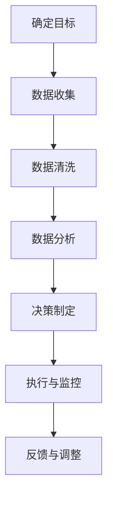

                 

### 文章标题：领导力与数据素养：用数据驱动决策的能力

**关键词：** 领导力、数据素养、数据驱动决策、数据分析、工具与技术、实战案例

**摘要：** 在数字化时代，数据已成为企业决策的关键要素。本文将探讨领导力与数据素养之间的关系，阐述如何通过提升数据素养，实现数据驱动决策的能力。我们将从背景介绍、核心概念、数据素养在领导力中的应用、数据驱动决策的工具与技术、实战案例以及总结与展望等方面，全面分析数据素养对领导力的影响，并提供实用的指导和建议。

### 引言与背景

在当今这个数据爆炸的时代，信息技术的迅猛发展使得数据量呈指数级增长。这不仅为企业带来了前所未有的机遇，也提出了前所未有的挑战。如何从海量数据中挖掘出有价值的信息，并以此为基础进行科学决策，已成为企业领导者和决策者面临的重要课题。

**背景：** 数据驱动决策（Data-Driven Decision Making）作为一种新兴的决策模式，正逐步取代传统的经验决策。其核心理念是通过数据收集、分析和应用，为决策提供客观、可靠的支持。这一模式的兴起，不仅依赖于数据分析技术的发展，更依赖于领导者数据素养的提升。

### 领导力与数据素养概述

**领导力的定义与特点：** 领导力是一种能力，它不仅包括领导者的个人素质，如沟通能力、决策能力、团队建设能力等，更包括领导者对团队和组织的影响力和领导力风格。现代领导力强调创新、协作和变革，要求领导者具备前瞻性、决策力和执行力。

**数据素养的定义与内涵：** 数据素养是指个体对数据的理解、使用和管理能力。它包括数据收集、处理、分析和应用等方面。数据素养不仅涉及技术技能，更涉及思维方式和决策能力。

**数据驱动决策的优势与挑战：** 数据驱动决策具有客观性、科学性和高效性等优势，有助于提高决策的准确性和可靠性。然而，实现数据驱动决策也面临着数据质量、数据分析能力、技术工具等多方面的挑战。

### 数据驱动决策的核心概念

**数据驱动决策的定义：** 数据驱动决策是指基于数据的分析、解读和利用，进行决策的过程。在这一过程中，数据是决策的依据，分析是决策的支持，应用是决策的结果。

**数据驱动决策的关键要素：** 
1. 数据收集：确保数据的准确性和完整性。
2. 数据清洗：去除无效、错误和重复的数据。
3. 数据分析：运用统计学、机器学习等方法，对数据进行挖掘和分析。
4. 决策制定：基于数据分析结果，制定相应的决策。
5. 执行与监控：实施决策，并持续监控效果。

**数据驱动决策的流程：** 
1. 确定目标：明确决策的目标和方向。
2. 数据收集：获取与目标相关的数据。
3. 数据清洗：清洗和整理数据，确保数据质量。
4. 数据分析：运用数据分析方法，挖掘数据价值。
5. 决策制定：基于数据分析结果，制定决策。
6. 执行与监控：实施决策，并持续监控效果。

### 数据素养在领导力中的应用

**数据素养在战略规划中的应用：** 数据素养是战略规划的重要工具。领导者需要了解如何利用数据预测市场趋势、评估风险和机会，以及制定具有前瞻性的战略。

**数据素养在团队管理中的应用：** 数据素养有助于领导者了解团队成员的工作表现、沟通效率和协作效果。通过数据分析，领导者可以更科学地分配任务、培养人才和优化团队结构。

**数据素养在决策制定中的应用：** 数据素养是决策制定的关键。领导者需要具备数据解读能力，能够从海量数据中筛选出有价值的信息，并基于数据做出科学、合理的决策。

### 数据驱动决策的工具与技术

**数据分析工具与软件：** 
1. Excel：用于基本的数据处理和分析。
2. Python：广泛应用于数据分析和机器学习。
3. R语言：专业的数据分析工具。
4. Tableau：数据可视化和报表分析。

**数据可视化技术：** 数据可视化是将复杂的数据转化为直观的图表和图形，帮助领导者更好地理解和分析数据。

**数据挖掘与机器学习技术：** 数据挖掘和机器学习技术可以用于预测分析、分类分析、聚类分析等，为领导者提供更深入的洞察。

### 实战案例与经验分享

**企业数据驱动决策的实践案例：** 
- 案例一：通过数据分析优化生产流程，提高生产效率。
- 案例二：运用机器学习预测客户需求，提高销售业绩。

**数据素养培养的成功经验：** 
- 经验一：建立数据文化，培养员工的数据意识和素养。
- 经验二：加强数据培训，提升员工的数据分析能力。

**数据驱动决策的挑战与应对策略：** 
- 挑战一：数据质量不佳。
- 挑战二：数据分析能力不足。
- 应对策略：提高数据质量，加强数据分析培训。

### 总结与展望

**总结：** 数据素养是领导力的重要组成部分。提升数据素养，实现数据驱动决策，有助于提高领导者的决策能力、团队管理能力和战略规划能力。

**展望：** 随着技术的不断进步，数据驱动决策将越来越普及。领导者需要不断更新自己的数据素养，适应数字化时代的变革。

### 参考文献

1. 周志华.《机器学习》[M]. 清华大学出版社，2016.
2. 陈卫东，陈颖.《大数据技术导论》[M]. 清华大学出版社，2017.
3. 张英杰.《数据驱动决策》[M]. 电子工业出版社，2018.

### 作者信息

作者：AI天才研究院/AI Genius Institute & 禅与计算机程序设计艺术 /Zen And The Art of Computer Programming

### 附录

**附录A：数据驱动决策流程图**



**附录B：线性回归算法伪代码**

```
// 输入：数据集 X, Y
// 输出：回归系数 w

初始化 w 为随机值
对于每个训练样本 (x_i, y_i)：
  预测值 y' = w * x_i
  更新 w = w - learning_rate * (y' - y_i)

返回最终回归系数 w
```

**附录C：数学公式示例**

$$
J(w) = \frac{1}{2} \sum_{i=1}^{n} (y_i - w \cdot x_i)^2
$$

**附录D：股票价格预测实战案例**

```
# 导入所需库
import pandas as pd
import numpy as np
from sklearn.linear_model import LinearRegression
from sklearn.model_selection import train_test_split

# 读取股票数据
data = pd.read_csv('stock_data.csv')

# 数据预处理
X = data[['Open', 'High', 'Low', 'Volume']]
y = data['Close']

# 数据分割
X_train, X_test, y_train, y_test = train_test_split(X, y, test_size=0.2, random_state=42)

# 建立线性回归模型
model = LinearRegression()
model.fit(X_train, y_train)

# 预测股票价格
y_pred = model.predict(X_test)

# 评估模型性能
score = model.score(X_test, y_test)
print(f'Model score: {score}')
```

### 结语

本文从领导力与数据素养的关系出发，详细探讨了数据驱动决策的核心概念、工具与技术、实战案例等。通过提升数据素养，领导者可以更好地应对数字化时代的挑战，实现数据驱动决策的能力。希望本文对广大读者有所启发和帮助。

