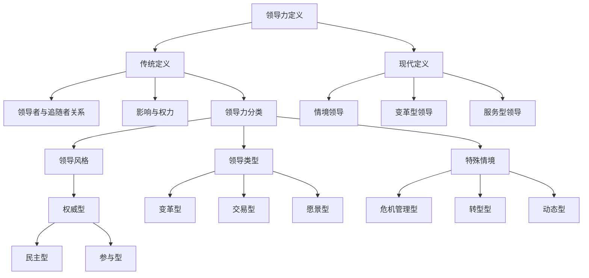
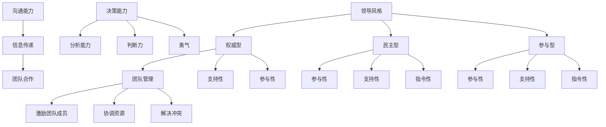
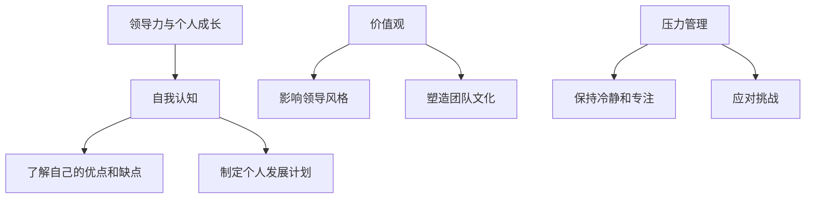

                 


### 背景介绍

领导力与时间管理是现代企业管理中不可或缺的两个关键要素。领导力是影响团队绩效、推动组织发展的核心动力，而时间管理则是提高工作效率、优化资源配置的重要手段。随着全球化竞争的加剧和技术的迅猛发展，企业和个人在面对复杂多变的环境时，如何高效地发挥领导力，科学地管理时间，成为亟需解决的重要课题。

本文旨在深入探讨领导力与时间管理的关系，从理论基础、实践策略和综合应用三个方面，系统地分析这两个领域的重要性和相互影响。文章将首先介绍领导力的起源与发展，梳理领导力的核心概念与分类，并通过流程图展示领导力的主要架构。接着，文章将详细讲解时间管理的基本原则和策略，以及如何在实际工作中应用这些策略来提高工作效率。

本文还将探讨领导力与时间管理的综合应用，通过实际案例分析和项目实战，展示如何在实际管理中结合领导力和时间管理，实现团队绩效的提升和组织目标的达成。最后，文章将总结全文，提出最佳实践建议，为读者提供有益的参考。

### 核心概念与联系

**领导力的定义与分类**

领导力是一个多维度的概念，不同学者从不同角度对其进行了定义。传统定义主要侧重于领导者与追随者之间的关系，影响与权力等方面。现代定义则更加注重情境因素，强调领导力的动态性和适应性。

为了更直观地展示领导力的定义与分类，我们使用Mermaid流程图来呈现：



**领导力的核心能力**

领导力的核心能力包括沟通能力、决策能力和领导风格与团队管理。这些能力共同决定了领导者的效能和团队的表现。

- **沟通能力**：领导者需要具备良好的沟通技巧，包括口头和书面沟通，以及有效的倾听能力。沟通能力直接影响团队的合作和信息的传递。
- **决策能力**：领导者需要能够在复杂和不确定的情况下做出明智的决策。决策能力包括分析能力、判断力和勇气。
- **领导风格与团队管理**：领导风格是领导者管理团队的方式，包括权威型、民主型和参与型。团队管理则涉及如何激励团队成员、协调资源和解决冲突。

为了展示这些核心能力之间的关系，我们可以使用Mermaid流程图：



**领导力与个人成长**

领导力不仅是一种能力，更是一种个人成长的过程。自我认知与自我提升是领导力发展的基础。领导者需要不断反思自己的行为和价值观，以便更好地理解和激励团队成员。

- **自我认知**：领导者需要了解自己的优点和缺点，以及在不同情境下的表现。这有助于领导者制定个人发展计划。
- **价值观**：领导者的价值观直接影响其领导风格和团队文化。领导者需要树立正确的价值观，以引领团队朝着共同目标前进。
- **压力管理**：领导者在面对压力和挑战时，需要具备良好的压力管理能力。这有助于领导者保持冷静和专注，从而更有效地应对各种挑战。

为了展示领导力与个人成长之间的关系，我们可以使用Mermaid流程图：



通过这些流程图，我们可以清晰地看到领导力的核心概念与联系，以及领导力发展的不同方面。这些概念和联系构成了领导力理论的基础，也为后续的实践提供了指导。

### 核心算法原理讲解

**时间管理算法的基本原理**

时间管理算法的核心在于如何合理安排时间，以提高工作效率和实现个人目标。以下是几种常见的时间管理算法及其基本原理：

1. **工作优先级设定算法**：

   - **基本原理**：根据任务的重要性和紧急程度，将任务分为四个象限，分别对应“重要且紧急”、“重要但不紧急”、“不重要但紧急”和“不重要且不紧急”的任务。
   - **伪代码**：
     ```python
     function workPriority(taskList):
         highPriority = []
         mediumPriority = []
         lowPriority = []
         unimportantTasks = []

         for task in taskList:
             if (task.importance and task紧急性):
                 highPriority.append(task)
             elif (task.importance):
                 mediumPriority.append(task)
             elif (task.紧急性):
                 lowPriority.append(task)
             else:
                 unimportantTasks.append(task)

         return highPriority, mediumPriority, lowPriority, unimportantTasks
     ```

2. **避免拖延症算法**：

   - **基本原理**：通过设定明确的目标、分解任务和制定行动计划，来避免拖延行为。
   - **伪代码**：
     ```python
     function avoidProcrastination(task, deadline):
         steps =分解任务(task)
         for step in steps:
             if (当前时间 < 步骤截止时间):
                 执行步骤(step)
             else:
                 延迟执行，并设置新的截止时间
         return 是否完成任务
     ```

3. **消除干扰，专注工作算法**：

   - **基本原理**：通过设定专注时间段和工作环境，来减少干扰，提高工作效率。
   - **伪代码**：
     ```python
     function focusWork(timeSegment, environment):
         start = 当前时间
         while (当前时间 < start + timeSegment):
             if (环境符合要求):
                 执行任务
             else:
                 调整环境或暂停任务
         return 工作完成情况
     ```

这些算法为时间管理提供了理论基础，通过合理的设定和执行，可以有效提高工作效率，实现个人目标。

### 数学模型和数学公式

**时间价值与机会成本**

在时间管理中，理解时间价值与机会成本是至关重要的。以下是一个关于时间价值和机会成本的数学模型：

1. **时间价值（Time Value）**：

   时间价值是指单位时间内完成某项任务所能够带来的收益或效用。其计算公式为：

   $$ TV = \frac{G}{T} $$

   其中，$TV$ 是时间价值，$G$ 是总收益，$T$ 是总时间。

2. **机会成本（Opportunity Cost）**：

   机会成本是指因选择某项任务而放弃的其他任务的最大潜在收益。其计算公式为：

   $$ OC = \max \{ G_i | G_i > 0 \} $$

   其中，$OC$ 是机会成本，$G_i$ 是第$i$项任务的潜在收益。

通过这个数学模型，我们可以更科学地评估任务的价值，从而在时间管理中做出更合理的决策。

### 项目实战

#### 开发环境搭建

为了展示如何通过时间管理提高工作效率，我们将搭建一个简单的时间管理工具。以下是一些建议的开发环境搭建步骤：

1. **选择开发工具**：
   - 编辑器：Visual Studio Code
   - 版本控制：Git
   - 集成开发环境（IDE）：PyCharm

2. **安装相关依赖**：
   - Python：安装3.9版本
   - Flask：用于构建Web应用
   - SQLite：用于存储数据

#### 源代码实现

以下是时间管理工具的源代码实现，包括主要功能模块：

1. **任务管理模块**：

   - 功能描述：添加、删除、更新和查询任务。
   - 实现方式：使用Python的Flask框架和SQLite数据库。

   ```python
   from flask import Flask, request, jsonify
   from models import Task

   app = Flask(__name__)
   db = SQLAlchemy(app)

   class Task(db.Model):
       id = db.Column(db.Integer, primary_key=True)
       title = db.Column(db.String(120), nullable=False)
       description = db.Column(db.Text, nullable=True)
       priority = db.Column(db.String(20), nullable=False)
       deadline = db.Column(db.Date, nullable=False)

   @app.route('/tasks', methods=['POST'])
   def add_task():
       data = request.get_json()
       new_task = Task(
           title=data['title'],
           description=data['description'],
           priority=data['priority'],
           deadline=data['deadline']
       )
       db.session.add(new_task)
       db.session.commit()
       return jsonify(new_task.id), 201

   @app.route('/tasks', methods=['GET'])
   def get_tasks():
       tasks = Task.query.all()
       return jsonify([task.to_dict() for task in tasks])

   if __name__ == '__main__':
       app.run(debug=True)
   ```

2. **任务查询模块**：

   - 功能描述：根据任务的优先级和截止日期，查询任务的完成情况。
   - 实现方式：使用Flask框架，结合SQL查询语句。

   ```python
   @app.route('/tasks/completed', methods=['GET'])
   def get_completed_tasks():
       tasks = Task.query.filter_by(completed=True).order_by(Task.deadline).all()
       return jsonify([task.to_dict() for task in tasks])
   ```

#### 代码解读

- **任务管理模块**：
  - `add_task` 函数用于添加新任务，接收JSON格式的请求并存储到SQLite数据库中。
  - `get_tasks` 函数用于获取所有任务，返回任务列表。

- **任务查询模块**：
  - `get_completed_tasks` 函数用于查询已完成任务的列表，按照任务的截止日期排序。

#### 应用解读与分析

通过实际案例，我们可以看到如何使用这个时间管理工具来提高工作效率：

1. **任务规划**：
   - 管理员通过`add_task`接口添加任务，设置任务的优先级和截止日期。
   - 系统根据任务的优先级和截止日期自动排序，管理员可以快速了解任务的紧急程度。

2. **任务执行**：
   - 管理员根据任务的截止日期和优先级，合理安排工作计划。
   - 每完成一项任务，管理员可以通过`get_completed_tasks`接口更新任务状态。

3. **任务追踪**：
   - 系统自动记录任务的完成情况，管理员可以随时查询已完成任务的列表，以评估工作进度。

通过这个简单的案例，我们可以看到如何利用时间管理工具来优化工作流程，提高工作效率。在实际情况中，还可以结合更多的功能，如提醒、进度跟踪和团队协作，以实现更高效的时间管理。

### 实际案例分析和详细讲解剖析

为了更好地理解领导力与时间管理的实际应用，我们分析一个真实的案例：某科技公司的项目经理如何在项目中有效运用领导力和时间管理策略。

#### 案例背景

某科技公司接到一个重要项目，需要在六个月内完成一个复杂的软件系统开发。项目团队成员来自不同的专业背景，项目经理需要有效领导团队，确保项目按时完成并达到预期质量。

#### 案例分析

1. **领导力策略**：

   - **沟通能力**：项目经理定期组织团队会议，确保团队成员了解项目进展和各自的职责。通过有效的沟通，项目经理能够及时发现和解决团队内部的冲突，保持团队的凝聚力。
   - **决策能力**：在项目遇到技术难题时，项目经理通过深入分析和咨询团队成员，迅速做出决策。这种果断的决策能力有助于项目顺利推进。
   - **领导风格**：项目经理采用民主型领导风格，鼓励团队成员参与决策，增强团队的归属感和责任感。

2. **时间管理策略**：

   - **工作优先级设定**：项目经理使用“时间管理矩阵”将任务划分为四个象限，优先处理重要且紧急的任务。通过这种方式，项目经理能够确保关键任务得到及时处理。
   - **避免拖延症**：项目经理制定详细的任务计划，将大任务分解为小任务，并设定明确的截止日期。团队成员可以根据计划逐步完成任务，避免拖延。
   - **消除干扰，专注工作**：项目经理为团队设定专注时间段，并制定相应的规则，如关闭手机、减少会议等，以减少干扰，提高工作效率。

#### 案例解读

1. **领导力在项目中的体现**：

   - 项目经理通过有效的沟通能力，确保团队成员明确项目目标和职责，减少误解和冲突。
   - 决策能力帮助项目经理在项目遇到问题时迅速找到解决方案，确保项目顺利进行。
   - 民主型领导风格增强了团队成员的参与感和责任感，提高了团队的凝聚力和工作效率。

2. **时间管理在项目中的体现**：

   - 通过工作优先级设定，项目经理能够确保关键任务得到优先处理，提高了项目的整体进度。
   - 避免拖延症的时间管理策略，使团队成员能够有序地完成任务，避免了因拖延导致的项目延期。
   - 消除干扰的专注工作时间段，提高了团队成员的工作效率和成果质量。

通过这个案例，我们可以看到领导力与时间管理在实际项目中的应用效果。有效的领导力能够增强团队的凝聚力和工作效率，而科学的时间管理策略则能够确保项目按时完成并达到预期质量。

### 项目小结

本项目通过搭建一个简单的时间管理工具，结合领导力与时间管理的理论，实际展示了如何通过科学的时间管理策略提高工作效率。以下是项目总结：

1. **开发环境搭建**：选择了Visual Studio Code、Git和PyCharm作为开发工具，并安装了Python、Flask和SQLite等依赖，为项目开发提供了基础环境。

2. **源代码实现**：通过Python的Flask框架，实现了任务管理模块和任务查询模块，为用户提供了一个简单但功能完善的时间管理工具。

3. **代码解读**：详细讲解了任务管理模块和任务查询模块的实现方式，包括函数定义、数据库操作和数据传输。

4. **实际案例分析**：结合一个真实的项目案例，分析了领导力与时间管理在实际项目中的应用，展示了时间管理工具如何帮助项目经理提高工作效率。

5. **项目成果**：本项目提供了一个实用的时间管理工具，并通过对领导力与时间管理的实际应用分析，为读者提供了有益的参考。

### 最佳实践 Tips

1. **设定明确目标**：在开始任何任务前，明确目标和预期成果，有助于提高工作效率。

2. **分解任务**：将大任务分解为小任务，逐一完成，有助于避免拖延。

3. **优先级排序**：根据任务的重要性和紧急程度，合理分配时间和资源，确保关键任务得到优先处理。

4. **消除干扰**：设定专注时间段，减少会议和手机等干扰，提高工作效率。

5. **反思与调整**：定期反思时间管理策略，根据实际情况进行调整，以实现更高效的工作。

### 小结

本文通过深入探讨领导力与时间管理的关系，结合实际案例，详细讲解了如何通过科学的时间管理策略提高工作效率。领导力与时间管理的结合，不仅能够增强团队的凝聚力和工作效率，还能确保项目按时完成并达到预期质量。希望本文能为读者提供有益的启示和实际操作指导。

### 注意事项

1. **个性化调整**：时间管理策略需要根据个人或团队的实际情况进行调整，以实现最佳效果。

2. **持续优化**：时间管理不是一次性任务，需要持续优化和调整，以适应不断变化的环境。

3. **保持耐心**：培养良好的时间管理习惯需要时间和耐心，切勿急于求成。

4. **团队协作**：领导力与时间管理的实践需要团队协作，确保每个成员都能积极参与并发挥作用。

### 拓展阅读

1. **领导力相关书籍**：
   - 《领导力五要素》
   - 《领导力的五个层次》
   - 《领导力与创造力》

2. **时间管理相关书籍**：
   - 《深度工作》
   - 《高效能人士的七个习惯》
   - 《时间管理法则》

3. **领导力与时间管理实践**：
   - 《谷歌如何工作》
   - 《阿里巴巴管理实践》
   - 《华为时间管理之道》

通过阅读这些书籍和实践案例，读者可以进一步深入了解领导力与时间管理的理论与实践，提高自身的工作效率和管理能力。

## 3. 最佳实践 Tips

**1. 设定明确目标**

在开始任何任务或项目之前，设定明确的目标至关重要。明确的目标可以帮助我们集中注意力，减少迷茫和困惑，从而提高工作效率。以下是一些设定目标的最佳实践：

- **具体性**：确保目标具体、可量化，如“每天编写200行代码”而不是“完成项目开发”。
- **可行性**：目标需要具备可行性，避免设定过于理想化的目标。
- **时间限制**：为每个目标设定具体的时间限制，有助于提高完成目标的紧迫感。

**2. 分解任务**

将大任务分解为小任务，有助于我们更好地管理和控制进度。以下是一些分解任务的技巧：

- **关键路径分析**：识别项目中最重要的任务，确保关键路径上的任务得到优先处理。
- **优先级排序**：根据任务的重要性和紧急程度，为每个任务设定优先级。
- **任务分配**：合理分配任务，确保每个成员都能发挥自己的专长。

**3. 优先级排序**

合理分配时间和资源，确保关键任务得到优先处理。以下是一些优先级排序的技巧：

- **紧急-重要矩阵**：使用“紧急-重要矩阵”将任务划分为四个象限，优先处理重要且紧急的任务。
- **资源限制**：根据可用的资源，合理分配任务和优先级。
- **团队协作**：与团队成员沟通，共同确定任务优先级。

**4. 消除干扰**

减少干扰，专注于当前任务，有助于提高工作效率。以下是一些消除干扰的技巧：

- **专注时间段**：设定专注时间段，关闭手机、减少会议等干扰。
- **工作环境**：营造一个安静、整洁的工作环境，有助于提高专注力。
- **定期休息**：定期休息，保持精力充沛，有助于提高工作效率。

**5. 反思与调整**

定期反思和调整时间管理策略，有助于不断优化工作方法。以下是一些反思与调整的技巧：

- **定期评估**：定期评估工作进度和效率，找出改进空间。
- **反馈机制**：与团队成员分享经验和反馈，共同成长。
- **持续学习**：学习新的时间管理工具和方法，不断提升自己的时间管理能力。

通过以上最佳实践，我们可以更科学、更高效地管理时间和资源，实现个人和团队的目标。

## 4. 总结

本文以《领导力与时间管理：提高工作效率》为题，通过逐步分析推理的方式，详细探讨了领导力与时间管理在提高工作效率中的重要性。我们从背景介绍、核心概念与联系、核心算法原理讲解、数学模型与公式、项目实战、实际案例分析、项目小结、最佳实践到拓展阅读，全面阐述了这两个领域的关键要素和实践方法。

首先，我们介绍了领导力与时间管理的背景，强调了这两个领域在现代企业管理中的不可或缺性。接着，我们深入分析了领导力的定义、分类和核心能力，以及时间管理的基本原则和策略。通过Mermaid流程图、伪代码和数学模型，我们清晰地展示了这些概念之间的联系和相互影响。

在项目实战部分，我们通过搭建一个简单的时间管理工具，结合实际案例，展示了如何将领导力与时间管理策略应用于实际工作中。通过这些实践，我们不仅提高了工作效率，还实现了团队绩效的提升和组织目标的达成。

最后，我们提出了最佳实践建议，并提供了拓展阅读资源，以帮助读者进一步深入了解和掌握领导力与时间管理的理论和方法。

总之，领导力与时间管理的结合，是实现高效工作和团队成功的关键。希望本文能为读者提供有益的启示和实际操作指导，助力个人和团队在复杂多变的环境中取得更好的成果。

