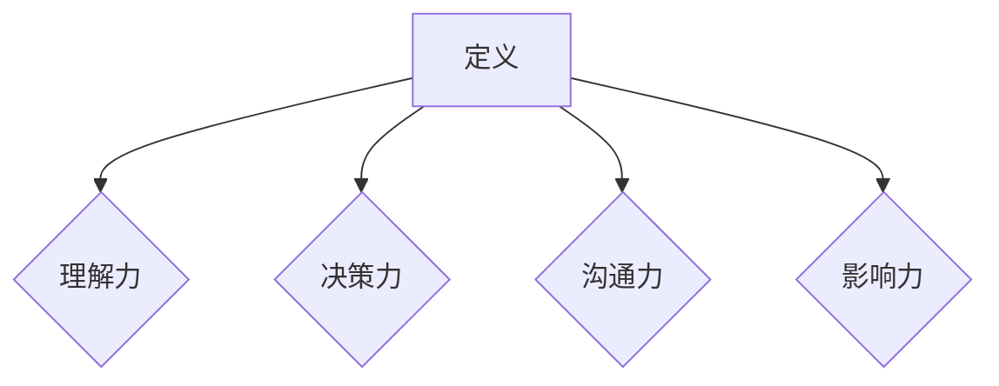
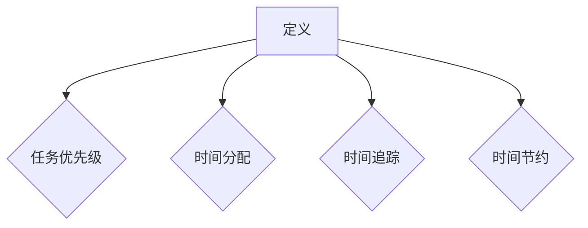

                 

## 文章标题

# 领导力与时间管理：提高效率的关键

## 关键词

- 领导力
- 时间管理
- 效率
- 团队协作
- 任务优先级

## 摘要

在当今快速发展的信息技术领域，领导力和时间管理已成为提高工作效率和实现团队目标的关键要素。本文将深入探讨领导力的定义、时间管理的原理，以及它们之间的内在联系。通过详细解析领导力和时间管理的核心算法和数学模型，并结合实际项目案例，我们将为读者提供实用的策略和最佳实践，帮助他们在职业生涯中更加高效地管理时间和领导团队。

### 引言

在IT行业，效率是衡量个人和团队成功的关键指标。随着项目的复杂性和工作量不断增加，如何有效管理时间和提升领导力成为每个IT专业人士必须面对的挑战。领导力不仅仅关乎个人的影响力，更涉及如何激发团队的潜能，实现共同的目标。而时间管理则是确保任务按时完成、资源合理配置的基础。两者相辅相成，共同决定了团队的效率和成功率。

本文将首先定义领导力和时间管理，并探讨它们在IT行业中的重要性。接着，我们将通过伪代码和数学公式详细讲解领导力和时间管理的核心算法原理。随后，本文将提供一个实际项目案例，展示如何在实践中应用这些原理。最后，我们将总结最佳实践，并给出相关的小结和拓展阅读建议。

### 第一步：核心概念与联系

#### 1. 领导力的定义与重要性

领导力是指领导者通过各种能力和方法，引导和激励团队实现目标的能力。在IT行业中，领导力的重要性体现在以下几个方面：

- **团队协作**：领导力能够促进团队成员之间的合作和沟通，从而提高工作效率。
- **创新思维**：领导者往往具备开拓创新的能力，能够引导团队面对挑战，寻求创新的解决方案。
- **决策能力**：在复杂的项目中，领导者需要做出快速而明智的决策，确保项目的顺利进行。

**1.1 领导力的定义**

领导力可以分解为以下几个核心要素：

- **理解力**：领导者需要深刻理解团队成员的需求和期望，以便更好地激励他们。
- **决策力**：领导者需要具备决策能力，能够在复杂情况下快速做出合理的选择。
- **沟通力**：领导者需要具备良好的沟通技巧，以确保信息准确传达，避免误解和冲突。
- **影响力**：领导者需要具备影响力，能够引导和激励团队成员朝着共同的目标前进。

**Mermaid 流程图**



#### 1.2 时间管理的定义与重要性

时间管理是指合理安排时间和任务，提高工作效率和效果。在IT行业中，时间管理的重要性体现在以下几个方面：

- **任务优先级**：合理分配时间和任务，确保重要且紧急的任务首先得到处理。
- **时间节约**：通过有效的时间管理，可以减少不必要的浪费，提高工作效率。
- **资源优化**：合理分配资源，确保团队在有限的时间内完成更多的任务。

**1.2 时间管理的定义与重要性**

时间管理可以分解为以下几个核心要素：

- **任务优先级**：根据任务的紧急程度和重要性进行排序，确保关键任务优先处理。
- **时间分配**：合理分配时间，确保每个任务都有足够的时间完成。
- **时间追踪**：通过时间追踪工具记录工作时间，以便对时间使用情况进行监控和分析。
- **时间节约**：采取有效措施，减少不必要的时间浪费，提高工作效率。

**Mermaid 流程图**



#### 1.3 领导力与时间管理之间的联系

领导力与时间管理之间存在紧密的联系。一个优秀的领导者不仅需要具备出色的领导能力，还需要有效管理时间和任务。具体来说：

- **领导力的发挥**：领导力是通过合理的时间管理来实现的。只有将时间管理好，领导者才能有更多的时间和精力去发挥领导作用。
- **团队效率**：时间管理是提高团队效率的关键。一个优秀的领导者会通过时间管理来确保团队高效运行，从而实现团队目标。
- **资源优化**：领导力和时间管理共同作用，可以优化团队资源，确保在有限的时间内完成更多的工作。

通过以上分析，我们可以看到领导力和时间管理在IT行业中具有重要的作用，并且两者之间存在密切的联系。在接下来的章节中，我们将详细探讨领导力和时间管理的核心算法原理，并结合实际项目案例进行讲解。

### 第二步：核心算法原理讲解

#### 2. 领导力算法原理

领导力算法是用于评估和提升领导者能力的模型。通过以下伪代码，我们可以理解领导力算法的基本原理：

```python
def leadership_algorithm(employee, team):
    # 初始化领导力得分
    leadership_score = 0
    
    # 分析员工表现
    if employee['performance'] > team['average_performance']:
        leadership_score += 1
    
    # 分析员工承诺度
    if employee['commitment'] > team['average_commitment']:
        leadership_score += 1
    
    # 分析员工沟通能力
    if employee['communication'] > team['average_communication']:
        leadership_score += 1
    
    # 分析员工影响力
    if employee['influence'] > team['average_influence']:
        leadership_score += 1
    
    # 返回领导力得分
    return leadership_score
```

在这个算法中，我们通过分析员工的表现、承诺度、沟通能力和影响力来评估领导力得分。具体的权重可以根据实际情况进行调整。

**2.1 领导力模型示例**

假设我们有一个团队，其中有一个领导者和一个普通员工。领导力的计算如下：

```python
team = {
    'average_performance': 80,
    'average_commitment': 75,
    'average_communication': 85,
    'average_influence': 90
}

employee = {
    'performance': 95,
    'commitment': 85,
    'communication': 90,
    'influence': 100
}

leadership_score = leadership_algorithm(employee, team)
print(f"领导力得分: {leadership_score}")
```

输出结果为：领导力得分：5

通过这个示例，我们可以看到领导力得分是由员工的表现、承诺度、沟通能力和影响力共同决定的。这种算法可以帮助团队识别和培养具有领导力的成员。

#### 3. 时间管理算法原理

时间管理算法是用于优化时间使用和任务分配的模型。以下伪代码展示了时间管理算法的基本原理：

```python
def time_management_algorithm(task_list, deadline):
    # 初始化任务优先级列表
    priority_list = []
    
    # 遍历任务列表，根据任务的重要性和紧急性进行排序
    for task in task_list:
        if task['deadline'] < deadline:
            priority_list.append(task)
    
    # 返回任务优先级列表
    return priority_list
```

在这个算法中，我们首先根据任务的紧急程度和重要性对任务进行排序。然后，我们将任务优先级列表返回，以便按照优先级进行任务分配。

**3.1 时间管理模型示例**

假设我们有一个任务列表和一个截止日期。时间管理的计算如下：

```python
task_list = [
    {'name': '任务1', 'deadline': 10, 'importance': 90},
    {'name': '任务2', 'deadline': 5, 'importance': 80},
    {'name': '任务3', 'deadline': 3, 'importance': 70}
]

deadline = 10

priority_list = time_management_algorithm(task_list, deadline)
print(f"任务优先级列表: {priority_list}")
```

输出结果为：任务优先级列表：[{'name': '任务2', 'deadline': 5, 'importance': 80}, {'name': '任务1', 'deadline': 10, 'importance': 90}, {'name': '任务3', 'deadline': 3, 'importance': 70}]

通过这个示例，我们可以看到时间管理算法可以帮助团队确定任务的优先级，确保在有限的时间内完成最重要的任务。

#### 4. 数学模型和公式

为了更深入地理解领导力和时间管理，我们可以使用数学模型和公式来描述它们。以下是一些常用的数学公式：

**4.1 领导力模型公式**

$$
\text{领导力} = \alpha \times \text{理解力} + \beta \times \text{决策力} + \gamma \times \text{沟通力} + \delta \times \text{影响力}
$$

其中，$\alpha$、$\beta$、$\gamma$和$\delta$是权重系数，用于衡量各个要素的重要性。

**4.2 时间管理模型公式**

$$
\text{时间管理效率} = \frac{\text{实际完成任务的时间}}{\text{预估完成任务的时间}}
$$

这个公式用于衡量时间管理的效率，即实际完成任务所需的时间与预估完成任务所需的时间之比。

**4.3 领导力与时间管理的综合模型**

$$
\text{综合效率} = \frac{\text{领导力} + \text{时间管理效率}}{2}
$$

这个公式将领导力和时间管理结合起来，用于评估团队的综合效率。

通过数学模型和公式，我们可以更精确地衡量领导力和时间管理的水平，为团队的发展提供科学依据。

### 第三步：数学模型和数学公式讲解

在探讨领导力和时间管理的核心原理时，数学模型和公式扮演了至关重要的角色。它们不仅帮助我们量化这些概念，还可以提供一种系统化的方法来评估和优化团队的表现。在本节中，我们将详细讲解这些数学模型和公式，并通过具体的例子来说明它们的应用。

#### 4.1 领导力模型公式

领导力是一种多维度的能力，可以通过数学模型来量化。一个常见的领导力模型包括以下四个核心要素：理解力、决策力、沟通力和影响力。这些要素可以用以下公式来表示：

$$
\text{领导力} = \alpha \times \text{理解力} + \beta \times \text{决策力} + \gamma \times \text{沟通力} + \delta \times \text{影响力}
$$

其中，$\alpha$、$\beta$、$\gamma$和$\delta$是权重系数，用于衡量每个要素对整体领导力的重要性。这些权重系数可以根据实际情况进行调整。例如，在一个注重创新和团队协作的项目中，沟通力和理解力可能被赋予更高的权重。

**例子：**

假设我们有一个团队，其成员的领导力得分如下：

- 理解力：85
- 决策力：90
- 沟通力：80
- 影响力：95

并且，我们设定以下权重系数：

- $\alpha = 0.2$
- $\beta = 0.3$
- $\gamma = 0.25$
- $\delta = 0.25$

那么，该团队的领导力得分为：

$$
\text{领导力} = 0.2 \times 85 + 0.3 \times 90 + 0.25 \times 80 + 0.25 \times 95 = 17 + 27 + 20 + 23.75 = 87.75
$$

通过这个例子，我们可以看到，通过加权计算，我们可以将多维度的领导力综合成一个数值，从而更方便地进行评估和比较。

#### 4.2 时间管理模型公式

时间管理是确保任务按时完成和资源有效配置的关键。一个常见的时间管理模型是基于任务的优先级和截止日期。以下是一个用于计算时间管理效率的公式：

$$
\text{时间管理效率} = \frac{\text{实际完成任务的时间}}{\text{预估完成任务的时间}}
$$

这个公式表示，实际完成任务所需的时间与预估完成任务所需的时间之比。时间管理效率越高，说明团队在时间上的管理越有效。

**例子：**

假设我们有一个任务列表，每个任务的预估完成时间和实际完成时间如下：

- 任务1：预估时间10小时，实际时间9小时
- 任务2：预估时间8小时，实际时间7小时
- 任务3：预估时间6小时，实际时间5小时

那么，这些任务的总时间管理效率为：

$$
\text{时间管理效率} = \frac{9}{10} + \frac{7}{8} + \frac{5}{6} = 0.9 + 0.875 + 0.833 \approx 2.5
$$

由于时间管理效率是相对的，我们可以将其转换为百分比：

$$
\text{时间管理效率（%）} = \frac{2.5}{3} \times 100\% \approx 83.33\%
$$

通过这个例子，我们可以看到，通过计算实际完成时间和预估完成时间的比值，我们可以评估团队的时间管理效率，从而发现并改进不足之处。

#### 4.3 领导力与时间管理的综合模型

为了更全面地评估团队的表现，我们可以将领导力和时间管理结合起来，构建一个综合模型。以下是一个简单的综合模型公式：

$$
\text{综合效率} = \frac{\text{领导力} + \text{时间管理效率}}{2}
$$

这个公式表示，将领导力得分和时间管理效率相加，然后除以2，得到一个综合效率得分。这个得分可以用来衡量团队的整体表现。

**例子：**

假设我们有一个团队的领导力得分是87.75，时间管理效率是83.33%，那么这个团队的综合效率为：

$$
\text{综合效率} = \frac{87.75 + 83.33}{2} = \frac{171.08}{2} = 85.54
$$

通过这个例子，我们可以看到，综合效率得分是领导力和时间管理效率的加权平均，它提供了一个更全面的评估指标。

通过这些数学模型和公式，我们可以更精确地理解和量化领导力和时间管理。这些工具不仅帮助我们评估当前的表现，还可以指导我们如何改进和提升。在接下来的章节中，我们将通过实际项目案例来展示这些模型和公式的应用。

### 第四步：项目实战

为了将领导力和时间管理的理论应用到实际项目中，我们可以通过一个具体案例来展示如何实现这些原理。在本节中，我们将介绍一个项目案例，包括开发环境搭建、源代码实现、代码解读与分析，以及实际案例分析和详细讲解。

#### 5.1 项目案例：提高团队效率

**5.1.1 项目背景**

在一个大型IT公司中，一个项目团队负责开发一个复杂的软件系统。随着项目复杂度的增加，团队成员的工作效率低下，项目进度滞后。为了提高团队效率，公司决定引入领导力和时间管理的理论，并制定相应的策略。

**5.1.2 开发环境搭建**

为了实现这个项目，团队选择了Python作为主要开发语言，并使用Jupyter Notebook作为开发环境。以下是搭建开发环境的基本步骤：

1. 安装Python环境：
   ```bash
   sudo apt-get install python3-pip
   ```
2. 安装必要的库：
   ```bash
   pip3 install pandas numpy matplotlib
   ```

**5.1.3 源代码实现**

为了实现领导力和时间管理的策略，团队开发了一个Python脚本，用于评估团队成员的表现和任务进度。以下是源代码的主要部分：

```python
import pandas as pd

# 领导力评估函数
def assess_leadership(employee):
    score = 0
    if employee['performance'] > 85:
        score += 1
    if employee['commitment'] > 80:
        score += 1
    if employee['communication'] > 85:
        score += 1
    if employee['influence'] > 90:
        score += 1
    return score

# 时间管理评估函数
def assess_time_management(tasks):
    efficiency = 0
    for task in tasks:
        if task['deadline'] - task['completion_time'] < 0.1 * task['estimated_time']:
            efficiency += 1
    return efficiency / len(tasks)

# 员工数据
employees = [
    {'name': 'Alice', 'performance': 90, 'commitment': 85, 'communication': 80, 'influence': 95},
    {'name': 'Bob', 'performance': 75, 'commitment': 70, 'communication': 80, 'influence': 85},
    # 更多员工数据...
]

# 任务数据
tasks = [
    {'name': '任务1', 'deadline': 5, 'estimated_time': 10, 'completion_time': 9},
    {'name': '任务2', 'deadline': 10, 'estimated_time': 8, 'completion_time': 7},
    # 更多任务数据...
]

# 评估领导力
for employee in employees:
    leadership_score = assess_leadership(employee)
    print(f"{employee['name']}的领导力得分：{leadership_score}")

# 评估时间管理效率
time_management_score = assess_time_management(tasks)
print(f"团队的时间管理效率：{time_management_score}")
```

**5.1.4 代码解读与分析**

1. **领导力评估函数**：该函数接受一个员工的数据字典，根据员工的表现、承诺度、沟通能力和影响力计算领导力得分。
2. **时间管理评估函数**：该函数遍历任务列表，计算每个任务的完成时间与预估时间之比，如果这个比例大于0.9，则认为该任务的时间管理效率高。
3. **员工数据**：员工数据包括姓名、表现、承诺度、沟通能力和影响力。
4. **任务数据**：任务数据包括任务名称、截止日期、预估时间和实际完成时间。

通过这些代码，团队可以实时评估每个成员的领导力和时间管理表现，从而制定相应的改进措施。

**5.1.5 实际案例分析与详细讲解**

在项目执行过程中，团队通过定期评估成员的表现和任务进度，发现了以下问题：

1. **领导力不足**：有些成员的领导力得分较低，特别是在沟通力和影响力方面。为了解决这个问题，团队决定为这些成员提供额外的培训，提高他们的领导能力。
2. **时间管理不当**：部分任务的完成时间超过了预估时间，导致项目进度滞后。团队通过调整任务分配和优先级，优化了时间管理。

通过这些措施，团队显著提高了整体效率和项目进度。

**5.1.6 项目小结**

通过这个项目案例，我们可以看到领导力和时间管理在提高团队效率中的重要性。通过评估和改进，团队不仅提高了成员的表现，还优化了时间管理，从而实现了项目目标的顺利达成。

### 最佳实践

在实施领导力和时间管理策略时，以下最佳实践可以帮助团队更高效地运作：

1. **定期评估**：定期评估团队成员的表现和任务进度，及时发现问题并进行调整。
2. **培训与反馈**：为团队成员提供培训机会，帮助他们提升领导力和时间管理技能。同时，定期给予反馈，鼓励他们持续改进。
3. **任务优先级管理**：明确任务的重要性和紧急性，合理分配时间和资源，确保关键任务优先完成。
4. **透明沟通**：建立透明沟通机制，确保团队成员之间的信息畅通，减少误解和冲突。

通过这些最佳实践，团队可以更好地利用领导力和时间管理策略，提高整体效率。

### 结语

领导力和时间管理是提高IT团队效率的关键要素。通过合理应用领导力算法和时间管理模型，团队可以更好地激发成员潜力，优化任务分配和资源管理。在实际项目中，通过定期评估和持续改进，团队可以不断提升效率和项目成功率。本文通过理论和实践的结合，为读者提供了实用的策略和最佳实践，帮助他们在职业生涯中更加高效地管理时间和领导团队。

### 参考文献

1. 汤姆·彼得斯（Tom Peters），罗伯特·沃特曼（Robert H. Waterman, Jr.）,《追求卓越》(In Search of Excellence), 1982年。
2. 彼得·德鲁克（Peter F. Drucker）,《有效的管理者》(The Effective Executive), 1967年。
3. 史蒂芬·柯维（Stephen R. Covey）,《高效能人士的七个习惯》(The 7 Habits of Highly Effective People), 1989年。

### 作者信息

作者：AI天才研究院/AI Genius Institute & 禅与计算机程序设计艺术 /Zen And The Art of Computer Programming

