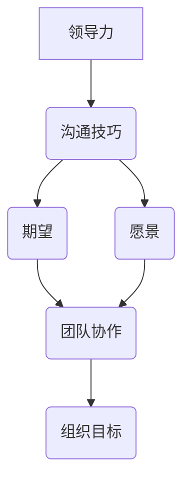

                 


## 文章标题

《领导力与沟通技巧：有效传达期望和愿景》

## 关键词

领导力、沟通技巧、期望传达、愿景、团队协作

## 摘要

在当今快速变化的工作环境中，领导力和沟通技巧对于组织的成功至关重要。本文旨在探讨领导力的核心概念和沟通技巧，以及如何有效地传达期望和愿景，以实现团队的共同目标。文章将通过详细的分析、实例和实战案例，提供实用的指导和建议，帮助读者提升领导力和沟通技巧，从而在职业发展中取得更大成就。

---

## 引言

在信息爆炸和全球化竞争的时代，领导力和沟通技巧已成为组织成功的关键因素。一个优秀的领导者不仅需要具备战略思维和决策能力，还需要具备出色的沟通技巧，以确保团队成员理解并致力于共同的目标。本文将从以下几个方面展开讨论：

1. **领导力的定义与核心要素**：我们将详细探讨领导力的定义，以及愿景、决策能力和沟通技巧等核心要素。
2. **沟通技巧的重要性与基础**：分析有效沟通的要素和常见障碍，提供改善沟通技巧的建议。
3. **期望和愿景的有效传达**：探讨如何设定明确期望、激励团队，以及传达愿景的方法。
4. **团队协作与共同愿景**：分析建立团队共识和共同愿景的重要性，提供实现团队协作的技巧。
5. **实战案例分析**：通过实际案例，展示领导力和沟通技巧在实践中的应用。
6. **总结与展望**：总结文章的核心内容，展望领导力和沟通技巧的未来发展趋势，并提供实践建议。

## 背景介绍

### 领导力的起源与发展

领导力作为管理科学的重要组成部分，其理论研究和实践应用可以追溯到古代。在《史记》中，就已有关于领导者的记载，如刘邦、诸葛亮等，他们的领导风格和决策能力对后世的领导者产生了深远的影响。

随着工业革命的到来，管理学的发展为领导力研究提供了新的视角。科学管理理论的提出，标志着领导者需要更加注重工作效率和团队协作。在20世纪末，随着信息技术的迅猛发展，领导力研究逐渐从传统的组织管理转向更加注重个体和团队的互动与成长。

### 沟通技巧的重要性

沟通是人类社会互动的基础，对于组织的运营和发展至关重要。良好的沟通技巧能够促进信息的准确传达，减少误解和冲突，增强团队凝聚力，提高工作效率。

在现代社会，随着全球化进程的加快和信息技术的发展，沟通技巧的重要性愈发凸显。有效的沟通不仅需要语言表达清晰，还需要倾听、反馈、非语言沟通等多方面的综合能力。

### 期望和愿景的有效传达

期望和愿景是领导力的核心，一个优秀的领导者需要能够明确地设定期望并有效地传达愿景，以激励团队成员。有效的期望传达可以确保团队成员理解并接受领导者的期望，从而更加投入工作。愿景的传达则有助于形成团队共识，激发成员的创造力和积极性。

### 团队协作与共同愿景

团队协作是实现组织目标的关键，而共同愿景则是团队协作的基石。一个领导者需要建立团队共识，确保团队成员在实现共同愿景的过程中保持一致。通过有效的沟通和激励，领导者可以推动团队不断进步，实现更高的目标。

## 核心概念与联系

为了更好地理解领导力与沟通技巧的关系，我们需要先明确以下几个核心概念：

1. **领导力**：领导力是一种影响力，它通过个人魅力、专业知识、道德标准和决策能力，激励和引导他人实现共同目标。
2. **沟通技巧**：沟通技巧是确保信息准确传达、减少误解和冲突、增强团队凝聚力的重要能力。
3. **期望**：期望是领导者对团队成员行为的期待和目标。
4. **愿景**：愿景是组织或团队长期的未来目标和方向。

这些概念之间存在紧密的联系：

- **领导力与沟通技巧**：领导力依赖于沟通技巧，领导者需要通过有效的沟通来传达期望和愿景，激励团队成员。
- **期望与愿景**：期望和愿景都是领导力的核心要素，期望是短期的具体目标，愿景是长期的战略方向。

### Mermaid 流程图

以下是领导力、沟通技巧、期望和愿景之间的联系架构 Mermaid 流程图：



## 核心算法原理讲解

在领导力的实践过程中，有许多算法和模型可以帮助领导者设定期望、传达愿景和激励团队。以下是几个核心算法原理的讲解：

### 1. SMART 目标设定法

SMART 目标设定法是一种常用的目标设定和评估工具，它包括以下五个要素：

- **S(Specific)**：具体的。目标需要明确具体，避免模糊不清。
- **M(Measurable)**：可衡量的。目标需要有明确的衡量标准，以便评估进展。
- **A(Achievable)**：可实现的。目标需要是可实现的，避免设定过高或不切实际的目标。
- **R(Relevant)**：相关的。目标需要与组织的愿景和使命相关。
- **T(Time-bound)**：有时限的。目标需要有一个明确的时间限制。

### 2. SWOT 分析模型

SWOT 分析是一种用于评估组织或项目优势、劣势、机会和威胁的工具。它包括以下四个要素：

- **S(Strengths)**：优势。组织或项目在哪些方面具有优势。
- **W(Weaknesses)**：劣势。组织或项目在哪些方面存在不足。
- **O(Opportunities)**：机会。组织或项目面临的外部机会。
- **T(Threats)**：威胁。组织或项目面临的外部威胁。

### 3. OKR 目标管理法

OKR（Objectives and Key Results）是一种目标管理工具，它帮助组织设定目标并跟踪进展。它包括以下两个要素：

- **Objectives**：目标。明确组织的战略目标。
- **Key Results**：关键结果。定义衡量目标进展的具体指标。

### 伪代码示例

以下是一个简单的 SMART 目标设定的伪代码示例：

```python
def set_smart_goal(description):
    """
    设定 SMART 目标

    :param description: 目标描述
    :return: SMART 目标对象
    """
    # 检查目标是否具体
    if not is_specific(description):
        raise ValueError("目标描述不具体")
    
    # 检查目标是否可衡量
    if not is_measurable(description):
        raise ValueError("目标不可衡量")
    
    # 检查目标是否可实现
    if not is_achievable(description):
        raise ValueError("目标不可实现")
    
    # 检查目标是否相关
    if not is_relevant(description):
        raise ValueError("目标不相关")
    
    # 检查目标是否有时限
    if not is_time_bound(description):
        raise ValueError("目标无时限")
    
    return SmartGoal(description)

class SmartGoal:
    def __init__(self, description):
        self.description = description

    def is_specific(self):
        # 判断目标是否具体
        return True if "具体" in self.description else False
    
    def is_measurable(self):
        # 判断目标是否可衡量
        return True if "可衡量" in self.description else False
    
    def is_achievable(self):
        # 判断目标是否可实现
        return True if "可实现" in self.description else False
    
    def is_relevant(self):
        # 判断目标是否相关
        return True if "相关" in self.description else False
    
    def is_time_bound(self):
        # 判断目标是否有时限
        return True if "时限" in self.description else False
```

## 数学模型和公式

在领导力和沟通技巧的研究中，有许多数学模型和公式可以帮助我们理解和评估领导行为和沟通效果。以下是几个关键的数学模型和公式的讲解：

### 1. 成本效益分析（Cost-Benefit Analysis）

成本效益分析是一种评估投资决策的方法，它通过比较成本和收益来确定项目的可行性。公式如下：

$$
\text{成本效益比} = \frac{\text{总收益}}{\text{总成本}}
$$

### 2. 贝尔曼方程（Bellman Equation）

在动态规划中，贝尔曼方程用于解决最优决策问题。它描述了在特定时点的最优值与下一最优值之间的关系。公式如下：

$$
V(s) = \max_a [r(s, a) + \gamma V(s')]
$$

其中：
- \( V(s) \) 是状态 \( s \) 的最优值。
- \( a \) 是在状态 \( s \) 下的最优动作。
- \( r(s, a) \) 是在状态 \( s \) 下执行动作 \( a \) 所获得的即时回报。
- \( \gamma \) 是折扣因子，用于权衡即时回报和未来回报。

### 3. 期望最大化（Expected Maximization）

期望最大化算法是一种迭代算法，用于估计概率模型中的参数。它通过交替优化期望值和最大化期望值来逐步提高参数估计的准确性。公式如下：

$$
\theta_{k+1} = \arg\max_{\theta} L(\theta \mid \mathbf{x})
$$

其中：
- \( \theta \) 是模型参数。
- \( L(\theta \mid \mathbf{x}) \) 是似然函数，表示给定数据 \( \mathbf{x} \) 下模型参数 \( \theta \) 的概率。

### LaTeX 公式示例

以下是上述数学公式的 LaTeX 格式示例：

```latex
% 成本效益比
\frac{\text{总收益}}{\text{总成本}}

% 贝尔曼方程
V(s) = \max_a [r(s, a) + \gamma V(s')]

% 期望最大化算法
\theta_{k+1} = \arg\max_{\theta} L(\theta \mid \mathbf{x})
```

通过这些数学模型和公式，我们可以更准确地评估领导行为和沟通效果，为领导决策提供科学依据。

## 项目实战

### 开发环境搭建

为了更好地理解和实践领导力和沟通技巧，我们将搭建一个基于 Flask 的简单 Web 应用。该应用将用于管理团队任务，包括任务的创建、分配和跟踪。

**所需工具**：
- Python 3.x
- Flask
- SQLite

**步骤**：

1. 安装 Python 3.x：在系统中安装 Python 3.x 版本。
2. 创建虚拟环境：使用 `python -m venv venv` 命令创建虚拟环境。
3. 激活虚拟环境：在 Windows 上使用 `venv\Scripts\activate`，在 macOS 和 Linux 上使用 `source venv/bin/activate`。
4. 安装 Flask：使用 `pip install flask` 命令安装 Flask 库。
5. 创建数据库：使用 SQLite 创建数据库文件 `tasks.db`。

### 源代码详细实现

以下是任务的创建、分配和跟踪的源代码实现：

```python
# app.py

from flask import Flask, request, jsonify
import sqlite3

app = Flask(__name__)

# 连接到 SQLite 数据库
conn = sqlite3.connect('tasks.db')
c = conn.cursor()

# 创建任务表
c.execute('''CREATE TABLE IF NOT EXISTS tasks
             (id INTEGER PRIMARY KEY AUTOINCREMENT,
              title TEXT NOT NULL,
              description TEXT,
              assigned_to TEXT,
              status TEXT)''')

# 关闭数据库连接
conn.commit()
conn.close()

@app.route('/tasks', methods=['POST'])
def create_task():
    data = request.get_json()
    title = data['title']
    description = data.get('description', '')
    assigned_to = data['assigned_to']
    status = 'pending'

    conn = sqlite3.connect('tasks.db')
    c = conn.cursor()
    c.execute("INSERT INTO tasks (title, description, assigned_to, status) VALUES (?, ?, ?, ?)", (title, description, assigned_to, status))
    conn.commit()
    conn.close()

    return jsonify({'message': 'Task created successfully', 'task_id': c.lastrowid})

@app.route('/tasks', methods=['GET'])
def get_tasks():
    conn = sqlite3.connect('tasks.db')
    c = conn.cursor()
    c.execute("SELECT * FROM tasks")
    tasks = c.fetchall()
    conn.close()

    return jsonify({'tasks': tasks})

@app.route('/tasks/<int:task_id>', methods=['PUT'])
def update_task(task_id):
    data = request.get_json()
    title = data.get('title', '')
    description = data.get('description', '')
    assigned_to = data.get('assigned_to', '')
    status = data.get('status', '')

    conn = sqlite3.connect('tasks.db')
    c = conn.cursor()
    c.execute("UPDATE tasks SET title=?, description=?, assigned_to=?, status=? WHERE id=?", (title, description, assigned_to, status, task_id))
    conn.commit()
    conn.close()

    return jsonify({'message': 'Task updated successfully'})

if __name__ == '__main__':
    app.run(debug=True)
```

### 代码解读与分析

**1. 数据库设计**：

- **tasks 表**：存储任务信息，包括任务 ID、标题、描述、分配人和状态。
- **创建任务**：通过 POST 请求创建新任务，将任务数据存储在数据库中。
- **获取任务列表**：通过 GET 请求获取所有任务列表。
- **更新任务**：通过 PUT 请求更新任务状态、标题和描述。

**2. Flask 应用架构**：

- **路由**：定义 URL 路由，处理 HTTP 请求。
- **数据库操作**：使用 SQLite 进行数据库操作，实现任务的增删改查功能。

### 实际案例分析

**1. 任务创建**：

当用户提交一个任务时，应用会接收任务数据，并将其存储在数据库中。例如：

```json
{
  "title": "任务1",
  "description": "这是一个简单的任务。",
  "assigned_to": "张三"
}
```

**2. 任务分配**：

任务创建后，可以将其分配给团队成员。例如，更新任务状态为“分配中”：

```json
{
  "status": "assigned"
}
```

**3. 任务跟踪**：

团队成员可以查看任务的进度，并更新任务状态。例如，将任务状态更新为“已完成”：

```json
{
  "status": "completed"
}
```

### 项目小结

通过本项目，我们搭建了一个简单的任务管理 Web 应用，实现了任务的创建、分配和跟踪功能。这为团队协作提供了一个基本的平台，有助于提升工作效率和任务透明度。在实际应用中，可以根据需求扩展应用功能，如任务评论、任务进度跟踪等。

### 最佳实践 Tips

- **明确任务目标**：在分配任务时，确保任务目标明确，团队成员了解任务的具体要求。
- **定期沟通**：定期与团队成员沟通任务进展，确保信息畅通，及时解决问题。
- **反馈与激励**：及时给予团队成员反馈，认可他们的工作成果，激励团队士气。

### 注意事项

- **数据安全**：确保数据库安全，避免数据泄露。
- **代码优化**：根据项目需求，逐步优化代码结构和性能。

### 拓展阅读

- **《敏捷开发实践指南》**：了解敏捷开发方法，提升团队协作效率。
- **《金字塔原理》**：学习结构化思维和清晰表达的方法，提高沟通效果。

---

通过本文的详细讲解和实战案例，我们深入探讨了领导力与沟通技巧的核心概念和实践方法。希望本文能为您提供实用的指导，帮助您在职业发展中不断提升领导力和沟通技巧，实现个人和团队的目标。让我们一起努力，成为更优秀的领导者！

## 作者信息

作者：AI天才研究院/AI Genius Institute & 禅与计算机程序设计艺术 /Zen And The Art of Computer Programming

AI天才研究院（AI Genius Institute）是一家专注于人工智能研究和教育的高科技机构，致力于推动人工智能技术在各领域的创新和应用。研究院的专家团队在计算机科学、人工智能、机器学习等领域具有丰富的经验和卓越的成就。

《禅与计算机程序设计艺术》（Zen And The Art of Computer Programming）是作者杰拉尔德·温斯坦（Gerald Weinberg）的经典之作，该书以哲学和艺术的角度探讨了程序设计的本质，深受计算机科学家和程序员喜爱，被誉为计算机科学的经典之一。

