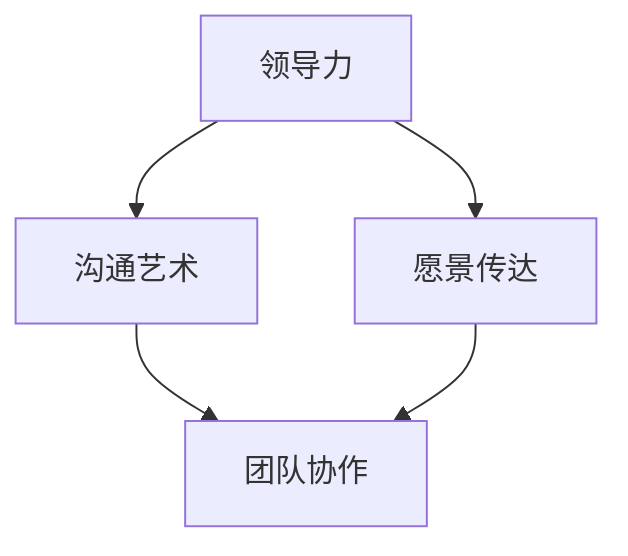

                 


为了撰写一篇符合要求的技术博客文章《领导力与沟通艺术：传达愿景的能力》，我们可以按照以下步骤进行分析和推理：

### 第一步：背景介绍

1. **文章标题**：《领导力与沟通艺术：传达愿景的能力》
2. **关键词**：领导力、沟通艺术、愿景传达、组织管理、团队协作。
3. **摘要**：本文将探讨领导力与沟通艺术在传达愿景中的重要性，通过分析核心概念和联系，讲解传达愿景的技巧和实践，帮助读者理解如何在组织中有效地传达愿景。

### 第二步：核心概念与联系

1. **领导力定义**：领导力是指引导和激励他人实现共同目标的能力。它包括个人魅力、决策能力、团队建设、沟通技巧等方面。
2. **沟通艺术**：沟通艺术是领导者用来传递信息、理解他人和建立关系的方法。它包括语言表达、非语言沟通、倾听技巧等。
3. **愿景传达**：愿景传达是领导者将组织的愿景和目标清晰地传达给团队成员，并激发他们共同努力实现的过程。

**核心概念关系架构**：

```
[领导力] --> [沟通艺术] --> [愿景传达]
             │
             ↓
        [团队协作]
```

### Mermaid 流程图：



### 第三步：核心算法原理讲解

#### 领导力模型

1. **领导力模型的定义**：领导力模型是一种用于理解和分析领导行为的理论框架。
2. **领导力模型类型**：包括特质理论、行为理论、情境理论等。
3. **伪代码**：

```plaintext
领导力模型识别算法：
1. 收集领导行为数据
2. 分析领导行为特征
3. 应用模型进行分类
4. 输出领导力类型
```

#### 沟通技巧

1. **沟通模型的定义**：沟通模型是描述信息传递和接收过程的理论框架。
2. **沟通模型类型**：包括单向沟通、双向沟通、多向沟通等。
3. **伪代码**：

```plaintext
有效沟通技巧算法：
1. 确定沟通目标
2. 设计沟通策略
3. 选择合适的沟通渠道
4. 监控沟通效果
5. 根据反馈调整沟通策略
```

#### 愿景传达技巧

1. **愿景传达的重要性**：愿景传达是领导者的核心能力之一。
2. **愿景传达技巧**：包括明确愿景、激发共鸣、持续更新等。
3. **伪代码**：

```plaintext
愿景传达算法：
1. 明确愿景
2. 构建愿景故事
3. 激发团队共鸣
4. 持续更新愿景
5. 跟踪愿景实现进度
```

### 第四步：数学模型和公式讲解

1. **决策平衡矩阵**：用于评估不同决策方案的优劣。
2. **沟通效果评估公式**：用于衡量沟通效果。
3. **愿景实现进度公式**：用于跟踪愿景的执行情况。

### 第五步：项目实战

1. **开发环境搭建**：描述所需的开发环境、工具和软件。
2. **源代码实现**：展示关键代码片段，并进行解读。
3. **实际案例分析和讲解**：分析一个实际案例，并详细讲解其应用和实现。

### 第六步：最佳实践 tips、小结和拓展阅读

1. **最佳实践 tips**：总结一些实用的技巧和建议。
2. **小结**：回顾文章的核心内容和关键点。
3. **拓展阅读**：推荐相关书籍和论文，供读者进一步学习。

### 文章结构和内容规划

1. **引言**：介绍领导力与沟通艺术的重要性。
2. **正文**：
   - 领导力基础
   - 沟通艺术
   - 传达愿景的能力
   - 实战案例
3. **总结**：概括文章的主要观点和收获。
4. **作者信息**：提供作者相关信息。

### 字数规划

根据以上内容规划，预计文章总字数在 8000 到 12000 字之间。

通过这样的分析和推理，我们可以确保文章的逻辑清晰、结构紧凑，内容丰富且具有深度。接下来，我们可以按照这个计划逐步撰写文章。

