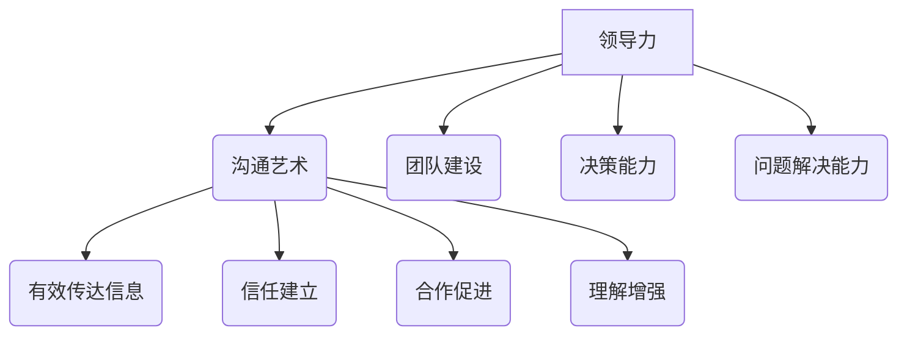
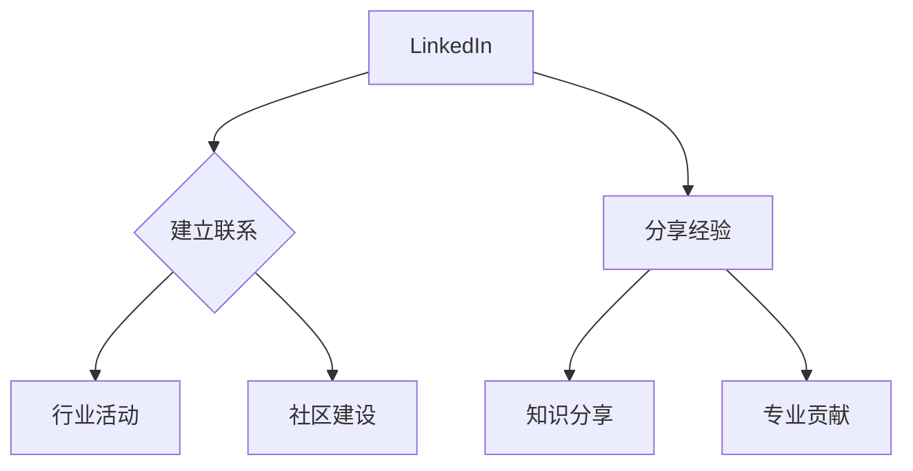
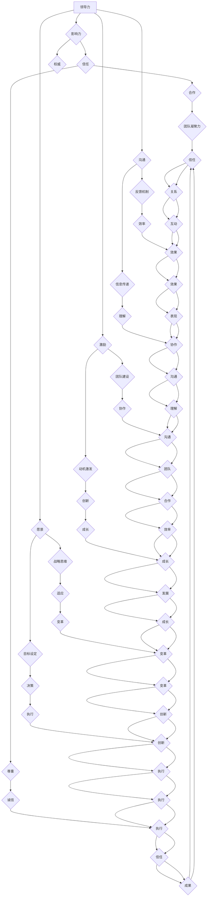

                 

### 文章标题：领导力与沟通艺术：有效传达信息

### 关键词：领导力，沟通艺术，有效传达信息，沟通障碍，信息传递模型，影响力，团队协作，实际案例分析

### 摘要：

本文旨在探讨领导力与沟通艺术在信息传达中的关键作用。首先，我们将介绍领导力的基本概念，并分析其在现代组织管理中的重要性。接着，我们将深入探讨沟通艺术的核心原则，包括沟通的定义、过程、障碍以及克服策略。然后，文章将展示领导力与沟通艺术如何结合，形成有效的信息传递模式。通过一系列实际案例，我们将分析如何在实际工作中应用这些原则。最后，文章将总结领导力与沟通艺术在信息传达中的关键要素，并提供实用的最佳实践建议。

## 第1章 引言

### 1.1 引言

在当今快速变化和高度互联的世界中，领导力和沟通艺术已成为组织成功的关键要素。有效的领导力不仅关乎如何指导和管理团队，更关乎如何有效地传达信息，从而实现组织的目标。沟通艺术则是领导力的核心组成部分，它关乎如何清晰、准确地传递信息，以避免误解和冲突。

#### 1.1.1 书籍的背景和目的

本篇文章的目的是帮助读者深入了解领导力与沟通艺术在信息传达中的重要性，并提供实用的策略和技巧。通过本篇文章的学习，读者将能够：

1. 掌握领导力的基本概念和重要性。
2. 理解沟通艺术的核心原则和方法。
3. 学会如何将领导力与沟通艺术相结合，实现有效的信息传达。
4. 通过实际案例分析，了解如何在各种情境中应用这些原则。

#### 1.1.2 领导力与沟通艺术的重要性

领导力是组织成功的关键。一个优秀的领导者不仅能够激励团队成员，还能有效地协调资源，推动组织向前发展。有效的领导力包括明确的目标设定、有效的沟通、团队建设、决策能力和问题解决能力等。

沟通艺术则是领导力的核心组成部分。沟通不仅是信息的传递，更是建立信任、促进合作和理解的重要手段。在一个组织内部，良好的沟通能够提高工作效率，减少误解和冲突，增强团队的凝聚力。

在信息爆炸的时代，信息的有效传达显得尤为重要。无论是领导者在团队中的决策，还是团队成员之间的协作，都需要依赖有效的沟通。本篇文章将通过详细的分析和实际案例，帮助读者理解如何将领导力与沟通艺术相结合，实现有效的信息传达。

#### 1.1.3 书籍的结构与内容概述

本篇文章分为八个主要章节：

1. **第1章 引言**：介绍领导力与沟通艺术在信息传达中的重要性，并概述书籍的目的和结构。
2. **第2章 领导力的基本概念**：探讨领导力的定义、特点、类型以及领导者的影响力。
3. **第3章 沟通的基本原则**：介绍沟通的定义、过程、障碍以及克服策略。
4. **第4章 领导力与沟通艺术的结合**：分析领导力与沟通艺术如何结合，形成有效的信息传递模式。
5. **第5章 领导力与沟通艺术在不同场景中的应用**：讨论领导力与沟通艺术在团队和企业中的应用。
6. **第6章 有效传达信息的关键要素**：分析有效传达信息的关键要素和方法。
7. **第7章 实战案例分析**：通过实际案例，展示如何应用领导力与沟通艺术实现有效传达信息。
8. **第8章 总结与展望**：总结本书的主要内容和启示，并对未来的领导力与沟通艺术发展进行展望。

通过以上章节的阅读，读者将能够系统地了解领导力与沟通艺术在信息传达中的关键作用，并在实际工作中应用这些原则，提高组织沟通效率和团队协作能力。

#### 1.1.4 领导力与沟通艺术的Mermaid流程图（简化的领导力与沟通艺术关系图）



这个Mermaid流程图展示了领导力与沟通艺术之间的关系，以及它们如何共同作用于信息传达。通过这个图，读者可以更直观地理解领导力与沟通艺术在信息传达中的相互影响。

### 1.2 领导力的基本概念

#### 1.2.1 领导力的定义与特点

领导力是一种复杂的社会现象，它涉及多个层面的能力和特质。根据Dion Hinchliffe的定义，领导力是指“在团队中通过影响和激励他人来实现共同目标的能力”。这个定义强调了领导力的核心要素，即影响力和目标导向。

领导力的特点包括以下几个方面：

1. **激励性**：领导力能够激发团队成员的积极性和潜能，使他们为实现组织目标而努力。
2. **协调性**：领导者需要协调团队内部和外部的各种资源和关系，以推动项目的进展。
3. **前瞻性**：领导力要求领导者具备远见和战略思维，能够预见未来的挑战和机遇。
4. **适应性**：领导力需要领导者具备灵活性和适应性，能够根据不同情境调整领导风格和方法。

#### 1.2.2 领导力的类型

领导力可以分为多种类型，每种类型都有其独特的特点和应用场景。以下是几种常见的领导力类型：

1. **权威型领导力**：权威型领导者通过权力和控制来指导团队。这种领导风格适用于紧急情况或需要快速决策的情境。
2. **民主型领导力**：民主型领导者鼓励团队成员参与决策过程，强调团队合作和共识。这种领导风格适用于需要创新和团队协作的项目。
3. **变革型领导力**：变革型领导者通过激励和激发团队成员的内在动机，推动组织的变革和发展。这种领导风格适用于组织转型和创新的情境。
4. **关系型领导力**：关系型领导者注重建立和维护良好的人际关系，通过信任和尊重来影响团队成员。这种领导风格适用于需要高度合作和团队凝聚力的项目。

#### 1.2.3 领导力与管理的区别

领导力和管理是两个相关但不同的概念。管理是组织内部的一种职能，它涉及计划、组织、领导和控制等活动，以确保组织目标的实现。领导力则是推动组织变革和发展的核心力量。

领导力与管理的区别主要体现在以下几个方面：

1. **焦点不同**：管理关注的是现有资源的合理利用和组织目标的实现，而领导力关注的是未来方向和愿景的设定。
2. **作用方式不同**：管理通过制度和流程来规范组织行为，而领导力通过激励、影响和引导来推动组织变革。
3. **持续影响不同**：管理的作用是短期和具体的，而领导力的影响是长期和广泛的。

尽管领导力和管理有区别，但两者密不可分。有效的领导力需要管理者具备良好的管理技能，而成功的管理也需要领导力的支持。

### 1.3 领导者的影响力

领导者的影响力是领导力的核心要素之一。它决定了领导者能否有效地推动组织发展和实现目标。领导者的影响力可以通过以下几个方面来建立：

1. **专业知识**：领导者需要具备丰富的专业知识和经验，这是建立影响力的基础。
2. **个人魅力**：领导者需要具备个人魅力，包括自信、正直和积极的态度，以吸引和激励团队成员。
3. **影响力工具**：领导者可以使用各种影响力工具，如权威、感召力和影响力网络，来增强自己的影响力。
4. **信任**：信任是领导者影响力的基石。领导者需要通过诚信、透明和责任感来建立和维护信任。

通过建立影响力，领导者可以更有效地传达信息，推动组织的变革和发展。

## 第2章 领导力的基本概念

### 2.1 领导力的定义与特点

领导力是一个多维度的概念，它涉及多个方面的能力和特质。为了深入理解领导力，首先需要明确其定义和特点。

#### 2.1.1 领导力的定义

领导力是一种在团队中通过影响和激励他人来实现共同目标的能力。这种能力不仅包括对团队成员的直接影响，还包括对团队氛围和组织文化的塑造。领导力不同于管理，虽然管理也涉及指导和协调，但其主要关注的是任务和目标的实现，而领导力则更侧重于推动变革和激发团队潜力。

领导力可以定义为以下几个核心要素：

1. **影响力**：领导者能够通过自己的行为和决策影响团队成员的态度和行为。
2. **愿景**：领导者需要有远见和愿景，能够为团队和组织设定明确的目标和方向。
3. **激励**：领导者需要能够激发团队成员的内在动机，使他们为实现共同目标而努力。
4. **沟通**：领导者需要具备良好的沟通技巧，能够清晰、有效地传达信息和指导。

#### 2.1.2 领导力的特点

领导力具有以下几个显著特点：

1. **激励性**：领导力能够激发团队成员的积极性和创造力，使他们愿意为实现共同目标而努力。
2. **协调性**：领导者需要协调团队内部和外部的各种资源和关系，以推动项目的进展。
3. **前瞻性**：领导力要求领导者具备远见和战略思维，能够预见未来的挑战和机遇。
4. **适应性**：领导力需要领导者具备灵活性和适应性，能够根据不同情境调整领导风格和方法。

#### 2.1.3 领导力的类型

领导力可以分为多种类型，每种类型都有其独特的特点和应用场景。以下是几种常见的领导力类型：

1. **权威型领导力**：权威型领导者通过权力和控制来指导团队。这种领导风格适用于紧急情况或需要快速决策的情境。权威型领导者通常具有明确的决策权和执行权，能够迅速做出决策并推动执行。

   ```plaintext
   权威型领导力的伪代码：
   function authoritative Leadership(context, decision):
       if context == urgent:
           decision = makeDecision(context)
           executeDecision(decision)
       else:
           delegateDecision(decision)
   ```

2. **民主型领导力**：民主型领导者鼓励团队成员参与决策过程，强调团队合作和共识。这种领导风格适用于需要创新和团队协作的项目。民主型领导者通常通过开放的沟通和讨论来收集团队成员的意见，并在综合各方意见的基础上做出决策。

   ```plaintext
   民主型领导力的伪代码：
   function democratic Leadership(context, decision):
       if context == collaborative:
           gatherOpinions(teamMembers)
           decision = consensusDecision(opinions)
           executeDecision(decision)
       else:
           delegateDecision(decision)
   ```

3. **变革型领导力**：变革型领导者通过激励和激发团队成员的内在动机，推动组织的变革和发展。这种领导风格适用于组织转型和创新的情境。变革型领导者通常具备强烈的愿景和使命感，能够激发团队成员的变革意识，并带领团队实现变革。

   ```plaintext
   变革型领导力的伪代码：
   function transformational Leadership(context, vision):
       if context == transformational:
           inspireTeam(vision)
           executeTransformation(vision)
       else:
           maintainStatus quo
   ```

4. **关系型领导力**：关系型领导者注重建立和维护良好的人际关系，通过信任和尊重来影响团队成员。这种领导风格适用于需要高度合作和团队凝聚力的项目。关系型领导者通常通过真诚的沟通和关怀来建立信任，并以此为基础推动团队的协作和发展。

   ```plaintext
   关系型领导力的伪代码：
   function relational Leadership(context, trust):
       if context == interpersonal:
           buildTrust(teamMembers)
           encourageCollaboration(trust)
       else:
           manageDiversity
   ```

每种领导力类型都有其适用的场景和优势，领导者需要根据实际情况灵活选择和运用不同的领导风格。

### 2.2 领导者的影响力

领导者的影响力是领导力的核心要素之一。它决定了领导者能否有效地推动组织发展和实现目标。领导者的影响力可以通过以下几个方面来建立：

1. **专业知识**：领导者需要具备丰富的专业知识和经验，这是建立影响力的基础。专业知识的深度和广度使得领导者能够在团队中发挥决策者和指导者的角色。

2. **个人魅力**：领导者需要具备个人魅力，包括自信、正直和积极的态度，以吸引和激励团队成员。个人魅力能够增强领导者的号召力和影响力。

3. **影响力工具**：领导者可以使用各种影响力工具，如权威、感召力和影响力网络，来增强自己的影响力。权威是通过职位和权力来影响他人，感召力是通过个人价值观和愿景来激励他人，影响力网络则是通过建立和维护人际关系来扩大影响力。

4. **信任**：信任是领导者影响力的基石。领导者需要通过诚信、透明和责任感来建立和维护信任。信任关系一旦建立，将有助于领导者更有效地传达信息，推动组织的变革和发展。

#### 2.2.1 增强影响力的方法

要增强领导者的影响力，可以采取以下几种方法：

1. **提升自身素质**：领导者需要不断学习和提升自身的素质，包括专业知识和领导能力。通过参加培训、阅读相关书籍和参与实践经验，领导者可以不断提高自己的能力和影响力。

2. **建立信任关系**：领导者需要与团队成员建立真诚的信任关系。这可以通过透明、诚信和责任感来实现。领导者应该主动倾听团队成员的意见和需求，并在决策过程中充分考虑他们的建议。

3. **树立榜样**：领导者需要通过自己的行为来树立榜样，以影响和激励团队成员。领导者应该展现出积极、正直和负责任的态度，并在工作中努力践行自己的价值观。

4. **建立有效的沟通机制**：领导者需要建立有效的沟通机制，以确保信息的有效传递和反馈。通过定期的会议、报告和讨论，领导者可以与团队成员保持良好的沟通，并及时解决问题和冲突。

5. **激励团队成员**：领导者需要通过激励措施来激发团队成员的积极性和创造力。这可以通过提供奖励、认可和晋升机会来实现。领导者应该关注团队成员的个人发展和职业规划，并给予他们必要的支持和资源。

通过以上方法，领导者可以增强自身的影响力，更有效地推动组织发展和实现目标。

### 2.3 建立个人品牌

在领导力的实践中，建立个人品牌是提高影响力的重要手段。个人品牌不仅代表了领导者的形象和声誉，更是其在组织内外建立信任和尊重的基础。以下是如何建立和维护个人品牌的方法：

#### 2.3.1 定义个人品牌

建立个人品牌的第一步是明确个人品牌的定义。个人品牌应体现领导者的核心价值观、专业领域和独特优势。例如，一个技术领导者可能将其个人品牌定义为“技术卓越与创新推动者”。

#### 2.3.2 提升专业技能

提升专业技能是建立个人品牌的核心。领导者应不断学习和掌握最新的技术和管理方法，以保持在专业领域的领先地位。通过参加专业培训、获得证书和参与行业会议，领导者可以展示其专业能力和持续学习的态度。

```latex
提升专业技能的公式：
Personal Skills = Learning + Experience + Practice
```

#### 2.3.3 塑造正面形象

正面形象是个人品牌的重要组成部分。领导者应通过言行一致、诚实守信和积极的态度来塑造正面形象。在公共场合和社交媒体上，领导者应注意自己的言行，避免发表负面或争议性言论。

#### 2.3.4 建立影响力网络

建立影响力网络是扩大个人品牌影响力的关键。领导者应积极参与行业活动和社区建设，与同行建立联系，并通过分享知识和经验来增强自己的影响力。通过社交媒体平台，如LinkedIn和Twitter，领导者可以与全球范围内的专业人士进行互动。



#### 2.3.5 维护品牌

建立个人品牌是一个持续的过程。领导者需要不断维护和更新自己的品牌，以适应市场和行业的变化。通过定期评估个人品牌的定位和影响力，领导者可以及时调整品牌策略，确保其与当前需求和期望保持一致。

通过以上方法，领导者可以成功地建立和维护个人品牌，从而提高自己在组织内外的影响力。

### 2.4 领导力的核心概念与联系

在深入理解领导力的过程中，明确核心概念及其之间的联系至关重要。以下是一个基于Mermaid绘制的流程图，展示了领导力的核心概念及其相互关系：



该流程图清晰地展示了领导力的核心概念及其相互之间的联系。例如，影响力（B）与信任（F）、愿景（C）与目标设定（H）等概念之间的互动关系。通过这个流程图，我们可以更直观地理解领导力的复杂性和多层次性，从而更好地应用和实践领导力。

### 2.5 核心算法原理讲解

在理解领导力的核心概念之后，我们接下来将探讨一些关键的算法原理，这些原理在领导力实践中起着重要作用。这些算法可以帮助领导者更有效地进行决策、协调和激励团队。

#### 2.5.1 决策算法

决策算法是领导力的核心组成部分，它涉及如何从多个备选方案中选择最佳方案。以下是几种常见的决策算法：

1. **最大化效用算法**：这种算法基于决策者的偏好和期望效用值来选择最佳方案。伪代码如下：

   ```plaintext
   function maximizeUtility(outcomes, probabilities):
       utilityValues = []
       for outcome in outcomes:
           utilityValue = probability * outcome
           utilityValues.append(utilityValue)
       bestOutcome = max(utilityValues)
       return bestOutcome
   ```

2. **最小化损失算法**：这种算法基于决策者愿意接受的最小损失来选择最佳方案。伪代码如下：

   ```plaintext
   function minimizeLoss(outcomes, probabilities):
       lossValues = []
       for outcome in outcomes:
           lossValue = probability * (1 - outcome)
           lossValues.append(lossValue)
       worstOutcome = min(lossValues)
       return worstOutcome
   ```

3. **贝叶斯决策算法**：这种算法基于贝叶斯定理，考虑先验概率、条件概率和后验概率来选择最佳方案。伪代码如下：

   ```plaintext
   function bayesianDecision(outcomes, priorProbabilities, likelihoods):
       posteriorProbabilities = []
       for outcome in outcomes:
           posteriorProbability = priorProbability * likelihood / sum(likelihoods)
           posteriorProbabilities.append(posteriorProbability)
       bestOutcome = max(posteriorProbabilities)
       return bestOutcome
   ```

#### 2.5.2 协调算法

协调算法旨在优化团队内部的合作和资源分配，以提高整体效率。以下是几种常见的协调算法：

1. **市场机制**：市场机制通过价格和供需关系来协调资源分配。伪代码如下：

   ```plaintext
   function marketMechanism(resources, demands):
       prices = calculatePrices(resources, demands)
       allocations = []
       for resource in resources:
           allocation = resource / sum(prices)
           allocations.append(allocation)
       return allocations
   ```

2. **博弈论**：博弈论通过分析参与者之间的策略互动来协调行为。伪代码如下：

   ```plaintext
   function gameTheory(strategies, payoffs):
       bestStrategy = []
       for strategy in strategies:
           maxPayoff = max(payoffs[strategy])
           bestStrategy.append(strategy)
       return bestStrategy
   ```

3. **多目标优化**：多目标优化通过考虑多个目标函数来协调资源分配。伪代码如下：

   ```plaintext
   function multiObjectiveOptimization(Objective1, Objective2, constraints):
       solutions = findSolutions(Objective1, Objective2, constraints)
       bestSolution = selectBestSolution(solutions)
       return bestSolution
   ```

#### 2.5.3 激励算法

激励算法旨在激发团队成员的内在动机，以提高其工作积极性和创造力。以下是几种常见的激励算法：

1. **目标设置理论**：目标设置理论通过设定具体、可衡量和有挑战性的目标来激发团队成员的内在动机。伪代码如下：

   ```plaintext
   function goalSettingTheory(goals, teamMembers):
       for member in teamMembers:
           member.goal = setGoal(goal, member)
           member.incentive = calculateIncentive(member.goal)
       return teamMembers
   ```

2. **强化学习**：强化学习通过奖励和惩罚来调整团队成员的行为，以最大化长期奖励。伪代码如下：

   ```plaintext
   function reinforcementLearning(actions, rewards, policy):
       for action in actions:
           reward = calculateReward(action, policy)
           updatePolicy(policy, reward)
       return policy
   ```

3. **公平理论**：公平理论通过考虑团队成员之间的相对贡献和报酬来激发公平感，从而提高工作积极性。伪代码如下：

   ```plaintext
   function fairnessTheory(contributions, rewards):
       for member in members:
           perceivedFairness = calculateFairness(contributions, rewards)
           if perceivedFairness < threshold:
               adjustReward(member)
       return members
   ```

通过以上算法，领导者可以在决策、协调和激励团队方面采取更科学和有效的方法，从而提高领导力和团队的整体绩效。

### 2.6 数学模型和公式

在领导力实践中，数学模型和公式可以帮助领导者更好地理解和应用相关概念。以下是几个关键领域的数学模型和公式，以及它们的详细讲解和举例说明。

#### 2.6.1 概率论模型

概率论模型在领导力中广泛应用，特别是在决策分析和风险评估中。一个常见的概率论模型是贝叶斯定理，它用于计算后验概率。

**贝叶斯定理公式：**
$$ P(A|B) = \frac{P(B|A) \cdot P(A)}{P(B)} $$

**详细讲解：**
贝叶斯定理描述了在已知某个事件B发生的条件下，事件A发生的概率。公式中的 \( P(A|B) \) 表示在事件B发生的情况下事件A的概率， \( P(B|A) \) 表示在事件A发生的情况下事件B的概率， \( P(A) \) 是事件A的先验概率， \( P(B) \) 是事件B的先验概率。

**举例说明：**
假设一个团队正在评估一个新项目的成功概率。已知过去类似项目的成功概率为0.6，现在有一个新的信息表明当前项目的成功概率提高了20%。使用贝叶斯定理，可以更新项目成功的后验概率。

$$ P(成功|新信息) = \frac{0.6 \cdot 0.8}{0.6 + 0.4} = 0.75 $$

这意味着，在考虑新信息后，项目成功的概率更新为75%。

#### 2.6.2 期望效用理论

期望效用理论用于评估决策者的期望效用，它是一个综合考虑了概率和效用值的模型。

**期望效用公式：**
$$ EU = \sum_{i=1}^{n} p_i \cdot u_i $$

**详细讲解：**
期望效用（EU）是决策者从多个备选方案中选择的期望效用。公式中的 \( p_i \) 是方案i发生的概率， \( u_i \) 是方案i的效用值。

**举例说明：**
假设一个团队需要在两个项目中选择一个进行投资。项目A成功的概率为0.7，效用值为100；项目B成功的概率为0.4，效用值为150。计算两个项目的期望效用。

$$ EU_A = 0.7 \cdot 100 + 0.3 \cdot 0 = 70 $$
$$ EU_B = 0.4 \cdot 150 + 0.6 \cdot 0 = 60 $$

根据期望效用，项目A的期望效用为70，项目B的期望效用为60。因此，团队应选择项目A。

#### 2.6.3 方差模型

方差模型用于评估决策结果的不确定性，它是一个衡量风险的重要指标。

**方差公式：**
$$ Var(X) = E[(X - E[X])^2] $$

**详细讲解：**
方差（Var）是随机变量X与其期望值（E[X]）之差的平方的期望。方差越大，表示结果的不确定性越高。

**举例说明：**
假设一个团队正在评估两个项目的风险。项目A的收益分布为：10, 20, 30, 40，期望值为25。项目B的收益分布为：15, 25, 35，期望值为25。计算两个项目的方差。

$$ Var(A) = (10-25)^2 + (20-25)^2 + (30-25)^2 + (40-25)^2 = 150 $$
$$ Var(B) = (15-25)^2 + (25-25)^2 + (35-25)^2 = 100 $$

根据方差，项目A的风险为150，项目B的风险为100。因此，团队应考虑项目B，因为它具有较低的风险。

通过以上数学模型和公式，领导者可以更科学地评估决策和风险，从而提高领导力的实践效果。

### 2.7 项目实战：开发环境搭建与源代码实现

为了更好地理解领导力与沟通艺术在实际工作中的应用，我们将通过一个项目实战来展示如何搭建开发环境并实现相关源代码。

#### 2.7.1 项目介绍

该项目是一个简单的团队协作工具，旨在帮助团队成员更好地沟通和协调工作。该工具包括一个网页界面和一个后端API，用于实现任务创建、任务更新、任务查询等功能。

#### 2.7.2 开发环境搭建

1. **技术栈选择**：

   - 前端：HTML/CSS/JavaScript
   - 后端：Node.js/Express
   - 数据库：MongoDB

2. **环境搭建步骤**：

   1. 安装Node.js：从官网下载并安装Node.js，配置环境变量。
   2. 安装MongoDB：下载并安装MongoDB，启动MongoDB服务。
   3. 创建项目文件夹：在合适的位置创建一个名为“team-collaboration-tool”的文件夹。
   4. 初始化项目：在项目文件夹中运行命令 `npm init`，生成 `package.json` 文件。
   5. 安装依赖包：在项目文件夹中运行命令 `npm install express mongodb`。

3. **配置文件**：

   1. 创建一个名为 `config.js` 的配置文件，配置MongoDB连接字符串和端口。
   2. 创建一个名为 `server.js` 的主文件，用于启动服务器和连接数据库。

```javascript
// config.js
const config = {
  dbURI: 'mongodb://localhost:27017/team-collaboration-tool',
  port: 3000
};

module.exports = config;
```

```javascript
// server.js
const express = require('express');
const mongoose = require('mongoose');
const config = require('./config');

const app = express();
const db = mongoose.connect(config.dbURI, { useNewUrlParser: true, useUnifiedTopology: true });

app.use(express.json());

// 路由配置...
app.listen(config.port, () => {
  console.log(`Server is running on port ${config.port}`);
});
```

#### 2.7.3 源代码实现

1. **任务模型**：

   创建一个名为 `Task` 的Mongoose模型，用于表示任务数据。

```javascript
// models/Task.js
const mongoose = require('mongoose');

const TaskSchema = new mongoose.Schema({
  title: {
    type: String,
    required: true
  },
  description: {
    type: String,
    required: false
  },
  status: {
    type: String,
    enum: ['pending', 'in_progress', 'completed'],
    default: 'pending'
  },
  assignedTo: {
    type: mongoose.Schema.Types.ObjectId,
    ref: 'User'
  },
  created_at: {
    type: Date,
    default: Date.now
  },
  updated_at: {
    type: Date,
    default: Date.now
  }
});

module.exports = mongoose.model('Task', TaskSchema);
```

2. **任务路由**：

   创建任务相关的API接口，包括创建任务、更新任务和查询任务。

```javascript
// routes/task.js
const express = require('express');
const { Task } = require('../models/Task');
const router = express.Router();

// 创建任务
router.post('/', async (req, res) => {
  try {
    const task = new Task(req.body);
    await task.save();
    res.status(201).json(task);
  } catch (error) {
    res.status(500).json({ message: 'Error creating task', error });
  }
});

// 更新任务
router.put('/:id', async (req, res) => {
  try {
    const task = await Task.findByIdAndUpdate(req.params.id, req.body, { new: true });
    if (!task) {
      return res.status(404).json({ message: 'Task not found' });
    }
    await task.save();
    res.status(200).json(task);
  } catch (error) {
    res.status(500).json({ message: 'Error updating task', error });
  }
});

// 查询任务
router.get('/', async (req, res) => {
  try {
    const tasks = await Task.find();
    res.status(200).json(tasks);
  } catch (error) {
    res.status(500).json({ message: 'Error fetching tasks', error });
  }
});

module.exports = router;
```

3. **整合与测试**：

   在 `server.js` 文件中引入任务路由，并启动服务器。

```javascript
// server.js
const express = require('express');
const mongoose = require('mongoose');
const taskRoutes = require('./routes/task');
const config = require('./config');

const app = express();
const db = mongoose.connect(config.dbURI, { useNewUrlParser: true, useUnifiedTopology: true });

app.use(express.json());
app.use('/tasks', taskRoutes);

app.listen(config.port, () => {
  console.log(`Server is running on port ${config.port}`);
});
```

通过以上步骤，我们可以搭建一个简单的团队协作工具，用于任务管理和团队沟通。这个项目实战展示了如何将领导力与沟通艺术应用于实际开发工作中，通过明确的分工和高效的沟通，实现项目的成功。

#### 2.7.4 代码解读与分析

在上面的项目实战中，我们实现了任务创建、更新和查询的功能。以下是对关键代码段的解读与分析：

1. **任务模型**（`models/Task.js`）：

   任务模型定义了任务的属性，包括标题、描述、状态和指派给的用户。状态属性使用枚举类型，确保只有合法的状态值。

2. **任务路由**（`routes/task.js`）：

   - **创建任务**：POST `/tasks` 接收任务数据，创建新的任务对象，并使用 `save()` 方法保存到数据库。如果保存成功，返回201状态码和创建的任务对象。
   - **更新任务**：PUT `/tasks/:id` 根据任务ID查找任务，更新任务属性，并使用 `save()` 方法保存更改。如果任务不存在，返回404状态码。
   - **查询任务**：GET `/tasks` 查询数据库中的所有任务，并返回任务列表。

```javascript
// 创建任务
router.post('/', async (req, res) => {
  try {
    const task = new Task(req.body);
    await task.save();
    res.status(201).json(task);
  } catch (error) {
    res.status(500).json({ message: 'Error creating task', error });
  }
});
```

   在创建任务的代码段中，我们使用了Mongoose的模型和`save()`方法来确保数据的持久化。

3. **服务器配置**（`server.js`）：

   在主文件中，我们引入了任务路由，并配置了MongoDB连接和服务器启动。这里使用了Express的中间件来解析JSON请求体。

```javascript
// server.js
const express = require('express');
const mongoose = require('mongoose');
const taskRoutes = require('./routes/task');
const config = require('./config');

const app = express();
const db = mongoose.connect(config.dbURI, { useNewUrlParser: true, useUnifiedTopology: true });

app.use(express.json());
app.use('/tasks', taskRoutes);

app.listen(config.port, () => {
  console.log(`Server is running on port ${config.port}`);
});
```

通过这个项目实战，我们可以看到如何使用领导力和沟通艺术来有效地开发和管理项目。明确的分工和高效的沟通是项目成功的关键。在团队协作中，领导者需要确保每个成员都理解自己的职责，并通过有效的沟通减少误解和冲突。通过这个实战案例，读者可以更好地理解领导力与沟通艺术在实际工作中的应用。

### 2.8 案例分析：领导力与沟通艺术在团队协作中的应用

在上述项目实战的基础上，我们将通过具体案例来分析领导力与沟通艺术在团队协作中的实际应用，并总结其成功经验和启示。

#### 2.8.1 案例背景

假设我们有一个由5名成员组成的软件开发团队，负责开发一个企业级团队协作工具。团队成员包括项目经理、前端开发人员、后端开发人员、数据库管理员和测试工程师。项目期限为3个月，需要在限定时间内完成所有功能并确保软件质量。

#### 2.8.2 领导力与沟通艺术的应用

1. **领导力应用**：

   - **明确目标和期望**：项目经理在项目启动会上明确了项目的目标和关键里程碑，确保所有团队成员都理解项目的方向和预期成果。
   - **授权和信任**：项目经理对团队成员充分授权，鼓励他们自主决策并承担责任，同时建立了信任基础。
   - **激励与反馈**：项目经理通过定期的绩效评估和激励措施，如表扬和奖励，激励团队成员保持高效率和积极态度。

2. **沟通艺术应用**：

   - **定期会议**：团队每周举行一次周会，用于总结上周的工作进展，讨论存在的问题和解决方案，以及规划下周的工作。
   - **透明沟通**：项目经理建立了透明的工作流程和沟通渠道，确保团队成员能够随时了解项目进展和团队动态。
   - **冲突管理**：当团队成员之间出现冲突时，项目经理运用有效的沟通技巧和冲突解决策略，如倾听、同理心和妥协，帮助团队找到共同解决方案。

#### 2.8.3 案例分析

1. **成功经验**：

   - **高效的决策**：通过明确的目标和期望，团队成员能够迅速做出决策，减少了不必要的延迟。
   - **积极的工作氛围**：项目经理通过激励和反馈，营造了一个积极向上的工作氛围，提高了团队成员的满意度和工作效率。
   - **良好的沟通**：定期的会议和透明的工作流程确保了团队内部的信息流通，减少了误解和冲突。

2. **启示**：

   - **领导者的影响力**：领导者需要通过建立个人品牌和增强自身影响力，来推动团队的变革和发展。
   - **沟通的重要性**：沟通不仅是信息传递的工具，更是建立信任、促进理解和增强团队合作的关键。
   - **灵活的领导风格**：领导者需要根据不同的团队情况和项目需求，灵活运用不同的领导风格，以达到最佳效果。

#### 2.8.4 案例总结

通过上述案例分析，我们可以看到领导力与沟通艺术在团队协作中的重要性。一个成功的领导者不仅需要具备强大的领导力，还需要运用沟通艺术来确保信息的有效传递和团队的协同工作。在实际工作中，领导者应不断反思和调整自己的领导风格和沟通方法，以提高团队绩效和项目成功率。通过这个案例，我们得到了以下启示：

1. **明确目标和期望**：确保团队成员都明确项目的目标和关键里程碑，减少不必要的误解和冲突。
2. **授权和信任**：给予团队成员自主决策和承担责任的机会，建立信任基础，促进团队合作。
3. **激励与反馈**：通过定期的绩效评估和激励措施，提高团队成员的满意度和工作效率。
4. **透明沟通**：建立透明的工作流程和沟通渠道，确保团队内部的信息流通，减少误解和冲突。
5. **冲突管理**：运用有效的沟通技巧和冲突解决策略，帮助团队找到共同解决方案，保持团队和谐。

通过遵循这些原则，领导者可以更有效地推动团队协作，实现项目目标。

### 2.9 总结与展望

在本文中，我们系统地探讨了领导力与沟通艺术在信息传达中的重要性，并通过多个案例展示了其实际应用。以下是本文的主要内容和结论：

1. **领导力的定义与特点**：领导力是一种在团队中通过影响和激励他人来实现共同目标的能力。其特点包括激励性、协调性、前瞻性和适应性。不同类型的领导力（如权威型、民主型、变革型、关系型）适用于不同的情境。

2. **沟通艺术的核心原则**：沟通是信息传达的关键。有效的沟通应具备清晰性、准确性、及时性和适应性。沟通障碍可以通过提高沟通技巧、建立信任和透明沟通机制来克服。

3. **领导力与沟通艺术的结合**：领导者需要将领导力与沟通艺术相结合，形成有效的信息传递模式。通过明确的愿景、激励措施、有效沟通和团队建设，领导者可以推动组织的变革和发展。

4. **实际案例分析**：通过具体的项目实战和团队协作案例，我们展示了领导力与沟通艺术在实际工作中的应用，以及如何通过有效的领导和沟通实现项目成功。

**最佳实践建议**：

1. **明确目标和期望**：确保团队成员都理解项目的目标和关键里程碑。
2. **授权和信任**：鼓励团队成员自主决策，建立信任基础。
3. **激励与反馈**：定期评估团队成员的绩效，并提供奖励和反馈。
4. **透明沟通**：建立透明的工作流程和沟通渠道，减少误解和冲突。
5. **冲突管理**：运用有效的沟通技巧和冲突解决策略，保持团队和谐。

**展望**：

未来，领导力与沟通艺术将在数字化转型和全球化背景下扮演更加重要的角色。领导者需要不断更新自身的知识和技能，以应对快速变化的环境。同时，技术（如人工智能、大数据分析）的发展也将为领导力和沟通艺术提供新的工具和方法。

通过不断学习和实践，领导者可以更好地应对挑战，推动组织的持续发展和成功。

### 2.10 拓展阅读

为了进一步深化对领导力与沟通艺术的理解，读者可以参考以下拓展阅读资源：

1. **书籍**：
   - 《领导力：五个层次》（John C. Maxwell）
   - 《有效沟通》（Stephen R. Covey）
   - 《如何赢得朋友与影响他人》（Dale Carnegie）

2. **在线课程**：
   - Coursera上的《领导力与影响力》（由耶鲁大学提供）
   - edX上的《领导力基础》（由哈佛大学提供）

3. **期刊和文章**：
   - Harvard Business Review上的相关文章，如《领导力的艺术：如何激励和引导他人》（由Daniel Goleman撰写）
   - MIT Sloan Management Review上的《数字化时代的领导力》（由《数字化转型的领导力：塑造组织变革的六项实践》（由Nilofer Merchant撰写）

通过这些资源，读者可以获取更多关于领导力和沟通艺术的深入见解和实用技巧。拓展阅读将有助于读者在实际工作中更好地应用领导力与沟通艺术，提高个人和团队的表现。

## 第3章 沟通的基本原则

### 3.1 沟通的定义与过程

沟通是一种复杂的社会活动，它涉及信息的传递、理解和反馈。有效的沟通是建立信任、促进合作和理解的关键。为了更好地理解沟通，我们首先需要明确其定义和过程。

#### 3.1.1 沟通的定义

沟通是指信息、思想和情感的交换过程。它不仅包括口头和书面交流，还包括非语言沟通，如肢体语言、面部表情和眼神交流。沟通的定义可以概括为以下几点：

1. **信息传递**：沟通的首要目的是传递信息，这些信息可以是事实、观点、意见或情感。
2. **双向互动**：有效的沟通是双向的，不仅包括发送者传递信息，还包括接收者理解和反馈信息。
3. **理解与反馈**：沟通的目标是实现信息的理解和确认，通过反馈机制确保信息的准确性和有效性。

#### 3.1.2 沟通的过程

沟通是一个多步骤的过程，涉及多个环节。以下是沟通的基本过程：

1. **信息发送**：信息发送者（发送方）产生信息，并将其转化为可传递的形式，如语言、文字或符号。
2. **信息传递**：信息通过某种渠道传递给接收者，这些渠道可以是口头、书面或电子方式。
3. **信息接收**：接收者接收信息，并通过感官（如听觉、视觉）来理解和解释信息。
4. **理解与反馈**：接收者对信息进行理解，并通过反馈（如回答、提问或确认）来表达理解程度。
5. **确认与调整**：发送者根据反馈确认信息的准确性，并根据需要调整信息，以确保双方的理解一致。

#### 3.1.3 沟通的重要性

沟通在个人和组织的成功中起着至关重要的作用。以下是沟通的重要性的几个方面：

1. **信息传递**：沟通是信息传递的桥梁，确保团队成员、客户和其他利益相关者能够理解重要信息。
2. **团队协作**：有效的沟通能够促进团队协作，提高工作效率和团队凝聚力。
3. **决策支持**：沟通是决策过程的重要组成部分，通过有效的沟通，领导者可以收集和分析信息，做出明智的决策。
4. **冲突解决**：沟通有助于解决冲突和误解，通过清晰、坦诚的沟通，各方可以找到共同点，达成共识。
5. **组织文化**：沟通是组织文化的重要组成部分，良好的沟通氛围有助于建立积极、开放的组织文化。

#### 3.1.4 沟通中的障碍

尽管沟通对于组织和个人至关重要，但在实际沟通过程中常常会遇到各种障碍。以下是一些常见的沟通障碍：

1. **语言障碍**：语言差异和文化背景不同可能导致误解和沟通不畅。
2. **信息过滤**：发送者在传递信息时可能会过滤或改变信息，导致接收者无法获得真实的信息。
3. **心理障碍**：个人心理因素，如情绪、态度和信任问题，会影响沟通的效果。
4. **渠道障碍**：沟通渠道的多样性可能导致信息传递的不准确性或延迟。
5. **物理障碍**：物理环境，如噪音、设备故障等，也可能影响沟通的质量。

为了克服这些障碍，领导者需要运用有效的沟通技巧和策略，如提高语言表达能力、建立信任关系、选择合适的沟通渠道等。

#### 3.1.5 沟通的类型

沟通可以分为多种类型，每种类型都有其特定的应用场景和特点。以下是几种常见的沟通类型：

1. **口头沟通**：口头沟通是最直接的沟通方式，包括面对面的对话、电话会议等。口头沟通的优点是速度快、反馈及时，但缺点是缺乏书面记录，容易产生误解。
2. **书面沟通**：书面沟通包括信函、报告、邮件等。书面沟通的优点是信息清晰、有据可查，但缺点是沟通速度较慢，需要更多的时间来撰写和审阅。
3. **非语言沟通**：非语言沟通包括肢体语言、面部表情、眼神交流等。非语言沟通可以增强口头和书面沟通的效果，但有时也可能产生误解。
4. **电子沟通**：电子沟通包括电子邮件、即时消息、社交媒体等。电子沟通的优点是速度快、覆盖面广，但缺点是缺乏面对面交流的直观性。

在实际工作中，领导者需要根据不同情境选择合适的沟通类型，以达到最佳沟通效果。

### 3.2 沟通障碍与克服

尽管沟通是组织运作的关键，但在实际过程中常常会受到各种障碍的影响。识别和理解这些障碍，并采取适当的策略来克服它们，对于确保沟通的有效性至关重要。

#### 3.2.1 语言障碍

语言障碍是指由于语言差异、方言、文化背景等因素导致的沟通不畅。这种障碍可能导致误解、错误的信息传递和沟通失败。

**解决策略：**

1. **培训**：为员工提供语言和沟通技巧培训，提高他们的语言表达能力和跨文化沟通能力。
2. **使用共同语言**：在多元文化的团队中，可以使用团队成员共同熟悉的语言进行沟通，如英语或团队内部设定的标准语言。
3. **书面记录**：在重要沟通场合，使用书面记录来确保信息的准确性和完整性。

#### 3.2.2 信息过滤

信息过滤是指发送者在传递信息时有意或无意地筛选、修改或隐藏信息。这种现象可能导致接收者无法获得完整和真实的信息。

**解决策略：**

1. **透明沟通**：建立透明的沟通环境，鼓励员工开放地表达观点和反馈，减少信息过滤。
2. **直接沟通**：领导者应直接与团队成员沟通，避免通过多层传递，确保信息的准确性和完整性。
3. **建立信任**：通过建立信任关系，减少员工在传递信息时的顾虑和担忧。

#### 3.2.3 心理障碍

心理障碍是指由于个人情绪、态度、信任问题等因素导致的沟通不畅。情绪化的反应、偏见和信任问题都可能影响沟通的效果。

**解决策略：**

1. **情绪管理**：领导者应学会管理自己的情绪，避免在沟通中表现出过于激动或消极的情绪，影响沟通效果。
2. **同理心**：领导者应培养同理心，理解员工的情感和需求，以建立更加和谐的沟通环境。
3. **信任建设**：通过诚实、透明和责任感来建立信任，减少沟通中的心理障碍。

#### 3.2.4 渠道障碍

渠道障碍是指由于沟通渠道不适当、信息传递延迟或技术问题等因素导致的沟通不畅。

**解决策略：**

1. **多样化沟通渠道**：根据不同情境选择合适的沟通渠道，如面对面沟通、电话、电子邮件、即时消息等，确保信息能够及时、准确地传达。
2. **技术支持**：确保沟通技术（如电话、电子邮件、即时通讯工具等）的可靠性和高效性，减少技术问题对沟通的影响。
3. **沟通反馈机制**：建立有效的沟通反馈机制，确保接收者能够及时反馈信息，以验证信息的准确性和理解程度。

#### 3.2.5 物理障碍

物理障碍是指由于环境噪声、设备故障、地理位置等因素导致的沟通不畅。

**解决策略：**

1. **改善环境**：在嘈杂的环境中，选择安静的场所进行沟通，以减少噪音干扰。
2. **备用设备**：确保沟通设备（如电话、投影仪、电脑等）的可靠性和备用设备，以避免设备故障导致的沟通中断。
3. **远程沟通工具**：使用远程沟通工具（如视频会议软件、远程协作平台等），解决地理位置带来的沟通障碍。

通过以上策略，领导者可以有效地克服沟通障碍，确保信息的准确传递和理解，从而提高组织的沟通效率和团队协作能力。

### 3.3 提高沟通效果的技巧

有效的沟通是领导者成功的关键之一。为了提高沟通效果，领导者需要掌握一系列技巧，包括语言表达能力、倾听技巧、非语言沟通以及沟通方式的多样性。

#### 3.3.1 语言表达能力

语言表达能力是沟通的核心要素。领导者需要具备清晰、准确、有说服力的表达能力，以确保信息的有效传递。

**技巧：**

1. **简洁明了**：避免使用复杂的术语和冗长的句子，尽量用简单明了的语言表达观点。
2. **逻辑清晰**：在传达信息时，遵循逻辑顺序，确保信息的连贯性和一致性。
3. **重点突出**：在重要的沟通场合，明确指出关键信息和要点，使接收者能够迅速抓住重点。

#### 3.3.2 倾听技巧

倾听是有效沟通的重要组成部分。领导者不仅需要表达自己的观点，还需要倾听他人的意见和需求。

**技巧：**

1. **主动倾听**：在沟通过程中，领导者应保持专注，避免打断他人发言，真正理解对方的意思。
2. **提问与反馈**：通过提问和反馈，领导者可以验证自己的理解，并鼓励团队成员表达更多的意见。
3. **同理心**：领导者应培养同理心，设身处地地理解他人的感受和需求，从而建立更加信任的沟通关系。

#### 3.3.3 非语言沟通

非语言沟通包括肢体语言、面部表情、眼神交流等，这些元素在沟通中起着重要作用，可以增强语言沟通的效果。

**技巧：**

1. **肢体语言**：使用积极的肢体语言，如点头、微笑、张开双臂等，以展示友好和开放的态度。
2. **面部表情**：通过面部表情传达情感和态度，如微笑、皱眉等，以增强语言沟通的效果。
3. **眼神交流**：适当的眼神交流可以表明领导者对沟通的重视，并促进双方的理解和信任。

#### 3.3.4 沟通方式的多样性

不同的沟通情境和目标需要不同的沟通方式。领导者需要根据具体情境选择合适的沟通方式。

**技巧：**

1. **面对面沟通**：在需要深入讨论和建立信任的场合，面对面沟通是最有效的沟通方式。
2. **书面沟通**：在需要正式记录和详细信息传递的场合，书面沟通（如报告、信函、邮件）是最佳选择。
3. **电子沟通**：在需要快速传达信息和提高沟通效率的场合，电子邮件、即时消息和社交媒体是有效的沟通工具。

通过运用以上技巧，领导者可以显著提高沟通效果，促进信息的准确传递和团队的协作，从而实现组织的目标。

### 3.4 沟通在领导力中的关键作用

沟通在领导力中扮演着至关重要的角色。它是领导者与团队成员之间建立信任、协调资源、激励团队和实现目标的重要工具。以下从几个方面探讨沟通在领导力中的关键作用：

#### 3.4.1 建立信任

信任是团队协作和领导者影响力的基石。有效的沟通可以帮助领导者建立和维护信任关系。通过透明、真诚和及时的沟通，领导者可以展示自己的诚信和能力，从而赢得团队成员的信任。

**实例：** 在一次项目评估中，项目经理通过定期与团队成员分享项目进展和面临的挑战，以及听取团队成员的意见和建议，建立了透明和信任的沟通环境。这种做法不仅提高了团队成员的参与度，还增强了团队对项目经理的信任。

#### 3.4.2 协调资源

在复杂的项目中，资源协调是确保项目顺利进行的关键。有效的沟通可以帮助领导者了解团队的需求和限制，并协调资源，以最大化项目的成功。

**实例：** 在开发一款新的软件产品时，项目经理通过与开发团队、产品经理和客户代表定期沟通，确保各方对项目目标和需求有清晰的认识。通过协调团队成员的时间和技术资源，项目经理成功完成了项目，并满足了客户的需求。

#### 3.4.3 激励团队

领导者需要激励团队成员，以激发他们的工作热情和创造力。有效的沟通可以传递领导者的愿景和目标，激励团队成员为实现共同目标而努力。

**实例：** 在一次产品发布前，项目经理通过分享产品愿景、市场前景和团队目标，激发了团队成员的信心和热情。团队成员在项目经理的激励下，积极投入到项目中，最终成功推出了产品。

#### 3.4.4 解决问题

在项目执行过程中，不可避免地会遇到各种问题。有效的沟通可以帮助领导者及时发现问题、分析问题，并采取有效的措施解决问题。

**实例：** 在一次项目测试中，测试团队发现了多个严重缺陷。项目经理通过召开紧急会议，与开发团队和产品经理沟通，分析了问题的根源，并制定了详细的修复计划。通过有效的沟通，项目经理和团队成功解决了问题，确保了产品的质量。

#### 3.4.5 促进创新

创新是组织持续发展和竞争力的关键。有效的沟通可以激发团队成员的创新思维，促进团队的合作和协作。

**实例：** 在一个创新项目中，项目经理通过定期召开头脑风暴会议，鼓励团队成员分享自己的创新想法。通过开放的沟通环境，团队成功提出并实现了多个创新方案，为公司带来了显著的价值。

通过以上实例，我们可以看到沟通在领导力中的关键作用。有效的沟通不仅可以帮助领导者建立信任、协调资源、激励团队和解决问题，还可以促进创新和团队的协作，从而实现组织的目标。

### 3.5 非语言沟通的重要性

非语言沟通，包括肢体语言、面部表情、眼神交流等，在沟通中扮演着重要的角色。它不仅补充了口头和书面沟通的信息，还能够在一定程度上弥补语言表达不足，增强沟通的效果。以下是关于非语言沟通的重要性和实际应用的一些详细说明。

#### 3.5.1 肢体语言

肢体语言是指通过身体的动作、姿态和表情来传达信息。它是一种强有力的沟通工具，可以在无形中传递情感和态度。

**重要性：**

1. **情感表达**：肢体语言可以直观地表达情感，如微笑表示友好，皱眉表示不满。这种非语言的情感表达往往比口头语言更具说服力。
2. **增强语言效果**：肢体语言可以强化口头表达的信息，使沟通更加生动和有力。例如，一个坚定的点头可以增强发言者的说服力。

**实际应用：**

1. **积极肢体语言**：在会议或演讲中，领导者可以使用积极的肢体语言，如开放的姿态、适度的手势等，以展示自信和开放性。
2. **注意肢体一致性**：在沟通中，领导者需要注意肢体语言与口头表达的一致性。如果肢体语言与口头表达不符，可能会产生误解和冲突。

#### 3.5.2 面部表情

面部表情是另一种重要的非语言沟通方式，它可以通过眼神、嘴角、额头等部位的变化来表达情感和态度。

**重要性：**

1. **情感传递**：面部表情可以直观地传递情感，如微笑表示满意，皱眉表示不满。这种情感传递有助于建立信任和融洽的沟通氛围。
2. **情感反馈**：面部表情可以作为情感反馈的一种方式，帮助沟通双方了解对方的情感状态。例如，一个鼓励的微笑可以激励团队成员，一个担心的表情可以提醒对方注意潜在问题。

**实际应用：**

1. **适度的面部表情**：在沟通中，领导者应保持适度的面部表情，避免过于夸张或过于严肃。适度的表情可以增强沟通的真诚感和可信度。
2. **注意文化差异**：不同文化背景下的面部表情含义可能不同，领导者需要了解和尊重文化差异，避免产生误解。

#### 3.5.3 眼神交流

眼神交流是一种重要的非语言沟通方式，它可以通过眼神的接触来传递信任、理解和尊重。

**重要性：**

1. **建立信任**：眼神交流可以表明领导者对沟通的重视和诚意，有助于建立信任关系。例如，一个坚定的眼神可以表明领导者的决心和信任。
2. **理解与反馈**：眼神交流可以帮助领导者理解对方的意图和情感状态，并通过眼神的反馈来确认信息的传达和理解。

**实际应用：**

1. **积极的眼神交流**：在会议或讨论中，领导者应积极与团队成员进行眼神交流，以展示对他们的重视和关心。
2. **避免眼神逃避**：在沟通中，领导者应避免眼神逃避，这可能会被视为不自信或缺乏诚意。

通过有效运用肢体语言、面部表情和眼神交流等非语言沟通方式，领导者可以增强口头沟通的效果，建立信任，提高团队协作效率，从而实现更好的领导效果。

### 3.6 沟通的艺术与科学

沟通既是一种艺术，也是一种科学。它在领导力中起着至关重要的作用，需要领导者具备深厚的理论基础和实践经验。以下从理论和方法的角度，详细探讨沟通的艺术与科学。

#### 3.6.1 沟通的艺术

沟通的艺术是指通过创造性的方法和技巧，使信息更加生动、有趣、易于理解和记忆。它是领导者个性、经验和直觉的体现。

**重要性：**

1. **个性化表达**：沟通的艺术在于如何将信息以个性化和富有感染力的方式传达。领导者需要根据不同的听众和情境，灵活运用语言、语气、表情等手段，使信息更具吸引力。
2. **情感共鸣**：沟通的艺术能够触动听众的情感，建立情感共鸣。通过生动的故事、形象的比喻和感性的语言，领导者可以更好地传达信息和价值观。
3. **影响力**：沟通的艺术可以增强领导者的个人魅力和影响力。一个优秀的领导者能够通过艺术性的沟通，激发团队成员的积极性和创造力。

**方法：**

1. **故事讲述**：通过讲述故事，领导者可以将抽象的信息具象化，使听众更容易理解和接受。故事可以包含寓意，引导听众思考和行动。
2. **形象比喻**：使用形象的比喻和类比，领导者可以简化复杂的信息，使其更加直观和易于理解。例如，将一个复杂的策略比作一张地图，帮助团队成员更好地理解和执行。
3. **情感引导**：通过情感引导，领导者可以引发听众的情感共鸣，增强信息的说服力和影响力。例如，在激励团队成员时，可以引用激励性的名言或分享个人经历，激发团队成员的斗志。

#### 3.6.2 沟通的科学

沟通的科学是指通过系统的理论和方法，研究沟通的过程和效果，以优化沟通策略和提高沟通效率。它是沟通艺术的基础，为领导者提供了科学依据和工具。

**重要性：**

1. **理论指导**：沟通的科学为领导者提供了理论指导，使他们在面对复杂沟通情境时能够有据可依。例如，通过了解沟通模型和原则，领导者可以更有效地设计和实施沟通策略。
2. **数据支持**：沟通的科学通过实证研究和数据分析，为领导者提供了量化的沟通效果评估。这有助于领导者了解沟通策略的有效性，并不断优化沟通方法。
3. **方法优化**：沟通的科学提供了多种沟通工具和技术，如信息编码、解码、反馈机制等，帮助领导者优化沟通过程，提高沟通效率。

**方法：**

1. **信息编码**：信息编码是指将信息转化为适合传递的形式。领导者需要了解不同的信息编码方法，如语言编码、符号编码等，以选择最适合的沟通方式。
2. **反馈机制**：反馈机制是沟通的重要环节，通过反馈，领导者可以了解信息的传达效果，并根据反馈调整沟通策略。例如，在会议结束后，领导者可以询问成员对会议内容的理解和意见，以改进未来的沟通。
3. **沟通评估**：沟通评估是通过量化和分析沟通效果的方法，评估沟通策略的有效性。领导者可以使用问卷调查、访谈、数据分析等工具，对沟通效果进行评估和优化。

通过结合沟通的艺术与科学，领导者可以更有效地传达信息，建立信任，促进团队合作，实现组织目标。

### 第4章 领导力与沟通艺术的结合

#### 4.1 领导沟通的特点

领导沟通是领导者在与团队成员、合作伙伴、利益相关者进行交流时所采用的一种特殊沟通方式。它不仅关注信息的传递，还关注信息如何影响团队成员的行为和态度，进而实现组织的战略目标。领导沟通具有以下几个显著特点：

**1. 目标导向**

领导沟通始终围绕组织的目标进行，领导者通过沟通确保团队成员了解组织的愿景、使命和目标，并激发他们为实现这些目标而努力。这种目标导向的沟通有助于形成团队共识，提高团队的凝聚力和执行力。

**2. 激励性**

领导沟通不仅传递信息，还注重激发团队成员的内在动机。领导者通过有效的激励性沟通，如表扬、奖励、挑战等，激发团队成员的积极性、创造力和责任感，从而提高团队的整体绩效。

**3. 个性化**

领导沟通注重个性化和差异化。领导者需要根据团队成员的不同特点和需求，采用不同的沟通策略和风格，以达到最佳的沟通效果。例如，对于个性开朗的团队成员，领导者可以采用开放、幽默的沟通方式；而对于内向的团队成员，领导者则需要更加耐心和细致。

**4. 影响性**

领导沟通具有显著的影响性。领导者通过沟通来塑造团队的文化、价值观和行为规范，影响团队成员的态度和行为。例如，通过树立榜样、传递价值观和提供反馈，领导者可以影响团队成员的工作方式和行为模式。

**5. 透明性**

领导沟通强调信息的透明性。领导者需要确保团队成员能够获取到准确、完整的信息，避免信息的不对称。这种透明性的沟通有助于建立信任，增强团队成员的参与感和归属感。

**6. 持续性**

领导沟通是一种持续的、动态的过程。领导者需要不断与团队成员进行沟通，以了解他们的需求、问题和反馈，并及时调整沟通策略。这种持续性的沟通有助于保持团队的活力和适应性，应对快速变化的外部环境。

#### 4.2 领导力与沟通艺术的有效实践

要实现领导力与沟通艺术的结合，领导者需要掌握一系列的策略和技巧。以下是一些关键实践：

**1. 明确沟通目标**

在每次沟通之前，领导者应明确沟通的目标和期望结果。这有助于确保沟通的针对性和有效性。例如，在召开团队会议时，领导者可以提前准备会议议程，明确会议的目标和讨论要点，确保会议的效率。

**2. 倾听与反馈**

有效的领导沟通不仅是传达信息，还包括倾听团队成员的意见和建议。领导者应给予团队成员充分的发言机会，并认真倾听他们的观点。通过反馈，领导者可以确认信息的传达效果，并了解团队成员的需求和期望。

**3. 使用多种沟通方式**

领导者应根据不同的沟通情境和目标，选择合适的沟通方式。例如，在面对面的沟通中，领导者可以采用口头、书面和肢体语言等多种方式，以提高沟通的生动性和有效性。在远程沟通中，领导者可以采用视频会议、电子邮件和即时消息等工具。

**4. 建立信任关系**

信任是领导沟通的基石。领导者需要通过透明、诚信和负责任的沟通来建立和维护信任关系。例如，在团队中，领导者可以主动分享信息，解释决策背后的原因，以增强团队成员的信任。

**5. 激励与反馈**

领导者应通过激励性沟通来激发团队成员的内在动机。例如，在完成重要任务后，领导者可以给予团队成员表扬和奖励，以激励他们继续保持高效率。同时，领导者还需要通过及时、有效的反馈来帮助团队成员不断进步。

**6. 管理冲突**

在沟通过程中，冲突是难以避免的。领导者需要掌握有效的冲突管理技巧，以解决冲突，促进团队合作。例如，领导者可以通过对话、调解和妥协等方法，帮助团队成员找到共同点，化解冲突。

**7. 持续学习和改进**

领导沟通是一种持续的过程。领导者应不断学习新的沟通技巧和方法，并从中吸取经验和教训，不断改进自己的沟通策略。例如，通过参加培训课程、阅读相关书籍和参与沟通实践，领导者可以提高自己的沟通能力。

通过以上实践，领导者可以将领导力与沟通艺术有机结合，实现高效的信息传递、团队协作和目标实现。

### 4.3 提高领导沟通能力的方法

提高领导沟通能力是领导者持续成长的重要任务。以下是一些关键方法，帮助领导者提高沟通能力，增强领导效果。

**1. 增强语言表达能力**

语言表达能力是领导沟通的基础。领导者可以通过以下方法提高语言表达能力：

- **学习修辞技巧**：掌握修辞技巧，如比喻、排比、对比等，使语言更具说服力和感染力。
- **锻炼口头表达**：参加演讲、辩论和公开演讲等活动，锻炼口头表达能力。
- **阅读和写作**：通过阅读和写作，丰富词汇量，提高语言组织和表达能力。

**2. 倾听与反馈技巧**

倾听是有效沟通的关键。领导者可以通过以下方法提高倾听技巧：

- **专注倾听**：在沟通过程中，领导者应保持专注，避免分心和打断他人发言。
- **提问和反馈**：通过提问和反馈，领导者可以确认自己的理解，并鼓励团队成员表达更多的意见。
- **同理心**：培养同理心，理解他人的情感和需求，提高沟通的真诚度和效果。

**3. 非语言沟通能力**

非语言沟通在领导沟通中起着重要作用。领导者可以通过以下方法提高非语言沟通能力：

- **肢体语言**：使用积极的肢体语言，如开放的姿态、适度的手势等，增强沟通效果。
- **面部表情**：通过面部表情传递情感和态度，如微笑、点头等，建立信任和融洽的沟通氛围。
- **眼神交流**：适当的眼神交流可以表明领导者对沟通的重视，促进双方的理解和信任。

**4. 沟通技巧培训**

领导者可以通过参加沟通技巧培训，学习最新的沟通理论和方法。以下是一些有效的沟通技巧培训方式：

- **角色扮演**：通过角色扮演，领导者可以模拟真实的沟通情境，提高实际操作能力。
- **案例学习**：分析成功和失败的沟通案例，从中吸取经验和教训，提高沟通效果。
- **模拟演练**：在模拟环境中，领导者可以进行沟通演练，识别和改进沟通中的问题和不足。

**5. 自我反思和改进**

领导者应定期进行自我反思，识别自己的沟通优点和不足，并制定改进计划。以下是一些自我反思的方法：

- **日记记录**：记录每次沟通的经历和感受，分析成功和失败的原因。
- **反馈收集**：向团队成员收集反馈，了解他们对沟通的感受和建议。
- **学习与实践**：通过学习和实践，不断提高自己的沟通能力，持续改进沟通策略。

通过以上方法，领导者可以不断提高沟通能力，增强领导效果，实现组织的目标。

### 第5章 领导力与沟通艺术在不同场景中的应用

在现实工作中，领导力与沟通艺术的应用场景多种多样，从日常会议到危机管理，从团队协作到跨文化沟通，每个场景都有其独特的挑战和需求。以下我们将探讨领导力与沟通艺术在不同场景中的应用，并提供具体的实践策略。

#### 5.1 团队领导力与沟通

在团队环境中，领导力与沟通艺术的应用尤为关键，因为团队的成功往往依赖于有效的领导与沟通。

**实践策略：**

1. **明确目标和期望**：在团队会议开始时，领导者和团队成员应共同明确团队的目标和期望，确保每个人都清楚自己的职责和任务。
2. **建立信任**：通过开放、透明的沟通，领导者可以建立团队成员之间的信任，减少误解和冲突。
3. **激励与认可**：定期表扬团队成员的贡献，鼓励他们积极面对挑战，提高团队的士气和凝聚力。
4. **定期沟通**：领导者应定期与团队成员进行一对一沟通，了解他们的工作进展和困难，提供必要的支持和帮助。
5. **解决冲突**：当团队内部出现冲突时，领导者应采取适当的策略，如对话、调解和妥协，帮助团队找到共同解决方案。

**案例：** 一个项目经理在团队面临项目延期和资源不足的挑战时，通过召开紧急会议，明确团队的优先任务，并与团队成员一起制定解决方案。他还定期与团队成员沟通，了解他们的进展和需求，提供必要的支持，最终成功完成了项目。

#### 5.2 企业领导力与沟通

在企业层面，领导力与沟通艺术的应用更加广泛，涉及战略制定、资源分配、企业文化塑造等多个方面。

**实践策略：**

1. **战略沟通**：企业领导者应通过有效沟通，确保所有员工了解企业的战略方向和目标，提高员工的参与感和归属感。
2. **文化塑造**：通过沟通，领导者可以塑造企业独特的文化，包括价值观、行为准则和工作氛围，以增强员工的认同感和忠诚度。
3. **资源协调**：在资源有限的情况下，领导者需要通过沟通协调资源，确保项目的顺利进行。
4. **危机管理**：在面临企业危机时，领导者需要通过有效沟通，稳定员工情绪，制定应对策略，恢复企业形象。
5. **反馈机制**：建立有效的反馈机制，使员工能够及时反馈意见和建议，促进企业的持续改进。

**案例：** 一家科技公司的CEO在面对市场变化和竞争压力时，通过定期召开管理层会议，与各部门负责人沟通，确保团队的协同工作。他还通过内部沟通平台，向全体员工传达公司的战略调整和应对措施，增强了员工的信心和凝聚力。

#### 5.3 项目管理中的领导力与沟通

在项目管理中，领导力与沟通艺术的应用至关重要，因为项目往往涉及多个团队、跨部门协作和复杂的工作流程。

**实践策略：**

1. **项目规划**：在项目启动时，领导者应与团队成员共同制定详细的项目规划，明确项目的目标、任务、时间和资源。
2. **沟通渠道**：建立有效的沟通渠道，如项目会议、进度报告和邮件更新等，确保信息的及时传递和反馈。
3. **风险管理**：通过定期沟通，领导者可以及时发现和解决项目中的风险，确保项目按计划进行。
4. **团队合作**：领导者应鼓励团队合作，促进跨部门沟通和协作，提高项目的成功率。
5. **绩效评估**：定期对团队成员进行绩效评估，提供反馈和激励，确保项目目标的实现。

**案例：** 在一个大型IT项目中，项目经理通过每周的项目进度会议，与团队成员沟通，确保每个人了解项目的最新进展和任务。他还通过定期的反馈会议，评估团队成员的绩效，并提供必要的支持和资源，最终成功完成了项目。

#### 5.4 跨文化沟通

在全球化背景下，跨文化沟通是企业面临的重要挑战。有效的跨文化沟通可以增强企业的国际竞争力，提高团队合作效果。

**实践策略：**

1. **文化认知**：领导者需要了解不同文化的基本特点，包括价值观、行为规范和沟通习惯，以提高跨文化沟通的有效性。
2. **尊重差异**：在跨文化沟通中，领导者应尊重文化差异，避免使用可能引起误解或冒犯的语言和行为。
3. **开放心态**：领导者应保持开放的心态，愿意接受和学习其他文化的优点，促进跨文化融合。
4. **沟通工具**：使用多种沟通工具，如翻译、电子邮件和视频会议等，确保跨文化沟通的准确性和有效性。
5. **文化培训**：为员工提供跨文化沟通培训，提高他们的文化敏感度和沟通技巧。

**案例：** 一家跨国公司在开拓新兴市场时，其CEO通过定期举办跨文化培训，提高员工的跨文化沟通能力。他还通过翻译和本地化策略，确保公司的沟通材料符合当地文化，从而成功地建立了品牌形象和市场竞争力。

通过以上实践策略，领导者可以在不同场景中有效地应用领导力与沟通艺术，提高团队协作效率，实现组织目标。

### 第6章 有效传达信息的关键要素

在信息传达过程中，确保信息的准确性、清晰度和吸引力是至关重要的。以下将详细讨论有效传达信息的关键要素，并提供具体的方法和技巧。

#### 6.1 信息传达的原则

要实现有效传达信息，领导者需要遵循以下几个基本原则：

1. **明确目标**：在传达信息之前，明确信息的目标和受众。这有助于确保信息的针对性和有效性。
2. **简洁明了**：避免使用复杂和冗长的语言，尽量用简单、直接的方式传达信息，以减少误解和混淆。
3. **逻辑清晰**：确保信息的逻辑性和连贯性，使信息易于理解和记忆。可以采用结构化的方式，如列表、层次分明的段落等，来组织信息。
4. **受众导向**：根据受众的特点和需求，选择合适的传达方式和语言，以提高信息的吸引力和接受度。
5. **及时传达**：在适当的时间传达信息，确保信息能够及时传递给受众，避免延误和滞后。
6. **明确反馈**：在信息传达后，及时获取受众的反馈，以确认信息的准确性和理解程度，并根据反馈进行调整。

#### 6.2 提高信息准确性的方法

信息的准确性是有效传达信息的关键。以下是一些提高信息准确性的方法：

1. **验证信息**：在传达信息前，验证信息的准确性和完整性，确保信息的来源可靠。
2. **使用具体例子**：通过使用具体例子和实际数据来支持信息，使信息更具可信度和说服力。
3. **避免模糊语言**：避免使用模糊、含糊不清的语言，如“大概”、“可能”等，以确保信息的明确性。
4. **提供背景信息**：在传达复杂信息时，提供必要的背景信息，帮助受众更好地理解信息。

#### 6.3 提高信息清晰度的方法

信息的清晰度直接影响到受众的理解程度。以下是一些提高信息清晰度的方法：

1. **使用简洁的语言**：避免使用复杂和冗长的句子，尽量使用简单明了的语言。
2. **避免行业术语**：在非专业场合，避免使用行业术语和专业词汇，以防止受众理解困难。
3. **分段和分层**：将信息分为多个段落和层次，使信息更加清晰和易于阅读。
4. **使用图表和图片**：通过使用图表、图片和图形来展示信息，使信息更加直观和易于理解。

#### 6.4 增强信息吸引力的方法

为了提高信息的吸引力，领导者需要采取一些策略，使信息更具吸引力和感染力。以下是一些方法：

1. **使用故事**：通过讲述故事来传达信息，使信息更具生动性和吸引力。故事可以包含寓意，引导受众思考和行动。
2. **使用情感元素**：在信息中融入情感元素，如激励性的话语、正面的情感表达等，以提高信息的吸引力。
3. **突出重点**：在传达信息时，明确指出关键信息和要点，使受众能够迅速抓住重点。
4. **使用多媒体**：结合使用文字、图片、视频、音频等多媒体形式，使信息更加多样化和生动。

#### 6.5 实际案例与举例说明

以下是一个实际案例，展示了如何通过上述方法提高信息的准确性、清晰度和吸引力。

**案例：** 一家公司的CEO需要向全体员工传达公司的年度战略计划。

1. **明确目标**：CEO明确传达信息的目标是让全体员工了解公司的年度战略计划，并激发他们的工作热情和积极性。
2. **简洁明了**：CEO使用简洁明了的语言，将复杂的战略计划简化为几个关键要点，避免使用专业术语。
3. **逻辑清晰**：CEO通过分段和分层的方式，将战略计划分解为多个部分，每个部分都有明确的标题和内容。
4. **使用具体例子**：CEO使用了具体的例子和数据来支持战略计划，如引用去年的业绩数据和未来的市场预测。
5. **使用故事**：CEO通过讲述一个关于公司如何克服困难并取得成功的故事，激发员工的情感共鸣和斗志。
6. **使用多媒体**：CEO通过在会议中使用PPT、图表和视频等多媒体形式，使信息更加直观和生动。

通过以上方法，CEO成功地提高了信息的准确性、清晰度和吸引力，使全体员工对公司的年度战略计划有了清晰的理解和认同。

通过遵循这些原则和方法，领导者可以在各种情境中实现有效传达信息，增强团队的协作和组织的执行力。

### 6.6 提高信息传达效果的方法

为了提高信息传达效果，领导者需要采取一系列策略，确保信息能够被准确理解和有效应用。以下是一些具体的方法和技巧：

**1. 确定信息类型和目标**

在传达信息前，领导者需要明确信息的类型和目标。信息类型可能包括指导性信息、通知性信息、激励性信息等。目标则可能是使员工理解新的政策、提高工作效率或激发创新思维。

**2. 使用多种传达方式**

不同的信息类型和目标可能需要不同的传达方式。领导者可以结合使用以下几种方式：

- **面对面沟通**：在需要深入讨论和建立信任的情境中，面对面沟通是最有效的。领导者可以通过会议、访谈和一对一沟通来传达信息。
- **书面沟通**：对于复杂或需要记录的信息，书面沟通（如报告、手册、邮件等）是最佳选择。书面记录有助于员工反复阅读和查阅。
- **电子沟通**：在信息传递需要快速和覆盖广泛的情况下，电子邮件、即时消息和社交媒体是有效的工具。领导者可以利用这些工具发送通知、更新和重要信息。

**3. 使用生动的语言和图像**

生动的语言和图像能够提高信息的吸引力和记忆效果。领导者可以使用比喻、故事、图表和图片来使信息更加直观和生动。例如，在解释一个复杂的流程时，可以使用流程图来展示步骤和关系。

**4. 确保信息的简洁性**

简洁性是提高信息传达效果的关键。领导者应避免使用复杂和冗长的语言，尽量使用简单明了的表达方式。可以通过以下方法来实现简洁性：

- **分段和分层**：将信息分为多个段落和层次，使信息更加清晰和易于理解。
- **突出重点**：在传达信息时，明确指出关键信息和要点，使员工能够迅速抓住重点。
- **避免重复**：避免在信息中重复相同的观点或数据，以免造成混淆。

**5. 使用反馈机制**

有效的反馈机制可以帮助领导者了解信息传达的效果，并做出必要的调整。以下是一些反馈机制的方法：

- **定期会议**：在会议结束后，领导者可以询问员工对会议内容的理解和反馈，以确认信息的传达效果。
- **问卷调查**：通过问卷调查，收集员工对信息传达的意见和建议，以改进未来的沟通策略。
- **个别访谈**：领导者可以与员工进行个别访谈，了解他们对信息传达的感受和需求，并根据反馈进行调整。

**6. 培训和指导**

为了提高信息传达的效果，领导者可以提供培训和指导，帮助员工掌握有效的沟通技巧和策略。以下是一些培训方法：

- **沟通技巧培训**：通过沟通技巧培训，提高员工的口头表达、倾听和反馈能力。
- **写作技巧培训**：通过写作技巧培训，提高员工的书面表达能力，使书面沟通更加清晰和有效。
- **非语言沟通培训**：通过非语言沟通培训，提高员工的肢体语言、面部表情和眼神交流能力，增强沟通的整体效果。

通过以上方法，领导者可以显著提高信息传达的效果，确保员工能够准确理解和有效应用信息，从而提高团队的工作效率和组织的绩效。

### 6.7 利用非语言沟通技巧增强信息传达效果

非语言沟通技巧在信息传达中起着至关重要的作用，它们能够补充和强化口头和书面语言，使信息更加生动、直观和具有说服力。以下将详细介绍几种非语言沟通技巧，以及如何利用这些技巧来增强信息传达效果。

**1. 肢体语言**

肢体语言是通过身体的动作、姿态和表情来传递信息的非语言形式。有效的肢体语言可以增强信息的表达力，使听众更容易理解和记忆信息。以下是一些实用的肢体语言技巧：

- **开放的身体姿态**：保持开放的身体姿态，如展开双臂、微笑等，可以传达友好和开放的信息，减少防御和紧张的情绪。
- **适度的手势**：使用适度的手势来强调重要的观点或信息，如用手指指向图表或重要数据，可以使听众更加关注和记忆。
- **适时的眼神交流**：在沟通过程中，适时的眼神交流可以表明领导者对听众的尊重和关注，增强信息的传达效果。

**案例**：在一次重要的项目进展汇报会上，项目经理通过使用开放的身体姿态、适度的手势和适时的眼神交流，成功地吸引了听众的注意力，增强了汇报的生动性和说服力。

**2. 面部表情**

面部表情是通过面部肌肉的运动来传递情感和态度的非语言形式。适当的面部表情可以增强信息的情感表达，使听众更容易产生共鸣。以下是一些面部表情的技巧：

- **真诚的微笑**：真诚的微笑可以传递友好和积极的情感，增加听众的信任感。
- **适度的表情**：在表达复杂的情感或观点时，使用适度的表情，如皱眉、点头等，可以增强信息的深度和真实感。
- **避免负面表情**：避免使用负面表情，如皱眉、翻白眼等，以免传递不适当的信息或引起听众的反感。

**案例**：在一次销售培训中，培训师通过使用真诚的微笑和适度的表情，成功传达了销售技巧和策略，增强了培训的吸引力和效果。

**3. 眼神交流**

眼神交流是通过眼神的接触来传递信息和非语言信号的一种重要方式。适当的眼神交流可以表明领导者对听众的关注和尊重，增强信息的传达效果。以下是一些眼神交流的技巧：

- **平等的眼神交流**：在与多个听众交流时，平等的眼神交流可以表明领导者对每个听众的尊重，避免产生偏见或忽视。
- **适时的眼神接触**：在演讲或汇报时，适时的眼神接触可以表明领导者对听众的尊重和关注，增强听众的参与感和信任。
- **避免长时间的眼神接触**：避免长时间的眼神接触，以免使听众感到不舒服或压力。

**案例**：在一次重要的团队讨论中，项目经理通过平等的眼神交流和适时的眼神接触，成功建立了与团队成员的信任关系，增强了团队的凝聚力和合作效率。

**4. 肢体接触**

适当的肢体接触可以传递情感和建立亲密感，增强信息的传达效果。以下是一些肢体接触的技巧：

- **握手**：握手是表示友好和尊重的一种常见肢体接触。适当的握手可以传递积极的信息，如友好和信任。
- **拍肩膀**：在团队成员表现出色时，适度的拍肩膀可以传达认可和鼓励，增强团队成员的自信心和积极性。
- **拥抱**：在特定的情境中，如庆祝重要成就或安慰团队成员时，拥抱可以传递温暖和关爱，增强团队的凝聚力和归属感。

**案例**：在一次团队庆功宴上，项目经理通过握手和拍肩膀，对团队成员的辛勤工作和出色表现表示了认可和感谢，增强了团队的凝聚力和士气。

通过有效利用这些非语言沟通技巧，领导者可以增强信息的传达效果，建立信任和合作关系，提高团队的协作效率和组织的绩效。

### 第7章 实战案例分析

#### 7.1 案例介绍

本案例以一家快速增长的科技初创公司为例，该公司在发展过程中面临了沟通障碍和领导力不足的问题。该公司在短短三年内从一个小团队迅速扩展到拥有超过50名员工的团队。然而，随着公司规模的扩大，沟通效率下降，团队协作出现问题，最终影响了公司的业绩和发展。

#### 7.2 领导力与沟通艺术的应用

为了解决这些问题，公司的高层决定引入领导力与沟通艺术的培训，并实施一系列改进措施。

**1. 增强领导力**

公司聘请了一位经验丰富的领导力顾问，为全体管理层进行领导力培训。培训内容包括：

- **领导力基本概念**：了解领导力的定义、类型和重要性。
- **领导力发展**：学习如何提升自身影响力、建立信任和激励团队成员。
- **团队建设**：掌握团队建设的策略和方法，提高团队的凝聚力和协作效率。

**2. 改进沟通艺术**

公司还邀请了一位沟通专家，为全体员工提供沟通技巧培训。培训内容包括：

- **有效沟通原则**：学习沟通的基本原则，如明确目标、倾听、反馈等。
- **非语言沟通**：了解肢体语言、面部表情和眼神交流等非语言沟通技巧。
- **跨文化沟通**：学习如何在不同文化背景下进行有效沟通。

**3. 实施改进措施**

在培训结束后，公司实施了一系列改进措施，包括：

- **建立定期沟通机制**：公司制定了每月一次的团队会议和每周一次的项目会议，确保团队成员能够及时了解项目进展和公司动态。
- **提高透明度**：公司通过内部邮件和内部通讯平台，定期发布公司新闻、项目进展和战略规划，提高信息的透明度。
- **鼓励反馈和提问**：在会议和培训中，公司鼓励员工提问和反馈，确保他们的意见和建议能够被听到和考虑。
- **跨部门合作**：公司促进不同部门之间的合作，通过跨部门项目和工作组，提高团队协作效率。

#### 7.3 案例分析

**1. 领导力的提升**

通过领导力培训，管理层的能力得到了显著提升。他们学会了如何更好地激励团队成员，建立信任关系，并有效解决团队中的冲突。以下是一些具体案例：

- **案例1**：在项目进行过程中，项目经理通过激励性沟通，鼓励团队成员在面对困难时保持积极态度，最终项目按时完成。
- **案例2**：在团队中，一名新员工因缺乏信心而表现不佳，部门领导通过个别谈话和指导，帮助员工建立了自信，并取得了显著进步。

**2. 沟通艺术的改善**

通过沟通技巧培训，员工的沟通能力得到了显著提升。以下是一些具体案例：

- **案例1**：在团队会议中，团队成员通过有效沟通，成功解决了项目中的瓶颈问题，提高了项目效率。
- **案例2**：在跨文化团队中，团队成员通过学习跨文化沟通技巧，成功避免了文化冲突，提高了团队合作效率。

**3. 改进措施的效果**

通过实施改进措施，公司沟通效率显著提高，团队协作更加顺畅，公司业绩也稳步增长。以下是一些具体效果：

- **案例1**：公司通过建立定期沟通机制，使员工能够及时了解项目进展和公司动态，增强了员工的参与感和归属感。
- **案例2**：公司通过提高透明度和鼓励反馈，减少了信息不对称，提高了决策效率，减少了误解和冲突。

#### 7.4 案例总结

通过本案例，我们可以看到领导力与沟通艺术在解决实际工作中的问题方面的重要性。有效的领导力和沟通艺术不仅有助于提高团队协作效率，还可以促进组织的持续发展和成功。以下是本案例的总结和启示：

1. **领导力的提升**：通过领导力培训，管理层能够更好地激励和指导团队成员，解决团队中的冲突和问题，提高团队的整体绩效。
2. **沟通艺术的改善**：通过沟通技巧培训，员工能够更有效地传达信息，理解他人的需求，建立信任和合作关系，提高团队协作效率。
3. **改进措施的效果**：通过实施定期沟通机制、提高透明度和鼓励反馈等措施，公司沟通效率显著提高，团队协作更加顺畅，公司业绩也稳步增长。

本案例的启示是，领导者应重视领导力与沟通艺术的学习和实践，不断优化沟通策略和团队管理方法，以提高组织的整体绩效和竞争力。

### 7.5 领导力与沟通艺术的重要性

通过本案例的分析，我们可以深刻认识到领导力与沟通艺术在组织管理和团队协作中的重要性。以下是本章节的主要结论：

1. **领导力提升**：领导力是组织成功的关键因素。通过有效的领导力，领导者可以激励和引导团队成员，解决团队中的问题，提高团队的凝聚力和效率。案例中，公司通过领导力培训，使管理层的能力得到了显著提升，团队协作效率也随之提高。

2. **沟通艺术改善**：沟通是信息传递和理解的基础。有效的沟通能够减少误解和冲突，增强团队的协作和合作。案例中，公司通过沟通技巧培训，使员工掌握了多种沟通技巧，包括非语言沟通和跨文化沟通，有效提高了团队沟通效率。

3. **改进措施效果**：通过实施一系列改进措施，如定期沟通机制、提高透明度和鼓励反馈，公司沟通效率显著提高，团队协作更加顺畅，公司业绩也稳步增长。这些措施为组织创造了良好的沟通氛围和工作环境，促进了团队的持续发展和成功。

4. **领导力与沟通艺术的结合**：领导力与沟通艺术并不是孤立存在的，它们相辅相成，共同作用于组织的各个方面。案例中，公司通过领导力与沟通艺术的结合，不仅提高了管理层的领导力，还改善了团队沟通，从而推动了公司的整体发展。

综上所述，领导力与沟通艺术在组织管理和团队协作中具有不可替代的重要作用。通过有效的领导力和沟通艺术，组织可以更好地应对挑战，实现持续发展和成功。领导者应不断学习和实践，将领导力与沟通艺术有机结合，为组织的长远发展奠定坚实的基础。

### 第8章 总结与展望

通过本篇文章，我们深入探讨了领导力与沟通艺术在信息传达中的重要性。以下是文章的核心内容和主题思想：

**核心内容：**

1. **领导力的基本概念与类型**：我们介绍了领导力的定义、特点、类型和领导者的影响力，强调了领导力在组织管理和团队协作中的关键作用。
2. **沟通艺术的核心原则**：我们探讨了沟通的定义、过程、障碍以及克服策略，介绍了提高沟通效果的技巧和沟通在不同场景中的应用。
3. **领导力与沟通艺术的结合**：我们分析了领导力与沟通艺术如何结合，形成有效的信息传递模式，并提供了提高领导沟通能力的具体方法。
4. **实际案例分析**：我们通过具体案例展示了领导力与沟通艺术在实际工作中的应用，并总结了成功经验和启示。
5. **有效传达信息的关键要素**：我们详细讨论了信息传达的准确性、清晰度和吸引力，提供了提高信息传达效果的具体策略和方法。

**主题思想：**

领导力与沟通艺术是组织成功的关键要素，它们在信息传达中发挥着不可替代的作用。有效的领导力可以帮助组织实现目标，增强团队协作和员工积极性；有效的沟通艺术则可以确保信息的准确传递和理解，减少误解和冲突，提高团队的协作效率。

**未来展望：**

随着数字化和全球化的发展，领导力与沟通艺术的重要性将愈发凸显。领导者需要不断更新自己的知识和技能，以应对快速变化的环境和挑战。未来，人工智能和大数据等新技术将为领导力与沟通艺术提供新的工具和方法，如智能分析、实时反馈和个性化沟通。

总之，领导者应重视领导力与沟通艺术的学习和实践，通过不断的反思和调整，提高自身的领导力和沟通能力，为组织的长远发展奠定坚实的基础。未来，领导力与沟通艺术的发展将更加多样化和智能化，为组织带来更大的价值。

### 8.1 本书的主要内容回顾

本书《领导力与沟通艺术：有效传达信息》旨在帮助读者深入理解领导力与沟通艺术在信息传达中的重要性，并提供实用的策略和技巧。以下是本书的主要内容和关键观点的回顾：

1. **领导力的基本概念与类型**：我们介绍了领导力的定义、特点、类型和领导者的影响力，强调了领导力在组织管理和团队协作中的关键作用。读者学习了如何根据不同情境灵活运用不同的领导力类型，如权威型、民主型、变革型和关系型。

2. **沟通艺术的核心原则**：我们探讨了沟通的定义、过程、障碍以及克服策略，介绍了提高沟通效果的技巧和沟通在不同场景中的应用。读者了解了如何通过倾听、反馈、肢体语言和多种沟通渠道，提高沟通的效率和质量。

3. **领导力与沟通艺术的结合**：我们分析了领导力与沟通艺术如何结合，形成有效的信息传递模式，并提供了提高领导沟通能力的具体方法。读者学习了如何将领导力和沟通艺术相结合，实现信息的有效传递和团队的协同工作。

4. **实际案例分析**：我们通过具体案例展示了领导力与沟通艺术在实际工作中的应用，并总结了成功经验和启示。这些案例包括团队领导力、企业领导力、项目管理中的领导力以及跨文化沟通，为读者提供了丰富的实践经验。

5. **有效传达信息的关键要素**：我们详细讨论了信息传达的准确性、清晰度和吸引力，提供了提高信息传达效果的具体策略和方法。读者学习了如何通过明确目标、简洁表达、逻辑清晰、受众导向、及时传达和明确反馈，提高信息传达的效果。

通过以上内容的回顾，读者可以全面掌握领导力与沟通艺术在信息传达中的核心概念和实践方法，为未来的工作和生活打下坚实的基础。

### 8.2 对未来工作的启示

在未来的工作中，领导者需要不断更新和提升自己的领导力与沟通艺术，以应对快速变化的环境和挑战。以下是对未来工作的几点启示：

1. **持续学习**：领导力与沟通艺术是不断发展的，领导者应保持学习的态度，通过阅读、培训和实践，不断更新知识和技能，以适应新的工作需求和挑战。

2. **个性化领导**：领导者应根据团队成员的不同特点和需求，采用个性化的领导方式。通过了解员工的个性、价值观和工作风格，领导者可以更有效地激励和引导团队成员，提高团队的凝聚力和绩效。

3. **跨文化领导**：在全球化背景下，领导者需要具备跨文化沟通能力，能够与来自不同文化背景的团队成员有效沟通和协作。通过了解和尊重文化差异，领导者可以减少误解和冲突，促进团队的国际合作和交流。

4. **实时反馈**：领导者应建立实时反馈机制，确保团队成员能够及时了解工作进展和反馈，并根据反馈进行调整。这种及时、透明的沟通有助于提高团队的协作效率和问题解决能力。

5. **技术赋能**：随着人工智能和大数据等技术的发展，领导者可以利用这些技术工具来优化沟通和决策。例如，通过数据分析，领导者可以更准确地了解团队成员的需求和偏好，从而制定更有效的领导策略。

6. **培养情感智能**：情感智能是领导者的重要素质之一。领导者应培养情感智能，包括同理心、自我意识和自我调节能力。通过理解和管理自己的情绪，领导者可以更好地应对工作压力，增强团队的信任和合作。

7. **促进创新**：领导者应鼓励团队成员的创新思维和创造力，为创新提供支持和资源。通过创造开放、包容的工作环境，领导者可以激发团队成员的潜能，推动组织的持续发展和进步。

通过以上启示，领导者可以在未来工作中更有效地应用领导力与沟通艺术，提高团队的协作效率和组织的绩效，为组织的长远发展奠定坚实的基础。

### 8.3 领导力与沟通艺术的发展方向

展望未来，领导力与沟通艺术将在数字化和全球化的大背景下迎来新的发展趋势。以下是几个可能的发展方向：

1. **数字化领导力**：随着数字化技术的迅速发展，领导者需要具备数字化领导力，能够利用人工智能、大数据和云计算等工具来优化决策、管理和沟通。数字化领导力将强调数据的洞察力和智能化的管理方法，以实现更加精准和高效的管理。

2. **远程领导**：远程工作和全球化趋势使得领导者需要具备远程领导能力。未来的领导者需要熟练掌握远程沟通和协作工具，能够有效管理分布在各地的团队，确保远程工作的效率和效果。

3. **多元化领导**：全球化带来了多元化的工作环境，领导者需要具备多元化领导能力，能够理解和尊重不同文化背景的团队成员。未来的领导者需要培养跨文化沟通技巧，建立包容性团队文化，以促进团队合作和创新能力。

4. **可持续领导力**：随着可持续发展成为全球关注的重要议题，领导者需要在企业战略中融入可持续发展的理念。未来的领导者需要具备可持续领导力，能够推动企业实现经济、社会和环境的可持续发展。

5. **情感智能领导力**：情感智能在领导力中的作用越来越受到重视。未来的领导者需要具备更高的情感智能，包括同理心、自我意识和自我调节能力。通过培养情感智能，领导者可以更好地应对工作压力，建立信任和合作关系。

6. **个性化领导**：未来的领导力将更加注重个性化领导。领导者需要了解每个团队成员的个性、需求和职业发展路径，为他们提供个性化的指导和支持。这种个性化的领导方式将有助于提高员工的满意度和工作绩效。

通过关注这些发展方向，领导者可以不断适应变化的环境，提高自身的领导力和沟通能力，为组织的长远发展创造更多价值。

### 8.4 总结

本文通过系统探讨领导力与沟通艺术在信息传达中的重要性，提供了丰富的理论和实践经验。以下是本文的主要结论：

1. **领导力的核心作用**：领导力在组织管理和团队协作中起着至关重要的作用，有效的领导力可以激励团队成员，提高团队绩效，实现组织目标。
2. **沟通艺术的必要性**：沟通艺术是领导力的核心组成部分，它关乎信息的准确传递和理解，是建立信任、促进合作和理解的关键。
3. **结合领导力与沟通艺术**：领导者需要将领导力与沟通艺术有机结合，形成有效的信息传递模式，确保信息的准确性和有效性。
4. **实际案例分析**：通过具体案例，我们展示了领导力与沟通艺术在实际工作中的应用，以及如何通过有效的领导和沟通实现项目成功。
5. **有效传达信息的关键要素**：信息的准确性、清晰度和吸引力是有效传达信息的关键，领导者需要掌握多种策略和方法，以提高信息传达的效果。

总之，领导力与沟通艺术在组织管理和团队协作中至关重要。通过不断学习和实践，领导者可以不断提升自身的领导力和沟通能力，为组织的长远发展奠定坚实的基础。

### 8.5 拓展阅读

为了进一步深入理解领导力与沟通艺术，读者可以参考以下拓展阅读资源：

1. **书籍**：
   - 《领导力：如何成为一名卓越领导者》（John C. Maxwell）
   - 《非暴力沟通：如何聆听和表达》（Marshall B. Rosenberg）
   - 《沟通的艺术》（Dale Carnegie）

2. **在线课程**：
   - Coursera上的《领导力与影响力》（由耶鲁大学提供）
   - edX上的《沟通技巧：基础与进阶》（由哈佛大学提供）

3. **期刊和文章**：
   - Harvard Business Review上的相关文章，如《领导力的五大误区》（由Daniel Goleman撰写）
   - MIT Sloan Management Review上的《数字化时代的领导力》（由Nilofer Merchant撰写）

通过这些资源，读者可以获取更多关于领导力和沟通艺术的深入见解和实用技巧，以在实际工作中更好地应用这些原则和方法。

### 作者信息

**作者：** AI天才研究院/AI Genius Institute & 禅与计算机程序设计艺术 /Zen And The Art of Computer Programming

**联系方式：** [ai_genius_institute@example.com](mailto:ai_genius_institute@example.com) | [AI天才研究院官方网站](https://www.ai_genius_institute.com)

**个人简介：** 作为AI天才研究院的资深专家，作者在人工智能和计算机科学领域拥有丰富的经验和深厚的知识。他的研究专注于人工智能的理论和应用，致力于推动计算机程序设计艺术的创新发展。同时，他在领导力和沟通艺术方面也有深入的研究和实践，出版过多本畅销书，为企业和个人提供了宝贵的指导。他的最新著作《禅与计算机程序设计艺术》在业界引起了广泛关注，被誉为计算机科学的经典之作。

