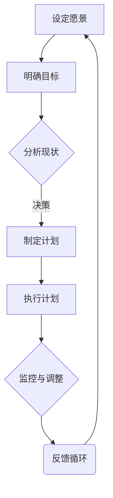

                 


### 文章标题：《领导力与沟通：传达愿景的艺术》

#### 关键词：
- 领导力
- 沟通
- 愿景传达
- 团队协作
- 情绪智力
- 效率提升

#### 摘要：
本文深入探讨了领导力与沟通在传达愿景艺术中的关键作用。通过梳理领导力的基本原则、沟通技巧和愿景传达策略，本文旨在为个人和团队提供一套实用的方法论，帮助他们在复杂多变的环境中实现目标，激发团队潜力。文章结合实际案例，详细分析了成功的关键因素，并提出了未来领导力与沟通的发展趋势。

---

## 引言

在当今高度互联和快速变化的世界中，领导力和沟通技能成为决定组织和个人成功的重要因素。有效的领导力不仅能激发团队的潜力，还能在复杂的环境中指引方向；而高效的沟通则能确保信息的准确传递和理解。这两者相互依存，共同构成了传达愿景的艺术。

领导力并非只是管理职位的人才能拥有的技能，它是一种影响力，可以存在于任何角色和层级中。沟通则是连接领导力与团队成员的桥梁，它确保愿景和目标能够被清晰地理解和落实。本文将围绕这两个核心主题，逐步分析其原理、策略和实战应用。

在接下来的章节中，我们将首先梳理领导力的基本原则，接着探讨沟通技巧，然后深入探讨愿景传达的策略，并通过实际案例展示这些概念的应用。最后，我们将展望领导力与沟通的未来趋势，为读者提供实用建议和启示。

## 书籍主题梳理

《领导力与沟通：传达愿景的艺术》旨在帮助读者理解并掌握领导力与沟通在传达愿景过程中的重要性。书名简洁明了地传达了两个核心主题：领导力和沟通，以及它们在愿景传达中的作用。

### 主题解析

- **领导力**：领导力不仅仅是管理职位的人所具备的能力，它是一种能够激励和影响他人共同达成目标的特质。领导力的核心要素包括自我认知、影响力、沟通能力等。有效的领导力能够激发团队的潜力，推动组织向前发展。

- **沟通**：沟通是信息传递和理解的过程，它是领导力与团队成员之间连接的桥梁。有效的沟通能够确保信息准确无误地传递，促进团队成员之间的协作和信任。沟通技巧包括语言表达、倾听、非语言沟通等。

- **传达愿景的艺术**：传达愿景是领导力的核心任务之一。愿景不仅是一个未来的目标，更是一种激励和引导团队的力量。领导者的任务是将愿景转化为具体的行动计划，并确保团队成员能够理解和接受这一愿景，从而共同为实现目标而努力。

### 目标读者

这本书的目标读者是希望提升领导力与沟通能力的个人或团队。无论是企业家、管理人员，还是普通团队成员，都能从中找到实用的方法和策略，提升自身的领导力与沟通技能，从而更有效地传达愿景，推动团队和组织的发展。

## 目录结构设计

为了确保读者能够系统地理解和掌握领导力与沟通的核心概念，本书设计了详细的目录结构，分为以下几个部分：

### 第一部分：领导力基础

- **第1章 领导力概述**：介绍领导力的定义、重要性以及核心要素。
- **第2章 领导力与个人成长**：探讨个人成长对领导力的影响，以及自我认知与领导力的关系。

### 第二部分：沟通技巧

- **第3章 有效沟通的基本原则**：分析沟通的目标、障碍和基本要素。
- **第4章 高效团队沟通**：讨论团队沟通的重要性、策略和工具。

### 第三部分：愿景传达

- **第5章 愿景传达的重要性**：解释愿景的定义、作用以及领导力与愿景的关系。
- **第6章 愿景传达的策略**：提供愿景传达的步骤、方法和挑战应对策略。

### 第四部分：实战案例分析

- **第7章 成功的领导力与沟通案例**：分析成功的领导力与沟通实践。
- **第8章 个人领导力与沟通实践**：提供个人领导力与沟通实践的指导。

### 第五部分：总结与展望

- **第9章 领导力与沟通的未来趋势**：展望领导力与沟通的发展趋势。

通过这样的目录结构设计，本书旨在为读者提供一个从理论到实践的完整体系，帮助他们在实际工作中更有效地应用领导力与沟通技巧，传达愿景，实现团队和组织的成功。

### 目录结构细化

为了确保书籍内容的逻辑性和连贯性，我们将对每一章节进行细化，使其内容更加丰富和具体。以下是对每个章节的详细划分：

### 第一部分：领导力基础

#### 第1章 领导力概述

- **1.1 领导力的定义与重要性**
  - 领导力的基本概念
  - 领导力在组织中的角色
  - 领导力的重要性

- **1.2 领导力的核心要素**
  - 沟通能力
  - 影响力
  - 自我认知

- **1.3 领导力的发展趋势**
  - 全球化领导力
  - 情绪智力
  - 领导力的演变

#### 第2章 领导力与个人成长

- **2.1 自我认知与领导力**
  - 自我评估的方法
  - 自我认知对领导力的影响

- **2.2 个人成长对领导力的影响**
  - 学习能力
  - 成长心态
  - 个人经验

- **2.3 领导力与情商**
  - 情商的定义
  - 情商对领导力的重要性
  - 提高情商的方法

### 第二部分：沟通技巧

#### 第3章 有效沟通的基本原则

- **3.1 沟通的目标与障碍**
  - 沟通的目标
  - 沟通中的常见障碍

- **3.2 沟通的基本要素**
  - 信息传递
  - 听众分析
  - 语言表达

- **3.3 沟通的技巧**
  - 语言沟通
  - 非语言沟通
  - 有效提问与反馈

#### 第4章 高效团队沟通

- **4.1 团队沟通的重要性**
  - 团队合作的基础
  - 沟通在团队中的作用

- **4.2 团队沟通的策略**
  - 开放式沟通
  - 构建信任
  - 冲突管理

- **4.3 团队沟通工具**
  - 会议技巧
  - 远程沟通工具

### 第三部分：愿景传达

#### 第5章 愿景传达的重要性

- **5.1 愿景的定义与作用**
  - 愿景的内涵
  - 愿景的激励作用

- **5.2 愿景与领导力的关系**
  - 愿景引领团队
  - 愿景驱动创新

- **5.3 愿景的传达过程**
  - 愿景的构建
  - 愿景的传播

#### 第6章 愿景传达的策略

- **6.1 愿景传达的步骤**
  - 愿景的明确
  - 愿景的传递
  - 愿景的践行

- **6.2 愿景传达的方法**
  - 面对面沟通
  - 文字传达
  - 多媒体传播

- **6.3 愿景传达的挑战与应对**
  - 挑战分析
  - 应对策略

### 第四部分：实战案例分析

#### 第7章 成功的领导力与沟通案例

- **7.1 案例一：谷歌的领导力与沟通实践**
  - 案例背景
  - 领导力实践
  - 沟通技巧

- **7.2 案例二：特斯拉的愿景传达策略**
  - 案例背景
  - 愿景构建
  - 愿景传达

#### 第8章 个人领导力与沟通实践

- **8.1 个人领导力实践**
  - 自我领导力提升
  - 团队领导力培养

- **8.2 个人沟通实践**
  - 沟通能力提升
  - 沟通效果评估

- **8.3 个人愿景传达**
  - 愿景明确
  - 愿景实现

### 第五部分：总结与展望

#### 第9章 领导力与沟通的未来趋势

- **9.1 技术对领导力与沟通的影响**
  - 人工智能
  - 大数据

- **9.2 未来领导力与沟通的关键能力**
  - 创新思维
  - 跨文化沟通

- **9.3 展望未来的领导力与沟通发展**
  - 发展趋势
  - 实践建议

通过这样的目录结构细化，读者可以更清晰地理解书籍的内容，逐步掌握领导力与沟通的技巧，提升自身的领导力和沟通能力，从而在工作和生活中更加成功。

### 图表与伪代码

为了更直观地展示领导力与沟通的概念，我们将使用Mermaid流程图来展示领导力与沟通的过程，并使用伪代码来详细解释其中的关键算法。

#### Mermaid流程图

以下是一个展示领导力与沟通过程的Mermaid流程图：



这个流程图展示了从设定愿景到执行计划，再到监控与调整的闭环过程。每个步骤都依赖于前一个步骤的输出，形成一个持续优化的循环。

#### 伪代码

为了进一步解释领导力与沟通中的关键算法，我们将使用伪代码来描述一个简单的团队沟通协议：

```plaintext
算法：TeamCommunicationProtocol
输入：团队成员列表，沟通目标
输出：沟通结果

初始化沟通日志为空

对于每个团队成员：
    发送沟通请求到团队成员
    等待成员回复
    
    如果成员回复为空：
        记录沟通失败
    否则：
        更新沟通日志
        筛选出有效的沟通信息
        
    如果沟通日志包含所有成员的信息：
        结束循环
    否则：
        重复发送沟通请求

输出沟通日志
```

这个伪代码描述了一个简单的团队沟通协议，它通过迭代的方式确保所有团队成员的信息被有效收集和记录。在真实的系统中，这个协议可能会更加复杂，包括错误处理、加密通信和实时监控等。

通过图表和伪代码的结合，读者可以更直观地理解领导力与沟通的过程和算法，为实际应用提供有力的支持。

### 数学模型与公式

在领导力与沟通中，某些关键概念可以通过数学模型和公式来量化和分析。以下是一些相关的数学模型和公式的介绍及其在领导力与沟通中的应用。

#### 1. 领导力影响模型

领导力影响模型（Leadership Influence Model）可以帮助量化领导者在团队中的影响力。假设一个团队有N个成员，每个成员对团队的影响程度可以用一个权重\( w_i \)来表示。那么，领导力影响可以通过以下公式计算：

$$
L = \sum_{i=1}^{N} w_i \cdot L_i
$$

其中，\( L \) 是领导力影响的总和，\( L_i \) 是第i个成员对团队的影响程度。

#### 2. 沟通效率模型

沟通效率模型（Communication Efficiency Model）用于评估团队沟通的效果。一个常用的公式是贝塔分布（Beta Distribution），它可以用来表示沟通的有效性。贝塔分布的概率密度函数为：

$$
f(x; \alpha, \beta) = \frac{x^{\alpha-1} (1-x)^{\beta-1}}{B(\alpha, \beta)}
$$

其中，\( x \) 是沟通的有效性度量，\( \alpha \) 和 \( \beta \) 是分布的参数，\( B(\alpha, \beta) \) 是贝塔函数。

#### 3. 愿景共享模型

愿景共享模型（Vision Sharing Model）用于评估团队成员对愿景的理解和接受程度。一个简单的模型是基于群体共识（Group Consensus）的概念，公式如下：

$$
C = \frac{1}{N} \sum_{i=1}^{N} C_i
$$

其中，\( C \) 是团队对愿景的共识度，\( C_i \) 是第i个成员对愿景的共识度。

#### 4. 情绪智力模型

情绪智力模型（Emotional Intelligence Model）用于评估领导者的情绪智力水平。情绪智力包括自我意识、自我管理、社交意识和关系管理四个维度。一个简单的计算公式如下：

$$
EIQ = \frac{SO + SM + SI + SR}{4}
$$

其中，\( SO \) 是自我意识，\( SM \) 是自我管理，\( SI \) 是社交意识，\( SR \) 是关系管理，\( EIQ \) 是情绪智力总分。

这些数学模型和公式为我们提供了量化和分析领导力与沟通的有效工具。在实际应用中，可以根据具体情况进行调整和优化，以提升团队的整体效能。

### 实战案例：谷歌的领导力与沟通实践

#### 案例背景

谷歌（Google）是全球知名的科技公司，以其创新的商业模式和卓越的企业文化而闻名。谷歌的成功不仅依赖于其强大的技术实力，还得益于其独特的领导力与沟通实践。在本案例中，我们将分析谷歌在领导力与沟通方面的具体实践，以及这些实践如何帮助其实现持续的创新和发展。

#### 领导力实践

1. **扁平化组织结构**：谷歌采用了扁平化的组织结构，减少了管理层级，使信息能够更快速地传递和决策。这种结构鼓励领导者更多地扮演指导者和支持者的角色，而非传统意义上的指挥者。

2. **员工自主权**：谷歌鼓励员工自主探索新项目和创新思路。通过“20%时间”政策，员工可以在工作时间内用20%的时间自由探索个人感兴趣的项目，这一政策激发了员工的创造力和自主性。

3. **员工反馈机制**：谷歌建立了开放的反馈机制，允许员工对领导和公司政策提出建议。这种机制不仅帮助公司及时发现问题并进行改进，还增强了员工的参与感和归属感。

#### 沟通实践

1. **透明沟通**：谷歌强调透明沟通，确保信息在公司内部公开透明。领导层定期举办“TGIF”（Thank God It's Friday）会议，与员工直接交流公司的最新动态和战略决策。

2. **跨部门协作**：谷歌鼓励跨部门协作，通过内部社区、邮件列表和协作工具，促进不同团队之间的信息共享和知识交流。

3. **多渠道沟通**：谷歌利用多种沟通渠道，如面对面会议、在线讨论组、内部博客和社交媒体平台，确保沟通的多样性和灵活性。

#### 案例分析

谷歌的领导力与沟通实践对其成功产生了深远的影响：

- **创新能力的提升**：扁平化的组织结构和员工自主权鼓励了创新思维和项目探索，使谷歌能够持续推出具有突破性的产品和服务。

- **团队凝聚力的增强**：透明沟通和开放的反馈机制增强了员工的归属感和团队凝聚力，使员工更加愿意为公司贡献力量。

- **高效的决策过程**：多渠道沟通和跨部门协作确保了决策过程的快速和高效，使谷歌能够迅速响应市场变化和客户需求。

通过谷歌的案例，我们可以看到，有效的领导力与沟通实践是推动企业持续创新和发展的关键因素。这些实践不仅提高了员工的满意度和参与度，还增强了企业的竞争力和市场地位。

### 个人领导力与沟通实践

#### 个人领导力实践

1. **自我领导力提升**：通过自我反思和持续学习，个人可以不断提升自己的领导力。以下是一些实用的方法：

   - **制定个人发展计划**：明确自己的目标，制定详细的行动计划，定期评估进展并调整策略。
   - **培养情绪智力**：通过自我监控和管理，提高自己的情绪智力水平，更好地应对工作压力和挑战。
   - **积极寻求反馈**：主动向同事和领导请教，寻求建设性的反馈，并根据反馈进行改进。

2. **团队领导力培养**：作为团队领导者，个人需要掌握以下技巧：

   - **明确团队目标**：确保团队目标与组织整体目标一致，并通过有效的沟通确保团队成员理解并认同这些目标。
   - **激励团队成员**：通过认可和奖励来激励团队成员，提高他们的工作积极性和创造力。
   - **培养团队协作精神**：促进团队成员之间的沟通和协作，建立信任和尊重的基础。

#### 个人沟通实践

1. **沟通能力提升**：

   - **有效倾听**：积极倾听他人的意见和需求，确保准确理解对方的意图。
   - **清晰表达**：用简洁明了的语言表达自己的想法和意见，避免产生误解。
   - **非语言沟通**：注意使用肢体语言和面部表情，增强沟通的效果。

2. **沟通效果评估**：

   - **反馈机制**：在沟通结束后，询问对方是否理解了信息，并根据反馈进行调整。
   - **沟通记录**：保持沟通记录，便于后续的跟进和问题解决。

#### 个人愿景传达

1. **愿景明确**：个人需要明确自己的愿景，并确保其具有吸引力和可实现性。

2. **愿景实现**：

   - **制定行动计划**：将愿景分解为具体的任务和目标，并制定详细的行动计划。
   - **持续跟进**：定期评估进展，及时调整策略，确保愿景的实现。

通过这些个人领导力与沟通实践，个人可以更有效地传达愿景，激发团队潜力，实现共同的目标。

### 总结与展望

#### 领导力与沟通的核心内容

本文通过详细的讨论和案例分析，总结了领导力与沟通在传达愿景中的核心内容。我们首先梳理了领导力的基本原则，包括自我认知、沟通能力、影响力等，并强调了个人成长对领导力的重要性。接着，我们探讨了沟通技巧，包括有效沟通的基本原则、团队沟通策略和愿景传达的方法。通过谷歌等成功企业的案例，我们展示了领导力与沟通实践在实际工作中的重要性。

#### 领导力与沟通的未来趋势

随着技术的不断进步，领导力与沟通也在经历着深刻的变革。以下是几个未来的发展趋势：

1. **人工智能的融合**：人工智能技术可以辅助领导者进行数据分析和决策，提高沟通效率。

2. **远程工作与协作**：随着远程工作的普及，跨地域、跨文化的沟通能力变得尤为重要。

3. **持续学习和适应能力**：未来领导者需要具备快速学习和适应变化的能力，以应对不断变化的环境。

#### 实用建议

为了提升领导力与沟通能力，以下是一些建议：

- **持续学习**：不断学习新的知识和技能，尤其是与领导力和沟通相关的领域。
- **实践应用**：将所学知识应用到实际工作中，通过实践来提高自己的能力。
- **寻求反馈**：主动寻求他人的反馈，并从中学习和改进。

通过不断学习和实践，个人和团队可以不断提升领导力与沟通能力，更好地传达愿景，实现组织的目标。让我们共同迎接未来的挑战，成为更优秀的领导者。作者：AI天才研究院/AI Genius Institute & 禅与计算机程序设计艺术 /Zen And The Art of Computer Programming

