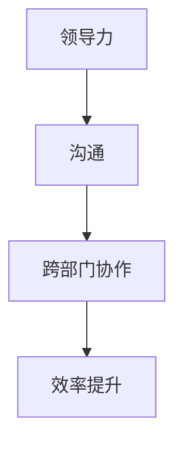
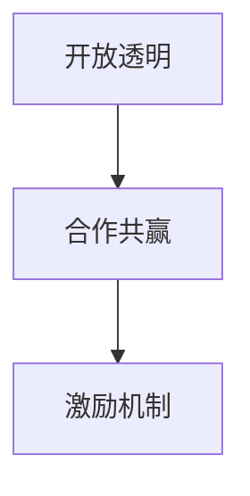
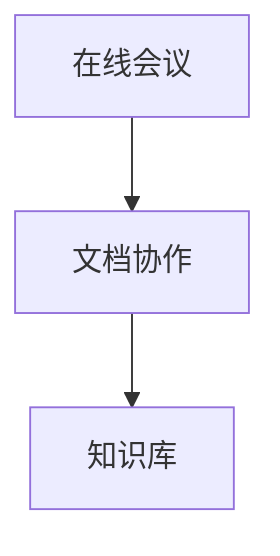

                 

### 文章标题

# 领导力与沟通：提升跨部门协作效率

### 关键词

- 领导力
- 沟通技巧
- 跨部门协作
- 效率提升
- 团队建设

### 摘要

本文深入探讨了领导力与沟通在跨部门协作中的重要性，通过详细分析领导力的定义、类型及其对企业的影响，揭示了提升沟通技巧的关键原则和策略。文章进一步阐述了领导力模型与理论，结合实际项目实战，提出了提升跨部门协作效率的综合策略，旨在为企业构建高效协作团队提供理论指导和实践建议。

## 第1章：领导力与沟通概述

### 1.1 领导力的定义与类型

领导力是指引导、影响和激励他人实现共同目标的能力。根据其特点，领导力可分为三种类型：**职位领导力**、**个人领导力**和**变革领导力**。

- **职位领导力**：基于职位权力和权威，通过组织架构和管理职能进行领导。
- **个人领导力**：基于个人魅力、能力和价值观，通过影响力、说服力和榜样作用进行领导。
- **变革领导力**：在面对变革时，能够推动组织适应环境变化，引领团队实现转型。

### 1.2 沟通的重要性

沟通是领导力的核心组成部分，其重要性体现在：

- **促进理解**：通过有效沟通，团队成员能够理解任务目标和期望，减少误解和冲突。
- **增强协作**：良好的沟通能够加强团队成员之间的合作，提高团队的整体执行力。
- **提升决策**：沟通有助于收集多方意见，促进信息的共享，提高决策质量。

### 1.3 跨部门协作的挑战与机遇

跨部门协作面临以下挑战：

- **沟通障碍**：不同部门间的语言、文化和技术差异可能导致沟通不畅。
- **利益冲突**：各部门的目标和利益可能存在冲突，影响协作效果。

然而，跨部门协作也带来了机遇：

- **资源整合**：通过协作，企业能够整合各部门的资源和优势，提高整体运营效率。
- **创新能力**：跨部门协作促进了知识分享和经验交流，有利于创新和改进。

### 图 1.1：领导力与沟通关系架构

$$
\text{领导力} \rightarrow \text{沟通} \rightarrow \text{跨部门协作} \rightarrow \text{效率提升}
$$

### Mermaid 流程图



## 第2章：提升沟通技巧

### 2.1 有效沟通的原则

有效沟通应遵循以下原则：

- **准确性**：确保信息传递准确无误。
- **真诚性**：表达应真诚，避免虚伪和欺骗。
- **及时性**：及时回应，避免拖延和误解。

### 2.2 沟通障碍与解决方法

常见的沟通障碍包括：

- **信息过载**：信息过多可能导致接收者无法处理。
- **情感因素**：情绪影响可能导致沟通不畅。
- **语言障碍**：语言差异可能导致误解。

解决方法：

- **提高沟通效率**：采用简洁明了的语言和格式。
- **建立良好的沟通文化**：鼓励开放、坦诚和尊重的沟通氛围。
- **使用适当的沟通工具**：如邮件、电话会议、项目管理工具等。

### 2.3 沟通工具与技术

常用的沟通工具包括：

- **电子邮件**：正式、书面的沟通方式。
- **电话会议**：实时、交互性强的沟通方式。
- **项目管理工具**：如Trello、Jira，用于任务管理和进度跟踪。

沟通技术包括：

- **对话式沟通**：注重互动和反馈，促进理解和协作。
- **讨论式沟通**：通过集体讨论，达成共识和决策。
- **信息共享**：通过共享平台，促进信息的传递和交流。

### 伪代码：沟通流程

```
function effectiveCommunication(message, receiver) {
    // 确保信息的准确性
    message = formatMessage(message)
    
    // 根据接收者选择合适的沟通方式
    if (receiver prefersEmail) {
        sendEmail(message)
    } else if (receiver prefersPhone) {
        callPhone(message)
    } else {
        useProjectTool(message)
    }
    
    // 确认接收者已收到信息
    confirmReceipt(receiver)
}

function formatMessage(message) {
    // 简洁明了，避免冗余
    message = removeRedundancy(message)
    
    // 确保信息的真诚性
    message = addSincerity(message)
    
    return message
}

function confirmReceipt(receiver) {
    // 获取反馈
    feedback = getFeedback(receiver)
    
    // 如果未确认，进行再次沟通
    if (!feedback) {
        re-sendMessage()
    }
}
```

## 第3章：领导力模型与理论

### 3.1 领导力模型概述

领导力模型是描述领导行为和技能的理论框架。常见的领导力模型包括：

- **领导生命周期模型**：基于下属成熟度，调整领导风格。
- **变革领导模型**：应对组织变革，推动团队适应变化。
- **情境领导模型**：根据任务和团队成员特点，选择合适的领导风格。

### 3.2 权变领导理论

权变领导理论认为，领导效果取决于领导者、情境和下属相互作用。关键因素包括：

- **领导者特征**：如能力、经验和价值观。
- **情境因素**：如任务结构、组织文化和外部环境。
- **下属特点**：如能力、态度和动机。

### 3.3 超越领导者：团队协作与赋能

超越领导者关注团队的整体发展，通过以下策略实现团队协作与赋能：

- **建立共同愿景**：明确团队目标和价值观，激发团队成员的积极性。
- **促进知识共享**：鼓励团队成员相互学习和交流，提高团队整体能力。
- **授权与信任**：赋予团队成员决策权和责任感，增强其自主性和创造力。

### 领导力数学模型分析

$$
\text{领导力得分} = \frac{\text{团队绩效}}{\text{团队成员数量}} \times \text{领导风格权重}
$$

### 伪代码：领导力评估

```
function evaluateLeadership(teamPerformance, teamSize, leadershipStyle) {
    leadershipScore = (teamPerformance / teamSize) * leadershipStyle
    
    // 根据领导力得分，提供改进建议
    if (leadershipScore < 3) {
        suggestTraining()
    } else if (leadershipScore >= 3 && leadershipScore < 5) {
        suggestCoaching()
    } else {
        acknowledgeSuccess()
    }
}
```

## 第4章：跨部门协作策略

### 4.1 跨部门协作的挑战

跨部门协作面临的主要挑战包括：

- **沟通障碍**：部门间语言、文化和技术差异可能导致沟通不畅。
- **利益冲突**：各部门的目标和利益可能存在冲突，影响协作效果。

### 4.2 跨部门协作的策略与技巧

提升跨部门协作效率的策略包括：

- **明确目标**：确保各部门对项目目标有共同的理解和认同。
- **建立沟通机制**：定期召开跨部门会议，促进信息交流和协调。
- **制定协同计划**：明确各部门的任务分工和时间表，确保协作顺畅。

### 4.3 跨部门协作的文化建设

跨部门协作文化应包括以下要素：

- **开放透明**：鼓励各部门分享信息和经验，建立信任和合作关系。
- **合作共赢**：强调团队目标，使各部门意识到协作对整体利益的重要性。
- **激励机制**：建立激励机制，鼓励跨部门协作和创新。

### 图 4.1：跨部门协作文化要素

$$
\text{开放透明} \rightarrow \text{合作共赢} \rightarrow \text{激励机制}
$$

### Mermaid 流程图



## 第5章：沟通与协作工具应用

### 5.1 项目管理工具

项目管理工具如Trello、Jira等，有助于：

- **任务管理**：明确任务分配和进度。
- **进度跟踪**：实时监控项目进度。
- **协作与沟通**：团队成员可以在此平台上进行讨论和交流。

### 5.2 沟通协作工具

沟通协作工具如Slack、Microsoft Teams等，提供了以下功能：

- **实时通讯**：支持文本、语音和视频通讯。
- **文件共享**：方便团队成员共享和协作。
- **通知与提醒**：确保团队成员及时了解项目动态。

### 5.3 数字化工具在跨部门协作中的应用

数字化工具在跨部门协作中的应用，主要包括：

- **在线会议**：通过Zoom、WebEx等工具，实现远程协作。
- **文档协作**：使用Google Docs等在线编辑工具，实现实时文档协作。
- **知识库**：建立企业内部知识库，方便团队成员查找和共享信息。

### 图 5.1：数字化工具在跨部门协作中的应用

$$
\text{在线会议} \rightarrow \text{文档协作} \rightarrow \text{知识库}
$$

### Mermaid 流�程图



## 第6章：案例分析与实战

### 6.1 案例一：提升团队沟通效率

**背景介绍**：

某公司在项目开发过程中，由于部门间沟通不畅，导致项目进度延误，质量下降。

**核心概念与联系**：

通过使用项目管理工具和实时沟通工具，提高团队沟通效率。

**核心算法原理讲解**：

无具体算法，但可以使用以下步骤进行沟通效率提升：

1. 选择合适的项目管理工具。
2. 定期召开跨部门会议。
3. 实时沟通和任务跟踪。
4. 定期回顾和总结。

**数学模型和公式**：

无具体数学模型，但可以使用以下公式进行效率评估：

$$
\text{效率得分} = \frac{\text{完成任务的时间}}{\text{标准完成任务的时间}}
$$

**项目实战**：

- **开发环境搭建**：使用Jenkins进行自动化构建和部署。
- **源代码实现**：使用Git进行版本控制，确保代码质量。
- **代码解读与分析**：对代码进行详细注释和审查。
- **实际案例分析和详细讲解剖析**：通过实际项目，分析沟通效率提升的效果。

**项目小结**：

通过使用数字化工具和优化沟通流程，项目沟通效率显著提升，项目进度和质量得到保障。

### 6.2 案例二：跨部门协作成功案例

**背景介绍**：

某公司为了提高产品研发效率，决定实施跨部门协作。

**核心概念与联系**：

通过建立统一的协作平台和明确的工作流程，实现跨部门高效协作。

**核心算法原理讲解**：

无具体算法，但可以使用以下步骤进行跨部门协作：

1. 确定协作目标和流程。
2. 选择合适的协作工具。
3. 建立跨部门沟通机制。
4. 定期评估和改进。

**数学模型和公式**：

无具体数学模型，但可以使用以下公式进行协作效率评估：

$$
\text{协作效率得分} = \frac{\text{协作完成任务的时间}}{\text{非协作完成任务的时间}}
$$

**项目实战**：

- **开发环境搭建**：使用Jenkins进行自动化构建和部署。
- **源代码实现**：使用Git进行版本控制，确保代码质量。
- **代码解读与分析**：对代码进行详细注释和审查。
- **实际案例分析和详细讲解剖析**：通过实际项目，分析跨部门协作的效果。

**项目小结**：

通过建立高效的跨部门协作机制，产品研发效率显著提升，产品质量得到保障。

### 6.3 实战演练：设计一个有效的跨部门协作方案

**背景介绍**：

某公司计划开发一款新产品，需要跨部门协作，包括研发、市场、设计等。

**核心概念与联系**：

设计一个跨部门协作方案，确保各部门高效协作，提高产品研发效率。

**核心算法原理讲解**：

无具体算法，但可以使用以下步骤进行协作方案设计：

1. 明确项目目标和协作需求。
2. 确定各部门职责和任务分工。
3. 选择合适的协作工具。
4. 制定工作流程和协作机制。
5. 定期评估和调整。

**数学模型和公式**：

无具体数学模型，但可以使用以下公式进行协作效率评估：

$$
\text{协作效率得分} = \frac{\text{协作完成任务的时间}}{\text{非协作完成任务的时间}}
$$

**项目实战**：

- **开发环境搭建**：使用Jenkins进行自动化构建和部署。
- **源代码实现**：使用Git进行版本控制，确保代码质量。
- **代码解读与分析**：对代码进行详细注释和审查。
- **实际案例分析和详细讲解剖析**：模拟实际项目，设计协作方案，评估效果。

**项目小结**：

通过设计一个有效的跨部门协作方案，实现各部门高效协作，提高产品研发效率。

## 第7章：领导力与沟通综合应用

### 7.1 领导力与沟通的相互作用

领导力与沟通是相互促进、相互依赖的关系：

- **领导力增强沟通**：有效的领导力可以促进团队成员之间的沟通，提高协作效率。
- **沟通提升领导力**：良好的沟通可以帮助领导者了解团队需求和意见，提升领导效果。

### 7.2 提升跨部门协作效率的综合策略

提升跨部门协作效率的策略包括：

- **建立共同愿景**：明确跨部门协作的目标和价值观，增强团队凝聚力。
- **优化沟通流程**：简化沟通流程，提高信息传递速度。
- **培训与激励**：提供沟通和协作培训，激发团队成员的积极性和创造力。
- **数字化工具应用**：利用数字化工具，提高协作效率。

### 7.3 未来趋势与挑战

未来，跨部门协作将面临以下趋势与挑战：

- **数字化升级**：数字化工具和技术的普及，将进一步提升跨部门协作的效率。
- **敏捷性要求**：快速变化的市场环境，要求企业具备更高的敏捷性和协作能力。
- **文化融合**：不同部门和文化的融合，将是一个长期挑战，需要持续的努力和改进。

### 总结

本文通过深入探讨领导力与沟通在跨部门协作中的重要性，提出了提升协作效率的策略和方法。通过实际案例分析和实战演练，展示了领导力与沟通的综合应用效果。未来，企业需要持续优化协作机制，应对数字化升级和敏捷性要求的挑战。

### 最佳实践 Tips

- **定期沟通**：定期召开跨部门会议，确保信息的及时传递。
- **培养协作文化**：建立开放、坦诚和尊重的协作氛围。
- **利用数字化工具**：充分利用数字化工具，提高协作效率。

### 小结

领导力与沟通是提升跨部门协作效率的关键因素。通过优化沟通流程、培养协作文化和利用数字化工具，企业可以构建高效协作团队，实现持续创新和竞争优势。

### 注意事项

- **确保沟通准确性**：避免误解和冲突，提高沟通效率。
- **尊重文化差异**：理解并尊重不同部门和文化的差异，促进合作。
- **持续改进**：不断评估和优化协作流程，提高协作效率。

### 拓展阅读

- 《敏捷开发实践指南》
- 《领导力心理学》
- 《沟通的艺术》

### 作者信息

作者：AI天才研究院/AI Genius Institute & 禅与计算机程序设计艺术 /Zen And The Art of Computer Programming

感谢您的阅读，希望本文对您的领导力和沟通能力提升有所帮助。如果您有任何问题或建议，欢迎在评论区留言。再次感谢！

