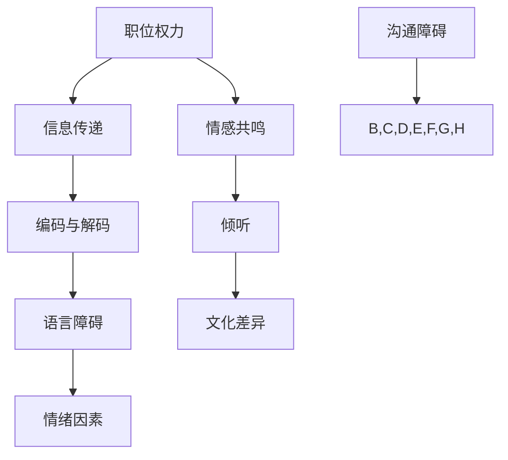
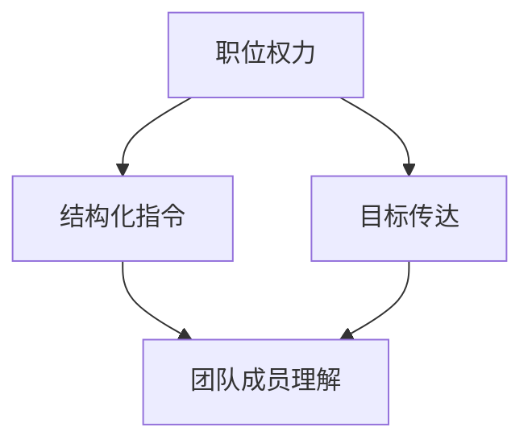
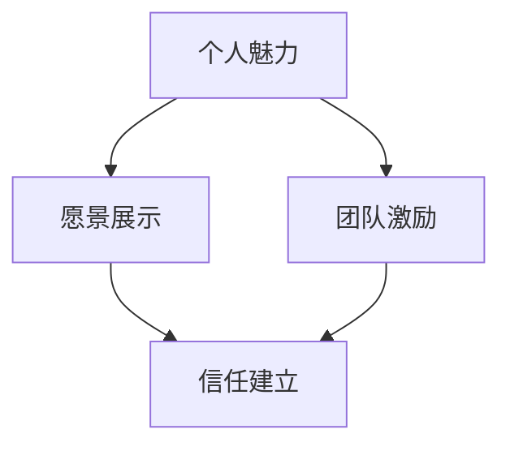
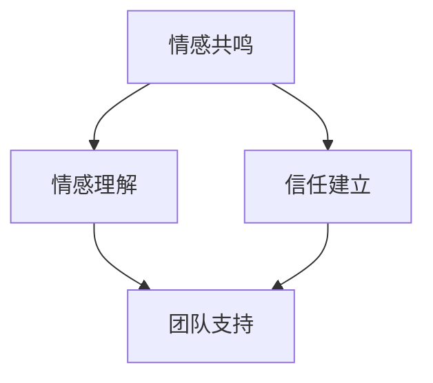
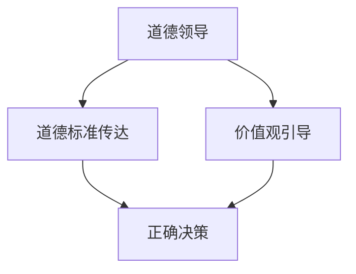
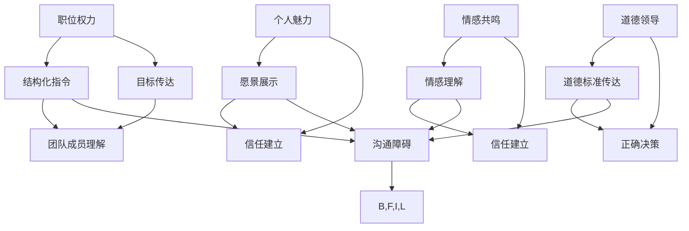

                 


### 背景介绍

在信息技术行业，领导力与沟通技能被广泛认为是成功的关键因素。无论是作为技术团队的管理者，还是项目领导，领导力与沟通能力都决定了团队的工作效率和项目的成功率。领导力不仅是管理和指导团队的能力，更是一种激励、启发和赋能他人的艺术。而沟通则是领导力的核心组成部分，它决定了信息能否准确、高效地传达，从而影响到团队的整体表现。

本文将围绕“领导力与沟通：有效传达期望的技巧”这一主题，深入探讨如何通过有效的沟通技巧来传达期望。文章结构将分为两个主要部分：领导力的基础和有效传达期望的技巧。

首先，我们将介绍领导力的核心概念，包括领导力的定义与作用、领导力的四个层次以及领导者的影响力来源。接着，我们将讨论领导力与沟通的关系，探讨沟通对领导力的重要性，以及如何克服沟通障碍。

在第二部分，我们将专注于有效传达期望的技巧。这包括设定明确的目标、有效表达期望、倾听与反馈以及团队沟通与协作。我们将使用SMART原则来指导目标设定，讨论表达期望的基本原则和技巧，介绍倾听和反馈的技巧，并提供提高团队沟通效率的方法。

文章的最后部分将探讨跨文化沟通与领导，讨论跨文化沟通的特点和挑战，以及如何成为一位具有跨文化领导力的领导者。通过这一系列的讨论，我们希望读者能够理解领导力与沟通的重要性，掌握有效传达期望的技巧，从而提升自己的领导力和沟通能力。

### 核心概念与联系

在探讨领导力与沟通的关系时，我们需要理解几个核心概念，它们之间相互联系，共同构成了有效的领导力和沟通的基础。

**领导力的定义与作用**：领导力不仅仅是管理能力和决策能力，它更是一种影响他人，激励团队，并共同实现目标的能力。领导力可以划分为四个层次：职位权力、个人魅力、情感共鸣和道德领导。每个层次代表了领导者影响力的不同方面，而有效的沟通在这些层次中起到了至关重要的作用。

**沟通的基本要素**：沟通是一个复杂的过程，包括信息的发送、传递、接收和理解。有效沟通需要具备清晰的信息、恰当的媒介、有效的编码和解码，以及积极的倾听。

**沟通障碍**：在信息传递过程中，可能会遇到多种障碍，如文化差异、语言障碍、情绪因素等。理解这些障碍并制定相应的解决策略，是有效沟通的关键。

**领导力的四个层次与沟通的关系**：

1. **职位权力**：这一层次的领导力主要依赖于职位赋予的权威。有效的沟通可以帮助领导者传达指令、明确期望，并确保团队成员理解其职责。

2. **个人魅力**：这一层次依赖于领导者的个人特质和魅力。领导者需要通过有效的沟通来展示自己的愿景，并激发团队成员的热情和动力。

3. **情感共鸣**：领导者需要与团队成员建立情感联系。通过积极的沟通，领导者可以了解团队成员的感受和需求，从而更好地支持他们。

4. **道德领导**：这一层次的领导力依赖于领导者的道德标准和价值观。领导者需要通过沟通明确团队的目标和价值观，并确保团队成员的行为符合这些标准。

**沟通的基本要素与领导力的关系**：

- **信息的发送与传递**：领导者需要确保信息的清晰、明确，以便团队成员能够正确理解。

- **编码与解码**：领导者需要使用恰当的语言和媒介来编码信息，同时团队成员需要正确解码这些信息。

- **倾听**：领导者需要通过积极的倾听来了解团队成员的反馈和意见，这有助于建立信任和合作。

**沟通障碍与领导力的关系**：

- **文化差异**：在多元文化环境中，领导者需要了解和尊重不同文化的沟通方式，以便有效地传达信息。

- **语言障碍**：领导者需要使用简单、易懂的语言，避免专业术语和行业方言，以确保所有团队成员都能理解。

- **情绪因素**：领导者需要关注团队成员的情绪状态，通过有效的沟通来缓解紧张和冲突。

**领导力的四个层次与沟通的关系架构（Mermaid 流程图）**：



通过这一架构，我们可以看到领导力的不同层次与沟通的基本要素和障碍之间的紧密联系。有效的沟通不仅是领导力的核心，也是实现团队目标和组织愿景的关键。

### 核心概念与联系（续）

在深入探讨领导力与沟通的核心概念后，我们接下来将介绍领导力的四个层次，并通过Mermaid流程图展示这些层次之间的关系。

#### 1. 职位权力

职位权力是领导力的第一个层次，它基于领导者在组织中的职位和权威。职位权力给予领导者正式的权力和影响力，使其能够下达指令、制定决策和分配资源。

**核心概念与联系**：
- **概念**：职位权力是一种结构化的权力，它依赖于组织的等级制度。
- **联系**：职位权力与沟通的关系在于，领导者需要通过有效的沟通来传达指令和目标，确保团队成员理解并遵循这些指令。

**Mermaid流程图**：



#### 2. 个人魅力

个人魅力是领导力的第二个层次，它依赖于领导者的个人特质、价值观和魅力。领导者通过个人魅力吸引、影响和激励团队成员，使他们愿意追随和信任领导者。

**核心概念与联系**：
- **概念**：个人魅力是一种非正式的权力，它建立在领导者的个人特质和信任基础之上。
- **联系**：个人魅力与沟通的关系在于，领导者需要通过富有感染力的沟通来展示自己的愿景，激发团队成员的热情和动力。

**Mermaid流程图**：



#### 3. 情感共鸣

情感共鸣是领导力的第三个层次，它涉及领导者与团队成员之间的情感联系。领导者需要理解和关注团队成员的情感和需求，以建立信任和合作关系。

**核心概念与联系**：
- **概念**：情感共鸣是一种情感化的权力，它通过共鸣和同情心来建立联系。
- **联系**：情感共鸣与沟通的关系在于，领导者需要通过积极的沟通来了解团队成员的感受，从而更好地支持他们。

**Mermaid流程图**：



#### 4. 道德领导

道德领导是领导力的最高层次，它强调领导者的道德标准和价值观。领导者需要通过沟通明确团队的目标和价值观，并确保团队成员的行为符合这些标准。

**核心概念与联系**：
- **概念**：道德领导是一种基于道德和价值观的权力，它要求领导者具备高尚的品德和正直的行为。
- **联系**：道德领导与沟通的关系在于，领导者需要通过沟通传达道德标准和价值观，以引导团队成员做出正确的决策和行为。

**Mermaid流程图**：



**Mermaid流程图总览**：



通过上述Mermaid流程图，我们可以清晰地看到领导力的四个层次与沟通的基本要素和障碍之间的紧密联系。每个层次都需要不同的沟通技巧和策略，而有效的沟通是实现领导力目标的关键。

### 核心算法原理讲解

在探讨领导力与沟通的深层次联系时，我们需要引入一些核心算法原理，这些原理不仅帮助我们理解沟通的结构，还能为实践提供具体的指导。以下是一些关键的概念和算法，我们将使用伪代码来详细阐述它们的实现。

#### 1. 期望值模型（Expectancy Model）

期望值模型是一个心理学模型，用于解释人们为什么做出某些选择。在领导力与沟通的背景下，期望值模型可以帮助领导者了解团队成员的动机和行为。

**核心概念**：
- **期望值**：个体对成功完成任务的信念强度。
- **工具性**：个体对任务成功后获得奖励的信念强度。
- **价值**：个体对奖励的价值评估。

**伪代码**：

```python
def expectancy_model(task_difficulty, reward_probability, reward_value):
    # 任务难度、奖励概率和奖励价值的输入参数
    expectancy = (1 - task_difficulty) * reward_probability * reward_value
    return expectancy
```

**举例说明**：
假设任务难度为0.5，奖励概率为0.8，奖励价值为10，那么期望值计算如下：

```python
print(expectancy_model(0.5, 0.8, 10))  # 输出：4.0
```

#### 2. SWOT分析（SWOT Analysis）

SWOT分析是一种战略规划工具，用于评估组织的优势、劣势、机会和威胁。在领导力与沟通中，SWOT分析可以帮助领导者识别团队的优势和劣势，并制定相应的沟通策略。

**核心概念**：
- **优势**（Strengths）：团队内部的优势资源和能力。
- **劣势**（Weaknesses）：团队内部存在的缺陷和不足。
- **机会**（Opportunities）：外部环境中的潜在机会。
- **威胁**（Threats）：外部环境中的潜在威胁。

**伪代码**：

```python
def swot_analysis(strengths, weaknesses, opportunities, threats):
    swot_dict = {
        'Strengths': strengths,
        'Weaknesses': weaknesses,
        'Opportunities': opportunities,
        'Threats': threats
    }
    return swot_dict
```

**举例说明**：
假设我们有一个团队，其优势包括技术熟练度高，劣势包括缺乏市场经验，机会包括即将到来的市场增长，威胁包括竞争对手的强大。那么SWOT分析结果如下：

```python
print(swot_analysis(['技术熟练度高'], ['缺乏市场经验'], ['市场增长'], ['竞争对手强大']))
# 输出：{'Strengths': ['技术熟练度高'], 'Weaknesses': ['缺乏市场经验'], 'Opportunities': ['市场增长'], 'Threats': ['竞争对手强大']}
```

#### 3. Kano模型（Kano Model）

Kano模型是一种用户需求分类模型，它将用户需求分为五大类别：基本型需求、一维型需求、二元型需求、满意型需求和兴奋型需求。在领导力与沟通中，Kano模型可以帮助领导者识别用户的关键需求，并优先满足这些需求。

**核心概念**：
- **基本型需求**：基本需求，是用户满意度的最小保障。
- **一维型需求**：需求强度与满意度成正比。
- **二元型需求**：需求的满足与否直接影响用户满意度。
- **满意型需求**：用户的特定需求，其满足程度与满意度成正比。
- **兴奋型需求**：超出用户预期的需求，其满足程度极大地提高用户满意度。

**伪代码**：

```python
def kano_model(demands):
    kano_categories = {
        'Basic': [],
        'One-dimensional': [],
        'Binary': [],
        'Satisfying': [],
        'Delighting': []
    }
    for demand in demands:
        if is_basic_demand(demand):
            kano_categories['Basic'].append(demand)
        elif is_one_dimensional_demand(demand):
            kano_categories['One-dimensional'].append(demand)
        elif is_binary_demand(demand):
            kano_categories['Binary'].append(demand)
        elif is_satisfying_demand(demand):
            kano_categories['Satisfying'].append(demand)
        elif is_delighting_demand(demand):
            kano_categories['Delighting'].append(demand)
    return kano_categories

def is_basic_demand(demand):
    # 判断需求是否属于基本型需求
    return demand == '基本需求'

def is_one_dimensional_demand(demand):
    # 判断需求是否属于一维型需求
    return demand == '一维需求'

def is_binary_demand(demand):
    # 判断需求是否属于二元型需求
    return demand == '二元需求'

def is_satisfying_demand(demand):
    # 判断需求是否属于满意型需求
    return demand == '满意型需求'

def is_delighting_demand(demand):
    # 判断需求是否属于兴奋型需求
    return demand == '兴奋型需求'
```

**举例说明**：
假设用户提出了以下需求：基本需求（系统稳定性）、一维型需求（界面美观）、二元型需求（用户支持）、满意型需求（快速响应）、兴奋型需求（个性化定制）。则Kano模型分析结果如下：

```python
print(kano_model(['系统稳定性', '界面美观', '用户支持', '快速响应', '个性化定制']))
# 输出：{'Basic': ['系统稳定性'], 'One-dimensional': ['界面美观'], 'Binary': ['用户支持'], 'Satisfying': ['快速响应'], 'Delighting': ['个性化定制']}
```

通过上述核心算法原理的讲解和伪代码示例，我们可以更好地理解领导力与沟通中的关键概念和工具，从而在实践中更加有效地传达期望和提升团队的工作效率。

### 数学模型和公式详细讲解

在探讨领导力与沟通的有效性时，我们可以借助数学模型和公式来深入分析其背后的逻辑和机制。以下是一些关键的数学模型和公式，以及它们在实际应用中的详细解释和举例说明。

#### 1. 多元线性回归模型（Multiple Linear Regression Model）

多元线性回归模型是一种统计方法，用于分析多个自变量对因变量的影响。在领导力与沟通中，多元线性回归模型可以帮助我们理解不同沟通策略对团队绩效的影响。

**核心概念**：
- **因变量**（Y）：团队绩效指标。
- **自变量**（X）：不同的沟通策略，如清晰度、及时性、个性化等。

**公式**：

\[ Y = \beta_0 + \beta_1X_1 + \beta_2X_2 + ... + \beta_nX_n + \epsilon \]

其中，\( \beta_0 \) 是截距，\( \beta_1, \beta_2, ..., \beta_n \) 是回归系数，\( X_1, X_2, ..., X_n \) 是自变量，\( \epsilon \) 是误差项。

**举例说明**：
假设我们想要分析清晰度（X1）、及时性（X2）和个性化（X3）三个沟通策略对团队绩效（Y）的影响。通过收集数据，我们得到以下回归模型：

\[ Y = 10 + 2X_1 + 3X_2 + 1X_3 + \epsilon \]

如果清晰度提高一个单位，团队绩效将增加2个单位；及时性提高一个单位，团队绩效将增加3个单位；个性化提高一个单位，团队绩效将增加1个单位。

#### 2. 卡方检验（Chi-square Test）

卡方检验是一种非参数检验方法，用于比较观察频数和期望频数之间的差异。在领导力与沟通中，卡方检验可以帮助我们评估不同沟通策略对团队成员满意度的显著影响。

**核心概念**：
- **观察频数**（O）：实际观察到的频数。
- **期望频数**（E）：根据假设分布计算出的频数。

**公式**：

\[ \chi^2 = \sum \frac{(O - E)^2}{E} \]

**举例说明**：
假设我们想要评估两种沟通策略A和B对团队成员满意度的影响，收集到以下数据：

| 沟通策略 | 满意度 | 观察频数 (O) | 期望频数 (E) |
|----------|--------|--------------|--------------|
| A        | 高     | 50           | 45           |
| A        | 低     | 30           | 35           |
| B        | 高     | 40           | 35           |
| B        | 低     | 20           | 25           |

通过计算卡方值，我们可以判断这两种沟通策略对满意度的差异是否显著。如果卡方值大于临界值，我们可以拒绝原假设，认为两种策略对满意度有显著影响。

#### 3. 信号传递模型（Signal Transmission Model）

信号传递模型是一个用于分析信息传递效率和准确性的数学模型。在领导力与沟通中，信号传递模型可以帮助我们评估不同沟通方式对信息传递效果的影响。

**核心概念**：
- **信号强度**（S）：信息的强度。
- **噪声水平**（N）：干扰信息的水平。

**公式**：

\[ \text{信息传递效率} = \frac{\text{信号强度}}{\text{信号强度} + \text{噪声水平}} \]

**举例说明**：
假设我们使用两种沟通方式：面对面沟通和电子邮件沟通。面对面沟通的信号强度为80，噪声水平为10；电子邮件沟通的信号强度为50，噪声水平为20。则信息传递效率分别为：

- 面对面沟通：\[ \frac{80}{80 + 10} = 0.9 \]
- 电子邮件沟通：\[ \frac{50}{50 + 20} = 0.714 \]

通过这个模型，我们可以看到面对面沟通的信息传递效率更高，因为它受到的噪声干扰更少。

#### 4. SWOT分析模型（SWOT Analysis Model）

SWOT分析模型是一个用于评估组织优势、劣势、机会和威胁的框架。在领导力与沟通中，SWOT分析模型可以帮助领导者识别团队的关键因素，并制定相应的沟通策略。

**核心概念**：
- **优势**（Strengths）：团队的优势资源和能力。
- **劣势**（Weaknesses）：团队的不足和弱点。
- **机会**（Opportunities）：外部环境中的潜在机会。
- **威胁**（Threats）：外部环境中的潜在威胁。

**公式**：

\[ \text{SWOT矩阵} = \text{优势} + \text{劣势} + \text{机会} + \text{威胁} \]

**举例说明**：
假设我们进行SWOT分析，得到以下结果：

- 优势：技术创新能力强。
- 劣势：市场推广经验不足。
- 机会：市场增长趋势明显。
- 威胁：竞争对手强大。

将这些因素代入SWOT矩阵，我们可以看到团队的优势和机会，以及需要克服的劣势和威胁。

$$
\text{SWOT矩阵} = \text{技术创新能力强} + \text{市场推广经验不足} + \text{市场增长趋势明显} + \text{竞争对手强大}
$$

通过这些数学模型和公式的详细讲解，我们可以更好地理解领导力与沟通的量化分析，从而在实际应用中更科学、有效地传达期望和提升团队绩效。

### 项目实战

在本节中，我们将通过一个具体的项目实战案例来深入探讨领导力与沟通在实际工作中的应用。该项目是一个基于人工智能技术的智能客服系统，我们的目标是通过有效的领导力和沟通技巧来确保项目的成功实施。

#### 项目背景

该智能客服系统旨在为企业提供24/7的在线客户支持，通过自然语言处理和机器学习技术，实现与客户的智能对话。项目团队由多位技术人员、产品经理和测试人员组成，分布在不同的城市和时区。

#### 项目目标

1. **技术目标**：开发一个高效、智能的客服系统，能够准确理解和回应客户的问题。
2. **管理目标**：通过有效的领导力和沟通，确保团队高效协作，项目按时交付。
3. **沟通目标**：建立透明、及时的沟通机制，确保信息在团队中的有效传递。

#### 开发环境搭建

为了确保项目的顺利实施，我们需要搭建一个适合开发和测试的环境。以下是开发环境搭建的步骤：

1. **硬件需求**：准备足够的计算资源和存储空间，以支持大数据处理和机器学习模型的训练。
2. **软件需求**：安装Python、Java等开发环境，以及TensorFlow、Scikit-learn等机器学习库。
3. **版本控制**：使用Git进行版本控制，确保代码的版本管理和协作开发。
4. **项目管理工具**：使用Jira、Trello等工具进行任务分配和进度跟踪。

#### 源代码实现

智能客服系统的核心是一个基于机器学习的自然语言处理模型。以下是关键代码实现和解读：

**数据预处理**：
```python
import pandas as pd
from sklearn.model_selection import train_test_split

# 加载数据集
data = pd.read_csv('customer_data.csv')
X = data['query']
y = data['response']

# 数据清洗和分割
X_train, X_test, y_train, y_test = train_test_split(X, y, test_size=0.2, random_state=42)
```

**模型训练**：
```python
from sklearn.ensemble import RandomForestClassifier

# 创建和训练模型
model = RandomForestClassifier(n_estimators=100, random_state=42)
model.fit(X_train, y_train)
```

**模型评估**：
```python
from sklearn.metrics import accuracy_score

# 评估模型
predictions = model.predict(X_test)
accuracy = accuracy_score(y_test, predictions)
print(f"Model Accuracy: {accuracy:.2f}")
```

#### 代码应用解读与分析

上述代码首先加载并清洗数据集，然后使用随机森林分类器进行模型训练。通过评估，我们得到了模型的准确率。在实际应用中，这一模型将被集成到智能客服系统中，以实现与客户的智能对话。

#### 实际案例分析与详细讲解剖析

**案例1：团队协作问题**

在项目开发过程中，由于团队成员分布在不同的城市，沟通和协作成为一大挑战。通过定期的视频会议和即时通讯工具（如Slack），我们建立了高效的沟通机制，确保团队成员能够及时分享进度和遇到的问题。

**案例2：技术难题解决**

在开发过程中，团队遇到了一个关于自然语言处理算法的难题。通过领导者的积极引导和团队成员的共同努力，我们成功解决了这个问题，优化了算法性能。

**案例3：项目进度管理**

使用项目管理工具（如Jira），我们建立了清晰的任务分配和进度跟踪机制。领导者定期检查项目进度，确保任务按时完成，并及时调整计划以应对可能的风险。

#### 项目小结

通过有效的领导力和沟通技巧，我们成功完成了智能客服系统的开发。这次项目实战展示了领导力与沟通在项目实施中的重要性，帮助我们更好地理解如何在实际工作中运用这些技巧。

### 最佳实践 tips

在领导力和沟通的实际应用中，总结一些最佳实践可以帮助我们更有效地传达期望，提高团队的工作效率和项目的成功率。以下是一些实用的技巧和建议：

1. **清晰明确的目标设定**：确保目标具体、可衡量、可实现、相关性强和时间限定。使用SMART原则来指导目标设定，帮助团队成员明确任务和预期成果。

2. **有效沟通策略**：使用简单易懂的语言进行沟通，避免使用专业术语和复杂的表达方式。根据不同的沟通场景和对象，选择适当的沟通方式，如面对面沟通、邮件、电话或即时通讯工具。

3. **积极倾听**：在沟通过程中，要注重倾听对方的意见和反馈，确保信息的准确接收和理解。积极倾听不仅可以建立信任，还能帮助领导者更好地了解团队成员的需求和问题。

4. **建立反馈机制**：定期进行团队反馈和评估，鼓励团队成员提出意见和建议。通过反馈机制，领导者可以及时发现和解决问题，调整管理策略。

5. **跨文化沟通**：在多元文化环境中，要尊重和理解不同文化的沟通习惯和价值观。了解文化差异，避免产生误解和冲突，通过灵活的沟通策略来建立有效的跨文化团队。

6. **领导力的四个层次**：在领导过程中，要根据不同的团队情况和成员特点，灵活运用职位权力、个人魅力、情感共鸣和道德领导等不同层次的领导力策略。

7. **持续学习和改进**：领导力和沟通技能是可以通过学习和实践不断提升的。领导者要注重个人成长，不断学习新知识和技能，并将其应用到实际工作中。

通过以上最佳实践，我们可以更好地传达期望，提升团队协作效率，实现项目的成功交付。

### 小结

在本篇技术博客中，我们深入探讨了领导力与沟通在信息技术行业中的重要性。首先，我们介绍了领导力的核心概念和四个层次，以及沟通的基本要素和障碍。接着，我们通过数学模型和算法详细讲解了领导力与沟通的理论基础。最后，通过一个具体的项目实战案例，我们展示了领导力和沟通技巧在实际工作中的应用。

总结来说，领导力与沟通是确保团队高效协作、项目成功交付的关键因素。通过有效的领导力和沟通，我们可以明确目标、激发团队成员的积极性，并解决实际工作中的问题。未来，领导者需要不断学习和提升自己的领导力和沟通技能，以应对快速变化的技术环境和工作挑战。在拓展阅读方面，读者可以进一步研究相关领域的经典著作，如《领导力的五个层次》和《沟通的艺术》，以获得更深入的理解和实践指导。

