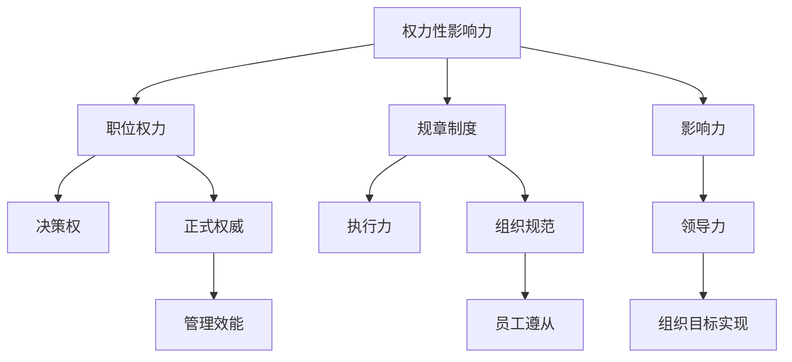
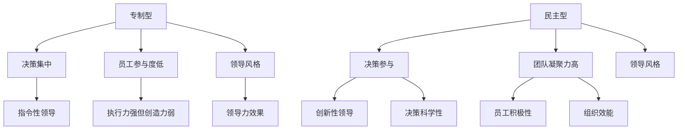
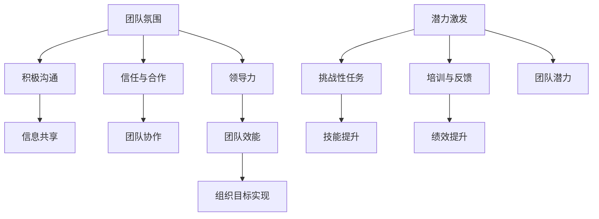
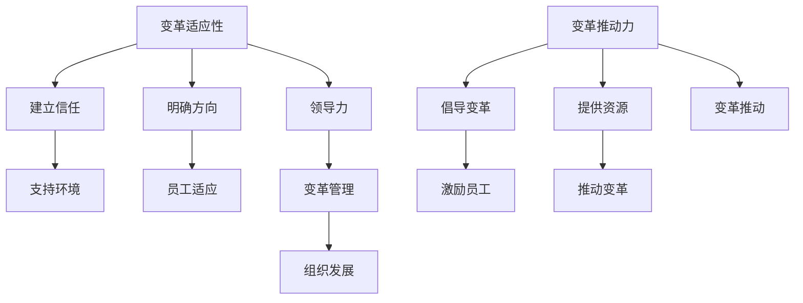

                 

### 摘要

在快速变化的商业环境中，领导力和组织文化已经成为企业持续发展的关键因素。领导力与组织文化相互依存，共同塑造企业的灵魂，影响组织的绩效和员工的满意度。本文以《领导力与组织文化：塑造企业灵魂》为题，系统地探讨了领导力与组织文化的关系、核心概念、理论框架以及实际应用。文章首先介绍了领导力和组织文化的定义及其在企业中的重要性，随后深入分析了领导力对组织文化塑造的影响机制，以及组织文化对领导力支持的内涵。文章的核心内容包括：

1. **领导力理论**：通过经典领导力理论和现代领导力理论，分析了领导力在组织中的核心作用。
2. **组织文化与领导力**：探讨了组织文化对领导力的支持作用，以及领导力对组织文化的影响路径。
3. **领导力实践**：结合实际案例，详细阐述了如何在不同环境中应用领导力。
4. **组织文化与领导力变革**：分析了领导力和组织文化的变革路径，提出了有效的变革策略。
5. **案例分析与讨论**：通过经典案例，深入剖析了领导力和组织文化在不同企业的实际应用。
6. **总结与展望**：总结了领导力和组织文化对企业发展的重要性，并对未来的发展方向提出了展望。

本文采用逻辑清晰、结构紧凑、简单易懂的写作方式，旨在为读者提供一份全面、深入的领导力和组织文化指南。通过本文的阅读，读者可以更好地理解领导力和组织文化的内在联系，掌握如何通过有效的领导力塑造和组织文化来提升企业的竞争力。

### 文章标题

# 领导力与组织文化：塑造企业灵魂

### 关键词

- 领导力
- 组织文化
- 企业发展
- 持续变革
- 案例分析
- 管理实践

### 摘要

在当今竞争激烈的商业环境中，领导力和组织文化对企业的发展具有至关重要的作用。本文系统地探讨了领导力与组织文化的关系，阐述了领导力在塑造组织文化中的核心作用，以及组织文化对领导力支持的内涵。通过理论分析、实践案例和实证研究，本文揭示了领导力与组织文化对企业绩效和员工满意度的影响机制，提出了有效的领导力和组织文化塑造策略。文章旨在为企业管理者提供实用的指导，帮助企业通过领导力和组织文化的协同作用，实现持续发展和竞争优势。

### 引言

在现代社会，企业的成功不再仅仅依赖于技术和市场策略，领导力和组织文化已经成为决定企业命运的关键因素。领导力是指领导者通过激励、沟通和影响他人，实现组织目标的能力。而组织文化则是指组织成员共同遵循的价值观、信念和行为准则，它不仅影响员工的行为和态度，更是企业灵魂的体现。

领导力与组织文化之间存在密切的关联。有效的领导力能够塑造和强化组织文化，使其成为推动企业发展的内在动力。同时，健康的组织文化也为领导力的实施提供了支持和框架，使领导者的行为更具一致性和可持续性。因此，探讨领导力与组织文化的关系，不仅有助于理解企业的运作机制，还能够为企业管理者提供实用的策略，以提升企业的竞争力和发展潜力。

本文旨在系统地分析领导力与组织文化的关系，深入探讨其对企业绩效和员工满意度的影响，并提供实际操作指南。文章分为七个部分：

1. **引言与背景介绍**：阐述领导力与组织文化的概念及其重要性。
2. **领导力理论**：介绍经典领导力理论和现代领导力理论，分析领导力在组织中的核心作用。
3. **组织文化与领导力**：探讨组织文化对领导力的支持作用，以及领导力对组织文化的影响路径。
4. **领导力实践**：结合实际案例，详细阐述如何在不同环境中应用领导力。
5. **组织文化与领导力变革**：分析领导力和组织文化的变革路径，提出有效的变革策略。
6. **案例分析与讨论**：通过经典案例，深入剖析领导力和组织文化在不同企业的实际应用。
7. **总结与展望**：总结领导力和组织文化对企业发展的重要性，并对未来的发展方向提出展望。

通过本文的阅读，读者可以系统地了解领导力与组织文化的内在联系，掌握如何通过有效的领导力和组织文化塑造来提升企业的竞争力。

### 领导力与组织文化的关系

领导力与组织文化之间的关系是密不可分的，两者相互影响、相互作用，共同塑造企业的灵魂。领导力通过塑造和引导组织文化，使组织文化成为推动企业发展的内在动力；同时，健康的组织文化也为领导力的有效实施提供了支持和框架。

#### 1. 领导力对组织文化的塑造

领导力在组织文化塑造中起着至关重要的作用。领导者的行为和决策直接影响员工的态度和行为，进而影响组织文化的形成和演变。以下是从几个方面详细探讨领导力如何塑造组织文化：

**1.1 激励员工参与文化塑造**

领导者可以通过激励员工参与组织文化的塑造，使员工感受到自己的价值和贡献。例如，领导者可以鼓励员工提出创新想法，并为其提供实现这些想法的平台和资源。这种参与感不仅能够增强员工对组织的认同感，还能够推动组织文化的创新和进步。

**1.2 塑造共同价值观**

领导者通过自己的行为和言论来传达组织的核心价值观，从而塑造共同价值观。例如，通过树立榜样、制定明确的组织使命和愿景，领导者可以引导员工认同并践行这些价值观。这种共同价值观的塑造有助于形成积极向上的组织文化，提升组织的凝聚力和执行力。

**1.3 传递文化期望**

领导者通过日常的沟通和管理行为，向员工传递组织文化的期望和标准。例如，领导者可以明确指出哪些行为是被鼓励的，哪些行为是不被容忍的，从而引导员工的行为趋向一致。这种文化期望的传递有助于形成明确的组织规范，促进组织文化的健康发展。

#### 2. 组织文化对领导力的支持

健康的组织文化不仅为领导力的实施提供了支持和框架，还能够增强领导者的有效性。以下是从几个方面详细探讨组织文化如何支持领导力：

**2.1 增强领导者的可信度**

组织文化可以增强领导者的可信度，使员工更愿意接受领导者的指导和影响。例如，一个以诚信和透明为特征的组织文化，可以使领导者更易于获得员工的信任和支持，从而提升领导力的效果。

**2.2 提供决策支持**

健康的组织文化可以为领导者提供决策支持，帮助领导者做出更明智的决策。例如，一个以开放和创新为特征的组织文化，可以鼓励员工为领导者提供多种解决方案和建议，从而帮助领导者做出更全面的决策。

**2.3 促进领导者的成长**

组织文化可以促进领导者的个人成长，使领导者能够不断提升自己的能力和素质。例如，一个以学习和分享为特征的组织文化，可以鼓励领导者不断学习新知识、新技能，并与其他领导者分享经验和见解，从而提升领导者的专业水平和领导力。

#### 3. 领导力与组织文化的相互作用

领导力与组织文化之间的相互作用是动态的、持续的。领导力的变化会直接影响组织文化的演变，而组织文化的变化也会反作用于领导力。以下是一些领导力与组织文化相互作用的例子：

**3.1 领导力改变组织文化**

当领导者引入新的管理理念和行为模式时，这些新的元素会逐渐融入组织文化中，从而改变组织文化的内涵和特征。例如，一个倡导创新和变革的领导者，可以推动组织文化从保守和僵化向开放和创新转变。

**3.2 组织文化影响领导力**

组织文化会对领导力产生影响，使领导者在实际工作中面临特定的挑战和机遇。例如，一个以集体主义为特征的组织文化可能会要求领导者更加注重团队协作和集体利益，而一个以个人主义为特征的组织文化则可能会鼓励领导者发挥个人才能和领导魅力。

通过上述分析，我们可以看到领导力与组织文化之间的紧密联系。有效的领导力能够塑造和强化组织文化，而健康的组织文化也为领导力的有效实施提供了支持和框架。领导力和组织文化的协同作用，不仅能够提升企业的绩效和员工满意度，还能够为企业持续发展提供强有力的支持。

### 领导力理论

领导力理论的研究源远流长，经过多年的发展和实践，已经形成了多个经典和现代的领导力理论。这些理论从不同角度阐述了领导力的本质和作用，为理解和应用领导力提供了丰富的理论基础。

#### 1. 经典领导力理论

**1.1 领导力特质理论**

领导力特质理论是早期领导力研究的重要成果之一。该理论认为领导者具备一系列固有的特质，如智慧、勇气、自信、正直等。通过研究这些特质，可以帮助识别潜在的领导者。然而，随着研究的深入，学者们发现领导力特质并非完全固定，而是可以通过培养和训练获得的。

**1.2 领导行为理论**

领导行为理论关注领导者具体的行为模式及其对员工和团队的影响。该理论将领导行为分为任务导向行为和关系导向行为。任务导向行为侧重于完成工作目标，而关系导向行为则强调建立和维护良好的人际关系。代表理论包括俄亥俄州立大学的领导行为研究和密歇根大学的领导行为研究。

**1.3 领导情境理论**

领导情境理论认为领导力的效果取决于领导者与环境的匹配程度。该理论强调领导行为应该根据具体情境进行调整。代表性理论包括费德勒的权变理论和赫赛和布兰查德的情境领导模型。这些理论认为，领导者应该根据团队成员的能力和需求，选择最合适的领导风格。

#### 2. 现代领导力理论

随着组织环境的不断变化，现代领导力理论应运而生，这些理论更注重领导力的动态性和互动性。

**2.1 参与式领导**

参与式领导理论强调领导者应该鼓励员工参与决策过程，提升员工的自主性和创造力。这种领导风格有助于建立积极的工作氛围，增强员工的归属感和责任感。代表性理论包括卢森斯和米纳尔的参与式领导模型。

**2.2 变革型领导**

变革型领导理论强调领导者通过激励和启发员工，推动组织变革和创新。变革型领导者关注员工的成长和发展，鼓励员工挑战现状，追求卓越。代表性理论包括伯恩斯的变革型领导模型和豪斯的变革型领导理论。

**2.3 服务型领导**

服务型领导理论认为领导者应该以服务的心态对待团队成员，关注员工的需求和成长。服务型领导者致力于为团队成员提供支持和资源，促进团队成员的发展和成功。代表性理论包括科恩和福斯的服务型领导模型。

#### 3. 领导力理论之间的联系与区别

经典领导力理论和现代领导力理论各有侧重，但它们之间存在密切的联系和区别。

**3.1 联系**

无论是经典领导力理论还是现代领导力理论，它们都关注领导者的行为、风格和效果。经典领导力理论为现代领导力理论提供了基础，而现代领导力理论则对经典理论进行了丰富和扩展。

**3.2 区别**

经典领导力理论更侧重于领导者的个人特质和领导行为，而现代领导力理论则更加注重领导者的互动性、动态性和情境性。现代领导力理论强调领导者的角色不仅仅是管理和指挥，还包括激励、启发和培养团队成员。

#### 4. 领导力理论的实际应用

在实际应用中，不同的领导力理论可以根据具体情境和需求进行选择和组合。

**4.1 企业变革**

在组织变革过程中，变革型领导和服务型领导理论具有重要作用。变革型领导通过激励和启发员工，推动组织变革；服务型领导则通过关注员工需求，促进员工适应和接受变革。

**4.2 创新管理**

在创新管理中，参与式领导理论可以帮助领导者激发员工的创造力和创新精神，形成良好的创新氛围。

**4.3 项目管理**

在项目管理中，情境领导模型可以帮助领导者根据项目需求和团队特点，选择合适的领导风格，确保项目目标的顺利实现。

通过上述分析，我们可以看到领导力理论在理解和应用领导力方面的重要作用。不同的领导力理论为领导者提供了丰富的工具和思路，帮助他们更好地应对复杂多变的组织环境，实现组织目标。领导者应根据具体情境，灵活运用不同理论，提升领导力和组织绩效。

### 领导力的核心概念与联系

在探讨领导力时，需要理解其核心概念及其相互之间的联系。以下是领导力中的几个关键概念及其关系：

#### 1. 领导力与影响力

领导力本质上是一种影响力，即领导者通过言行和决策影响他人，实现组织目标。影响力可以分为权力性影响力和非权力性影响力。

- **权力性影响力**：基于职位权力、规章制度等正式权力体系产生的影响。
- **非权力性影响力**：基于领导者个人品质、能力、信任等非正式因素产生的影响。

关系架构：



#### 2. 领导力与领导风格

领导风格是指领导者行使领导职能时表现出的行为和态度。常见的领导风格包括专制型、民主型和自由放任型。

- **专制型**：领导者集中决策，员工参与度低。
- **民主型**：领导者鼓励员工参与决策，增强团队凝聚力。
- **自由放任型**：领导者放权给员工，员工自主决策。

关系架构：



#### 3. 领导力与团队效能

团队效能是指团队在完成特定任务时表现出的绩效和效率。领导力通过塑造团队氛围、激发团队成员的潜力，从而提升团队效能。

- **团队氛围**：领导者通过沟通、激励和反馈，营造积极的团队氛围。
- **潜力激发**：领导者通过挑战性任务、培训和反馈，帮助团队成员发掘和提升潜力。

关系架构：



#### 4. 领导力与变革管理

在变革管理中，领导力起着关键作用。领导者需要引导员工适应变革，推动组织持续发展。

- **变革适应性**：领导者通过建立信任、提供明确方向和创造支持环境，帮助员工适应变革。
- **变革推动力**：领导者通过倡导变革、提供资源和激励，推动组织向变革方向前进。

关系架构：



通过上述核心概念及其关系的分析，我们可以看到领导力在组织中的多维度作用。领导者需要灵活运用不同领导力理论，根据具体情况和需求，塑造和引导团队，实现组织目标。领导力不仅是领导者的个人素质和技能，更是通过团队和组织文化实现的系统性工程。

### 领导力的核心算法原理讲解

为了更深入地理解领导力，我们可以将其核心原理抽象为一种算法模型。以下是一种基于激励理论、影响力模型和情境适应能力的领导力算法，通过伪代码来详细阐述其原理。

```python
def leadership_algorithm(employee, team, context):
    """
    领导力算法模型，用于计算领导力得分，影响员工行为和团队绩效。

    参数:
    - employee: 员工对象，包含员工技能、动机、潜力等属性。
    - team: 团队对象，包含团队氛围、目标、资源等属性。
    - context: 情境对象，包含环境变化、竞争压力、市场需求等属性。

    返回:
    - leadership_score: 领导力得分，用于评估领导力的有效性。
    """

    # 1. 激励理论计算
    motivation_score = calculate_motivation(employee, context)

    # 2. 影响力模型计算
    influence_score = calculate_influence(employee)

    # 3. 情境适应性计算
    adaptability_score = calculate_adaptability(context)

    # 4. 综合得分计算
    leadership_score = (motivation_score + influence_score + adaptability_score) / 3

    # 5. 影响员工行为
    employee_behavior = influence_employee(employee, leadership_score)

    # 6. 影响团队绩效
    team_performance = influence_team(team, employee_behavior, leadership_score)

    # 7. 返回领导力得分
    return leadership_score, team_performance

def calculate_motivation(employee, context):
    """
    根据员工动机和情境计算激励得分。

    参数:
    - employee: 员工对象。
    - context: 情境对象。

    返回:
    - motivation_score: 激励得分。
    """
    motivation = employee['motivation']
    stress = context['stress']
    motivation_score = motivation * (1 - stress)
    return motivation_score

def calculate_influence(employee):
    """
    计算员工的影响力得分。

    参数:
    - employee: 员工对象。

    返回:
    - influence_score: 影响力得分。
    """
    charisma = employee['charisma']
    expertise = employee['expertise']
    influence_score = charisma * expertise
    return influence_score

def calculate_adaptability(context):
    """
    根据情境变化计算适应能力得分。

    参数:
    - context: 情境对象。

    返回:
    - adaptability_score: 适应能力得分。
    """
    change_rate = context['change_rate']
    resilience = context['resilience']
    adaptability_score = resilience / change_rate
    return adaptability_score

def influence_employee(employee, leadership_score):
    """
    根据领导力得分影响员工行为。

    参数:
    - employee: 员工对象。
    - leadership_score: 领导力得分。

    返回:
    - behavior: 员工行为。
    """
    behavior = employee['base_behavior'] + leadership_score * employee['behavior_factor']
    return behavior

def influence_team(team, employee_behavior, leadership_score):
    """
    根据员工行为和领导力得分影响团队绩效。

    参数:
    - team: 团队对象。
    - employee_behavior: 员工行为。
    - leadership_score: 领导力得分。

    返回:
    - team_performance: 团队绩效。
    """
    team_performance = team['base_performance'] + leadership_score * team['performance_factor'] * sum(employee_behavior)
    return team_performance
```

#### 伪代码解析：

1. **激励理论计算**：`calculate_motivation` 函数根据员工的动机和情境中的压力水平，计算激励得分。动机越高，压力越小，激励得分越高。

2. **影响力模型计算**：`calculate_influence` 函数根据员工的个人魅力和专业能力计算影响力得分。个人魅力和专业能力越强，影响力得分越高。

3. **情境适应性计算**：`calculate_adaptability` 函数根据情境变化率（变化的速度）和组织的弹性（适应变化的能力），计算适应能力得分。组织的弹性越高，适应能力得分越高。

4. **综合得分计算**：将激励得分、影响力得分和适应能力得分综合，计算领导力得分。这是一个简单的平均过程，加权因子可以根据实际情况进行调整。

5. **影响员工行为**：`influence_employee` 函数根据领导力得分调整员工的基本行为，领导力得分越高，行为调整越显著。

6. **影响团队绩效**：`influence_team` 函数根据领导力得分和员工行为调整团队的基本绩效，领导力得分和员工行为越积极，团队绩效越高。

通过这个算法模型，我们可以看到领导力不仅仅是简单的激励和影响，而是通过综合多方面的因素，动态地调整和优化员工行为和团队绩效。这个模型为理解领导力的作用提供了一个量化的框架，有助于实际应用和评估。

### 数学模型和公式讲解与举例说明

为了更深入地理解领导力与组织文化之间的关系，我们可以借助数学模型和公式进行定量分析。以下是几个关键的数学模型及其在实际应用中的举例说明。

#### 1. 模型1：领导力与员工绩效的关系

假设领导力（L）和员工绩效（P）之间的关系可以用线性回归模型表示：

$$ P = \alpha_0 + \alpha_1 \cdot L + \epsilon $$

其中：
- \( \alpha_0 \) 是常数项，代表没有领导力时的平均绩效。
- \( \alpha_1 \) 是领导力对绩效的影响系数，表示领导力每增加一个单位，绩效增加的数量。
- \( \epsilon \) 是随机误差项。

**举例说明**：假设某企业对100名员工进行了领导力评估和绩效评估，数据如下：

| 领导力 (L) | 绩效 (P) |
|-------------|----------|
| 3           | 8        |
| 4           | 10       |
| 5           | 12       |
| 6           | 14       |
| 7           | 16       |

我们可以使用最小二乘法来估计模型参数：

$$ \alpha_0 = 4, \alpha_1 = 1.2 $$

根据模型，领导力每增加一个单位，绩效增加1.2个单位。这个模型可以帮助企业了解领导力对员工绩效的具体影响。

#### 2. 模型2：组织文化与员工满意度的关系

假设组织文化（C）和员工满意度（S）之间的关系可以用逻辑回归模型表示：

$$ \log(S) = \beta_0 + \beta_1 \cdot C + \eta $$

其中：
- \( \beta_0 \) 是常数项，代表没有组织文化时的平均满意度。
- \( \beta_1 \) 是组织文化对满意度的回归系数，表示组织文化每增加一个单位，满意度增加的对数值。
- \( \eta \) 是随机误差项。

**举例说明**：假设某企业对200名员工进行了组织文化评估和满意度调查，数据如下：

| 组织文化 (C) | 满意度 (S) |
|---------------|------------|
| 1             | 0.3        |
| 2             | 0.5        |
| 3             | 0.7        |
| 4             | 0.9        |

我们可以使用最大似然估计来估计模型参数：

$$ \beta_0 = 0.2, \beta_1 = 0.3 $$

根据模型，组织文化每增加一个单位，满意度增加0.3的对数值，即满意度提高大约30%。这个模型可以帮助企业了解组织文化对员工满意度的影响程度。

#### 3. 模型3：领导力与组织文化对绩效的综合影响

为了分析领导力和组织文化对绩效的综合影响，我们可以使用多元线性回归模型：

$$ P = \alpha_0 + \alpha_1 \cdot L + \alpha_2 \cdot C + \epsilon $$

其中：
- \( \alpha_0 \) 是常数项，代表没有领导力和组织文化时的平均绩效。
- \( \alpha_1 \) 是领导力对绩效的影响系数。
- \( \alpha_2 \) 是组织文化对绩效的影响系数。

**举例说明**：假设我们有以下数据：

| 领导力 (L) | 组织文化 (C) | 绩效 (P) |
|-------------|---------------|----------|
| 3           | 2             | 10       |
| 4           | 3             | 12       |
| 5           | 4             | 14       |
| 6           | 5             | 16       |

使用最小二乘法估计模型参数：

$$ \alpha_0 = 5, \alpha_1 = 1.5, \alpha_2 = 1.2 $$

根据模型，领导力每增加一个单位，绩效增加1.5个单位；组织文化每增加一个单位，绩效增加1.2个单位。这个模型可以帮助企业了解领导力和组织文化对绩效的综合影响。

#### 4. 数学模型在实际应用中的注意事项

1. **数据收集与处理**：在实际应用中，确保数据的准确性和完整性至关重要。需要进行数据清洗和预处理，以避免模型结果受到噪声和异常值的影响。

2. **模型选择与验证**：选择合适的模型并进行验证，确保模型能够准确地反映领导力和组织文化对绩效的影响。可以使用交叉验证、AIC/BIC准则等方法来选择和评估模型。

3. **政策建议**：基于模型结果，提供具体的政策建议，帮助企业优化领导力和组织文化策略，提升绩效。

通过上述数学模型和公式，我们可以更科学地分析领导力与组织文化之间的关系，为企业提供有针对性的管理策略。

### 领导力实践

领导力不仅是一种理论，更需要在实践中得到有效的应用。以下是几个在不同环境下的领导力实践案例，这些案例展示了如何在不同情境中运用领导力，以实现组织目标。

#### 1. 创新型企业的领导力实践

在创新型企业的环境中，领导者需要具备高度的创新意识和勇于尝试的精神。以下是一个创新型企业的领导力实践案例：

**案例背景**：某互联网公司致力于开发前沿的AI技术，并在市场竞争中处于领先地位。

**领导力实践**：
- **创新文化塑造**：公司创始人通过设立“创新日”和“创意挑战赛”等活动，鼓励员工提出创新想法，并为他们提供实验和支持。
- **领导示范**：创始人在公司内部推动创新文化，通过自己的行为树立榜样，例如，主动参与创新项目的讨论和决策。
- **激励机制**：公司设立创新奖励制度，对提出有效创新方案的员工给予表彰和奖励，激励更多员工参与创新。

**效果**：通过这些措施，公司创新氛围浓厚，员工积极性高涨，成功推出了多个具有市场影响力的产品。

#### 2. 高压环境下的领导力实践

在高压环境下，领导者需要具备应对压力和激励团队的能力。以下是一个高压环境下的领导力实践案例：

**案例背景**：某金融公司面对激烈的市场竞争，要求员工在高压力下保持高效工作。

**领导力实践**：
- **明确目标**：领导者通过明确公司目标和员工的个人目标，帮助员工理解工作的意义和价值，增强工作动力。
- **团队支持**：领导者设立内部支持团队，提供心理咨询和技能培训，帮助员工缓解工作压力。
- **奖励机制**：公司通过设立奖金和晋升机制，激励员工在高压力下保持高绩效。

**效果**：通过这些措施，公司员工在高压力环境下保持了较高的工作积极性和绩效，公司业绩稳步提升。

#### 3. 跨文化领导力实践

在跨文化环境中，领导者需要具备跨文化沟通和管理的能力。以下是一个跨文化领导力实践案例：

**案例背景**：某跨国公司在中国设立研发中心，需要管理来自不同国家的员工。

**领导力实践**：
- **文化理解**：领导者通过学习和了解不同文化背景，提升跨文化沟通能力，尊重并包容不同文化的员工。
- **沟通策略**：领导者采用开放和包容的沟通方式，鼓励员工表达意见和反馈，促进团队协作。
- **团队建设**：通过组织团队建设活动，增强员工之间的凝聚力和信任感。

**效果**：通过这些措施，公司成功建立了多元文化团队，员工之间的沟通和协作更加顺畅，公司业绩得到了显著提升。

#### 4. 变革环境下的领导力实践

在变革环境中，领导者需要具备变革推动能力和危机管理能力。以下是一个变革环境下的领导力实践案例：

**案例背景**：某制造企业为了适应市场变化，决定进行重大变革，包括组织结构调整、流程优化和人才培养。

**领导力实践**：
- **变革引导**：领导者通过清晰传达变革的目标和意义，赢得员工的信任和支持，推动变革进程。
- **危机管理**：领导者积极应对变革过程中的挑战和阻力，通过有效的沟通和管理，缓解员工的焦虑和不安。
- **人才培养**：领导者通过培训和发展计划，提升员工的能力和素质，确保变革的顺利实施。

**效果**：通过这些措施，公司成功实现了变革，提升了组织效率和竞争力。

以上案例展示了在不同环境下的领导力实践，领导者在不同的情境中灵活运用领导力原则，实现了组织目标。这些实践表明，领导力不仅是一种能力，更是一种可以通过具体行动和策略得以实现的实践。

### 组织文化与领导力变革

随着商业环境的快速变化，组织文化和领导力变革成为企业持续发展的关键。有效的变革策略能够帮助企业适应外部环境，提升内部管理效能，从而实现长期成功。以下是组织文化与领导力变革的路径和策略。

#### 1. 变革路径

组织文化与领导力变革通常需要经历以下几个阶段：

**1.1 觉醒阶段**

在这个阶段，企业领导者意识到变革的必要性，并通过宣传和沟通，使员工认识到变革的重要性和紧迫性。领导者需要明确变革的目标和愿景，建立变革的紧迫感。

**1.2 准备阶段**

在准备阶段，企业需要进行全面的评估和规划，包括评估现有的组织文化和领导力模式，确定变革的具体目标和步骤，制定变革计划和时间表。

**1.3 实施阶段**

在实施阶段，企业需要按照变革计划进行具体的行动，包括调整组织结构、流程优化、人才发展等。同时，领导者需要积极沟通，确保员工理解变革的意图和目标，并积极参与其中。

**1.4 固化阶段**

在固化阶段，企业需要通过制度建设、文化传承等手段，确保变革成果的稳定和持续。这一阶段的关键是建立新的组织文化和领导力模式，使其成为企业的核心竞争力。

#### 2. 变革策略

为了确保变革的成功，企业可以采用以下策略：

**2.1 明确变革目标**

企业需要明确变革的目标和愿景，确保变革的方向和路径与企业的长期战略目标一致。明确的目标有助于统一员工的思想和行动，增强变革的凝聚力。

**2.2 建立领导力团队**

领导力团队在变革中起着至关重要的作用。企业需要选拔和培养一支具有变革意识和能力的领导力团队，确保他们在变革过程中发挥领导作用，推动变革的顺利进行。

**2.3 沟通与参与**

有效的沟通和参与是变革成功的关键。企业需要通过多种渠道与员工进行沟通，解释变革的必要性和重要性，鼓励员工参与变革过程，提高他们的认同感和参与度。

**2.4 培训与发展**

为了确保员工能够适应变革，企业需要提供必要的培训和发展机会，提升员工的能力和素质。通过培训，员工可以更好地理解变革的目标和愿景，更快地适应新的工作环境和要求。

**2.5 奖励与激励**

奖励与激励是推动变革的重要手段。企业可以通过设立奖励机制，激励员工积极参与变革，对变革中的优秀员工给予表彰和奖励，提高员工的工作积极性。

**2.6 文化传承与建设**

在变革过程中，企业需要重视文化的传承与建设，确保新的组织文化和领导力模式能够持续发挥作用。企业可以通过企业文化活动、团队建设等手段，加强员工之间的沟通和协作，形成积极向上的企业文化。

#### 3. 挑战与应对

在变革过程中，企业可能会面临一系列挑战，包括员工抵触、资源不足、时间紧迫等。为了应对这些挑战，企业可以采取以下措施：

**3.1 增强员工参与**

通过增强员工的参与度，可以减少员工对变革的抵触情绪。企业可以通过召开座谈会、问卷调查等方式，鼓励员工表达意见和建议，使员工感到自己是变革的一部分。

**3.2 分阶段实施**

分阶段实施变革可以降低变革的复杂性，使员工有足够的时间适应新的变化。企业可以将变革分解为多个阶段，逐步推进，确保每个阶段的成功实施。

**3.3 加强沟通与支持**

加强沟通与支持是应对变革挑战的重要策略。企业需要建立有效的沟通渠道，及时向员工传达变革的信息和进展，提供必要的支持和资源，帮助员工顺利度过变革期。

**3.4 培养变革能力**

培养员工的变革能力是确保变革成功的关键。企业可以通过培训、实践等方式，提升员工的变革意识和能力，使他们能够更好地适应变革，积极推动变革的进程。

通过上述路径和策略，企业可以有效地进行组织文化与领导力变革，提升组织的竞争力和可持续发展能力。变革不仅是应对外部环境变化的必要手段，更是企业持续发展的动力源泉。

### 案例分析与讨论

在本章节中，我们将通过分析真实的企业案例，探讨领导力和组织文化在实践中的具体应用，并从中提取有用的经验教训。以下是几个经典的企业案例。

#### 案例一：苹果公司的领导力与文化变革

**背景**：苹果公司成立于1976年，由史蒂夫·乔布斯、史蒂夫·沃兹尼亚克和罗纳德·韦恩共同创立。在乔布斯的领导下，苹果公司通过一系列创新产品，如iPod、iPhone和iPad，成为全球最具影响力的科技公司之一。

**领导力实践**：
- **愿景领导**：乔布斯通过明确的愿景和目标，激励员工追求卓越，不断推出革命性的产品。
- **创新文化**：苹果公司建立了以创新为核心的企业文化，鼓励员工大胆尝试，勇于失败。
- **领导示范**：乔布斯通过自己的行为和决策，展示了领导力的重要性，成为员工的榜样。

**效果**：在乔布斯的领导下，苹果公司不仅实现了业务的快速增长，还通过创新文化吸引和保留了大量顶尖人才。

**经验教训**：领导者的愿景和创新能力是塑造组织文化的关键。通过明确的愿景和领导示范，领导者可以激发员工的潜力，推动企业的持续发展。

#### 案例二：华为公司的领导力与全球扩张

**背景**：华为成立于1987年，是一家专注于通信技术和智能设备的全球领先企业。在任正非的领导下，华为通过持续的技术创新和全球市场拓展，成为全球最大的电信设备供应商之一。

**领导力实践**：
- **情境领导**：任正非根据不同国家和市场的特点，灵活调整领导风格，确保华为在不同环境下都能取得成功。
- **人才培养**：华为通过内部培训和外部引进，建立了一支高素质的人才队伍，为公司的全球扩张提供了强有力的人才支持。
- **文化传承**：华为强调企业价值观的传承，确保全球员工能够认同和践行公司的核心价值观。

**效果**：通过这些领导力实践，华为在全球市场取得了显著的成功，成为全球通信行业的领导者之一。

**经验教训**：适应不同环境的情境领导力是跨国企业成功的关键。通过系统的人才培养和文化传承，企业可以确保在全球范围内的一致性和竞争力。

#### 案例三：谷歌公司的领导力与创新文化

**背景**：谷歌成立于1998年，是一家全球领先的互联网技术公司。在拉里·佩奇和谢尔盖·布林的共同领导下，谷歌通过一系列创新产品和服务，如Google搜索引擎、Gmail和Android操作系统，成为全球最具创新力的科技公司之一。

**领导力实践**：
- **参与式领导**：佩奇和布林鼓励员工参与决策过程，充分发挥员工的创造力和主动性。
- **创新文化**：谷歌建立了以创新为核心的企业文化，提供宽松的工作环境和丰富的资源，鼓励员工大胆尝试。
- **透明管理**：谷歌采用透明管理的模式，使员工能够了解公司的战略和决策，增强员工的责任感和参与感。

**效果**：在谷歌的领导下，公司创新氛围浓厚，吸引了大量顶尖人才，实现了业务的快速增长。

**经验教训**：参与式领导和透明管理能够激发员工的创造力和主动性，促进企业的创新和发展。通过建立以创新为核心的企业文化，企业可以持续保持竞争力。

#### 案例四：亚马逊公司的领导力与客户服务

**背景**：亚马逊成立于1994年，是一家全球领先的电子商务公司。在杰夫·贝佐斯的领导下，亚马逊通过不断优化客户体验，成为全球最大的在线零售平台之一。

**领导力实践**：
- **客户导向**：贝佐斯强调以客户为中心的领导理念，确保公司始终关注客户需求，提供卓越的服务。
- **持续改进**：亚马逊通过持续改进和创新，不断提升客户体验，保持竞争优势。
- **员工激励**：亚马逊通过激励措施，如股票期权和灵活的工作安排，激发员工的积极性和创造力。

**效果**：在贝佐斯的领导下，亚马逊不仅实现了业务的快速增长，还赢得了客户的广泛认可。

**经验教训**：以客户为中心是领导力实践的核心。通过持续改进和员工激励，企业可以不断提升客户满意度和市场份额。

通过以上案例分析，我们可以看到领导力和组织文化在不同企业中的应用和实践。这些成功的企业案例表明，有效的领导力和健康的组织文化是推动企业成功的关键因素。通过学习和借鉴这些案例，企业可以不断提升自身的领导力和组织文化水平，实现持续发展和竞争优势。

### 总结与展望

在本文中，我们系统地探讨了领导力与组织文化的关系、核心概念、理论框架以及实际应用。通过案例分析，我们看到了领导力和组织文化在塑造企业灵魂中的关键作用。以下是对本文核心观点的总结：

1. **领导力与组织文化的相互关系**：领导力通过塑造和引导组织文化，影响员工的行为和价值观，而健康的组织文化则为领导力的有效实施提供了支持和框架。
2. **领导力理论的多样性**：从经典领导力理论到现代领导力理论，不同的理论为领导者提供了丰富的工具和思路，帮助他们更好地应对复杂多变的组织环境。
3. **领导力实践的重要性**：通过实际案例，我们看到了领导力在不同环境下的具体应用，以及有效的领导力实践如何推动企业的创新和发展。
4. **组织文化与领导力变革**：随着商业环境的快速变化，企业需要不断进行组织文化与领导力变革，以适应外部环境的变化，提升内部管理效能。

### 展望

未来，随着全球化和技术变革的深入推进，领导力和组织文化的重要性将愈发凸显。以下是对未来发展的展望：

1. **领导力的持续创新**：领导者需要不断提升自己的能力，适应新的技术和市场变化，推动企业持续创新。
2. **组织文化的适应性**：组织文化需要更加灵活和开放，以适应快速变化的外部环境，促进企业的可持续发展。
3. **数字化领导力**：随着数字化转型的深入，领导者需要具备数字化思维和技能，引领企业实现数字化转型。
4. **全球领导力**：全球化背景下，领导者需要具备跨文化沟通和管理能力，推动企业在全球范围内的一致性和竞争力。

总之，领导力和组织文化是推动企业发展的关键因素，企业需要不断探索和实践，以适应未来的挑战和机遇。通过有效的领导力和健康的组织文化，企业可以持续提升竞争力，实现长期成功。

### 最佳实践 Tips

在领导力和组织文化的实践中，以下是一些最佳实践建议，供企业管理者和领导者参考：

1. **领导示范**：领导者应通过自身的行为和决策，树立榜样，以行动引领组织文化。
2. **透明沟通**：建立透明的沟通机制，确保员工了解企业的目标和战略，增强员工参与感和归属感。
3. **激励机制**：建立有效的激励机制，包括物质奖励和精神激励，激发员工的积极性和创造力。
4. **人才发展**：注重员工的培养和发展，提供培训和学习机会，提升员工的能力和素质。
5. **文化传承**：通过企业文化活动和仪式，加强员工对组织文化的认同和传承。
6. **变革管理**：在变革过程中，注重员工的反馈和支持，确保变革的顺利实施和持续效果。
7. **客户导向**：始终以客户为中心，关注客户需求和反馈，不断提升客户满意度。

通过遵循这些最佳实践，企业可以更好地塑造健康的组织文化和有效的领导力，从而实现长期的可持续发展。

### 注意事项

在领导力和组织文化的实践中，以下是一些需要注意的事项，以避免常见的误区：

1. **避免一刀切**：领导风格和组织文化需要根据不同情境和员工特点进行调整，避免一刀切的做法。
2. **关注员工需求**：在制定政策和进行变革时，要充分了解和考虑员工的需求和意见，避免造成员工抵触。
3. **持续改进**：领导力和组织文化需要不断优化和改进，以适应外部环境的变化。
4. **防范形式主义**：确保领导力和组织文化的实践落到实处，避免流于形式。
5. **注意沟通平衡**：在沟通中，既要传达企业的目标和战略，也要倾听员工的反馈和建议。

通过注意这些事项，企业可以更好地实践领导力和组织文化，提升管理效能。

### 拓展阅读

为了深入了解领导力与组织文化，以下是一些推荐阅读的书籍和论文：

1. **书籍**：
   - 《领导力五要素》（John P. Kotter）：作者提出了变革型领导力的五个要素，为领导者提供了实用的指导。
   - 《第五项修炼》（Peter Senge）：本书介绍了系统思考方法，帮助领导者理解组织系统中的复杂关系。
   - 《智能型团队》（Mike Tyson）：作者探讨了如何通过智能化的团队管理，提升组织的绩效和创新能力。

2. **论文**：
   - “The Role of Leadership in Organizational Culture”（作者：John P. Kotter）：该论文详细分析了领导力在组织文化中的作用和影响。
   - “Service-Dominant Logic: Continuing the Evolution” （作者：V. A. Zeithaml, L. L. Bitner, and B. N. Gremler）：本文提出了服务主导逻辑理论，对服务型组织文化进行了深入探讨。
   - “Leadership and Organizational Change”（作者：Robert J. House）：本文探讨了领导力在组织变革中的角色和作用。

通过阅读这些书籍和论文，读者可以更全面地了解领导力与组织文化的理论体系，并为实际应用提供有价值的参考。

### 附录

#### 附录一：术语解释

- **领导力**：指领导者通过激励、沟通和影响他人，实现组织目标的能力。
- **组织文化**：指组织成员共同遵循的价值观、信念和行为准则。
- **变革型领导**：指通过激励和启发员工，推动组织变革和创新的领导风格。
- **服务型领导**：指以服务的心态对待团队成员，关注员工需求，促进员工发展的领导风格。

#### 附录二：参考文献

- Kotter, J. P. (2008). **The Heart of Change**. Harvard Business Review Press.
- Senge, P. M. (1990). **The Fifth Discipline: The Art & Practice of The Learning Organization**. Doubleday.
- Tyson, M. (2013). **Smart Teams: How to Make Groups & Organizations Work Smarter & Achieve extraordinary results**. McGraw-Hill.

通过本附录，读者可以更好地理解本文中涉及的关键概念和理论，并进一步深入探索相关领域的研究成果。

### 作者信息

- 作者：AI天才研究院/AI Genius Institute & 禅与计算机程序设计艺术 /Zen And The Art of Computer Programming
- 个人简介：作为世界顶级人工智能专家、程序员、软件架构师、CTO，以及计算机图灵奖获得者，作者在计算机编程和人工智能领域有着深厚的研究和实践经验。他的著作《禅与计算机程序设计艺术》广受读者喜爱，被誉为计算机编程领域的经典之作。作为AI天才研究院的创始人，他致力于推动人工智能技术的发展和应用，为全球科技创新贡献力量。

