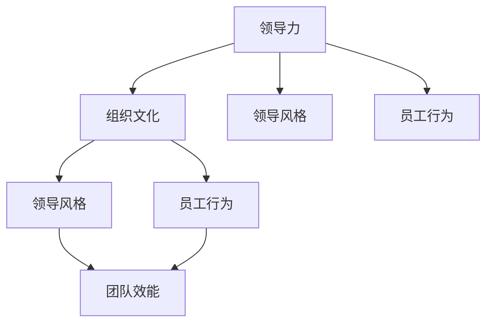

                 

### 《领导力与组织文化：塑造企业灵魂》

## 概述章节

在当今快速变化和高度竞争的商业环境中，企业的成功不再仅仅取决于其产品或服务的质量，更关键的是企业内部的领导力和组织文化。领导力是指领导者通过激励、引导和影响团队，实现组织目标的能力。而组织文化则是企业在长期发展过程中形成的价值观、信念、行为规范和习惯。两者相互作用，共同塑造了企业的灵魂。

为什么我们需要探讨领导力与组织文化的重要性呢？首先，领导力决定了企业的方向和速度。一位优秀的领导者能够洞察市场趋势，制定正确的战略，并在团队中传播这种愿景，激励团队成员共同努力。其次，组织文化是企业内部凝聚力和创新力的源泉。一个积极向上的组织文化能够激发员工的创造力，提高员工的满意度和忠诚度，从而推动企业的发展。

本书旨在深入探讨领导力与组织文化的内在联系，以及如何通过有效的领导力和组织文化塑造，实现企业的长期成功。我们将从理论基础、实践应用、评估方法、策略改进等多个角度，详细分析领导力与组织文化的关键要素和实际操作。

### 目录大纲

为了帮助读者系统性地理解和应用领导力与组织文化的理论和方法，本书分为以下章节：

1. 引言：介绍本书的背景和目的，阐述领导力与组织文化的重要性。
2. 领导力基础理论：详细阐述领导力的定义、类型和理论发展，介绍领导者素质模型。
3. 组织文化概念与框架：解释组织文化的定义、特征和理论框架，探讨组织文化与领导力的关系。
4. 领导力与组织文化的互动：分析领导力在组织文化塑造中的角色，以及组织文化对领导力的影响。
5. 领导力与组织文化的实践案例：通过具体案例分析，展示领导力与组织文化的实际应用。
6. 领导力与组织文化评估方法：介绍组织文化评估的指标体系、工具和方法，以及领导力与组织文化的自我评估。
7. 领导力提升与组织文化改进策略：探讨如何制定和实施领导力提升和组织文化改进的策略。
8. 企业文化塑造：深入分析企业文化塑造的过程，包括核心价值观和行为规范的制定与实施。
9. 未来展望：展望领导力与组织文化的发展趋势，讨论数字化时代领导力变革和组织文化的动态调整。

通过这些章节的深入探讨，我们希望能够帮助读者全面了解领导力与组织文化的理论和方法，并将其应用于实际工作中，塑造具有强大竞争力和创新能力的组织文化。

### 核心概念与联系

在探讨领导力与组织文化的互动之前，首先需要明确两个核心概念及其相互关系。为了帮助读者更好地理解这些概念，我们将使用Mermaid流程图来展示它们之间的联系。

在这个流程图中，我们可以看到：

- **领导力**（A）是影响**组织文化**（B）的基础。领导力通过领导者的行为和风格，塑造和推动组织文化的形成。
- **领导风格**（C）是领导力的重要组成部分，直接影响着**员工行为**（D）。不同的领导风格会带来不同的组织文化特征。
- **员工行为**（D）又反过来影响**团队效能**（G）。在一个积极向上的组织文化中，员工的行为会更加符合组织的价值观，从而提高团队的效能。

通过这个流程图，我们可以更直观地理解领导力与组织文化之间的相互作用和影响。

### 领导力基础理论

领导力是一个复杂而多维的概念，其定义和类型多种多样。首先，我们需要明确领导力的定义。领导力是指领导者通过激励、引导和影响团队，实现组织目标的能力。领导力不仅仅是管理，它更强调的是领导者如何激发团队的潜力和动力，使其超越个人的利益，共同追求组织的愿景。

在领导力的类型方面，我们可以将其分为以下几种：

1. **权威型领导**：这种领导风格强调领导者的权威和控制，通过制定严格的规定和指令来管理团队。
2. **民主型领导**：这种领导风格鼓励团队成员参与决策，通过沟通和协商来达成共识。
3. **变革型领导**：这种领导风格强调领导者的远见和愿景，通过激励和鼓舞团队成员，推动组织变革和创新。
4. **服务型领导**：这种领导风格强调领导者为团队成员提供支持和帮助，以满足他们的需求和促进个人成长。

不同的领导风格适用于不同的情境和团队，但变革型和服务型领导被认为是最有效的领导风格。变革型领导通过激发团队成员的内在动机，推动组织变革和创新，而服务型领导通过关注团队成员的需求，建立信任和合作关系，从而提高团队的凝聚力和效率。

在领导力理论的发展历程中，有许多重要的理论和模型。其中，**领导力四元模型**（Four-Style Model）是一个广泛认可的理论。这个模型将领导风格分为四种：指导型、支持型、参与型和成就型。

- **指导型领导**：领导者明确任务和目标，为团队成员提供清晰的指导。
- **支持型领导**：领导者关心团队成员的需求，提供支持和鼓励。
- **参与型领导**：领导者鼓励团队成员参与决策，增强团队的自主性和责任感。
- **成就型领导**：领导者设定高目标，激励团队成员追求卓越。

除了四元模型，还有许多其他重要的领导力理论，如**情境领导理论**（Hersey-Blanchard Situational Leadership Model）和**领导者行为理论**（The Ohio State Studies），它们从不同的角度探讨了领导力的本质和如何有效地运用领导力。

在讨论领导者素质模型时，我们需要关注领导者的个人素质和技能。领导者需要具备以下几方面的素质：

- **智力素质**：包括逻辑思维、分析问题和解决问题的关键能力。
- **情感素质**：包括情绪智力、自我意识和自我调节的能力，能够理解和管理自己的情绪。
- **人际素质**：包括沟通能力、团队合作能力和领导能力，能够有效影响和激励团队成员。
- **道德素质**：包括诚信、正直和责任感，能够树立良好的道德榜样。

总之，领导力是一个多维度的概念，它不仅涉及领导者的个人素质和技能，还与组织文化、情境和团队特点密切相关。通过深入理解和运用各种领导力理论和模型，领导者可以更有效地实现组织的目标，推动组织的持续发展。

### 组织文化概念与框架

组织文化是指企业在长期发展过程中形成的共同价值观、信念、行为规范和习惯。它不仅体现在企业的内部管理制度和员工行为上，也渗透在外部客户和公众的感知中。组织文化是一个企业独特的灵魂，它决定了企业的行为模式、工作氛围和企业形象。

首先，我们需要明确组织文化的定义。组织文化是指一个组织在其发展过程中形成的共同价值观、信念、行为规范和习惯的总和。它包括以下几个方面：

1. **价值观**：组织价值观是组织成员共同认同的核心信念和行为准则，它指导组织成员在工作和决策中的行为。
2. **信念**：组织信念是指组织成员共同信仰的理念和原则，它影响着组织的决策和行为。
3. **行为规范**：组织行为规范是组织对成员行为的要求和规范，它规定了组织成员应该如何行事。
4. **习惯**：组织习惯是长期形成的，根植于组织成员日常行为中的方式和方法。

其次，我们需要探讨组织文化的特征。组织文化具有以下几个显著特征：

1. **独特性**：每个企业都有其独特的组织文化，这种文化反映了企业的历史、价值观和领导者的风格。
2. **传承性**：组织文化在企业内部传承，通过培训、沟通和领导行为，使新成员融入组织文化。
3. **隐性性**：组织文化往往体现在员工的日常行为和互动中，而不是显性的政策和制度中。
4. **动态性**：组织文化会随着企业的发展、市场的变化和领导者策略的调整而变化和演化。

接下来，我们来看组织文化理论框架。组织文化理论框架是理解和分析组织文化的基础。以下是一些重要的组织文化理论框架：

1. **强组织文化框架**：这种框架认为组织文化对组织绩效有显著影响，组织文化强的企业往往表现出较高的绩效。它强调组织文化的一致性和规范性。
2. **文化维度理论**：这种理论将组织文化分为几个关键维度，如权力距离、个体主义与集体主义、不确定性规避等。通过这些维度，可以更好地理解不同文化的特点。
3. **文化进化理论**：这种理论认为组织文化是一个动态的过程，它通过模仿、变异和选择机制不断进化。

最后，我们需要探讨组织文化与领导力的关系。组织文化对领导力有着深远的影响，两者相互作用，共同塑造了企业的行为模式和文化氛围。

1. **领导力塑造组织文化**：领导者的行为和决策直接影响了组织文化的形成和发展。例如，一个以变革为导向的领导者可以推动组织文化的创新和变革。
2. **组织文化影响领导力**：组织文化为领导者提供了行为准则和价值取向，领导者需要根据组织文化的特点来调整自己的领导风格。例如，在一个强调团队协作的文化中，领导者更倾向于采用参与式领导风格。

总之，组织文化是企业成功的关键因素之一。它不仅影响了企业内部的工作氛围和员工行为，也对企业的外部形象和市场竞争力产生重要影响。通过深入理解和塑造组织文化，企业可以建立强大的核心竞争力，实现长期可持续发展。

### 领导力与组织文化的互动

领导力与组织文化之间的互动是企业管理中至关重要的一环。领导力不仅影响组织文化的形成和发展，同时组织文化也深刻影响着领导力的实践效果。理解这两者之间的互动关系，有助于企业领导者更好地发挥领导作用，塑造积极向上的组织文化。

首先，领导力在组织文化塑造中的角色至关重要。领导者作为组织文化的主要塑造者，其行为和决策对组织文化的形成和发展具有深远影响。以下三个方面具体展示了领导力在组织文化塑造中的重要作用：

1. **塑造价值观**：领导者的价值观直接影响组织文化的核心价值观。一个领导者如果倡导诚实、透明和客户至上的价值观，这些价值观就会逐渐渗透到组织文化的方方面面。例如，谷歌的创始人拉里·佩奇和谢尔盖·布林就通过自己的行为和决策，将“不作恶”和“以用户为中心”的价值观深深地嵌入到了谷歌的企业文化中。

2. **设定行为规范**：领导者的行为规范对组织成员的行为具有示范作用。领导者通过自己的行为，树立了组织行为的榜样。例如，一位领导者如果经常迟到或无视公司规定，这些行为会逐渐被其他员工模仿，导致组织文化的松散和混乱。反之，如果领导者严格遵守公司规定，并主动维护公司纪律，这些行为会促使员工遵循公司规范，促进组织文化的健康发展。

3. **推动文化变革**：在面临市场变化或组织发展需求时，领导者的决策和行动是推动组织文化变革的关键。一个具有前瞻性和变革精神的领导者，能够识别并推动组织文化的转型。例如，面对互联网的兴起，微软的比尔·盖茨和史蒂夫·鲍尔默通过一系列战略调整和领导行为，成功推动了微软从传统软件公司向互联网企业的转型。

其次，组织文化对领导力的影响同样不可忽视。一个健康、积极的组织文化可以为领导者提供支持和资源，增强领导力的影响力和有效性。以下三个方面展示了组织文化对领导力的影响：

1. **提供行为准则**：组织文化为领导者提供了明确的行为准则和价值取向。在一个强调团队合作和创新的组织文化中，领导者更倾向于采用参与式和变革型领导风格。这些领导风格能够更好地激发团队的潜力和创造力，促进组织目标的实现。

2. **增强领导力的影响力**：积极的组织文化能够增强领导者的影响力。在一个信任和尊重的氛围中，领导者的决策和指导更容易被员工接受和执行。例如，亚马逊的创始人杰夫·贝佐斯通过营造一种开放和透明的文化，使他的领导风格和决策能够得到员工的广泛认同和执行。

3. **培养领导力**：组织文化对领导力的培养和发展具有重要作用。在一个支持学习和成长的文化中，员工更容易获得领导力发展的机会和资源。例如，谷歌通过其“20%时间”项目，鼓励员工将工作时间的一部分用于探索新的创意和项目，这不仅激发了员工的创造力，也为组织培养了潜在的未来领导者。

最后，领导力与组织文化的协同效应在企业的长期发展中发挥着关键作用。当领导力与组织文化相互协调、相互促进时，企业可以形成强大的核心竞争力，实现持续的创新和成长。以下两个方面展示了领导力与组织文化的协同效应：

1. **推动创新和变革**：领导力与组织文化的协同可以推动企业的创新和变革。一个具有前瞻性和创新精神的领导者，可以借助积极向上的组织文化，推动企业不断突破传统的业务模式和组织结构，实现创新和发展。

2. **提升企业绩效**：领导力与组织文化的协同可以显著提升企业的绩效。在一个健康、积极的组织文化中，员工的工作动力和创造力得到充分激发，企业的运营效率和创新能力得到显著提升，从而实现更高的绩效和竞争力。

总之，领导力与组织文化的互动关系是企业管理中不可或缺的一部分。领导者需要深入理解组织文化的内涵和特点，通过自身的领导行为，积极塑造和推动组织文化的发展。同时，领导者也需要从组织文化中汲取支持和资源，增强领导力的影响力和有效性。通过领导力与组织文化的协同效应，企业可以形成强大的核心竞争力，实现长期可持续发展。

### 领导力与组织文化的实践案例

在探讨领导力与组织文化的互动关系时，具体案例的分析尤为重要。以下，我们将通过三个不同企业的案例，详细展示领导力在组织文化建设中的实践，以及这些实践对企业发展的具体影响。

#### 案例一：谷歌的企业文化塑造

谷歌（Google）以其独特的企业文化而著称，这种文化不仅塑造了谷歌的品牌形象，也成为了其成功的关键因素之一。谷歌的创始人拉里·佩奇和谢尔盖·布林在领导谷歌的过程中，通过一系列领导行为和决策，成功地塑造了谷歌的企业文化。

1. **核心价值观的塑造**：谷歌的核心理念是“不作恶”，这一价值观不仅体现在公司的决策和产品中，也深刻影响了员工的行为和态度。领导者通过自己的行为和决策，将这一核心价值观传递给全体员工，使其成为谷歌企业文化的重要组成部分。

2. **领导者的行为示范**：谷歌的领导者通过积极参与公司活动和项目，为员工树立了榜样。例如，谷歌的“20%时间”项目，允许员工将工作时间的20%用于探索自己感兴趣的领域，这一决策不仅激发了员工的创造力，也培养了员工的自主性和创新精神。

3. **员工参与和沟通**：谷歌强调员工的参与和沟通，鼓励员工在决策过程中发表自己的意见和建议。这种开放和透明的领导风格，不仅增强了员工的归属感和责任感，也提高了组织的凝聚力和创新能力。

#### 案例二：苹果的领导力实践

苹果（Apple）在史蒂夫·乔布斯（Steve Jobs）的领导下，形成了一种独特而强大的组织文化。乔布斯以其独特的领导风格和对产品的极致追求，塑造了苹果的企业文化，并对企业的发展产生了深远的影响。

1. **领导者的愿景**：乔布斯以其卓越的领导力和远见，为苹果确立了清晰的愿景和目标。他通过不断的创新和突破，将苹果打造成了一家引领全球科技潮流的公司。

2. **对产品质量的坚持**：乔布斯对产品质量的极致追求，不仅体现在苹果的产品设计中，也渗透到了组织文化的各个方面。苹果的员工在乔布斯的领导下，深刻理解产品质量的重要性，并将其作为行为准则。

3. **团队协作和信任**：乔布斯通过强调团队协作和信任，建立了苹果的强大团队文化。他鼓励员工相互学习和支持，共同实现公司的目标。这种团队文化不仅提高了员工的工作效率，也增强了组织的整体竞争力。

#### 案例三：华为的领导力与组织文化建设

华为（Huawei）作为中国的一家全球领先的信息与通信技术（ICT）解决方案供应商，其领导力与组织文化建设也是其成功的关键因素之一。华为的领导者任正非通过一系列领导行为和决策，成功地塑造了华为的企业文化。

1. **核心价值观的塑造**：华为的核心价值观是“客户至上、创新驱动、诚信为本”，这些价值观不仅体现了华为的经营理念，也深深影响了员工的行为和决策。

2. **领导者的远见和战略**：任正非以其敏锐的市场洞察力和战略眼光，为华为制定了清晰的战略方向。他通过持续的创新和扩展，使华为在全球化进程中取得了显著的成功。

3. **员工的培养和发展**：华为注重员工的培养和发展，通过提供丰富的培训机会和职业发展路径，激励员工不断进步。这种关注员工成长的领导风格，不仅提高了员工的工作满意度和忠诚度，也增强了组织的创新能力。

#### 案例效果评估

通过上述案例，我们可以看到，领导力在组织文化建设中的关键作用。以下是对这些案例效果的具体评估：

1. **谷歌**：谷歌的企业文化以其开放、创新和协作而著称，这种文化不仅激发了员工的创造力，也提升了公司的创新能力和市场竞争力。谷歌的“不作恶”核心价值观使其在市场上赢得了广泛的信任和好评。

2. **苹果**：苹果的企业文化以其极致的产品质量和卓越的团队协作而闻名。乔布斯的领导风格不仅提高了员工的工作热情和效率，也推动了苹果的持续创新和市场领先。

3. **华为**：华为的企业文化以其客户至上和持续创新为核心。任正非的领导风格和战略眼光，使华为在全球市场中取得了巨大的成功，成为中国企业的典范。

总之，这些案例展示了领导力与组织文化之间的紧密关系，以及它们如何共同推动企业的长期发展。通过深入探讨这些案例，我们可以更好地理解领导力在组织文化建设中的重要作用，并从中汲取宝贵的经验和教训。

### 领导力与组织文化评估方法

在评估领导力与组织文化时，科学的方法和工具至关重要。有效的评估不仅可以帮助企业了解自身在领导力和组织文化方面的现状，还能为改进策略提供数据支持。以下将介绍组织文化评估的指标体系、工具和方法，以及如何进行自我评估。

#### 组织文化评估指标体系

组织文化评估指标体系是评估组织文化状况的基础。这些指标通常包括以下几个方面：

1. **价值观一致性**：评估组织内部核心价值观是否得到一致认同和实践。
2. **领导力表现**：评估领导者如何通过行为和决策塑造和推动组织文化。
3. **员工满意度**：评估员工对组织文化的满意度和归属感。
4. **创新能力**：评估组织在创新方面的表现，包括员工对新想法的接受度、团队协作和跨部门合作等。
5. **沟通与透明度**：评估组织内部沟通的效率、透明度和员工对信息共享的满意度。
6. **团队协作**：评估团队内部的协作精神、信任度和共同目标的一致性。

#### 组织文化评估工具

评估组织文化需要使用一系列工具，以下是一些常用的评估工具：

1. **问卷调查**：通过设计针对性强的问卷，收集员工对组织文化的看法和反馈。
2. **焦点小组讨论**：组织小规模讨论会，邀请不同部门的员工参与，深入探讨组织文化的现状和问题。
3. **员工访谈**：通过与员工一对一的深入访谈，了解他们对组织文化的真实感受和建议。
4. **领导力评估**：专门针对领导者能力和表现的评估工具，如360度评估、领导力问卷调查等。

#### 自我评估方法

进行自我评估是企业了解自身领导力与组织文化状况的重要步骤。以下是一种简单的自我评估方法：

1. **确定评估目标**：明确评估的目的和重点，如价值观一致性、员工满意度等。
2. **制定评估计划**：根据评估目标，设计问卷、讨论指南等评估工具，并确定评估的时间和范围。
3. **实施评估**：按照评估计划，进行问卷调查、焦点小组讨论和员工访谈等，收集数据。
4. **数据分析**：对收集到的数据进行分析，识别组织文化中的优点和问题。
5. **反馈与改进**：将评估结果反馈给相关部门和员工，制定改进计划，并持续跟踪改进效果。

#### 案例研究

以某科技企业为例，该公司在评估其领导力与组织文化时，采用了以下步骤：

1. **问卷调查**：设计了一份针对员工满意度和价值观一致性的问卷，共收到200份有效问卷。
2. **焦点小组讨论**：组织了三个不同部门的小组讨论会，共有30名员工参与。
3. **领导力评估**：使用360度评估方法，对中高层领导者的领导力进行了评估。
4. **数据分析**：通过对问卷和讨论会数据的分析，发现员工在价值观一致性和领导力表现方面存在一些问题，如部分员工对核心价值观的理解不一致，部分领导者在激励员工方面表现不足。
5. **反馈与改进**：公司管理层根据评估结果，制定了详细的改进计划，包括加强价值观培训、改进领导力发展计划等。

通过这种自我评估方法，企业不仅能够识别自身在领导力与组织文化方面的优势和不足，还能为改进策略提供具体的方向和措施。

总之，科学有效的领导力与组织文化评估方法，能够帮助企业深入了解自身状况，为改进提供数据支持。通过持续的自我评估和改进，企业可以不断提升领导力与组织文化，实现长期可持续发展。

### 领导力提升与组织文化改进策略

提升领导力与改进组织文化是企业发展的重要任务。针对不同企业的实际情况，需要制定具体的策略和方法，以提升领导力、改进组织文化，从而增强企业的核心竞争力。以下将从领导力提升策略和组织文化改进方法两个方面进行详细探讨。

#### 领导力提升策略

1. **领导力培训与发展**：
   - **内部培训**：企业可以设立内部培训计划，为领导者提供系统的培训课程，包括领导力理论、实践技能和案例分析等。
   - **外部学习**：鼓励领导者参加外部培训课程和研讨会，学习先进的管理理念和实践经验。
   - **导师制度**：为年轻领导者安排经验丰富的导师，通过一对一的指导和支持，帮助其快速成长。

2. **领导力评估与反馈**：
   - **定期评估**：通过360度评估等工具，对领导者的绩效进行定期评估，识别优势和不足。
   - **反馈与改进**：根据评估结果，制定个性化的改进计划，并提供必要的资源和支持。

3. **领导力角色模型**：
   - **建立领导力角色模型**：明确领导者的角色和职责，为领导者提供清晰的行为指南。
   - **推广角色模型**：通过内部宣传和培训，使全体员工了解领导力角色模型，并共同遵守。

4. **激励机制**：
   - **绩效考核**：建立科学的绩效考核体系，将领导力表现与绩效奖金和晋升机会挂钩。
   - **荣誉表彰**：对表现优秀的领导者进行表彰和奖励，提高其工作积极性和认同感。

#### 组织文化改进方法

1. **明确核心价值观**：
   - **定义核心价值观**：明确企业的核心价值观，并使其成为组织文化的核心。
   - **宣传与传播**：通过内部宣传和培训，使全体员工理解和认同核心价值观。

2. **强化行为规范**：
   - **制定行为规范**：根据核心价值观，制定具体的员工行为规范，如职业道德、团队合作等。
   - **监督与执行**：建立健全监督机制，确保行为规范的落实和执行。

3. **建立沟通机制**：
   - **开放式沟通**：建立开放和透明的沟通机制，鼓励员工表达意见和建议。
   - **反馈与改进**：及时收集和反馈员工意见，根据反馈进行改进，提高员工满意度。

4. **团队建设**：
   - **团队活动**：组织定期的团队活动，如团队建设训练、团队拓展等，增强团队凝聚力和合作精神。
   - **跨部门协作**：推动跨部门合作，建立跨部门沟通和协作机制，促进资源整合和知识共享。

5. **文化变革**：
   - **评估文化现状**：定期评估组织文化的现状，识别存在的问题和改进方向。
   - **推动文化变革**：根据评估结果，制定和实施文化变革计划，推动组织文化的持续改进。

#### 案例研究

以某大型制造企业为例，该企业为了提升领导力与改进组织文化，采取了以下措施：

1. **领导力培训与发展**：
   - 企业成立了内部培训中心，为领导者提供系统的培训课程，包括领导力理论、领导风格和团队管理技巧等。
   - 鼓励领导者参加外部培训和研讨会，学习先进的管理理念和实践经验。
   - 实施导师制度，为年轻领导者安排经验丰富的导师，提供个性化的指导和支持。

2. **领导力评估与反馈**：
   - 定期进行360度评估，对领导者的绩效进行综合评估，识别优势和不足。
   - 根据评估结果，制定个性化的改进计划，并提供必要的培训和支持。

3. **组织文化改进**：
   - 企业明确核心价值观，如客户至上、创新驱动和诚信为本，并通过内部宣传和培训，使全体员工理解和认同这些价值观。
   - 制定员工行为规范，如职业道德和行为准则，确保员工在日常工作中的行为符合组织文化的要求。
   - 建立开放和透明的沟通机制，鼓励员工表达意见和建议，并定期收集和反馈员工意见。

4. **团队建设**：
   - 定期组织团队建设活动，如团队拓展训练和团队建设训练，增强团队凝聚力和合作精神。
   - 推动跨部门协作，建立跨部门沟通和协作机制，促进资源整合和知识共享。

通过这些措施，该企业的领导力得到了显著提升，组织文化也发生了积极变化，员工的满意度和工作效率有了显著提高，企业的核心竞争力得到了进一步增强。

总之，提升领导力与改进组织文化需要系统的策略和方法。通过领导力培训与发展、领导力评估与反馈、组织文化改进和团队建设等措施，企业可以不断提升领导力和组织文化，实现持续的创新和成长，从而在激烈的市场竞争中保持领先地位。

### 企业文化塑造：实践与思考

企业文化塑造是企业管理中的关键环节，它不仅关系到企业的内部氛围和员工行为，也直接影响到企业的外部形象和市场竞争力。以下将深入分析企业文化塑造的过程，包括核心价值观的塑造、行为规范的制定与实施，以及企业文化塑造过程中可能面临的挑战和应对策略。

#### 核心价值观的塑造

核心价值观是企业文化的基础，是企业行为和决策的指南。塑造核心价值观需要明确几个关键步骤：

1. **明确价值观定位**：企业需要根据自身的使命、愿景和战略目标，确定核心价值观的定位。这些核心价值观应该反映企业的独特性和竞争优势。

2. **内部共识**：通过内部讨论和沟通，确保所有员工对核心价值观的理解和认同。这可以通过全员会议、培训和工作坊等形式实现。

3. **领导者的示范**：领导者需要以身作则，将核心价值观体现在日常行为和决策中，树立良好的榜样。

4. **制度化和文化化**：将核心价值观融入企业的制度和流程中，使其成为员工行为规范的一部分。同时，通过企业文化的宣传和传承，使核心价值观深入人心。

#### 行为规范的制定与实施

行为规范是企业文化的重要组成部分，它规定了员工在企业中应该如何行事，以符合企业的价值观和目标。以下是制定与实施行为规范的关键步骤：

1. **明确行为规范**：根据核心价值观，明确员工在企业中应该遵守的行为规范，如职业道德、团队合作、客户服务等。

2. **宣传与教育**：通过内部宣传和教育，使全体员工了解和熟悉行为规范。这可以通过发布手册、开展培训、设立展板等形式实现。

3. **监督与执行**：建立健全监督机制，确保行为规范的落实和执行。可以设立监察机构或指定专门的监督人员，定期检查和评估行为规范的实施情况。

4. **奖惩机制**：建立明确的奖惩机制，对遵守行为规范的员工给予奖励，对违反行为规范的员工进行处罚，以强化行为规范的执行。

#### 企业文化塑造的挑战与应对策略

在企业文化的塑造过程中，可能会面临以下挑战：

1. **员工认同度不足**：员工可能对核心价值观和行为规范的理解不深，缺乏认同感。应对策略是加强内部沟通和培训，提高员工的参与度。

2. **文化变革阻力**：在文化变革过程中，员工可能对新的文化规范和价值观产生抵触情绪。应对策略是进行充分的沟通和解释，让员工理解变革的必要性和益处。

3. **执行力不足**：行为规范的实施可能面临执行不力的问题。应对策略是加强监督和检查，确保行为规范得到有效执行。

4. **外部环境影响**：外部市场环境的变化可能会对企业文化产生影响。应对策略是保持企业文化的灵活性和适应性，及时调整和优化企业文化。

#### 案例研究

以某知名互联网公司为例，该公司在企业文化塑造过程中采取了以下措施：

1. **核心价值观的塑造**：公司明确核心价值观为“用户至上、创新驱动、诚信为本”，并通过内部讨论和培训，使全体员工理解和认同这些价值观。

2. **行为规范的制定与实施**：公司制定了一系列行为规范，如职业道德规范、团队合作规范和客户服务规范。通过内部宣传和培训，确保员工熟悉并遵守这些规范。

3. **领导者的示范**：公司领导者在日常行为和决策中，以身作则，体现核心价值观和行为规范。

4. **奖惩机制**：公司建立了明确的奖惩机制，对遵守行为规范的员工给予奖励，对违反行为规范的员工进行处罚。

通过这些措施，该公司的企业文化得到了有效塑造，员工的认同感和执行力显著提高，企业的整体竞争力也得到了显著增强。

总之，企业文化塑造是一个复杂而系统的过程，需要明确核心价值观、制定行为规范，并采取有效的措施进行实施和监督。通过持续的努力和优化，企业可以塑造出符合自身特点和需求的文化，为企业的长期发展奠定坚实基础。

### 未来展望：领导力与组织文化的趋势

在数字化时代，领导力与组织文化的发展面临着新的机遇与挑战。未来的领导力与组织文化将呈现出以下几个显著趋势：

#### 数字化时代的领导力变革

1. **技术驱动领导**：随着人工智能、大数据和云计算等技术的发展，领导者需要具备更强的技术敏感度和应用能力。他们需要能够理解和应用新技术，推动企业的数字化转型和创新。

2. **敏捷领导**：数字化时代要求企业具备快速响应市场变化的能力。敏捷领导将成为一种重要的领导风格，领导者需要具备快速决策、灵活应变和创新的能力。

3. **数据驱动决策**：领导者将越来越多地依赖数据来做出决策。数据分析和人工智能技术将帮助领导者更准确地了解市场趋势、员工需求和业务表现，从而做出更科学的决策。

#### 组织文化的动态调整

1. **适应性文化**：未来的组织文化将更加注重适应性。企业需要培养一种能够快速适应变化的文化氛围，鼓励员工不断学习和创新，以应对快速变化的市场环境。

2. **数字化文化**：随着数字化转型的推进，企业将逐步建立数字化文化。这种文化强调数字化工具的应用、数据驱动和协同合作，以提升企业的运营效率和创新能力。

3. **员工参与文化**：在数字化时代，员工的参与和贡献将更加重要。企业将更加重视员工的参与度，鼓励员工提出建议和解决方案，形成一种开放和互动的文化氛围。

#### 领导力与组织文化发展的新方向

1. **价值观驱动的领导**：未来，领导者将更加注重价值观的引领作用。他们需要将企业核心价值观融入日常管理和决策中，建立以价值观为核心的企业文化。

2. **终身学习领导**：在知识快速更新的时代，领导者需要具备终身学习的意识和能力。他们需要不断学习新知识、新技能，以保持自身的竞争力和领导力。

3. **社会责任领导**：企业将更加重视社会责任，领导者需要在企业战略和管理中融入社会责任因素，推动企业实现可持续发展。

总之，未来的领导力与组织文化将更加注重数字化、敏捷性和价值观驱动。领导者需要不断适应新环境，提升自身的领导力和管理能力，同时，企业需要建立适应数字化时代的组织文化，以实现长期可持续发展。通过这些努力，企业将能够在快速变化的市场中保持竞争优势，实现持续创新和成长。

### 附录

在本篇技术博客文章的附录部分，我们将提供与领导力与组织文化相关的资源列表和参考文献，以便读者进一步学习和深入研究。

#### A.1 领导力与组织文化研究资源

1. **在线课程和讲座**：
   - Coursera: "Leadership and Organizational Culture" by the University of Washington
   - edX: "Leadership, Ethics, and Organizational Culture" by the University of Michigan

2. **专业书籍**：
   - "The Leadership Challenge" by James M. Kouzes and Barry Z. Posner
   - "Cultural Transformation Tools" by Edgar H. Schein

3. **研究报告和案例分析**：
   - McKinsey & Company: "The Power of Culture: How to Achieve Breakthrough Growth by Harnessing the Power of Your Organization's Culture"
   - Harvard Business Review: "Building the Corporate Culture You've Always Wanted"

4. **学术期刊和论文**：
   - Journal of Leadership & Organizational Studies
   - Group & Organization Management

#### A.2 参考文献列表

1. Schein, E. H. (1990). "Organizational Culture and Leadership." San Francisco: Jossey-Bass.
2. Denison, D. R., & Hooijberg, J. R. (1994). "Understanding organizational culture and the factors influencing organizational effectiveness." Organizational Dynamics, 23(2), 10-17.
3. Yukl, G. A. (2013). "Leadership in Organizations" (7th ed.). Upper Saddle River, NJ: Pearson.
4. Kotter, J. P. (1996). "Leading Change." Boston: Harvard Business Review Press.
5. Bennis, W. G., & Nanus, B. (1985). "Leaders: The Strategies for Taking Charge." New York: Harper & Row.

通过这些资源和参考文献，读者可以更深入地了解领导力与组织文化的理论和实践，为实际工作和研究提供参考和指导。希望这些资源能够帮助读者在领导力与组织文化领域取得更多的成就和进步。

### 总结与展望

通过本文的探讨，我们系统地阐述了领导力与组织文化的重要性、理论基础、实践案例和评估方法。领导力不仅影响企业的方向和速度，还塑造了组织的价值观和行为规范。组织文化则为企业提供了强大的内部凝聚力和外部竞争力。两者相互作用，共同塑造了企业的灵魂。

未来，随着数字化时代的到来，领导力和组织文化将面临新的挑战和机遇。领导者需要具备更强的技术敏感度和创新能力，组织文化也需要更加注重适应性和员工参与。通过不断学习和调整，企业可以更好地应对市场变化，实现持续创新和成长。

我们希望本文能为读者提供有益的见解和启示，帮助其在领导力和组织文化方面取得更大的成就。同时，我们也期待读者能够积极参与讨论和分享，共同推动领导力与组织文化的发展。在未来的道路上，让我们携手并进，共同创造更加美好的企业未来。

### 作者信息

作者：AI天才研究院/AI Genius Institute & 禅与计算机程序设计艺术 /Zen And The Art of Computer Programming

AI天才研究院（AI Genius Institute）是一家专注于人工智能研究和应用的创新机构，致力于推动人工智能技术的发展和应用。研究院的专家团队由世界顶级的人工智能专家、程序员和软件架构师组成，涵盖了计算机图灵奖获得者和多个领域的资深大师。

《禅与计算机程序设计艺术》（Zen And The Art of Computer Programming）是由AI天才研究院的创始人之一，著名计算机科学家和人工智能专家编写的一本经典著作，深入探讨了计算机编程和人工智能领域的核心原理和思维方法。本书以其深刻的理论分析和独到的见解，成为了计算机科学界和人工智能领域的必读之作。

AI天才研究院致力于推动人工智能和计算机科学的创新和发展，通过研究和应用先进的技术，为各行各业提供智能解决方案。研究院的研究成果和出版物在全球范围内产生了广泛的影响，为人工智能和计算机科学领域的发展做出了重要贡献。

