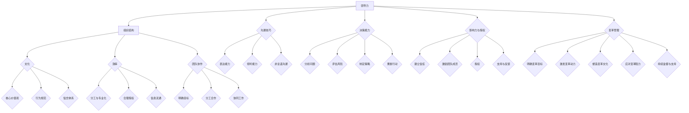

                 

### 引言

在现代信息技术迅猛发展的时代，领导力和组织结构在企业中的重要性日益凸显。领导力不仅影响着企业的战略决策和执行，更是决定团队效率和员工满意度的重要因素。而组织结构则是企业运作的基础，直接关系到企业的运作效率和创新能力。本文将深入探讨领导力与组织结构之间的关系，通过系统分析领导力的理论基础、组织结构优化策略以及实际案例，为企业提供优化团队架构的实用指南。

首先，我们将回顾领导力的基础理论，从领导力的定义、类型、核心要素以及领导力的演变与新时代特点等方面展开讨论，帮助读者理解领导力在不同组织环境中的应用与影响。接下来，我们将探讨领导力与组织文化的相互关系，分析组织文化的类型、领导力对组织文化的影响，以及如何建立积极的组织文化和进行有效的变革管理。

随后，文章将重点分析组织结构的优化。我们将从组织结构的概念、类型、设计原则和变革趋势等方面进行详细探讨，并结合实际案例说明如何进行组织结构优化。此外，文章还将介绍团队建设与管理的重要性，以及如何识别与管理团队角色，促进团队协作与沟通。

本文还将深入探讨领导力与团队绩效的关系，提供提升团队绩效的策略和方法，包括设定明确的目标、提供必要的资源与支持以及建立有效的绩效评估与反馈机制。最后，我们将通过实际案例，展示领导力与组织结构在实际应用中的成效，并探讨未来领导力与组织结构的发展趋势。

通过本文的详细分析，希望读者能够对领导力与组织结构的关系有更深刻的理解，掌握优化团队架构的有效策略，从而提升企业的整体竞争力。

### 关键词

领导力、组织结构、团队架构、企业文化、变革管理、团队建设、协作、绩效评估。

### 摘要

本文探讨了领导力与组织结构在企业中的重要性及其相互关系。首先，从领导力的理论基础出发，分析了领导力的定义、类型、核心要素及领导力的演变与新时代特点。接着，探讨了领导力与组织文化的相互关系，并分析了组织结构的概念、类型、设计原则和变革趋势。随后，文章深入讨论了团队建设与管理的重要性，以及提升团队绩效的策略与方法。通过实际案例分析，本文展示了领导力与组织结构优化在实际应用中的成效。最后，文章展望了未来领导力与组织结构的发展趋势，为企业提供了优化团队架构的实用指南。

### 第一部分：领导力理论基础

#### 第1章：领导力概述

##### 1.1 领导力的定义与类型

领导力，这个词汇在企业管理、团队协作乃至整个社会管理中都占据着举足轻重的地位。然而，究竟何为领导力？领导力有哪些类型？这是我们需要首先明确的问题。

**定义**

领导力可以简单定义为一种能够影响和激励他人共同实现目标的能力。它不仅仅是职位赋予的权力，更多的是一种个人特质和影响力。因此，领导力不仅存在于管理者、领导者之中，也存在于每一个普通员工身上。根据James MacGregor Burns的观点，领导力是一种“通过激励、鼓励和支持他人来一起实现共同愿景的过程”。

**类型**

领导力可以根据不同的维度和情境划分为多种类型，以下是几种常见的领导力类型：

1. **权威型领导（Authoritative Leadership）**：这种类型的领导者通常具有明确的愿景和目标，并通过坚定的指导和决策来引导团队。他们具有很强的决策能力和自信，能够快速做出决策并确保团队执行。

2. **民主型领导（Democratic Leadership）**：这种类型的领导者更注重团队成员的参与和意见。他们鼓励团队成员参与决策过程，通过团队合作来达成共识和目标。这种领导风格有助于增强团队成员的归属感和参与感。

3. **变革型领导（Transformational Leadership）**：变革型领导者通过激励和启发团队成员，推动他们超越自我，共同实现更高目标。他们具有非凡的愿景和远见，能够激发团队成员的潜能，并引导他们朝向共同的目标努力。

4. **交易型领导（Transactional Leadership）**：交易型领导者更多依赖于奖励和惩罚机制来激励团队成员。他们通过明确的绩效标准和奖励系统来激励团队成员，确保团队目标的实现。

5. **服务型领导（Servant Leadership）**：服务型领导者注重团队成员的发展和福祉，他们认为领导者的首要任务是服务团队成员，帮助他们实现个人和团队目标。

**领导力的核心要素**

领导力不仅包括各种类型的领导风格，更包含一系列核心要素。以下是领导力的几个核心要素：

1. **沟通技巧**：有效的沟通是领导力的基础。领导者需要具备良好的表达能力、倾听能力和非言语沟通能力，以便准确传达信息、理解团队成员的需求和情感。

2. **决策能力**：领导者需要能够在复杂和不确定的环境下做出明智的决策。这要求领导者具备分析问题、评估风险和制定策略的能力。

3. **影响力与授权**：领导者需要能够影响他人，包括激励和指导团队成员。同时，他们还需要懂得如何授权，让团队成员在各自职责范围内自主决策和行动。

**领导力的演变与新时代特点**

领导力并非一成不变，它随着时代的变化和社会的发展而不断演变。在传统工业时代，领导力主要依赖于权威和控制。然而，随着信息时代的到来，领导力逐渐向民主、变革和服务型转变。

1. **从权威到民主**：随着信息获取的便利性和知识共享的普及，领导者不再能够单方面决定一切。现代领导者需要更多倾听团队成员的意见，鼓励他们参与决策，从而提高团队的整体效率和创造力。

2. **从控制到激励**：在快速变化的环境中，控制型领导风格已不再适用。现代领导者更需要通过激励和启发来引导团队成员，激发他们的积极性和创造力。

3. **从个体到生态**：新时代的领导力强调领导者不仅是团队的核心，更是整个组织生态的维护者和促进者。领导者需要关注团队与外部环境的关系，构建良好的组织生态，以支持团队的长期发展。

综上所述，领导力是一个复杂而多维的概念，它涉及多种领导风格和核心要素。在不同环境和时代背景下，领导力也在不断演变和更新。理解领导力的定义、类型和核心要素，对于提升个人领导能力和优化团队架构具有重要意义。

#### 1.2 领导力的核心要素

领导力不仅仅是一种职位赋予的权力，更是一种能力，一种能够激励和影响他人共同实现目标的能力。要成为一名有效的领导者，需要具备一系列核心要素，这些要素不仅决定了领导者的个人魅力和影响力，也直接影响到团队和组织的绩效。以下是领导力的几个核心要素：

**沟通技巧**

沟通是领导力的基石。有效的沟通不仅能够帮助领导者传达愿景和目标，还能够建立信任和促进团队协作。一个优秀的领导者需要具备以下几种沟通技巧：

1. **表达能力**：领导者需要能够清晰地表达自己的想法和意图，使团队成员能够准确理解。这包括使用简单、明确的语言，避免使用专业术语和复杂的句子结构。

2. **倾听能力**：倾听是沟通的重要组成部分。领导者需要认真倾听团队成员的意见和建议，了解他们的需求和情感。这不仅有助于建立信任，还能够发现潜在的问题和改进机会。

3. **非言语沟通**：领导者还需要注重非言语沟通，如肢体语言、面部表情和语调。这些非言语线索能够补充和强化言语信息，帮助团队成员更好地理解领导者的意图。

**决策能力**

决策能力是领导者必须具备的重要能力之一。在一个充满不确定性和变化的环境中，领导者需要能够在复杂和紧迫的情况下做出明智的决策。以下是一些提高决策能力的策略：

1. **分析问题**：领导者需要能够准确地识别问题，分析问题的根本原因，并理解问题的各个方面。

2. **评估风险**：在做出决策之前，领导者需要评估可能的风险和潜在的影响。这有助于领导者做出更加全面和慎重的决策。

3. **制定策略**：领导者需要能够制定多种可能的策略，并评估每种策略的优缺点。这有助于确保决策的多样性和灵活性。

4. **果断行动**：领导者需要果断地采取行动，即使面临不确定性和压力。果断行动能够帮助团队迅速应对挑战，抓住机遇。

**影响力与授权**

影响力是领导者引导和激励他人的关键。而授权则是领导者提升团队绩效和自我成长的重要手段。以下是影响力与授权的一些核心要点：

1. **建立信任**：领导者需要通过言行一致、透明和诚信来建立信任。信任是影响力和授权的基础。

2. **激励团队成员**：领导者需要了解团队成员的需求和动机，并通过激励来激发他们的潜能。激励可以包括奖励、认可和职业发展机会等。

3. **授权**：领导者需要懂得如何授权，让团队成员在各自的职责范围内自主决策和行动。这有助于提高团队成员的参与感和责任感，同时也能够减轻领导者的负担。

4. **支持与反馈**：领导者需要为团队成员提供必要的支持和资源，并给予及时的反馈。支持与反馈能够帮助团队成员改进工作，实现个人和团队目标。

**领导力的演变与新时代特点**

领导力不是一成不变的，它在不同的时代和社会背景下不断演变。特别是在信息时代和全球化背景下，领导力呈现出一些新的特点：

1. **从权威到民主**：随着信息获取的便利性和知识共享的普及，领导者不再能够单方面决定一切。现代领导者需要更多倾听团队成员的意见，鼓励他们参与决策，从而提高团队的整体效率和创造力。

2. **从控制到激励**：在快速变化的环境中，控制型领导风格已不再适用。现代领导者更需要通过激励和启发来引导团队成员，激发他们的积极性和创造力。

3. **从个体到生态**：新时代的领导力强调领导者不仅是团队的核心，更是整个组织生态的维护者和促进者。领导者需要关注团队与外部环境的关系，构建良好的组织生态，以支持团队的长期发展。

综上所述，领导力的核心要素包括沟通技巧、决策能力和影响力与授权。这些要素不仅决定了领导者的个人魅力和影响力，也直接影响到团队和组织的绩效。理解并掌握这些核心要素，对于提升个人领导能力和优化团队架构具有重要意义。

#### 1.3 领导力的演变与新时代特点

领导力作为一种组织管理和团队协作的重要能力，其发展历程与社会环境和技术的进步密不可分。从传统的工业时代到当今的信息时代，领导力经历了深刻的变革和转型，逐步适应新的时代特点和社会需求。

**领导力的演变历程**

1. **工业时代领导力**：在工业时代，领导力主要依赖于权威和控制。领导者通常拥有绝对的决策权和管理权，通过制定严格的规定和制度来确保组织的运行。这种领导风格强调纪律和效率，但在信息传递和团队互动方面存在一定的局限性。

2. **后工业时代领导力**：随着信息技术的迅猛发展和知识经济的兴起，后工业时代的领导力开始向民主和变革型转变。领导者不再仅仅是命令的发布者，而是更多地扮演指导者和激励者的角色，鼓励团队成员的参与和创新。

3. **全球化时代的领导力**：全球化带来了更加复杂和多变的环境，要求领导者具备跨文化沟通和协调能力。全球化时代的领导力更加注重多样性和包容性，强调领导者需要能够理解和尊重不同文化和背景的团队成员。

**新时代领导力的特点**

1. **信息共享与透明度**：在信息时代，信息的获取和传播变得更加便捷。领导者需要建立透明和开放的组织文化，鼓励信息共享和知识交流。这不仅有助于提高团队的整体知识水平，还能够增强团队成员的归属感和信任感。

2. **个性化与多元化**：新时代的领导者需要适应团队成员的个性化需求，尊重他们的差异和多样性。这包括文化、性别、年龄、职业背景等方面的差异。通过个性化管理，领导者能够更好地激发团队成员的潜能和创造力。

3. **灵活性与适应性**：在快速变化的环境中，领导者需要具备高度的灵活性和适应性。这要求领导者不仅能够快速响应市场变化，还能够灵活调整组织结构和策略，以保持竞争优势。

4. **持续学习和创新**：信息时代的领导者需要具备持续学习和创新的能力。这包括对新技术的掌握、对新管理理念的接受以及对自身领导风格的不断反思和改进。只有不断学习和创新，领导者才能在复杂多变的环境中保持领先地位。

**新时代领导力的挑战与机遇**

1. **数字化转型的挑战**：随着数字化技术的普及，领导者需要应对数字化转型带来的挑战。数字化转型不仅要求领导者具备相关的技术知识，还需要他们能够理解和引导团队适应新的工作方式和管理模式。

2. **智能化时代的机遇**：智能化技术的发展为领导者带来了新的机遇。通过智能算法和数据分析，领导者能够更准确地了解团队和组织的运行状况，做出更加科学和高效的决策。

3. **全球化的挑战与机遇**：全球化带来了更多的市场机会和合作伙伴，但同时也带来了文化冲突和沟通障碍。领导者需要具备跨文化沟通和协调能力，以应对全球化带来的挑战，并抓住机遇。

综上所述，领导力的演变与新时代特点紧密相关。领导者需要不断适应新的社会环境和技术的进步，提升自身的领导能力，以应对新时代的挑战和机遇。通过信息共享、个性化管理、灵活性与适应性以及持续学习和创新，领导者能够更好地引导团队实现共同的目标。

### 第二部分：领导力与组织文化

#### 第2章：领导力与组织文化

组织文化是企业在长期发展过程中形成的共同价值观、行为准则和信念体系。它不仅影响着企业内部的员工行为，还直接关系到企业的外部形象和市场竞争力。而领导力作为组织管理的重要工具，与组织文化密切相关，二者相互作用，共同塑造企业的文化和氛围。在本章中，我们将探讨领导力与组织文化的相互关系，分析组织文化的类型、领导力对组织文化的影响，以及如何建立积极的组织文化和进行有效的变革管理。

#### 2.1 组织文化与领导力

组织文化可以理解为企业的“精神面貌”，它体现在企业的价值观、行为规范、管理风格和员工的行为方式中。一个健康的组织文化能够激发员工的积极性和创造力，促进企业的可持续发展。而领导力在组织文化中起着至关重要的作用，它不仅能够塑造和传播组织文化，还能够通过领导行为影响员工的行为和文化认知。

**组织文化的定义与类型**

组织文化是指企业在长期运营过程中，由共同价值观、信仰、行为规范和团队互动模式所形成的一种整体氛围。组织文化可以分为以下几个主要类型：

1. **权力型文化**：在这种文化中，权力高度集中在领导者手中，决策由上级单独做出，下属需要严格遵循上级的指示。这种文化通常强调纪律和效率，但可能抑制创新和员工主动性。

2. **任务型文化**：任务型文化强调团队协作和目标导向，鼓励员工积极参与决策和任务分配。领导者更多扮演协调者和支持者的角色，注重任务的完成和团队的整体绩效。

3. **人员型文化**：人员型文化以员工为中心，重视员工的个人发展和职业成长。领导者注重员工的需求和意见，鼓励员工提出创新和建议，营造一个开放和支持的工作环境。

4. **目标导向型文化**：目标导向型文化强调明确的目标和结果，领导者通过设定目标和激励机制来引导员工。这种文化鼓励竞争和创新，注重个人和团队的绩效。

**领导力对组织文化的影响**

领导力是组织文化的重要塑造者，领导者的行为和管理风格直接影响组织文化的形成和演变。以下从几个方面分析领导力对组织文化的影响：

1. **价值观传递**：领导者的价值观和信念通过言行传递给团队成员，成为组织文化的重要组成部分。领导者的行为方式、决策风格和人际关系都会影响员工的行为和价值观。

2. **文化氛围营造**：领导者的行为和管理风格直接影响组织的工作氛围。一个鼓励创新、支持合作和包容差异的领导风格有助于形成积极的组织文化，而一个专制、压抑和排斥异见的领导风格则可能导致消极的文化氛围。

3. **文化变革推动**：在组织发展的不同阶段，领导力在文化变革中起着关键作用。领导者需要具备变革管理和文化重塑的能力，通过激励和引导员工，推动组织文化从传统向现代、从单一向多元的转变。

#### 2.2 建立积极的组织文化

建立积极的组织文化是企业实现长期成功的关键。一个健康的组织文化不仅能够提高员工的满意度和归属感，还能够提升企业的创新能力和市场竞争力。以下是一些建立积极组织文化的策略：

**培养积极氛围的策略**

1. **明确核心价值观**：企业需要明确和传播核心价值观，确保全体员工对企业的使命、愿景和价值观有清晰的认识。这有助于建立一致的企业文化，促进员工的共同目标和行为准则。

2. **倡导开放沟通**：领导者需要倡导开放和坦诚的沟通氛围，鼓励员工表达意见和反馈。这有助于增强团队的凝聚力，提高员工的工作满意度和参与度。

3. **激励员工参与**：通过激励员工参与决策和管理，提高他们的责任感和归属感。这可以通过员工会议、团队建设活动和员工提案制度等方式实现。

4. **重视员工发展**：企业需要为员工提供职业发展的机会和培训，鼓励员工不断学习和成长。这有助于提高员工的技能水平和职业满意度，增强企业的核心竞争力。

**激励团队的方法**

1. **奖励与认可**：通过奖励和认可员工的成就和贡献，提高他们的工作积极性和满意度。这可以包括奖金、晋升、荣誉称号等多种形式。

2. **工作设计**：通过设计有意义和挑战性的工作，提高员工的工作投入和创造力。例如，可以设置团队目标、项目挑战和自主学习任务等。

3. **文化建设活动**：组织团队建设活动和公司文化日，增强员工的团队意识和归属感。这可以包括团建活动、文化展览和团队竞赛等。

#### 2.3 领导力在变革管理中的作用

组织变革是企业在不断变化的市场环境中保持竞争力的关键。领导力在变革管理中起着至关重要的作用，领导者需要具备变革管理和文化重塑的能力，以推动企业顺利实现变革。

**变革管理的定义与挑战**

变革管理是指企业在面对市场变化、技术进步和组织发展需求时，通过规划和实施一系列变革措施，以实现组织目标的过程。变革管理面临以下几大挑战：

1. **组织惯性的挑战**：企业长期形成的组织惯性往往使得变革难以推进，员工可能对变革持抵触态度，甚至出现抵制行为。

2. **利益相关者的冲突**：变革往往涉及利益相关者的重新分配，如职位调整、资源重新配置等，这可能导致内部矛盾和冲突。

3. **组织文化的阻力**：如果企业的组织文化不利于变革，如过于保守、官僚主义等，变革将面临巨大的阻力。

**领导力在变革管理中的关键作用**

1. **明确变革目标**：领导者需要明确变革的目标和方向，确保全体员工对变革有清晰的认识和期望。

2. **激发变革动力**：领导者需要激发员工的变革动力，通过激励和引导，使员工认识到变革的必要性和重要性。

3. **塑造变革文化**：领导者需要通过塑造积极的变革文化，推动员工接受变革，并积极参与其中。这可以通过宣传变革理念、举办培训活动等方式实现。

4. **应对变革阻力**：领导者需要识别和应对变革中的各种阻力，如解决员工的不满和疑虑，建立有效的沟通机制等。

5. **持续监督与支持**：领导者需要持续监督变革的进展，提供必要的支持和资源，确保变革措施得到有效执行。

综上所述，领导力与组织文化密切相关，领导者的行为和管理风格直接影响组织文化的形成和发展。通过培养积极氛围、激励团队和推动变革，领导者能够有效塑造和优化组织文化，提升企业的整体竞争力。

### 第二部分：组织结构优化

#### 第3章：组织结构概述

组织结构是企业内部各个部门、团队和员工之间相互关系的具体体现，是企业管理的基础框架。一个合理的组织结构能够提高企业的运行效率和团队协作效果，从而提升整体竞争力。在本章中，我们将从组织结构的概念、类型、设计原则和变革趋势等方面进行详细探讨，帮助读者理解组织结构的重要性，并掌握优化组织结构的策略。

#### 3.1 组织结构的概念与类型

**概念**

组织结构是指企业内部各部门、团队和员工之间相互关系的具体安排和组合方式。它包括组织内部的权力分配、职责划分、信息流动和决策机制等。组织结构不仅是企业管理的基础，也是企业实现战略目标和运营目标的关键要素。

**类型**

组织结构可以根据不同的维度和特点进行分类，以下是几种常见的组织结构类型：

1. **职能型组织结构（Functional Organization Structure）**：职能型组织结构按照功能将企业划分为不同的职能部门，如市场营销部、生产部、人力资源部等。每个职能部门由一名职能经理负责，下属员工按照职能分工开展工作。这种结构的优点是职责明确、管理简单，有利于专业化和分工协作，但缺点是部门之间协调困难，响应市场变化较慢。

2. **事业部型组织结构（Divisional Organization Structure）**：事业部型组织结构按照产品、地区或客户群体将企业划分为多个事业部。每个事业部独立运作，拥有自己的人力资源、财务和市场部门，事业部经理负责本事业部的日常运营和战略规划。这种结构的优点是灵活性和自主性较高，能够迅速响应市场变化，缺点是部门之间的协调成本较高，信息流通不畅。

3. **矩阵型组织结构（Matrix Organization Structure）**：矩阵型组织结构结合了职能型和事业部型的特点，按照职能和产品或项目双重维度进行管理。员工既属于某个职能部门，又参与某个特定项目或产品的开发。这种结构的优点是能够实现跨部门协作，提高资源利用效率，缺点是管理层次复杂，可能导致权力冲突和责任不清。

4. **网络型组织结构（Network Organization Structure）**：网络型组织结构是一种高度灵活、去中心化的组织形式，企业通过与其他组织建立合作伙伴关系来实现共同目标。在这种结构中，企业不再是传统的“命令-控制”模式，而是通过共享资源和信息，实现快速响应和协同创新。这种结构的优点是灵活性和创新性较高，缺点是需要强大的网络管理和协调能力。

#### 3.2 组织结构的设计原则

**效率原则**

组织结构的效率原则强调通过合理分工和协作，提高企业的运营效率和资源利用效率。以下是实现效率原则的一些关键原则：

1. **分工与专业化**：按照功能、产品或地区等维度将企业划分为不同的部门或团队，使员工能够专注于特定领域的工作，提高专业水平和效率。

2. **合理授权**：赋予各部门或团队足够的自主权和决策权，使他们能够根据实际情况进行快速反应和调整，减少层级传递的延迟和成本。

3. **信息流通**：建立有效的信息流通机制，确保信息在组织内部快速、准确地传递，提高决策效率和团队协作效果。

**职责分工原则**

职责分工原则是指明确每个部门、团队和员工的具体职责和任务，确保企业运营的有序性和协调性。以下是实现职责分工原则的关键原则：

1. **明确职责范围**：为每个部门和团队设定清晰的职责范围，避免职责重叠和冲突，确保每个环节都有明确的负责人。

2. **岗位责任与权利匹配**：确保每个岗位的责任和权利相匹配，使员工能够在其职责范围内自主决策和行动，提高工作积极性和责任感。

3. **明确的绩效评估**：建立科学的绩效评估体系，对每个部门和员工的工作表现进行客观评价，激励员工提高工作效率和质量。

**协调原则**

协调原则强调通过有效的沟通和协作，实现各部门和团队之间的协调和配合，确保企业整体目标的实现。以下是实现协调原则的关键原则：

1. **沟通机制**：建立多层次的沟通机制，确保信息在各部门和团队之间的快速、准确传递，减少误解和冲突。

2. **协调会议**：定期举行协调会议，讨论和解决跨部门的问题和冲突，确保各部门和团队之间的协作顺畅。

3. **共享目标**：明确企业整体目标和各部门、团队的具体目标，确保所有成员都朝着共同的目标努力，提高整体协作效果。

#### 3.3 组织结构变革的趋势

随着社会和技术的不断进步，组织结构也在不断变革和优化。以下是当前组织结构变革的几个主要趋势：

**灵活性**

在快速变化的市场环境中，企业需要具备高度的灵活性，以迅速应对市场变化和客户需求。以下是一些提高组织结构灵活性的方法：

1. **去中心化**：减少管理层级，赋予员工更多的自主权，使企业能够快速响应市场变化。

2. **敏捷团队**：采用敏捷开发方法，建立跨职能的敏捷团队，提高团队的协作效率和创新能力。

3. **虚拟组织**：利用互联网和信息技术，建立虚拟组织，实现远程协作和资源共享。

**平台化**

平台化组织是一种以平台为核心的组织结构，通过平台连接不同组织和企业，实现资源和能力的最大化利用。以下是一些实现平台化组织的策略：

1. **生态系统**：构建企业生态系统，引入合作伙伴和外部资源，形成互利共赢的生态体系。

2. **开放共享**：鼓励内部和外部资源的开放共享，提高资源利用效率和创新速度。

3. **平台管理**：建立有效的平台管理机制，确保平台的稳定运行和持续创新。

**智能化**

智能化技术的发展为组织结构变革带来了新的机遇和挑战。以下是一些实现智能化组织的策略：

1. **人工智能**：利用人工智能技术，实现自动化决策和智能管理，提高运营效率和决策质量。

2. **数据分析**：利用大数据和数据分析技术，实现精准营销、个性化服务和智能化管理。

3. **智能协作**：采用智能协作工具，实现远程协作和实时沟通，提高团队协作效率。

综上所述，组织结构是企业管理和运营的重要基础。通过合理的设计和优化，企业可以提升运营效率和团队协作效果，从而实现长期发展。同时，随着社会和技术的不断进步，组织结构也在不断变革和优化，企业需要不断适应新的环境和趋势，以保持竞争优势。

#### 第4章：团队建设与管理

团队建设与管理是提升团队绩效和实现组织目标的关键。有效的团队建设能够增强团队成员之间的协作和信任，提高团队的凝聚力和创造力。在本章中，我们将探讨团队建设的重要性，识别与管理团队角色的方法，以及促进团队协作与沟通的技巧。

#### 4.1 团队建设的重要性

团队建设是指通过一系列措施和活动，提高团队的整体绩效和成员之间的协作效果。有效的团队建设对组织的成功至关重要，具体体现在以下几个方面：

**增强团队协作**

团队协作是团队建设的重要目标之一。通过团队建设，成员能够更好地理解彼此的角色和责任，提高协作效率。团队协作不仅能够提高工作效率，还能够激发团队成员的创造力和创新精神，从而推动组织的创新和发展。

**提高团队凝聚力**

团队凝聚力是指团队成员之间的相互信任、尊重和合作意愿。通过团队建设，团队成员能够建立深厚的信任关系，增强团队的凝聚力。高凝聚力的团队在面对挑战时能够更好地合作，共同克服困难，实现团队目标。

**提升团队绩效**

团队绩效是指团队在实现目标过程中的表现和成果。通过团队建设，可以提高团队成员的工作积极性和责任感，激发他们的潜能，从而提升整个团队的绩效。有效的团队建设还能够减少冲突和误解，提高团队的稳定性和持续性。

**促进个人成长**

团队建设不仅关注团队的整体绩效，也重视团队成员的个人成长和发展。通过团队建设活动，成员能够学习新技能、扩展知识面，提升个人能力和职业素养。这有助于提高员工的满意度和忠诚度，促进人才的保留和培养。

#### 4.2 团队角色的识别与管理

团队角色的识别和管理是团队建设的重要环节。每个团队成员都扮演着特定的角色，这些角色共同构成了团队的职能结构。以下是常见的团队角色及其管理策略：

**角色定义**

1. **领导者（Leader）**：领导者负责制定团队目标和战略，协调团队成员的工作，确保团队目标的实现。领导者需要具备领导力、沟通技巧和决策能力。

2. **执行者（Executor）**：执行者负责具体任务的执行，是团队的核心成员。执行者需要具备专业能力和执行力，确保任务的顺利完成。

3. **协调者（Coordinator）**：协调者负责团队内部的沟通和协调，确保团队成员之间的协作顺畅。协调者需要具备良好的沟通技巧和协调能力。

4. **问题解决者（Problem Solver）**：问题解决者负责解决团队面临的各种问题和挑战。问题解决者需要具备分析问题和解决问题的能力。

5. **激励者（Motivator）**：激励者负责激励团队成员，提高他们的工作积极性和动力。激励者需要具备激励和鼓舞他人的能力。

**管理策略**

1. **明确角色职责**：为每个团队成员明确其角色职责，确保团队成员对自身的职责有清晰的认识，避免角色重叠和职责不清。

2. **合理分配角色**：根据团队成员的能力和特长，合理分配角色，确保每个角色都有合适的人选。

3. **培训与发展**：为团队成员提供培训和发展机会，提高他们的能力和技能，以更好地适应其角色。

4. **激励与反馈**：通过激励和反馈机制，激励团队成员发挥其最佳水平，并对他们的表现进行客观评价和反馈。

#### 4.3 团队协作与沟通

团队协作与沟通是团队建设的关键要素。有效的团队协作和沟通能够提高团队的效率和绩效，实现团队目标。以下是促进团队协作与沟通的一些技巧：

**沟通技巧**

1. **主动沟通**：团队成员应主动沟通，积极分享信息和观点，确保团队内部的信息流通和协作。

2. **倾听**：团队成员应学会倾听，尊重他人的意见和观点，避免在沟通中产生误解和冲突。

3. **清晰表达**：团队成员应学会清晰、明确地表达自己的观点和需求，避免使用模糊的语言和含糊的表达。

**协作技巧**

1. **明确目标**：团队成员应共同明确团队目标，确保团队成员对目标有共同的理解和认同。

2. **分工合作**：根据团队成员的能力和特长，合理分工，确保每个成员都能在其擅长的领域发挥最大作用。

3. **协同工作**：团队成员应协同工作，相互支持，共同解决问题，确保任务的高效完成。

4. **定期会议**：定期召开团队会议，讨论团队进展、问题和计划，确保团队内部的沟通和协作。

综上所述，团队建设与管理对提升团队绩效和组织目标实现具有重要意义。通过识别与管理团队角色、促进团队协作与沟通，企业可以构建高效的团队，提高整体竞争力。

### 第三部分：领导力与团队绩效

#### 第5章：领导力与团队绩效

团队绩效是企业实现目标、提升竞争力的重要指标。而领导力作为团队管理的关键要素，对团队绩效具有深远的影响。在本章中，我们将深入探讨领导力与团队绩效之间的关系，并介绍提升团队绩效的策略和方法。

#### 5.1 领导力与团队绩效的关系

领导力与团队绩效之间的关系是双向的：一方面，有效的领导力可以显著提升团队绩效；另一方面，团队绩效的提升也可以反过来增强领导力。

**领导力对团队绩效的影响**

1. **目标设定与明确**：领导者通过设定明确的目标和愿景，能够为团队成员提供清晰的方向和期望。这有助于团队成员集中精力，提高工作效率，从而提升整体绩效。

2. **激励与鼓舞**：领导者通过激励和鼓舞，能够激发团队成员的积极性和创造力，提高工作动力，从而促进绩效的提升。

3. **沟通与协调**：有效的沟通和协调是团队高效运作的基础。领导者通过建立良好的沟通机制，确保团队成员之间的信息畅通，避免误解和冲突，从而提高团队协作效率和绩效。

4. **问题解决与反馈**：领导者通过及时发现和解决问题，给予团队成员及时的反馈，能够帮助团队不断改进工作方法和流程，提升整体绩效。

**团队绩效对领导力的影响**

1. **自我反思与成长**：团队绩效的提升可以促使领导者反思自己的领导风格和管理方法，寻找提升领导力的途径。

2. **信任与认可**：团队绩效的提升可以增强团队成员对领导者的信任和认可，提高领导者的权威和影响力。

3. **职业发展机会**：优秀的团队绩效可以为领导者提供更多的职业发展机会，激励领导者不断提升自己的领导能力。

#### 5.2 提升团队绩效的策略

为了提升团队绩效，领导者需要采取一系列策略和方法。以下是几个关键策略：

**设定明确的目标**

1. **具体明确**：目标应当具体明确，使团队成员能够清楚地了解任务和要求。

2. **可衡量**：目标应当具有可衡量性，以便团队成员能够评估自己的工作进度和绩效。

3. **挑战性**：目标应当具有一定的挑战性，激励团队成员努力超越自己，追求卓越。

**提供必要的资源与支持**

1. **技术资源**：确保团队具备必要的技术工具和设备，提高工作效率。

2. **人力资源**：为团队成员提供培训和发展机会，提升其技能和知识水平。

3. **决策支持**：为团队成员提供决策支持，帮助他们更有效地完成任务。

**建立有效的绩效评估与反馈机制**

1. **定期评估**：定期对团队成员的工作进行评估，确保工作目标的实现。

2. **透明公开**：评估结果应当透明公开，使团队成员了解自己的表现和改进方向。

3. **即时反馈**：对于团队成员的工作表现，领导者应当给予及时的反馈，鼓励优秀表现，指出改进之处。

**激励与认可**

1. **物质激励**：通过奖金、晋升等物质激励措施，鼓励团队成员提高绩效。

2. **精神激励**：通过表扬、认可等精神激励措施，提升团队成员的工作热情和积极性。

3. **个性化激励**：根据团队成员的兴趣和需求，提供个性化的激励措施，使其感受到尊重和关注。

**促进团队协作与沟通**

1. **开放沟通**：建立开放的沟通机制，鼓励团队成员分享意见和反馈。

2. **团队建设**：定期组织团队建设活动，增强团队凝聚力和协作精神。

3. **跨部门协作**：促进跨部门协作，确保团队之间的信息畅通和资源共享。

**培养持续改进的文化**

1. **鼓励创新**：鼓励团队成员提出创新建议，激发团队的创造力。

2. **持续学习**：推动团队成员持续学习和成长，提升团队的整体素质。

3. **改进流程**：定期审视和改进工作流程，消除瓶颈和浪费，提高工作效率。

综上所述，领导力与团队绩效之间紧密相关。通过设定明确的目标、提供必要的资源与支持、建立有效的绩效评估与反馈机制、激励与认可、促进团队协作与沟通、培养持续改进的文化，领导者能够有效提升团队绩效，实现组织目标。

### 第三部分：实际案例与案例分析

#### 第6章：领导力与组织结构的实际应用

在本章中，我们将通过两个实际案例，深入探讨领导力与组织结构在企业中的应用和优化过程。首先，我们分析某科技公司在领导力与组织结构优化方面的具体措施和成效；其次，我们探讨某制造企业如何通过团队建设与协作提升整体绩效。这两个案例不仅展示了理论在实践中的应用，也为其他企业提供了宝贵的参考和借鉴。

#### 6.1 案例一：某科技公司的领导力与组织结构优化

**案例背景**

某科技公司成立于2000年，专注于软件开发和信息技术服务。随着公司的快速发展，公司规模不断扩大，组织结构逐渐变得复杂，导致沟通效率低下，团队协作不畅。公司高层意识到，如果不进行有效的领导力与组织结构优化，将难以维持公司的核心竞争力。

**领导力优化措施**

1. **领导力培训与提升**：公司投入大量资源，对各级管理人员进行领导力培训，强调变革型领导和服务型领导的重要性。通过培训，管理人员学会了如何激励团队成员、建立信任和有效沟通。

2. **建立开放沟通机制**：公司推行开放沟通文化，鼓励员工在每周的团队会议上分享工作进展和意见。领导者积极参与会议，倾听员工的反馈，并及时给予回应。

3. **领导层参与决策**：公司高层领导定期参与部门会议，与基层员工共同讨论和决策，确保信息在组织内部的高效传递和执行。

**组织结构变革**

1. **扁平化组织结构**：公司进行组织结构变革，减少管理层级，赋予部门更多的自主权。通过去中心化，提高团队的灵活性和响应速度。

2. **敏捷开发团队**：采用敏捷开发方法，建立跨职能的敏捷团队，提高团队协作效率和创新能力。团队成员包括开发人员、产品经理、测试人员等，共同负责项目的开发和交付。

3. **跨部门协作**：打破部门壁垒，建立跨部门的协作机制，促进不同部门之间的信息共享和资源整合。通过跨部门项目，加强团队之间的沟通和合作。

**成效评估**

通过领导力与组织结构的优化，公司取得了显著成效：

1. **沟通效率提升**：开放沟通机制的建立，使信息在组织内部更加畅通，减少了信息传递的延迟和误差。

2. **团队协作加强**：敏捷团队的建立，使团队成员能够更加紧密地合作，提高了项目的交付质量和效率。

3. **创新能力提升**：扁平化组织和跨部门协作，激发了员工的创新潜力，促进了公司的技术创新和业务拓展。

4. **员工满意度提高**：领导力的提升和开放沟通文化的推行，增强了员工的归属感和工作满意度，提高了员工 retention 率。

#### 6.2 案例二：某制造企业的团队建设与协作

**案例背景**

某制造企业成立于1980年，主要生产家电产品。随着市场竞争的加剧，企业意识到，仅靠传统的生产方式和管理模式难以保持竞争力。为了提升生产效率和产品质量，企业决定通过团队建设与协作来优化运营。

**团队建设策略**

1. **团队角色明确**：企业对每个团队成员的角色进行明确划分，确保每个成员都清楚自己的职责和任务。

2. **团队培训**：企业定期为团队成员提供技能培训和团队协作培训，提高员工的技能水平和协作能力。

3. **激励与认可**：企业通过设立奖励机制，激励团队成员积极参与团队建设，并对优秀团队和成员进行表彰和奖励。

**团队协作成果**

1. **生产效率提升**：通过有效的团队协作，生产流程得到了优化，生产效率提高了20%。

2. **产品质量提升**：团队成员在协作过程中，能够及时发现和解决生产中的问题，产品合格率提高了15%。

3. **创新能力增强**：团队成员在协作过程中，积极提出改进建议和创新方案，促进了企业的技术进步和产品创新。

4. **员工满意度提高**：团队建设活动增强了员工的归属感和团队意识，员工满意度提高了10%。

#### 案例总结

通过以上两个案例，我们可以看到，领导力与组织结构的优化以及团队建设与协作对企业的成功至关重要。在某科技公司，通过领导力培训、开放沟通机制和敏捷团队建设，企业实现了沟通效率提升、团队协作加强和创新能力增强。在某制造企业，通过团队角色明确、团队培训和激励与认可，企业提高了生产效率和产品质量，增强了创新能力，提升了员工满意度。

这些案例表明，领导力与组织结构优化以及团队建设与协作不仅能够提高企业的运营效率和创新能力，还能够提升员工的工作满意度和团队凝聚力。通过借鉴这些成功经验，其他企业也可以优化其领导力和组织结构，提升整体绩效，实现可持续发展。

### 第三部分：领导力与组织结构的未来趋势

#### 第7章：领导力与组织结构的未来趋势

随着科技的迅猛发展和全球化进程的加快，领导力和组织结构也在不断演变。未来，领导力和组织结构将面临诸多挑战与机遇，以下将探讨新时代领导力的挑战与机遇、组织结构的创新趋势以及未来领导力与组织结构的发展方向。

#### 7.1 新时代领导力的挑战与机遇

**数字化转型的挑战**：数字化转型正在重塑企业运营模式和市场环境，领导者需要具备数字化思维和技能，能够驾驭新技术带来的变化。这要求领导者不仅了解技术趋势，还要能够将技术应用于实际管理中，推动企业数字化转型。

**智能化时代的机遇**：随着人工智能、大数据和物联网等技术的快速发展，领导者可以借助智能工具提升决策效率和团队协作效果。智能化时代为领导者提供了新的机遇，如通过数据分析优化资源配置、通过智能算法提升生产效率等。

**全球化的挑战与机遇**：全球化带来了更广阔的市场和更复杂的竞争环境。领导者需要具备跨文化沟通和协调能力，能够处理跨国合作和多元文化冲突。全球化同时也为领导者提供了更多机遇，如开拓国际市场、吸引全球人才等。

#### 7.2 组织结构的创新趋势

**平台化组织**：平台化组织是一种以共享资源和能力为核心的组织形式。在这种组织中，企业通过构建平台，连接内部团队和外部合作伙伴，实现资源共享和协同创新。平台化组织能够提高企业的灵活性和响应速度，降低运营成本。

**自组织网络**：自组织网络是一种高度去中心化的组织形式，通过自组织和自协同实现高效运作。在这种组织中，员工和团队可以根据实际情况自主决策和行动，无需过多依赖上级指令。自组织网络能够激发员工的创造力和主动性，提高团队协作效率。

**生态化组织**：生态化组织强调企业与外部环境的互动和共生，构建一个健康、可持续的组织生态。在这种组织中，企业不仅关注内部运营，还关注与供应商、客户、社区等外部合作伙伴的关系，实现互利共赢。

#### 7.3 未来领导力与组织结构的发展方向

**个性化领导力**：随着员工个性化和多样化需求的增长，未来领导力将更加注重个性化管理。领导者需要根据员工的个体差异，提供个性化的激励和发展机会，满足员工的多样化需求。

**柔性化组织结构**：柔性化组织结构强调组织结构的灵活性和适应性，能够快速响应市场变化和客户需求。未来，组织结构将更加扁平化、模块化，减少层级和部门壁垒，提高组织的灵活性和响应速度。

**数据驱动管理**：数据已成为现代企业的重要资产。未来，领导者将更加依赖数据驱动决策，通过数据分析优化资源配置、提升运营效率和团队绩效。数据驱动管理将成为领导力与组织结构优化的重要方向。

**持续学习与成长**：在快速变化的环境中，持续学习和成长成为领导力和组织结构的重要组成部分。领导者需要具备持续学习的意识和能力，不断更新知识和技能，以应对不断变化的挑战。

综上所述，未来领导力和组织结构将面临诸多挑战与机遇，同时也呈现出平台化、自组织网络、生态化等创新趋势。领导者需要不断适应这些变化，提升个性化管理、柔性化组织结构、数据驱动管理和持续学习与成长等能力，以应对未来的挑战，实现企业的长期发展。

### 附录

#### 附录A：领导力与组织结构理论框架图

为了更好地展示领导力与组织结构之间的关系，我们使用Mermaid语法绘制了以下理论框架图：

以上框架图清晰地展示了领导力与组织结构之间的核心概念及其相互关系。

#### 附录B：领导力与组织结构相关工具介绍

在领导力与组织结构的研究和实践中，有一些工具和方法可以帮助领导者和管理者更有效地进行分析和管理。以下介绍几种常用的工具：

1. **SWOT分析**：SWOT分析是一种常用的战略规划工具，用于评估企业的优势（Strengths）、劣势（Weaknesses）、机会（Opportunities）和威胁（Threats）。通过SWOT分析，领导者可以更清晰地了解企业的现状，制定相应的策略。

2. **平衡计分卡**：平衡计分卡是一种绩效管理工具，它通过财务、客户、内部业务流程和学习与成长四个维度，全面评估企业的绩效。领导者可以利用平衡计分卡，制定和跟踪团队的目标和关键绩效指标（KPI）。

3. **领导力评估工具**：如360度反馈、领导力调查问卷等，这些工具可以帮助领导者了解自身在团队中的表现，识别需要改进的领域，并制定个人发展计划。

4. **组织结构图**：组织结构图是一种直观展示企业组织架构的图形化工具。通过组织结构图，领导者可以清晰地了解各部门和团队之间的关系，优化组织结构，提高沟通效率。

5. **敏捷管理工具**：如Scrum和Kanban等，这些工具用于敏捷开发团队的管理，通过迭代和增量开发，提高团队的协作效率和创新能力。

6. **沟通工具**：如Slack、Microsoft Teams等，这些工具提供了即时通讯、视频会议和协作功能，有助于团队内部和跨部门的沟通与协作。

通过使用这些工具，领导者可以更有效地进行领导力与组织结构的管理，提升团队绩效和企业的整体竞争力。

### 结语

本文深入探讨了领导力与组织结构在企业中的重要性及其相互关系。从领导力的定义、类型、核心要素，到组织文化的类型、领导力与组织结构的设计原则，再到实际应用中的案例分析，我们系统地阐述了优化团队架构的策略和方法。领导力不仅是企业战略决策和执行的关键，也是提升团队协作和团队绩效的核心。通过建立积极的组织文化和优化组织结构，企业可以提升运营效率和创新能力，实现长期可持续发展。

领导力与组织结构并非一成不变，随着社会和技术的发展，领导者需要不断适应新的环境和趋势。未来的领导力将更加注重个性化管理、数据驱动决策和持续学习。组织结构也将向平台化、自组织网络和生态化方向发展，以应对快速变化的市场和激烈的竞争。

我们鼓励读者在学习和应用本文内容时，结合自身企业的实际情况，不断探索和实践。同时，我们也欢迎读者提出宝贵的意见和建议，共同推动领导力与组织结构的研究和实践。

### 作者信息

作者：AI天才研究院/AI Genius Institute & 禅与计算机程序设计艺术 /Zen And The Art of Computer Programming

AI天才研究院（AI Genius Institute）致力于推动人工智能技术的创新与应用，培养全球顶尖的人工智能人才。研究院的专家学者在人工智能领域有着深厚的学术造诣和丰富的实践经验，致力于解决复杂的技术难题，推动人工智能技术的发展。

《禅与计算机程序设计艺术》（Zen And The Art of Computer Programming）是作者在计算机科学领域的经典之作，以独特的视角和深刻的洞察力，阐述了编程的哲学和艺术。该书对全球计算机科学界产生了深远的影响，被广大读者誉为编程领域的智慧宝典。作者以其卓越的学术成就和丰富的人生阅历，为读者提供了宝贵的思想和实践指导。

通过本文，我们希望能够为读者提供有深度、有思考、有见解的专业技术博客，帮助读者更好地理解领导力与组织结构的重要性，掌握优化团队架构的实用策略，提升企业的整体竞争力。感谢您的阅读和支持，期待与您在未来的学习和交流中相遇。

