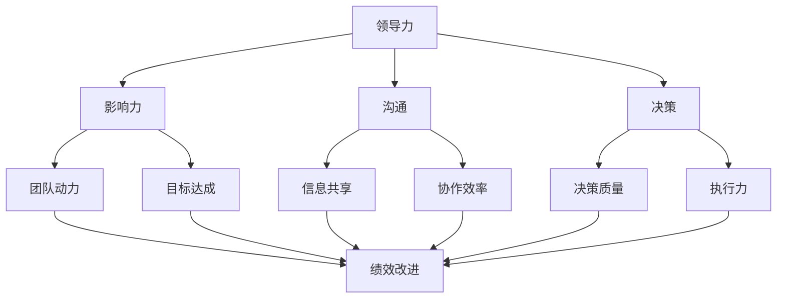
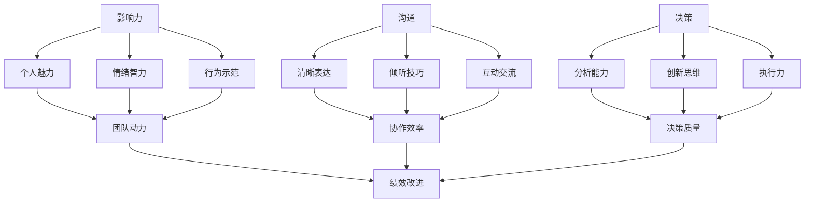

                 


## 理解书名：《领导力与绩效改进：持续提升团队表现》

### 背景介绍

在当今快速变化和竞争激烈的商业环境中，领导力和团队绩效改进成为了企业成功的关键因素。本书《领导力与绩效改进：持续提升团队表现》旨在探讨如何通过有效的领导力提升和绩效改进策略，实现团队持续的表现提升。本书的核心观点是，领导力和绩效改进并非孤立的概念，它们之间存在紧密的联系，通过相互融合可以创造出更加高效和有成果的团队。

### 核心概念

1. **领导力**：领导力是指引导和激励团队朝着共同目标前进的能力。它涵盖了影响力、沟通、决策等多个方面，是团队成功的重要保障。

2. **绩效改进**：绩效改进是指通过系统的方法和策略，提升团队和个人在工作中的表现，实现目标的过程。

3. **持续提升**：持续提升强调的是长期的、可持续的发展策略，而不是短期的业绩增长。这种策略关注的是团队的整体成长和长期成功。

### 关系架构

领导力和绩效改进之间的关系可以用以下Mermaid流程图来表示：



在这个流程图中，领导力的各个核心要素（影响力、沟通、决策）都与绩效改进密切相关，它们共同作用于团队的表现提升。领导力通过提升团队的动力、共享信息、增强协作效率和优化决策质量，进而推动绩效改进，实现团队持续提升的目标。

### 核心算法原理

为了更深入地理解领导力与绩效改进的关系，我们可以使用以下伪代码来详细阐述它们之间的相互作用：

```python
class Leadership:
    def __init__(self, influence, communication, decision):
        self.influence = influence
        self.communication = communication
        self.decision = decision
    
    def improve_performance(self, team):
        motivation = self.influence.team_dynamics()
        collaboration = self.communication.info_sharing()
        decision_quality = self.decision.optimized_decisions()
        
        performance_improvement = motivation * collaboration * decision_quality
        team.performance = performance_improvement

class PerformanceImprovement:
    def __init__(self, team):
        self.team = team
    
    def execute_strategies(self, strategies):
        for strategy in strategies:
            if strategy == "team_building":
                self.team.collaboration += 10
            elif strategy == "talent_incentives":
                self.team.performance += 15
            elif strategy == "process_optimization":
                self.team.process_efficiency += 20
    
    def measure_performance(self):
        return self.team.performance
```

在这个伪代码中，`Leadership` 类负责提升团队的动力、信息共享和决策质量，而 `PerformanceImprovement` 类则负责执行具体的绩效改进策略。通过这些交互作用，领导力可以显著提升团队的绩效。

### 数学模型

为了量化领导力与绩效改进之间的关系，我们可以使用以下数学模型：

$$
P = f(I, C, D)
$$

其中，\(P\) 表示团队绩效，\(I\) 表示领导力中的影响力，\(C\) 表示沟通能力，\(D\) 表示决策质量。函数 \(f\) 描述了这三个因素对团队绩效的影响。

举例来说，假设一个团队在领导力方面具有很高的影响力（\(I = 0.9\)）、良好的沟通能力（\(C = 0.8\)）和优秀的决策质量（\(D = 0.85\)），则其绩效可以计算为：

$$
P = f(0.9, 0.8, 0.85) = 0.9 \times 0.8 \times 0.85 = 0.612
$$

这意味着该团队的绩效得分为 0.612，分数越高表示绩效越好。

### 综述

通过以上分析，我们可以看到，《领导力与绩效改进：持续提升团队表现》这本书的主题思想是通过深入理解和应用领导力与绩效改进的核心概念和策略，实现团队的长远发展和绩效的持续提升。接下来，我们将进一步探讨领导力的核心要素和绩效改进的方法，并通过实际案例来展示这些理论在实际应用中的效果。。


----------------------------------------------------------------

# 领导力的核心要素

在探讨领导力的核心要素时，我们需要从影响力、沟通和决策三个方面入手。这些要素不仅决定了领导者的行为和风格，而且直接影响团队的表现和绩效。以下是对这些核心要素的深入分析。

## 1. 影响力

影响力是领导者引导和激励团队成员的关键能力。它不仅仅是职位赋予的权威，更重要的是领导者通过行为、价值观和沟通技巧来影响团队成员的心态和行为。以下是影响力在领导力中的几个关键方面：

### 1.1. 个人魅力

个人魅力是影响力的重要组成部分。领导者通过自身的人格特质、行为举止和情绪控制，建立起团队成员的信任和尊重。一个有魅力的领导者能够激发团队成员的激情和动力，使其愿意为实现共同目标而努力。

### 1.2. 情绪智力

情绪智力是领导者处理自己和他人情绪的能力。高情绪智力的领导者能够更好地理解和应对团队成员的情绪波动，从而减少冲突，增强团队的凝聚力。

### 1.3. 行为示范

领导者通过自身的言行举止为团队成员树立榜样。积极的行为示范不仅能够提升团队成员的士气，还能够促进团队文化的建设，使团队成员更加愿意追随领导者的方向。

## 2. 沟通

沟通是领导力的另一个核心要素。有效的沟通能够确保信息的准确传递，促进团队成员之间的协作，提高决策的质量。以下是沟通在领导力中的几个关键方面：

### 2.1. 清晰表达

清晰表达是有效沟通的基础。领导者需要确保传达的信息简洁明了，避免产生歧义。通过使用简洁、直接和具体的语言，领导者能够提高沟通的效率。

### 2.2. 倾听技巧

倾听是沟通的重要组成部分。领导者不仅需要听到团队成员所说的话，还需要理解其背后的意图和情感。通过积极的倾听，领导者能够更好地了解团队成员的需求和问题，从而提供更有针对性的支持和指导。

### 2.3. 互动交流

互动交流是沟通的高级阶段，它强调双向沟通和反馈。领导者需要鼓励团队成员发表意见，并对其进行积极的回应。这种互动能够增强团队成员的参与感和责任感，从而提高团队的协作效果。

## 3. 决策

决策是领导者职责的核心之一。有效的决策能力不仅能够帮助团队迅速应对挑战，还能够为团队的发展提供明确的方向。以下是决策在领导力中的几个关键方面：

### 3.1. 分析能力

分析能力是领导者制定决策的重要基础。领导者需要能够从复杂的信息中提取关键因素，进行深入的分析和评估，从而做出明智的决策。

### 3.2. 创新思维

创新思维是领导者应对变化和挑战的关键能力。一个有创新思维的领导者能够找到新的解决方案，突破传统思维的限制，推动团队实现突破性发展。

### 3.3. 执行力

执行力是决策的最终体现。领导者需要确保决策得到有效执行，包括分配任务、监督进度和解决执行中的问题。只有决策得到有效执行，才能实现预期的效果。

### 关系架构

为了更直观地展示领导力的核心要素之间的关系，我们可以使用Mermaid流程图来表示：



在这个流程图中，领导力的核心要素通过相互关联和影响，共同作用于团队的表现和绩效。影响力的各个子要素（个人魅力、情绪智力、行为示范）与团队动力紧密相关，而沟通的各个子要素（清晰表达、倾听技巧、互动交流）与协作效率密切相关。决策的各个子要素（分析能力、创新思维、执行力）则直接影响到决策质量和绩效改进。

通过深入理解领导力的核心要素及其相互关系，领导者可以更有效地提升团队的表现和绩效。在下一节中，我们将进一步探讨如何通过这些核心要素来实现绩效改进的方法和策略。

