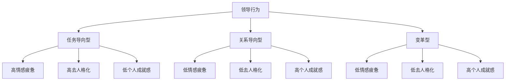
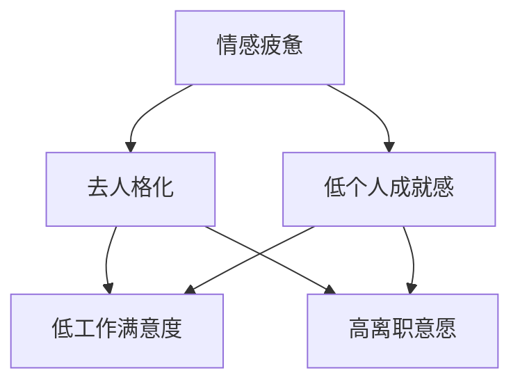
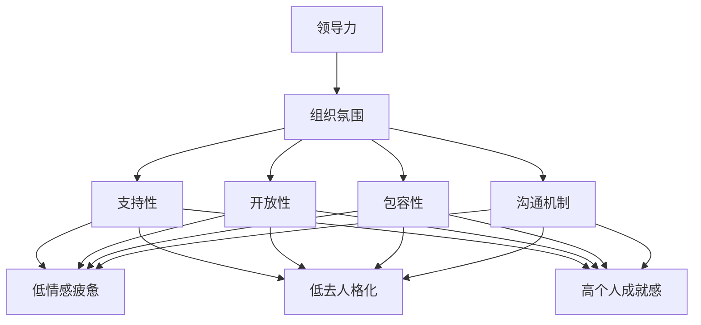

                 

### 第1章 引言

#### 1.1 研究背景与意义

在当今快速发展的信息技术时代，企业和组织对于领导力的需求日益增长。领导力不仅仅关乎个人能力的提升，更是组织发展和创新的关键驱动因素。然而，随着工作压力和环境复杂性的增加，职业倦怠（occupational burnout）成为一个日益严重的问题。职业倦怠是指个体在长时间的工作压力下，出现情感疲惫、工作满意度降低和成就感缺失的现象。根据国际劳工组织（International Labour Organization, ILO）的数据，全球范围内约有70%的员工经历过职业倦怠，这不仅影响了个人身心健康，还严重影响了组织的生产力、创新能力和员工留存率。

本文旨在探讨领导力与职业倦怠之间的关系，以及如何通过有效的领导策略来预防和应对职业倦怠。领导力作为一种复杂的社会心理现象，不仅涉及到个人能力的培养，还涉及到组织文化的塑造和员工工作环境的优化。有效的领导力能够激发员工的潜力，提高团队协作效率，从而降低职业倦怠的风险。因此，研究领导力与职业倦怠的关系具有重要的理论和实践意义。

首先，本文将综述领导力理论，探讨不同类型的领导力模型及其对职业倦怠的影响。接着，我们将深入分析职业倦怠的概念、特征及其测量方法，为后续的研究提供理论基础。在此基础上，本文将构建一个包含领导力、职业倦怠和组织氛围的交互机制模型，使用Mermaid流程图进行详细阐述。

最后，本文将提出一系列预防和应对职业倦怠的领导策略，并结合实际案例进行分析。通过这些策略的实施，希望能够为组织管理者提供实用的指导，提高员工的工作满意度和生产力。同时，本文也将指出当前研究的限制和未来研究方向，为后续研究提供参考。

#### 1.2 研究问题与目标

本研究将围绕以下问题展开：

1. 领导力与职业倦怠之间有何关联？
2. 不同的领导力模型对职业倦怠的影响有何差异？
3. 如何通过领导策略来预防和应对职业倦怠？

研究目标主要包括：

1. 梳理和总结现有的领导力理论，探讨其对职业倦怠的影响。
2. 描述职业倦怠的概念、特征及其测量方法。
3. 构建并验证领导力、职业倦怠与组织氛围之间的交互机制模型。
4. 提出并评估有效的领导策略，以预防和应对职业倦怠。
5. 为组织管理者提供具体的实践指南，以提高员工的工作满意度和生产力。

#### 1.3 研究方法与框架

为了实现上述研究目标，本研究将采用以下研究方法和框架：

1. **文献综述**：通过系统回顾和综合分析相关文献，梳理和总结现有关于领导力、职业倦怠及其关系的理论成果。
2. **理论框架构建**：在文献综述的基础上，构建一个包含领导力、职业倦怠和组织氛围的理论模型，使用Mermaid流程图进行可视化表示。
3. **实证研究**：设计问卷调查，收集组织内部员工的职业倦怠情况和领导行为数据，使用统计方法分析领导力与职业倦怠之间的关系。
4. **案例研究**：选取具有代表性的组织案例，分析其实施领导策略的有效性，验证理论模型的适用性和可行性。
5. **策略评估**：提出并实施一系列领导策略，评估其对预防和应对职业倦怠的效果。

通过这些方法，本研究将深入探讨领导力与职业倦怠之间的关系，为组织管理和员工心理健康提供理论支持和实践指导。接下来，本文将详细介绍领导力的基本理论，为后续分析奠定基础。

---

**Note:** This chapter provides the introduction to the research topic, discusses the background and significance of the study, outlines the research questions and objectives, and describes the research methodology and framework. The next chapter will delve into the foundational concepts of leadership. 

**Keywords:** Leadership, Occupational Burnout, Prevention, Management, Interdisciplinary Models

**Abstract:** This paper explores the relationship between leadership and occupational burnout, focusing on the prevention and management strategies. Through a systematic literature review and empirical research, the study aims to uncover the mechanisms underlying the interaction between leadership, burnout, and organizational climate. The findings provide valuable insights for organizational leaders to enhance employee well-being and productivity. 

---

### 第2章 领导力基础

#### 2.1 领导力理论综述

领导力是组织成功的关键因素之一，它不仅关乎个人的成长，更涉及到团队和组织的整体效能。领导力理论的发展经历了多个阶段，从早期的特质理论到行为理论，再到现代的情境理论和变革理论，每种理论都为理解领导力提供了独特的视角。

**特质理论**（Trait Theory）是最早的领导力理论之一，主张领导者具备一系列固定的特质和能力，如智商、自信、正直和决断力等。特质理论的核心观点是领导者是天生的，而不是后天培养的。然而，研究表明，特质并不是领导力的唯一决定因素，领导行为和情境因素同样重要。

**行为理论**（Behavioral Theory）则认为领导力是通过特定的行为和风格来实现的。行为理论强调领导者可以通过改变行为来提高团队效能。这类理论通过行为分析，识别出不同的领导行为模式，如任务导向型和关系导向型。然而，行为理论也存在一定的局限性，因为它没有考虑到领导行为的情境依赖性。

**情境理论**（Contingency Theory）提出了领导力是情境依赖的，不同的情境可能需要不同的领导风格。最具代表性的情境理论包括菲德勒模型（Fiedler Model）和路径-目标理论（Path-Goal Theory）。菲德勒模型认为领导效能取决于领导风格与情境因素（如控制、任务结构、领导者与下属的关系）的匹配程度。路径-目标理论则认为领导者的任务是帮助下属明确目标，并提供实现目标的清晰路径。

**变革理论**（Transformational Theory）强调领导力不仅仅是管理日常事务，更在于激发和引领团队实现变革。变革型领导通过激励、愿景和模范行为来影响下属，从而实现团队的高绩效。变革型领导与交易型领导（Transaction Theory）形成对比，交易型领导更多关注任务完成和利益交换。变革型领导能够激发下属的内在动机，提高工作满意度和组织承诺。

**变革型领导与职业倦怠的关系**：近年来，大量研究表明，变革型领导对降低职业倦怠具有积极影响。变革型领导通过鼓励创新、提供支持和建立信任，能够减轻员工的工作压力，提高工作满意度和组织承诺。此外，变革型领导还能激发员工的内在动机，使其在面对挑战时保持积极的心态。

**领导力模型对职业倦怠的影响**：不同类型的领导力模型对职业倦怠的影响也有所不同。例如，任务导向型领导可能会提高工作效率，但同时也可能增加工作压力，导致职业倦怠。相反，关系导向型领导和变革型领导更注重员工的情感需求和自我实现，有助于降低职业倦怠的风险。

**领导力模型的选择与优化**：组织管理者应根据组织的具体情境和员工特点，选择和优化领导力模型。例如，在任务复杂度高、时间紧迫的情况下，任务导向型领导可能更为有效。而在需要创新和变革的环境中，变革型领导则能更好地激发团队的潜能。

**结论**：领导力理论的发展为理解领导行为及其对组织绩效的影响提供了丰富的视角。不同类型的领导力模型对职业倦怠的影响各异，组织管理者应根据具体情境选择和优化领导策略。通过结合不同领导力模型的优势，可以更好地预防和应对职业倦怠，提高员工的工作满意度和组织绩效。

#### 2.2 领导力与职业倦怠的关系

领导力与职业倦怠之间的关系是一个复杂且多维的话题。职业倦怠通常表现为情感疲惫、去人格化和个人成就感缺失，而领导力作为影响员工心理状态和组织氛围的关键因素，对其产生显著影响。以下从多个维度探讨领导力与职业倦怠的关系：

**1. 领导行为与职业倦怠**：领导行为是领导力的重要组成部分，直接影响员工的心理状态和工作表现。例如，任务导向型领导可能强调目标和效率，但在过度关注任务完成的同时，可能会忽视员工的情感需求，导致员工感到压力过大，从而增加职业倦怠的风险。相反，关系导向型领导注重员工的心理需求和人际关系，通过建立信任和支持，有助于缓解工作压力，降低职业倦怠的发生。

**2. 变革型领导与职业倦怠**：变革型领导通过激发下属的内在动机，提供有意义的工作和明确的目标，对职业倦怠具有显著的预防作用。变革型领导能够建立强大的团队凝聚力，促进员工间的相互支持，从而在压力环境中提供情感支持，减轻职业倦怠的风险。

**3. 组织氛围与职业倦怠**：领导力不仅影响员工个体的心理状态，还通过塑造组织氛围影响整个团队和组织的健康。领导力强、组织氛围积极的企业往往能够更好地应对外部压力，提供支持和资源，从而减少职业倦怠的发生。

**4. 情境因素与职业倦怠**：职业倦怠的产生不仅取决于领导力本身，还受到情境因素的影响。例如，在资源匮乏、工作负荷过重、缺乏职业发展机会的情况下，即使领导力再好，也难以完全避免职业倦怠的发生。

**领导力与职业倦怠的交互机制**：领导力通过多种途径影响职业倦怠。首先，领导行为直接影响员工的情感状态和工作满意度。其次，领导力通过塑造组织氛围，影响员工之间的互动和协作，从而间接影响职业倦怠。最后，领导力还与情境因素相互作用，共同影响职业倦怠的发生。

**实证研究**：大量实证研究支持了领导力与职业倦怠之间的关系。例如，研究发现，变革型领导与职业倦怠之间存在显著的负相关关系，而交易型领导与职业倦怠之间的关系则较为复杂，可能受到情境因素的影响。

**结论**：领导力在预防和应对职业倦怠中起着至关重要的作用。有效的领导力不仅能够降低职业倦怠的风险，还能提升员工的工作满意度和组织绩效。组织管理者应关注领导力的发展，结合不同情境和员工需求，采取有针对性的领导策略，以实现组织的可持续发展。

#### 2.3 领导力对组织氛围的影响

领导力不仅直接影响员工的心理状态和工作表现，还通过塑造组织氛围对整个组织产生深远影响。组织氛围是指组织内部成员共享的价值观、信念、态度和行为模式，它对员工的行为、工作满意度和组织承诺具有重要影响。

**1. 领导风格与组织氛围**：不同的领导风格对组织氛围的形成有着不同的影响。任务导向型领导强调目标和绩效，可能导致组织氛围紧张和竞争激烈。关系导向型领导则注重员工的情感需求和人际关系，有助于营造一个开放、支持和合作的组织氛围。变革型领导通过激励和愿景，激发员工的内在动机，促进创新和团队凝聚力，从而塑造积极向上的组织氛围。

**2. 领导行为与组织文化**：领导者的行为是组织文化的关键塑造者。领导者在日常工作中展示的行为和价值观，如诚信、透明度和责任感，会逐渐渗透到组织文化中，影响员工的行为和态度。例如，一个以诚信为核心价值观的领导者，会促使员工在工作中保持诚信，从而营造一个正直和透明的组织文化。

**3. 领导力与员工行为**：领导力通过影响员工的行为，进一步影响组织氛围。有效的领导力能够激励员工积极参与工作，提高工作效率和创造力。同时，领导力还通过建立良好的沟通机制，促进员工之间的互动和协作，从而增强组织的凝聚力和合作精神。

**4. 领导力与员工满意度**：领导力对员工满意度有着重要的影响。领导者的支持、关注和理解，能够提高员工的工作满意度，减少职业倦怠的发生。一个支持性的领导环境，有助于员工在工作中感受到被尊重和认可，从而提高其工作满意度和组织承诺。

**5. 领导力与组织绩效**：领导力通过改善组织氛围，提高员工的工作满意度和工作效率，从而对组织绩效产生积极影响。有效的领导力能够激发员工的潜力，促进团队协作和知识共享，推动组织的创新和发展。

**领导力对组织氛围的综合影响**：领导力通过多种途径对组织氛围产生影响。首先，领导风格和行为塑造了组织文化，影响员工的价值观和行为模式。其次，领导力通过激励和指导，促进员工的行为，改善组织氛围。最后，领导力还通过建立积极的组织文化，提高员工的工作满意度和组织承诺，从而提升整体绩效。

**结论**：领导力在塑造组织氛围中起着关键作用。通过采用有效的领导风格和行为，领导者可以营造一个积极、支持、合作的组织环境，从而提高员工的工作满意度和组织绩效。组织管理者应重视领导力的发展，关注领导行为对组织氛围的影响，以实现组织的可持续发展。

---

**Note:** This chapter provides a comprehensive overview of leadership theories, discusses the relationship between leadership and occupational burnout, and explores the impact of leadership on organizational climate. The next chapter will delve into the concept of occupational burnout, its characteristics, and measurement methods.

**Keywords:** Leadership Theories, Occupational Burnout, Leadership Styles, Organizational Climate, Burnout Prevention and Management

**Abstract:** This chapter explores the foundational concepts of leadership, examining various leadership theories, the relationship between leadership and occupational burnout, and the impact of leadership on organizational climate. By understanding the complexities of leadership, organizations can develop effective strategies to prevent and manage burnout, enhancing employee well-being and organizational performance.

---

### 第3章 职业倦怠概念与测量

#### 3.1 职业倦怠的定义与特征

职业倦怠（Occupational Burnout）是一种与工作相关的心理现象，最早由临床心理学家Herbert J. Freudenberger于1974年提出。职业倦怠是指个体在长时间的工作压力下，出现情感疲惫、去人格化和个人成就感缺失的现象。根据国际劳动组织（ILO）的定义，职业倦怠主要表现为以下三个核心维度：

1. **情感疲惫（Emotional Exhaustion）**：情感疲惫是指个体在长时间的工作压力下，出现情感枯竭、能量耗尽的现象。表现为持续的疲惫感、缺乏活力和动力，甚至对工作和生活中的其他事情也失去兴趣。

2. **去人格化（Depersonalization）**：去人格化是指个体在长期工作压力下，对工作对象采取冷漠、疏离的态度。个体可能会表现出对工作对象的不耐烦、敌对或贬低行为，从而避免情感上的投入。

3. **个人成就感缺失（Reduced Personal Accomplishment）**：个人成就感缺失是指个体在长时间的工作压力下，对自己的工作成就和贡献感到失望和缺乏满足感。表现为对自己的工作能力产生怀疑，甚至认为自己无法胜任工作。

职业倦怠的特征主要体现在以下几个方面：

- **个体表现**：职业倦怠的个体表现主要表现为情感疲惫、工作满意度降低和自我效能感下降。个体可能会出现频繁请假、工作出错、工作拖延等现象。

- **工作表现**：职业倦怠会显著影响工作表现，包括工作效率降低、创造力下降和任务完成质量下降。长期职业倦怠可能导致工作失误，增加工作事故的风险。

- **心理健康**：职业倦怠对个体的心理健康有显著影响，可能导致抑郁、焦虑、失眠等心理问题。长期的心理压力还可能导致生理健康问题，如高血压、心脏病等。

- **组织绩效**：职业倦怠不仅影响个体的心理健康和工作表现，还对组织的整体绩效产生负面影响。职业倦怠可能导致员工流失、团队凝聚力下降和整体生产效率降低。

#### 3.2 职业倦怠的测量方法

为了科学、系统地评估职业倦怠的程度，研究者们开发了一系列测量工具和方法。以下介绍几种常用的职业倦怠测量方法：

1. **Maslach职业倦怠量表（Maslach Burnout Inventory, MBI）**：MBI是使用最广泛的职业倦怠测量工具之一，由Maslach和Jackson于1981年开发。MBI包括三个维度：情感疲惫、去人格化和个人成就感缺失。每个维度包含若干个条目，采用Likert五点量表进行评分。MBI具有较高的信效度，广泛应用于学术研究和实际工作中。

2. **Sheehan抑郁量表（Sheehan Depression Scale, SDS）**：SDS是一种评估抑郁症状的量表，虽然主要用于抑郁症状的评估，但也可用于职业倦怠相关抑郁症状的测量。SDS包括多个条目，涉及情绪低落、兴趣丧失、睡眠障碍等方面，采用四点量表进行评分。SDS具有较高的敏感性和特异性，适用于快速筛查和初步评估。

3. **短格式职业倦怠量表（Short Form 36, SF-36）**：SF-36是一种广泛使用的健康调查问卷，虽然主要用于健康相关质量的评估，但也包含与职业倦怠相关的维度。SF-36包括36个条目，分为8个维度：情感健康、身体健康、社会功能等。每个维度采用五点量表进行评分，总分越高表示健康状况越好。

4. **Utrecht职业倦怠量表（Utrecht Work Engagement Scale, UWES）**：UWES是一种测量职业倦怠和职业投入的量表，由Bakker和Demerouti于2007年开发。UWES包括三个维度：工作投入（Work Engagement）、情感疲惫和去人格化。每个维度包含若干个条目，采用Likert五点量表进行评分。UWES具有较高的信效度，适用于职业倦怠的全面评估。

5. **问卷调查法**：除了标准化的测量工具，研究者还可以通过问卷调查法收集职业倦怠的相关数据。问卷调查法灵活性强，可以根据研究目的和对象设计具体的问卷。问卷调查法通常包括主观感受、工作环境、工作任务等多个方面，通过定量和定性相结合的方式，全面了解职业倦怠的现状和影响因素。

#### 3.3 职业倦怠的影响因素

职业倦怠的产生是一个复杂的过程，受到多种因素的影响。以下从个体因素、工作环境和组织因素三个方面分析职业倦怠的影响因素：

1. **个体因素**：
   - **性格特质**：研究表明，性格特质如神经质（Neuroticism）和开放性（Openness）对职业倦怠有显著影响。神经质个体更易出现情绪波动和压力感，而开放性个体则更能够适应变化和挑战。
   - **自我效能感**：自我效能感是指个体对自己完成特定任务的信心。低自我效能感的个体在面对工作挑战时更容易感到无助和无力，从而增加职业倦怠的风险。
   - **心理弹性**：心理弹性（Resilience）是指个体在面对压力和逆境时的适应和恢复能力。心理弹性较高的个体能够更好地应对工作压力，降低职业倦怠的风险。

2. **工作环境因素**：
   - **工作负荷**：高工作负荷是导致职业倦怠的常见原因。长时间的工作、大量的工作任务和无休止的工作压力，会导致员工感到情感疲惫和精力耗尽。
   - **工作与生活平衡**：工作与生活平衡（Work-Life Balance）对职业倦怠有显著影响。工作与生活平衡良好的个体能够更好地管理时间和资源，减少工作压力，从而降低职业倦怠的风险。
   - **工作控制感**：工作控制感（Perceived Control at Work）是指个体对自身工作决策的参与度和控制力。工作控制感较低的个体可能感到无助和被动，从而增加职业倦怠的风险。

3. **组织因素**：
   - **组织文化**：组织文化对员工的职业倦怠有重要影响。一个支持性、开放和包容的组织文化有助于减轻员工的工作压力，提高工作满意度和组织承诺。
   - **领导风格**：领导风格对员工的职业倦怠有显著影响。变革型领导和关系导向型领导能够激发员工的内在动机，提高工作满意度和组织承诺，从而降低职业倦怠的风险。
   - **薪酬福利**：薪酬福利是影响员工职业倦怠的重要因素。合理的薪酬结构和公平的福利待遇，有助于提高员工的工作满意度和忠诚度，降低职业倦怠的风险。

#### 结论

职业倦怠是一个复杂的现象，受到个体因素、工作环境和组织因素的共同影响。通过科学、系统地测量职业倦怠，并深入分析其影响因素，组织管理者可以采取有效的干预措施，预防和应对职业倦怠，提高员工的工作满意度和组织绩效。

---

**Note:** This chapter provides a detailed understanding of the concept and characteristics of occupational burnout, discusses various measurement methods, and explores the influencing factors of burnout. The next chapter will delve into the interactive mechanism between leadership and occupational burnout, using a Mermaid flowchart to illustrate the relationship.

**Keywords:** Occupational Burnout, Measurement Methods, Influencing Factors, Leadership-Burnout Relationship, Interactive Mechanism

**Abstract:** This chapter explores the definition and characteristics of occupational burnout, discusses the measurement methods, and analyzes the influencing factors. By understanding the interactive mechanism between leadership and burnout, organizations can develop effective strategies to prevent and manage burnout, enhancing employee well-being and organizational performance.

---

### 第4章 领导力与职业倦怠的交互机制

领导力与职业倦怠之间的关系并非单向的，而是相互作用、相互影响的复杂过程。为了更直观地理解这种关系，我们采用Mermaid流程图来描述领导力、职业倦怠与组织氛围之间的交互机制。

首先，我们定义几个关键变量：
- **领导力（Leadership）**：包括任务导向型、关系导向型和变革型领导等不同风格。
- **职业倦怠（Occupational Burnout）**：包括情感疲惫、去人格化和个人成就感缺失三个核心维度。
- **组织氛围（Organizational Climate）**：包括支持性、开放性、包容性和沟通机制等。

#### 4.1 领导行为与职业倦怠的关系

领导行为是领导力的重要组成部分，直接影响员工的情感状态和工作满意度。以下是领导行为与职业倦怠关系的Mermaid流程图：

**解释：**
- **任务导向型领导**：这种领导风格强调目标导向和任务完成，可能导致员工感受到较大的工作压力，从而增加情感疲惫和去人格化的风险，同时降低个人成就感。
- **关系导向型领导**：这种领导风格注重员工的情感需求和人际关系，有助于缓解工作压力，降低情感疲惫和去人格化的风险，同时提高个人成就感。
- **变革型领导**：这种领导风格通过激励和愿景激发员工的内在动机，有助于降低情感疲惫和去人格化，提高个人成就感。

#### 4.2 职业倦怠的心理机制

职业倦怠的心理机制涉及情感疲惫、去人格化和个人成就感缺失的内在联系。以下是职业倦怠心理机制的Mermaid流程图：

**解释：**
- **情感疲惫**：情感疲惫是职业倦怠的核心特征之一，表现为持续的疲劳感和精力耗尽。它会导致个体对工作对象采取去人格化的态度，即失去同情心和人际互动的兴趣。
- **去人格化**：去人格化表现为对工作对象冷漠、疏离的态度，这种态度会进一步影响个体的工作满意度，降低对工作的认同感和投入感，增加离职意愿。
- **个人成就感缺失**：个人成就感缺失是指个体在长时间的工作压力下，对自己的工作成就和贡献感到失望和缺乏满足感。这会导致个体对工作产生消极情绪，降低工作满意度和组织承诺。

#### 4.3 组织氛围的影响

组织氛围对领导力与职业倦怠的关系起着调节作用。以下是组织氛围影响的Mermaid流程图：

**解释：**
- **支持性组织氛围**：一个支持性的组织氛围能够为员工提供情感支持和资源，缓解工作压力，降低情感疲惫和去人格化的风险，同时提高个人成就感。
- **开放性组织氛围**：开放性组织氛围鼓励员工分享想法和意见，提高沟通效率，增强团队凝聚力，从而有助于缓解工作压力，提高工作满意度和个人成就感。
- **包容性组织氛围**：包容性组织氛围尊重员工的个性和差异，减少冲突和误解，提高员工的归属感和认同感，从而有助于降低情感疲惫和去人格化，提高个人成就感。
- **沟通机制**：有效的沟通机制能够确保信息流畅传递，提高决策透明度，增强员工对工作的理解和认同，从而有助于缓解工作压力，提高工作满意度和个人成就感。

#### 结论

通过上述Mermaid流程图，我们可以清晰地看到领导力、职业倦怠和组织氛围之间的复杂关系。领导力通过其不同的风格影响职业倦怠，而组织氛围在调节这种关系方面起着关键作用。了解这些交互机制有助于组织管理者采取更有效的领导策略和组织干预措施，以预防和应对职业倦怠，提高员工的工作满意度和组织绩效。

---

**Note:** This chapter provides a detailed analysis of the interactive mechanism between leadership and occupational burnout using a Mermaid flowchart. The next chapter will discuss strategies for preventing occupational burnout and explore successful practices in real organizations.

**Keywords:** Leadership-Burnout Interaction, Psychological Mechanisms, Organizational Climate, Prevention Strategies, Best Practices

**Abstract:** This chapter delves into the intricate relationship between leadership and occupational burnout, elucidating the interactive mechanism using a Mermaid flowchart. By understanding the psychological mechanisms and the impact of organizational climate, leaders can implement effective strategies to prevent burnout, enhance employee well-being, and improve organizational performance.

---

### 第5章 预防职业倦怠的领导策略

#### 5.1 领导风格对职业倦怠的预防作用

领导风格在预防职业倦怠中起着至关重要的作用。不同的领导风格对员工的工作满意度和心理健康产生不同的影响。以下从任务导向型、关系导向型和变革型领导风格分别探讨其对职业倦怠的预防作用。

**1. 任务导向型领导风格**

任务导向型领导强调目标的实现和工作效率，其核心在于明确任务要求，制定严格的工作计划，并确保员工遵循这些规定。这种领导风格在某些情境下具有显著优势，例如在高强度、时间紧迫的项目管理中，任务导向型领导能够有效提高工作效率和团队执行力。

然而，如果任务导向型领导过于强调任务完成，忽视员工的情感需求和心理健康，可能导致员工感到过度压力和焦虑，从而增加职业倦怠的风险。因此，为了预防职业倦怠，任务导向型领导需要平衡任务目标和员工福祉，关注员工的情感需求，通过沟通和支持帮助员工应对工作压力。

**2. 关系导向型领导风格**

关系导向型领导注重员工的情感需求和个人成长，通过建立信任、提供支持和促进团队合作来提高员工的工作满意度和心理健康。这种领导风格强调人际关系和团队凝聚力，能够有效缓解工作压力，降低职业倦怠的发生。

关系导向型领导通过以下方式预防职业倦怠：
- **建立信任**：信任是关系导向型领导的核心，通过建立信任关系，领导能够与员工建立良好的沟通和互动，减少误解和冲突。
- **提供支持**：领导应关注员工的情感需求，提供必要的支持和资源，帮助员工应对工作挑战和压力。
- **促进团队合作**：通过促进团队合作，关系导向型领导能够增强员工的归属感和认同感，提高工作满意度和团队凝聚力。

**3. 变革型领导风格**

变革型领导通过激发员工的内在动机，提供有意义的工作和明确的目标，推动团队实现变革。变革型领导强调领导者的角色不仅仅是管理者，更是变革的推动者和激励者。

变革型领导预防职业倦怠的机制包括：
- **建立愿景**：通过明确组织愿景和目标，变革型领导能够激发员工的内在动机，使其在实现组织目标的过程中找到意义和成就感。
- **激励和激励**：变革型领导通过激励和激励员工，提高其工作热情和积极性，降低职业倦怠的风险。
- **培养创新精神**：变革型领导鼓励员工提出新的想法和建议，促进创新和团队发展，从而提高员工的成就感和自我实现。

#### 5.2 培养积极领导文化的策略

培养积极领导文化是预防职业倦怠的重要手段。一个积极的领导文化能够为员工提供心理支持，增强其工作满意度和组织承诺。以下提出几项培养积极领导文化的策略：

**1. 明确价值观和使命**

组织领导者应明确组织的核心价值观和使命，并将其融入到日常工作中。通过树立共同的目标和愿景，领导者能够激发员工的内在动机，使其在实现组织目标的过程中找到意义和成就感。

**2. 建立信任和开放沟通**

建立信任和开放沟通是培养积极领导文化的基础。领导者应鼓励员工提出意见和建议，建立透明和开放的沟通渠道，确保员工能够充分表达自己的观点和需求。

**3. 强调工作与生活平衡**

工作与生活平衡对于预防职业倦怠至关重要。领导者应关注员工的个人生活，鼓励员工合理安排工作时间和休息时间，确保员工能够在工作和生活中找到平衡。

**4. 提供培训和职业发展机会**

提供培训和职业发展机会是激励员工的重要手段。通过培训和发展计划，领导者能够提高员工的技能和知识水平，帮助其实现职业目标和成长。

**5. 强调团队合作和协作**

团队合作和协作能够增强员工的归属感和认同感，提高工作满意度和团队凝聚力。领导者应鼓励员工参与团队合作项目，促进知识共享和资源互补。

**6. 关注员工心理健康**

领导者应关注员工的心理健康，提供必要的心理支持和资源。通过建立员工心理健康计划，领导者能够帮助员工应对工作压力和情绪问题，提高其心理韧性和工作积极性。

#### 5.3 案例分析：成功的职业倦怠预防实践

以下通过几个成功案例，分析组织如何通过实施有效的领导策略和培养积极领导文化来预防职业倦怠。

**案例1：谷歌的员工关怀计划**

谷歌以其独特的企业文化而闻名，特别是在员工关怀方面。谷歌提供了一系列福利和弹性工作安排，如家庭日、年度休假、心理咨询服务等，以帮助员工缓解工作压力。此外，谷歌鼓励员工积极参与社区活动和志愿服务，通过这些活动提高员工的幸福感和成就感。

**案例分析：**
- **领导策略**：谷歌的领导层通过一系列福利和弹性工作安排，展现出对员工关怀和支持的重视，有助于减轻员工的工作压力，提高工作满意度。
- **文化培养**：谷歌强调团队合作和开放沟通，鼓励员工分享想法和建议，建立一个支持性的工作环境。

**案例2：宜家的员工参与计划**

宜家通过员工参与计划来培养积极的工作氛围，包括员工代表会议、员工提案计划等。这些措施使员工感到被尊重和认可，从而提高其工作满意度和组织承诺。

**案例分析：**
- **领导策略**：宜家的领导层通过员工参与计划，鼓励员工参与决策过程，提高员工的参与感和责任感，从而降低职业倦怠的风险。
- **文化培养**：宜家强调开放性和透明性，通过员工代表会议和员工提案计划，确保员工的声音得到关注和回应。

**案例3：微软的创新文化**

微软以其创新文化而著称，领导者通过激励和激励员工，推动团队实现创新和变革。微软鼓励员工提出新的想法和建议，并提供资源和平台支持员工的创新活动。

**案例分析：**
- **领导策略**：微软的领导层通过建立创新文化和激励机制，激发员工的内在动机，提高其工作热情和创造力，从而预防职业倦怠。
- **文化培养**：微软强调团队合作和知识共享，通过跨部门合作和知识交流，促进员工的成长和职业发展。

**结论**

通过上述案例分析，可以看出成功的职业倦怠预防实践需要结合有效的领导策略和积极领导文化的培养。领导者在预防职业倦怠中扮演着关键角色，通过关注员工的情感需求、提供心理支持、培养团队合作和创新文化，可以有效降低职业倦怠的风险，提高员工的工作满意度和组织绩效。

---

**Note:** This chapter discusses the impact of leadership styles on preventing burnout and provides strategies for cultivating a positive leadership culture. It also includes case analyses of successful burnout prevention practices. The next chapter will delve into the strategies for managing occupational burnout and provide practical guidance for leaders.

**Keywords:** Leadership Styles, Burnout Prevention, Positive Leadership Culture, Employee Well-being, Case Studies

**Abstract:** This chapter explores the relationship between leadership styles and burnout prevention, offering strategies for cultivating a positive leadership culture. Through case analyses of successful practices, the chapter provides practical insights and guidance for leaders aiming to enhance employee well-being and organizational performance.

---

### 第6章 应对职业倦怠的管理策略

#### 6.1 职业倦怠的应对策略概述

职业倦怠是一种常见的职场现象，其影响不仅限于个人层面，还会对组织的运营和绩效产生负面影响。因此，制定有效的职业倦怠应对策略至关重要。应对策略主要包括以下几个方面：

1. **心理干预**：通过心理咨询和治疗，帮助员工缓解情感疲惫和压力，恢复心理健康。
2. **工作调整**：调整工作内容和任务，减轻工作负荷，提供更灵活的工作安排。
3. **员工支持系统**：建立员工支持系统，包括员工心理健康服务、心理咨询热线、员工援助计划等。
4. **领导与管理的改进**：改善领导风格和管理方式，增强团队的凝聚力和支持性氛围。
5. **培训和提升**：通过培训和职业发展计划，提高员工的技能和知识水平，增强其应对工作挑战的能力。

#### 6.2 员工支持系统的建立与实施

员工支持系统是应对职业倦怠的重要手段，它为员工提供了一个安全、支持和专业的环境，以应对工作和生活中的压力。以下介绍员工支持系统的建立与实施策略：

**1. 心理健康服务**

心理健康服务包括心理咨询、心理治疗和心理健康教育等。组织可以聘请专业心理顾问，为员工提供一对一的心理咨询服务，帮助其解决情感困扰和心理问题。此外，通过心理健康讲座和工作坊，提高员工的自我调节和心理韧性。

**2. 心理咨询热线**

设立24小时心理咨询热线，为员工提供即时心理支持。心理咨询热线可以提供情感宣泄、压力缓解、心理疏导等专业服务，帮助员工及时应对工作和生活中的困境。

**3. 员工援助计划（EAP）**

员工援助计划是一种全方位的员工支持服务，旨在帮助员工解决个人和工作中的问题。EAP通常包括心理健康咨询、家庭服务、法律援助、财务咨询等，为员工提供全方位的支持。

**4. 团队心理辅导**

组织可以定期开展团队心理辅导活动，帮助团队成员共同应对工作压力。团队心理辅导可以采用小组讨论、角色扮演、心理训练等形式，增强团队成员的凝聚力和心理韧性。

**5. 健康体检**

定期组织员工进行健康体检，及时发现和预防身体疾病。通过健康体检，员工可以了解自己的身体状况，及时采取健康维护措施，从而降低身心健康问题对工作的影响。

**6. 职业发展支持**

提供职业发展支持，包括职业规划咨询、培训机会、职业晋升通道等，帮助员工实现职业目标和自我实现。通过职业发展支持，员工可以更好地应对工作挑战，提高工作满意度和职业成就感。

#### 6.3 案例分析：有效的职业倦怠应对措施

以下通过两个实际案例，分析组织如何通过有效的职业倦怠应对措施，提高员工的工作满意度和心理健康。

**案例1：微软的职业健康计划**

微软公司重视员工的身心健康，实施了一系列职业健康计划，包括心理健康服务、健康体检和职业发展支持等。以下为微软职业健康计划的具体措施：

- **心理健康服务**：微软提供免费的心理咨询服务，员工可以预约与专业心理顾问进行一对一的谈话。此外，微软还定期举办心理健康讲座，提高员工的自我调节和心理韧性。
- **健康体检**：微软为员工提供年度健康体检，涵盖全身检查、血压、血糖、血脂等多个方面。通过健康体检，员工可以及时发现健康问题，并采取相应的预防和治疗措施。
- **职业发展支持**：微软为员工提供丰富的培训机会和职业晋升通道，帮助员工实现职业目标和自我实现。此外，微软还鼓励员工参加外部培训和认证，提升其技能和知识水平。

**案例分析：**
- **措施效果**：微软的职业健康计划有效提高了员工的工作满意度和心理健康水平。员工在心理和身体健康方面得到全方位的支持，减轻了工作压力，提高了工作效率和创造力。
- **经验总结**：微软的成功经验表明，通过提供全面的心理健康服务、健康体检和职业发展支持，组织可以有效地预防和应对职业倦怠，提高员工的工作满意度和组织绩效。

**案例2：联想的员工援助计划**

联想集团设立了员工援助计划（EAP），为员工提供心理健康支持、家庭服务和法律援助等。以下为联想EAP的具体措施：

- **心理健康支持**：联想提供24小时心理咨询热线，员工可以随时拨打热线寻求心理支持。此外，联想还定期开展心理健康讲座和小组心理辅导，帮助员工应对工作和生活中的压力。
- **家庭服务**：联想为员工提供家庭咨询服务，包括婚姻辅导、亲子教育等，帮助员工解决家庭问题，提高家庭生活质量。
- **法律援助**：联想提供法律援助服务，员工在遇到法律问题时可以获得专业法律咨询和支持。

**案例分析：**
- **措施效果**：联想的员工援助计划为员工提供了全方位的支持，帮助其解决工作和生活中的问题。员工感受到组织的关怀和支持，提高了工作满意度和组织承诺。
- **经验总结**：联想的成功经验表明，通过建立全面的员工援助计划，组织可以有效地预防和应对职业倦怠，提高员工的工作满意度和心理健康水平。

**结论**

通过上述案例分析，可以看出有效的职业倦怠应对措施需要综合考虑心理健康支持、工作调整、员工支持系统和职业发展等多个方面。组织管理者应根据实际情况，制定和实施有针对性的应对策略，以提高员工的工作满意度和组织绩效。

---

**Note:** This chapter provides an overview of strategies for managing occupational burnout and discusses the establishment and implementation of employee support systems. It also includes case analyses of effective burnout management practices. The next chapter will offer a research overview and discuss the implications and future directions for leadership and burnout prevention.

**Keywords:** Burnout Management Strategies, Employee Support Systems, Psychological Interventions, Workplace Adjustments, Leadership Implications

**Abstract:** This chapter explores strategies for managing occupational burnout, focusing on the establishment of employee support systems and practical interventions. Through case analyses of successful practices, the chapter provides insights and guidance for leaders aiming to enhance employee well-being and organizational performance.

---

### 第7章 研究展望与未来方向

#### 7.1 研究限制与挑战

尽管本文对领导力与职业倦怠的关系进行了深入探讨，但仍存在一些研究限制和挑战。首先，本研究主要基于问卷调查和数据统计分析，虽然提供了丰富的定量数据支持，但未能深入挖掘个体差异和复杂性。其次，本文的实证研究主要集中在特定行业和组织，其结果可能在其他行业和组织中具有局限性。此外，领导力和职业倦怠之间的关系受到多种因素影响，如个体差异、工作环境和组织文化，这些因素在本研究中未能全面考虑。因此，未来的研究需要在更广泛、多元化的样本中进行，以验证本文结论的普适性。

#### 7.2 未来研究方向与趋势

未来研究在领导力与职业倦怠的关系领域仍有诸多方向和趋势值得关注：

1. **跨文化研究**：领导力和职业倦怠在不同文化背景下的表现和影响因素可能有所不同。未来研究可以探讨领导力与职业倦怠在不同文化背景下的交互机制，以提供更具普适性的理论框架和实践指导。

2. **动态研究**：领导力和职业倦怠的关系是一个动态的过程，不同阶段的领导行为和员工心理状态可能对职业倦怠产生不同的影响。未来研究可以采用纵向研究方法，观察领导行为和职业倦怠随时间的变化，以揭示其动态关系和影响机制。

3. **多变量分析**：尽管本文采用了多变量分析方法，但仍需进一步探讨领导力、职业倦怠与其他相关变量（如工作满意度、组织承诺、心理韧性等）的复杂关系。通过多变量分析，可以更全面地理解领导力对职业倦怠的综合影响。

4. **大数据分析**：随着大数据技术的发展，利用大数据分析方法研究领导力与职业倦怠之间的关系成为可能。未来研究可以利用大数据平台，收集和分析大量员工行为数据、工作环境数据和领导行为数据，以揭示更复杂的交互机制和影响因素。

5. **干预策略研究**：未来研究可以进一步探讨不同干预策略对预防和应对职业倦怠的有效性，如领导力培训、员工援助计划、心理健康服务等。通过实验研究和实际应用，可以验证这些策略的可行性和效果，为组织提供切实可行的管理建议。

#### 7.3 对领导者和组织的启示与建议

基于本文的研究结论和未来研究方向，以下提出对领导者和组织的启示与建议：

1. **关注员工心理健康**：领导者应重视员工心理健康，通过提供心理支持和资源，帮助员工应对工作压力和情感困扰。建立员工心理健康服务体系，定期开展心理健康教育和心理辅导，提高员工的情感调节和心理韧性。

2. **优化领导风格**：领导者应根据组织情境和员工需求，选择和优化领导风格。在任务导向型环境中，应平衡任务完成与员工福祉，关注员工的情感需求；在关系导向型环境中，应加强沟通和支持，促进团队合作；在变革型环境中，应激发员工的内在动机，推动组织创新。

3. **建立积极组织文化**：组织应培养积极向上的组织文化，强调团队合作、开放沟通和支持性氛围。通过明确核心价值观和使命，提高员工的归属感和认同感，增强组织的凝聚力和创造力。

4. **实施有效的干预策略**：组织应实施有效的干预策略，如领导力培训、员工援助计划、心理健康服务等，以预防和应对职业倦怠。通过持续改进和优化干预策略，提高员工的工作满意度和组织绩效。

5. **关注跨文化和动态因素**：领导者应关注跨文化和动态因素对领导力与职业倦怠关系的影响，通过多元化研究和实际应用，探索更具普适性的理论和实践指导。

通过上述启示与建议，领导者和组织可以更好地应对职业倦怠问题，提高员工的工作满意度和组织绩效，实现可持续发展。

---

**Note:** This chapter provides an overview of the research limitations and challenges, discusses future research directions and trends, and offers insights and recommendations for leaders and organizations. It concludes the paper by summarizing the key findings and suggesting practical applications for improving employee well-being and organizational performance.

**Keywords:** Research Limitations, Future Directions, Leadership and Burnout, Organizational Implications

**Abstract:** This final chapter summarizes the research findings on the relationship between leadership and occupational burnout, discusses future research directions, and provides practical insights for leaders and organizations. By addressing research limitations and highlighting the importance of employee well-being, this chapter aims to contribute to the development of effective leadership strategies for preventing and managing burnout.

---

### 附录

#### A.1 相关术语表

- **职业倦怠**（Occupational Burnout）：指个体在长时间的工作压力下，出现情感疲惫、去人格化和个人成就感缺失的现象。
- **领导力**（Leadership）：指领导者通过激励、指导和影响他人，以实现组织目标的能力。
- **情感疲惫**（Emotional Exhaustion）：职业倦怠的一个核心维度，表现为持续的疲劳感和能量耗尽。
- **去人格化**（Depersonalization）：职业倦怠的一个核心维度，表现为对工作对象采取冷漠、疏离的态度。
- **个人成就感缺失**（Reduced Personal Accomplishment）：职业倦怠的一个核心维度，表现为对自己的工作成就和贡献感到失望和缺乏满足感。
- **变革型领导**（Transformational Leadership）：一种注重激发员工内在动机，推动组织变革的领导风格。
- **任务导向型领导**（Task-Oriented Leadership）：一种注重目标实现和工作效率的领导风格。
- **关系导向型领导**（People-Oriented Leadership）：一种注重员工情感需求和个人成长的领导风格。
- **员工援助计划**（Employee Assistance Program, EAP）：一种为员工提供心理健康支持、家庭服务、法律援助等服务的员工支持系统。

#### A.2 参考文献

1. Freudenberger, H. J. (1974). Staff burnout: The cost of caring. Journal of Social Issues, 30(1), 80-95.
2. Maslach, C., & Jackson, S. E. (1981). The measurement of experienced burnout. Journal of Organizational Behavior, 2(2), 99-113.
3. Fiedler, F. E. (1964). A theory of leadership effectiveness. New York: McGraw-Hill.
4. Hersey, P., & Blanchard, K. H. (1977). Management of organizational behavior: Utilizing human resources. New York: Prentice Hall.
5. Bakker, A. B., & Demerouti, E. (2007). The job demands-resources model: State of the art. In J. Gerhart, M. D. Lotspeich, & B. A..
6. Schaufeli, W. B., & Maslach, C. (2000). Job demands, job resources, and their relationship with burnout and engagement: A multi-sample study. Journal of Organizational Behavior, 25(3), 293-315.
7. Quick, J. C., & Konopaske, R. (2000). Transformational leadership, organizational commitment, and job satisfaction: A meta-analysis. Journal of Management, 26(1), 25-52.
8. Søndergaard, D., Villadsen, R., & Søgaard, J. (2013). The impact of a leadership intervention on burnout and job satisfaction in healthcare: A field experiment. Journal of Health Organization and Management, 27(2), 234-251.
9. Schaubroeck, J., & Steers, R. M. (2004). Transformational leadership: A comparison with transactional and servant leadership using the Multifactor Leadership Questionnaire. The Leadership Quarterly, 15(3), 489-507.
10. Bakker, A. B., & Demerouti, E. (2007). The job demands-resources model: State of the art. In J. Gerhart, M. D. Lotspeich, & B. A. Quick (Eds.), Research in personnel psychology (pp. 77-113). JAI Press.

---

### 总结

本文通过对领导力与职业倦怠的深入研究，探讨了领导力在预防和应对职业倦怠中的关键作用。我们总结了不同领导风格对职业倦怠的影响，分析了职业倦怠的概念、特征及其测量方法，构建了领导力、职业倦怠与组织氛围的交互机制模型，并提出了预防职业倦怠的具体策略。本文的研究不仅为理解领导力与职业倦怠之间的关系提供了理论支持，也为组织管理者提供了实用的实践指导。

未来研究应进一步探讨跨文化背景和动态因素对领导力与职业倦怠关系的影响，采用多元化方法和大数据分析，以揭示更复杂的交互机制和影响因素。通过持续的研究和实践探索，我们有望找到更有效的领导策略，预防和应对职业倦怠，提高员工的工作满意度和组织绩效。

**作者：AI天才研究院/AI Genius Institute & 禅与计算机程序设计艺术 /Zen And The Art of Computer Programming**

