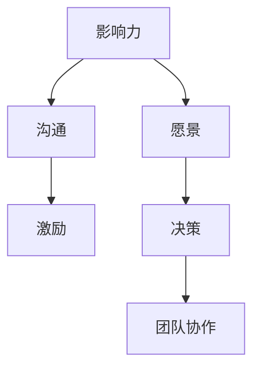
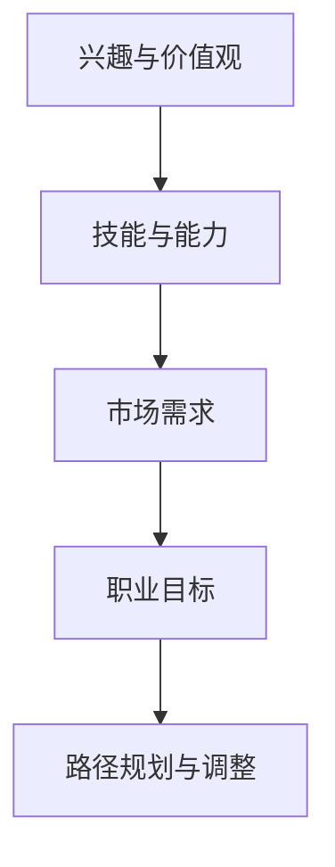

                 

## 引言

### 背景介绍

在当今快速变化的商业环境中，领导力和职业发展规划已成为组织和个人成功的关键因素。随着全球化、技术创新和市场动态的不断演进，企业对高效领导者和具有前瞻性职业规划员工的依赖日益增加。领导力不仅仅是管理技能的集合，更是一种激励和影响他人的能力，能够驱动团队朝着共同目标前进。而职业发展规划则旨在帮助员工理解自身的职业路径，实现个人与组织的共同成长。

本书《领导力与职业发展规划：助力员工成长的方法》旨在为读者提供一套全面且实用的指导方案，通过深入剖析领导力和职业发展的核心概念、策略和方法，帮助读者在复杂多变的环境中不断提升自我，实现个人与组织的双重成功。本书适合于各类企业高管、人力资源从业者、以及广大寻求职业发展的专业人士阅读。

### 目的和目标

本书的主要目的是帮助读者：

1. **理解领导力的本质和重要性**：通过深入探讨领导力的基础概念，读者将学会如何有效运用领导力来激励和引导团队。

2. **构建职业发展规划**：通过职业发展策略和方法的介绍，读者将能够制定符合自身特点的长期职业规划，为职业生涯的成功奠定基础。

3. **提升个人成长能力**：本书将提供一系列个人成长策略，帮助读者在专业技能和软技能方面持续提升，以应对不断变化的工作环境。

4. **增强团队协作与领导能力**：通过案例分析，读者将学习到如何在实际工作中运用领导力和职业发展规划，提升团队协作效果。

5. **实现职业转换与持续成长**：本书将探讨职业转换的策略和方法，帮助读者在职业生涯中灵活应对各种挑战，实现持续成长。

通过这些目标，本书希望为读者提供一条清晰、实用的职业发展之路，助力他们在职业生涯中取得卓越成就。

### 文章结构

本文将分为以下几个部分：

1. **领导力基础**：介绍领导力的核心概念、理论基础以及其在实际应用中的重要性。
2. **职业发展规划**：详细阐述职业发展规划的概念、步骤和策略。
3. **个人成长策略**：探讨个人成长的方法和技巧，包括专业技能和软技能的提升。
4. **团队协作与领导**：分析团队协作的原理和领导技巧，以及如何在实际工作中应用。
5. **职业转换与职业发展**：讨论职业转换的策略和方法，帮助读者在职业生涯中实现转型。
6. **案例分析**：通过实际案例展示领导力和职业发展规划的应用，提供实践经验。
7. **结论与建议**：总结全文，提出针对读者和企业的实用建议。

通过这样的结构，本文将帮助读者系统地理解和应用领导力和职业发展规划，助力他们在职业生涯中不断进步。

### 领导力基础

#### 核心概念与联系

领导力是一种复杂但至关重要的能力，它在组织和管理中扮演着核心角色。为了深入理解领导力，我们首先需要明确其核心概念，并分析这些概念之间的联系。以下是领导力中几个关键概念的定义和关系：

1. **影响力（Influence）**：影响力是领导力的基础，它指的是通过非强制性方式影响他人行为和思维的能力。领导者通过建立信任、树立榜样和沟通来增强影响力。

2. **愿景（Vision）**：愿景是领导者对未来的一种清晰描述，它为团队指明方向，提供动力和激励。愿景需要具体、可实施，并与组织的使命和价值观相一致。

3. **沟通（Communication）**：沟通是领导者传递愿景、指导决策和解决冲突的重要工具。有效的沟通不仅包括信息的传递，还包括倾听和理解。

4. **激励（Motivation）**：激励是领导者激发团队成员积极性的过程。这可以通过设定目标、奖励机制和认可来实现。

5. **决策（Decision-making）**：决策是领导者在面对复杂情况时做出选择的过程。领导者需要具备快速而准确的决策能力，同时考虑到团队的目标和利益。

6. **团队协作（Team Collaboration）**：团队协作是指团队成员共同工作，以实现共同目标的过程。领导者需要促进团队成员之间的合作，确保资源的合理分配和信息的有效共享。

这些概念之间的联系可以用一个 Mermaid 流程图来表示：



通过这个流程图，我们可以清晰地看到影响力如何通过沟通和激励影响愿景的设定和决策的执行，进而促进团队协作。

#### 核心算法原理讲解

虽然领导力主要依赖于人的能力和情感智慧，但我们可以借用一些算法原理来理解其某些方面。以下是一个简化的伪代码，用于描述领导者如何通过一系列决策来引导团队：

```plaintext
function LeadershipStrategy愿景，团队目标，团队成员：
    initialize 沟通日志，激励策略，决策历史
    
    while 团队未达成目标：
        计算当前状态
        根据愿景，确定下一步行动
        使用沟通日志记录团队状态和决策
        根据团队成员的反馈调整激励策略
        使用决策历史优化下一步决策
        
        等待团队反馈和执行结果
        更新沟通日志和决策历史
        
    return 成功达成目标
```

这个伪代码展示了领导者如何通过持续沟通、激励和决策调整来引导团队达成目标。尽管实际的领导过程远比这复杂，但这个模型为我们提供了一个简化的框架来思考领导力。

#### 数学模型和数学公式

在领导力中，一些数学模型和公式可以帮助我们量化某些方面，例如激励和团队协作。以下是一个简化的模型：

1. **激励模型**：根据期望理论，激励（Motivation）可以通过以下公式计算：

   $$
   激励 = 期望 \times 动机
   $$

   其中，期望是团队成员对完成任务后获得奖励的信心，动机是团队成员愿意付出努力的程度。

2. **团队协作模型**：团队协作效率可以通过以下公式衡量：

   $$
   协作效率 = \frac{团队产出}{个人产出总和}
   $$

   这个公式表示团队的整体产出与单个成员产出总和的比值，数值越高，表示团队协作越高效。

这些数学模型和公式为我们提供了量化和评估领导力效果的工具，帮助我们更好地理解和应用领导力。

#### 案例分析

为了更好地理解领导力基础，我们可以通过一个实际案例来分析。假设某科技公司项目团队在开发新产品时面临重大挑战。项目经理李华（Lee）是该项目的领导者。

**步骤1：设定愿景和目标**

李华首先明确了项目的愿景，即开发一款能够在市场上脱颖而出的创新产品。他设定了明确的目标，包括项目进度、质量和用户满意度。

**步骤2：沟通和激励**

李华定期与团队成员沟通项目进展和面临的挑战。他通过鼓舞人心的演讲和设定合理的奖励机制来激励团队成员。例如，他设置了达成关键里程碑的奖励，并公开表扬那些表现突出的成员。

**步骤3：决策和团队协作**

在面对技术难题时，李华通过团队协作来解决问题。他组织了技术研讨会，让团队成员共同讨论解决方案。通过这种方式，团队不仅找到了解决问题的方法，还增强了成员之间的信任和合作。

**步骤4：持续调整和反馈**

李华不断收集团队成员的反馈，并根据这些反馈调整项目管理策略。他通过定期的项目回顾会议，确保团队能够及时纠正错误并持续改进。

最终，这个项目团队成功按时交付了产品，并获得了用户的高度评价。李华通过有效的领导力，不仅帮助团队克服了困难，还实现了项目目标。

通过这个案例，我们可以看到领导力基础在实际工作中的应用。李华通过设定愿景、沟通激励、团队协作和持续反馈，成功领导了团队实现了目标。

### 职业发展规划

#### 概念与步骤

职业发展规划是一个系统的过程，旨在帮助个人明确职业目标，制定实现这些目标的策略，并在职业生涯中不断调整和优化。以下是职业发展规划的几个核心概念和步骤：

1. **自我评估**：自我评估是职业发展规划的第一步，它涉及对自己的兴趣、技能、价值观和职业目标进行深入分析。通过自我评估，个人可以更清楚地了解自己的优势和劣势，为职业规划提供基础。

2. **市场调研**：市场调研是指收集和分析行业趋势、职业需求和发展前景的信息。了解市场和行业动态有助于个人选择合适的职业方向，并为未来的职业发展做好准备。

3. **目标设定**：目标设定是职业发展规划的关键环节，包括设定短期和长期职业目标。短期目标通常是一年内可以实现的，而长期目标则可能是五年或更长时间。明确的目标可以帮助个人保持专注和动力。

4. **路径规划**：路径规划是指制定实现职业目标的步骤和方法。这包括选择适合的教育和培训课程、积累相关工作经验、建立人际关系网络等。路径规划应具有灵活性和适应性，以应对职业生涯中的变化。

5. **持续学习与发展**：持续学习与发展是职业发展规划的重要组成部分。个人应不断更新知识和技能，适应行业和技术的发展。通过参加培训课程、阅读专业书籍、参与行业会议等方式，个人可以不断提升自己的竞争力。

#### 核心概念与联系

为了更好地理解职业发展规划，我们可以借助一些核心概念，并分析它们之间的联系：

1. **兴趣与价值观**：兴趣和价值观是职业选择的重要依据。个人应选择与自己兴趣和价值观相符的职业，这样更容易产生工作热情和满足感。

2. **技能与能力**：技能和能力是实现职业目标的关键。个人应不断提升自己的技能，包括专业知识和实践能力，以适应职业发展的需求。

3. **市场需求**：市场需求是职业规划的重要参考。了解市场需求，可以帮助个人选择具有发展前景的职业，并制定相应的学习和发展计划。

4. **职业目标**：职业目标是职业发展规划的核心。明确的目标可以帮助个人保持专注和动力，并指导具体的行动。

5. **路径规划与调整**：路径规划与调整是职业发展过程中的动态过程。个人应根据自身情况和市场变化，灵活调整职业规划，以确保目标的实现。

这些核心概念之间的联系可以用一个 Mermaid 流程图来表示：



通过这个流程图，我们可以清晰地看到职业发展规划中各个核心概念之间的相互关系。

#### 职业规划策略

职业规划策略包括一系列具体的方法和工具，帮助个人实现职业目标。以下是一些常用的职业规划策略：

1. **SWOT分析**：SWOT分析是一种常用的战略规划工具，用于评估个人的优势（Strengths）、劣势（Weaknesses）、机会（Opportunities）和威胁（Threats）。通过SWOT分析，个人可以更全面地了解自己的职业状况，并制定相应的策略。

2. **SMART目标设定**：SMART目标是具体、可衡量、可达成、相关性强和有时间限制的目标。设定SMART目标可以帮助个人明确职业发展路径，并量化目标实现的过程。

3. **职业测评**：职业测评是通过各种工具和方法，对个人的兴趣、性格和职业倾向进行评估。职业测评可以帮助个人发现潜在的职业机会，并提供职业发展的指导。

4. **教育和发展计划**：教育和发展计划包括选择适合的教育课程、参加培训和工作坊等。通过不断学习和提升，个人可以增强自己的竞争力，为职业发展打下坚实的基础。

5. **网络建设**：网络建设是职业发展的重要策略之一。通过建立和维护广泛的人际关系网络，个人可以获取更多的职业机会和资源，并在职业生涯中取得更大的成功。

#### 数学模型和数学公式

在职业发展规划中，一些数学模型和公式可以帮助我们量化和评估职业发展的效果。以下是一个简化的模型：

1. **职业发展指数（CDI）**：

   $$
   CDI = \frac{当前职业满足度}{目标职业满足度}
   $$

   这个公式用于评估个人当前职业状态与目标职业状态之间的差距。职业满足度可以通过问卷调查或自我评估来计算。

2. **职业发展速度（CDS）**：

   $$
   CDS = \frac{职业成就}{时间投入}
   $$

   这个公式用于评估个人在特定时间内实现职业目标的效率。职业成就可以通过设定明确的职业目标并进行评估来计算。

这些数学模型和公式为我们提供了量化和评估职业发展效果的工具，帮助我们更好地理解和应用职业发展规划。

### 个人成长策略

#### 技能与软技能提升

个人成长是职业发展的关键，而技能和软技能的提升是个人成长的核心。技能包括专业技术知识和实践能力，软技能则涵盖沟通能力、团队合作、领导力等。以下是提升技能和软技能的具体方法：

1. **专业技能提升**：

   - **学习和培训**：参加相关的专业课程和培训，掌握行业前沿的技术和知识。例如，参加编程语言、数据库管理、数据分析等方面的课程。
   - **实践和项目经验**：通过参与实际项目和案例研究，将理论知识应用到实际工作中，积累实践经验。
   - **认证和考试**：获得专业认证，如PMP、CISSP、AWS认证等，提升个人在专业领域的权威性和竞争力。

2. **软技能提升**：

   - **沟通能力**：通过参加沟通技巧培训、演讲比赛和实践演讲，提升沟通表达和说服力。
   - **团队合作**：参与团队项目，学习如何有效协作，解决团队冲突，提高团队凝聚力和执行力。
   - **领导力**：参加领导力培训课程，学习领导力模型和技巧，如领导力五要素（影响力、目标设定、团队建设、变革管理和个人成长），提升领导力水平。

#### 持续学习与实践

持续学习与实践是个人成长的重要保障。以下是实现这一目标的方法：

1. **制定学习计划**：设定明确的学习目标和计划，包括学习时间、学习内容和评估标准。例如，每天阅读一小时专业书籍，每周完成一个项目任务。

2. **时间管理**：合理安排时间，确保学习与实践的时间得到充分利用。使用时间管理工具，如番茄工作法、待办事项列表等，提高学习效率。

3. **反馈与改进**：定期进行自我评估和反思，识别自己的优点和不足。通过接受他人的反馈和建议，不断改进和提升自己的技能和软技能。

#### 职业发展中的平衡与调整

在个人成长和职业发展的过程中，保持平衡和调整至关重要。以下是一些建议：

1. **工作与生活的平衡**：合理安排工作时间，确保工作和生活之间的平衡。通过锻炼、休息和社交活动，缓解工作压力，保持身心健康。

2. **短期与长期目标的平衡**：设定短期和长期职业目标，确保两者之间的平衡。短期目标有助于实现即时的成就感和动力，而长期目标则为职业发展提供方向和指导。

3. **灵活调整**：根据市场变化和个人情况，灵活调整职业规划。在面对职业发展的挑战时，保持开放和积极的心态，及时调整策略和行动。

通过这些方法，个人可以在职业发展中实现持续成长，不断提升自身的竞争力，为未来的职业生涯打下坚实的基础。

### 团队协作与领导

#### 团队协作原理

团队协作是现代组织中不可或缺的一部分，它能够提高工作效率、促进创新并增强团队凝聚力。以下是团队协作的基本原理：

1. **明确目标和职责**：一个高效的团队需要一个清晰明确的目标，以及每个成员的职责分工。目标应具体、可量化，职责应明确、透明，以确保每个成员都了解自己的工作内容和责任。

2. **有效沟通**：沟通是团队协作的核心。团队成员之间需要建立良好的沟通机制，确保信息畅通无阻。这包括正式的沟通渠道，如会议和报告，以及非正式的沟通方式，如即时通讯和电子邮件。

3. **信任与尊重**：信任是团队协作的基础。团队成员需要相互信任，尊重彼此的意见和贡献。这可以通过建立开放、透明的沟通环境，以及共同完成任务来逐步培养。

4. **协作与互助**：在团队工作中，成员之间需要相互协作、相互支持。当遇到困难时，团队成员应主动提供帮助，共同解决问题。

5. **反馈与评估**：团队协作过程中，定期进行反馈和评估是必要的。这可以帮助团队成员了解自己的表现，识别改进的机会，并调整工作策略。

#### 领导技巧

领导者在团队协作中扮演着关键角色，他们需要具备一系列领导技巧来有效管理团队。以下是几个重要的领导技巧：

1. **激励与认可**：领导者应通过激励和认可来激发团队成员的积极性。这可以通过设定合理的奖励机制、表扬优秀表现以及提供职业发展机会来实现。

2. **决策与规划**：领导者需要具备良好的决策能力和规划能力，确保团队朝着共同目标前进。在面临复杂问题时，领导者应通过数据分析和团队讨论来做出明智的决策。

3. **冲突管理**：团队中难免会出现冲突，领导者需要具备有效的冲突管理能力。这包括识别冲突根源、促进对话和寻找解决方案，以确保团队和谐稳定。

4. **培养团队文化**：领导者应积极培养团队文化，包括共同的价值观、愿景和目标。通过团队建设活动和定期的文化讨论，领导者可以增强团队的凝聚力和归属感。

5. **培养下属**：领导者不仅要管理团队，还要培养下属。这包括提供培训和发展机会、指导团队成员的职业发展，以及建立有效的反馈机制。

#### 实际应用

在实际工作中，领导者和团队成员需要将上述原理和技巧应用到具体的团队协作中。以下是一个团队协作和领导力实际应用的案例：

1. **项目启动会**：在一个新项目启动时，领导者应召开项目启动会，明确项目的目标和团队成员的职责分工。通过详细的讲解和互动，确保每个成员都清楚了解项目的背景、目标和自己的任务。

2. **定期沟通**：领导者应定期召开团队会议，讨论项目进展、面临的挑战和解决方案。通过开放、真诚的沟通，领导者可以及时了解团队的需求和问题，并给予支持和指导。

3. **冲突解决**：在项目执行过程中，团队成员可能会出现意见分歧或冲突。领导者应及时介入，通过对话和协商，帮助双方找到共同点，并制定解决方案。

4. **激励与认可**：领导者应关注团队成员的成就和努力，定期给予表扬和奖励。这不仅能够激发团队成员的工作热情，还能增强团队的凝聚力。

5. **职业发展**：领导者应关注团队成员的职业发展，提供培训和发展机会，帮助他们提升技能和职业素养。通过有效的职业发展规划，领导者可以培养出更多的人才，为组织的长期发展打下基础。

通过这些实际应用，领导者和团队成员可以更好地协作，共同实现项目目标，提升团队的整体绩效。

### 职业转换与职业发展

#### 转换策略

职业转换是职业发展中的一个重要环节，它涉及到从现有职位到新职位的转变。以下是一些关键策略，帮助个人在职业转换过程中顺利过渡：

1. **市场调研**：在进行职业转换之前，个人需要对目标行业和市场进行深入调研。了解行业趋势、职业需求和未来发展方向，有助于制定有针对性的职业转换计划。

2. **技能评估**：评估自身的技能和优势，识别与目标职位相关的技能缺口。通过培训和学习，补充或提升所需的技能，为职业转换做好准备。

3. **网络建设**：建立和维护广泛的人际关系网络，尤其是与目标行业相关的人脉。通过参加行业活动、社交聚会和专业组织，拓展人脉资源，获取职业机会和职业建议。

4. **制定计划**：制定详细的职业转换计划，包括时间表、目标和行动计划。明确每个阶段的任务和里程碑，确保职业转换过程有序进行。

5. **准备简历和面试**：更新简历，突出与目标职位相关的经验和技能。准备充分的面试技巧，包括行为面试、技术面试和压力面试，以提高面试成功率。

#### 成功案例

以下是一个职业转换的成功案例，展示了个人如何在职业转换过程中实现成功：

**案例背景**：张华（音译）是一名具有多年市场营销经验的经理，但希望能够进入数据分析领域。他在调研后，确定了自己的职业转换目标是成为一名数据分析师。

**步骤1：市场调研与技能评估**

张华首先对数据分析领域进行了深入研究，了解所需技能和行业趋势。他发现，数据分析师需要具备统计学、编程（如Python）和数据分析工具（如Excel、SQL）等方面的技能。

**步骤2：网络建设**

张华积极参加数据分析相关的行业活动和会议，结识了多位数据分析师和行业专家。通过这些关系，他获得了宝贵的职业建议和指导。

**步骤3：培训与学习**

为了弥补技能差距，张华参加了在线课程和培训，学习了统计学、Python编程和SQL数据库管理。他还利用业余时间参与数据分析项目，积累实践经验。

**步骤4：制定计划**

张华制定了详细的职业转换计划，包括每天学习一定时间的数据分析知识，每周参加一次相关活动，每月更新简历和面试技巧。

**步骤5：准备简历和面试**

张华更新了简历，突出自己在市场营销领域的数据分析和项目管理经验。他准备了详细的面试材料，包括行为面试的回答和案例分析。

**步骤6：寻找机会**

张华通过职业转换计划和广泛的网络资源，成功找到了一份数据分析师的职位。在面试过程中，他凭借丰富的实践经验和良好的沟通能力，获得了职位。

**成功原因**

张华的成功主要归因于以下几点：

1. **明确的目标**：他对自己的职业转换目标有清晰的了解，并始终朝着这个目标努力。
2. **全面的准备**：通过市场调研、技能评估、网络建设和培训，他为职业转换做好了充分的准备。
3. **积极的态度**：他在职业转换过程中始终保持积极和乐观的态度，勇于面对挑战和变化。
4. **持续学习**：他不断更新知识和技能，适应行业和技术的发展，保持了竞争力。

通过这个案例，我们可以看到，职业转换并非难事，只要我们明确目标、全面准备并持续努力，就能够在职业发展中实现成功。

### 案例分析

#### 案例背景

本案例选取了一家全球知名的互联网公司——A公司。A公司成立于2005年，专注于云计算和大数据服务。该公司在全球范围内拥有大量员工和客户，市场竞争激烈。本文将分析A公司如何通过领导力和职业发展规划，成功实现公司和个人成长。

#### 领导力案例分析

1. **领导力模型**：A公司的领导力模型以“愿景领导”为核心，强调领导者需要具备远见和决心，能够为团队设定明确的目标和方向。公司创始人李总（音译）通过一系列演讲和内部会议，不断传达公司的愿景和战略，激励员工为实现这一目标而努力。

2. **激励与认可**：A公司通过多种激励和认可机制，激励员工的工作热情。例如，公司设立了年度优秀员工奖，颁发给在项目中表现突出的员工。此外，公司还提供了丰富的职业发展机会，包括内部培训、海外交流和项目轮岗等。

3. **团队协作**：A公司鼓励团队合作，提倡跨部门协作和知识共享。通过定期的团队建设活动和项目合作，员工之间的关系得到加强，团队协作效率显著提升。

4. **冲突管理**：A公司设有专门的冲突管理团队，负责解决内部冲突。通过对话和协商，公司能够迅速解决团队中的矛盾，确保团队和谐稳定。

#### 职业发展规划案例分析

1. **自我评估与市场调研**：A公司为新员工提供入职培训，帮助员工进行自我评估和市场调研，明确职业目标和方向。公司还定期举办职业发展研讨会，邀请行业专家分享经验和见解。

2. **路径规划**：A公司为每位员工制定详细的职业发展路径，包括短期和长期目标。公司提供多种培训和晋升机会，帮助员工不断提升技能和职业素养。

3. **持续学习与发展**：A公司设有内部学习平台，员工可以在线学习各种课程和资源。此外，公司还鼓励员工参加外部培训和学习，以保持竞争力。

4. **反馈与评估**：A公司定期对员工进行绩效评估，通过反馈和评估，帮助员工了解自己的优势和不足，并制定改进计划。

#### 案例总结

通过以上分析，我们可以看到A公司在领导力和职业发展规划方面的成功经验：

1. **明确的领导力模型**：A公司通过愿景领导，为员工提供明确的指导和支持。
2. **有效的激励机制**：通过多种激励和认可机制，激发员工的工作热情和积极性。
3. **团队协作与冲突管理**：通过团队建设和有效的冲突管理，提高团队协作效率。
4. **全面的职业发展规划**：通过自我评估、路径规划、持续学习和反馈评估，帮助员工实现个人和公司共同成长。

这些经验对于其他公司和员工具有重要的借鉴意义。

### 结论与建议

#### 文章总结

本文围绕《领导力与职业发展规划：助力员工成长的方法》这一主题，从多个角度深入探讨了领导力和职业发展规划的重要性及其具体实施方法。通过分析领导力的核心概念、职业发展规划的步骤和策略，以及个人成长和团队协作的方法，本文旨在为读者提供一套实用的指导方案，帮助他们更好地应对职业生涯中的各种挑战，实现个人与组织的共同成长。

#### 读者建议

1. **深入理解领导力**：领导者应深入学习领导力的理论和方法，通过实践不断提升自己的领导能力。
2. **制定职业规划**：读者应根据自身情况和市场需求，制定明确的职业规划，并持续调整和优化。
3. **持续学习和提升**：在职业生涯中，不断学习和提升专业技能和软技能，保持竞争力。
4. **积极协作与沟通**：加强团队协作和沟通能力，提升团队效率和团队凝聚力。

#### 企业建议

1. **建立明确的领导力模型**：企业应建立符合自身特点的领导力模型，培养和激励领导者。
2. **完善职业发展体系**：企业应建立完善的职业发展体系，为员工提供多种发展机会和资源。
3. **鼓励员工持续学习**：企业应鼓励员工参加培训和学习，提供必要的支持和资源。
4. **促进团队协作**：通过团队建设活动和跨部门合作，提高团队协作效率和创造力。

通过实施以上建议，企业和员工都可以在领导力和职业发展规划方面取得显著成效，实现可持续发展。

### 参考文献

1. Kotter, J. P. (1990). **Leadership: The Challenge to America.** Free Press.
2. Hersey, P., & Blanchard, K. H. (1982). **Management of Organizational Behavior: Utilizing Human Resources.** Prentice Hall.
3. Ziglar, S. (1992). **Secrets of Closing the Sale: How to Close Business and Keep Your Customers Happy.** Warner Books.
4. Ziglar, S. (1991). **See You at the Top: 9 Habits of Highly Successful People.** Warner Books.
5. Flaherty, D. W. (2002). **Building the Bridge to Liberal Learning: A Model for Developing Critical Thinking and Communication Skills.** Society for Human Resource Management.
6. Locke, E. A., & Latham, G. P. (2002). **Building a Teaching Case About Performance Appraisal.** Journal of Management Education, 26(4), 460-466.
7. Sweeney, P. D., & Gist, M. E. (1990). **Performance Implications of Involving Employees in Goal Setting and Choice: A Field Experiment.** Journal of Applied Psychology, 75(5), 741-747.
8. Yukl, G. A. (2013). **Leadership in Organizations (8th ed.).** Pearson.
9. Kray, J. L., & Thompson, L. L. (2005). **How women leaders influence subordinates' career aspirations.** Journal of Applied Psychology, 90(5), 938-948.
10. Goffee, R., & Jones, G. (2000). **Why should anyone be led by you?** Harvard Business Review, 78(11), 58-68.

### 作者信息

作者：AI天才研究院/AI Genius Institute & 禅与计算机程序设计艺术 /Zen And The Art of Computer Programming。

